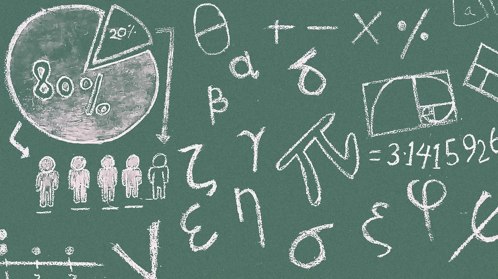

# Today's Learning Goals

## By the end of this lecture, we will be able to...

- Calculate conditional distributions when given a full distribution.
- Obtain the marginal mean from conditional means and marginal probabilities, using the Law of Total Expectation.
- Use the Law of Total Probability to convert between conditional, marginal distributions, and joint distributions.
- Compare and contrast independence versus conditional independence.

# Outline

1. Univariate Conditional Distributions
2. Multivariate Conditional Distributions
3. Conditional Independence

## 1. Univariate Conditional Distributions

> Probability distributions describe an uncertain outcome, but what if we have partial information?

{fig-align="center" width=15%}


### Example: Length of Stay Versus Gang Demand

- Consider the example of ships arriving at the port of Vancouver again. 
- Each ship will stay at port for a random number of days, which we will call the <span style="color: purple;">length of stay ($\text{LOS}$)</span>.

{fig-align="center" width=20%}

#### Probability Mass Function (PMF) of Length of Stay

- For the sake of our notation, let $L$ denote the $\text{LOS}$, which has the following distribution:

```{r}
#| echo: false
#| fig-width: 11.5
#| fig-height: 7

library(tidyverse)
library(kableExtra)

LOS <- tribble(
  ~ ndays, ~ p,
  1, 0.25,
  2, 0.35,
  3, 0.2,
  4, 0.1,
  5, 0.1
)
LOS_PMF <- kable(LOS,
  col.names = c("L (Days)", "Probability"),
  align = "cc") %>%
  kable_styling(font_size = 40) 
LOS_PMF
```

#### PMF of Length of Stay as a Bar Chart

```{r}
#| echo: false
#| fig-width: 11.5
#| fig-height: 7

library(tidyverse)

ggplot(LOS, aes(ndays, p)) +
  geom_col(fill = "orangered3") +
  labs(
    x = "L (Days)",
    y = "Probability"
  ) +
  theme_bw() +
  theme(plot.title = element_text(size = 25, face = "bold"),
    axis.text = element_text(size = 23),
    axis.title = element_text(size = 23, face = "bold")) 
```

#### Conditional Probability

{.absolute top="-60" right="40" width="35%"}

<br>

- Let $A$ and $B$ be two events of interest within the sample $S$, and $P(B) > 0$, then the <span style="color: purple;">conditional probability</span> of $A$ given $B$ is defined as:
$$P(A \mid B) = \frac{P(A \cap B)}{P(B)}.$$

. . .

- Event $B$ is becoming the new sample space (note that $P(B \mid B) = 1$).

#### Graphically...

$$P(A \mid B) = \frac{P(A \cap B)}{P(B)}$$

```{r}
#| echo: false
#| fig-width: 11.5
#| fig-height: 3.5

library(eulerr)

AB_venn <- euler(c("A" = 0.75, "B" = 0.75, "A&B" = 0.1))

plot(AB_venn,
  quantities = FALSE,
  fills = c("rosybrown1", "lightsteelblue1"),
  labels = list(cex = 1.2),
  main = "\n Sample Space S"
)
```

#### Another depiction...

$$P(A \mid B) = \frac{P(A \cap B)}{P(B)} = \frac{P(A)}{P(B)}$$

```{r}
#| echo: false
#| fig-width: 11.5
#| fig-height: 4.5

q4_venn <- euler(c("B" = 0.08, "A&B" = 0.03))

plot(q4_venn,
  quantities = FALSE, fills = c("lightsteelblue1", "rosybrown1"),
  labels = list(cex = 1.5),
  main = "\n Sample Space S"
)
```

#### Conditional Probability Distribution

{.absolute top="-60" right="0" width="35%"}

<br>

- A conditional probability distribution of event $A$ given $B$ is a <span style="color: purple;">proper probability distribution</span> for event $A$ after observing event $B$.

. . .

- This distribution is restricted to the subsample space provided by event $B$.

#### Goin back to the ships!

{.absolute top="-60" right="0" width="35%"}

<br>

- Suppose a ship has been at port for 2 days now, and it will be staying longer. <span style="color: purple;">This means that we know that $L$ will be greater than 2.</span> 

. . .

- What is the distribution of the $\text{LOS}$ now? Using symbols, this is written as
$$P(L = l \mid L > 2).$$

#### Applying Conditional Concepts

{.absolute top="-60" right="0" width="35%"}

<br>

::: incremental
- $P(L = 3 \mid L > 2)$, is a <span style="color: purple;">conditional probability</span>, 
- and the whole distribution, $P(L = l \mid L > 2)$ for all $l$, is called a <span style="color: purple;">conditional probability distribution</span>.
- Therefore:
$$\displaystyle \sum_{l = 3}^5 P(L = l \mid L > 2) = 1.$$
:::

### 1.1. Table Approach

<br>

We will follow these steps:

::: incremental
1. Subset the PMF table to those outcomes that satisfy the <span style="color: purple;">condition</span> $L > 2$ (we will have a "sub-table").
2. Re-normalize the remaining probabilities so that they add up to 1. We will end up with the <span style="color: purple;">conditional distribution</span>.
:::

#### Recall the original PMF in our ship example!

{.absolute top="-10" right="-60" width="35%"}

<br>
<br>

```{r}
#| echo: false
#| fig-width: 11.5
#| fig-height: 7

LOS_PMF
```

#### First Step of Re-normalization

- Now that we know $L > 2$, we have to "delete" some of these options:

| L (Days) | Probability |
|:---:|:------:|
| 1 | IMPOSSIBLE |
| 2 | IMPOSSIBLE  |
| 3 | Used to be 0.20 |
| 4 | Used to be 0.10 |
| 5 | Used to be 0.10 |

#### Second Step of Re-normalization

{.absolute top="-60" right="0" width="35%"}

<br>

- We scale (or re-normalize) their corresponding probabilities up to bigger values so that <span style="color: purple;">they all add up to 1 again</span>.

. . .

- In this case,

$$0.20 + 0.10 + 0.10 = 0.40.$$

#### Re-normalized Table

{.absolute top="280" right="-70" width="30%"}

- If we divide all the probabilities by $0.4$, we will be good to go:

| L (Days) | Probability |
|:---:|:------:|
| 1 | 0 |
| 2 | 0  |
| 3 | 0.50 |
| 4 | 0.25 |
| 5 | 0.25 |

### 1.2. Formula Approach

{.absolute top="-80" right="0" width="35%"}

<br>

- Let us use the conditional probability formula:
\begin{align*}
P(L = l \mid L > 2) &= \frac{P(L = l \cap L > 2)}{P(L > 2)} = \frac{P(L = l)}{P(L > 2)} \\
& \qquad \qquad \qquad\qquad \quad \text{for} \quad l = 3, 4, 5.
\end{align*}

#### Checking the Numerator

{.absolute top="-60" right="0" width="35%"}

<br>

::: incremental
- How did we reduce the convoluted event $L = l \cap L > 2$ to the simple event $L = l$ for $l = 3, 4, 5$?
- We go through all outcomes and check which ones satisfy the requirement 
$$L = l \cap L > 2.$$ 
- This reduces to $L = l$, as long as $l = 3, 4, 5$.
:::

#### Applying the Formula

{.absolute top="-60" right="0" width="35%"}

::: incremental
- Let us recheck the formula:
\begin{align*}
P(L = l \mid L > 2) &= \frac{P(L = l)}{P(L > 2)} \\
& \qquad \qquad \qquad\qquad \quad \text{for} \quad l = 3, 4, 5.
\end{align*}
- The math is telling us to do the "re-normalizing." 
- For all cases satisfying the condition, we would divide by
\begin{align*}
P(L > 2) &= P(L = 3) + P(L = 4) + P(L = 5) \\
&= 0.20 + 0.10 + 0.10 = 0.40.
\end{align*}
:::

#### Finally...

{.absolute top="-60" right="0" width="35%"}

<br>

\begin{gather*}
P(L = 3 \mid L > 2) = \frac{P(L = 3)}{P(L > 2)} = \frac{0.20}{0.40} = 0.50 \\
P(L = 4 \mid L > 2) = \frac{P(L = 4)}{P(L > 2)} = \frac{0.10}{0.40} = 0.25 \\
P(L = 5 \mid L > 2) = \frac{P(L = 5)}{P(L > 2)} = \frac{0.10}{0.40} = 0.25.
\end{gather*}

- Both approaches, table and formula, are equivalent!

## 2. Multivariate Conditional Distributions

<br>

::: incremental
- So far, we have considered conditioning in the one-variable (i.e., univariate) case. 
- However, it is more useful to think about the distribution of one random variable <span style="color: purple;">when conditioned on a different random variable</span>.
:::

### Cargo ships come again!

{.absolute top="-60" right="0" width="35%"}

<br>

- Let us revisit our 2-variable example where we looked at both the $\text{LOS}$ (i.e., $L$) and the number of $\text{Gangs}$ required (i.e., $G$):

```{r}
#| echo: false

raw_data <- data.frame(
  LOS = c(rep(1, 4), rep(2, 4), rep(3, 4), rep(4, 4), rep(5, 4)), Gangs = rep(1:4, 5),
  Probability = c(
    0.00170, 0.04253, 0.12471, 0.08106,
    0.02664, 0.16981, 0.13598, 0.01757,
    0.05109, 0.11563, 0.03203, 0.00125,
    0.04653, 0.04744, 0.00593, 0.00010,
    0.07404, 0.02459, 0.00135, 0.00002
  )
)

joint_distribution <- raw_data %>%
  mutate(
    LOS = str_c("L = ", LOS),
    Gangs = str_c("G = ", Gangs)
  ) %>%
  pivot_wider(id_cols = LOS, names_from = Gangs, values_from = Probability) %>%
  column_to_rownames("LOS") %>%
  as.matrix()
```

```{r}
kable(round(joint_distribution, 4), align = "cccc") %>%
  kable_styling(font_size = 30) %>%
  column_spec(1, bold = TRUE)
```

### Conditioning $G$ on $L$

<br>

- Suppose a ship is arriving, and they have told you <span style="color: purple;">they will only be staying for 1 day</span>. 
- What is the distribution of $G$ under this information for all possible $g$?
$$P(G = g \mid L = 1).$$

### 2.1. Table Approach

{.absolute top="-60" right="0" width="35%"}

<br>

We will follow these steps:

. . .

1. We isolate the outcomes satisfying the condition ($L = 1$):

```{r}
semi_joint_distribution <- joint_distribution
semi_joint_distribution[1, ] <- paste(
  "Used to be",
  round(semi_joint_distribution[1, ], digits = 4)
)
semi_joint_distribution[2:5,] <- "IMPOSSIBLE"
kable(semi_joint_distribution, align = "cccc") %>%
  kable_styling(font_size = 28) %>%
  column_spec(1, bold = TRUE)
```

#### Then...

{.absolute top="-60" right="0" width="35%"}

<br>

2. We re-normalize the probabilities so that they add up to 1, by dividing them by their sum, which is $0.25$:
$$0.0017 + 0.0425 + 0.1247 + 0.0811 = 0.25.$$

```{r}
joint_distribution_cond_los <- (round(joint_distribution[1, , drop = FALSE] / sum(joint_distribution[1, ]), 4))
kable(joint_distribution_cond_los, align = "cccc") %>%
  kable_styling(font_size = 28) %>%
  column_spec(1, bold = TRUE)
```

#### Comparing versus the marginal distribution of the number of $\text{Gangs}$ $G$: 

```{r}
kable(joint_distribution_cond_los, align = "cccc") %>%
  kable_styling(font_size = 28) %>%
  column_spec(1, bold = TRUE)
```

<br>

```{r}
G_marginal <- matrix(c(0.2, 0.4, 0.3, 0.1), nrow = 1, ncol = 4)
kable(G_marginal, digits = 4, col.names = str_c("G = ", 1:4), row.names = FALSE) %>%
  kable_styling(font_size = 28)
```

```{r}
#| fig-width: 11.5
#| fig-height: 3

melted_joint_distribution <- data.frame(
  LOS = c(rep(1, 4), rep(2, 4), rep(3, 4), rep(4, 4), rep(5, 4)), Gangs = rep(1:4, 5),
  p = c(
    0.00170, 0.04253, 0.12471, 0.08106,
    0.02664, 0.16981, 0.13598, 0.01757,
    0.05109, 0.11563, 0.03203, 0.00125,
    0.04653, 0.04744, 0.00593, 0.00010,
    0.07404, 0.02459, 0.00135, 0.00002
  )
)

j_compare <- melted_joint_distribution %>%
  group_by(Gangs) %>%
  summarize(
    Marginal = sum(p),
    Conditional = p[LOS == 1]
  ) %>%
  mutate(Conditional = Conditional / sum(Conditional)) %>%
  pivot_longer(
    cols = c("Marginal", "Conditional"),
    names_to = "type",
    values_to = "p"
  )
ggplot(j_compare, aes(Gangs, p)) +
  facet_wrap(~type) +
  geom_col(fill = "palegreen3") +
  theme_bw() +
  labs(
    x = "Number of Gangs (G)",
    y = "Probability"
  ) +
  theme(axis.text = element_text(size = 14),
    axis.title = element_text(size = 14, face = "bold"),
    strip.text.x = element_text(size = 15, face = "bold"))
```

#### How about the expected values of $\text{Gangs}$?

::: incremental
- <span style="color: purple;">Originally via the respective marginal probabilities</span>:
\begin{align*}
\mathbb{E}(G) &= 1(0.2) + 2(0.4) + 3(0.3) + 4(0.1) \\
&= 2.3.
\end{align*}
- After conditioning on $L = 1$, we can obtain the <span style="color: purple;">conditional expectation</span>:
\begin{align*}
\mathbb{E}(G \mid L = 1) &= 1(0.0068) + 2(0.1701) + \\
& \qquad 3(0.4988) + 4(0.3242) \\
&= 3.1406.
\end{align*}
:::

### 2.2. Formula Approach

{.absolute top="-60" right="0" width="35%"}

<br>

- By applying the formula for conditional probabilities, we get 
$$P(G = g \mid L = 1) = \frac{P(G = g \cap L = 1)}{P(L = 1)} \quad \text{for } g = 1, 2, 3, 4.$$

```{r}
kable(joint_distribution, align = "cccc") %>%
  kable_styling(font_size = 25) %>%
  column_spec(1, bold = TRUE)
```

#### Obtaining $P(L = 1)$

{.absolute top="-60" right="0" width="35%"}

<br>

<br>

\begin{align*}
P(L = 1) &= P(G = 1 \cap L = 1) + P(G = 2 \cap L = 1) + \\
& \qquad P(G = 3 \cap L = 1) + P(G = 4 \cap L = 1) \\
&= 0.0017 + 0.0425 + 0.1247 +  0.0811 \\ 
&= 0.25.
\end{align*}

#### Then, each element of the conditional PMF...

\begin{align*}
P(G = 1 \mid L = 1) &= \frac{P(G = 1 \cap L = 1)}{P(L = 1)} \\
&= \frac{0.0017}{0.25} \\
&= 0.0068.
\end{align*}

\begin{align*}
P(G = 2 \mid L = 1) &= \frac{P(G = 2 \cap L = 1)}{P(L = 1)} \\
&= \frac{0.0425}{0.25} \\
&= 0.1701.
\end{align*}

#### Finally...

\begin{align*}
P(G = 3 \mid L = 1) &= \frac{P(G = 3 \cap L = 1)}{P(L = 1)} \\
&= \frac{0.1247}{0.25} \\
&= 0.4988.
\end{align*}

\begin{align*}
P(G = 4 \mid L = 1) &= \frac{P(G = 4 \cap L = 1)}{P(L = 1)} \\
&= \frac{0.0811}{0.25} \\
&= 0.3242.
\end{align*}

#### Sanity Check

{.absolute top="-60" right="0" width="35%"}

<br>

- The previous four conditional probabilities are part of a <span style="color: purple;">proper conditional PMF</span>:
\begin{align*}
\sum_{g = 1}^4 P(G = g \mid L = 1) &= 0.0068 + 0.1701 + \\
& \qquad 0.4988 + 0.3242 \\
&= 1.
\end{align*}
- Both approaches, table and formula, are equivalent!

### 2.3. Independence and Conditional Probabilities

- Random variables $X$ and $Y$ are independent <span style="color: purple;">if and only if</span>
$$P(Y = y \cap X = x) = P(Y = y) \cdot P(X = x).$$

### Then...

- <span style="color: purple;">With conditional probabilities introduced:</span>
\begin{align*}
P(Y = y \mid X = x) &= \frac{P(Y = y \cap X = x)}{P(X = x)} \\
&= \frac{P(Y = y) \cdot P(X = x)}{P(X = x)} = P(Y = y).
\end{align*}

### 2.4. Law of Total Probability/Expectation

::: incremental
- Generally, <span style="color: purple;">a marginal mean can be computed from the conditional means</span> and the <span style="color: purple;">probabilities of the conditioning variable</span>. 
- We do it through the <span style="color: purple;">Law of Total Expectation</span> is
\begin{gather*}
\mathbb{E}_Y(Y) = \sum_x \mathbb{E}_Y(Y \mid X = x) \cdot P(X = x) \\
\mathbb{E}_Y(Y) = \mathbb{E}_X [\mathbb{E}_Y(Y \mid X)].
\end{gather*}
:::

#### Proceeding with the Cargo Ships!

- Suppose we have the following <span style="color: purple;">conditional means of gang request $G$ given the length of stay $D$ of a ship</span> as a <span style="color: purple;">model function</span>:

```{r}
#| fig-width: 11.5
#| fig-height: 4.5

j_cond <- melted_joint_distribution %>%
  group_by(LOS) %>%
  summarize(
    mean = round(sum(Gangs * p) / sum(p), 4),
    p_marg = sum(p)
  )
ggplot(j_cond, aes(LOS, mean)) +
  geom_point(color = "palegreen3", size = 2.5) +
  geom_line(color = "palegreen3", size = 1) +
  labs(x = "Length of Stay (L)",
       y = "Mean Gang Request (G) \nGiven Length of Stay (L)") +
  theme_bw() +
  theme(plot.title = element_text(size = 17, face = "bold"),
    axis.text = element_text(size = 16),
    axis.title = element_text(size = 16, face = "bold"),
    strip.text.x = element_text(size = 17, face = "bold")) +
  ggtitle("Conditioned Mean Number of Gangs (G) on Length of Stay (L)")
```

#### What if we want to compute a marginal expected gang request?

- The below table is based on the previous plot plus the marginal PMF of $L$:

```{r}
j_cond %>%
  knitr::kable(
    col.names = c("l (Days)", "E(G | L = l)", "P(L = l)"),
    align = "ccc"
  )
```

#### How can we compute $\mathbb{E}_G(G)$?

{.absolute top="-60" right="0" width="35%"}

<br>

- Multiplying the last two columns together, and summing, gives us the marginal expectation:

\begin{align*}
\mathbb{E}_G(G) &= \sum_l \mathbb{E}_G(G \mid L = l) \cdot P(L = l) \\
&= 2.3.
\end{align*}

#### iClicker Question

Answer **TRUE** or **FALSE**:

In general for two random variables $X$ and $Y$, $P(X = x \mid Y = y)$ is a normalized probability distribution in the sense that

$$\sum_x P(X = x \mid Y = y) = 1.$$

**A.** TRUE

**B.** FALSE

#### iClicker Question

Answer **TRUE** or **FALSE**:

In general for two random variables $X$ and $Y$, $P(X = x \mid Y = y)$ is a normalized probability distribution in the sense that

$$\sum_y P(X = x \mid Y = y) = 1.$$

**A.** TRUE

**B.** FALSE

#### iClicker Question

<br>

Answer **TRUE** or **FALSE**:

Let $X$ be a random variable with non-zero entropy and $Y$ be a random variable with zero entropy. Then, $X$ and $Y$ are independent.

<br>

**A.** TRUE

**B.** FALSE

#### In-Class Exercise

What is the expected gang request $G$ given that the ship captain says they will not be at port any longer than 2 days?

$$\mathbb{E}_G(G \mid L \leq 2).$$
```{r}
LOS_PMF %>%
  kable_styling(font_size = 18) 

kable(joint_distribution, align = "cccc") %>%
  kable_styling(font_size = 18) %>%
  column_spec(1, bold = TRUE)
```

## 3. Conditional Independence

- We have already discussed conditional distributions such as $P(Y \mid X)$. 
- However, here are a couple of important questions:

. . .

> Can the dependence/independence of random variables $X$ and $Y$ change if we condition on another random variable $Z$? 

. . .

> If random variables $X$ and $Y$ are independent, are they also independent given random variable $Z$?

### Not necessarily!

::: incremental
- Independence and <span style="color: purple;">conditional independence</span> are <span style="color: purple;">different</span>.
- Recall the <span style="color: purple;">marginal independence</span> definition:
$$P(X = x \cap Y = y) = P(X = x) \cdot P(Y = y).$$ 
- Now, for <span style="color: purple;">conditional independence</span>, $X$ and $Y$ are conditionally independent given $Z$ if and only if
\begin{align*}
P(X = x \cap Y = y \mid Z = z) &= P(X = x \mid Z = z) \cdot \\
& \qquad \quad P(Y = y \mid Z = z).
\end{align*}
:::

### Let us check an example!

{.absolute top="-60" right="0" width="25%"}

<br>

- Let $L$ be a student's lab grade in DSCI 551,
- $Q$ be a student's quiz grade in DSCI 551, and 
- $S$ represents whether the student majored in Statistics in their undergraduate studies.

### Joint PMF

| $\ell$ | $q$   | $s$ | $P(L = \ell \cap Q = q \cap S = s)$ |
|:--------:|:------:|:-----:|:-----------------------:|
| low     | low | yes  |  0.01                 |
| low     | high | yes  |  0.03                |
| high     | low | yes  |  0.03                 |
| high     | high | yes  |  0.09                 |
| low     | low | no  |    0.21                   |
| low     | high | no  |  0.21                 |
| high     | low | no  |  0.21                 |
| high     | high | no  |  0.21                 |

### Are $L$ and $Q$ independent?

- This question has nothing to do with $S$, so let us <span style="color: purple;">marginalize out</span> $S$:

| $\ell$ | $q$   | $P(L = \ell \cap Q = q)$|
|:--------:|:------:|:-----------------------:|
| low     | low |   0.22                 |
| low     | high  |  0.24                 |
| high     | low  |  0.24                 |
| high     | high  |  0.30                 |

### So, are $L$ and $Q$ independent?

- <span style="color: purple;">Apparently not.<span style="color: purple;"> 
- The marginal probabilities are
\begin{gather*}
P(L = \text{high}) = 0.54 \\
P(Q = \text{high}) = 0.54.
\end{gather*}
- But:
$$P(L = \text{high} \cap Q = \text{high}) = 0.30 \neq 0.54 \times 0.54.$$ 

### What about $L$ and $Q$ given $S$? Are they conditionally independent?

- The reasoning is: 

> <span style="color: purple;">If you already know that a person is (or is not) a Statistics major, then their lab and quiz grades are completely independent</span>.

. . .

- What we want to know is whether 
$$P(L = \ell \cap Q = q \mid S) = P(L = \ell \mid S)\cdot P(Q = q \mid S).$$ 

### Let us dig use the joint distribution of $L$, $Q$, and $S$ as an input!

- We will check this for both $S = \text{yes}$ and $S = \text{no}$.

. . .

- When <span style="color: purple;">$P(S = \text{yes}) = 0.16$</span>, we have:

| $\ell$ | $q$   | $P(L = \ell \cap Q = q \mid S = \text{yes})$ |
|:--------:|:------:|:-----:|
| low     | low |  0.01 / 0.16 = 0.0625                |
| low     | high | 0.03 / 0.16 = 0.1875             |
| high     | low | 0.03 / 0.16 = 0.1875                 |
| high     | high   | 0.09 / 0.16 = 0.5625         |

### Hence, formally:

\begin{gather*}
P(L = \text{low} \cap Q = \text{low} \mid S = \text{yes}) = \frac{0.01}{0.16} = 0.0625 \\
P(L = \text{low} \cap Q = \text{high} \mid S = \text{yes}) = \frac{0.03}{0.16} = 0.1875 \\
P(L = \text{high} \cap Q = \text{low} \mid S = \text{yes}) = \frac{0.03}{0.16} = 0.1875 \\
P(L = \text{high} \cap Q = \text{high} \mid S = \text{yes}) = \frac{0.09}{0.16} = 0.5625
\end{gather*}

### Checking Conditional Independence

- We can check that this distribution satisfies the definition of independence; e.g.:
$$P(L = \text{low} \cap Q = \text{low} \mid S = \text{yes}) = \frac{0.01}{0.16} = 0.0625$$ 
\begin{align*}
P(L = \text{low} \mid S = \text{yes}) & \\
\qquad \cdot P(Q = \text{low} \mid S &= \text{yes}) = \left( \frac{0.04}{0.16} \right) \left( \frac{0.04}{0.16} \right) \\
&= 0.0625 \\
&= P(L = \text{low} \cap Q = \text{low} \mid S = \text{yes})
\end{align*}

### Now for $S = \text{no}$!

- When <span style="color: purple;">$P(S = \text{no}) = 0.84$</span>, we have:
 
| $\ell$ | $q$   | $P(L = \ell \cap Q = q \mid S = \text{no})$ |
|:--------:|:------:|:-----:|
| low     | low |  0.21 / 0.84 = 0.25                 |
| low     | high | 0.21 / 0.84 = 0.25                 |
| high     | low | 0.21 / 0.84 = 0.25                     |
| high     | high   | 0.21 / 0.84 = 0.25             |

### Checking Conditional Independence Again

$$P(L = \text{low} \cap Q = \text{low} \mid S = \text{no}) = \frac{0.21}{0.084} = 0.25$$ 
\begin{align*}
P(L = \text{low} \mid S = \text{no}) & \\
\qquad \cdot P(Q = \text{low} \mid S &= \text{no}) = \left( \frac{0.42}{0.84} \right) \left( \frac{0.42}{0.84} \right) \\
&= 0.25 \\
&= P(L = \text{low} \cap Q = \text{low} \mid S = \text{no})
\end{align*}

### Finally...

::: incremental
- Note that we have to repeat the previous checking for the other level combinations of $L$ and $Q$ given $S = \text{yes}$ and $S = \text{no}$.
- That done, we can conclude the lab grade and quiz grade <span style="color: purple;">are not independent</span>, but they <span style="color: purple;">are conditionally independent</span> given information about whether the student was a Statistics major.
:::