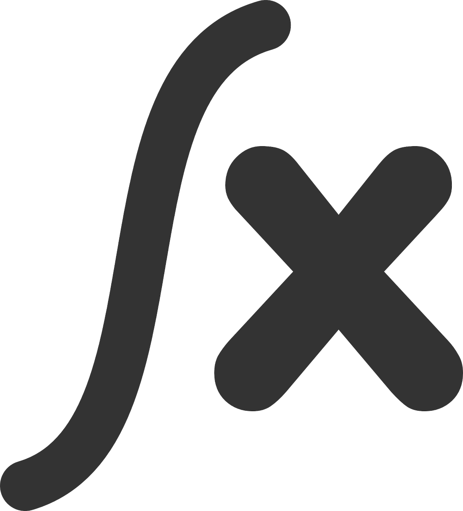
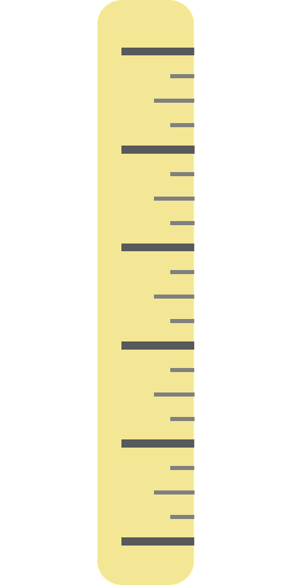

# Roadmap

- So far, everything we have done has been in the context of <span style="color: purple;">discrete random variables</span>.

. . .

<p align="center">

</p>

# Today's Learning Goals

## By the end of this lecture, we will be able to...

- Differentiate between continuous and discrete random variables.
- Interpret probability density functions and calculate probabilities from them.
- Calculate and interpret probabilistic quantities (mean, quantiles, prediction intervals, etc.) for a continuous random variable.

## And...

- Explain whether a function is a valid probability density function, cumulative distribution function, quantile function, and survival function.
- Calculate quantiles from a cumulative distribution function, survival function, or quantile function.

# Outline

1. Continuous Random Variables
2. How Heavy is a Tree?
3. Probability Density
4. Distribution Properties
5. Representing Distributions

## A Note on Integrals

{.absolute top="-60" right="0" width="10%"}

- Working with continuous random variables sometimes involves integrating some functions. 

. . .

- However, the most we will ever ask you to integrate are basic mathematical functions.

> **Heads-up:** The scope of these upcoming lectures is to understand probability concepts via continuous random variables rather than advanced Calculus.

## 1. Continuous Random Variables

{.absolute bottom="150" right="0" width="17%"}

<br>

. . .

> What is the current water level of the Bow River at Banff, Alberta?

. . .

> How tall is a tree?

. . .

> What about the current atmospheric temperature in Vancouver, BC?


### All the previous questions pertain to continuous cases!

{.absolute bottom="0" right="-180" width="25%"}

<br>

- A continuous random variable has <span style="color: purple;">uncountably infinite amount of outcomes</span>.

. . .

- Consider the variable continuous <span style="color: purple;">if the difference between neighbouring values is not a big deal</span>.

### A First Example

{.absolute top="-50" right="0" width="15%"}

```{r}
library(tidyverse)
source("supplementary/expense.R")
source("supplementary/ships.R")
source("supplementary/octane.R")
```

::: incremental
- You record your total monthly expenses each month. 

```{r}
expense_sample <- expense$sample %>%
  str_c("$", .)
```


- You end up with <span style="color: purple;">`r length(expense_sample)` months worth of data</span>.
:::
. . .

```{r}
expense_sample
```

. . .

- A difference of $\$0.01$ is not a big deal, thus we may treat this as a <span style="color: purple;">continuous random variable</span>: 
$$X = \text{Total monthly expenses.}$$

### A Second Example

{.absolute top="-70" right="0" width="10%"}

::: incremental
- Back in the day when Canada had pennies, some people liked to play "penny bingo", which involves winning and losing pennies.

```{r}
penny_n <- 10
```


- Here are your <span style="color: purple;">`r penny_n` net winnings</span>:
:::

. . .

```{r}
set.seed(4)
(rnorm(10, mean = 0, sd = 2.5) / 100) %>%
  round(2)
```

. . .

- Since a difference of a penny $\$0.01$ is a big deal, it is best to treat this as discrete.

## 2. How Heavy is a Tree?

{.absolute bottom="400" right="0" width="20%"}

::: incremental
- It depends on how tall the tree is! 
- Let us say the tree is $5 \text{ m}$ tall. How heavy is it? 
- Not all $5 \text{ m}$ trees are the same weight -- is the tree broad or thin?
- <span style="color: purple;">We cannot just say something like:</span>
:::

. . .

> "Every meter of the tree weighs $500 \text{ kg}$."

### We have a density instead!

{.absolute top="-40" right="0" width="12%"}

<br>

::: incremental
- The density of the tree, measured in $\text{kg/m}$, <span style="color: purple;">is a function that varies as you move up the tree</span>. 
- You can think of it as the weight of an infinitely thin slice of tree, divided by the thickness of that slice.
:::

### Graphically!

```{r}
#| echo: false
#| fig-width: 11.5
#| fig-height: 5.5

tree_density <- tibble(x = seq(0, 10, length = 1000), y = 500 - 4 * x^2)

tree_plot <- ggplot(tree_density, aes(x, y)) +
  geom_line(color = "palegreen4", linewidth = 1) +
  labs(x = "Height from Ground (m)",
       y = "Tree Density (kg/m)") +
  theme_bw() +
  theme(plot.title = element_text(size = 15, face = "bold"),
    axis.text = element_text(size = 14),
    axis.title = element_text(size = 14, face = "bold")) +
  ggtitle("Tree Density Function")
tree_plot
```

### What if we want to obtain the total weight of the tree?

- We would take the <span style="color: purple;">integral</span> of the density function $f(x)$:

$$\int_0^{10} f(x) \text{d}x.$$

. . . 

> What if I asked you how much the tree weighs at a height equal to $5 \text{ m}$?

- The tree only has a density at a height equal to $5 \text{ m}$!

### The tree weight at $5 \text{ m}$ is equal to zero!

- The weight between heights $a$ and $b$ is 

$$\int_a^b f(x) \text{d}x.$$ 

- Thus, the weight at $x = 5 \text{ m}$ is 

$$\int_5^5 f(x) \text{d}x = 0.$$

. . .

### We need to get the weight of the tree in an interval between two different heights $a$ and $b$

- For the total weight, we have to obtain $\int_{a = 0}^{b = 10} f(x) \text{d}x$.

```{r}
#| echo: false
#| fig-width: 11.5
#| fig-height: 4.5

tree_plot +
  geom_ribbon(aes(ymin = 0, ymax = y), fill = "palegreen") +
  geom_line(color = "palegreen4", linewidth = 1)
```

## 3. Probability Density

- Let us consider a continuous random variable:

$$X = \text{Height of a person in meters.}$$

{fig-align="center" width=18%}

. . .

- Then, we have a probability density $f_X(x)$ (in "probability per meter") of heights.

### Computing Probabilities

- We can compute the probability that a randomly selected person is between $1.5$ and $1.6 \text{ m}$:

$$P(1.5 \leq X \leq 1.6) = \int^{1.6}_{1.5} f_X(x) \text{d}x.$$

{fig-align="center" width=10%}

### 3.1. A Note on Units

{.absolute top="-20" right="0" width="10%"}

<br>

::: incremental
- Technically, in the height case, the density $f_X(x)$ has units of $1/\text{m}$ or, equivalently, $\text{m}^{-1}$. 
- For instance, what is the probability that a person's height is between $x = 1 \text{ m}$ and $x = 2 \text{ m}$?
$$P(1 \leq X \leq 2) = \int_1^2 f_X(x) \text{d}x,$$
- Recall, $\text{d}x$ is an infinitely tiny interval of $x$, measured in metres.
:::

#### In general...

{.absolute top="-20" right="0" width="10%"}

::: incremental
- $f_X(x)$ is the <span style="color: purple;">probability density function (PDF)</span>.
- We can use the PDF to calculate probabilities of a range: 
$$P(a < X < b) = \int_a^b f_X(x) \text{d}x.$$ 
- Integrating over the entire range of possibilities for the random variable $X$:
$$\int_{-\infty}^\infty f_X(x) \text{d}x = 1.$$
:::

### 3.2. Probability of a Particular Value

{.absolute top="-20" right="0" width="10%"}

- Let us answer the following question:

> What is the probability that a person is 1.5 meters tall?

- That is $1.5000000000\ldots \text{ m}$. 
- Just like the weight of a tree at a height equal to $5 \text{ m}$, this is $0$. 
- But we can ask for the probability of a <span style="color: purple;">range</span> of heights!

### 3.3. Example: Low Purity Octane

- You just ran out of gas, but luckily, right in front of a gas station!
- Or maybe not so lucky, since the gas station is called "*Low Purity Octane*."

{fig-align="center" width=33%}

#### Let us check the PDF!

```{r}
#| echo: false
#| fig-width: 11.5
#| fig-height: 3.5

octane_density <- tibble(
  x = c(seq(-0.5, 0, length = 1000), seq(0, 1, length = 1000), seq(1, 1.5, length = 1000)),
  y = c(rep(0, 1000), 2 * seq(0, 1, length = 1000), rep(0, 1000))
)

octane_PDF <- ggplot(octane_density, aes(x, y)) +
  labs(
    x = "Octane Purity (Proportion)",
    y = "Probability Density"
  ) +
  theme_bw() +
  theme(
    plot.title = element_text(size = 17, face = "bold"),
    axis.text = element_text(size = 16),
    axis.title = element_text(size = 16, face = "bold")
  ) +
  ggtitle("PDF of Octane Purity") +
  geom_line(color = "deeppink", linewidth = 1)

octane_PDF
```


$$X = \text{Octane purity as a proportion.}$$ 
$$
f_X(x) =
\begin{cases}
2x \quad \text{for} \quad 0 \leq x \leq 1 \\
0 \quad  \text{elsewhere.}
\end{cases}
$$

#### In-Class Question

{.absolute top="-50" left="350" width="13%"}

<br>

Using the PDF, what is the probability of getting 25% purity? That is, 

$$P(X = 0.25).$$

<br>

$$
f_X(x) =
\begin{cases}
2x \quad \text{for} \quad 0 \leq x \leq 1 \\
0 \quad  \text{elsewhere.}
\end{cases}
$$

#### In-Class Question

{.absolute top="-50" left="350" width="13%"}

<br>

The PDF evaluates to be $> 1$ in some places on the vertical axis. Does this mean that this is not a valid density? Why is the density in fact valid?

```{r}
#| echo: false
#| fig-width: 11.5
#| fig-height: 4

octane_PDF
```

#### iClicker Question

Using the PDF, what is the probability of getting gas that is $< 50\%$ pure? That is, $P(X < 0.5)$.

$$
f_X(x) =
\begin{cases}
2x \quad \text{for} \quad 0 \leq x \leq 1 \\
0 \quad  \text{elsewhere.}
\end{cases}
$$

Select the correct option:

**A.** 0.75

**B.** 0.1

**C.** 0.25

**D.** 0.5

#### iClicker Question

{.absolute top="-50" left="350" width="13%"}

<br>

What is the probability of getting gas that is $\leq 50\%$ pure? That is, $P(X \leq 0.5)$.

<br>

Select the correct option:

**A.** 0.25

**B.** 0.249

**C.** 0.749

**D.** 0.75

## 4. Distribution Properties

- With continuous random variables, it becomes easier to expand our "toolkit."
- This "toolkit" refers to how we describe a distribution or random variable using different <span style="color: purple;">central tendency and uncertainty measures</span>.

{fig-align="center" width=18%}

### 4.1. Mean, Variance, Mode, and Entropy

<br>

- The central tendency and uncertainty measures still apply in the continuous cases, but with slight variations.
- Mode and entropy are not heavily used.

<br>

{fig-align="center" width=20%}

#### Mode and Entropy

- The <span style="color: purple;">mode</span> is the outcome having the highest density. That is, for a continuous random variable $X$ with PDF $f_X(x)$:
$$\text{Mode} = {\arg \max}_x f_X(x).$$

. . . 

- The <span style="color: purple;">entropy</span> can be defined by replacing the sum in the finite case with an integral:
$$H(X) = -\int_x f_X(x) \log [f_X(x)] \text{d}x.$$

#### Mean and Variance

::: incremental
- The mean is a central tendency measure:
$$\mathbb{E}(X) = \int_x x \, f_X(x) \text{d}x.$$
- The variance is an uncertainty measure. Let $\mu_X$ be $\mathbb{E}(X)$, this measure is defined as:
\begin{align*}
\text{Var}(X) &= \mathbb{E}[(X - \mu_X)^2] = \int_x (x - \mu_X) ^ 2 \, f_X(x) \text{d}x \\
&= \mathbb{E}(X^2) - [\mathbb{E}(X)]^2
\end{align*}
:::

#### Going back to the “*Low Purity Octane*” gas station!


```{r}
#| echo: false
#| fig-width: 11.5
#| fig-height: 3

octane_PDF
```

- The mode is $\text{Mode}(X) = {\arg \max}_x f_X(x) = 1$.
- The entropy works out to be 

$$H(X) = -\int_0^1 2x \log(2x) \text{d}x \approx -0.1931.$$

#### More common measures...

- The mean ends up being not a very good purity (especially as compared to the mode!), and is

$$\mathbb{E}(X) = \int_0^1 2x^2 \text{d}x = \frac{2}{3} = 0.66.$$

- The variance ends up being 

$$\text{Var}(X) = \int_0^1 2 x \left(x - \frac{2}{3}\right)^2 \text{d}x = \frac{1}{18} = 0.056.$$

### 4.2. Median

<br>

- It is another central tendency measure.
- The median $\text{M}(X)$ is the outcome for which there is a <span style="color: purple;">50-50 chance</span> of seeing a greater or lesser value:

$$P[X \leq \text{M}(X)] = 0.5.$$

#### Going back to the “*Low Purity Octane*” gas station!

\begin{align*}
P[X \leq \text{M}(X)] &= 0.5 = \int_0^{\text{M}(X)} f_X(x) \text{d}x = \int_0^{\text{M}(X)} 2x \text{d}x \\
&= x^2 \Big|_{0}^{\text{M}(X)} = [\text{M}(X)]^2.
\end{align*}

- Thus, we have:

\begin{gather*}
[\text{M}(X)]^2 = 0.5 \\
\text{M}(X) = \sqrt{0.5} = 0.7071.
\end{gather*}

#### Graphically...

```{r}
#| echo: false
#| fig-width: 11.5
#| fig-height: 6

octane_PDF +
  geom_area(mapping = aes(x = ifelse(x < 1 & x > sqrt(0.5), x, 0)), fill = "orange") +
  geom_area(mapping = aes(x = ifelse(x < sqrt(0.5), x, 0)), fill = "lightgreen") +
  geom_text(x = 0.5, y = 0.25, label = "0.5", size = 7) +
  geom_text(x = 1 - (1 - sqrt(0.5)) / 2, y = 0.25, label = "0.5", size = 7) +
  geom_line(color = "deeppink", linewidth = 1) +
  geom_vline(
    xintercept = sqrt(0.5),
    linetype = "dashed",
    color = "mediumblue",
    linewidth = 1
  )
```

### 4.3. Quantiles

- More general than a median is a quantile. 
- The definition of a $p$-quantile $Q(p)$ is the outcome with a probability $p$ of getting a smaller outcome:

$$P[X \leq Q(p)] = p.$$ 

- The median is a special case, and is the $0.5$-quantile.

#### Going back to the “*Low Purity Octane*” gas station for the $0.25$-quantile!

\begin{align*}
P[X \leq Q(0.25)] &= 0.25 = \int_0^{Q(0.25)} f_X(x) \text{d}x = \int_0^{Q(0.25)} 2x \text{d}x \\
&= x^2 \Big|_{0}^{Q(0.25)} = [Q(0.25)]^2.
\end{align*}

- Hence, we have:

\begin{gather*}
[Q(0.25)]^2 = 0.25 \\
Q(0.25) = \sqrt{0.25} = 0.5.
\end{gather*}

#### Graphically...

```{r}
#| echo: false
#| fig-width: 11.5
#| fig-height: 6

octane_PDF +
  geom_area(mapping = aes(x = ifelse(x < 1 & x > sqrt(0.25), x, 0)), fill = "orange") +
  geom_area(mapping = aes(x = ifelse(x < sqrt(0.25), x, 0)), fill = "lightgreen") +
  geom_text(x = 0.35, y = 0.25, label = "0.25", size = 7) +
  geom_text(x = 1 - (1 - sqrt(0.25)) / 2, y = 0.25, label = "0.75", size = 7) +
  geom_line(color = "deeppink", linewidth = 1) +
  geom_vline(
    xintercept = sqrt(0.25),
    linetype = "dashed",
    color = "mediumblue",
    linewidth = 1
  )
```

### 4.4. Prediction Intervals

- It is often useful to communicate an interval for which a random outcome will fall in with a pre-specified probability $p$. 
- Such an interval is called a $p \times 100\%$ prediction interval. 

. . .

- You can calculate the lower limit of this interval as the $\frac{1 - p}{2}$-quantile and the upper limit as the $\frac{1 + p}{2}$-quantile.

#### Going back to the “*Low Purity Octane*” gas station!

- A 90% prediction interval for the purity of gasoline is $[0.2236, 0.9746]$, composed of the $0.05$ and $0.95$-quantiles.

```{r}
#| echo: false
#| fig-width: 11.5
#| fig-height: 4.5

suppressWarnings(print(octane_PDF +
  geom_area(mapping = aes(x = ifelse(x < sqrt(0.95) & x > sqrt(0.05), x, NA)), fill = "lightsteelblue1") +
  geom_line(color = "deeppink", linewidth = 1) +
  geom_vline(
    xintercept = sqrt(0.05),
    linetype = "dashed",
    color = "mediumblue",
    linewidth = 1
  ) +
  geom_vline(
    xintercept = sqrt(0.95),
    linetype = "dashed",
    color = "mediumblue",
    linewidth = 1
  ) +
  geom_text(x = (sqrt(0.05) + sqrt(0.95)) / 2, y = 0.5, label = "0.90", size = 7)))
```

### 4.5. Skewness

::: incremental
- Skewness measures how "lopsided" a distribution is, as well as the direction of the skew:
  * If the density is symmetric about a point, then <span style="color: purple;">the skewness is 0</span>.
  * If the density is more "spread-out" towards the right/positive values, then the distribution is said to be <span style="color: purple;">right-skewed (positive skewness)</span>.
  * If the density is more "spread-out" towards the left/negative values, then the distribution is said to be <span style="color: purple;">left-skewed (negative skewness)</span>.
  
:::

#### Going back to the “*Low Purity Octane*” gas station!

```{r}
#| echo: false
#| fig-width: 11.5
#| fig-height: 6.5

tibble(
  rng = seq(-0.5, 1.5, length.out = 1000),
  `Left-Skew` = octane$ddist(rng),
  Symmetric = octane$ddist_symm(rng),
  `Right-Skew` = octane$ddist_right(rng)
) %>%
  pivot_longer(
    cols = c("Left-Skew", "Symmetric", "Right-Skew"),
    values_to = "Density",
    names_to = "type"
  ) %>%
  mutate(type = fct_relevel(type, "Left-Skew", "Symmetric", "Right-Skew")) %>%
  mutate(
    mean = case_when(
      type == "Left-Skew" ~ 2 / 3,
      type == "Symmetric" ~ 1 / 2,
      type == "Right-Skew" ~ 1 / 3
    ),
    median = case_when(
      type == "Left-Skew" ~ sqrt(0.5),
      type == "Symmetric" ~ 1 / 2,
      type == "Right-Skew" ~ 1 - sqrt(0.5)
    ),
    mode = case_when(
      type == "Left-Skew" ~ 1,  # Adjust based on your distribution
      type == "Symmetric" ~ 1 / 2,
      type == "Right-Skew" ~ 0  # Adjust based on your distribution
    )
  ) %>%
  ggplot(aes(rng, Density)) +
  facet_wrap(~type) +
  geom_line(color = "deeppink", linewidth = 1) +
  # Add mean line
  geom_vline(aes(xintercept = mean), 
             linetype = "dashed", 
             color = "red", 
             linewidth = 1) +
  # Add median line
  geom_vline(aes(xintercept = median), 
             linetype = "solid", 
             color = "darkgreen", 
             linewidth = 1) +
  # Add mode line
  geom_vline(aes(xintercept = mode), 
             linetype = "dotted", 
             color = "purple", 
             linewidth = 1) +
  # Add labels for the lines
  geom_text(aes(x = mean, y = max(Density) * 0.9, label = "Mean"), 
            color = "red", angle = 90, vjust = -0.5, size = 6) +
  geom_text(aes(x = median, y = max(Density) * 0.7, label = "Median"), 
            color = "darkgreen", angle = 90, vjust = -0.5, size = 6) +
  geom_text(aes(x = mode, y = max(Density) * 0.5, label = "Mode"), 
            color = "purple", angle = 90, vjust = -0.5, size = 6) +
  theme_bw() +
  theme(
    plot.title = element_text(size = 17, face = "bold"),
    axis.text = element_text(size = 16),
    axis.title = element_text(size = 16, face = "bold"),
    strip.text = element_text(size = 17)
  ) +
  ggtitle("PDFs of Octane Purity with Different Skewness") +
  labs(
    x = "Octane Purity (Proportion)",
    y = "Probability Density",
    caption = "Mean (red dashed) | Median (green solid) | Mode (purple dotted)"
  )
```

## 5. Representing Distributions

<br>

- There are more ways we can represent a distribution besides the probability mass function (PMF) or PDF. 
- Keep in mind that all of these representations capture <span style="color: purple;">everything</span> about a distribution.

### 5.1. Cumulative Distribution Function

- The cumulative distribution function (CDF) is defined as 

$$F_X(x) = P(X \leq x).$$ 

- We can calculate this using a density $f(\cdot)$ by 

$$F_X(x) = \int_{-\infty}^x f_X(t) \, \text{d}t.$$

- <span style="color: purple;">The CDF has no units</span> because it evaluates to a probability.

#### Let us introduce another example!

- Again, you would like to get a handle on your monthly finances.
- It turns out your monthly expenses have the following PDF:

```{r}
#| echo: false
#| fig-width: 11.5
#| fig-height: 4.25

expenses_PDF <- expense$plot_ddist +
  labs(
    x = "Monthly Expenses (CAD)",
    y = "Probability Density"
  ) +
  theme_bw() +
  theme(
    plot.title = element_text(size = 17, face = "bold"),
    axis.text = element_text(size = 16),
    axis.title = element_text(size = 16, face = "bold")
  ) +
  ggtitle("PDF of Monthly Expenses") + 
  scale_x_continuous(breaks = seq(0, 9000, 1000))
expenses_PDF
```

#### Comparing Different CDFs

- The CDF is still defined for discrete random variables but has a jump-discontinuity at the discrete values!

```{r}
#| echo: false
#| fig-width: 11.5
#| fig-height: 5

suppressMessages(suppressWarnings(print(cowplot::plot_grid(
  tibble(x = expense$qdist(c(0, 0.99))) %>%
    ggplot(aes(x)) +
    stat_function(fun = expense$pdist, color = "salmon", linewidth = 1) +
    theme_bw() +
    ylab("CDF") +
    xlab("Monthly Expense (CAD)") +
  theme(
    axis.text = element_text(size = 15),
    axis.title = element_text(size = 15, face = "bold")
  ) + 
  scale_x_continuous(breaks = seq(0, 9000, 3000)),
  tibble(x = c(-0.5, 1.5)) %>%
    ggplot(aes(x)) +
    stat_function(fun = octane$pdist, color = "deeppink", linewidth = 1) +
    theme_bw() +
    labs(
      x = "Octane Purity (Proportion)",
      y = "CDF"
    ) +
  theme(
    axis.text = element_text(size = 15),
    axis.title = element_text(size = 15, face = "bold")
  ),
  ggplot(los$pmf) +
    geom_segment(aes(x = left, y = lag(cdf), xend = right, yend = lag(cdf)), color = "mediumorchid1", linewidth = 1) +
    geom_point(
      data = filter(los$pmf, left != -Inf, ndays != 6),
      mapping = aes(x = right, y = cdf), color = "mediumorchid1", size = 3
    ) +
    geom_point(
      data = filter(los$pmf, ndays != 6),
      mapping = aes(x = right, y = lag(cdf)), shape = 1,
      color = "mediumorchid1", size = 3
    ) +
    scale_y_continuous("CDF", limits = c(0, 1)) +
    scale_x_continuous("Length of Stay (Days)", limits = c(0, 6), breaks = 0:6) +
    theme_bw() +
  theme(
    axis.text = element_text(size = 15),
    axis.title = element_text(size = 15, face = "bold")
  ),
  tibble(x = expense$qdist(c(0, 0.99))) %>%
    ggplot(aes(x)) +
    stat_function(fun = expense$ddist, color = "salmon", linewidth = 1) +
    theme_bw() +
    ylab("pdf") +
    scale_y_continuous("PDF", limits = c(0, 3.3e-4)) +
    xlab("Monthly Expense (CAD)") +
  theme(
    axis.text = element_text(size = 15),
    axis.title = element_text(size = 15, face = "bold")
  ) + 
  scale_x_continuous(breaks = seq(0, 9000, 3000)),
  tibble(x = c(-0.5, 1.5)) %>%
    ggplot(aes(x)) +
    stat_function(fun = octane$ddist, color = "deeppink", linewidth = 1) +
    theme_bw() +
    labs(
      x = "Octane Purity (Proportion)",
      y = "PDF"
    ) +
  theme(
    axis.text = element_text(size = 15),
    axis.title = element_text(size = 15, face = "bold")
  ),
  nrow = 2
))))
```

#### What Makes a Valid CDF?

<br>

1. Must never decrease.
2. It must never evaluate to be $< 0$ or $> 1$. 
3. $F_X(x) \rightarrow 0$ as $x \rightarrow -\infty$.
4. $F_X(x) \rightarrow 1$ as $x \rightarrow \infty$.

#### Probability that $X$ is Between $a$ and $b$

::: incremental
- We established that the probability of $X$ being between $a$ and $b$ is 
$$P(a \leq X \leq b) = \int_a^b f_X(x)\text{d}x.$$
- Connecting the dots via CDFs:
\begin{align*}
P(a \leq X \leq b) &= P(X \leq b) - P(X \leq a) \\
&= F_X(b) - F_X(a) \\
&= \int_{-\infty}^b f_X(x) \, \text{d}x - \int_{-\infty}^a f_X(x) \, \text{d}x=\int_{a}^b f_X(x) \, \text{d}x.
\end{align*}
:::

### 5.2. Survival Function

- It is the CDF "*flipped upside down*":

$$S_X(x) = P(X > x) = 1 - F_X(x).$$

- The name comes from <span style="color: purple;">Survival Analysis</span>, where $X$ is interpreted as a "*time of death*", so that the survival function is the probability of surviving beyond $x$.

#### Comparing Different Survival Functions

```{r}
#| echo: false
#| fig-width: 11.5
#| fig-height: 6.5

sf_layers <- list(
  ylab("Survival Function"),
  theme_bw()
)
suppressMessages(suppressWarnings(print(cowplot::plot_grid(
  tibble(x = expense$qdist(c(0, 0.99))) %>%
    ggplot(aes(x)) +
    stat_function(fun = function(x) 1 - expense$pdist(x), color = "salmon", linewidth = 1) +
    xlab("Monthly Expense (CAD)") +
    sf_layers +
  theme(
    axis.text = element_text(size = 15),
    axis.title = element_text(size = 15, face = "bold")
  ) + 
  scale_x_continuous(breaks = seq(0, 9000, 3000)),
  tibble(x = c(-0.5, 1.5)) %>%
    ggplot(aes(x)) +
    stat_function(fun = function(x) 1 - octane$pdist(x), color = "deeppink", linewidth = 1) +
    sf_layers +
    xlab("Octane Purity (Proportion)") +
  theme(
    axis.text = element_text(size = 15),
    axis.title = element_text(size = 15, face = "bold")
  ),
  ggplot(los$pmf) +
    geom_segment(aes(x = left, y = 1 - lag(cdf), xend = right, yend = 1 - lag(cdf)), color = "mediumorchid1", linewidth = 1) +
    geom_point(
      data = filter(los$pmf, left != -Inf, ndays != 6),
      mapping = aes(x = right, y = 1 - cdf), color = "mediumorchid1", size = 3
    ) +
    geom_point(
      data = filter(los$pmf, ndays != 6),
      mapping = aes(x = right, y = 1 - lag(cdf)), shape = 1, color = "mediumorchid1", size = 3
    ) +
    scale_y_continuous("Survival Function", limits = c(0, 1)) +
    scale_x_continuous("Length of Stay (Days)", limits = c(0, 6), breaks = 0:6) +
    theme_bw() +
  theme(
    axis.text = element_text(size = 15),
    axis.title = element_text(size = 15, face = "bold")
  ),
  tibble(x = expense$qdist(c(0, 0.99))) %>%
    ggplot(aes(x)) +
    stat_function(fun = expense$pdist, color = "salmon", linewidth = 1) +
    theme_bw() +
    ylab("CDF") +
    xlab("Monthly Expense (CAD)") +
  theme(
    axis.text = element_text(size = 15),
    axis.title = element_text(size = 15, face = "bold")
  ) + 
  scale_x_continuous(breaks = seq(0, 9000, 3000)),
  tibble(x = c(-0.5, 1.5)) %>%
    ggplot(aes(x)) +
    stat_function(fun = octane$pdist, color = "deeppink", linewidth = 1) +
    theme_bw() +
    labs(
      x = "Octane Purity (Proportion)",
      y = "CDF"
    ) +
  theme(
    axis.text = element_text(size = 15),
    axis.title = element_text(size = 15, face = "bold")
  ),
  ggplot(los$pmf) +
    geom_segment(aes(x = left, y = lag(cdf), xend = right, yend = lag(cdf)), color = "mediumorchid1", linewidth = 1) +
    geom_point(
      data = filter(los$pmf, left != -Inf, ndays != 6),
      mapping = aes(x = right, y = cdf), color = "mediumorchid1", size = 3
    ) +
    geom_point(
      data = filter(los$pmf, ndays != 6),
      mapping = aes(x = right, y = lag(cdf)), shape = 1, color = "mediumorchid1", size = 3
    ) +
    scale_y_continuous("CDF", limits = c(0, 1)) +
    scale_x_continuous("Length of Stay (Days)", limits = c(0, 6), breaks = 0:6) +
    theme_bw() +
  theme(
    axis.text = element_text(size = 15),
    axis.title = element_text(size = 15, face = "bold")
  ),
  nrow = 2
))))
```

### 5.3. Quantile Function

- The quantile function $Q(\cdot)$ takes a probability $p$ and maps it to the $p$-quantile. 
- It turns out that this is the inverse of the CDF:
$$Q(p) = F^{-1}(p).$$

- Note that this function does not exist outside of $0 \leq p \leq 1$!

#### Comparing Different Quantile Functions

```{r}
#| echo: false
#| fig-width: 11.5
#| fig-height: 6.5

suppressWarnings(print(cowplot::plot_grid(
  tibble(x = 0:1) %>%
    ggplot(aes(x)) +
    stat_function(fun = expense$qdist, color = "salmon", linewidth = 1) +
    xlab("Quantile Probability") +
    ylab("Monthly Expense (CAD)") +
    theme_bw() + 
    scale_y_continuous(breaks = seq(0, 9000, 3000)) +
  theme(
    axis.text = element_text(size = 15),
    axis.title = element_text(size = 15, face = "bold")
  ),
  tibble(x = 0:1) %>%
    ggplot(aes(x)) +
    stat_function(fun = octane$qdist, color = "deeppink", linewidth = 1) +
    xlab("Quantile Probability") +
    ylab("Octane Purity (Proportion)") +
    theme_bw() +
  theme(
    axis.text = element_text(size = 15),
    axis.title = element_text(size = 15, face = "bold")
  ),
  los$pmf %>%
    pivot_longer(cols = right:left, names_to = "position", values_to = "ndays_double") %>%
    ggplot(aes(ndays_double + 1, cdf)) +
    geom_line(color = "mediumorchid1", linewidth = 1) +
    coord_flip() +
    ylab("Quantile Probability") +
    scale_x_continuous("Length of Stay (Days)", limits = c(0, 6), breaks = 0:6) +
    theme_bw() +
  theme(
    axis.text = element_text(size = 15),
    axis.title = element_text(size = 15, face = "bold")
  ),
  tibble(x = expense$qdist(c(0, 0.99))) %>%
    ggplot(aes(x)) +
    stat_function(fun = expense$pdist, color = "salmon", linewidth = 1) +
    theme_bw() +
    ylab("CDF") +
    xlab("Monthly Expense") +
    scale_x_continuous(breaks = seq(0, 9000, 3000)) +
  theme(
    axis.text = element_text(size = 15),
    axis.title = element_text(size = 15, face = "bold")
  ),
  tibble(x = c(0, 1)) %>%
    ggplot(aes(x)) +
    stat_function(fun = octane$pdist, color = "deeppink", linewidth = 1) +
    theme_bw() +
    labs(
      x = "Octane Purity",
      y = "CDF"
    ) +
  theme(
    axis.text = element_text(size = 15),
    axis.title = element_text(size = 15, face = "bold")
  ),
  los$pmf %>%
    pivot_longer(cols = right:left, names_to = "position", values_to = "ndays_double") %>%
    ggplot(aes(ndays_double + 1, cdf)) +
    geom_line(color = "mediumorchid1", linewidth = 1) +
    ylab("Quantile Probability") +
    scale_x_continuous("Length of Stay", limits = c(0, 6), breaks = 0:6) +
    theme_bw() +
  theme(
    axis.text = element_text(size = 15),
    axis.title = element_text(size = 15, face = "bold")
  ),
  nrow = 2
)))
```

# If time permits...

## iClicker Question

Let $X = \text{Octane purity as a proportion}$. Its CDF is:

$$F_X(x) = 
\begin{cases}
  0, \: x < 0\\
  x^2, \: 0 \leq x \leq 1, \\
  1, \: x > 1.
\end{cases}
$$

Thus, what is $P(0.5 \leq X \leq 0.75)$? Select the correct option:

**A.** 0.25

**B.** 0.69

**C.** 0.75

**D.** 0.31

## iClicker Question

Using the CDF 

$$F_X(x) = 
\begin{cases}
  0, \: x < 0\\
  x^2, \: 0 \leq x \leq 1, \\
  1, \: x > 1.
\end{cases}
$$

What is $P(X > 0.75)$?

**A.** 0.56

**B.** 0.85

**C.** 0.44

**D.** 0.15

## iClicker Question

<br>

Answer **TRUE** or **FALSE**:

<br>

Let $X$ be a continuous random variable whose PDF is $f_X(x)$. Knowing the PDF of $X$ means that we also know the CDF $F_X(x),$ but knowing the CDF does not imply knowing the density.

**A.** TRUE

**B.** FALSE
