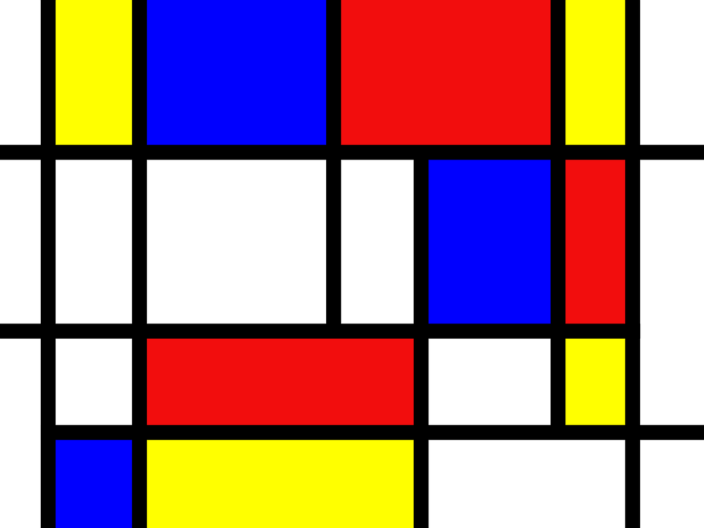
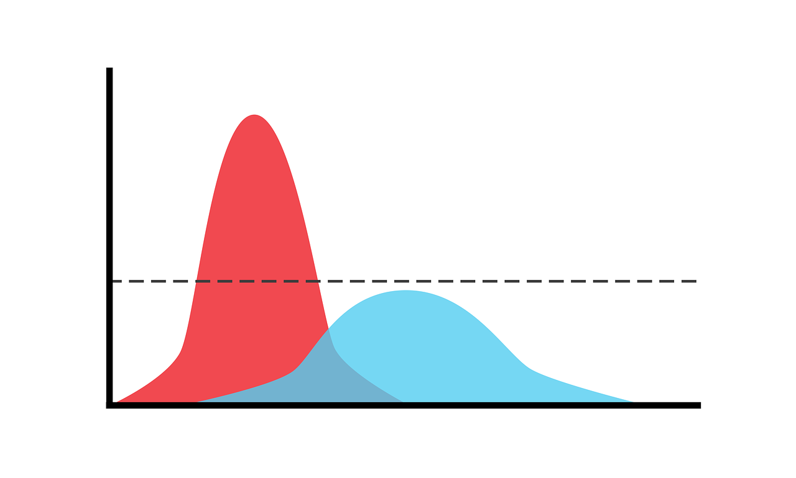
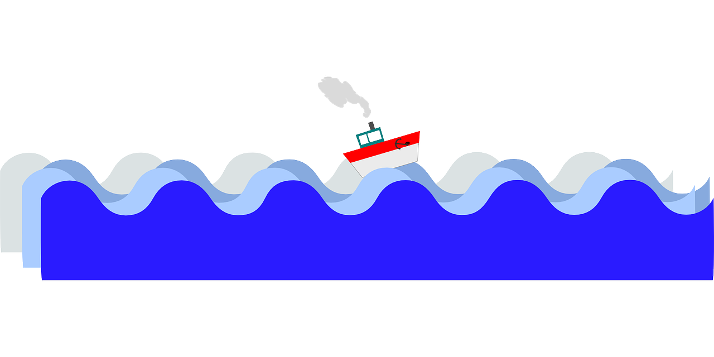

### Time to check different continuous families!

<p align="center">

</p>

# Today's Learning Goals

## By the end of this lecture, we will be able to...

- Identify and apply common continuous distribution families.
- Identify what makes a function a bivariate probability density function.
- Compute conditional distributions for continuous random variables.
- Compute conditional distributions for continuous random variables.

# Outline

1. Common Continuous Distribution Families
2. Continuous Multivariate Distributions 
3. Conditional Distributions (Revisited)

## 1. Common Continuous Distribution Families

- Just like for discrete distributions, there are also parametric families of continuous distributions. 
- [Recall the chart of univariate distributions.](http://www.math.wm.edu/~leemis/chart/UDR/UDR.html)

{fig-align="center" width=22%}

### 1.1. Uniform

<br>

{.absolute top="-40" right="30" width="10%"}

::: incremental
- A Uniform distribution has equal density in between two points $a$ and $b$ (for $a < b$).
- There are <span style="color: purple;">two parameters</span>: one for each end-point. 
-  Commonly, a reference to a <span style="color: purple;">Uniform distribution</span> usually implies <span style="color: purple;">continuous uniform</span>.
:::

#### PDF, Mean, and Variance

{.absolute top="-40" right="30" width="10%"}

::: incremental
- It is denoted as
$$X \sim \operatorname{Uniform}(a, b).$$
- The PDF is given by
$$f_X(x\mid a, b) = \frac{1}{b - a} \qquad \text{for} \quad a \leq x \leq b.$$
- The mean is $\mathbb{E}(X) = \frac{a + b}{2}$.
- The variance is $\text{Var}(X) = \frac{(b - a)^2}{12}$.
:::

#### Some members of the Uniform family...

```{r}
library(tidyverse)
```

<br>

```{r}
#| echo: false
#| fig-width: 11.5
#| fig-height: 5.5

tibble(
  x = seq(-3.5, 1.5, length.out = 1000),
  `Uniform(a = 0, b = 1)` = dunif(x, min = 0, max = 1),
  `Uniform(a= -3, b = 1)` = dunif(x, min = -3, max = 1),
  `Uniform(a= -2, b = -1.5)` = dunif(x, min = -2, max = -1.5)
) %>%
  pivot_longer(contains("Uniform"), names_to = "distribution", values_to = "density") %>%
  ggplot(aes(x, density)) +
  facet_wrap(~distribution) +
  geom_line() +
  theme_bw() +
  theme(
    axis.text = element_text(size = 16),
    axis.title = element_text(size = 16, face = "bold"),
    strip.text = element_text(size = 17)
  ) +
  labs(
    x = " x",
    y = "Probability Density"
  ) +
  geom_line(color = "deeppink", linewidth = 1)
```

### 1.2. Gaussian or Normal

{.absolute top="-40" right="30" width="20%"}

<br>

::: incremental
- Probably the most famous family of distributions. 
- It has a density that follows a <span style="color: purple;">"bell-shaped"</span> curve. 
- It is parameterized by its <span style="color: purple;">mean</span>
$$-\infty < \mu < \infty$$ and <span style="color: purple;">variance</span>
$$\sigma^2 > 0.$$

:::

#### PDF, Mean, and Variance

{.absolute top="-40" right="30" width="20%"}

::: incremental
- It is denoted as
$$X \sim \mathcal N\left(\mu, \sigma^2\right).$$
- The PDF is
$$f_X(x \mid \mu, \sigma^2) = \frac{1}{\sqrt{2\pi \sigma^2}} \exp \left[-\frac{(x - \mu)^2}{2\sigma^2} \right] \quad \text{for } -\infty < x < \infty.$$
- The mean is $\mathbb{E}(X) = \mu$.
- The variance is $\text{Var}(X) = \sigma^2$.
:::

#### Some members of the Gaussian or Normal family...

```{r}
#| echo: false
#| fig-width: 18
#| fig-height: 10

expand_grid(
  mu = c(-3, 0, 3),
  sd = c(0.5, 1, 2)
) %>%
  mutate(f = map2(
    mu, sd,
    ~ tibble(
      x       = seq(-8, 8, length.out = 1000),
      density = dnorm(x, mean = .x, sd = .y)
    )
  )) %>%
  unnest(f) %>%
  mutate(
    mu = str_c('mu*" = ', mu, '"'),
    var = str_c('sigma^2*" = ', sd^2, '"')
  ) %>%
  ggplot(aes(x, density)) +
  facet_grid(mu ~ var, labeller = label_parsed) +
  geom_line() +
  theme_bw() +
  theme(
    axis.text = element_text(size = 20),
    axis.title = element_text(size = 20, face = "bold"),
    strip.text = element_text(size = 21)
  ) +
  labs(
    x = "x",
    y = "Probability Density"
  ) +
  geom_line(color = "red2", linewidth = 1) + 
  scale_x_continuous(breaks = seq(-6, 6, 2))
```

### 1.3. Log-Normal

{.absolute top="-50" right="0" width="8%"}

::: incremental
- A random variable $X$ is a Log-Normal distribution if the transformation $\log(X)$ is Normal. 
- This family is often parameterized by the <span style="color: purple;">mean</span> 
$$-\infty < \mu < \infty$$
and <span style="color: purple;">variance</span> 
$$\sigma^2 > 0$$ 
of $\log X$.
:::

#### PDF, Mean, and Variance

{.absolute top="-50" right="0" width="8%"}

::: incremental
- It is denoted as
$$X \sim \operatorname{Log-Normal}\left(\mu, \sigma^2\right).$$
- The PDF is
$$f_X(x \mid \mu, \sigma^2) = \frac{1}{x\sqrt{2\pi \sigma^2}} \exp \left\{ -\frac{[\log(x) - \mu]^2}{2\sigma^2} \right\} \quad \text{for } x \geq 0.$$
- The mean is $\mathbb{E}(X) = \exp{\left[ \mu + \left( \sigma^2 / 2 \right) \right]}$.
- The variance is $\text{Var}(X) = \exp{\left[ 2 \left( \mu + \sigma^2 \right) \right]} - \exp{\left( 2\mu + \sigma^2 \right)}$.
:::

#### Some members of the Log-Normal family...

```{r}
#| echo: false
#| fig-width: 18
#| fig-height: 10

data_log  <- expand_grid(
  meanlog = c(-0.5, 0, 1),
  sdlog = c(0.5, sqrt(0.75), 1.5)
) %>%
  mutate(f = map2(
    meanlog, sdlog,
    ~ tibble(
      x       = seq(0, 8, length.out = 1000),
      density = dlnorm(x, meanlog = .x, sdlog = .y)
    )
  )) %>%
  unnest(f) %>%
  mutate(
    meanlog = str_c('mu*" = ', meanlog, '"'),
    varlog = str_c('sigma^2*" = ', sdlog^2, '"')
  )

plot_log <-ggplot(data_log, aes(x, density)) +
  facet_grid(meanlog ~ varlog, labeller = label_parsed) +
  geom_line() +
  theme_bw() +
  theme(
    axis.text = element_text(size = 20),
    axis.title = element_text(size = 20, face = "bold"),
    strip.text = element_text(size = 21)
  ) +
  labs(
    x = "x",
    y = "Probability Density"
  ) +
  geom_line(color = "seagreen3", linewidth = 1) + 
  scale_x_continuous(breaks = seq(0, 8, 1))

plot_log
```

### 1.4. Exponential

{.absolute top="-50" right="0" width="15%"}

<br>

::: incremental
- The Exponential family is for positive random variables.
- It is often interpreted as <span style="color: purple;">wait time</span> for some event to happen. 
- The family is characterized by a single parameter, usually either the <span style="color: purple;">mean wait time</span> $\beta > 0$, or its reciprocal, the <span style="color: purple;">average rate</span> $\lambda > 0$ at which events happen.
:::

#### Definition

{.absolute top="-40" right="0" width="10%"}

<br>

::: incremental
- The Exponential family is denoted as
$$X \sim \operatorname{Exponential}(\beta),$$
or 
$$X \sim \operatorname{Exponential}(\lambda).$$
:::

#### PDFs

{.absolute top="-40" right="0" width="10%"}

<br>

::: incremental
- The PDF can be parameterized as
$$f_X(x \mid \beta) = \frac{1}{\beta} \exp(-x / \beta) \qquad \text{for} \quad x \geq 0$$
or
$$f_X(x \mid \lambda) = \lambda \exp(-\lambda x) \qquad \text{for} \quad x \geq 0.$$
::: 

#### Mean

{.absolute top="-40" right="0" width="10%"}

<br>

::: incremental
- <span style="color: purple;">Using a $\beta$ parameterization</span>, the mean is:
$$\mathbb{E}(X) = \beta.$$
- On the other hand, <span style="color: purple;">using a $\lambda$ parameterization</span>, the mean is:
$$\mathbb{E}(X) = 1 / \lambda.$$
:::

#### Variance

{.absolute top="-40" right="0" width="10%"}

<br>

::: incremental

- <span style="color: purple;">Using a $\beta$ parameterization</span>, the variance is:
$$\text{Var}(X) = \beta^2.$$
- On the other hand, <span style="color: purple;">using a $\lambda$ parameterization</span>, the variance is:
$$\text{Var}(X) = 1 / \lambda^2.$$
:::

#### Some members of the Exponential family...

<br>

```{r}
#| echo: false
#| fig-width: 11.5
#| fig-height: 5.5

tibble(lambda = c(1, 0.5, 0.25)) %>%
  mutate(f = map(
    lambda,
    ~ tibble(
      x       = seq(0, 10, length.out = 1000),
      density = dexp(x, rate = .x)
    )
  )) %>%
  unnest(f) %>%
  mutate(lambda = str_c('lambda*" = ', lambda, '"')) %>%
  ggplot(aes(x, density)) +
  facet_wrap(~lambda, labeller = label_parsed) +
  geom_line() +
  theme_bw() +
  theme(
    axis.text = element_text(size = 13),
    axis.title = element_text(size = 20, face = "bold"),
    strip.text = element_text(size = 21)
  ) +
  labs(
    x = "x",
    y = "Probability Density"
  ) +
  geom_line(color = "royalblue3", linewidth = 1)
```

### 1.5. Beta

{.absolute top="-40" right="0" width="20%"}

<br>

::: incremental
- The Beta family of distributions is defined for random variables taking values between $0$ and $1$.
- Hence, <span style="color: purple;">it is useful for modelling the distribution of proportions</span>. 
- It is characterized by <span style="color: purple;">two positive shape parameters</span>, $\alpha > 0$ and $\beta > 0$.
:::

#### PDF

<br>

{.absolute top="-40" right="0" width="20%"}

::: incremental
- It is denoted as
$$X \sim \operatorname{Beta}(\alpha, \beta).$$
- The PDF is given by
$$f_X(x \mid \alpha, \beta) = \frac{\Gamma(\alpha + \beta)}{\Gamma(\alpha) \Gamma(\beta)} x^{\alpha - 1} (1 - x)^{\beta - 1} \quad \text{for} \quad 0 \leq x \leq 1,$$
where $\Gamma(\cdot)$ is the [Gamma function](https://www.statlect.com/mathematical-tools/gamma-function).
:::

#### Mean and Variance

<br>

{.absolute top="-40" right="0" width="20%"}

::: incremental
- The mean is 
$$\mathbb{E}(X) = \frac{\alpha}{\alpha + \beta}.$$
- The variance is 
$$\text{Var}(X) = \frac{\alpha \beta}{(\alpha + \beta)^2 (\alpha + \beta + 1)}.$$
:::

#### Some members of the Beta family...

```{r}
#| echo: false
#| fig-width: 18
#| fig-height: 10

expand_grid(
  alpha = c(0.5, 1, 2),
  beta  = c(0.25, 1, 1.25)
) |>
  mutate(f = map2(
    alpha, beta,
    ~ tibble(
      x       = seq(0, 1, length.out = 1000),
      density = dbeta(x, shape1 = .x, shape2 = .y)
    )
  )) |>
  unnest(f) |>
  ggplot(aes(x, density)) +
  facet_grid(
    beta ~ alpha,
    labeller = label_bquote(
      rows = beta  == .(beta),
      cols = alpha == .(alpha)
    )
  ) +
  geom_line(color = "gold2", linewidth = 1) +
  theme_bw() +
  coord_cartesian(ylim = c(0, 4)) +
  ggtitle("Some Members of the Beta Family") +
  labs(x = "x", y = "Probability Density") +
  theme(
    plot.title = element_text(size = 21, face = "bold"),
    axis.text  = element_text(size = 16),
    axis.title = element_text(size = 16, face = "bold"),
    strip.text = element_text(size = 17)
  )
```

### 1.6. Weibull

<br>

{.absolute top="-40" right="0" width="10%"}

::: incremental
- A generalization of the Exponential family, <span style="color: purple;">which allows for an event to be more likely the longer you wait</span>. 
- Because of this flexibility and interpretation, this family is used heavily in <span style="color: purple;">survival analysis</span> when modelling <span style="color: purple;">time until an event</span>.
- This family is characterized by two parameters, a <span style="color: purple;">scale parameter</span> $\lambda > 0$ and a <span style="color: purple;">shape parameter</span> $k > 0$.
:::

#### PDF

<br>

{.absolute top="-40" right="0" width="10%"}

::: incremental
- It is denoted as
$$X \sim \operatorname{Weibull}(\lambda, k).$$
- The PDF is
$$f_X(x \mid \lambda, k) = \frac{k}{\lambda} \left( \frac{x}{\lambda} \right)^{k - 1} \exp^{-(x / \lambda)^k} \qquad \text{for} \quad x \geq 0.$$
:::

#### Mean and Variance

<br>

{.absolute top="-40" right="0" width="10%"}

::: incremental
- The mean is 
$$\mathbb{E}(X) = \lambda^{1/k} \Gamma \left( 1 + \frac{1}{k} \right).$$
- The variance is 
$$\text{Var}(X) = \lambda^{2 / k} \left[ \Gamma \left( 1 + \frac{2}{k} \right) - \Gamma^2 \left( 1 + \frac{1}{k} \right) \right].$$
:::

#### Some members of the Weibull family...

```{r}
#| echo: false
#| fig-width: 18
#| fig-height: 10

expand_grid(
  k = c(0.5, 2, 5),
  lambda = c(0.5, 1, 1.5)
) %>%
  mutate(f = map2(
    k, lambda,
    ~ tibble(
      x       = seq(0, 3, length.out = 1000),
      density = dweibull(x, shape = .x, scale = .y)
    )
  )) %>%
  unnest(f) %>%
  ggplot(aes(x, density)) +
  facet_grid(
    k ~ lambda,
    labeller = label_bquote(
      rows = k == .(k),
      cols = lambda == .(lambda)
    )
  ) +
  geom_line(color = "mediumorchid2", linewidth = 1) +
  theme_bw() +
  coord_cartesian(ylim = c(0, 5)) +
  labs(x = "x", y = "Probability Density") +
  theme(
    axis.text  = element_text(size = 20),
    axis.title = element_text(size = 20, face = "bold"),
    strip.text = element_text(size = 21)
  ) +
  scale_x_continuous(breaks = seq(0, 3, 0.5))
```

### 1.7. Gamma

{.absolute top="-70" right="0" width="15%"}

<br>

::: incremental
- Another useful two-parameter family with support on non-negative numbers. 
- One common parameterization is with a <span style="color: purple;">shape parameter</span> $k > 0$ and a <span style="color: purple;">scale parameter</span> $\theta > 0$.
:::

#### PDF, Mean, and Variance

::: incremental
- It is denoted as
$$X \sim \operatorname{Gamma}(k, \theta).$$
- The PDF is given by
$$f_X(x \mid k, \theta) = \frac{1}{\Gamma(k) \theta^k} x^{k - 1} \exp(-x / \theta) \qquad \text{for} \quad x \geq 0,$$
- The mean is $\mathbb{E}(X) = k \theta$.
- The variance is $\text{Var}(X) = k \theta^2$.
:::

#### Some members of the Gamma family...

```{r}
#| echo: false
#| fig-width: 18
#| fig-height: 10

suppressWarnings(print(expand_grid(
  k = c(1, 3, 5),
  theta = c(0.5, 1, 2)
) %>%
  mutate(f = map2(
    k, theta,
    ~ tibble(
      x       = seq(0, 25, length.out = 1000),
      density = dgamma(x, shape = .x, scale = .y)
    )
  )) %>%
  unnest(f) %>%
  mutate(
    k = str_c('"k = ', k, '"'),
    theta = str_c('theta*" = ', theta, '"')
  ) %>%
  ggplot(aes(x, density)) +
  facet_grid(theta ~ k, labeller = label_parsed) +
  geom_line() +
  theme_bw() +
  ylim(c(0, 1)) +
  labs(
    x = "x",
    y = "Probability Density"
  ) +
  geom_line(color = "darkorange2", linewidth = 1) +
  theme(
    axis.text = element_text(size = 20),
    axis.title = element_text(size = 20, face = "bold"),
    strip.text = element_text(size = 21)
  )))
```

### Summarizing!

<p align="center">

</p>

### 1.8 Relevant `R` Functions

{.absolute top="-40" right="0" width="15%"}

<br>

::: incremental
- `R` has functions for many distribution families. 
- The functions are of the form `<x><dist>`, where `<dist>` is an abbreviation of a distribution family, and `<x>` is one of `d`, `p`, `q`, or `r`.
:::

#### Possible Prefixes for `<x>`

{.absolute top="-40" right="0" width="15%"}

<br>

- `d`: density function -- we call this $f_X(x)$.
- `p`: cumulative distribution function (CDF), we call this $F_X(x)$.
- `q`: quantile function (inverse CDF).
- `r`: random number generator.

#### Abbreviations for `<dist>`

{.absolute top="-40" right="0" width="15%"}

<br>

- `unif`: Uniform (continuous).
- `norm`: Normal (continuous).
- `lnorm`: Log-Normal (continuous).
- `geom`: Geometric (discrete).
- `pois`: Poisson (discrete).
- `binom`: Binomial (discrete).
- etc.

#### Examples for `<dist>`

{.absolute top="-40" right="0" width="15%"}

<br>
<br>

::: incremental
- For the Uniform family, we have the following `R` functions:
    * `dunif()`, `punif()`, `qunif()`, and `runif()`.
<br>
- For the Gaussian or Normal family, we have the following `R` functions:
    * `dnorm()`, `pnorm()`, `qnorm()`, and `rnorm()`.
:::

#### iClicker Question

What `R` function do we need to obtain the density corresponding for $X \sim \mathcal N(\mu = 2, \sigma^2 = 4)$ at point $x = 3$? Select the correct option:

**A.** `pnorm(q = 3, mean = 2, sd = 2)`

**B.** `dnorm(x = 3, mean = 2, sd = 4)`

**C.** `pnorm(q = 3, mean = 2, sd = 4)`

**D.** `dnorm(x = 3, mean = 2, sd = 2)`

{fig-align="center" width=15%}

#### iClicker Question

What `R` function do we need for the CDF for $X \sim \operatorname{Uniform}(a = 0, b = 2)$ at  $x = 0.25, 0.5, 0.75$?

. . .

**A.** `qunif(p = c(0.25, 0.5, 0.75), min = 0, max = 2, lower.tail = TRUE)`

. . .

**B.** `punif(q = c(0.25, 0.5, 0.75), min = 0, max = 2, lower.tail = TRUE)`

. . .

**C.** `dunif(x = c(0.25, 0.5, 0.75), min = 0, max = 2)`

. . .

**D.** `punif(q = c(0.25, 0.5, 0.75), min = 0, max = 2, lower.tail = FALSE)`

#### iClicker Question

What `R` function do we need to obtain the median of $X \sim \operatorname{Uniform}(a = 0, b = 2)$?

<br>

**A.** `qunif(p = 0.5, min = 0, max = 2, lower.tail = TRUE)`

**B.** `punif(q = 0.5, min = 0, max = 2, lower.tail = TRUE)`

**C.** `dunif(x = 0.5, min = 0, max = 2)`

**D.** `punif(q = 0.5, min = 0, max = 2, lower.tail = FALSE)`

#### iClicker Question

What `R` function do we need to generate a random sample of size $10$ from the distribution $\mathcal N(\mu = 0, \sigma^2 = 25)$?

<br>

**A.** `runif(n = 10, min = 0, max = 25)`

**B.** `rnorm(n = 10, mean = 0, sd = 25)`

**C.** `rnorm(n = 10, mean = 0, sd = 5)`

**D.** `runif(n = 10, min = 0, max = 5)`

## 2. Continuous Multivariate Distributions

{.absolute top="-40" right="30" width="20%"}

<br>

::: incremental
- In the discrete case we already saw <span style="color: purple;">joint distributions</span>, <span style="color: purple;">conditional distributions</span>, <span style="color: purple;">marginal distributions</span>, etc. 
- All these concepts are carried over to the continuous world. 
- Let us start with two continuous variables (i.e., a <span style="color: purple;">bivariate</span> case).
:::

### 2.1. Continuous Multivariate Distributions

{.absolute top="20" right="-20" width="20%"}

<br>

- Recall the joint <span style="color: purple;">probability mass function (PMF)</span> between $\text{Gang}$ demand and length-of-stay in days ($\text{LOS}$):

```{r}
#| echo: false

library(kableExtra)

raw_data <- data.frame(
  LOS = c(rep(1, 4), rep(2, 4), rep(3, 4), rep(4, 4), rep(5, 4)), Gangs = rep(1:4, 5),
  Probability = c(
    0.00170, 0.04253, 0.12471, 0.08106,
    0.02664, 0.16981, 0.13598, 0.01757,
    0.05109, 0.11563, 0.03203, 0.00125,
    0.04653, 0.04744, 0.00593, 0.00010,
    0.07404, 0.02459, 0.00135, 0.00002
  )
)

joint_distribution <- raw_data %>%
  mutate(
    LOS = str_c("LOS = ", LOS),
    Gangs = str_c("Gangs = ", Gangs)
  ) %>%
  pivot_wider(id_cols = LOS, names_from = Gangs, values_from = Probability) %>%
  column_to_rownames("LOS") %>%
  as.matrix()
```

```{r}
kable(joint_distribution, align = "cccc") %>%
  kable_styling(font_size = 30) %>%
  column_spec(1, bold = TRUE)
```

#### How can we set up a joint PDF?

<br>

::: incremental
- Suppose you have two continuous random variables that have a <span style="color: purple;">joint PDF</span>.
- For this <span style="color: purple;">continuous case</span>, instead of rows and columns, we have an $x$ and $y$-axis for our two random variables, defining a region of possible values.
::::

{fig-align="center" width=22%}

#### The two-runner example!

{.absolute top="-40" right="30" width="10%"}

- Suppose two marathon runners can only finish a marathon between 5.0 and 5.5 hours each, <span style="color: purple;">and their end times are totally random</span>!

<center>
```{r}
#| echo: false
#| fig-width: 4
#| fig-height: 4

marathon_space <- tibble(x1 = 5, x2 = 5.5, y1 = 5, y2 = 5.5) %>%
  ggplot() +
  geom_rect(aes(xmin = x1, xmax = x2, ymin = y1, ymax = y2), fill = "darkorange1") +
  scale_x_continuous("Marathon Time (Hours): Runner 1", limits = c(4.5, 6)) +
  scale_y_continuous("Marathon Time (Hours): Runner 2", limits = c(4.5, 6)) +
  theme_bw() +
  ggtitle("Sample Space") +
  theme(plot.title = element_text(size = 12, face = "bold"),
    axis.text = element_text(size = 11),
    axis.title = element_text(size = 11, face = "bold"))
marathon_space
```

#### A bivariate density function in 3D!

- The <span style="color: purple;">density function</span> is a <span style="color: purple;">surface</span> overtop of this square.
- The <span style="color: orange;">orange distribution</span> surface corresponds to the projection of the joint distribution on the $z$-axis.

<center>
```{r}
#| echo: false
#| fig-width: 4.2
#| fig-height: 4

library(plotly)

x_settings <- list(
  title = "Runner 1 Time (hours)",
  range = c(4.5, 6)
)

y_settings <- list(
  title = "Runner 2 Time (hours)",
  range = c(4.5, 6)
)

z_settings <- list(
  title = "Density",
  range = c(0, 4)
)

marathon_space_3D <- plot_ly(
  x = c(5, 5, 5.5, 5.5, 5, 5, 5.5, 5.5),
  y = c(5, 5.5, 5.5, 5, 5, 5.5, 5.5, 5),
  z = c(0, 0, 0, 0, 4, 4, 4, 4),
  i = c(7, 0, 0, 0, 4, 4, 2, 6, 4, 0, 3, 7),
  j = c(3, 4, 1, 2, 5, 6, 5, 5, 0, 1, 2, 2),
  k = c(0, 7, 2, 3, 6, 7, 1, 2, 5, 5, 7, 6),
  facecolor = rep(toRGB(viridisLite::inferno(4)), each = 2),
  type = "mesh3d"
) %>%
  layout(scene = list(
    xaxis = x_settings,
    yaxis = y_settings,
    zaxis = z_settings
  ))

marathon_space_3D
```
</center>

### 2.2. Calculating Probabilities

::: incremental
- Let $X$ and $Y$ be two random variables. Their joint PDF evaluated at the points $x$ and $y$ is usually denoted
$$f_{X,Y}(x,y).$$
- Therefore, we have a <span style="color: purple;">density surface</span>.
- We can calculate probabilities as the <span style="color: purple;">volume under the density surface</span>.
:::

#### What do we mean when we say a "volume"?

- <span style="color: purple;">The total volume under the density function must equal 1.</span> 
- Formally, this may be written as
$$\int_{-\infty}^{\infty} \int_{-\infty}^{\infty} f_{X, Y} (x,y)\,\mathrm{d}x\,\mathrm{d}y = 1.$$

{fig-align="center" width=22%}

#### In-Class Question

- In the two-runner example, if the density is equal/flat across the entire sample space, what is the height of this surface? 
- That is, what does the density evaluate to? 
- What does it evaluate to <span style="color: purple;">outside</span> of the sample space?

{fig-align="center" width=22%}

#### In-Class Question

{.absolute top="-40" right="30" width="10%"}

- Let $X$ and $Y$ be the marathon times of Runner 1 and Runner 2 in hours, respectively.
- What is the probability that Runner 1 will finish the marathon before Runner 2, i.e., $P(X < Y)$?

<center>
```{r}
#| echo: false
#| fig-width: 3.5
#| fig-height: 3.5

marathon_space +
  geom_polygon(
    data = tibble(
      x = c(5, 5, 5.5),
      y = c(5, 5.5, 5.5)
    ),
    mapping = aes(x, y), fill = "orangered3"
  )
```
</center>

#### In-Class Question

{.absolute top="-40" right="30" width="10%"}

- What is the probability that Runner 1 finishes in $5.2$ hours or less, i.e., $P(X \leq 5.2)$?

<center>
```{r}
#| echo: false
#| fig-width: 4.5
#| fig-height: 4.5

suppressMessages(print(marathon_space +
  geom_rect(aes(xmin = 5, xmax = 5.2, ymin = 5, ymax = 5.5), fill = "tan4") +
  geom_vline(xintercept = 5.2, linetype = "dashed", colour = "darkmagenta", linewidth = 1) +
  scale_x_continuous("Marathon Time (Hours):\nRunner 1", limits = c(4.5, 6), breaks = c(4.5, 5, 5.2, 5.5, 6))))
```
</center>

## 3. Conditional Distributions (Revisited)

{.absolute bottom="550" right="0" width="15%"}

- Recall the basic formula for conditional probabilities for events $A$ and $B$:

$$P(A \mid B) = \frac{P(A \cap B)}{P(B)}.$$

. . .

- Nonetheless, this is only true if $P(B) \neq 0$, and it is not useful if $P(A) = 0$ -- <span style="color: purple;">two situations we are faced with in the continuous world!</span>

### 3.1. When $P(A) = 0$

{.absolute top="-50" right="0" width="10%"}

<br>

::: incremental
- Suppose the month is half-way over, and you find that <span style="color: purple;">you only have $\$2500$ worth of expenses so far!</span> 
- What is the distribution of this month's total expenditures now, given this information?
:::

#### Applying the previous Law of Conditional Probability...

{.absolute top="100" right="0" width="10%"}

::: incremental
- Let 
$$X = \text{Monthly Expenses in CAD}.$$
- Assume
$$X \sim \operatorname{Log-Normal}(\mu = 8, \sigma^2 = 0.5).$$
- Using the conditional probability formula would give:
$$P(X = x \mid X \geq 2500) = \frac{P(X = x)}{P(X \geq 2500)} \qquad \qquad \text{(NO!)}$$
:::

#### Instead...

{.absolute top="-50" right="0" width="10%"}

<br>

- In general, <span style="color: purple;">we replace probabilities with densities</span>. 
- In this case, what we actually have is:
$$f_{X \mid X \geq 2500}(x) = \frac{f_X(x)}{P(X \geq 2500)} \qquad \text{for} \quad x \geq 2500,$$
and 
$$f_{X \mid X \geq 2500}(x) = 0 \qquad \text{for} \quad x < 2500.$$

#### Comparing Densities

{.absolute top="-50" right="0" width="10%"}

<br>

```{r}
#| echo: false
#| fig-width: 11.5
#| fig-height: 5.5

suppressPackageStartupMessages(source("supplementary/expense.R"))

expense$dcond <- function(x) if_else(x < 2500, 0, expense$ddist(x) / (1 - expense$pdist(2500)))
tibble(x = seq(0, 10000, length.out = 1000)) %>%
  mutate(
    Marginal = expense$ddist(x),
    Conditional = expense$dcond(x)
  ) %>%
  pivot_longer(Marginal:Conditional, names_to = "distribution", values_to = "Density") %>%
  ggplot(aes(x, Density)) +
  facet_wrap(~distribution) +
  geom_line(color = "red2", linewidth = 1) +
  theme_bw() +
  theme(
    plot.title = element_text(size = 17, face = "bold"),
    axis.text = element_text(size = 16),
    axis.title = element_text(size = 16, face = "bold"),
    strip.text = element_text(size = 17)
  ) +
  ggtitle("Conditional and Marginal Distributions for Monthly Expenses") +
  labs(
    x = "x (CAD)",
    y = "Probability Density"
  )
```


### 3.2. When $P(B) = 0$

{.absolute top="-40" right="30" width="10%"}

- To describe this situation, let us use the marathon runners' example again:

> **If Runner 1 ended up finishing in $5.2$ hours**, what is the distribution of Runner 2's time? 

. . .

- Let $X$ be the time for Runner 1, and $Y$ for Runner 2, what we are asking for is 
$$f_{Y|X = 5.2}(y).$$


#### However...

{.absolute top="-40" right="30" width="10%"}

- We already pointed out that $P(X = 5.2) = 0.$ 

. . .

- We end up with:
$$f_{Y|X = 5.2}(y) = \frac{f_{Y,X}(y, 5.2)}{f_X(5.2)}.$$
- This formula is true in general:
$$f_{Y|X}(y) = \frac{f_{Y,X}(y, x)}{f_X(x)}.$$
