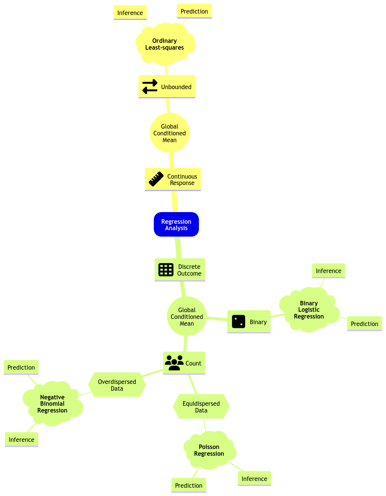



```{r echo=FALSE}
# Load required packages
library(tidyverse)
library(mlbench)
library(AER)
library(cowplot)
library(broom)
library(performance)
library(qqplotr)
library(glmbb)
```

# Hello and welcome!

<br>

**Teaching Team**

[**Section 1:**]{style="color: purple;"} Payman Nickchi

[**Section 2:**]{style="color: purple;"} G. Alexi Rodríguez-Arelis

```{r echo=FALSE, eval=TRUE}
# Load functions in env
# Three initial examples of linear models

example_1 <- function() {
  set.seed(123)
  data <- tibble(x = rnorm(50, 10, 3), y = 2 * x + rnorm(length(x)))
  plot <- data %>% ggplot() +
    geom_point(aes(x, y)) +
    ggtitle("Example 1") +
    theme(
      plot.title = element_text(size = 24, face = "bold"),
      axis.text = element_text(size = 17),
      axis.title = element_text(size = 21)
    ) +
    scale_x_continuous(breaks = seq(0, 18, 2), limits = c(0, 18))
  return(plot)
}

example_2 <- function() {
  set.seed(456)
  data <- tibble(x = rnorm(50, 10, 3), y = 5 * (x > 10) + rnorm(length(x), 0, 0.24))
  plot <- data %>% ggplot() +
    geom_point(aes(x, y)) +
    ggtitle("Example 2") +
    theme(
      plot.title = element_text(size = 24, face = "bold"),
      axis.text = element_text(size = 17),
      axis.title = element_text(size = 21)
    ) +
    scale_x_continuous(breaks = seq(0, 18, 2), limits = c(0, 18))
  return(plot)
}

example_3 <- function() {
  set.seed(789)
  data <- tibble(x = rnorm(100, 10, 3), y = 2 * sin(x) + rnorm(length(x), 0, 0.4))
  plot <- data %>% ggplot() +
    geom_point(aes(x, y)) +
    ggtitle("Example 3") +
    theme(
      plot.title = element_text(size = 24, face = "bold"),
      axis.text = element_text(size = 17),
      axis.title = element_text(size = 21)
    ) +
    scale_x_continuous(breaks = seq(0, 18, 2), limits = c(0, 18))
  return(plot)
}
```

## High-Level Goals of this Course

-   Describe the risk and value of making [parametric assumptions]{style="color: purple;"} in regression.
-   Fit model functions that represent probabilistic quantities [besides the mean]{style="color: purple;"}.
-   Identify situations [where Ordinary Least-squares (OLS) regression is sub-optimal]{style="color: purple;"}, and apply [alternative regression methods]{style="color: purple;"} that better address the situation.

## Today's Learning Goals

By the end of this lecture, you should be able to:

-   Explain the [Data Science workflow]{style="color: purple;"} in Regression Analysis.
-   Recall the basics of OLS regression.
-   Identify cases [where OLS regression is not suitable]{style="color: purple;"}.
-   Distinguish what makes a regression model “*linear*.”
-   Explain the concept of [generalized linear models (GLMs)]{style="color: purple;"}.
-   Explore the concept of the [link function]{style="color: purple;"}.

## Today's Learning Goals (cont’d)

-   Outline the modelling framework of [count regression]{style="color: purple;"}.
-   Fit and interpret count regression.
-   Use count regression for prediction.
-   Explain and [test overdispersion]{style="color: purple;"} on count-type data.

# Outline

1.  A Preamble on our Data Science Workflow
2.  Review of Ordinary Least-squares Regression
3.  Link Function
4.  Poisson Regression
5.  Overdispersion
6.  Negative Binomial Regression

## 1. A Preamble on our Data Science Workflow

We have structured this regression course in three big pillars:

1.  The use of an ordered [Data Science workflow]{style="color: purple;"},
2.  Choosing the proper workflow flavour according to either an [inferential]{style="color: purple;"} or [predictive]{style="color: purple;"} paradigm.
3.  The correct use of an [appropriate regression model]{style="color: purple;"} based on the response of interest.

### What is this workflow?

<br>

<center></center>

</br>

### Stages

1.  Study design.
2.  Data collection and wrangling.
3.  Exploratory data analysis.
4.  Data modelling.
5.  Estimation.
6.  Results.
7.  Storytelling.

### Data Modelling

> *In Regression Analysis, we can model an **unbounded continuous response** in terms of their **global conditioned mean** using OLS for inference or prediction.*

<center></center>

## 2. Review of Ordinary Least-squares Regression

-   In [DSCI 561]{style="color: purple;"}, you learned comprehensive material about OLS regression. The term [ordinary]{style="color: purple;"} refers to a linear model with a [response]{style="color: purple;"} of [continuous nature]{style="color: purple;"} : *a variable can take on an infinite number of real values in a given range*.

. . .

-   This response might be subject to [regressors]{style="color: purple;"} of a continuous or discrete nature. When the regressors are [discrete]{style="color: purple;"} and [factor-type]{style="color: purple;"} (i.e., with different categories), they could be: [nominal]{style="color: purple;"} or [ordinal]{style="color: purple;"} .

### Conceptually...

-   A linear regression model can be expressed as:

\begin{equation*}
\mbox{Response} = \mbox{Systematic Component} + \mbox{Random Component}.
\end{equation*}

. . .

-   For the $i$th observation in our [sample]{style="color: purple;"} or [training data]{style="color: purple;"} $(i = 1, \dots, n)$, the conceptual model is mathematically represented as:

$$
\underbrace{Y_i}_\text{Response}  = \underbrace{\beta_0 + \beta_1 g_1(X_{i, 1}) + \ldots + \beta_k g_k(X_{i,k})}_\text{Systematic Component} + \underbrace{\varepsilon_i}_\text{Random Component}
$$

### Note the following!

-   The response $Y_i$ is equal to the sum of $k + 2$ terms.
-   The systematic component is the sum of:
    -   An [unknown intercept]{style="color: purple;"} $\beta_0$ and
    -   $k$ [regressor functions]{style="color: purple;"} $g_j(X_{i,j})$ multiplied by their respective [unknown regression coefficient]{style="color: purple;"} $\beta_j$ $(j = 1, \dots, k)$.

### Moreover...

::: incremental
-   $\varepsilon_i$ is the [random noise]{style="color: purple;"} under the following assumptions: \begin{gather*}
    \mathbb{E}(\varepsilon_i) = 0 \\
    \text{Var}(\varepsilon_i) = \sigma^2 \\
    \varepsilon_i \sim \mathcal{N}(0, \sigma^2) \\
    \varepsilon_i \perp \!\!\! \perp \varepsilon_k \; \; \; \; \text{for} \; i \neq k  \; \; \; \; \text{(independence)}.
    \end{gather*}
-   Hence, [each $Y_i$ is also assumed to be independent and normally distributed]{style="color: purple;"}: \begin{equation*}
    Y_i \mid X_{i, j} \sim \mathcal{N} \big( \beta_0 + \beta_1 g_1(X_{i, 1}) + \ldots + \beta_p g_p(X_{i,p}), \sigma^2 \big).
    \end{equation*}
:::

### 2.1. Can We Apply Linear Regression Here?

Having briefly discussed the components of the OLS model, let us explore three 2-$d$ examples made with [simulated data]{style="color: purple;"}.

```{r}
#| fig-width: 18
#| fig-height: 6

plot_grid(example_1(), example_2(), example_3(), nrow = 1)
```

### iClicker Question

<br>

In what example(s) can we apply linear regression?

**A.** Examples 1 and 2.

**B.** Example 1.

**C.** Examples 1 and 3.

**D.** Examples 1, 2, and 3.

<center></center>

### 2.2. What makes a regression model "*linear*"?

Let us retake the **Example 3** from our previous activity.

```{r}
example_3()
```

### Data Generation

-   Each synthetic data point was generated from a [sinusoidal curve]{style="color: purple;"} plus some [normally distributed random noise]{style="color: purple;"}: \begin{align*}
    Y_i &= \beta_0 + \beta_1 g(X_i) + \varepsilon_i \\
    &= \beta_0 + \beta_1 \sin(X_i) + \varepsilon_i.
    \end{align*}

. . .

-   Hence, this example can be modeled as an OLS model [if we transform each observed $x_i$ in the training set as $\sin(x_i)$]{style="color: purple;"}.

### In general...

-   OLS implicates the identity function $g_j(X_{i, j}) = X_{i, j}$, leading to:

\begin{align*}
Y_i &= \beta_0 + \beta_1 g_1(X_{i, 1}) + \ldots + \beta_k g_k(X_{i,}) + \varepsilon_i \\
&= \beta_0 + \beta_1 X_{i,1} + \ldots + \beta_k X_{i,} + \varepsilon_i.
\end{align*}

## 3. Link Function

-   OLS regression models the following:

$$
\begin{align*}
\mu_i &= \mathbb{E}(Y_i \mid X_{i,1}, \ldots, X_{i,k}) \\ &=
\beta_0 + \beta_1 X_{i,1} + \ldots + \beta_k X_{i,k} \\
& \qquad \qquad \qquad \qquad \qquad \text{since} \; \; \mathbb{E}(\varepsilon_i) = 0.
\end{align*}
$$

## Nonetheless...

-   Modelling the mean $\mu_i$ of a discrete-type response is not straightforward.
-   Hence, we rely on a [monotonic]{style="color: purple;"} and [differentiable]{style="color: purple;"} function $h(\mu_i)$ called the [link function]{style="color: purple;"}:

$$
\begin{align*}
h(\mu_i) &= \eta_i \\
&= \beta_0 + \beta_1 X_{i,1} + \beta_2 X_{i,2} + \ldots + \beta_k X_{i,k} \\
& \qquad \qquad \qquad \qquad \qquad \text{for} \; i = 1, \ldots, n.
\end{align*}
$$

### Why monotonic and differentiable?

-   The link function needs to be monotonic so we can allow putting the [systematic component $\eta_i$]{style="color: purple;"} in terms of the corresponding mean $\mu_i$, i.e.:

$$\mu_i = h^{-1}(\eta_i).$$

-   It needs to be differentiable since we rely on [maximum likelihood estimation]{style="color: purple;"} to obtain $\hat{\beta}_0, \hat{\beta}_1, \dots, \hat{\beta}_k$.

### Here comes the GLM!

-   A GLM has the components of the conceptual regression model in a training set of $n$ elements as:

::: incremental
1.  [**Random component:**]{style="color: purple;"} Each *response* $Y_1,\ldots,Y_n$ is a random variable with mean $\mu_i$.
2.  [**Systematic component:**]{style="color: purple;"} $$\eta_i = \beta_0 + \beta_1 X_{i,1} + \beta_2 X_{i,2} + \ldots + \beta_k X_{i,k} \; \; \; \; \text{for} \; i = 1, \ldots, n.$$
3.  [**Link function:**]{style="color: purple;"} $$
    h(\mu_i) = \eta_i.
    $$
:::

## 4. Poisson Regression

<center></center>

### 4.1. The Crabs Dataset

-   The data frame `crabs` ([Brockmann, 1996](https://ubc.summon.serialssolutions.com/2.0.0/link/0/eLvHCXMwrV3JasMwEBUlpZBLl7Sl6YY_oE4sy5sgFEpICKU9NadcjFYSmtghCyRf0t-tJC_EPhRaepMHS8jSSPM0M3oGALkdx67tCYRyKV0GacCp9CBX60RCySMcYiigy2qpOq_F1ZiMLqL0v-mFYrZvvd4JXXcPEnOUZbU1z6W-fxdoh6eO-XQUvDyGCnXrbK_hxCkDDCHKgs9KH20FelDOR_pzWxXbdYhljTEanoF10e8iC6V2SbDK9Pg_H3gOTnPsar1kynYBjkTSAs1yC923wMkkNaVL8NVbkNXn8wcxjJ8b0euaZysTvyuzVJUYH9i6Kpsl1ijVOSbTtPZ2f6V6nYuectnbbLGdb2tNLNP5fjkVi1J-BcbDwbg_svOfQNhMIRdsu4KHEnIsIiQYJoGQvsKQmAuOsE8lojRnrPEIlZQHHIUEEs8PBVHQjaJr0EjSRNwAS8ebmMNk4DHkRYgQSt2ARoxRnzuhJG2AitmNlxnVR3x4REI41sMf6-GP8-GPd20QmVn7RZV4MB7p0u3fq96BZpY-rn1B96CxWW3FgyGOeDR6_g1rIQSN)) is a dataset detailing the [counts of satellite male crabs]{style="color: purple;"} residing around a female crab nest.

<center></center>

### Let us take a look at the dataset!

-   Beforehand, we do [some quick data wrangling]{style="color: purple;"}.
-   Then, we display the first eight rows.

```{r}
#| echo: true

data(crabs)
crabs <- crabs |>
  rename(n_males = satell) |>
  dplyr::select(-y)
head(crabs, n = 8) 
```

### Main Statistical Inquiries

Let us suppose we want to assess the following:

-   Whether `n_males` and [female]{style="color: purple;"} carapace `width` are [statistically associated]{style="color: purple;"} and by [how much]{style="color: purple;"}.
-   Whether `n_males` and [female]{style="color: purple;"} `color` of the prosoma are [statistically associated]{style="color: purple;"} and by [how much]{style="color: purple;"}.

<center></center>

### 4.2. Exploratory Data Analysis

```{r}
#| echo: false

plot_crabs_vs_width <- crabs |>
  ggplot() +
  geom_point(aes(width, n_males)) +
  labs(y = "Number of Male Crabs", x = "Female Carapace Width (cm)") +
  ggtitle("Scatterplot of Number of Male Crabs Versus Female Carapace Width") +
  theme(
    plot.title = element_text(size = 31, face = "bold"),
    axis.text = element_text(size = 21),
    axis.title = element_text(size = 27)
  ) +
  scale_x_continuous(limits = c(20, 35), breaks = seq(0, 35, by = 2.5))
```

```{r}
#| fig-width: 18
#| fig-height: 10

plot_crabs_vs_width
```

### iClicker Question

<br>

By checking the below plot, do you think `n_males` increases with the [female]{style="color: purple;"} carapace `width`?

**A.** Of course!

**B.** Not really.

**C.** I am pretty uncertain about an increasing or decreasing pattern.

<center></center>

### Let us proceed with the data wrangling!

```{r}
#| echo: true

group_avg_width <- crabs|>
  mutate(intervals = cut(crabs$width, breaks = 10)) |>
  group_by(intervals) |>
  summarise(mean = mean(n_males), n = n()) 
group_avg_width
```

### Then, some plotting...

```{r}
#| echo: false
#| fig-width: 18
#| fig-height: 10

crabs_avg_width_plot <- group_avg_width |>
  ggplot() +
  geom_point(aes(intervals, mean), colour = "red", size = 4) +
  labs(y = "Mean Number of Male Crabs", x = "Female Carapace Width Interval (cm)") +
  ggtitle("Mean Number of Male Crabs Versus Carapace Width by Interval") +
  theme(
    plot.title = element_text(size = 31, face = "bold"),
    axis.text = element_text(size = 21, angle = 45, vjust = 0.5, hjust=1),
    axis.title = element_text(size = 27)
  )
crabs_avg_width_plot
```

### More plotting...

-   Response `n_males` is count-type. So, a more appropriate standalone plot is a [bar chart]{style="color: purple;"}.
-   Note the [right-skewness]{style="color: purple;"}.

```{r}
#| echo: false
#| fig-width: 25
#| fig-height: 8.5

crabs_avg_width_bar_chart <- crabs |>
  ggplot() +
  geom_bar(aes(as.factor(n_males)), fill = "orange", color = "black") +
  theme(
    plot.title = element_text(size = 33, face = "bold"),
    axis.text = element_text(size = 23),
    axis.title = element_text(size = 29)
  ) +
  ggtitle("Bar Chart of Counts by Numbers of Male Crabs") +
  labs(x = "Number of Male Crabs", y = "Count")
crabs_avg_width_bar_chart
```

### 4.3. Data Modelling Framework

-   Poisson regression is the [primary resource]{style="color: purple;"} when it comes to [modelling counts]{style="color: purple;"}.
-   This model also fits into the <span style="color: purple;">GLM class.

. . .

-   A Poisson random variable refers to discrete data with [non-negative integer values that count something]{style="color: purple;"}.

> **These counts could happen during a given timeframe or even a space such as a geographic unit!**

### Distributional Insights

-   A Poisson regression model assumes a random sample of $n$ count observations $Y_i$s, hence [independent]{style="color: purple;"} (**but not identically distributed!**).

$$Y_i \sim \text{Poisson}(\lambda_i)$$

. . .

-   Note $\mathbb{E}(Y_i) = \lambda_i > 0$ and $\text{Var}(Y_i) = \lambda_i > 0$.

> **Heads-up:** Given that $\mathbb{E}(Y_i) = \text{Var}(Y_i) = \lambda_i$, we also assume **equidispersion**. Furthermore, $\lambda_i$ is continuous!

### Going back to the `crabs` dataset...

-   The events are the number of male crabs (`n_males`) around a space: [the female breeding nest]{style="color: purple;"}.

. . .

-   Let $X_{\texttt{width}_i}$ be the $i$th value for the regressor `width` in our dataset. We could use [identity link function]{style="color: purple;"} as in $$
    h(\lambda_i) = \lambda_i = \beta_0 + \beta_1 X_{\texttt{width}_i}.
    $$

### However...

-   **We have a response range issue!**

-   Instead, **we will use the natural logarithm of the mean** $\log(\lambda_i)$.

-   In the `crabs` dataset with `width` as a regressor, the model is depicted via this [systematic component]{style="color: purple;"}: $$
    h(\lambda_i) = \log(\lambda_i) = \beta_0 + \beta_1 X_{\texttt{width}_i}.
    $$

-   The [random component]{style="color: purple;"} is implicitly contained in $$Y_i \sim \text{Poisson}(\lambda_i).$$

### 4.4. Estimation

-   Under a general framework with $k$ regressors, the [regression parameters]{style="color: purple;"} $\beta_0, \beta_1, \dots, \beta_k$ in the model are unknown.
-   We will use `glm()` to get the estimates $\hat{\beta}_0, \hat{\beta}_1, \dots \hat{\beta}_k$.
-   These estimates are obtained through [maximum likelihood]{style="color: purple;"} where we assume a [Poisson joint probability mass function]{style="color: purple;"} of the $n$ responses $Y_i$.

```{webr}
#| autorun: true
data(crabs)
crabs <- crabs |> rename(n_males = satell)
poisson_model_1 <- glm(formula = n_males ~ width, family = poisson, data = crabs)
```

### 4.5. Inference

-   We can determine [whether a regressor is statistically associated with the logarithm of the response's mean]{style="color: purple;"} through [hypothesis testing]{style="color: purple;"} for $\beta_j$.
-   We use $\hat{\beta}_j$ and its [standard error]{style="color: purple;"}, $\mbox{se}\left(\hat{\beta}_j\right)$.

. . .

-   Then, we test the below hypotheses via the [Wald statistic]{style="color: purple;"} $z _j= \frac{\hat{\beta}_j}{\mbox{se}(\hat{\beta}_j)}$ as in: \begin{align*}
    H_0: \beta_j &= 0 \\
    H_a: \beta_j &\neq 0.        
    \end{align*}

#### Solving one part of our initial inquiries!

> **Is female caparace width statistically associated to the logarithm of mean of the counts of satellite male crabs residing around a female crab nest?**

```{webr}
#| autorun: true
tidy(poisson_model_1, conf.int = TRUE) |> mutate_if(is.numeric, round, 3)
```

. . .

-   We have evidence to state that [female]{style="color: purple;"} carapace `width` is statistically associated to the logarithm of the mean of `n_males`.

### Plotting our estimated regression function!

Is there a positive relationship between carapace `width` and the [original scale]{style="color: purple;"} of the response `n_males`?

```{r}
#| echo: false
#| fig-width: 25
#| fig-height: 10

plot_crabs_vs_width <- plot_crabs_vs_width +
  geom_smooth(
    data = crabs, aes(width, n_males),
    method = "glm", formula = y ~ x,
    method.args = list(family = poisson), se = FALSE
  ) +
  ggtitle("Poisson Regression")

plot_crabs_vs_width
```

### 4.6. Coefficient Interpretation

-   Let us fit a second model with two regressors: `width` ($X_{\texttt{width}_i}$) and `color` ($X_{\texttt{color_darker}_i}$, $X_{\texttt{color_light}_i}$, and $X_{\texttt{color_medium}_i}$): $$
    h(\lambda_i) = \log (\lambda_i) = \beta_0 + \beta_1 X_{\texttt{width}_i} + \beta_2 X_{\texttt{color_darker}_i} + \\ \beta_3 X_{\texttt{color_light}_i} + \beta_4 X_{\texttt{color_medium}_i}.
    $$

```{webr}
#| autorun: true
levels(crabs$color)
```

#### Using `glm()`and `tidy()`

<br>

```{webr}
#| autorun: true
poisson_model_2 <- glm(
  formula = n_males ~ width + color,
  family = poisson, data = crabs
)
tidy(poisson_model_2, conf.int = TRUE) |> mutate_if(is.numeric, round, 3)
```

#### Firstly...

<br>

-   Let us focus on the coefficient corresponding to carapace `width`, [while keeping `color` constant]{style="color: purple;"}.
-   Consider an observation with a given value $X_{\texttt{width}} = \texttt{w}$ cm, then:

::: small-text
\begin{align*}
\log \left( \lambda_{\texttt{width}} \right) &= \beta_0 + \beta_1 \overbrace{\texttt{w}}^{X_{\texttt{width}}} + \\
& \qquad \underbrace{\beta_2 X_{\texttt{color_darker}} + \beta_3 X_{\texttt{color_light}} + \beta_4 X_{\texttt{color_medium}}}_{\text{Constant}}.
\end{align*}
:::

#### Now...

<br>

-   For another observation with a given $X_{\texttt{width + 1}} = \texttt{w} + 1$ cm, we have that:

::: small-text
\begin{align*}
\log \left( \lambda_{\texttt{width + 1}} \right) &= \beta_0 + \beta_1 \overbrace{\texttt{w} + 1}^{X_{\texttt{width + 1}}} + \\
& \qquad \underbrace{\beta_2 X_{\texttt{color_darker}} + \beta_3 X_{\texttt{color_light}} + \beta_4 X_{\texttt{color_medium}}}_{\text{Constant}}.
\end{align*}
:::

#### Playing around with the math!

<br>

-   If we set up the difference $\log \left( \lambda_{\texttt{width}} \right) - \log \left( \lambda_{\texttt{width + 1}} \right)$, [along with some logarithm properties and exponentiation]{style="color: purple;"}, we end up with the following expression: $$\frac{\lambda_{\texttt{width + 1}} }{\lambda_{\texttt{width}}} = e^{\beta_1}.$$

-   This expression indicates that the response varies in a [multiplicative way]{style="color: purple;"} when increased 1 cm in carapace `width`.

#### Solving another part of our initial inquiries!

```{webr}
#| autorun: true
tidy(poisson_model_2, exponentiate = TRUE, conf.int = TRUE) |> mutate_if(is.numeric, round, 2)
```

. . .

> $\frac{\hat{\lambda}_{\texttt{width + 1}} }{\hat{\lambda}_{\texttt{width}}} = e^{\hat{\beta}_1} = 1.16$ indicates **the mean count of male crabs (`n_males`) around a female breeding nest** increases by $16\%$ when increasing the female carapace `width` by $1$ cm, **while keeping `color` constant**.

#### Then...

-   Consider two observations: one $\lambda_{\texttt{D}}$ with `dark` `color` of the prosoma (**the baseline**) and another $\lambda_{\texttt{L}}$ with `light` `color`:

. . .

::: small-text
\begin{align*}
\log \left( \lambda_{\texttt{D}} \right) = \beta_0 + \overbrace{\beta_1 X_{\texttt{width}}}^{\text{Constant}} + \beta_2 \overbrace{X_{\texttt{color_darker}_{\texttt{D}}}}^0 + \\ \beta_3 \underbrace{X_{\texttt{color_light}_{\texttt{D}}}}_0 + \beta_4 \underbrace{X_{\texttt{color_medium}_{\texttt{D}}}}_0
\end{align*} \begin{align*}
\log \left( \lambda_{\texttt{L}} \right) = \beta_0 + \overbrace{\beta_1 X_{\texttt{width}}}^{\text{Constant}} + \beta_2 \overbrace{X_{\texttt{color_darker}_{\texttt{L}}}}^0 + \\ \beta_3 \underbrace{X_{\texttt{color_light}_{\texttt{L}}}}_1 + \beta_4 \underbrace{X_{\texttt{color_medium}_{\texttt{L}}}}_0.
\end{align*}
:::

#### Playing around with the math!

-   If we set up the difference $\log \left( \lambda_{\texttt{L}} \right)  - \log \left( \lambda_{\texttt{D}} \right)$, [along with some logarithm properties and exponentiation]{style="color: purple;"}, we end up with the following expression:

$$
\frac{\lambda_{\texttt{L}} }{\lambda_{\texttt{D}}} = e^{\beta_3}.
$$

-   This expression indicates that the response varies in a [multiplicative way]{style="color: purple;"} when the `color` of the prosoma changes from `dark` to `light`.

#### Solving another part of our initial inquiries!

```{webr}
#| autorun: true
tidy(poisson_model_2, exponentiate = TRUE, conf.int = TRUE) |> mutate_if(is.numeric, round, 2)
```

. . .

> $\frac{\hat{\lambda}_{\texttt{L}} }{\hat{\lambda}_{\texttt{D}}} = e^{\hat{\beta}_3} = 1.55$ indicates that **the mean count of male crabs (`n_males`) around a female breeding nest** increases by $55\%$ when the `color` of the prosoma changes from `dark` to `light`, **while keeping the female carapace `width` constant**.

### 4.7. Predictions

-   Suppose we want to predict **the mean count of male crabs (`n_males`) around a female breeding nest** with a female carapace `width` of $27.5$ cm and `light` `color` of the female prosoma.
-   We could use the model `poisson_model_2` as follows:

```{webr}
#| autorun: true
prdct <- predict(poisson_model_2, tibble(width = 27.5, color = "light"), type = "response")
round(prdct, 2)
```

#### Interpretation

<br>

- The previous prediction can be interpreted in plain words as follows:

> Given a female carapace `width` of $27.5$ cm and `light` `color` of the female prosoma, we predict $4.29$ male crabs around that female crab nest **on average**.

## 5. Overdispersion

-   Population variances of some random variables could be [a function of their respective means]{style="color: purple;"}:
    -   If $X \sim \text{Exponential}(\lambda)$, then $\mathbb{E}(X) = \lambda$ and $\text{Var}(X) = \lambda^2$.
    -   If $X \sim \text{Binomial}(n , p)$, then $\mathbb{E}(X) = n p$ and $\text{Var}(X) = n p (1 - p)$.
    -   If $X \sim \text{Poisson}(\lambda)$, then $\mathbb{E}(X) = \lambda$ and $\text{Var}(X) = \lambda$.

> **How does equidispersion affect our Poisson regression model?**

### Heteroscedasticity

-   We must clarify that GLMs naturally deal with some types of [heteroscedasticity]{style="color: purple;"}.
-   For example, note that each observation $i = 1, \dots, n$ in our training set (used to estimate a Poisson regression model) is assumed as: $$Y_i \sim \text{Poisson}(\lambda_i).$$

### In many cases...

-   The variance of our data is sometimes larger than the variance considered by our model [as in the basic Poisson regression]{style="color: purple;"}.

> **Heads-up:** When the variance is larger than the mean in a random variable, we have **overdispersion**.

### Going back to `poisson_model_2`!

-   Let us go back to our `poisson_model_2` with the log link function from the `crabs` dataset with two regressors: `width` ($X_{\texttt{width}_i}$) and `color` ($X_{\texttt{color_darker}_i}$, $X_{\texttt{color_light}_i}$, and $X_{\texttt{color_medium}_i}$) for the $i$th observation:

$$
\begin{align*}
h(\lambda_i) &= \log (\lambda_i) = \beta_0 + \beta_1 X_{\texttt{width}_i} + \\
& \qquad \beta_2 X_{\texttt{color_darker}_i} + \beta_3 X_{\texttt{color_light}_i} + \beta_4 X_{\texttt{color_medium}_i}.
\end{align*}
$$

### Testing for overdispersion!

-   We will test whether there is overdispersion in this Poisson regression model via function `dispersiontest()`, (from package `{AER}`).
-   Let $Y_i$ be the $i$th Poisson response in the count regression model.

. . .

-   [Ideally in the presence of equidispersion]{style="color: purple;"}, $Y_i$ has the following parameters: \begin{gather*}
    \mathbb{E}(Y_i) = \lambda_i \\
    \text{Var}(Y_i) = \lambda_i.
    \end{gather*}

#### Test Specifics

-   The test uses the following mathematical expression: $$
    \text{Var}(Y_i) = \overbrace{(1 + \gamma)}^\text{Dispersion Factor} \lambda_i,
    $$

. . .

-   Moreover, we have the following hypotheses: \begin{gather*}
    H_0: 1 + \gamma = 1 \\
    H_a: 1 + \gamma > 1.
    \end{gather*}
-   When there is evidence of overdispersion in our data, [we will reject $H_0$]{style="color: purple;"} under a pre-specified significance level $\alpha$.

#### Running the test on `poisson_model_2`

```{webr}
#| autorun: true
dispersiontest(poisson_model_2)
```

> With $\alpha = 0.05$, we reject $H_0$ since the $p\text{-value} < .001$. Hence, the `poisson_model_2` has overdispersion.

. . .

-   **Therefore, what modelling alternative do we have?**

## 6. Negative Binomial Regression

-   Let $$Y_i \sim \text{Negative Binomial} (m, p_i) \quad \text{for} \quad i = 1, \dots, n.$$
-   This distribution has the following [mean]{style="color: purple;"} and [variance]{style="color: purple;"}: \begin{gather*}
    \mathbb{E}(Y_i) = \frac{m(1 - p_i)}{p_i} \\
    \text{Var}(Y_i) = \frac{m(1 - p_i)}{p_i^2}
    \end{gather*}

### 6.1. Reparametrization

-   Let us reparametrize the previous mean and variance: \begin{equation*}
    \lambda_i = \frac{m (1 - p_i)}{p_i} \qquad \Rightarrow \qquad p_i = \frac{m}{m + \lambda_i},
    \end{equation*}

. . .

-   Hence:

\begin{gather*}
\mathbb{E}(Y_i) = \lambda_i \\
\text{Var}(Y_i) = \lambda_i \left( 1 + \frac{\lambda_i}{m} \right).
\end{gather*}

### 6.2. General Modelling Framework

-   [As in the case of Poisson regression]{style="color: purple;"}, the Negative Binomial case is a GLM with the following link function: \begin{equation*}
    h(\lambda_i) = \log(\lambda_i) = \beta_0 + \beta_1 X_{i,1} + \dots + \beta_k X_{i,k}.
    \end{equation*}

. . .

-   Let $\theta = \frac{1}{m}$. Then, Negative Binomial regression will assume the following variance: \begin{align*}
    \text{Var}(Y_i) = \lambda_i \left( 1 + \frac{\lambda_i}{m} \right) = \lambda_i + \theta \lambda_i^2.
    \end{align*}

### 6.3. Estimation

-   Via a training set of size $n$ whose responses are [independent counts]{style="color: purple;"} $Y_i$ ($i = 1, \dots, n$), we use [maximum likelihood estimation]{style="color: purple;"} to obtain $\hat{\beta}_0, \hat{\beta}_1, \dots, \hat{\beta}_k, \hat{\theta}$.
-   To fit a Negative Binomial regression via `R`, we can use the function `glm.nb()` from package `{MASS}`.

```{webr}
#| autorun: true
#| message: false
#| warning: false
library(MASS)

negative_binomial_model <- glm.nb(formula = n_males ~ width + color, data = crabs)
```

#### Checking summaries!

```{webr}
#| autorun: true
#| message: false

summary(negative_binomial_model)
```

------------------------------------------------------------------------

```{webr}
#| autorun: true
summary(poisson_model_2)
```

### iClicker Question

::: small-text
-   Under the context of this crab problem with overdispersion as assessed by the [overdispersion test]{style="color: purple;"}, suppose we use `poisson_model_2` to perform inference on the response and regressors.
-   What is the consequence of using these [underestimated]{style="color: purple;"} standard errors compared to the ones from `negative_binomial_model`?

**A.** We are more prone to commit Type I errors (i.e., rejecting $H_a$ when in fact it is true).

**B.** We are more prone to commit Type I errors (i.e., rejecting $H_0$ when in fact it is true).

**C.** We are more prone to commit Type II errors (i.e., rejecting $H_a$ when in fact it is true).

**D.** We are more prone to commit Type II errors (i.e., rejecting $H_0$ when in fact it is true).
:::
