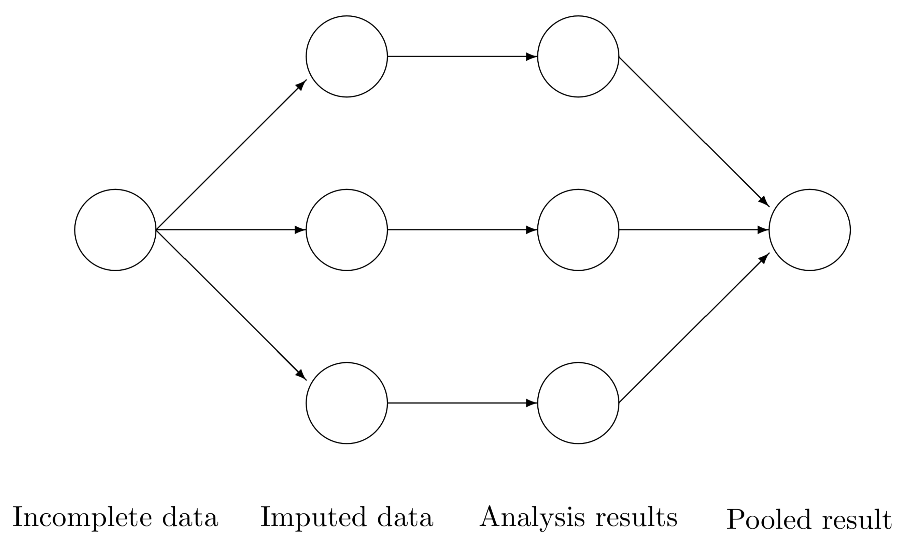



```{r echo=FALSE}
# Load required packages
library(tidyverse)
library(nycflights13)
library(mice)
```

## Today's Learning Goals

::: {.small-text}
By the end of this lecture, you should be able to:

- Identify and explain <span style="color: purple;">the three common types of missing data mechanisms</span>.
- Identify a potential consequence of <span style="color: purple;">removing missing data</span> on downstream analyses.
- Identify a potential consequence of a <span style="color: purple;">mean imputation method</span> on downstream analyses.
- Identify the four steps involved with a <span style="color: purple;">multiple imputation method</span> for handling missing data.
- Use the `{mice}` package in `R` to fit multiple imputed models.
:::

## Outline

1. Types of Missing Data
2. Handling Missing Data

## 1. Types of Missing Data

- In Statistics, there are three types of missing data:
  + **<span style="color: purple;">Missing completely at random (MCAR)</span>**.
  + **<span style="color: purple;">Missing at random (MAR)</span>**.
  + **<span style="color: purple;">Missing not at random (MNAR)</span>**.

. . .

- <span style="color: purple;">Proper identification</span> will determine the class of approach we will take to deal with missingness in any statistical analysis.

### 1.1. Missing Completely At Random (MCAR)

- In this type, missing data appear <span style="color: purple;">totally by chance</span>. 
- Hence, missingness is <span style="color: purple;">independent of the data</span>. 

. . .

- Roughly speaking, all our observations (<span style="color: purple;">rows in the dataset</span>) have the same chance of containing missing data (i.e., an `NA` in one of the columns).

> **Heads-up:** It is the ideal class of missing data since <span style="color: purple;">there is no missingness pattern</span>.

### Example

::: {.incremental}
- We are trying to count the number of car accidents in Vancouver. To do that, we are monitoring the traffic in <span style="color: purple;">100 strategic points of the city with cameras</span>. 
- Say that we count how many vehicles passed by each one of those cameras for every minute of the day. We have 101 <span style="color: purple;">variables</span>: `time`, `Camera_1`, ..., `Camera_100`. 
- Suppose that <span style="color: purple;">any camera</span> has a $1\%$ <span style="color: purple;">chance</span> of failing for <span style="color: purple;">any given minute</span>. If a camera fails, you get MCAR data for that minute.
:::

### 1.2. Missing At Random (MAR)

- In this type, <span style="color: purple;">missingness depends on the observed data we have</span>. 
- Therefore, we could use some imputation techniques for this missingness, such as <span style="color: purple;">multiple imputation</span> (**to be covered later on today**), based on the rest of our available data (a <span style="color: purple;">hot deck</span> imputation technique).

<center>        

</center>

### Example

::: {.incremental}
- Following up with the previous example, an external device is attached to the cameras to increase the image quality at low light situations (night time) <span style="color: purple;">and we have the recording time in our dataset</span>. 
- The external device is activated <span style="color: purple;">from 6 p.m. to 5 a.m.</span> However, the device has a $10\%$ <span style="color: purple;">chance</span> of not working in any given minute. 
- The chances are not the same for all the observations but depend on the data we observed, more specifically, <span style="color: purple;">night</span> `time`. 
:::

### 1.3. Missing Not At Random (MNAR)

- This is the most serious type of missingness since the MNAR data <span style="color: purple;">depends on unobservable quantities</span>.

. . .

**Example**

- With the previous example, <span style="color: purple;">if we did not record time</span>, we would be MNAR data since we do not have any other information rather than just the car count. 

- Another missingness cause of this type would be that, as the cameras get older, their probability of failure increases, <span style="color: purple;">but we cannot check this from our observed data</span>.

## 2. Handling Missing Data

- We will explore different techniques to impute missing data <span style="color: purple;">based on the type of missingness</span>.
  + Listwise deletion.
  + Mean imputation.
  + Regression imputation.
  + Last observation carried over.
  + Multiple imputation.

### 2.1. Listwise Deletion

::: {.small-text}
- It is the simplest way to deal with missing data.
- <span style="color: purple;">Is there any missing data in your row?</span> If yes, we just remove the row.
- If the data is MCAR, <span style="color: purple;">we are not introducing bias by removing the rows</span>. 
:::

. . . 

::: {.small-text}
- We can still get unbiased estimators for whichever our analysis is, such as <span style="color: purple;">regression coefficients</span>.
- We can also estimate the <span style="color: purple;">standard errors</span> correctly, but they will be higher than they could be since we discard incomplete observations.
:::

#### iClicker Question

Are these higher standard errors related to the MCAR nature of the deleted rows?

**A.** Yes.

**B.** No.

<center>        

</center>

### Today's Dataset

- Let us start with our lecture's toy dataset: the `flights` dataset from the package `{nycflights13}`. 
- It contains the <span style="color: purple;">on-time data</span> of 336,776 flights that departed New York City in 2013.

. . .

- We will use the following columns:
  + `dep_delay`: departure delays in minutes.
  + `arr_delay`: arrival delays in minutes.
  + `carrier`: two-letter carrier abbreviation.

### Descriptive statistics!

- We will try getting the mean `dep_delay` per `carrier,` but we have missing data in `dep_delay`, which will return a summary with `NA`s.

<center>        

</center>

---

```{webr}
#| autorun: true
flights |>
  group_by(carrier) |>
  summarise(dep_delay = mean(dep_delay)) |>
  mutate_if(is.numeric, round, 3)
```

### How to handle NA's?

- <span style="color: purple;">Assuming data is MCAR</span>, if we want to make a listwise deletion to get the means by `carrier`, we just use `na.rm = TRUE` in `mean()`.

<center>        

</center>

---

```{webr}
#| autorun: true
flights |>
  group_by(carrier) |>
  summarise(dep_delay = mean(dep_delay, na.rm = TRUE)) |>
  mutate_if(is.numeric, round, 2)
```


### Nonetheless...

::: {.incremental}
- We have to be careful. <span style="color: purple;">If the missing data in `flights` is not MCAR</span>, we can introduce serious bias in our estimates (means in this case) for some given statistical approach.
- <span style="color: purple;">But, why a bias?</span>
:::

<center>        

</center>

### Another Example

::: {.incremental}
- Suppose that people with low income have a higher chance of omitting their income (as a <span style="color: purple;">numeric variable</span>) in a given survey used for regression analysis. 
- Then, <span style="color: purple;">if we just drop those rows</span>, we are skewing our analysis towards people with higher income without knowing. So, **there will be a bias in our results in our regression estimates**.
:::

<center>        

</center>

#### iClicker Question

::: {.small-text}
- Let us retake the previous survey example regarding <span style="color: purple;">low-income respondents</span>. Suppose this survey collects <span style="color: purple;">additional information</span>, such as the respondent's specific neighbourhood, which is a complete column. 
- Then, you could <span style="color: purple;">match</span> this extra information with some other neighbourhood databases identifying low, middle, and high-income areas.
- What class of missing data are these *missing incomes* in the survey?

**A.** MCAR.

**B.** MAR.

**C.** MNAR.
:::

<center>        

</center>

### 2.2. Mean Imputation

::: {.small-text}
- The title is very suggestive. 
- Let us just use <span style="color: purple;">the mean of our variable of interest to impute the missing data</span>.
:::

. . .

::: {.small-text}
> **Heads-up:** This imputation technique can only be used with continuous and count-type variables!
:::

. . . 

::: {.small-text}
- Re-taking the `flights` dataset, <span style="color: purple;">for the exercise's sake</span> (not to be generalized to other data cases), we will filter those observations with `NA`s in `arr_delay` <span style="color: purple;">OR</span> `dep_delay` values larger than 100 minutes. 
- Then, we will only sample 1000 flights.
:::

### Sampling!

```{webr}
#| autorun: true
set.seed(123) # Reproducibility!
sampled_flights <- flights |>
  select(dep_delay, arr_delay) |>
  filter(is.na(arr_delay) | dep_delay > 100) |>
  sample_n(size = 1000)

head(sampled_flights, n = 8)
```

### Plot!

```{r}
#| echo: false
set.seed(123)
sampled_flights <- flights |>
  select(dep_delay, arr_delay) |>
  filter(is.na(arr_delay) | dep_delay > 100) |>
  sample_n(size = 1000)

scatterplot_flights <- sampled_flights |>
  ggplot(aes(dep_delay, arr_delay)) +
  geom_point(alpha = 0.7, size = 2.2) +
  ggtitle("Observed Data (Without NAs)") +
  geom_smooth(method = "lm", formula = y ~ x, se = FALSE, linewidth = 1.2) +
  theme(
    plot.title = element_text(size = 30, face = "bold"),
    axis.text = element_text(size = 27),
    axis.title = element_text(size = 27)
  ) +
  scale_x_continuous(breaks = seq(0, 500, 100)) +
  xlab("Departure Delay (min)") +
  ylab("Arrival Delay (min)")
```

```{r}
#| echo: false
#| fig.width: 20
#| fig.height: 10
suppressWarnings(suppressMessages(print(scatterplot_flights)))
```

### Heads-up!

- Note the condition `dep_delay > 100` is also depicted in the plot.
- The blue line is just the estimated Ordinary Least-squares (OLS) linear regression of `dep_delay` versus `arr_delay` <span style="color: purple;">with 593 complete observations</span>. 

. . .

- Nonetheless, since the conditional is `is.na(arr_delay) | dep_delay > 100` (i.e., <span style="color: purple;">OR</span>), <span style="color: purple;">we would eventually have an imputed subset of observations with negative `dep_delay`</span>, i.e., flights on time but missing `arr_delay`. 


### Note the pattern!

- This missigness pattern will provide a <span style="color: purple;">particular behaviour in our subsequent mean imputations</span>.

```{webr}
#| autorun: true
sampled_flights |> filter(is.na(arr_delay) & !is.na(dep_delay))
```

### Moving along!

- It is necessary to perform an <span style="color: purple;">exploratory data analysis (EDA)</span> on our data missingness. 
- We can use the function `md.pattern()` from the package `mice` to display missing data patterns.

---

```{webr}
#| autorun: true
md.pattern(sampled_flights)
```

### Therefore...

- We have 593 observations with non-missing data in both `dep_delay` and `arr_delay`, 53 with `arr_delay` missing, and 354 with both `dep_delay` and `arr_delay` missing. 

. . .

- The `md.pattern()` summary shows that our sample <span style="color: purple;">does NOT contain</span> observations where `dep_delay` is missing and `arr_delay` is present.
- Now, we will impute the overall means of `dep_delay` and `arr_delay`.

### Impute in `R`!

```{webr}
#| autorun: true
# Manually imputing the missing data.

sampled_flights_imputed <- sampled_flights |>
  mutate(flag = as_factor(if_else(is.na(dep_delay) | is.na(arr_delay), "missing", "observed"))) |>
  mutate(dep_delay = if_else(is.na(dep_delay), mean(dep_delay, na.rm = TRUE), dep_delay)) |>
  mutate(arr_delay = if_else(is.na(arr_delay), mean(arr_delay, na.rm = TRUE), arr_delay))
```

#### Now, using `mice()` from the mice package!

```{webr}
#| autorun: true
sampled_flights_imputed_mice <- mice(sampled_flights, m = 1, method = "mean", maxit = 1)

head(sampled_flights) # Checking first rows in our original sample.
head(sampled_flights_imputed_mice$where) # Checking logical flags for missing data in mice() object.

flag <- pmin(rowSums(sampled_flights_imputed_mice$where), 1) # Flag for imputed data.
flag <- if_else(flag == 0, "observed", "missing") # Flag for imputed data.
sampled_flights_imputed_mice <- mice::complete(sampled_flights_imputed_mice) |> mutate(flag = flag)
```

### Sanity check!

```{webr}
#| autorun: true
table(sampled_flights_imputed$flag)
table(sampled_flights_imputed_mice$flag)
```

### Plotting the imputed values!

- We will now plot the imputed values as purple points, and another estimated OLS linear regression in red with the $n = 1000$ sampled observations (non-imputed <span style="color: purple;">AND</span> imputed). 
- Note the horizontal pattern in the imputed purple points, which is the subset of observations with the <span style="color: purple;">particular behaviour we previously mentioned</span>.

### Plot!

```{r}
#| echo: false
#| include: false
sampled_flights_imputed_mice <- mice(sampled_flights, m = 1, method = "mean", maxit = 1)
flag <- pmin(rowSums(sampled_flights_imputed_mice$where), 1) # Flag for imputed data.
flag <- if_else(flag == 0, "observed", "missing") # Flag for imputed data.
sampled_flights_imputed_mice <- mice::complete(sampled_flights_imputed_mice) |> mutate(flag = flag)
```

```{r}
#| echo: false
## Plotting imputed versus observed.
scatterplot_flights <- sampled_flights_imputed_mice |>
  ggplot() + 
  geom_point(alpha = 0.7, aes(dep_delay, arr_delay, color = flag), size = 2.2) + 
  geom_smooth(aes(dep_delay, arr_delay), linewidth = 2, formula = y ~ x, color = "red", method ='lm', se = FALSE) +
  geom_smooth(aes(dep_delay, arr_delay), linewidth = 2, formula = y ~ x, method = "lm", data = sampled_flights, se = FALSE) + 
  scale_color_manual(values = c("purple", "black")) + 
  ggtitle("Imputed Fit (red) versus Observed Fit (blue)") +
theme(
    plot.title = element_text(size = 30, face = "bold"),
    axis.text = element_text(size = 27),
    axis.title = element_text(size = 27),
    legend.text = element_text(size = 27, margin = margin(r = 1, unit = "cm")),
    legend.title = element_text(size = 27, face = "bold")
  ) +
  scale_x_continuous(breaks = seq(0, 500, 100)) +
  xlab("Departure Delay (min)") +
  ylab("Arrival Delay (min)")
```


```{r}
#| echo: false
#| fig.width: 20
#| fig.height: 10
suppressWarnings(suppressMessages(print(scatterplot_flights)))
```

### Also...

- Notice that by imputing the mean, <span style="color: purple;">we are artificially reducing the standard deviation of our data</span> which is a drawback of mean imputation. 

```{webr}
#| autorun: true
# Standard deviation of the complete observed data.
sampled_flights |> na.omit() |> summarise_all(.funs = sd) |>
  mutate_if(is.numeric, round, 2)
```

### And...

```{webr}
#| autorun: true
# Standard deviation of all the data (imputed and non-imputed)
sampled_flights_imputed |> select(-flag) |> summarise_all(.funs = sd) |>
  mutate_if(is.numeric, round, 2)
```

### 2.3. Regression Imputation

- From the black points (<span style="color: purple;">complete observations</span>) in the previous plot, we can notice <span style="color: purple;">a clear positive relation between `arr_delay` changes with `dep_delay`</span>.
- Hence, why not using the estimated OLS linear regression in blue (<span style="color: purple;">fitted with those complete 593 observations</span>) to estimate those missing values?

. . .

- We can do it automatically via `mice()` using `method = "norm.predict"`.

### Code in `R`!

```{webr}
#| autorun: true
sampled_flights_imputed_reg <- mice(sampled_flights,
  method = "norm.predict",
  seed = 1, m = 1, print = FALSE
)
flag <- pmin(rowSums(sampled_flights_imputed_reg$where), 1) # Flag for imputed data.
flag <- if_else(flag == 0, "observed", "missing") # Flag for imputed data.
sampled_flights_imputed_reg <- complete(sampled_flights_imputed_reg) |> 
  mutate(flag = flag)

# Sanity check of amount of imputed values.
table(sampled_flights_imputed_reg$flag)
```

### Plot!

```{r}
#| echo: false
#| include: false

sampled_flights_imputed_reg <- mice(sampled_flights,
  method = "norm.predict",
  seed = 1, m = 1, print = FALSE
)
flag <- pmin(rowSums(sampled_flights_imputed_reg$where), 1) # Flag for imputed data.
flag <- if_else(flag == 0, "observed", "missing") # Flag for imputed data.
sampled_flights_imputed_reg <- complete(sampled_flights_imputed_reg) |> 
  mutate(flag = flag)

## Plotting imputed versus observed.
scatterplot_flights_reg <- sampled_flights_imputed_reg |> 
  ggplot() + 
  geom_point(alpha = 0.7, aes(dep_delay, arr_delay, color = flag), size = 2.2) + 
  geom_smooth(aes(dep_delay, arr_delay), linewidth = 2, formula = y ~ x, color = "red", method='lm', se = FALSE) +
  geom_smooth(aes(dep_delay, arr_delay), linewidth = 2, formula = y ~ x, method = "lm", data = sampled_flights, se = FALSE) + 
  scale_color_manual(values = c("purple", "black")) + 
  ggtitle("Imputed Fit (red) versus Observed Fit (blue)") +
theme(
    plot.title = element_text(size = 30, face = "bold"),
    axis.text = element_text(size = 27),
    axis.title = element_text(size = 27),
    legend.text = element_text(size = 27, margin = margin(r = 1, unit = "cm")),
    legend.title = element_text(size = 27, face = "bold")
  ) +
  scale_x_continuous(breaks = seq(0, 500, 100)) +
  xlab("Departure Delay (min)") +
  ylab("Arrival Delay (min)")
```

```{r}
#| echo: false
#| fig.width: 20
#| fig.height: 10
suppressWarnings(suppressMessages(print(scatterplot_flights_reg)))
```

### Note the following...

- All the purple points (imputed values) are on the imputed fit (red) line, <span style="color: purple;">which is now just an extension of the observed fit (blue) line</span>.
- Since the method imputes all the points perfectly in the regression line, <span style="color: purple;">we will reinforce the data's relationships</span>. For example, let us calculate the correlation of the imputed data vs the observed data.

### Correlations

```{webr}
#| autorun: true
# Only complete observations.
as_tibble(cor(sampled_flights, use = "complete.obs")) |>
  mutate_if(is.numeric, round, 2)
```


### Correlations (Cont'd)

```{webr}
#| autorun: true
# All observations (complete and imputed).
as_tibble(cor(sampled_flights_imputed_reg |> select(-flag))) %>%
  mutate_if(is.numeric, round, 2)
```

### 2.4. Last Observation Carried Over

- Another method that we might see out there is imputing data by repeating the previous observation. 
- This is more frequent when dealing with temporal data, <span style="color: purple;">and will be out of the scope of this course</span>.

<center>        

</center>

### 2.5. Multiple Imputation

:::: {.small-text}
- Having explored mean and regression imputations, let us proceed to a simulation-based method called <span style="color: purple;">multiple imputation</span>.
- We have seen that using a single value for the imputation causes problems, such as reducing our dataset variance. Then, a handy approach is the multiple imputation method. 
:::

. . .

:::: {.small-text}
- The idea here is, instead of imputing one value for missing data, we impute multiple values. <span style="color: purple;">But how can we do it?</span>
- We can do it via the `mice()` function, which offers this multiple imputation method. <span style="color: purple;">MICE</span> stands for <span style="color: purple;">Multiple Imputation by Chained Equations</span>.
:::


### Multiple Imputation in `R`!

::: {.small-text}
- Roughly speaking, for a data frame `data`, the four <span style="color: purple;">automatic steps</span> in this `R` function are the following:
:::

::: {.small-text}
::: {.incremental}
1. Create `m` copies of this dataset: `data_1`, `data_2`,..., `data_m`.
2. In each copy, impute the missing data with different values (the observed values will remain the same).
3. Carry out the analysis for each dataset separately. For example, <span style="color: purple;">fit an OLS linear regression model for each one of the datasets `data_1`, `data_2`,...,`data_m` when you have a continuous variable to impute</span>.
4. Combine the separate models into one final <span style="color: purple;">pooled model</span>.
:::
:::

### Workflow

::: {.small-text-v2}
- We would use our <span style="color: purple;">pooled model</span>, fitted with our response of interest subject to our regressor set, to answer our inferential or predictive inquiries. The below diagram provides a clearer perspective
:::

<center>

</center>

::: {.small-text-v2}
*Source: [van Buuren (2012)](https://stefvanbuuren.name/fimd/workflow.html).* 
:::

### Question!

- Now, how do we impute the missing data in step 2?
- By default, `mice()` implements the **predictive mean matching (PMM) found in [Rubin (1987)](https://gw2jh3xr2c.search.serialssolutions.com/log?L=GW2JH3XR2C&D=ZEEST&J=TC0000340639&P=Link&PT=EZProxy&H=6c88ebd0c3&U=https%3A%2F%2Fezproxy.library.ubc.ca%2Flogin%3Furl%3Dhttps%3A%2F%2Fonlinelibrary.wiley.com%2Fdoi%2Fbook%2F10.1002%2F9780470316696) on page 166**.
- **With two columns $X$ and $Y$** (where $X$ is complete and $Y$ has some rows with `NA`s), we follow an univariate Bayesian method.

### The Univariate Bayesian Method

::: {.small-text}
1. Estimate the OLS linear regression parameters $\hat{\beta}_0$, $\hat{\beta}_1$, and $\hat{\sigma^2}$ of the column where the missing values to impute are located (as the response, i.e., $Y$) versus the other complete column (as the regressor, $X$), **using the observed complete rows only (i.e., where $X$ and $Y$ are both present)**.
2. Draw $\beta_0^*$, $\beta_1^*$, and $\sigma^{2^*}$ using proper posterior distributions where the inputs are $\hat{\beta}_0$, $\hat{\beta}_1$, and $\hat{\sigma^2}$.
3. Compute the fitted values $\hat{y}_i^*$ for the column $Y$ in step (1): we use $\beta_0^*$ and $\beta_1^*$ **for both non-missing and missing rows**.
:::

### Cont'd

::: {.small-text}
4. For each fitted value $\hat{y}_i^*$ corresponding to those missing rows in $Y$, we find a given number of donors (5 by default in `mice()`) from all the $\hat{y}_i^*$ (corresponding to those non-missing rows in $Y$) which are the closest ones to each missing case.
5. We randomly select one of these donors (using its real observed value in $Y$!) to impute the corresponding missing value.
6. The process is repeated `m` times.

> Note that this algorithm also has a multivariate version where `NA`s can be present in more than one column. 
:::

### Implementation

- Let us implement this univariate process with `sampled_flights` with `m = 20`.

```{webr}
#| autorun: true
set.seed(123) # We are running a simulation, this we need to set a seed.
sampled_flights_imputed_PMM <- mice(sampled_flights, m = 20, printFlag = FALSE)
sampled_flights_imputed_PMM
```

### Code in `R`!

- We can check the imputed values for a specific column (e.g., `arr_delay`) in these 20 datasets as follows:

```{webr}
#| autorun: true
sampled_flights_imputed_PMM$imp$arr_delay
```

### Note the following...

- Each row corresponds to a missing observation in your original dataset. 
- The columns are the `m` imputed datasets that were created.
- We can get each one of the `m` imputed datasets with `complete()`.

```{webr}
# This is dataset number 3.
complete(sampled_flights_imputed_PMM, 3)
```

### Code in `R`!

We can plot the imputed dataset number 3 as follows:

```{webr}
#| autorun: true
sampled_flights_imputed_PMM_3 <- cbind(complete(sampled_flights_imputed_PMM, 3), sampled_flights_imputed$flag)
sampled_flights_imputed_PMM_3_plot <- sampled_flights_imputed_PMM_3 |>
  ggplot(aes(dep_delay, arr_delay)) +
  geom_point(aes(colour = flag), size = 2.2, alpha = 0.7) +
  scale_color_manual(values = c("purple", "black")) +
  theme(
    plot.title = element_text(size = 30, face = "bold"),
    axis.text = element_text(size = 27),
    axis.title = element_text(size = 27),
    legend.text = element_text(size = 27, margin = margin(r = 1, unit = "cm")),
    legend.title = element_text(size = 27, face = "bold")
  ) +
  scale_x_continuous(breaks = seq(0, 500, 100)) +
  xlab("Departure Delay (min)") +
  ylab("Arrival Delay (min)") +
  ggtitle("Complete (black) and Imputed (purple) Data")
```

### Plot!

```{r}
#| echo: false
#| include: false

set.seed(123) # We are running a simulation, this we need to set a seed.
sampled_flights_imputed_PMM <- mice(sampled_flights, m = 20, printFlag = FALSE)
sampled_flights_imputed_PMM

sampled_flights_imputed <- sampled_flights |>
  mutate(flag = as_factor(if_else(is.na(dep_delay) | is.na(arr_delay), "missing", "observed"))) |>
  mutate(dep_delay = if_else(is.na(dep_delay), mean(dep_delay, na.rm = TRUE), dep_delay)) |>
  mutate(arr_delay = if_else(is.na(arr_delay), mean(arr_delay, na.rm = TRUE), arr_delay))

```


```{r}
#| echo: false
#| fig.width: 20
#| fig.height: 10

sampled_flights_imputed_PMM_3 <- cbind(complete(sampled_flights_imputed_PMM, 3), sampled_flights_imputed$flag)
sampled_flights_imputed_PMM_3_plot <- sampled_flights_imputed_PMM_3 |>
  ggplot(aes(dep_delay, arr_delay)) +
  geom_point(aes(colour = flag), size = 2.2, alpha = 0.7) +
  scale_color_manual(values = c("purple", "black")) +
  theme(
    plot.title = element_text(size = 30, face = "bold"),
    axis.text = element_text(size = 27),
    axis.title = element_text(size = 27),
    legend.text = element_text(size = 27, margin = margin(r = 1, unit = "cm")),
    legend.title = element_text(size = 27, face = "bold")
  ) +
  scale_x_continuous(breaks = seq(0, 500, 100)) +
  xlab("Departure Delay (min)") +
  ylab("Arrival Delay (min)") +
  ggtitle("Complete (black) and Imputed (purple) Data")

suppressWarnings(suppressMessages(print(sampled_flights_imputed_PMM_3_plot)))
```

### Estimation

- Now, let us estimate an OLS linear regression for each one of the 20 imputed datasets in `sampled_flights_imputed_PMM`.

```{webr}
#| autorun: true
PMM_LR_models <- with(sampled_flights_imputed_PMM, lm(arr_delay ~ dep_delay))
print(PMM_LR_models)
```

### Then...

- We can access to each model separately as follows:

```{webr}
#| autorun: true
# Retrieving the third model.
PMM_LR_models$analyses[[3]]
```

### Finally...

- Let us combine the models altogether in a <span style="color: purple;">single pooled model</span>.

```{webr}
#| autorun: true
pooled_PMM_LR_model <- pool(PMM_LR_models)
print(pooled_PMM_LR_model)
```

### Overview

:::: {.small-text}
- The `estimate` column is just the averages of all `m` models. Full details about the computation on these columns are provided by [Rubin (1987)](https://gw2jh3xr2c.search.serialssolutions.com/log?L=GW2JH3XR2C&D=ZEEST&J=TC0000340639&P=Link&PT=EZProxy&H=6c88ebd0c3&U=https%3A%2F%2Fezproxy.library.ubc.ca%2Flogin%3Furl%3Dhttps%3A%2F%2Fonlinelibrary.wiley.com%2Fdoi%2Fbook%2F10.1002%2F9780470316696) on pages 76 and 77.
- The columns are explained as follows:
  + `estimate`: the average of the regression coefficients across `m` models.
  + `ubar`: the average variance (i.e., average `SE`^2) across `m` models.
  + `b`: the sample variance of the `m` regression coefficients.
  + `t`: a final estimate of the `SE`^2 of each regression coefficient. 
	  * = `ubar + (1 + 1/m) * b`
:::

### Overview (Cont'd)

::: {.small-text}

- `dfcom`: the degrees of freedom associated with the final regression coefficient estimates.
	- An `alpha`-level confidence interval: `estimate +/- qt(alpha/2, df) * sqrt(t)`.
- `riv`: the relative increase in variance due to randomness. 
	- = `t/ubar - 1`
- `lambda`: the proportion of total variance due to missingness.
- `fmi`: the fraction of missing information.

<span style="color: purple;">Where are the usual outputs (`std.error`, `p.value`,...)?</span>

:::


### Obtain summary

We can call `summary()` on the pooled model to obtain them.

```{webr}
#| autorun: true
summary(pooled_PMM_LR_model)
```

## 3. Wrapping Up

::: {.small-text}

- Data imputation involves some wrangling effort and proper missingness visualizations.

- We have to be careful when defining our class of data missingness since this will determine the type of data imputation we need to make (or maybe data deletion!).

- In general, <span style="color: purple;">multiple imputation will work OK for MAR and MNAR data.</span>

- We only saw continuous imputation in this example. Nonetheless, the `mice()` approach can be extended to other data types such as binary or categorical. In those cases, we have to switch to generalized linear models (GLMs), even with a Bayesian approach.

:::