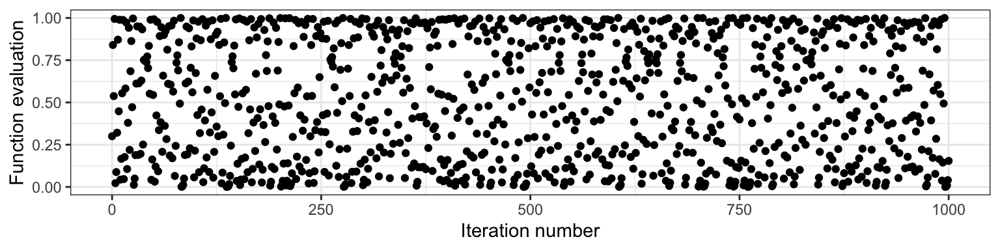
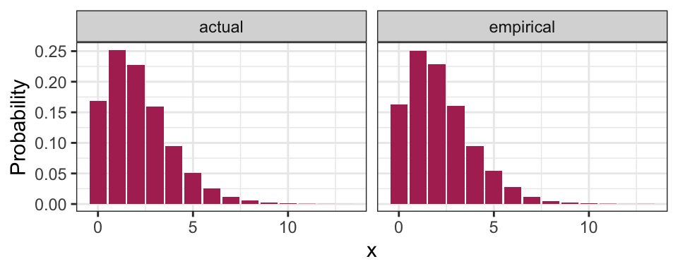
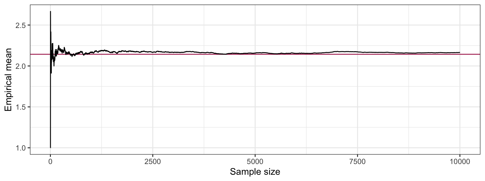
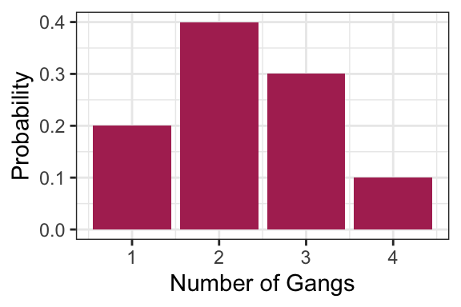
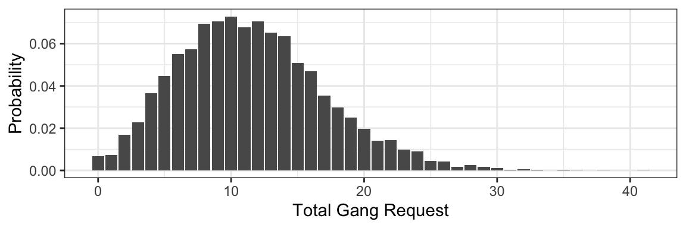

# Simulation

So far, we've seen many quantities that help us communicating an uncertain outcome:

- probability
- probability mass function
- odds
- mode
- entropy
- mean
- variance / standard deviation

Sometimes, it's not easy to compute these things. In these situations, we can use __simulation__ to approximate these and other quantities. This is today's topic.

Let's set up the workspace for this lecture:


```r
suppressPackageStartupMessages(library(tidyverse))
suppressPackageStartupMessages(library(reticulate))
suppressPackageStartupMessages(library(testthat))
```


```python
## Python:
import numpy as np
import scipy.stats
```


## Learning Objectives

From this lecture, students are expected to be able to:

- Generate a random sample from a discrete distribution in both R and python.
- Reproduce the same random sample each time you re-run your code in both R and python by setting the seed or random state. 
- Evaluate whether or not a set of observations are iid.
- Use simulation to approximate distribution properties (like mean and variance) using empirical quantities, especially for random variables involving multiple other random variables.

## Review Activity (15 min)

True or False?

1. In general, 9 parameters must be specified in order to fully describe a distribution with 9 outcomes. 
2. A Binomial distribution only has one mean, but there are many Binomial distributions that have the same mean.
3. A Poisson distribution only has one mean, but there are many Poisson distributions that have the same mean.
3. A Binomial distribution is also a Bernoulli distribution, but a Bernoulli distribution is not a Binomial distribution. 

## Random Samples: Terminology (5 min)

A __random sample__ is a collection of random outcomes/variables. Using symbols, a random sample of size $n$ is usually depicted as $X_1, \ldots, X_n$. We think of data as being a random sample. 

Some examples of random samples: 

- the first five items you get in a game of Mario Kart
- the outcomes of ten dice rolls
- the daily high temperature in Vancouver for each day in a year. 

A random sample is said to be __independent and identically distributed__ (or __iid__) if

1. each pair of observations are independent, and
2. each observation comes from the same distribution.

We'll define "independent" next class, but for now, you can think of this as meaning "not influencing each other". 

Sometimes, when an outcome is said to be __random__, this can either mean the outcome has some distribution (with non-zero entropy), or that is has the distribution with maximum entropy. To avoid confusion, the word __stochastic__ refers to the former (as having some uncertain outcome). For example, if a die is weighted so that "1" appears very often, would you call this die "random"? Whether or not you do, it's always _stochastic_. 

The opposite of stochastic is __deterministic__: an outcome that will be known with 100% certainty.


## Seeds (5 min)

Computers can't actually generate truly random outcomes. Instead, they use something called [pseudorandom numbers](https://en.wikipedia.org/wiki/Pseudorandom_number_generator). 

As an example of a basic algorithm that produces pseudo-random numbers between 0 and 1, consider starting with your choice of number $x_0$ between 0 and 1, and iterating the following equation: $$x_{i+1} = 4 x_i (1 - x_i).$$ The result will appear to be random numbers between 0 and 1. Here is the resulting sequence when we start with $x_0 = 0.3$ and iterate 1000 times:



Although this sequence is deterministic, it behaves like a random sample. But not entirely! All pseudorandom number generators have some pitfalls. In the case above, one pitfall is that neighbouring pairs are not independent from each other (by definition of the way the sequence was set up!). There are some sophisticated algorithms that produce outcomes that more closely resemble a random sample, so most of the time, we don't have to worry about the sample not being truly random.

The __seed__ (or __random state__) in a pseudo-random number generator is some pre-specified initial value that determines the generated sequence. As long as the seed remains the same, the resulting sample will also be the same. In the case above, this is $x_0 = 0.3$. In R and python, if we don't explicitly set the seed, then the seed will be chosen for us.

In R, we can set the seed using the `set.seed()` function, and in python, using the `numpy.random.seed()` function from `numpy`.

The seed gives us an added advantage over truly random numbers: it allows our analysis to be reproducible! If we explicitly set a seed, then someone who re-runs the analysis will get the same results. 

## Generating Random Samples: Code

Here, we'll look at some R and python functions that help us generate a random sample. We're still focussing on discrete distributions, here.

### From Finite Number of Categories (5 min)

In R, we can generate a random sample from a distribution with a finite number of outcomes using the [`sample()` function](https://www.rdocumentation.org/packages/base/versions/3.6.1/topics/sample):

- Put the outcomes as a vector in the first argument, `x`.
- Put the desired sample size in the argument `size`.
- Put `replace = TRUE` so that sampling can happen with replacement.
- Put the probabilities of the outcomes as a vector respective to `x` in the argument `prob`.
	- Just a warning: if these probabilities do not add up to 1, R will not throw an error. Instead, R automatically adjusts the probabilities so that they add up to 1. 

Here's an example of generating 10 items using the Mario Kart item distribution from Lecture 1. Notice that the seed is set, so that every time these lecture notes are rendered, the same results are obtained.


```r
set.seed(1)
outcomes <- c("banana", "bob-omb", "coin", "horn", "shell")
probs <- c(0.12, 0.05, 0.75, 0.03, 0.05)
n <- 10
sample(outcomes, size = n, replace = TRUE, prob = probs)
```

```
##  [1] "coin"    "coin"    "coin"    "bob-omb" "coin"    "bob-omb" "shell"  
##  [8] "coin"    "coin"    "coin"
```


In python, we can generate a random sample from a discrete distribution using the [`numpy.random.choice()` function](https://docs.scipy.org/doc/numpy-1.14.0/reference/generated/numpy.random.choice.html):

- Put the outcomes in the first argument, `a`.
- Put the desired sample size in the argument `size`.
- Put the probabilities of the outcomes respective to `x` in the argument `p`.

Using the Mario Kart example again:


```python
## Python:
np.random.seed(1)
outcomes = ["banana", "bob-omb", "coin", "horn", "shell"]
probs = [0.12, 0.05, 0.75, 0.03, 0.05]
n = 10
np.random.choice(outcomes, size = n, p = probs)
```

```
## array(['coin', 'coin', 'banana', 'coin', 'bob-omb', 'banana', 'coin',
##        'coin', 'coin', 'coin'],
##       dtype='<U7')
```

### From Distribution Families (5 min)

In R, we can generate data from a distribution belonging to some parametric family using the `rdist()` function, where "`dist`" is replaced with a short-form of the distribution family's name. We can access the corresponding pmf with `ddist()`.

In python, we can use the `stats` module from the `scipy` library.

The following table summarizes the functions related to the distribution famlies we've seen so far:

| Family | R function | python function |
|--------|------------|-----------------|
| Binomial          | `rbinom()`  | `scipy.stats.binom.rvs()` |
| Geometric         | `rgeom()`   | `scipy.stats.geom.rvs()` |
| Negative Binomial | `rnbinom()` | `scipy.stats.nbinom.rvs()` |
| Poisson           | `rpois()`   | `scipy.stats.poisson.rvs()` |

Here's how to use these functions:

- Sample size: 
	- For R, put this in the argument `n`, which comes first.
	- For python, put this in the argument `size`, which comes last. 
- In both languages, each parameter has its own argument. Sometimes, like in R's `rnbinom()`, there are more parameters than needed, giving the option of different parameterizations. Be sure to only specify the exact number of parameters required to isolate a member of the distribution family!

__Example__: Generate 10 observations from a binomial distribution with probability of success 0.6 and 5 trials.

Using R:


```r
rbinom(10, size = 5, prob = 0.6)
```

```
##  [1] 4 4 2 3 2 3 2 0 3 2
```

Using python:


```python
## Python:
scipy.stats.binom.rvs(n = 5, p = 0.6, size = 10)
```

```
## array([3, 2, 4, 2, 5, 3, 3, 3, 4, 4])
```

The Negative Binomial family is an example of a function in R that allows for a different parameterization. Notice that specifying too many or too few parameters results in an error (remember, we need to specify two parameters):


```r
rnbinom(10, size = 5)
```

```
## Error in rnbinom(10, size = 5): argument "prob" is missing, with no default
```

```r
rnbinom(10, size = 5, prob = 0.6, mu = 4)
```

```
## Error in rnbinom(10, size = 5, prob = 0.6, mu = 4): 'prob' and 'mu' both specified
```


## Running Simulations

So far, we've seen two ways to calculate quantities that help us communicate uncertainty (like means and probabilities):

1. The __distribution-based approach__ (using the distribution), resulting in _true values_.
2. The __empirical approach__ (using data), resulting in _approximate values_ that improve as the sample size increases.  

For example, the true mean of a random variable $X$ can be calculated as $E(X) = \sum_x x P(X = x)$ using each pair of outcome and outcome's probability, or can be approximated using the empirical approach from a random sample $X_1, \ldots, X_n$ by $E(X) \approx (1/n) \sum_{i=1}^n X_i$.

This means that we can approximate these quantities by generating a sample! An analysis that uses a randomly generated data set is called a __simulation__. 

### Code for empirical quantities (0 min)

For your reference, here are some hints for calculating empirical quantities using R. We'll be going over these below in the "Basic Simulation" section.

- `mean()` calculates the sample average.
- `var()` calculates the sample variance (the $n-1$ version, not $n$), and `sd()` its square root for the standard deviation.
- For a single probability, remember that a mean is just an average. Just calculate the mean of a condition.
- For an entire pmf, use the `table()` function, or more conveniently, the `janitor::tabyl()` function.
- For the mode, either get it manually using the `table()` or `janitor::tabyl()` function, or you can use `DescTools::Mode()`.

### Basic Simulation (10 min)

Consider playing games with probability of success $p=0.7$ until you experience $k=5$ successes, and counting the number of failures. This random variable (say $X$) has a Negative Binomial distribution. 

You can find an R script containing the code for the basic simulation [in the students' repo](https://github.ubc.ca/MDS-2019-20/DSCI_551_stat-prob-dsci_students/blob/master/supplementary/lec3-basic.R).

Let's demonstrate both a distribution-based and empirical approach to computing the variance and pmf. First, let's obtain our random sample (of, say, 10000 observations).


```r
set.seed(88)
k <- 5
p <- 0.7
n <- 10000
rand_sample <- rnbinom(n, size = 5, prob = 0.7)
head(rand_sample, 100)
```

```
##   [1] 1 1 6 2 0 3 3 3 2 1 2 5 1 1 1 3 1 1 1 2 2 1 1 7 1 1 3 5 0 4 0 5 1 1 4
##  [36] 1 1 1 2 6 3 2 5 3 1 2 0 2 2 1 1 4 0 0 5 5 2 7 0 0 1 0 3 1 3 2 0 2 2 0
##  [71] 3 1 0 5 4 0 1 3 2 1 2 1 1 2 2 1 0 1 4 4 2 2 4 1 2 4 3 4 1 1
```

#### Mean


```r
(1 - p) * k / p   # True, distribution-based
```

```
## [1] 2.142857
```

```r
mean(rand_sample) # Approximate, empirical
```

```
## [1] 2.1654
```

#### Variance


```r
(1 - p) * k / p^2 # True, distribution-based
```

```
## [1] 3.061224
```

```r
var(rand_sample)  # Approximate, empirical
```

```
## [1] 3.060549
```

#### Standard deviation


```r
sqrt((1 - p) * k / p^2) # True, distribution-based
```

```
## [1] 1.749636
```

```r
sd(rand_sample)         # Approximate, empirical
```

```
## [1] 1.749442
```

#### Probability of seeing 0


```r
mean(rand_sample == 0)         # Approximate, empirical
```

```
## [1] 0.163
```

```r
dnbinom(0, size = k, prob = p) # True, distribution-based
```

```
## [1] 0.16807
```

#### pmf


```r
## Code without using the tidyverse:
pmf <- janitor::tabyl(rand_sample)               # Empirical
pmf$n <- NULL
pmf <- setNames(pmf, c("x", "empirical"))
pmf$actual <- dnbinom(pmf$x, size = k, prob = p) # True

## Code using the tidyverse:
pmf <- janitor::tabyl(rand_sample) %>% 
	select(x = rand_sample, empirical = percent) %>% 
	mutate(actual = dnbinom(x, size = k, prob = p))
pmf %>% 
	mutate(actual    = round(actual, 4),         # Empirical
		   empirical = round(empirical, 4)) %>%  # True
	DT::datatable(rownames = FALSE)
```

<!--html_preserve--><div id="htmlwidget-faad8b20026647f5c8cc" style="width:100%;height:auto;" class="datatables html-widget"></div>
<script type="application/json" data-for="htmlwidget-faad8b20026647f5c8cc">{"x":{"filter":"none","data":[[0,1,2,3,4,5,6,7,8,9,10,11,12,13],[0.163,0.2506,0.2291,0.1601,0.0946,0.0544,0.0274,0.0118,0.005,0.0024,0.0008,0.0005,0.0001,0.0002],[0.1681,0.2521,0.2269,0.1588,0.0953,0.0515,0.0257,0.0121,0.0055,0.0024,0.001,0.0004,0.0002,0.0001]],"container":"<table class=\"display\">\n  <thead>\n    <tr>\n      <th>x<\/th>\n      <th>empirical<\/th>\n      <th>actual<\/th>\n    <\/tr>\n  <\/thead>\n<\/table>","options":{"columnDefs":[{"className":"dt-right","targets":[0,1,2]}],"order":[],"autoWidth":false,"orderClasses":false}},"evals":[],"jsHooks":[]}</script><!--/html_preserve-->

Here's a plot of the pmf:


```r
pmf %>% 
	gather(key = "method", value = "Probability", empirical, actual) %>% 
	ggplot(aes(x, Probability)) +
	facet_wrap(~ method) +
	geom_col(fill = "maroon") +
	theme_bw()
```



#### Entropy

It turns out to be hard to calculate the actual entropy, so we will only compute the empirical:


```r
- sum(pmf$empirical * log(pmf$empirical))
```

```
## [1] 1.858891
```

#### Mode 

feel free to just read from the table/plot if you aren't familiar with the R tidyverse.


```r
## Actual
pmf %>% 
	filter(actual == max(actual)) %>% 
	pull(x)
```

```
## [1] 1
```

```r
## Empirical
pmf %>% 
	filter(empirical == max(empirical)) %>% 
	pull(x)
```

```
## [1] 1
```

#### Distribution-based calculations on empirical pmf

What do you think you'll get if you use the definition of mean, variance, etc. _on the empirical distribution_? You get the empirical values! Here's an example with the mean -- notice that they are identical.


```r
sum(pmf$x * pmf$empirical)
```

```
## [1] 2.1654
```

```r
mean(rand_sample)
```

```
## [1] 2.1654
```

#### Law of Large Numbers

To demonstrate that the a larger sample size improves the approximation of the empirical quantities, let's see how the sample average changes as we collect more and more data:


```r
tibble(i    = 1:n, 
	   mean = cumsum(rand_sample) / i) %>% 
	ggplot(aes(i, mean)) +
	geom_hline(yintercept = (1 - p) * k / p,
			   colour = "maroon") +
	geom_line() +
	labs(x = "Sample size",
		 y = "Empirical mean") +
	theme_bw()
```



You can try this for yourself with [Chapter 1 -"expectation" in Seeing Theory ](https://seeing-theory.brown.edu/basic-probability/index.html).


### Multi-Step Simulations (10 min)

The simulation above was not all that useful, since we could calculate basically anything. Where it gets more interesting is when we want to calculate things for a random variable that transforms and/or combines multiple random variables.

The idea is that some random variables will have a distribution that depends on other random variables, but in a way that's explicit. For example, consider a random variable $T$ that we can obtain as follows. Take $X \sim \text{Poisson}(5)$, and then $T = \sum_{i = 1}^{X} D_i$, where each $D_i$ are iid with some specified distribution. In this case, to generate $T$, you would first need to generate $X$, then generate $X$ values of $D_i$, then sum those up to get $T$. This is the example we'll see here, but in general, you can have any number of dependencies, each component of which you would have to generate.

Consider an example that a Vancouver port faces with "gang demand". Whenever a ship arrives to the port of Vancouver, they request a certain number of "gangs" (groups of people) to help unload the ship. Let's suppose the number of gangs requested by a ship has the following distribution:


```r
gang <- 1:4
p <- c(0.2, 0.4, 0.3, 0.1)
tibble(
	gangs = gang,
	p     = p
) %>% 
	ggplot(aes(gangs, p)) +
	geom_col(fill = "maroon") +
	labs(x = "Number of Gangs",
		 y = "Probability") +
	theme_bw()
```



The following function sums up simulated gangs requested by a certain number of ships, with the above probability distribution as a default. As an example, check out the simulated gang request from 10 ships:


```r
#' Generate gang demand
#'
#' Simulates the number of gangs requested, if each ship
#' requests a random number of gangs.
#' 
#' @param n_ships Number of ships that are making demands
#' @param gangs Possible gang demands made by a ship.
#' @param prob Probabilities of gang demand corresponding to "gangs"
#' 
#' @return Number representing the total gang demand 
demand_gangs <- function(n_ships, gangs = gang, prob = p) {
	if (length(gangs) == 1) {
		gangs <- c(gangs, gangs)
		prob <- c(1,1)
	}
	requests <- sample(
		gangs, 
		size    = n_ships, 
		replace = TRUE, 
		prob    = prob
	)
	sum(requests)
}

test_that("demand_gangs output is as expected", {
	expect_identical(demand_gangs(0), 0L)
	expect_gte(demand_gangs(1), min(gang))
	expect_lte(demand_gangs(1), max(gang))
	expect_gte(demand_gangs(10), 10*min(gang))
	expect_lte(demand_gangs(10), 10*max(gang))
	expect_identical(length(demand_gangs(10)), 1L)
	expect_identical(demand_gangs(10, gangs = 2, prob = 1), 20)
})

demand_gangs(10)
```

```
## [1] 22
```

Now suppose that the number of ships that arrive on a given day follows the Poisson distribution with a mean of 5. What's the distribution of total gang request on a given day? Let's simulate the process to find out:

1. Generate arrival quantities for many days from the Poisson(5) distribution.
2. For each day, simulate total gang request for the simulated number of ships.
3. You now have your random sample -- compute things as you normally would.

Let's try this, obtaining a sample of 10000 days:


```r
n_days <- 10000
## Step 1: generate a bunch of ships arriving each day
arrivals <- rpois(n_days, lambda = 5)
## Step 2: Simulate total gang request on each day.
total_requests <- purrr::map_int(arrivals, demand_gangs)
## Step 3: Compute things like pmf, mean, variance:
tibble(x = total_requests) %>% 
	ggplot(aes(x, y = ..prop..)) +
	geom_bar() +
	labs(x = "Total Gang Request",
		 y = "Probability") +
	theme_bw()
```



```r
tibble(
	mean     = mean(total_requests),
	variance = var(total_requests)
) %>% 
	knitr::kable()
```

    mean   variance
--------  ---------
 11.5162   30.47739

### Mixture distributions

__Moved to a future lecture__.
