# Dependence

Today's topic is dependence, and in particular its implications in one variable informing us about another. We'll end off with the Multivariate Gaussian distribution. 

## Learning Objectives

From today's lecture, students are expected to be able to:

- Interpret a contour plot, especially as a bivariate density.
- Identify the relationship between two independent continuous random variables and their conditional distributions (given one of the two variables).
- Extract the information that a random variable $X$ holds about $Y$ by conditioning on $X$ and producing model functions.
- Compute marginal distributions and means using joint distributions, and especially using conditional distributions.
- Identify the direction of dependence from a contour plot of a joint density function.

__A note on plotting__: You will not be expected to make contour plots like you see in these lecture notes. That will be saved for next block in DSCI 531: Data Visualization I. 

## Drawing multidimensional functions (5 min)

Drawing a $d$-dimensional function requires $d+1$ dimensions, so we usually just draw 1-dimensional functions, and occasionally draw 2-dimensional functions, and almost never draw functions with $d>2$ inputs.

A common way to draw 2-dimensional functions is to use __contour plots__, but you can also think of the output dimension as coming _out of the page_.

Here are some examples of how to draw 2-dimensional functions: [in python](https://jakevdp.github.io/PythonDataScienceHandbook/04.04-density-and-contour-plots.html) and [in R](https://www.r-statistics.com/2016/07/using-2d-contour-plots-within-ggplot2-to-visualize-relationships-between-three-variables/).

Here's an example of a 3D drawing of a volcano (taken directly out of the example in the documentation of `rgl::surface3d()`):

<script>// To generate the help pages for this library, use
// jsdoc --destination ../../../doc/rglwidgetClass --template ~/node_modules/jsdoc-baseline rglClass.src.js
// To validate, use
// setwd(".../inst/htmlwidgets/lib/rglClass")
// hints <- js::jshint(readLines("rglClass.src.js"))
// hints[, c("line", "reason")]
/**
* The class of an rgl widget
* @class
*/
rglwidgetClass = function() {
this.canvas = null;
this.userMatrix = new CanvasMatrix4();
this.types = [];
this.prMatrix = new CanvasMatrix4();
this.mvMatrix = new CanvasMatrix4();
this.vp = null;
this.prmvMatrix = null;
this.origs = null;
this.gl = null;
this.scene = null;
this.select = {state: "inactive", subscene: null, region: {p1: {x:0, y:0}, p2: {x:0, y:0}}};
this.drawing = false;
};
/**
* Multiply matrix by vector
* @returns {number[]}
* @param M {number[][]} Left operand
* @param v {number[]} Right operand
*/
rglwidgetClass.prototype.multMV = function(M, v) {
return [ M.m11 * v[0] + M.m12 * v[1] + M.m13 * v[2] + M.m14 * v[3],
M.m21 * v[0] + M.m22 * v[1] + M.m23 * v[2] + M.m24 * v[3],
M.m31 * v[0] + M.m32 * v[1] + M.m33 * v[2] + M.m34 * v[3],
M.m41 * v[0] + M.m42 * v[1] + M.m43 * v[2] + M.m44 * v[3]
];
};
/**
* Multiply row vector by Matrix
* @returns {number[]}
* @param v {number[]} left operand
* @param M {number[][]} right operand
*/
rglwidgetClass.prototype.multVM = function(v, M) {
return [ M.m11 * v[0] + M.m21 * v[1] + M.m31 * v[2] + M.m41 * v[3],
M.m12 * v[0] + M.m22 * v[1] + M.m32 * v[2] + M.m42 * v[3],
M.m13 * v[0] + M.m23 * v[1] + M.m33 * v[2] + M.m43 * v[3],
M.m14 * v[0] + M.m24 * v[1] + M.m34 * v[2] + M.m44 * v[3]
];
};
/**
* Euclidean length of a vector
* @returns {number}
* @param v {number[]}
*/
rglwidgetClass.prototype.vlen = function(v) {
return Math.sqrt(this.dotprod(v, v));
};
/**
* Dot product of two vectors
* @instance rglwidgetClass
* @returns {number}
* @param a {number[]}
* @param b {number[]}
*/
rglwidgetClass.prototype.dotprod = function(a, b) {
return a[0]*b[0] + a[1]*b[1] + a[2]*b[2];
};
/**
* Cross product of two vectors
* @returns {number[]}
* @param a {number[]}
* @param b {number[]}
*/
rglwidgetClass.prototype.xprod = function(a, b) {
return [a[1]*b[2] - a[2]*b[1],
a[2]*b[0] - a[0]*b[2],
a[0]*b[1] - a[1]*b[0]];
};
/**
* Bind vectors or matrices by columns
* @returns {number[][]}
* @param a {number[]|number[][]}
* @param b {number[]|number[][]}
*/
rglwidgetClass.prototype.cbind = function(a, b) {
if (b.length < a.length)
b = this.repeatToLen(b, a.length);
else if (a.length < b.length)
a = this.repeatToLen(a, b.length);
return a.map(function(currentValue, index, array) {
return currentValue.concat(b[index]);
});
};
/**
* Swap elements
* @returns {any[]}
* @param a {any[]}
* @param i {number} Element to swap
* @param j {number} Other element to swap
*/
rglwidgetClass.prototype.swap = function(a, i, j) {
var temp = a[i];
a[i] = a[j];
a[j] = temp;
};
/**
* Flatten a matrix into a vector
* @returns {any[]}
* @param a {any[][]}
*/
rglwidgetClass.prototype.flatten = function(arr, result) {
var value;
if (typeof result === "undefined") result = [];
for (var i = 0, length = arr.length; i < length; i++) {
value = arr[i];
if (Array.isArray(value)) {
this.flatten(value, result);
} else {
result.push(value);
}
}
return result;
};
/**
* set element of 1d or 2d array as if it was flattened.
* Column major, zero based!
* @returns {any[]|any[][]}
* @param {any[]|any[][]} a - array
* @param {number} i - element
* @param {any} value
*/
rglwidgetClass.prototype.setElement = function(a, i, value) {
if (Array.isArray(a[0])) {
var dim = a.length,
col = Math.floor(i/dim),
row = i % dim;
a[row][col] = value;
} else {
a[i] = value;
}
};
/**
* Transpose an array
* @returns {any[][]}
* @param {any[][]} a
*/
rglwidgetClass.prototype.transpose = function(a) {
var newArray = [],
n = a.length,
m = a[0].length,
i;
for(i = 0; i < m; i++){
newArray.push([]);
}
for(i = 0; i < n; i++){
for(var j = 0; j < m; j++){
newArray[j].push(a[i][j]);
}
}
return newArray;
};
/**
* Calculate sum of squares of a numeric vector
* @returns {number}
* @param {number[]} x
*/
rglwidgetClass.prototype.sumsq = function(x) {
var result = 0, i;
for (i=0; i < x.length; i++)
result += x[i]*x[i];
return result;
};
/**
* Convert a matrix to a CanvasMatrix4
* @returns {CanvasMatrix4}
* @param {number[][]|number[]} mat
*/
rglwidgetClass.prototype.toCanvasMatrix4 = function(mat) {
if (mat instanceof CanvasMatrix4)
return mat;
var result = new CanvasMatrix4();
mat = this.flatten(this.transpose(mat));
result.load(mat);
return result;
};
/**
* Convert an R-style numeric colour string to an rgb vector
* @returns {number[]}
* @param {string} s
*/
rglwidgetClass.prototype.stringToRgb = function(s) {
s = s.replace("#", "");
var bigint = parseInt(s, 16);
return [((bigint >> 16) & 255)/255,
((bigint >> 8) & 255)/255,
(bigint & 255)/255];
};
/**
* Take a component-by-component product of two 3 vectors
* @returns {number[]}
* @param {number[]} x
* @param {number[]} y
*/
rglwidgetClass.prototype.componentProduct = function(x, y) {
if (typeof y === "undefined") {
this.alertOnce("Bad arg to componentProduct");
}
var result = new Float32Array(3), i;
for (i = 0; i<3; i++)
result[i] = x[i]*y[i];
return result;
};
/**
* Get next higher power of two
* @returns { number }
* @param { number } value - input value
*/
rglwidgetClass.prototype.getPowerOfTwo = function(value) {
var pow = 1;
while(pow<value) {
pow *= 2;
}
return pow;
};
/**
* Unique entries
* @returns { any[] }
* @param { any[] } arr - An array
*/
rglwidgetClass.prototype.unique = function(arr) {
arr = [].concat(arr);
return arr.filter(function(value, index, self) {
return self.indexOf(value) === index;
});
};
/**
* Shallow compare of arrays
* @returns { boolean }
* @param { any[] } a - An array
* @param { any[] } b - Another array
*/
rglwidgetClass.prototype.equalArrays = function(a, b) {
return a === b || (a && b &&
a.length === b.length &&
a.every(function(v, i) {return v === b[i];}));
};
/**
* Repeat an array to a desired length
* @returns {any[]}
* @param {any | any[]} arr The input array
* @param {number} len The desired output length
*/
rglwidgetClass.prototype.repeatToLen = function(arr, len) {
arr = [].concat(arr);
while (arr.length < len/2)
arr = arr.concat(arr);
return arr.concat(arr.slice(0, len - arr.length));
};
/**
* Give a single alert message, not to be repeated.
* @param {string} msg  The message to give.
*/
rglwidgetClass.prototype.alertOnce = function(msg) {
if (typeof this.alerted !== "undefined")
return;
this.alerted = true;
alert(msg);
};
rglwidgetClass.prototype.f_is_lit = 1;
rglwidgetClass.prototype.f_is_smooth = 2;
rglwidgetClass.prototype.f_has_texture = 4;
rglwidgetClass.prototype.f_depth_sort = 8;
rglwidgetClass.prototype.f_fixed_quads = 16;
rglwidgetClass.prototype.f_is_transparent = 32;
rglwidgetClass.prototype.f_is_lines = 64;
rglwidgetClass.prototype.f_sprites_3d = 128;
rglwidgetClass.prototype.f_sprite_3d = 256;
rglwidgetClass.prototype.f_is_subscene = 512;
rglwidgetClass.prototype.f_is_clipplanes = 1024;
rglwidgetClass.prototype.f_fixed_size = 2048;
rglwidgetClass.prototype.f_is_points = 4096;
rglwidgetClass.prototype.f_is_twosided = 8192;
rglwidgetClass.prototype.f_fat_lines = 16384;
rglwidgetClass.prototype.f_is_brush = 32768;
/**
* Which list does a particular id come from?
* @returns { string }
* @param {number} id The id to look up.
*/
rglwidgetClass.prototype.whichList = function(id) {
var obj = this.getObj(id),
flags = obj.flags;
if (obj.type === "light")
return "lights";
if (flags & this.f_is_subscene)
return "subscenes";
if (flags & this.f_is_clipplanes)
return "clipplanes";
if (flags & this.f_is_transparent)
return "transparent";
return "opaque";
};
/**
* Get an object by id number.
* @returns { Object }
* @param {number} id
*/
rglwidgetClass.prototype.getObj = function(id) {
if (typeof id !== "number") {
this.alertOnce("getObj id is "+typeof id);
}
return this.scene.objects[id];
};
/**
* Get ids of a particular type from a subscene or the whole scene
* @returns { number[] }
* @param {string} type What type of object?
* @param {number} subscene  Which subscene?  If not given, find in the whole scene
*/
rglwidgetClass.prototype.getIdsByType = function(type, subscene) {
var
result = [], i, self = this;
if (typeof subscene === "undefined") {
Object.keys(this.scene.objects).forEach(
function(key) {
key = parseInt(key, 10);
if (self.getObj(key).type === type)
result.push(key);
});
} else {
ids = this.getObj(subscene).objects;
for (i=0; i < ids.length; i++) {
if (this.getObj(ids[i]).type === type) {
result.push(ids[i]);
}
}
}
return result;
};
/**
* Get a particular material property for an id
* @returns { any }
* @param {number} id  Which object?
* @param {string} property Which material property?
*/
rglwidgetClass.prototype.getMaterial = function(id, property) {
var obj = this.getObj(id), mat;
if (typeof obj.material === "undefined")
console.error("material undefined");
mat = obj.material[property];
if (typeof mat === "undefined")
mat = this.scene.material[property];
return mat;
};
/**
* Is a particular id in a subscene?
* @returns { boolean }
* @param {number} id Which id?
* @param {number} subscene Which subscene id?
*/
rglwidgetClass.prototype.inSubscene = function(id, subscene) {
return this.getObj(subscene).objects.indexOf(id) > -1;
};
/**
* Add an id to a subscene.
* @param {number} id Which id?
* @param {number} subscene Which subscene id?
*/
rglwidgetClass.prototype.addToSubscene = function(id, subscene) {
var thelist,
thesub = this.getObj(subscene),
ids = [id],
obj = this.getObj(id), i;
if (typeof obj != "undefined" && typeof (obj.newIds) !== "undefined") {
ids = ids.concat(obj.newIds);
}
thesub.objects = [].concat(thesub.objects);
for (i = 0; i < ids.length; i++) {
id = ids[i];
if (thesub.objects.indexOf(id) == -1) {
thelist = this.whichList(id);
thesub.objects.push(id);
thesub[thelist].push(id);
}
}
};
/**
* Delete an id from a subscene
* @param { number } id - the id to add
* @param { number } subscene - the id of the subscene
*/
rglwidgetClass.prototype.delFromSubscene = function(id, subscene) {
var thelist,
thesub = this.getObj(subscene),
obj = this.getObj(id),
ids = [id], i;
if (typeof obj !== "undefined" && typeof (obj.newIds) !== "undefined")
ids = ids.concat(obj.newIds);
thesub.objects = [].concat(thesub.objects); // It might be a scalar
for (j=0; j<ids.length;j++) {
id = ids[j];
i = thesub.objects.indexOf(id);
if (i > -1) {
thesub.objects.splice(i, 1);
thelist = this.whichList(id);
i = thesub[thelist].indexOf(id);
thesub[thelist].splice(i, 1);
}
}
};
/**
* Set the ids in a subscene
* @param { number[] } ids - the ids to set
* @param { number } subsceneid - the id of the subscene
*/
rglwidgetClass.prototype.setSubsceneEntries = function(ids, subsceneid) {
var sub = this.getObj(subsceneid);
sub.objects = ids;
this.initSubscene(subsceneid);
};
/**
* Get the ids in a subscene
* @returns {number[]}
* @param { number } subscene - the id of the subscene
*/
rglwidgetClass.prototype.getSubsceneEntries = function(subscene) {
return this.getObj(subscene).objects;
};
/**
* Get the ids of the subscenes within a subscene
* @returns { number[] }
* @param { number } subscene - the id of the subscene
*/
rglwidgetClass.prototype.getChildSubscenes = function(subscene) {
return this.getObj(subscene).subscenes;
};
/**
* Start drawing
* @returns { boolean } Previous state
*/
rglwidgetClass.prototype.startDrawing = function() {
var value = this.drawing;
this.drawing = true;
return value;
};
/**
* Stop drawing and check for context loss
* @param { boolean } saved - Previous state
*/
rglwidgetClass.prototype.stopDrawing = function(saved) {
this.drawing = saved;
if (!saved && this.gl && this.gl.isContextLost())
this.restartCanvas();
};
/**
* Generate the vertex shader for an object
* @returns {string}
* @param { number } id - Id of object
*/
rglwidgetClass.prototype.getVertexShader = function(id) {
var obj = this.getObj(id),
userShader = obj.userVertexShader,
flags = obj.flags,
type = obj.type,
is_lit = flags & this.f_is_lit,
has_texture = flags & this.f_has_texture,
fixed_quads = flags & this.f_fixed_quads,
sprites_3d = flags & this.f_sprites_3d,
sprite_3d = flags & this.f_sprite_3d,
nclipplanes = this.countClipplanes(),
fixed_size = flags & this.f_fixed_size,
is_points = flags & this.f_is_points,
is_twosided = flags & this.f_is_twosided,
fat_lines = flags & this.f_fat_lines,
is_brush = flags & this.f_is_brush,
result;
if (type === "clipplanes" || sprites_3d) return;
if (typeof userShader !== "undefined") return userShader;
result = "  /* ****** "+type+" object "+id+" vertex shader ****** */\n"+
"  attribute vec3 aPos;\n"+
"  attribute vec4 aCol;\n"+
" uniform mat4 mvMatrix;\n"+
" uniform mat4 prMatrix;\n"+
" varying vec4 vCol;\n"+
" varying vec4 vPosition;\n";
if ((is_lit && !fixed_quads && !is_brush) || sprite_3d)
result = result + "  attribute vec3 aNorm;\n"+
" uniform mat4 normMatrix;\n"+
" varying vec3 vNormal;\n";
if (has_texture || type === "text")
result = result + " attribute vec2 aTexcoord;\n"+
" varying vec2 vTexcoord;\n";
if (fixed_size)
result = result + "  uniform vec2 textScale;\n";
if (fixed_quads)
result = result + "  attribute vec2 aOfs;\n";
else if (sprite_3d)
result = result + "  uniform vec3 uOrig;\n"+
"  uniform float uSize;\n"+
"  uniform mat4 usermat;\n";
if (is_twosided)
result = result + "  attribute vec3 aPos1;\n"+
"  attribute vec3 aPos2;\n"+
"  varying float normz;\n";
if (fat_lines) {
result = result +   "  attribute vec3 aNext;\n"+
"  attribute vec2 aPoint;\n"+
"  varying vec2 vPoint;\n"+
"  varying float vLength;\n"+
"  uniform float uAspect;\n"+
"  uniform float uLwd;\n";
}
result = result + "  void main(void) {\n";
if ((nclipplanes || (!fixed_quads && !sprite_3d)) && !is_brush)
result = result + "    vPosition = mvMatrix * vec4(aPos, 1.);\n";
if (!fixed_quads && !sprite_3d && !is_brush)
result = result + "    gl_Position = prMatrix * vPosition;\n";
if (is_points) {
var size = this.getMaterial(id, "size");
result = result + "    gl_PointSize = "+size.toFixed(1)+";\n";
}
result = result + "    vCol = aCol;\n";
if (is_lit && !fixed_quads && !sprite_3d && !is_brush)
result = result + "    vNormal = normalize((normMatrix * vec4(aNorm, 1.)).xyz);\n";
if (has_texture || type == "text")
result = result + "    vTexcoord = aTexcoord;\n";
if (fixed_size)
result = result + "    vec4 pos = prMatrix * mvMatrix * vec4(aPos, 1.);\n"+
"   pos = pos/pos.w;\n"+
"   gl_Position = pos + vec4(aOfs*textScale, 0.,0.);\n";
if (type == "sprites" && !fixed_size)
result = result + "    vec4 pos = mvMatrix * vec4(aPos, 1.);\n"+
"   pos = pos/pos.w + vec4(aOfs, 0., 0.);\n"+
"   gl_Position = prMatrix*pos;\n";
if (sprite_3d)
result = result + "   vNormal = normalize((normMatrix * vec4(aNorm, 1.)).xyz);\n"+
"   vec4 pos = mvMatrix * vec4(uOrig, 1.);\n"+
"   vPosition = pos/pos.w + vec4(uSize*(vec4(aPos, 1.)*usermat).xyz,0.);\n"+
"   gl_Position = prMatrix * vPosition;\n";
if (is_twosided)
result = result + "   vec4 pos1 = prMatrix*(mvMatrix*vec4(aPos1, 1.));\n"+
"   pos1 = pos1/pos1.w - gl_Position/gl_Position.w;\n"+
"   vec4 pos2 = prMatrix*(mvMatrix*vec4(aPos2, 1.));\n"+
"   pos2 = pos2/pos2.w - gl_Position/gl_Position.w;\n"+
"   normz = pos1.x*pos2.y - pos1.y*pos2.x;\n";
if (fat_lines) 
/* This code was inspired by Matt Deslauriers' code in https://mattdesl.svbtle.com/drawing-lines-is-hard */
result = result + "   vec2 aspectVec = vec2(uAspect, 1.0);\n"+
"   mat4 projViewModel = prMatrix * mvMatrix;\n"+
"   vec4 currentProjected = projViewModel * vec4(aPos, 1.0);\n"+
"   currentProjected = currentProjected/currentProjected.w;\n"+
"   vec4 nextProjected = projViewModel * vec4(aNext, 1.0);\n"+
"   vec2 currentScreen = currentProjected.xy * aspectVec;\n"+
"   vec2 nextScreen = (nextProjected.xy / nextProjected.w) * aspectVec;\n"+
"   float len = uLwd;\n"+
"   vec2 dir = vec2(1.0, 0.0);\n"+
"   vPoint = aPoint;\n"+
"   vLength = length(nextScreen - currentScreen)/2.0;\n"+
"   vLength = vLength/(vLength + len);\n"+
"   if (vLength > 0.0) {\n"+
"     dir = normalize(nextScreen - currentScreen);\n"+
"   }\n"+
"   vec2 normal = vec2(-dir.y, dir.x);\n"+
"   dir.x /= uAspect;\n"+
"   normal.x /= uAspect;\n"+
"   vec4 offset = vec4(len*(normal*aPoint.x*aPoint.y - dir), 0.0, 0.0);\n"+
"   gl_Position = currentProjected + offset;\n";
if (is_brush)
result = result + "   gl_Position = vec4(aPos, 1.);\n";
result = result + "  }\n";
// console.log(result);
return result;
};
/**
* Generate the fragment shader for an object
* @returns {string}
* @param { number } id - Id of object
*/
rglwidgetClass.prototype.getFragmentShader = function(id) {
var obj = this.getObj(id),
userShader = obj.userFragmentShader,
flags = obj.flags,
type = obj.type,
is_lit = flags & this.f_is_lit,
has_texture = flags & this.f_has_texture,
fixed_quads = flags & this.f_fixed_quads,
sprites_3d = flags & this.f_sprites_3d,
is_twosided = (flags & this.f_is_twosided) > 0,
fat_lines = flags & this.f_fat_lines,
is_transparent = flags & this.f_is_transparent,
nclipplanes = this.countClipplanes(), i,
texture_format, nlights,
result;
if (type === "clipplanes" || sprites_3d) return;
if (typeof userShader !== "undefined") return userShader;
if (has_texture)
texture_format = this.getMaterial(id, "textype");
result = "/* ****** "+type+" object "+id+" fragment shader ****** */\n"+
"#ifdef GL_ES\n"+
"#ifdef GL_FRAGMENT_PRECISION_HIGH\n"+
"  precision highp float;\n"+
"#else\n"+
"  precision mediump float;\n"+
"#endif\n"+
"#endif\n"+
"  varying vec4 vCol; // carries alpha\n"+
"  varying vec4 vPosition;\n";
if (has_texture || type === "text")
result = result + "  varying vec2 vTexcoord;\n"+
" uniform sampler2D uSampler;\n";
if (is_lit && !fixed_quads)
result = result + "  varying vec3 vNormal;\n";
for (i = 0; i < nclipplanes; i++)
result = result + "  uniform vec4 vClipplane"+i+";\n";
if (is_lit) {
nlights = this.countLights();
if (nlights)
result = result + "  uniform mat4 mvMatrix;\n";
else
is_lit = false;
}
if (is_lit) {
result = result + "   uniform vec3 emission;\n"+
"   uniform float shininess;\n";
for (i=0; i < nlights; i++) {
result = result + "   uniform vec3 ambient" + i + ";\n"+
"   uniform vec3 specular" + i +"; // light*material\n"+
"   uniform vec3 diffuse" + i + ";\n"+
"   uniform vec3 lightDir" + i + ";\n"+
"   uniform bool viewpoint" + i + ";\n"+
"   uniform bool finite" + i + ";\n";
}
}
if (is_twosided)
result = result + "   uniform bool front;\n"+
"   varying float normz;\n";
if (fat_lines)
result = result + "   varying vec2 vPoint;\n"+
"   varying float vLength;\n";
result = result + "  void main(void) {\n";
if (fat_lines) {
result = result + "    vec2 point = vPoint;\n"+
"    bool neg = point.y < 0.0;\n"+
"    point.y = neg ? "+
"      (point.y + vLength)/(1.0 - vLength) :\n"+
"     -(point.y - vLength)/(1.0 - vLength);\n";
if (is_transparent && type == "linestrip")
result = result+"    if (neg && length(point) <= 1.0) discard;\n";
result = result + "    point.y = min(point.y, 0.0);\n"+
"    if (length(point) > 1.0) discard;\n";
}
for (i=0; i < nclipplanes;i++)
result = result + "    if (dot(vPosition, vClipplane"+i+") < 0.0) discard;\n";
if (fixed_quads) {
result = result +   "    vec3 n = vec3(0., 0., 1.);\n";
} else if (is_lit) {
result = result +   "    vec3 n = normalize(vNormal);\n";
}
if (is_twosided) {
result = result +   "    if ((normz <= 0.) != front) discard;\n";
}
if (is_lit) {
result = result + "    vec3 eye = normalize(-vPosition.xyz);\n"+
"   vec3 lightdir;\n"+
"   vec4 colDiff;\n"+
"   vec3 halfVec;\n"+
"   vec4 lighteffect = vec4(emission, 0.);\n"+
"   vec3 col;\n"+
"   float nDotL;\n";
if (!fixed_quads) {
result = result +   "   n = -faceforward(n, n, eye);\n";
}
for (i=0; i < nlights; i++) {
result = result + "   colDiff = vec4(vCol.rgb * diffuse" + i + ", vCol.a);\n"+
"   lightdir = lightDir" + i + ";\n"+
"   if (!viewpoint" + i +")\n"+
"     lightdir = (mvMatrix * vec4(lightdir, 1.)).xyz;\n"+
"   if (!finite" + i + ") {\n"+
"     halfVec = normalize(lightdir + eye);\n"+
"   } else {\n"+
"     lightdir = normalize(lightdir - vPosition.xyz);\n"+
"     halfVec = normalize(lightdir + eye);\n"+
"   }\n"+
"    col = ambient" + i + ";\n"+
"   nDotL = dot(n, lightdir);\n"+
"   col = col + max(nDotL, 0.) * colDiff.rgb;\n"+
"   col = col + pow(max(dot(halfVec, n), 0.), shininess) * specular" + i + ";\n"+
"   lighteffect = lighteffect + vec4(col, colDiff.a);\n";
}
} else {
result = result +   "   vec4 colDiff = vCol;\n"+
"    vec4 lighteffect = colDiff;\n";
}
if (type === "text")
result = result +   "    vec4 textureColor = lighteffect*texture2D(uSampler, vTexcoord);\n";
if (has_texture) {
result = result + {
rgb:            "   vec4 textureColor = lighteffect*vec4(texture2D(uSampler, vTexcoord).rgb, 1.);\n",
rgba:           "   vec4 textureColor = lighteffect*texture2D(uSampler, vTexcoord);\n",
alpha:          "   vec4 textureColor = texture2D(uSampler, vTexcoord);\n"+
"   float luminance = dot(vec3(1.,1.,1.), textureColor.rgb)/3.;\n"+
"   textureColor =  vec4(lighteffect.rgb, lighteffect.a*luminance);\n",
luminance:      "   vec4 textureColor = vec4(lighteffect.rgb*dot(texture2D(uSampler, vTexcoord).rgb, vec3(1.,1.,1.))/3., lighteffect.a);\n",
"luminance.alpha":"    vec4 textureColor = texture2D(uSampler, vTexcoord);\n"+
"   float luminance = dot(vec3(1.,1.,1.),textureColor.rgb)/3.;\n"+
"   textureColor = vec4(lighteffect.rgb*luminance, lighteffect.a*textureColor.a);\n"
}[texture_format]+
"   gl_FragColor = textureColor;\n";
} else if (type === "text") {
result = result +   "    if (textureColor.a < 0.1)\n"+
"     discard;\n"+
"   else\n"+
"     gl_FragColor = textureColor;\n";
} else
result = result +   "   gl_FragColor = lighteffect;\n";
//if (fat_lines)
//  result = result +   "   gl_FragColor = vec4(0.0, abs(point.x), abs(point.y), 1.0);"
result = result + "  }\n";
// console.log(result);
return result;
};
/**
* Call gl functions to create and compile shader
* @returns {Object}
* @param { number } shaderType - gl code for shader type
* @param { string } code - code for the shader
*/
rglwidgetClass.prototype.getShader = function(shaderType, code) {
var gl = this.gl, shader;
shader = gl.createShader(shaderType);
gl.shaderSource(shader, code);
gl.compileShader(shader);
if (!gl.getShaderParameter(shader, gl.COMPILE_STATUS) && !gl.isContextLost())
alert(gl.getShaderInfoLog(shader));
return shader;
};
/**
* Handle a texture after its image has been loaded
* @param { Object } texture - the gl texture object
* @param { Object } textureCanvas - the canvas holding the image
*/
rglwidgetClass.prototype.handleLoadedTexture = function(texture, textureCanvas) {
var gl = this.gl || this.initGL();
gl.pixelStorei(gl.UNPACK_FLIP_Y_WEBGL, true);
gl.bindTexture(gl.TEXTURE_2D, texture);
gl.texImage2D(gl.TEXTURE_2D, 0, gl.RGBA, gl.RGBA, gl.UNSIGNED_BYTE, textureCanvas);
gl.texParameteri(gl.TEXTURE_2D, gl.TEXTURE_MAG_FILTER, gl.LINEAR);
gl.texParameteri(gl.TEXTURE_2D, gl.TEXTURE_MIN_FILTER, gl.LINEAR_MIPMAP_NEAREST);
gl.generateMipmap(gl.TEXTURE_2D);
gl.bindTexture(gl.TEXTURE_2D, null);
};
/**
* Get maximum dimension of texture in current browser.
* @returns {number}
*/
rglwidgetClass.prototype.getMaxTexSize = function() {
var gl = this.gl || this.initGL();	
return Math.min(4096, gl.getParameter(gl.MAX_TEXTURE_SIZE));
};
/**
* Load an image to a texture
* @param { string } uri - The image location
* @param { Object } texture - the gl texture object
*/
rglwidgetClass.prototype.loadImageToTexture = function(uri, texture) {
var canvas = this.textureCanvas,
ctx = canvas.getContext("2d"),
image = new Image(),
self = this;
image.onload = function() {
var w = image.width,
h = image.height,
canvasX = self.getPowerOfTwo(w),
canvasY = self.getPowerOfTwo(h),
gl = self.gl || self.initGL(),
maxTexSize = self.getMaxTexSize();
while (canvasX > 1 && canvasY > 1 && (canvasX > maxTexSize || canvasY > maxTexSize)) {
canvasX /= 2;
canvasY /= 2;
}
canvas.width = canvasX;
canvas.height = canvasY;
ctx.imageSmoothingEnabled = true;
ctx.drawImage(image, 0, 0, canvasX, canvasY);
self.handleLoadedTexture(texture, canvas);
self.drawScene();
};
image.src = uri;
};
/**
* Draw text to the texture canvas
* @returns { Object } object with text measurements
* @param { string } text - the text
* @param { number } cex - expansion
* @param { string } family - font family
* @param { number } font - font number
*/
rglwidgetClass.prototype.drawTextToCanvas = function(text, cex, family, font) {
var canvasX, canvasY,
textY,
scaling = 20,
textColour = "white",
backgroundColour = "rgba(0,0,0,0)",
canvas = this.textureCanvas,
ctx = canvas.getContext("2d"),
i, textHeight = 0, textHeights = [], width, widths = [], 
offsetx, offsety = 0, line, lines = [], offsetsx = [],
offsetsy = [], lineoffsetsy = [], fontStrings = [],
maxTexSize = this.getMaxTexSize(),
getFontString = function(i) {
textHeights[i] = scaling*cex[i];
var fontString = textHeights[i] + "px",
family0 = family[i],
font0 = font[i];
if (family0 === "sans")
family0 = "sans-serif";
else if (family0 === "mono")
family0 = "monospace";
fontString = fontString + " " + family0;
if (font0 === 2 || font0 === 4)
fontString = "bold " + fontString;
if (font0 === 3 || font0 === 4)
fontString = "italic " + fontString;
return fontString;
};
cex = this.repeatToLen(cex, text.length);
family = this.repeatToLen(family, text.length);
font = this.repeatToLen(font, text.length);
canvasX = 1;
line = -1;
offsetx = maxTexSize;
for (i = 0; i < text.length; i++)  {
ctx.font = fontStrings[i] = getFontString(i);
width = widths[i] = ctx.measureText(text[i]).width;
if (offsetx + width > maxTexSize) {
line += 1;
offsety = lineoffsetsy[line] = offsety + 2*textHeight;
if (offsety > maxTexSize)
console.error("Too many strings for texture.");
textHeight = 0;
offsetx = 0;
}
textHeight = Math.max(textHeight, textHeights[i]);
offsetsx[i] = offsetx;
offsetx += width;
canvasX = Math.max(canvasX, offsetx);
lines[i] = line;
}
offsety = lineoffsetsy[line] = offsety + 2*textHeight;
for (i = 0; i < text.length; i++) {
offsetsy[i] = lineoffsetsy[lines[i]];
}
canvasX = this.getPowerOfTwo(canvasX);
canvasY = this.getPowerOfTwo(offsety);
canvas.width = canvasX;
canvas.height = canvasY;
ctx.fillStyle = backgroundColour;
ctx.fillRect(0, 0, ctx.canvas.width, ctx.canvas.height);
ctx.textBaseline = "alphabetic";
for(i = 0; i < text.length; i++) {
ctx.font = fontStrings[i];
ctx.fillStyle = textColour;
ctx.textAlign = "left";
ctx.fillText(text[i], offsetsx[i],  offsetsy[i]);
}
return {canvasX:canvasX, canvasY:canvasY,
widths:widths, textHeights:textHeights,
offsetsx:offsetsx, offsetsy:offsetsy};
};
/**
* Set the gl viewport and scissor test
* @param { number } id - id of subscene
*/
rglwidgetClass.prototype.setViewport = function(id) {
var gl = this.gl || this.initGL(),
vp = this.getObj(id).par3d.viewport,
x = vp.x*this.canvas.width,
y = vp.y*this.canvas.height,
width = vp.width*this.canvas.width,
height = vp.height*this.canvas.height;
this.vp = {x:x, y:y, width:width, height:height};
gl.viewport(x, y, width, height);
gl.scissor(x, y, width, height);
gl.enable(gl.SCISSOR_TEST);
};
/**
* Set the projection matrix for a subscene
* @param { number } id - id of subscene
*/
rglwidgetClass.prototype.setprMatrix = function(id) {
var subscene = this.getObj(id),
embedding = subscene.embeddings.projection;
if (embedding === "replace")
this.prMatrix.makeIdentity();
else
this.setprMatrix(subscene.parent);
if (embedding === "inherit")
return;
// This is based on the Frustum::enclose code from geom.cpp
var bbox = subscene.par3d.bbox,
scale = subscene.par3d.scale,
ranges = [(bbox[1]-bbox[0])*scale[0]/2,
(bbox[3]-bbox[2])*scale[1]/2,
(bbox[5]-bbox[4])*scale[2]/2],
radius = Math.sqrt(this.sumsq(ranges))*1.1; // A bit bigger to handle labels
if (radius <= 0) radius = 1;
var observer = subscene.par3d.observer,
distance = observer[2],
FOV = subscene.par3d.FOV, ortho = FOV === 0,
t = ortho ? 1 : Math.tan(FOV*Math.PI/360),
near = distance - radius,
far = distance + radius,
hlen,
aspect = this.vp.width/this.vp.height,
z = subscene.par3d.zoom,
userProjection = subscene.par3d.userProjection;
if (far < 0.0)
far = 1.0;
if (near < far/100.0)
near = far/100.0;
hlen = t*near;
if (ortho) {
if (aspect > 1)
this.prMatrix.ortho(-hlen*aspect*z, hlen*aspect*z,
-hlen*z, hlen*z, near, far);
else
this.prMatrix.ortho(-hlen*z, hlen*z,
-hlen*z/aspect, hlen*z/aspect,
near, far);
} else {
if (aspect > 1)
this.prMatrix.frustum(-hlen*aspect*z, hlen*aspect*z,
-hlen*z, hlen*z, near, far);
else
this.prMatrix.frustum(-hlen*z, hlen*z,
-hlen*z/aspect, hlen*z/aspect,
near, far);
}
this.prMatrix.multRight(userProjection);
};
/**
* Set the model-view matrix for a subscene
* @param { number } id - id of the subscene
*/
rglwidgetClass.prototype.setmvMatrix = function(id) {
var observer = this.getObj(id).par3d.observer;
this.mvMatrix.makeIdentity();
this.setmodelMatrix(id);
this.mvMatrix.translate(-observer[0], -observer[1], -observer[2]);
};
/**
* Set the model matrix for a subscene
* @param { number } id - id of the subscene
*/
rglwidgetClass.prototype.setmodelMatrix = function(id) {
var subscene = this.getObj(id),
embedding = subscene.embeddings.model;
if (embedding !== "inherit") {
var scale = subscene.par3d.scale,
bbox = subscene.par3d.bbox,
center = [(bbox[0]+bbox[1])/2,
(bbox[2]+bbox[3])/2,
(bbox[4]+bbox[5])/2];
this.mvMatrix.translate(-center[0], -center[1], -center[2]);
this.mvMatrix.scale(scale[0], scale[1], scale[2]);
this.mvMatrix.multRight( subscene.par3d.userMatrix );
}
if (embedding !== "replace")
this.setmodelMatrix(subscene.parent);
};
/**
* Set the normals matrix for a subscene
* @param { number } subsceneid - id of the subscene
*/
rglwidgetClass.prototype.setnormMatrix = function(subsceneid) {
var self = this,
recurse = function(id) {
var sub = self.getObj(id),
embedding = sub.embeddings.model;
if (embedding !== "inherit") {
var scale = sub.par3d.scale;
self.normMatrix.scale(1/scale[0], 1/scale[1], 1/scale[2]);
self.normMatrix.multRight(sub.par3d.userMatrix);
}
if (embedding !== "replace")
recurse(sub.parent);
};
self.normMatrix.makeIdentity();
recurse(subsceneid);
};
/**
* Set the combined projection-model-view matrix
*/
rglwidgetClass.prototype.setprmvMatrix = function() {
this.prmvMatrix = new CanvasMatrix4( this.mvMatrix );
this.prmvMatrix.multRight( this.prMatrix );
};
/**
* Count clipping planes in a scene
* @returns {number}
*/
rglwidgetClass.prototype.countClipplanes = function() {
return this.countObjs("clipplanes");
};
/**
* Count lights in a scene
* @returns { number }
*/
rglwidgetClass.prototype.countLights = function() {
return this.countObjs("light");
};
/**
* Count objects of specific type in a scene
* @returns { number }
* @param { string } type - Type of object to count
*/
rglwidgetClass.prototype.countObjs = function(type) {
var self = this,
bound = 0;
Object.keys(this.scene.objects).forEach(
function(key) {
if (self.getObj(parseInt(key, 10)).type === type)
bound = bound + 1;
});
return bound;
};
/**
* Initialize a subscene
* @param { number } id - id of subscene.
*/
rglwidgetClass.prototype.initSubscene = function(id) {
var sub = this.getObj(id),
i, obj;
if (sub.type !== "subscene")
return;
sub.par3d.userMatrix = this.toCanvasMatrix4(sub.par3d.userMatrix);
sub.par3d.userProjection = this.toCanvasMatrix4(sub.par3d.userProjection);
sub.par3d.userProjection.transpose();
sub.par3d.listeners = [].concat(sub.par3d.listeners);
sub.backgroundId = undefined;
sub.subscenes = [];
sub.clipplanes = [];
sub.transparent = [];
sub.opaque = [];
sub.lights = [];
for (i=0; i < sub.objects.length; i++) {
obj = this.getObj(sub.objects[i]);
if (typeof obj === "undefined") {
sub.objects.splice(i, 1);
i--;
} else if (obj.type === "background")
sub.backgroundId = obj.id;
else
sub[this.whichList(obj.id)].push(obj.id);
}
};
/**
* Copy object
* @param { number } id - id of object to copy
* @param { string } reuse - Document id of scene to reuse
*/
rglwidgetClass.prototype.copyObj = function(id, reuse) {
var obj = this.getObj(id),
prev = document.getElementById(reuse);
if (prev !== null) {
prev = prev.rglinstance;
var
prevobj = prev.getObj(id),
fields = ["flags", "type",
"colors", "vertices", "centers",
"normals", "offsets",
"texts", "cex", "family", "font", "adj",
"material",
"radii",
"texcoords",
"userMatrix", "ids",
"dim",
"par3d", "userMatrix",
"viewpoint", "finite",
"pos"],
i;
for (i = 0; i < fields.length; i++) {
if (typeof prevobj[fields[i]] !== "undefined")
obj[fields[i]] = prevobj[fields[i]];
}
} else
console.warn("copyObj failed");
};
/**
* Update the triangles used to display a plane
* @param { number } id - id of the plane
* @param { Object } bbox - bounding box in which to display the plane
*/
rglwidgetClass.prototype.planeUpdateTriangles = function(id, bbox) {
var perms = [[0,0,1], [1,2,2], [2,1,0]],
x, xrow, elem, A, d, nhits, i, j, k, u, v, w, intersect, which, v0, v2, vx, reverse,
face1 = [], face2 = [], normals = [],
obj = this.getObj(id),
nPlanes = obj.normals.length;
obj.bbox = bbox;
obj.vertices = [];
obj.initialized = false;
for (elem = 0; elem < nPlanes; elem++) {
//    Vertex Av = normal.getRecycled(elem);
x = [];
A = obj.normals[elem];
d = obj.offsets[elem][0];
nhits = 0;
for (i=0; i<3; i++)
for (j=0; j<2; j++)
for (k=0; k<2; k++) {
u = perms[0][i];
v = perms[1][i];
w = perms[2][i];
if (A[w] !== 0.0) {
intersect = -(d + A[u]*bbox[j+2*u] + A[v]*bbox[k+2*v])/A[w];
if (bbox[2*w] < intersect && intersect < bbox[1+2*w]) {
xrow = [];
xrow[u] = bbox[j+2*u];
xrow[v] = bbox[k+2*v];
xrow[w] = intersect;
x.push(xrow);
face1[nhits] = j + 2*u;
face2[nhits] = k + 2*v;
nhits++;
}
}
}
if (nhits > 3) {
/* Re-order the intersections so the triangles work */
for (i=0; i<nhits-2; i++) {
which = 0; /* initialize to suppress warning */
for (j=i+1; j<nhits; j++) {
if (face1[i] == face1[j] || face1[i] == face2[j] ||
face2[i] == face1[j] || face2[i] == face2[j] ) {
which = j;
break;
}
}
if (which > i+1) {
this.swap(x, i+1, which);
this.swap(face1, i+1, which);
this.swap(face2, i+1, which);
}
}
}
if (nhits >= 3) {
/* Put in order so that the normal points out the FRONT of the faces */
v0 = [x[0][0] - x[1][0] , x[0][1] - x[1][1], x[0][2] - x[1][2]];
v2 = [x[2][0] - x[1][0] , x[2][1] - x[1][1], x[2][2] - x[1][2]];
/* cross-product */
vx = this.xprod(v0, v2);
reverse = this.dotprod(vx, A) > 0;
for (i=0; i<nhits-2; i++) {
obj.vertices.push(x[0]);
normals.push(A);
for (j=1; j<3; j++) {
obj.vertices.push(x[i + (reverse ? 3-j : j)]);
normals.push(A);
}
}
}
}
obj.pnormals = normals;
};
rglwidgetClass.prototype.getAdj = function (pos, offset, text) {
switch(pos) {
case 1: return [0.5, 1 + offset];
case 2: return [1 + offset/text.length, 0.5];
case 3: return [0.5, -offset];
case 4: return [-offset/text.length, 0.5];
}
}
/**
* Initialize object for display
* @param { number } id - id of object to initialize
*/
rglwidgetClass.prototype.initObj = function(id) {
var obj = this.getObj(id),
flags = obj.flags,
type = obj.type,
is_lit = flags & this.f_is_lit,
is_lines = flags & this.f_is_lines,
fat_lines = flags & this.f_fat_lines,
has_texture = flags & this.f_has_texture,
fixed_quads = flags & this.f_fixed_quads,
is_transparent = obj.is_transparent,
depth_sort = flags & this.f_depth_sort,
sprites_3d = flags & this.f_sprites_3d,
sprite_3d = flags & this.f_sprite_3d,
fixed_size = flags & this.f_fixed_size,
is_twosided = (flags & this.f_is_twosided) > 0,
is_brush = flags & this.f_is_brush,
gl = this.gl || this.initGL(),
polygon_offset,
texinfo, drawtype, nclipplanes, f, nrows, oldrows,
i,j,v,v1,v2, mat, uri, matobj, pass, passes, pmode,
dim, nx, nz, attr;
if (typeof id !== "number") {
this.alertOnce("initObj id is "+typeof id);
}
obj.initialized = true;
if (type === "bboxdeco" || type === "subscene")
return;
if (type === "light") {
obj.ambient = new Float32Array(obj.colors[0].slice(0,3));
obj.diffuse = new Float32Array(obj.colors[1].slice(0,3));
obj.specular = new Float32Array(obj.colors[2].slice(0,3));
obj.lightDir = new Float32Array(obj.vertices[0]);
return;
}
if (type === "clipplanes") {
obj.vClipplane = this.flatten(this.cbind(obj.normals, obj.offsets));
return;
}
if (type === "background" && typeof obj.ids !== "undefined") {
obj.quad = this.flatten([].concat(obj.ids));
return;
}
polygon_offset = this.getMaterial(id, "polygon_offset");
if (polygon_offset[0] != 0 || polygon_offset[1] != 0)
obj.polygon_offset = polygon_offset;
if (is_transparent) {
depth_sort = ["triangles", "quads", "surface",
"spheres", "sprites", "text"].indexOf(type) >= 0;
}
if (is_brush)
this.initSelection(id);
if (typeof obj.vertices === "undefined")
obj.vertices = [];
v = obj.vertices;
obj.vertexCount = v.length;
if (!obj.vertexCount) return;
if (is_twosided) {
if (typeof obj.userAttributes === "undefined")
obj.userAttributes = {};
v1 = Array(v.length);
v2 = Array(v.length);
if (obj.type == "triangles" || obj.type == "quads") {
if (obj.type == "triangles")
nrow = 3;
else
nrow = 4;
for (i=0; i<Math.floor(v.length/nrow); i++)
for (j=0; j<nrow; j++) {
v1[nrow*i + j] = v[nrow*i + ((j+1) % nrow)];
v2[nrow*i + j] = v[nrow*i + ((j+2) % nrow)];
}
} else if (obj.type == "surface") {
dim = obj.dim[0];
nx = dim[0];
nz = dim[1];
for (j=0; j<nx; j++) {
for (i=0; i<nz; i++) {
if (i+1 < nz && j+1 < nx) {
v2[j + nx*i] = v[j + nx*(i+1)];
v1[j + nx*i] = v[j+1 + nx*(i+1)];
} else if (i+1 < nz) {
v2[j + nx*i] = v[j-1 + nx*i];
v1[j + nx*i] = v[j + nx*(i+1)];
} else {
v2[j + nx*i] = v[j + nx*(i-1)];
v1[j + nx*i] = v[j-1 + nx*(i-1)];
}
}
}
}
obj.userAttributes.aPos1 = v1;
obj.userAttributes.aPos2 = v2;
}
if (!sprites_3d) {
if (gl.isContextLost()) return;
obj.prog = gl.createProgram();
gl.attachShader(obj.prog, this.getShader( gl.VERTEX_SHADER,
this.getVertexShader(id) ));
gl.attachShader(obj.prog, this.getShader( gl.FRAGMENT_SHADER,
this.getFragmentShader(id) ));
//  Force aPos to location 0, aCol to location 1
gl.bindAttribLocation(obj.prog, 0, "aPos");
gl.bindAttribLocation(obj.prog, 1, "aCol");
gl.linkProgram(obj.prog);
var linked = gl.getProgramParameter(obj.prog, gl.LINK_STATUS);
if (!linked) {
// An error occurred while linking
var lastError = gl.getProgramInfoLog(obj.prog);
console.warn("Error in program linking:" + lastError);
gl.deleteProgram(obj.prog);
return;
}
}
if (type === "text") {
texinfo = this.drawTextToCanvas(obj.texts,
this.flatten(obj.cex),
this.flatten(obj.family),
this.flatten(obj.family));
}
if (fixed_quads && !sprites_3d) {
obj.ofsLoc = gl.getAttribLocation(obj.prog, "aOfs");
}
if (sprite_3d) {
obj.origLoc = gl.getUniformLocation(obj.prog, "uOrig");
obj.sizeLoc = gl.getUniformLocation(obj.prog, "uSize");
obj.usermatLoc = gl.getUniformLocation(obj.prog, "usermat");
}
if (has_texture || type == "text") {
if (!obj.texture)
obj.texture = gl.createTexture();
obj.texLoc = gl.getAttribLocation(obj.prog, "aTexcoord");
obj.sampler = gl.getUniformLocation(obj.prog, "uSampler");
}
if (has_texture) {
mat = obj.material;
if (typeof mat.uri !== "undefined")
uri = mat.uri;
else if (typeof mat.uriElementId === "undefined") {
matobj = this.getObj(mat.uriId);
if (typeof matobj !== "undefined") {
uri = matobj.material.uri;
} else {
uri = "";
}
} else
uri = document.getElementById(mat.uriElementId).rglinstance.getObj(mat.uriId).material.uri;
this.loadImageToTexture(uri, obj.texture);
}
if (type === "text") {
this.handleLoadedTexture(obj.texture, this.textureCanvas);
}
var stride = 3, nc, cofs, nofs, radofs, oofs, tofs, vnew, fnew,
nextofs = -1, pointofs = -1, alias, colors, key, selection, filter, adj, pos, offset;
obj.alias = undefined;
colors = obj.colors;
j = this.scene.crosstalk.id.indexOf(id);
if (j >= 0) {
key = this.scene.crosstalk.key[j];
options = this.scene.crosstalk.options[j];
colors = colors.slice(0); 
for (i = 0; i < v.length; i++)
colors[i] = obj.colors[i % obj.colors.length].slice(0);
if ( (selection = this.scene.crosstalk.selection) &&
(selection.length || !options.selectedIgnoreNone) )
for (i = 0; i < v.length; i++) {
if (!selection.includes(key[i])) {
if (options.deselectedColor)
colors[i] = options.deselectedColor.slice(0);
colors[i][3] = colors[i][3]*options.deselectedFade;   /* default: mostly transparent if not selected */
} else if (options.selectedColor)
colors[i] = options.selectedColor.slice(0);
}
if ( (filter = this.scene.crosstalk.filter) )
for (i = 0; i < v.length; i++) 
if (!filter.includes(key[i])) {
if (options.filteredColor)
colors[i] = options.filteredColor.slice(0);
colors[i][3] = colors[i][3]*options.filteredFade;   /* default: completely hidden if filtered */
}
}  
nc = obj.colorCount = colors.length;
if (nc > 1) {
cofs = stride;
stride = stride + 4;
v = this.cbind(v, colors);
} else {
cofs = -1;
obj.onecolor = this.flatten(colors);
}
if (typeof obj.normals !== "undefined") {
nofs = stride;
stride = stride + 3;
v = this.cbind(v, typeof obj.pnormals !== "undefined" ? obj.pnormals : obj.normals);
} else
nofs = -1;
if (typeof obj.radii !== "undefined") {
radofs = stride;
stride = stride + 1;
// FIXME:  always concat the radii?
if (obj.radii.length === v.length) {
v = this.cbind(v, obj.radii);
} else if (obj.radii.length === 1) {
v = v.map(function(row, i, arr) { return row.concat(obj.radii[0]);});
}
} else
radofs = -1;
// Add default indices
f = Array(v.length);
for (i = 0; i < v.length; i++)
f[i] = i;
obj.f = [f,f];
if (type == "sprites" && !sprites_3d) {
tofs = stride;
stride += 2;
oofs = stride;
stride += 2;
vnew = new Array(4*v.length);
fnew = new Array(4*v.length);
alias = new Array(v.length);
var rescale = fixed_size ? 72 : 1,
size = obj.radii, s = rescale*size[0]/2;
last = v.length;
f = obj.f[0];
for (i=0; i < v.length; i++) {
if (size.length > 1)
s = rescale*size[i]/2;
vnew[i]  = v[i].concat([0,0,-s,-s]);
fnew[4*i] = f[i];
vnew[last]= v[i].concat([1,0, s,-s]);
fnew[4*i+1] = last++;
vnew[last]= v[i].concat([1,1, s, s]);
fnew[4*i+2] = last++;
vnew[last]= v[i].concat([0,1,-s, s]);
fnew[4*i+3] = last++;
alias[i] = [last-3, last-2, last-1];
}
v = vnew;
obj.vertexCount = v.length;
obj.f = [fnew, fnew];
} else if (type === "text") {
tofs = stride;
stride += 2;
oofs = stride;
stride += 2;
vnew = new Array(4*v.length);
f = obj.f[0];
fnew = new Array(4*f.length);
alias = new Array(v.length);
last = v.length;
adj = this.flatten(obj.adj);
if (typeof obj.pos !== "undefined") {
pos = this.flatten(obj.pos);
offset = adj[0];
}
for (i=0; i < v.length; i++) {
if (typeof pos !== "undefined")
adj = this.getAdj(pos[i % pos.length], offset, obj.texts[i]);
vnew[i]  = v[i].concat([0,-0.5]).concat(adj);
fnew[4*i] = f[i];
vnew[last] = v[i].concat([1,-0.5]).concat(adj);
fnew[4*i+1] = last++;
vnew[last] = v[i].concat([1, 1.5]).concat(adj);
fnew[4*i+2] = last++;
vnew[last] = v[i].concat([0, 1.5]).concat(adj);
fnew[4*i+3] = last++;
alias[i] = [last-3, last-2, last-1];
for (j=0; j < 4; j++) {
v1 = vnew[fnew[4*i+j]];
v1[tofs+2] = 2*(v1[tofs]-v1[tofs+2])*texinfo.widths[i];
v1[tofs+3] = 2*(v1[tofs+1]-v1[tofs+3])*texinfo.textHeights[i];
v1[tofs] = (texinfo.offsetsx[i] + v1[tofs]*texinfo.widths[i])/texinfo.canvasX;
v1[tofs+1] = 1.0-(texinfo.offsetsy[i] -
v1[tofs+1]*texinfo.textHeights[i])/texinfo.canvasY;
vnew[fnew[4*i+j]] = v1;
}
}
v = vnew;
obj.vertexCount = v.length;
obj.f = [fnew, fnew];
} else if (typeof obj.texcoords !== "undefined") {
tofs = stride;
stride += 2;
oofs = -1;
v = this.cbind(v, obj.texcoords);
} else {
tofs = -1;
oofs = -1;
}
obj.alias = alias;
if (typeof obj.userAttributes !== "undefined") {
obj.userAttribOffsets = {};
obj.userAttribLocations = {};
obj.userAttribSizes = {};
for (attr in obj.userAttributes) {
obj.userAttribLocations[attr] = gl.getAttribLocation(obj.prog, attr);
if (obj.userAttribLocations[attr] >= 0) { // Attribute may not have been used
obj.userAttribOffsets[attr] = stride;
v = this.cbind(v, obj.userAttributes[attr]);
stride = v[0].length;
obj.userAttribSizes[attr] = stride - obj.userAttribOffsets[attr];
}
}
}
if (typeof obj.userUniforms !== "undefined") {
obj.userUniformLocations = {};
for (attr in obj.userUniforms)
obj.userUniformLocations[attr] = gl.getUniformLocation(obj.prog, attr);
}
if (sprites_3d) {
obj.userMatrix = new CanvasMatrix4(obj.userMatrix);
obj.objects = this.flatten([].concat(obj.ids));
is_lit = false;
for (i=0; i < obj.objects.length; i++)
this.initObj(obj.objects[i]);
}
if (is_lit && !fixed_quads) {
obj.normLoc = gl.getAttribLocation(obj.prog, "aNorm");
}
nclipplanes = this.countClipplanes();
if (nclipplanes && !sprites_3d) {
obj.clipLoc = [];
for (i=0; i < nclipplanes; i++)
obj.clipLoc[i] = gl.getUniformLocation(obj.prog,"vClipplane" + i);
}
if (is_lit) {
obj.emissionLoc = gl.getUniformLocation(obj.prog, "emission");
obj.emission = new Float32Array(this.stringToRgb(this.getMaterial(id, "emission")));
obj.shininessLoc = gl.getUniformLocation(obj.prog, "shininess");
obj.shininess = this.getMaterial(id, "shininess");
obj.nlights = this.countLights();
obj.ambientLoc = [];
obj.ambient = new Float32Array(this.stringToRgb(this.getMaterial(id, "ambient")));
obj.specularLoc = [];
obj.specular = new Float32Array(this.stringToRgb(this.getMaterial(id, "specular")));
obj.diffuseLoc = [];
obj.lightDirLoc = [];
obj.viewpointLoc = [];
obj.finiteLoc = [];
for (i=0; i < obj.nlights; i++) {
obj.ambientLoc[i] = gl.getUniformLocation(obj.prog, "ambient" + i);
obj.specularLoc[i] = gl.getUniformLocation(obj.prog, "specular" + i);
obj.diffuseLoc[i] = gl.getUniformLocation(obj.prog, "diffuse" + i);
obj.lightDirLoc[i] = gl.getUniformLocation(obj.prog, "lightDir" + i);
obj.viewpointLoc[i] = gl.getUniformLocation(obj.prog, "viewpoint" + i);
obj.finiteLoc[i] = gl.getUniformLocation(obj.prog, "finite" + i);
}
}
obj.passes = is_twosided + 1;
obj.pmode = new Array(obj.passes);
for (pass = 0; pass < obj.passes; pass++) {
if (type === "triangles" || type === "quads" || type === "surface")
pmode = this.getMaterial(id, (pass === 0) ? "front" : "back");
else pmode = "filled";
obj.pmode[pass] = pmode;
}
obj.f.length = obj.passes;
for (pass = 0; pass < obj.passes; pass++) {
f = fnew = obj.f[pass];
pmode = obj.pmode[pass];
if (pmode === "culled")
f = [];
else if (pmode === "points") {
// stay with default
} else if ((type === "quads" || type === "text" ||
type === "sprites") && !sprites_3d) {
nrows = Math.floor(obj.vertexCount/4);
if (pmode === "filled") {
fnew = Array(6*nrows);
for (i=0; i < nrows; i++) {
fnew[6*i] = f[4*i];
fnew[6*i+1] = f[4*i + 1];
fnew[6*i+2] = f[4*i + 2];
fnew[6*i+3] = f[4*i];
fnew[6*i+4] = f[4*i + 2];
fnew[6*i+5] = f[4*i + 3];
}
} else {
fnew = Array(8*nrows);
for (i=0; i < nrows; i++) {
fnew[8*i] = f[4*i];
fnew[8*i+1] = f[4*i + 1];
fnew[8*i+2] = f[4*i + 1];
fnew[8*i+3] = f[4*i + 2];
fnew[8*i+4] = f[4*i + 2];
fnew[8*i+5] = f[4*i + 3];
fnew[8*i+6] = f[4*i + 3];
fnew[8*i+7] = f[4*i];
}
}
} else if (type === "triangles") {
nrows = Math.floor(obj.vertexCount/3);
if (pmode === "filled") {
fnew = Array(3*nrows);
for (i=0; i < fnew.length; i++) {
fnew[i] = f[i];
}
} else if (pmode === "lines") {
fnew = Array(6*nrows);
for (i=0; i < nrows; i++) {
fnew[6*i] = f[3*i];
fnew[6*i + 1] = f[3*i + 1];
fnew[6*i + 2] = f[3*i + 1];
fnew[6*i + 3] = f[3*i + 2];
fnew[6*i + 4] = f[3*i + 2];
fnew[6*i + 5] = f[3*i];
}
}
} else if (type === "spheres") {
// default
} else if (type === "surface") {
dim = obj.dim[0];
nx = dim[0];
nz = dim[1];
if (pmode === "filled") {
fnew = [];
for (j=0; j<nx-1; j++) {
for (i=0; i<nz-1; i++) {
fnew.push(f[j + nx*i],
f[j + nx*(i+1)],
f[j + 1 + nx*(i+1)],
f[j + nx*i],
f[j + 1 + nx*(i+1)],
f[j + 1 + nx*i]);
}
}
} else if (pmode === "lines") {
fnew = [];
for (j=0; j<nx; j++) {
for (i=0; i<nz; i++) {
if (i+1 < nz)
fnew.push(f[j + nx*i],
f[j + nx*(i+1)]);
if (j+1 < nx)
fnew.push(f[j + nx*i],
f[j+1 + nx*i]);
}
}
}
}
obj.f[pass] = fnew;
if (depth_sort) {
drawtype = "DYNAMIC_DRAW";
} else {
drawtype = "STATIC_DRAW";
}
}
if (fat_lines) {
alias = undefined;
obj.nextLoc = gl.getAttribLocation(obj.prog, "aNext");
obj.pointLoc = gl.getAttribLocation(obj.prog, "aPoint");
obj.aspectLoc = gl.getUniformLocation(obj.prog, "uAspect");
obj.lwdLoc = gl.getUniformLocation(obj.prog, "uLwd");
// Expand vertices to turn each segment into a pair of triangles
for (pass = 0; pass < obj.passes; pass++) {
f = obj.f[pass];	
oldrows = f.length;
if (obj.pmode[pass] === "lines") 
break;
}
if (type === "linestrip") 
nrows = 4*(oldrows - 1); 
else
nrows = 2*oldrows;
vnew = new Array(nrows);
fnew = new Array(1.5*nrows);
var fnext = new Array(nrows),
fpt = new Array(nrows), 
pt, start, gap = type === "linestrip" ? 3 : 1;
// We're going to turn each pair of vertices into 4 new ones, with the "next" and "pt" attributes
// added.
// We do this by copying the originals in the first pass, adding the new attributes, then in a 
// second pass add new vertices at the end.
for (i = 0; i < v.length; i++) {
vnew[i] = v[i].concat([0,0,0,0,0]); 
}
nextofs = stride;
pointofs = stride + 3;
stride = stride + 5;
// Now add the extras
last = v.length - 1;
ind = 0;
alias = new Array(f.length);
for (i = 0; i < f.length; i++)
alias[i] = [];
for (i = 0; i < f.length - 1; i++) {
if (type !== "linestrip" && i % 2 == 1)
continue;
k = ++last;
vnew[k] = vnew[f[i]].slice();
for (j=0; j<3; j++)
vnew[k][nextofs + j] = vnew[f[i+1]][j];
vnew[k][pointofs] = -1;
vnew[k][pointofs+1] = -1;
fnew[ind] = k;
last++;
vnew[last] = vnew[k].slice();
vnew[last][pointofs] = 1;
fnew[ind+1] = last;
alias[f[i]].push(last-1, last);
last++;
k = last;
vnew[k] = vnew[f[i+1]].slice();
for (j=0; j<3; j++)
vnew[k][nextofs + j] = vnew[f[i]][j];
vnew[k][pointofs] = -1;
vnew[k][pointofs+1] = 1;
fnew[ind+2] = k;
fnew[ind+3] = fnew[ind+1];
last++;
vnew[last] = vnew[k].slice();
vnew[last][pointofs] = 1;
fnew[ind+4] = last;
fnew[ind+5] = fnew[ind+2];
ind += 6;
alias[f[i+1]].push(last-1, last);
}
vnew.length = last+1;
v = vnew;
obj.vertexCount = v.length;
if (typeof alias !== "undefined" && typeof obj.alias !== "undefined") {  // Already have aliases from previous section?
var oldalias = obj.alias, newalias = Array(obj.alias.length);
for (i = 0; i < newalias.length; i++) {
newalias[i] = oldalias[i].slice();
for (j = 0; j < oldalias[i].length; j++)
Array.prototype.push.apply(newalias[i], alias[oldalias[j]]); // pushes each element 
}
obj.alias = newalias;
} else
obj.alias = alias;
for (pass = 0; pass < obj.passes; pass++)
if (type === "lines" || type === "linestrip" || obj.pmode[pass] == "lines") {
obj.f[pass] = fnew;
}
if (depth_sort) 
drawtype = "DYNAMIC_DRAW";
else
drawtype = "STATIC_DRAW";
}
for (pass = 0; pass < obj.passes; pass++) {
if (obj.vertexCount > 65535) {
if (this.index_uint) {
obj.f[pass] = new Uint32Array(obj.f[pass]);
obj.index_uint = true;
} else
this.alertOnce("Object has "+obj.vertexCount+" vertices, not supported in this browser.");
} else {
obj.f[pass] = new Uint16Array(obj.f[pass]);
obj.index_uint = false;
}
}
if (stride !== v[0].length) {
this.alertOnce("problem in stride calculation");
}
obj.vOffsets = {vofs:0, cofs:cofs, nofs:nofs, radofs:radofs, oofs:oofs, tofs:tofs,
nextofs:nextofs, pointofs:pointofs, stride:stride};
obj.values = new Float32Array(this.flatten(v));
if (type !== "spheres" && !sprites_3d) {
obj.buf = gl.createBuffer();
gl.bindBuffer(gl.ARRAY_BUFFER, obj.buf);
gl.bufferData(gl.ARRAY_BUFFER, obj.values, gl.STATIC_DRAW); //
obj.ibuf = Array(obj.passes);
obj.ibuf[0] = gl.createBuffer();
gl.bindBuffer(gl.ELEMENT_ARRAY_BUFFER, obj.ibuf[0]);
gl.bufferData(gl.ELEMENT_ARRAY_BUFFER, obj.f[0], gl[drawtype]);
if (is_twosided) {
obj.ibuf[1] = gl.createBuffer();
gl.bindBuffer(gl.ELEMENT_ARRAY_BUFFER, obj.ibuf[1]);
gl.bufferData(gl.ELEMENT_ARRAY_BUFFER, obj.f[1], gl[drawtype]);
}
}
if (!sprites_3d) {
obj.mvMatLoc = gl.getUniformLocation(obj.prog, "mvMatrix");
obj.prMatLoc = gl.getUniformLocation(obj.prog, "prMatrix");
}
if (fixed_size) {
obj.textScaleLoc = gl.getUniformLocation(obj.prog, "textScale");
}
if (is_lit && !sprites_3d) {
obj.normMatLoc = gl.getUniformLocation(obj.prog, "normMatrix");
}
if (is_twosided) {
obj.frontLoc = gl.getUniformLocation(obj.prog, "front");
}
};
/**
* Set gl depth test based on object's material
* @param { number } id - object to use
*/
rglwidgetClass.prototype.setDepthTest = function(id) {
var gl = this.gl || this.initGL(),
tests = {never: gl.NEVER,
less:  gl.LESS,
equal: gl.EQUAL,
lequal:gl.LEQUAL,
greater: gl.GREATER,
notequal: gl.NOTEQUAL,
gequal: gl.GEQUAL,
always: gl.ALWAYS},
test = tests[this.getMaterial(id, "depth_test")];
gl.depthFunc(test);
};
rglwidgetClass.prototype.mode4type = {points : "POINTS",
linestrip : "LINE_STRIP",
abclines : "LINES",
lines : "LINES",
sprites : "TRIANGLES",
planes : "TRIANGLES",
text : "TRIANGLES",
quads : "TRIANGLES",
surface : "TRIANGLES",
triangles : "TRIANGLES"};
/**
* Sort objects from back to front
* @returns { number[] }
* @param { Object } obj - object to sort
*/
rglwidgetClass.prototype.depthSort = function(obj) {
var n = obj.centers.length,
depths = new Float32Array(n),
result = new Array(n),
compare = function(i,j) { return depths[j] - depths[i]; },
z, w;
for(i=0; i<n; i++) {
z = this.prmvMatrix.m13*obj.centers[i][0] +
this.prmvMatrix.m23*obj.centers[i][1] +
this.prmvMatrix.m33*obj.centers[i][2] +
this.prmvMatrix.m43;
w = this.prmvMatrix.m14*obj.centers[i][0] +
this.prmvMatrix.m24*obj.centers[i][1] +
this.prmvMatrix.m34*obj.centers[i][2] +
this.prmvMatrix.m44;
depths[i] = z/w;
result[i] = i;
}
result.sort(compare);
return result;
};
rglwidgetClass.prototype.disableArrays = function(obj, enabled) {
var gl = this.gl || this.initGL(),
objLocs = ["normLoc", "texLoc", "ofsLoc", "pointLoc", "nextLoc"],
thisLocs = ["posLoc", "colLoc"], i, attr;
for (i = 0; i < objLocs.length; i++) 
if (enabled[objLocs[i]]) gl.disableVertexAttribArray(obj[objLocs[i]]);
for (i = 0; i < thisLocs.length; i++)
if (enabled[thisLocs[i]]) gl.disableVertexAttribArray(this[objLocs[i]]);
if (typeof obj.userAttributes !== "undefined") {
for (attr in obj.userAttribSizes) {  // Not all attributes may have been used
gl.disableVertexAttribArray( obj.userAttribLocations[attr] );
}
}
}
/**
* Draw an object in a subscene
* @param { number } id - object to draw
* @param { number } subsceneid - id of subscene
*/
rglwidgetClass.prototype.drawObj = function(id, subsceneid) {
var obj = this.getObj(id),
subscene = this.getObj(subsceneid),
flags = obj.flags,
type = obj.type,
is_lit = flags & this.f_is_lit,
has_texture = flags & this.f_has_texture,
fixed_quads = flags & this.f_fixed_quads,
is_transparent = flags & this.f_is_transparent,
depth_sort = flags & this.f_depth_sort,
sprites_3d = flags & this.f_sprites_3d,
sprite_3d = flags & this.f_sprite_3d,
is_lines = flags & this.f_is_lines,
fat_lines = flags & this.f_fat_lines,
is_points = flags & this.f_is_points,
fixed_size = flags & this.f_fixed_size,
is_twosided = (flags & this.f_is_twosided) > 0,
gl = this.gl || this.initGL(),
mat,
sphereMV, baseofs, ofs, sscale, i, count, light,
pass, mode, pmode, attr,
enabled = {};
if (typeof id !== "number") {
this.alertOnce("drawObj id is "+typeof id);
}
if (type === "planes") {
if (obj.bbox !== subscene.par3d.bbox || !obj.initialized) {
this.planeUpdateTriangles(id, subscene.par3d.bbox);
}
}
if (!obj.initialized)
this.initObj(id);
if (type === "clipplanes") {
count = obj.offsets.length;
var IMVClip = [];
for (i=0; i < count; i++) {
IMVClip[i] = this.multMV(this.invMatrix, obj.vClipplane.slice(4*i, 4*(i+1)));
}
obj.IMVClip = IMVClip;
return;
}
if (type === "light" || type === "bboxdeco" || !obj.vertexCount)
return;
if (!is_transparent &&
obj.someHidden) {
is_transparent = true;
depth_sort = ["triangles", "quads", "surface",
"spheres", "sprites", "text"].indexOf(type) >= 0;
}        
this.setDepthTest(id);
if (sprites_3d) {
var norigs = obj.vertices.length,
savenorm = new CanvasMatrix4(this.normMatrix);
this.origs = obj.vertices;
this.usermat = new Float32Array(obj.userMatrix.getAsArray());
this.radii = obj.radii;
this.normMatrix = subscene.spriteNormmat;
for (this.iOrig=0; this.iOrig < norigs; this.iOrig++) {
for (i=0; i < obj.objects.length; i++) {
this.drawObj(obj.objects[i], subsceneid);
}
}
this.normMatrix = savenorm;
return;
} else {
gl.useProgram(obj.prog);
}
if (typeof obj.polygon_offset !== "undefined") {
gl.polygonOffset(obj.polygon_offset[0],
obj.polygon_offset[1]);
gl.enable(gl.POLYGON_OFFSET_FILL);
}
if (sprite_3d) {
gl.uniform3fv(obj.origLoc, new Float32Array(this.origs[this.iOrig]));
if (this.radii.length > 1) {
gl.uniform1f(obj.sizeLoc, this.radii[this.iOrig][0]);
} else {
gl.uniform1f(obj.sizeLoc, this.radii[0][0]);
}
gl.uniformMatrix4fv(obj.usermatLoc, false, this.usermat);
}
if (type === "spheres") {
gl.bindBuffer(gl.ARRAY_BUFFER, this.sphere.buf);
} else {
gl.bindBuffer(gl.ARRAY_BUFFER, obj.buf);
}
gl.uniformMatrix4fv( obj.prMatLoc, false, new Float32Array(this.prMatrix.getAsArray()) );
gl.uniformMatrix4fv( obj.mvMatLoc, false, new Float32Array(this.mvMatrix.getAsArray()) );
var clipcheck = 0,
clipplaneids = subscene.clipplanes,
clip, j;
for (i=0; i < clipplaneids.length; i++) {
clip = this.getObj(clipplaneids[i]);
for (j=0; j < clip.offsets.length; j++) {
gl.uniform4fv(obj.clipLoc[clipcheck + j], clip.IMVClip[j]);
}
clipcheck += clip.offsets.length;
}
if (typeof obj.clipLoc !== "undefined")
for (i=clipcheck; i < obj.clipLoc.length; i++)
gl.uniform4f(obj.clipLoc[i], 0,0,0,0);
if (is_lit) {
gl.uniformMatrix4fv( obj.normMatLoc, false, new Float32Array(this.normMatrix.getAsArray()) );
gl.uniform3fv( obj.emissionLoc, obj.emission);
gl.uniform1f( obj.shininessLoc, obj.shininess);
for (i=0; i < subscene.lights.length; i++) {
light = this.getObj(subscene.lights[i]);
if (!light.initialized) this.initObj(subscene.lights[i]);
gl.uniform3fv( obj.ambientLoc[i], this.componentProduct(light.ambient, obj.ambient));
gl.uniform3fv( obj.specularLoc[i], this.componentProduct(light.specular, obj.specular));
gl.uniform3fv( obj.diffuseLoc[i], light.diffuse);
gl.uniform3fv( obj.lightDirLoc[i], light.lightDir);
gl.uniform1i( obj.viewpointLoc[i], light.viewpoint);
gl.uniform1i( obj.finiteLoc[i], light.finite);
}
for (i=subscene.lights.length; i < obj.nlights; i++) {
gl.uniform3f( obj.ambientLoc[i], 0,0,0);
gl.uniform3f( obj.specularLoc[i], 0,0,0);
gl.uniform3f( obj.diffuseLoc[i], 0,0,0);
}
}
if (fixed_size) {
gl.uniform2f( obj.textScaleLoc, 0.75/this.vp.width, 0.75/this.vp.height);
}
gl.enableVertexAttribArray( this.posLoc );
enabled.posLoc = true;
var nc = obj.colorCount;
count = obj.vertexCount;
if (type === "spheres") {
subscene = this.getObj(subsceneid);
var scale = subscene.par3d.scale,
scount = count, indices;
gl.vertexAttribPointer(this.posLoc,  3, gl.FLOAT, false, 4*this.sphere.vOffsets.stride,  0);
gl.enableVertexAttribArray(obj.normLoc );
enabled.normLoc = true;
gl.vertexAttribPointer(obj.normLoc,  3, gl.FLOAT, false, 4*this.sphere.vOffsets.stride,  0);
gl.disableVertexAttribArray( this.colLoc );
var sphereNorm = new CanvasMatrix4();
sphereNorm.scale(scale[0], scale[1], scale[2]);
sphereNorm.multRight(this.normMatrix);
gl.uniformMatrix4fv( obj.normMatLoc, false, new Float32Array(sphereNorm.getAsArray()) );
if (nc == 1) {
gl.vertexAttrib4fv( this.colLoc, new Float32Array(obj.onecolor));
}
if (has_texture) {
gl.enableVertexAttribArray( obj.texLoc );
enabled.texLoc = true;
gl.vertexAttribPointer(obj.texLoc, 2, gl.FLOAT, false, 4*this.sphere.vOffsets.stride,
4*this.sphere.vOffsets.tofs);
gl.activeTexture(gl.TEXTURE0);
gl.bindTexture(gl.TEXTURE_2D, obj.texture);
gl.uniform1i( obj.sampler, 0);
}
if (depth_sort)
indices = this.depthSort(obj);
for (i = 0; i < scount; i++) {
sphereMV = new CanvasMatrix4();
if (depth_sort) {
baseofs = indices[i]*obj.vOffsets.stride;
} else {
baseofs = i*obj.vOffsets.stride;
}
ofs = baseofs + obj.vOffsets.radofs;
sscale = obj.values[ofs];
sphereMV.scale(sscale/scale[0], sscale/scale[1], sscale/scale[2]);
sphereMV.translate(obj.values[baseofs],
obj.values[baseofs+1],
obj.values[baseofs+2]);
sphereMV.multRight(this.mvMatrix);
gl.uniformMatrix4fv( obj.mvMatLoc, false, new Float32Array(sphereMV.getAsArray()) );
if (nc > 1) {
ofs = baseofs + obj.vOffsets.cofs;
gl.vertexAttrib4f( this.colLoc, obj.values[ofs],
obj.values[ofs+1],
obj.values[ofs+2],
obj.values[ofs+3] );
}
gl.bindBuffer(gl.ELEMENT_ARRAY_BUFFER, this.sphere.ibuf);
gl.drawElements(gl.TRIANGLES, this.sphere.sphereCount, gl.UNSIGNED_SHORT, 0);
}
this.disableArrays(obj, enabled);
if (typeof obj.polygon_offset !== "undefined") 
gl.disable(gl.POLYGON_OFFSET_FILL);
return;
} else {
if (obj.colorCount === 1) {
gl.disableVertexAttribArray( this.colLoc );
gl.vertexAttrib4fv( this.colLoc, new Float32Array(obj.onecolor));
} else {
gl.enableVertexAttribArray( this.colLoc );
enabled.colLoc = true;
gl.vertexAttribPointer(this.colLoc, 4, gl.FLOAT, false, 4*obj.vOffsets.stride, 4*obj.vOffsets.cofs);
}
}
if (is_lit && obj.vOffsets.nofs > 0) {
gl.enableVertexAttribArray( obj.normLoc );
enabled.normLoc = true;
gl.vertexAttribPointer(obj.normLoc, 3, gl.FLOAT, false, 4*obj.vOffsets.stride, 4*obj.vOffsets.nofs);
}
if (has_texture || type === "text") {
gl.enableVertexAttribArray( obj.texLoc );
enabled.texLoc = true;
gl.vertexAttribPointer(obj.texLoc, 2, gl.FLOAT, false, 4*obj.vOffsets.stride, 4*obj.vOffsets.tofs);
gl.activeTexture(gl.TEXTURE0);
gl.bindTexture(gl.TEXTURE_2D, obj.texture);
gl.uniform1i( obj.sampler, 0);
}
if (fixed_quads) {
gl.enableVertexAttribArray( obj.ofsLoc );
enabled.ofsLoc = true;
gl.vertexAttribPointer(obj.ofsLoc, 2, gl.FLOAT, false, 4*obj.vOffsets.stride, 4*obj.vOffsets.oofs);
}
if (typeof obj.userAttributes !== "undefined") {
for (attr in obj.userAttribSizes) {  // Not all attributes may have been used
gl.enableVertexAttribArray( obj.userAttribLocations[attr] );
gl.vertexAttribPointer( obj.userAttribLocations[attr], obj.userAttribSizes[attr],
gl.FLOAT, false, 4*obj.vOffsets.stride, 4*obj.userAttribOffsets[attr]);
}
}
if (typeof obj.userUniforms !== "undefined") {
for (attr in obj.userUniformLocations) {
var loc = obj.userUniformLocations[attr];
if (loc !== null) {
var uniform = obj.userUniforms[attr];
if (typeof uniform.length === "undefined")
gl.uniform1f(loc, uniform);
else if (typeof uniform[0].length === "undefined") {
uniform = new Float32Array(uniform);
switch(uniform.length) {
case 2: gl.uniform2fv(loc, uniform); break;
case 3: gl.uniform3fv(loc, uniform); break;
case 4: gl.uniform4fv(loc, uniform); break;
default: console.warn("bad uniform length");
}
} else if (uniform.length == 4 && uniform[0].length == 4)
gl.uniformMatrix4fv(loc, false, new Float32Array(uniform.getAsArray()));
else
console.warn("unsupported uniform matrix");
}
}
}
for (pass = 0; pass < obj.passes; pass++) {
pmode = obj.pmode[pass];
if (pmode === "culled")
continue;
mode = fat_lines && (is_lines || pmode == "lines") ? "TRIANGLES" : this.mode4type[type];
if (depth_sort && pmode == "filled") {// Don't try depthsorting on wireframe or points
var faces = this.depthSort(obj),
nfaces = faces.length,
frowsize = Math.floor(obj.f[pass].length/nfaces);
if (type !== "spheres") {
var f = obj.index_uint ? new Uint32Array(obj.f[pass].length) : new Uint16Array(obj.f[pass].length);
for (i=0; i<nfaces; i++) {
for (j=0; j<frowsize; j++) {
f[frowsize*i + j] = obj.f[pass][frowsize*faces[i] + j];
}
}
gl.bindBuffer(gl.ELEMENT_ARRAY_BUFFER, obj.ibuf[pass]);
gl.bufferData(gl.ELEMENT_ARRAY_BUFFER, f, gl.DYNAMIC_DRAW);
}
}
if (is_twosided)
gl.uniform1i(obj.frontLoc, pass !== 0);
if (type !== "spheres") 
gl.bindBuffer(gl.ELEMENT_ARRAY_BUFFER, obj.ibuf[pass]);
if (type === "sprites" || type === "text" || type === "quads") {
count = count * 6/4;
} else if (type === "surface") {
count = obj.f[pass].length;
}
count = obj.f[pass].length;
if (!is_lines && pmode === "lines" && !fat_lines) {
mode = "LINES";
} else if (pmode === "points") {
mode = "POINTS";
}
if ((is_lines || pmode === "lines") && fat_lines) {
gl.enableVertexAttribArray(obj.pointLoc);
enabled.pointLoc = true;
gl.vertexAttribPointer(obj.pointLoc, 2, gl.FLOAT, false, 4*obj.vOffsets.stride, 4*obj.vOffsets.pointofs);
gl.enableVertexAttribArray(obj.nextLoc );
enabled.nextLoc = true;
gl.vertexAttribPointer(obj.nextLoc, 3, gl.FLOAT, false, 4*obj.vOffsets.stride, 4*obj.vOffsets.nextofs);
gl.uniform1f(obj.aspectLoc, this.vp.width/this.vp.height);
gl.uniform1f(obj.lwdLoc, this.getMaterial(id, "lwd")/this.vp.height);
}
gl.vertexAttribPointer(this.posLoc,  3, gl.FLOAT, false, 4*obj.vOffsets.stride,  4*obj.vOffsets.vofs);
gl.drawElements(gl[mode], count, obj.index_uint ? gl.UNSIGNED_INT : gl.UNSIGNED_SHORT, 0);
this.disableArrays(obj, enabled);
}
if (typeof obj.polygon_offset !== "undefined") 
gl.disable(gl.POLYGON_OFFSET_FILL);
};
/**
* Draw the background for a subscene
* @param { number } id - id of background object
* @param { number } subsceneid - id of subscene
*/
rglwidgetClass.prototype.drawBackground = function(id, subsceneid) {
var gl = this.gl || this.initGL(),
obj = this.getObj(id),
bg, i;
if (!obj.initialized)
this.initObj(id);
if (obj.colors.length) {
bg = obj.colors[0];
gl.clearColor(bg[0], bg[1], bg[2], bg[3]);
gl.depthMask(true);
gl.clear(gl.COLOR_BUFFER_BIT | gl.DEPTH_BUFFER_BIT);
}
if (typeof obj.quad !== "undefined") {
this.prMatrix.makeIdentity();
this.mvMatrix.makeIdentity();
gl.disable(gl.BLEND);
gl.disable(gl.DEPTH_TEST);
gl.depthMask(false);
for (i=0; i < obj.quad.length; i++)
this.drawObj(obj.quad[i], subsceneid);
}
};
/**
* Draw a subscene
* @param { number } subsceneid - id of subscene
* @param { boolean } opaquePass - is this the opaque drawing pass?
*/
rglwidgetClass.prototype.drawSubscene = function(subsceneid, opaquePass) {
var gl = this.gl || this.initGL(),
sub = this.getObj(subsceneid),
objects = this.scene.objects,
subids = sub.objects,
subscene_has_faces = false,
subscene_needs_sorting = false,
flags, i, obj;
if (sub.par3d.skipRedraw)
return;
for (i=0; i < subids.length; i++) {
obj = objects[subids[i]];
flags = obj.flags;
if (typeof flags !== "undefined") {
subscene_has_faces |= (flags & this.f_is_lit)
& !(flags & this.f_fixed_quads);
obj.is_transparent = (flags & this.f_is_transparent) || obj.someHidden;
subscene_needs_sorting |= (flags & this.f_depth_sort) || obj.is_transparent;
}
}
this.setViewport(subsceneid);
if (typeof sub.backgroundId !== "undefined" && opaquePass)
this.drawBackground(sub.backgroundId, subsceneid);
if (subids.length) {
this.setprMatrix(subsceneid);
this.setmvMatrix(subsceneid);
if (subscene_has_faces) {
this.setnormMatrix(subsceneid);
if ((sub.flags & this.f_sprites_3d) &&
typeof sub.spriteNormmat === "undefined") {
sub.spriteNormmat = new CanvasMatrix4(this.normMatrix);
}
}
if (subscene_needs_sorting)
this.setprmvMatrix();
var clipids = sub.clipplanes;
if (typeof clipids === "undefined") {
console.warn("bad clipids");
}
if (clipids.length > 0) {
this.invMatrix = new CanvasMatrix4(this.mvMatrix);
this.invMatrix.invert();
for (i = 0; i < clipids.length; i++)
this.drawObj(clipids[i], subsceneid);
}
subids = sub.opaque.concat(sub.transparent);
if (opaquePass) {
gl.enable(gl.DEPTH_TEST);
gl.depthMask(true);
gl.disable(gl.BLEND);
for (i = 0; i < subids.length; i++) {
if (!this.getObj(subids[i]).is_transparent)	
this.drawObj(subids[i], subsceneid);
}
} else {
gl.depthMask(false);
gl.blendFuncSeparate(gl.SRC_ALPHA, gl.ONE_MINUS_SRC_ALPHA,
gl.ONE, gl.ONE);
gl.enable(gl.BLEND);
for (i = 0; i < subids.length; i++) {
if (this.getObj(subids[i]).is_transparent)
this.drawObj(subids[i], subsceneid);
}
}
subids = sub.subscenes;
for (i = 0; i < subids.length; i++) {
this.drawSubscene(subids[i], opaquePass);
}
}
};
/**
* Respond to brush change
*/
rglwidgetClass.prototype.selectionChanged = function() {
var i, j, k, id, subid = this.select.subscene, subscene,
objids, obj,
p1 = this.select.region.p1, p2 = this.select.region.p2,
filter, selection = [], handle, keys, xmin, x, xmax, ymin, y, ymax, z, v,
someHidden;
if (!subid)
return;
subscene = this.getObj(subid);
objids = subscene.objects;
filter = this.scene.crosstalk.filter;
this.setmvMatrix(subid);
this.setprMatrix(subid);
this.setprmvMatrix();
xmin = Math.min(p1.x, p2.x);
xmax = Math.max(p1.x, p2.x);
ymin = Math.min(p1.y, p2.y);
ymax = Math.max(p1.y, p2.y);
for (i = 0; i < objids.length; i++) {
id = objids[i];
j = this.scene.crosstalk.id.indexOf(id);
if (j >= 0) {
keys = this.scene.crosstalk.key[j];
obj = this.getObj(id);
someHidden = false;
for (k = 0; k < keys.length; k++) {
if (filter && filter.indexOf(keys[k]) < 0) {
someHidden = true;
continue;
}
v = [].concat(obj.vertices[k]).concat(1.0);
v = this.multVM(v, this.prmvMatrix);
x = v[0]/v[3];
y = v[1]/v[3];
z = v[2]/v[3];
if (xmin <= x && x <= xmax && ymin <= y && y <= ymax && -1.0 <= z && z <= 1.0) {
selection.push(keys[k]);
} else
someHidden = true;
}
obj.someHidden = someHidden && (filter || selection.length);
obj.initialized = false;
/* Who should we notify?  Only shared data in the current subscene, or everyone? */
if (!this.equalArrays(selection, this.scene.crosstalk.selection)) {
handle = this.scene.crosstalk.sel_handle[j];
handle.set(selection, {rglSubsceneId: this.select.subscene});
}
}
}
};
/**
* Respond to selection or filter change from crosstalk
* @param { Object } event - crosstalk event
* @param { boolean } filter - filter or selection?
*/
rglwidgetClass.prototype.selection = function(event, filter) {
var i, j, ids, obj, keys, crosstalk = this.scene.crosstalk,
selection, someHidden;
// Record the message and find out if this event makes some objects have mixed values:
crosstalk = this.scene.crosstalk;
if (filter) {
filter = crosstalk.filter = event.value;
selection = crosstalk.selection;
} else {  
selection = crosstalk.selection = event.value;
filter = crosstalk.filter;
}
ids = crosstalk.id;
for (i = 0; i < ids.length ; i++) {
obj = this.getObj(ids[i]);
obj.initialized = false;
keys = crosstalk.key[i];
someHidden = false;
for (j = 0; j < keys.length && !someHidden; j++) {
if ((filter && filter.indexOf(keys[j]) < 0) ||
(selection.length && selection.indexOf(keys[j]) < 0))
someHidden = true;
}
obj.someHidden = someHidden;
}
this.drawScene();
};
/**
* Clear the selection brush
* @param { number } except - Subscene that should ignore this request
*/
rglwidgetClass.prototype.clearBrush = function(except) {
if (this.select.subscene != except) {
this.select.state = "inactive";
this.delFromSubscene(this.scene.brushId, this.select.subscene);
}
this.drawScene();
};
/**
* Compute mouse coordinates relative to current canvas
* @returns { Object }
* @param { Object } event - event object from mouse click
*/
rglwidgetClass.prototype.relMouseCoords = function(event) {
var totalOffsetX = 0,
totalOffsetY = 0,
currentElement = this.canvas;
do {
totalOffsetX += currentElement.offsetLeft;
totalOffsetY += currentElement.offsetTop;
currentElement = currentElement.offsetParent;
}
while(currentElement);
var canvasX = event.pageX - totalOffsetX,
canvasY = event.pageY - totalOffsetY;
return {x:canvasX, y:canvasY};
};
/**
* Set mouse handlers for the scene
*/
rglwidgetClass.prototype.setMouseHandlers = function() {
var self = this, activeSubscene, handler,
handlers = {}, drag = 0;
handlers.rotBase = 0;
this.screenToVector = function(x, y) {
var viewport = this.getObj(activeSubscene).par3d.viewport,
width = viewport.width*this.canvas.width,
height = viewport.height*this.canvas.height,
radius = Math.max(width, height)/2.0,
cx = width/2.0,
cy = height/2.0,
px = (x-cx)/radius,
py = (y-cy)/radius,
plen = Math.sqrt(px*px+py*py);
if (plen > 1.e-6) {
px = px/plen;
py = py/plen;
}
var angle = (Math.SQRT2 - plen)/Math.SQRT2*Math.PI/2,
z = Math.sin(angle),
zlen = Math.sqrt(1.0 - z*z);
px = px * zlen;
py = py * zlen;
return [px, py, z];
};
handlers.trackballdown = function(x,y) {
var activeSub = this.getObj(activeSubscene),
activeModel = this.getObj(this.useid(activeSub.id, "model")),
i, l = activeModel.par3d.listeners;
handlers.rotBase = this.screenToVector(x, y);
this.saveMat = [];
for (i = 0; i < l.length; i++) {
activeSub = this.getObj(l[i]);
activeSub.saveMat = new CanvasMatrix4(activeSub.par3d.userMatrix);
}
};
handlers.trackballmove = function(x,y) {
var rotCurrent = this.screenToVector(x,y),
rotBase = handlers.rotBase,
dot = rotBase[0]*rotCurrent[0] +
rotBase[1]*rotCurrent[1] +
rotBase[2]*rotCurrent[2],
angle = Math.acos( dot/this.vlen(rotBase)/this.vlen(rotCurrent) )*180.0/Math.PI,
axis = this.xprod(rotBase, rotCurrent),
objects = this.scene.objects,
activeSub = this.getObj(activeSubscene),
activeModel = this.getObj(this.useid(activeSub.id, "model")),
l = activeModel.par3d.listeners,
i;
for (i = 0; i < l.length; i++) {
activeSub = this.getObj(l[i]);
activeSub.par3d.userMatrix.load(objects[l[i]].saveMat);
activeSub.par3d.userMatrix.rotate(angle, axis[0], axis[1], axis[2]);
}
this.drawScene();
};
handlers.trackballend = 0;
this.clamp = function(x, lo, hi) {
return Math.max(lo, Math.min(x, hi));
};
this.screenToPolar = function(x,y) {
var viewport = this.getObj(activeSubscene).par3d.viewport,
width = viewport.width*this.canvas.width,
height = viewport.height*this.canvas.height,
r = Math.min(width, height)/2,
dx = this.clamp(x - width/2, -r, r),
dy = this.clamp(y - height/2, -r, r);
return [Math.asin(dx/r), Math.asin(-dy/r)];
};
handlers.polardown = function(x,y) {
var activeSub = this.getObj(activeSubscene),
activeModel = this.getObj(this.useid(activeSub.id, "model")),
i, l = activeModel.par3d.listeners;
handlers.dragBase = this.screenToPolar(x, y);
this.saveMat = [];
for (i = 0; i < l.length; i++) {
activeSub = this.getObj(l[i]);
activeSub.saveMat = new CanvasMatrix4(activeSub.par3d.userMatrix);
activeSub.camBase = [-Math.atan2(activeSub.saveMat.m13, activeSub.saveMat.m11),
Math.atan2(activeSub.saveMat.m32, activeSub.saveMat.m22)];
}
};
handlers.polarmove = function(x,y) {
var dragCurrent = this.screenToPolar(x,y),
activeSub = this.getObj(activeSubscene),
activeModel = this.getObj(this.useid(activeSub.id, "model")),
objects = this.scene.objects,
l = activeModel.par3d.listeners,
i, changepos = [];
for (i = 0; i < l.length; i++) {
activeSub = this.getObj(l[i]);
for (j=0; j<2; j++)
changepos[j] = -(dragCurrent[j] - handlers.dragBase[j]);
activeSub.par3d.userMatrix.makeIdentity();
activeSub.par3d.userMatrix.rotate(changepos[0]*180/Math.PI, 0,-1,0);
activeSub.par3d.userMatrix.multRight(objects[l[i]].saveMat);
activeSub.par3d.userMatrix.rotate(changepos[1]*180/Math.PI, -1,0,0);
}
this.drawScene();
};
handlers.polarend = 0;
handlers.axisdown = function(x,y) {
handlers.rotBase = this.screenToVector(x, this.canvas.height/2);
var activeSub = this.getObj(activeSubscene),
activeModel = this.getObj(this.useid(activeSub.id, "model")),
i, l = activeModel.par3d.listeners;
for (i = 0; i < l.length; i++) {
activeSub = this.getObj(l[i]);
activeSub.saveMat = new CanvasMatrix4(activeSub.par3d.userMatrix);
}
};
handlers.axismove = function(x,y) {
var rotCurrent = this.screenToVector(x, this.canvas.height/2),
rotBase = handlers.rotBase,
angle = (rotCurrent[0] - rotBase[0])*180/Math.PI,
rotMat = new CanvasMatrix4();
rotMat.rotate(angle, handlers.axis[0], handlers.axis[1], handlers.axis[2]);
var activeSub = this.getObj(activeSubscene),
activeModel = this.getObj(this.useid(activeSub.id, "model")),
i, l = activeModel.par3d.listeners;
for (i = 0; i < l.length; i++) {
activeSub = this.getObj(l[i]);
activeSub.par3d.userMatrix.load(activeSub.saveMat);
activeSub.par3d.userMatrix.multLeft(rotMat);
}
this.drawScene();
};
handlers.axisend = 0;
handlers.y0zoom = 0;
handlers.zoom0 = 0;
handlers.zoomdown = function(x, y) {
var activeSub = this.getObj(activeSubscene),
activeProjection = this.getObj(this.useid(activeSub.id, "projection")),
i, l = activeProjection.par3d.listeners;
handlers.y0zoom = y;
for (i = 0; i < l.length; i++) {
activeSub = this.getObj(l[i]);
activeSub.zoom0 = Math.log(activeSub.par3d.zoom);
}
};
handlers.zoommove = function(x, y) {
var activeSub = this.getObj(activeSubscene),
activeProjection = this.getObj(this.useid(activeSub.id, "projection")),
i, l = activeProjection.par3d.listeners;
for (i = 0; i < l.length; i++) {
activeSub = this.getObj(l[i]);
activeSub.par3d.zoom = Math.exp(activeSub.zoom0 + (y-handlers.y0zoom)/this.canvas.height);
}
this.drawScene();
};
handlers.zoomend = 0;
handlers.y0fov = 0;
handlers.fovdown = function(x, y) {
handlers.y0fov = y;
var activeSub = this.getObj(activeSubscene),
activeProjection = this.getObj(this.useid(activeSub.id, "projection")),
i, l = activeProjection.par3d.listeners;
for (i = 0; i < l.length; i++) {
activeSub = this.getObj(l[i]);
activeSub.fov0 = activeSub.par3d.FOV;
}
};
handlers.fovmove = function(x, y) {
var activeSub = this.getObj(activeSubscene),
activeProjection = this.getObj(this.useid(activeSub.id, "projection")),
i, l = activeProjection.par3d.listeners;
for (i = 0; i < l.length; i++) {
activeSub = this.getObj(l[i]);
activeSub.par3d.FOV = Math.max(1, Math.min(179, activeSub.fov0 +
180*(y-handlers.y0fov)/this.canvas.height));
}
this.drawScene();
};
handlers.fovend = 0;
handlers.selectingdown = function(x, y) {
var viewport = this.getObj(activeSubscene).par3d.viewport,
width = viewport.width*this.canvas.width,
height = viewport.height*this.canvas.height, 
p = {x: 2.0*x/width - 1.0, y: 2.0*y/height - 1.0};
this.select.region = {p1: p, p2: p};
if (this.select.subscene && this.select.subscene != activeSubscene)
this.delFromSubscene(this.scene.brushId, this.select.subscene);
this.select.subscene = activeSubscene;
this.addToSubscene(this.scene.brushId, activeSubscene);
this.select.state = "changing";
if (typeof this.scene.brushId !== "undefined")
this.getObj(this.scene.brushId).initialized = false;
this.drawScene();
};
handlers.selectingmove = function(x, y) {
var viewport = this.getObj(activeSubscene).par3d.viewport,
width = viewport.width*this.canvas.width,
height = viewport.height*this.canvas.height;
if (this.select.state === "inactive") 
return;
this.select.region.p2 = {x: 2.0*x/width - 1.0, y: 2.0*y/height - 1.0};
if (typeof this.scene.brushId !== "undefined")
this.getObj(this.scene.brushId).initialized = false;
this.drawScene();
};
handlers.selectingend = 0;
this.canvas.onmousedown = function ( ev ){
if (!ev.which) // Use w3c defns in preference to MS
switch (ev.button) {
case 0: ev.which = 1; break;
case 1:
case 4: ev.which = 2; break;
case 2: ev.which = 3;
}
drag = ["left", "middle", "right"][ev.which-1];
var coords = self.relMouseCoords(ev);
coords.y = self.canvas.height-coords.y;
activeSubscene = self.whichSubscene(coords);
var sub = self.getObj(activeSubscene), f;
handler = sub.par3d.mouseMode[drag];
switch (handler) {
case "xAxis":
handler = "axis";
handlers.axis = [1.0, 0.0, 0.0];
break;
case "yAxis":
handler = "axis";
handlers.axis = [0.0, 1.0, 0.0];
break;
case "zAxis":
handler = "axis";
handlers.axis = [0.0, 0.0, 1.0];
break;
}
f = handlers[handler + "down"];
if (f) {
coords = self.translateCoords(activeSubscene, coords);
f.call(self, coords.x, coords.y);
ev.preventDefault();
} else
console.warn("Mouse handler '" + handler + "' is not implemented.");
};
this.canvas.onmouseup = function ( ev ){
if ( drag === 0 ) return;
var f = handlers[handler + "end"];
if (f) {
f.call(self);
ev.preventDefault();
}
drag = 0;
};
this.canvas.onmouseout = this.canvas.onmouseup;
this.canvas.onmousemove = function ( ev ) {
if ( drag === 0 ) return;
var f = handlers[handler + "move"];
if (f) {
var coords = self.relMouseCoords(ev);
coords.y = self.canvas.height - coords.y;
coords = self.translateCoords(activeSubscene, coords);
f.call(self, coords.x, coords.y);
}
};
handlers.wheelHandler = function(ev) {
var del = 1.02, i;
if (ev.shiftKey) del = 1.002;
var ds = ((ev.detail || ev.wheelDelta) > 0) ? del : (1 / del);
if (typeof activeSubscene === "undefined")
activeSubscene = self.scene.rootSubscene;
var activeSub = self.getObj(activeSubscene),
activeProjection = self.getObj(self.useid(activeSub.id, "projection")),
l = activeProjection.par3d.listeners;
for (i = 0; i < l.length; i++) {
activeSub = self.getObj(l[i]);
activeSub.par3d.zoom *= ds;
}
self.drawScene();
ev.preventDefault();
};
this.canvas.addEventListener("DOMMouseScroll", handlers.wheelHandler, false);
this.canvas.addEventListener("mousewheel", handlers.wheelHandler, false);
};
/**
* Find a particular subscene by inheritance
* @returns { number } id of subscene to use
* @param { number } subsceneid - child subscene
* @param { string } type - type of inheritance:  "projection" or "model"
*/
rglwidgetClass.prototype.useid = function(subsceneid, type) {
var sub = this.getObj(subsceneid);
if (sub.embeddings[type] === "inherit")
return(this.useid(sub.parent, type));
else
return subsceneid;
};
/**
* Check whether point is in viewport of subscene
* @returns {boolean}
* @param { Object } coords - screen coordinates of point
* @param { number } subsceneid - subscene to check
*/
rglwidgetClass.prototype.inViewport = function(coords, subsceneid) {
var viewport = this.getObj(subsceneid).par3d.viewport,
x0 = coords.x - viewport.x*this.canvas.width,
y0 = coords.y - viewport.y*this.canvas.height;
return 0 <= x0 && x0 <= viewport.width*this.canvas.width &&
0 <= y0 && y0 <= viewport.height*this.canvas.height;
};
/**
* Find which subscene contains a point
* @returns { number } subscene id
* @param { Object } coords - coordinates of point
*/
rglwidgetClass.prototype.whichSubscene = function(coords) {
var self = this,
recurse = function(subsceneid) {
var subscenes = self.getChildSubscenes(subsceneid), i, id;
for (i=0; i < subscenes.length; i++) {
id = recurse(subscenes[i]);
if (typeof(id) !== "undefined")
return(id);
}
if (self.inViewport(coords, subsceneid))
return(subsceneid);
else
return undefined;
},
rootid = this.scene.rootSubscene,
result = recurse(rootid);
if (typeof(result) === "undefined")
result = rootid;
return result;
};
/**
* Translate from window coordinates to viewport coordinates
* @returns { Object } translated coordinates
* @param { number } subsceneid - which subscene to use?
* @param { Object } coords - point to translate
*/
rglwidgetClass.prototype.translateCoords = function(subsceneid, coords) {
var viewport = this.getObj(subsceneid).par3d.viewport;
return {x: coords.x - viewport.x*this.canvas.width,
y: coords.y - viewport.y*this.canvas.height};
};
/**
* Initialize the sphere object
*/
rglwidgetClass.prototype.initSphere = function() {
var verts = this.scene.sphereVerts,
reuse = verts.reuse, result;
if (typeof reuse !== "undefined") {
var prev = document.getElementById(reuse).rglinstance.sphere;
result = {values: prev.values, vOffsets: prev.vOffsets, it: prev.it};
} else
result = {values: new Float32Array(this.flatten(this.cbind(this.transpose(verts.vb),
this.transpose(verts.texcoords)))),
it: new Uint16Array(this.flatten(this.transpose(verts.it))),
vOffsets: {vofs:0, cofs:-1, nofs:-1, radofs:-1, oofs:-1,
tofs:3, nextofs:-1, pointofs:-1, stride:5}};
result.sphereCount = result.it.length;
this.sphere = result;
};
/**
* Set the vertices in the selection box object
*/
rglwidgetClass.prototype.initSelection = function(id) {
if (typeof this.select.region === "undefined")
return;
var obj = this.getObj(id),
width = this.canvas.width,
height = this.canvas.height, 
p1 = this.select.region.p1,
p2 = this.select.region.p2;
obj.vertices = [[p1.x, p1.y, 0.0],
[p2.x, p1.y, 0.0],
[p2.x, p2.y, 0.0],
[p1.x, p2.y, 0.0],
[p1.x, p1.y, 0.0]];
};
/**
* Do the gl part of initializing the sphere
*/
rglwidgetClass.prototype.initSphereGL = function() {
var gl = this.gl || this.initGL(), sphere = this.sphere;
if (gl.isContextLost()) return;
sphere.buf = gl.createBuffer();
gl.bindBuffer(gl.ARRAY_BUFFER, sphere.buf);
gl.bufferData(gl.ARRAY_BUFFER, sphere.values, gl.STATIC_DRAW);
sphere.ibuf = gl.createBuffer();
gl.bindBuffer(gl.ELEMENT_ARRAY_BUFFER, sphere.ibuf);
gl.bufferData(gl.ELEMENT_ARRAY_BUFFER, sphere.it, gl.STATIC_DRAW);
return;
};
/**
* Initialize the DOM object
* @param { Object } el - the DOM object
* @param { Object } x - the scene data sent by JSON from R
*/
rglwidgetClass.prototype.initialize = function(el, x) {
this.textureCanvas = document.createElement("canvas");
this.textureCanvas.style.display = "block";
this.scene = x;
this.normMatrix = new CanvasMatrix4();
this.saveMat = {};
this.distance = null;
this.posLoc = 0;
this.colLoc = 1;
if (el) {
el.rglinstance = this;
this.el = el;
this.webGLoptions = el.rglinstance.scene.webGLoptions;
this.initCanvas();
}
if (typeof Shiny !== "undefined") {
var self = this;
Shiny.addCustomMessageHandler("shinyGetPar3d",
function(message) {
var i, param, 
subscene = self.getObj(message.subscene),
parameters = [].concat(message.parameters),
result = {tag: message.tag, subscene: message.subscene};
if (typeof subscene !== "undefined") {
for (i = 0; i < parameters.length; i++) {
param = parameters[i];
result[param] = subscene.par3d[param];
};
} else {
console.log("subscene "+message.subscene+" undefined.")
}
Shiny.setInputValue("par3d:shinyPar3d", result, {priority: "event"});
});
Shiny.addCustomMessageHandler("shinySetPar3d",
function(message) {
var param = message.parameter, 
subscene = self.getObj(message.subscene);
if (typeof subscene !== "undefined") {
subscene.par3d[param] = message.value;
subscene.initialized = false;
self.drawScene();
} else {
console.log("subscene "+message.subscene+" undefined.")
}
})
}
};
/**
* Restart the WebGL canvas
*/
rglwidgetClass.prototype.restartCanvas = function() {
var newcanvas = document.createElement("canvas"),
self = this;
newcanvas.width = this.el.width;
newcanvas.height = this.el.height;
newcanvas.addEventListener("webglcontextrestored",
this.onContextRestored, false);
newcanvas.addEventListener("webglcontextlost",
this.onContextLost, false);
while (this.el.firstChild) {
this.el.removeChild(this.el.firstChild);
}
this.el.appendChild(newcanvas);
this.canvas = newcanvas;
this.setMouseHandlers();
if (this.gl) 
Object.keys(this.scene.objects).forEach(function(key){
self.getObj(parseInt(key, 10)).texture = undefined; 
});
this.gl = null;
};
/**
* Initialize the WebGL canvas
*/
rglwidgetClass.prototype.initCanvas = function() {
this.restartCanvas();
var objs = this.scene.objects,
self = this;
Object.keys(objs).forEach(function(key){
var id = parseInt(key, 10),
obj = self.getObj(id);
if (typeof obj.reuse !== "undefined")
self.copyObj(id, obj.reuse);
});
Object.keys(objs).forEach(function(key){
self.initSubscene(parseInt(key, 10));
});
this.setMouseHandlers();
this.initSphere();
this.onContextRestored = function(event) {
self.initGL();
self.drawScene();
};
this.onContextLost = function(event) {
if (!self.drawing)
this.gl = null;
event.preventDefault();
};
this.initGL0();
this.lazyLoadScene = function() {
if (typeof self.slide === "undefined")
self.slide = self.getSlide();
if (self.isInBrowserViewport()) {
if (!self.gl || self.gl.isContextLost())
self.initGL();
self.drawScene();
}
};
window.addEventListener("DOMContentLoaded", this.lazyLoadScene, false);
window.addEventListener("load", this.lazyLoadScene, false);
window.addEventListener("resize", this.lazyLoadScene, false);
window.addEventListener("scroll", this.lazyLoadScene, false);
this.slide = this.getSlide();
if (this.slide) {
if (typeof this.slide.rgl === "undefined")
this.slide.rgl = [this];
else
this.slide.rgl.push(this);
if (this.scene.context.rmarkdown) 
if (this.scene.context.rmarkdown === "ioslides_presentation") {
this.slide.setAttribute("slideenter", "this.rgl.forEach(function(scene) { scene.lazyLoadScene.call(window);})");
} else if (this.scene.context.rmarkdown === "slidy_presentation") {
// This method would also work in ioslides, but it gets triggered
// something like 5 times per slide for every slide change, so
// you'd need a quicker function than lazyLoadScene.
var MutationObserver = window.MutationObserver || window.WebKitMutationObserver || window.MozMutationObserver,
observer = new MutationObserver(function(mutations) {
mutations.forEach(function(mutation) {
self.slide.rgl.forEach(function(scene) { scene.lazyLoadScene.call(window); });});});
observer.observe(this.slide, { attributes: true, attributeFilter:["class"] });
}
}
};
/**
* Start the writeWebGL scene. This is only used by writeWebGL; rglwidget has
no debug element and does the drawing in rglwidget.js.
*/
rglwidgetClass.prototype.start = function() {
if (typeof this.prefix !== "undefined") {
this.debugelement = document.getElementById(this.prefix + "debug");
this.debug("");
}
this.drag = 0;
this.drawScene();
};
/**
* Display a debug message
* @param { string } msg - The message to display
* @param { Object } [img] - Image to insert before message
*/
rglwidgetClass.prototype.debug = function(msg, img) {
if (typeof this.debugelement !== "undefined" && this.debugelement !== null) {
this.debugelement.innerHTML = msg;
if (typeof img !== "undefined") {
this.debugelement.insertBefore(img, this.debugelement.firstChild);
}
} else if (msg !== "")
alert(msg);
};
/**
* Get the snapshot image of this scene
* @returns { Object } The img DOM element
*/
rglwidgetClass.prototype.getSnapshot = function() {
var img;
if (typeof this.scene.snapshot !== "undefined") {
img = document.createElement("img");
img.src = this.scene.snapshot;
img.alt = "Snapshot";
}
return img;
};
/**
* Initial test for WebGL
*/
rglwidgetClass.prototype.initGL0 = function() {
if (!window.WebGLRenderingContext){
alert("Your browser does not support WebGL. See http://get.webgl.org");
return;
}
};
/**
* If we are in an ioslides or slidy presentation, get the
* DOM element of the current slide
* @returns { Object }
*/
rglwidgetClass.prototype.getSlide = function() {
var result = this.el, done = false;
while (result && !done && this.scene.context.rmarkdown) {
switch(this.scene.context.rmarkdown) {
case "ioslides_presentation":
if (result.tagName === "SLIDE") return result;
break;
case "slidy_presentation":
if (result.tagName === "DIV" && result.classList.contains("slide"))
return result;
break;
default: return null;
}
result = result.parentElement;
}
return null;
};
/**
* Is this scene visible in the browser?
* @returns { boolean }
*/
rglwidgetClass.prototype.isInBrowserViewport = function() {
var rect = this.canvas.getBoundingClientRect(),
windHeight = (window.innerHeight || document.documentElement.clientHeight),
windWidth = (window.innerWidth || document.documentElement.clientWidth);
if (this.scene.context && this.scene.context.rmarkdown !== null) {
if (this.slide)
return (this.scene.context.rmarkdown === "ioslides_presentation" &&
this.slide.classList.contains("current")) ||
(this.scene.context.rmarkdown === "slidy_presentation" &&
!this.slide.classList.contains("hidden"));
}
return (
rect.top >= -windHeight &&
rect.left >= -windWidth &&
rect.bottom <= 2*windHeight &&
rect.right <= 2*windWidth);
};
/**
* Initialize WebGL
* @returns { Object } the WebGL context
*/
rglwidgetClass.prototype.initGL = function() {
var self = this;
if (this.gl) {
if (!this.drawing && this.gl.isContextLost())
this.restartCanvas();
else
return this.gl;
}
// if (!this.isInBrowserViewport()) return; Return what??? At this point we know this.gl is null.
this.canvas.addEventListener("webglcontextrestored",
this.onContextRestored, false);
this.canvas.addEventListener("webglcontextlost",
this.onContextLost, false);
this.gl = this.canvas.getContext("webgl", this.webGLoptions) ||
this.canvas.getContext("experimental-webgl", this.webGLoptions);
this.index_uint = this.gl.getExtension("OES_element_index_uint");
var save = this.startDrawing();
this.initSphereGL();
Object.keys(this.scene.objects).forEach(function(key){
self.initObj(parseInt(key, 10));
});
this.stopDrawing(save);
return this.gl;
};
/**
* Resize the display to match element
* @param { Object } el - DOM element to match
*/
rglwidgetClass.prototype.resize = function(el) {
this.canvas.width = el.width;
this.canvas.height = el.height;
};
/**
* Draw the whole scene
*/
rglwidgetClass.prototype.drawScene = function() {
var gl = this.gl || this.initGL(),
wasDrawing = this.startDrawing();
if (!wasDrawing) {
if (this.select.state !== "inactive")
this.selectionChanged();
gl.enable(gl.DEPTH_TEST);
gl.depthFunc(gl.LEQUAL);
gl.clearDepth(1.0);
gl.clearColor(1,1,1,1);
gl.depthMask(true); // Must be true before clearing depth buffer
gl.clear(gl.COLOR_BUFFER_BIT | gl.DEPTH_BUFFER_BIT);
this.drawSubscene(this.scene.rootSubscene, true);
this.drawSubscene(this.scene.rootSubscene, false);
}
this.stopDrawing(wasDrawing);
};
/**
* Change the displayed subset
* @param { Object } el - Element of the control; not used.
* @param { Object } control - The subset control data.
*/
rglwidgetClass.prototype.subsetSetter = function(el, control) {
if (typeof control.subscenes === "undefined" ||
control.subscenes === null)
control.subscenes = this.scene.rootSubscene;
var value = Math.round(control.value),
subscenes = [].concat(control.subscenes),
fullset = [].concat(control.fullset),
i, j, entries, subsceneid,
adds = [], deletes = [],
ismissing = function(x) {
return fullset.indexOf(x) < 0;
},
tointeger = function(x) {
return parseInt(x, 10);
};
if (isNaN(value))
value = control.value = 0;
if (control.accumulate)
for (i=0; i <= value; i++)
adds = adds.concat(control.subsets[i]);
else
adds = adds.concat(control.subsets[value]);
deletes = fullset.filter(function(x) { return adds.indexOf(x) < 0; });
for (i = 0; i < subscenes.length; i++) {
subsceneid = subscenes[i];
if (typeof this.getObj(subsceneid) === "undefined")
this.alertOnce("typeof object is undefined");
for (j = 0; j < adds.length; j++)
this.addToSubscene(adds[j], subsceneid);
for (j = 0; j < deletes.length; j++)
this.delFromSubscene(deletes[j], subsceneid);
}
};
/**
* Change the requested property
* @param { Object } el - Element of the control; not used.
* @param { Object } control - The property setter control data.
*/
rglwidgetClass.prototype.propertySetter = function(el, control)  {
var value = control.value,
values = [].concat(control.values),
svals = [].concat(control.param),
direct = values[0] === null,
entries = [].concat(control.entries),
ncol = entries.length,
nrow = values.length/ncol,
properties = this.repeatToLen(control.properties, ncol),
objids = this.repeatToLen(control.objids, ncol),
property, objid = objids[0],
obj = this.getObj(objid),
propvals, i, v1, v2, p, entry, gl, needsBinding,
newprop, newid,
getPropvals = function() {
if (property === "userMatrix")
return obj.par3d.userMatrix.getAsArray();
else if (property === "scale" || property === "FOV" || property === "zoom")
return [].concat(obj.par3d[property]);
else
return [].concat(obj[property]);
};
putPropvals = function(newvals) {
if (newvals.length == 1)
newvals = newvals[0];
if (property === "userMatrix")
obj.par3d.userMatrix.load(newvals);
else if (property === "scale" || property === "FOV" || property === "zoom")
obj.par3d[property] = newvals;
else
obj[property] = newvals;
};
if (direct && typeof value === "undefined")
return;
if (control.interp) {
values = values.slice(0, ncol).concat(values).
concat(values.slice(ncol*(nrow-1), ncol*nrow));
svals = [-Infinity].concat(svals).concat(Infinity);
for (i = 1; i < svals.length; i++) {
if (value <= svals[i]) {
if (svals[i] === Infinity)
p = 1;
else
p = (svals[i] - value)/(svals[i] - svals[i-1]);
break;
}
}
} else if (!direct) {
value = Math.round(value);
}
for (j=0; j<entries.length; j++) {
entry = entries[j];
newprop = properties[j];
newid = objids[j];
if (newprop !== property || newid != objid) {
if (typeof property !== "undefined")
putPropvals(propvals);
property = newprop;
objid = newid;
obj = this.getObj(objid);
propvals = getPropvals();
}
if (control.interp) {
v1 = values[ncol*(i-1) + j];
v2 = values[ncol*i + j];
this.setElement(propvals, entry, p*v1 + (1-p)*v2);
} else if (!direct) {
this.setElement(propvals, entry, values[ncol*value + j]);
} else {
this.setElement(propvals, entry, value[j]);
}
}
putPropvals(propvals);
needsBinding = [];
for (j=0; j < entries.length; j++) {
if (properties[j] === "values" &&
needsBinding.indexOf(objids[j]) === -1) {
needsBinding.push(objids[j]);
}
}
for (j=0; j < needsBinding.length; j++) {
gl = this.gl || this.initGL();
obj = this.getObj(needsBinding[j]);
gl.bindBuffer(gl.ARRAY_BUFFER, obj.buf);
gl.bufferData(gl.ARRAY_BUFFER, obj.values, gl.STATIC_DRAW);
}
};
/**
* Change the requested vertices
* @param { Object } el - Element of the control; not used.
* @param { Object } control - The vertext setter control data.
*/
rglwidgetClass.prototype.vertexSetter = function(el, control)  {
var svals = [].concat(control.param),
j, k, p, a, propvals, stride, ofs, obj, entry,
attrib,
ofss    = {x:"vofs", y:"vofs", z:"vofs",
red:"cofs", green:"cofs", blue:"cofs",
alpha:"cofs", radii:"radofs",
nx:"nofs", ny:"nofs", nz:"nofs",
ox:"oofs", oy:"oofs", oz:"oofs",
ts:"tofs", tt:"tofs"},
pos     = {x:0, y:1, z:2,
red:0, green:1, blue:2,
alpha:3,radii:0,
nx:0, ny:1, nz:2,
ox:0, oy:1, oz:2,
ts:0, tt:1},
values = control.values,
direct = values === null,
ncol,
interp = control.interp,
vertices = [].concat(control.vertices),
attributes = [].concat(control.attributes),
value = control.value, newval, aliases, alias;
ncol = Math.max(vertices.length, attributes.length);
if (!ncol)
return;
vertices = this.repeatToLen(vertices, ncol);
attributes = this.repeatToLen(attributes, ncol);
if (direct)
interp = false;
/* JSON doesn't pass Infinity */
svals[0] = -Infinity;
svals[svals.length - 1] = Infinity;
for (j = 1; j < svals.length; j++) {
if (value <= svals[j]) {
if (interp) {
if (svals[j] === Infinity)
p = 1;
else
p = (svals[j] - value)/(svals[j] - svals[j-1]);
} else {
if (svals[j] - value > value - svals[j-1])
j = j - 1;
}
break;
}
}
obj = this.getObj(control.objid);
// First, make sure color attributes vary in original
if (typeof obj.vOffsets !== "undefined") {
varies = true;
for (k = 0; k < ncol; k++) {
attrib = attributes[k];
if (typeof attrib !== "undefined") {
ofs = obj.vOffsets[ofss[attrib]];
if (ofs < 0) {
switch(attrib) {
case "alpha":
case "red":
case "green":
case "blue":
obj.colors = [obj.colors[0], obj.colors[0]];
break;
}
varies = false;
}
}
}
if (!varies)
this.initObj(control.objid);
}
propvals = obj.values;
aliases = obj.alias;
if (typeof aliases === "undefined")
aliases = [];
for (k=0; k<ncol; k++) {
if (direct) {
newval = value;
} else if (interp) {
newval = p*values[j-1][k] + (1-p)*values[j][k];
} else {
newval = values[j][k];
}      	
attrib = attributes[k];
vertex = vertices[k];
alias = aliases[vertex];
if (obj.type === "planes" || obj.type === "clipplanes") {
ofs = ["nx", "ny", "nz", "offset"].indexOf(attrib);
if (ofs >= 0) {
if (ofs < 3) {
if (obj.normals[vertex][ofs] != newval) {  // Assume no aliases here...
obj.normals[vertex][ofs] = newval;
obj.initialized = false;
}
} else {
if (obj.offsets[vertex][0] != newval) {
obj.offsets[vertex][0] = newval;
obj.initialized = false;
}
}
continue;
}
}
// Not a plane setting...
ofs = obj.vOffsets[ofss[attrib]];
if (ofs < 0)
this.alertOnce("Attribute '"+attrib+"' not found in object "+control.objid);
else {
stride = obj.vOffsets.stride;
ofs = ofs + pos[attrib];
entry = vertex*stride + ofs;
propvals[entry] = newval;
if (typeof alias !== "undefined")
for (a = 0; a < alias.length; a++)
propvals[alias[a]*stride + ofs] = newval;
}
}
if (typeof obj.buf !== "undefined") {
var gl = this.gl || this.initGL();
gl.bindBuffer(gl.ARRAY_BUFFER, obj.buf);
gl.bufferData(gl.ARRAY_BUFFER, propvals, gl.STATIC_DRAW);
}
};
/**
* Change the requested vertex properties by age
* @param { Object } el - Element of the control; not used.
* @param { Object } control - The age setter control data.
*/
rglwidgetClass.prototype.ageSetter = function(el, control) {
var objids = [].concat(control.objids),
nobjs = objids.length,
time = control.value,
births = [].concat(control.births),
ages = [].concat(control.ages),
steps = births.length,
j = Array(steps),
p = Array(steps),
i, k, age, j0, propvals, stride, ofs, objid, obj,
attrib, dim, varies, alias, aliases, a, d,
attribs = ["colors", "alpha", "radii", "vertices",
"normals", "origins", "texcoords",
"x", "y", "z",
"red", "green", "blue"],
ofss    = ["cofs", "cofs", "radofs", "vofs",
"nofs", "oofs", "tofs",
"vofs", "vofs", "vofs",
"cofs", "cofs", "cofs"],
dims    = [3,1,1,3,
3,2,2,
1,1,1,
1,1,1],
pos     = [0,3,0,0,
0,0,0,
0,1,2,
0,1,2];
/* Infinity doesn't make it through JSON */
ages[0] = -Infinity;
ages[ages.length-1] = Infinity;
for (i = 0; i < steps; i++) {
if (births[i] !== null) {  // NA in R becomes null
age = time - births[i];
for (j0 = 1; age > ages[j0]; j0++);
if (ages[j0] == Infinity)
p[i] = 1;
else if (ages[j0] > ages[j0-1])
p[i] = (ages[j0] - age)/(ages[j0] - ages[j0-1]);
else
p[i] = 0;
j[i] = j0;
}
}
// First, make sure color attributes vary in original
for (l = 0; l < nobjs; l++) {
objid = objids[l];
obj = this.getObj(objid);
varies = true;
if (typeof obj.vOffsets === "undefined")
continue;
for (k = 0; k < attribs.length; k++) {
attrib = control[attribs[k]];
if (typeof attrib !== "undefined") {
ofs = obj.vOffsets[ofss[k]];
if (ofs < 0) {
switch(attribs[k]) {
case "colors":
case "alpha":
case "red":
case "green":
case "blue":
obj.colors = [obj.colors[0], obj.colors[0]];
break;
}
varies = false;
}
}
}
if (!varies)
this.initObj(objid);
}
for (l = 0; l < nobjs; l++) {
objid = objids[l];
obj = this.getObj(objid);
if (typeof obj.vOffsets === "undefined")
continue;
aliases = obj.alias;
if (typeof aliases === "undefined")
aliases = [];
propvals = obj.values;
stride = obj.vOffsets.stride;
for (k = 0; k < attribs.length; k++) {
attrib = control[attribs[k]];
if (typeof attrib !== "undefined") {
ofs = obj.vOffsets[ofss[k]];
if (ofs >= 0) {
dim = dims[k];
ofs = ofs + pos[k];
for (i = 0; i < steps; i++) {
alias = aliases[i];
if (births[i] !== null) {
for (d=0; d < dim; d++) {
propvals[i*stride + ofs + d] = p[i]*attrib[dim*(j[i]-1) + d] + (1-p[i])*attrib[dim*j[i] + d];
if (typeof alias !== "undefined")
for (a=0; a < alias.length; a++)
propvals[alias[a]*stride + ofs + d] = propvals[i*stride + ofs + d];
}
}
}
} else
this.alertOnce("\'"+attribs[k]+"\' property not found in object "+objid);
}
}
obj.values = propvals;
if (typeof obj.buf !== "undefined") {
gl = this.gl || this.initGL();
gl.bindBuffer(gl.ARRAY_BUFFER, obj.buf);
gl.bufferData(gl.ARRAY_BUFFER, obj.values, gl.STATIC_DRAW);
}
}
};
/**
* Bridge to old style control
* @param { Object } el - Element of the control; not used.
* @param { Object } control - The bridge control data.
*/
rglwidgetClass.prototype.oldBridge = function(el, control) {
var attrname, global = window[control.prefix + "rgl"];
if (global)
for (attrname in global)
this[attrname] = global[attrname];
window[control.prefix + "rgl"] = this;
};
/**
* Set up a player control
* @param { Object } el - The player control element
* @param { Object } control - The player data.
*/
rglwidgetClass.prototype.Player = function(el, control) {
var
self = this,
components = [].concat(control.components),
buttonLabels = [].concat(control.buttonLabels),
Tick = function() { /* "this" will be a timer */
var i,
nominal = this.value,
slider = this.Slider,
labels = this.outputLabels,
output = this.Output,
step;
if (typeof slider !== "undefined" && nominal != slider.value)
slider.value = nominal;
if (typeof output !== "undefined") {
step = Math.round((nominal - output.sliderMin)/output.sliderStep);
if (labels !== null) {
output.innerHTML = labels[step];
} else {
step = step*output.sliderStep + output.sliderMin;
output.innerHTML = step.toPrecision(output.outputPrecision);
}
}
for (i=0; i < this.actions.length; i++) {
this.actions[i].value = nominal;
}
self.applyControls(el, this.actions, false);
self.drawScene();
},
OnSliderInput = function() { /* "this" will be the slider */
this.rgltimer.value = Number(this.value);
this.rgltimer.Tick();
},
addSlider = function(min, max, step, value) {
var slider = document.createElement("input");
slider.type = "range";
slider.min = min;
slider.max = max;
slider.step = step;
slider.value = value;
slider.oninput = OnSliderInput;
slider.sliderActions = control.actions;
slider.sliderScene = this;
slider.className = "rgl-slider";
slider.id = el.id + "-slider";
el.rgltimer.Slider = slider;
slider.rgltimer = el.rgltimer;
el.appendChild(slider);
},
addLabel = function(labels, min, step, precision) {
var output = document.createElement("output");
output.sliderMin = min;
output.sliderStep = step;
output.outputPrecision = precision;
output.className = "rgl-label";
output.id = el.id + "-label";
el.rgltimer.Output = output;
el.rgltimer.outputLabels = labels;
el.appendChild(output);
},
addButton = function(which, label, active) {
var button = document.createElement("input"),
onclicks = {Reverse: function() { this.rgltimer.reverse();},
Play: function() { this.rgltimer.play();
this.value = this.rgltimer.enabled ? this.inactiveValue : this.activeValue; },
Slower: function() { this.rgltimer.slower(); },
Faster: function() { this.rgltimer.faster(); },
Reset: function() { this.rgltimer.reset(); },
Step:  function() { this.rgltimer.step(); }
};
button.rgltimer = el.rgltimer;
button.type = "button";
button.value = label;
button.activeValue = label;
button.inactiveValue = active;
if (which === "Play")
button.rgltimer.PlayButton = button;
button.onclick = onclicks[which];
button.className = "rgl-button";
button.id = el.id + "-" + which;
el.appendChild(button);
};
if (typeof control.reinit !== "undefined" && control.reinit !== null) {
control.actions.reinit = control.reinit;
}
el.rgltimer = new rgltimerClass(Tick, control.start, control.interval, control.stop,
control.step, control.value, control.rate, control.loop, control.actions);
for (var i=0; i < components.length; i++) {
switch(components[i]) {
case "Slider": addSlider(control.start, control.stop,
control.step, control.value);
break;
case "Label": addLabel(control.labels, control.start,
control.step, control.precision);
break;
default:
addButton(components[i], buttonLabels[i], control.pause);
}
}
el.rgltimer.Tick();
};
/**
* Apply all registered controls
* @param { Object } el - DOM element of the control
* @param { Object } x - List of actions to apply
* @param { boolean } [draw=true] - Whether to redraw after applying
*/
rglwidgetClass.prototype.applyControls = function(el, x, draw) {
var self = this, reinit = x.reinit, i, control, type;
for (i = 0; i < x.length; i++) {
control = x[i];
type = control.type;
self[type](el, control);
}
if (typeof reinit !== "undefined" && reinit !== null) {
reinit = [].concat(reinit);
for (i = 0; i < reinit.length; i++)
self.getObj(reinit[i]).initialized = false;
}
if (typeof draw === "undefined" || draw)
self.drawScene();
};
/**
* Handler for scene change
* @param { Object } message - What sort of scene change to do?
*/
rglwidgetClass.prototype.sceneChangeHandler = function(message) {
var self = document.getElementById(message.elementId).rglinstance,
objs = message.objects, mat = message.material,
root = message.rootSubscene,
initSubs = message.initSubscenes,
redraw = message.redrawScene,
skipRedraw = message.skipRedraw,
deletes, subs, allsubs = [], i,j;
if (typeof message.delete !== "undefined") {
deletes = [].concat(message.delete);
if (typeof message.delfromSubscenes !== "undefined")
subs = [].concat(message.delfromSubscenes);
else
subs = [];
for (i = 0; i < deletes.length; i++) {
for (j = 0; j < subs.length; j++) {
self.delFromSubscene(deletes[i], subs[j]);
}
delete self.scene.objects[deletes[i]];
}
}
if (typeof objs !== "undefined") {
Object.keys(objs).forEach(function(key){
key = parseInt(key, 10);
self.scene.objects[key] = objs[key];
self.initObj(key);
var obj = self.getObj(key),
subs = [].concat(obj.inSubscenes), k;
allsubs = allsubs.concat(subs);
for (k = 0; k < subs.length; k++)
self.addToSubscene(key, subs[k]);
});
}
if (typeof mat !== "undefined") {
self.scene.material = mat;
}
if (typeof root !== "undefined") {
self.scene.rootSubscene = root;
}
if (typeof initSubs !== "undefined")
allsubs = allsubs.concat(initSubs);
allsubs = self.unique(allsubs);
for (i = 0; i < allsubs.length; i++) {
self.initSubscene(allsubs[i]);
}
if (typeof skipRedraw !== "undefined") {
root = self.getObj(self.scene.rootSubscene);
root.par3d.skipRedraw = skipRedraw;
}
if (redraw)
self.drawScene();
};
/**
* Set mouse mode for a subscene
* @param { string } mode - name of mode
* @param { number } button - button number (1 to 3)
* @param { number } subscene - subscene id number
* @param { number } stayActive - if truthy, don't clear brush
*/
rglwidgetClass.prototype.setMouseMode = function(mode, button, subscene, stayActive) {
var sub = this.getObj(subscene),
which = ["left", "right", "middle"][button - 1];
if (!stayActive && sub.par3d.mouseMode[which] === "selecting")
this.clearBrush(null);
sub.par3d.mouseMode[which] = mode;
};
/**
* The class of an rgl timer object
* @class
*/
/**
* Construct an rgltimerClass object
* @constructor
* @param { function } Tick - action when timer fires
* @param { number } startTime - nominal start time in seconds
* @param { number } interval - seconds between updates
* @param { number } stopTime - nominal stop time in seconds
* @param { number } stepSize - nominal step size
* @param { number } value - current nominal time
* @param { number } rate - nominal units per second
* @param { string } loop - "none", "cycle" or "oscillate"
* @param { Object } actions - list of actions
*/
rgltimerClass = function(Tick, startTime, interval, stopTime, stepSize, value, rate, loop, actions) {
this.enabled = false;
this.timerId = 0;
/** nominal start time in seconds */
this.startTime = startTime;   
/** current nominal time */      
this.value = value;
/** seconds between updates */                 
this.interval = interval;
/** nominal stop time */           
this.stopTime = stopTime;
/** nominal step size */           
this.stepSize = stepSize;
/** nominal units per second */           
this.rate = rate;
/** "none", "cycle", or "oscillate" */                   
this.loop = loop;
/** real world start time */                   
this.realStart = undefined;
/** multiplier for fast-forward or reverse */         
this.multiplier = 1;                
this.actions = actions;
this.Tick = Tick;
};
/**
* Start playing timer object
*/
rgltimerClass.prototype.play = function() {
if (this.enabled) {
this.enabled = false;
window.clearInterval(this.timerId);
this.timerId = 0;
return;
}
var tick = function(self) {
var now = new Date();
self.value = self.multiplier*self.rate*(now - self.realStart)/1000 + self.startTime;
self.forceToRange();
if (typeof self.Tick !== "undefined") {
self.Tick(self.value);
}
};
this.realStart = new Date() - 1000*(this.value - this.startTime)/this.rate/this.multiplier;
this.timerId = window.setInterval(tick, 1000*this.interval, this);
this.enabled = true;
};
/**
* Force value into legal range
*/
rgltimerClass.prototype.forceToRange = function() {
if (this.value > this.stopTime + this.stepSize/2 || this.value < this.startTime - this.stepSize/2) {
if (!this.loop) {
this.reset();
} else {
var cycle = this.stopTime - this.startTime + this.stepSize,
newval = (this.value - this.startTime) % cycle + this.startTime;
if (newval < this.startTime) {
newval += cycle;
}
this.realStart += (this.value - newval)*1000/this.multiplier/this.rate;
this.value = newval;
}
}
};
/**
* Reset to start values
*/
rgltimerClass.prototype.reset = function() {
this.value = this.startTime;
this.newmultiplier(1);
if (typeof this.Tick !== "undefined") {
this.Tick(this.value);
}
if (this.enabled)
this.play();  /* really pause... */
if (typeof this.PlayButton !== "undefined")
this.PlayButton.value = "Play";
};
/**
* Increase the multiplier to play faster
*/
rgltimerClass.prototype.faster = function() {
this.newmultiplier(Math.SQRT2*this.multiplier);
};
/**
* Decrease the multiplier to play slower
*/
rgltimerClass.prototype.slower = function() {
this.newmultiplier(this.multiplier/Math.SQRT2);
};
/**
* Change sign of multiplier to reverse direction
*/
rgltimerClass.prototype.reverse = function() {
this.newmultiplier(-this.multiplier);
};
/**
* Set multiplier for play speed
* @param { number } newmult - new value
*/
rgltimerClass.prototype.newmultiplier = function(newmult) {
if (newmult != this.multiplier) {
this.realStart += 1000*(this.value - this.startTime)/this.rate*(1/this.multiplier - 1/newmult);
this.multiplier = newmult;
}
};
/**
* Take one step
*/
rgltimerClass.prototype.step = function() {
this.value += this.rate*this.multiplier;
this.forceToRange();
if (typeof this.Tick !== "undefined")
this.Tick(this.value);
};</script>

<script type="text/javascript">
var unnamed_chunk_2div = document.getElementById("unnamed_chunk_2div"),
unnamed_chunk_2rgl = new rglwidgetClass();
unnamed_chunk_2div.width = 385;
unnamed_chunk_2div.height = 289;
unnamed_chunk_2rgl.initialize(unnamed_chunk_2div,
{"material":{"color":"#000000","alpha":1,"lit":true,"ambient":"#000000","specular":"#FFFFFF","emission":"#000000","shininess":50,"smooth":true,"front":"filled","back":"filled","size":3,"lwd":1,"fog":false,"point_antialias":false,"line_antialias":false,"texture":null,"textype":"rgb","texmipmap":false,"texminfilter":"linear","texmagfilter":"linear","texenvmap":false,"depth_mask":true,"depth_test":"less","isTransparent":false,"polygon_offset":[0,0]},"rootSubscene":1,"objects":{"7":{"id":7,"type":"surface","material":{"back":"lines"},"vertices":[[10,10,200],[20,10,202],[30,10,204],[40,10,206],[50,10,208],[60,10,210],[70,10,210],[80,10,212],[90,10,214],[100,10,216],[110,10,218],[120,10,220],[130,10,220],[140,10,222],[150,10,228],[160,10,232],[170,10,236],[180,10,240],[190,10,240],[200,10,242],[210,10,244],[220,10,244],[230,10,246],[240,10,248],[250,10,246],[260,10,246],[270,10,240],[280,10,236],[290,10,234],[300,10,230],[310,10,228],[320,10,230],[330,10,226],[340,10,222],[350,10,220],[360,10,218],[370,10,216],[380,10,216],[390,10,214],[400,10,214],[410,10,214],[420,10,216],[430,10,218],[440,10,220],[450,10,222],[460,10,222],[470,10,224],[480,10,226],[490,10,226],[500,10,228],[510,10,230],[520,10,230],[530,10,228],[540,10,226],[550,10,224],[560,10,222],[570,10,222],[580,10,224],[590,10,224],[600,10,224],[610,10,226],[620,10,228],[630,10,228],[640,10,230],[650,10,230],[660,10,232],[670,10,232],[680,10,234],[690,10,234],[700,10,232],[710,10,228],[720,10,224],[730,10,218],[740,10,212],[750,10,208],[760,10,204],[770,10,202],[780,10,200],[790,10,200],[800,10,198],[810,10,198],[820,10,198],[830,10,198],[840,10,196],[850,10,196],[860,10,194],[870,10,194],[10,20,200],[20,20,202],[30,20,204],[40,20,206],[50,20,208],[60,20,210],[70,20,212],[80,20,214],[90,20,216],[100,20,218],[110,20,220],[120,20,220],[130,20,222],[140,20,226],[150,20,230],[160,20,236],[170,20,240],[180,20,242],[190,20,244],[200,20,248],[210,20,250],[220,20,250],[230,20,252],[240,20,254],[250,20,256],[260,20,254],[270,20,248],[280,20,242],[290,20,240],[300,20,236],[310,20,232],[320,20,228],[330,20,226],[340,20,224],[350,20,224],[360,20,220],[370,20,218],[380,20,218],[390,20,216],[400,20,216],[410,20,216],[420,20,218],[430,20,220],[440,20,222],[450,20,224],[460,20,224],[470,20,226],[480,20,228],[490,20,228],[500,20,230],[510,20,232],[520,20,232],[530,20,230],[540,20,228],[550,20,226],[560,20,224],[570,20,224],[580,20,226],[590,20,226],[600,20,228],[610,20,228],[620,20,230],[630,20,230],[640,20,232],[650,20,232],[660,20,234],[670,20,234],[680,20,236],[690,20,236],[700,20,234],[710,20,230],[720,20,226],[730,20,222],[740,20,214],[750,20,210],[760,20,206],[770,20,204],[780,20,202],[790,20,202],[800,20,200],[810,20,200],[820,20,200],[830,20,198],[840,20,198],[850,20,196],[860,20,196],[870,20,194],[10,30,202],[20,30,204],[30,30,206],[40,30,208],[50,30,210],[60,30,210],[70,30,212],[80,30,214],[90,30,216],[100,30,218],[110,30,220],[120,30,222],[130,30,226],[140,30,230],[150,30,234],[160,30,236],[170,30,240],[180,30,244],[190,30,250],[200,30,252],[210,30,254],[220,30,256],[230,30,258],[240,30,260],[250,30,262],[260,30,262],[270,30,256],[280,30,250],[290,30,242],[300,30,240],[310,30,236],[320,30,232],[330,30,228],[340,30,226],[350,30,226],[360,30,222],[370,30,222],[380,30,222],[390,30,222],[400,30,220],[410,30,218],[420,30,220],[430,30,222],[440,30,224],[450,30,226],[460,30,226],[470,30,228],[480,30,230],[490,30,230],[500,30,232],[510,30,234],[520,30,234],[530,30,232],[540,30,230],[550,30,228],[560,30,228],[570,30,226],[580,30,226],[590,30,228],[600,30,228],[610,30,230],[620,30,230],[630,30,232],[640,30,232],[650,30,234],[660,30,236],[670,30,236],[680,30,238],[690,30,238],[700,30,236],[710,30,232],[720,30,228],[730,30,224],[740,30,216],[750,30,210],[760,30,206],[770,30,206],[780,30,204],[790,30,202],[800,30,202],[810,30,200],[820,30,200],[830,30,198],[840,30,198],[850,30,196],[860,30,196],[870,30,194],[10,40,202],[20,40,204],[30,40,206],[40,40,208],[50,40,210],[60,40,212],[70,40,214],[80,40,216],[90,40,218],[100,40,220],[110,40,222],[120,40,226],[130,40,230],[140,40,234],[150,40,234],[160,40,236],[170,40,242],[180,40,246],[190,40,252],[200,40,256],[210,40,260],[220,40,260],[230,40,262],[240,40,264],[250,40,266],[260,40,268],[270,40,262],[280,40,258],[290,40,250],[300,40,244],[310,40,240],[320,40,236],[330,40,232],[340,40,228],[350,40,226],[360,40,224],[370,40,224],[380,40,226],[390,40,224],[400,40,224],[410,40,222],[420,40,224],[430,40,226],[440,40,226],[450,40,228],[460,40,230],[470,40,232],[480,40,232],[490,40,234],[500,40,234],[510,40,236],[520,40,236],[530,40,232],[540,40,232],[550,40,230],[560,40,230],[570,40,230],[580,40,228],[590,40,228],[600,40,230],[610,40,232],[620,40,232],[630,40,234],[640,40,234],[650,40,236],[660,40,236],[670,40,238],[680,40,238],[690,40,240],[700,40,240],[710,40,234],[720,40,230],[730,40,224],[740,40,216],[750,40,212],[760,40,208],[770,40,206],[780,40,204],[790,40,204],[800,40,204],[810,40,202],[820,40,200],[830,40,198],[840,40,198],[850,40,198],[860,40,196],[870,40,196],[10,50,202],[20,50,204],[30,50,206],[40,50,208],[50,50,210],[60,50,212],[70,50,214],[80,50,216],[90,50,218],[100,50,220],[110,50,222],[120,50,224],[130,50,228],[140,50,232],[150,50,234],[160,50,240],[170,50,244],[180,50,248],[190,50,252],[200,50,258],[210,50,260],[220,50,264],[230,50,266],[240,50,270],[250,50,272],[260,50,272],[270,50,268],[280,50,264],[290,50,258],[300,50,252],[310,50,244],[320,50,240],[330,50,236],[340,50,232],[350,50,228],[360,50,228],[370,50,228],[380,50,228],[390,50,228],[400,50,226],[410,50,226],[420,50,228],[430,50,230],[440,50,232],[450,50,232],[460,50,234],[470,50,234],[480,50,234],[490,50,236],[500,50,236],[510,50,238],[520,50,238],[530,50,236],[540,50,234],[550,50,232],[560,50,232],[570,50,230],[580,50,230],[590,50,232],[600,50,232],[610,50,232],[620,50,234],[630,50,234],[640,50,236],[650,50,236],[660,50,238],[670,50,240],[680,50,240],[690,50,240],[700,50,240],[710,50,238],[720,50,232],[730,50,226],[740,50,218],[750,50,212],[760,50,208],[770,50,208],[780,50,206],[790,50,204],[800,50,204],[810,50,202],[820,50,202],[830,50,200],[840,50,198],[850,50,198],[860,50,198],[870,50,196],[10,60,202],[20,60,204],[30,60,206],[40,60,208],[50,60,210],[60,60,212],[70,60,214],[80,60,216],[90,60,218],[100,60,220],[110,60,222],[120,60,222],[130,60,226],[140,60,230],[150,60,236],[160,60,242],[170,60,246],[180,60,250],[190,60,254],[200,60,258],[210,60,262],[220,60,266],[230,60,270],[240,60,274],[250,60,276],[260,60,276],[270,60,274],[280,60,268],[290,60,264],[300,60,260],[310,60,254],[320,60,244],[330,60,240],[340,60,236],[350,60,232],[360,60,232],[370,60,232],[380,60,232],[390,60,230],[400,60,226],[410,60,228],[420,60,230],[430,60,232],[440,60,234],[450,60,234],[460,60,236],[470,60,236],[480,60,238],[490,60,238],[500,60,238],[510,60,240],[520,60,240],[530,60,238],[540,60,236],[550,60,234],[560,60,234],[570,60,232],[580,60,232],[590,60,234],[600,60,234],[610,60,234],[620,60,236],[630,60,238],[640,60,238],[650,60,238],[660,60,240],[670,60,242],[680,60,242],[690,60,242],[700,60,242],[710,60,238],[720,60,232],[730,60,226],[740,60,220],[750,60,214],[760,60,210],[770,60,210],[780,60,206],[790,60,206],[800,60,206],[810,60,204],[820,60,202],[830,60,200],[840,60,200],[850,60,198],[860,60,198],[870,60,198],[10,70,202],[20,70,204],[30,70,206],[40,70,208],[50,70,210],[60,70,212],[70,70,214],[80,70,216],[90,70,218],[100,70,220],[110,70,222],[120,70,226],[130,70,228],[140,70,232],[150,70,238],[160,70,242],[170,70,248],[180,70,252],[190,70,256],[200,70,260],[210,70,266],[220,70,270],[230,70,274],[240,70,276],[250,70,280],[260,70,280],[270,70,278],[280,70,274],[290,70,270],[300,70,266],[310,70,262],[320,70,254],[330,70,244],[340,70,240],[350,70,236],[360,70,236],[370,70,234],[380,70,234],[390,70,232],[400,70,230],[410,70,232],[420,70,232],[430,70,234],[440,70,236],[450,70,236],[460,70,236],[470,70,238],[480,70,238],[490,70,240],[500,70,240],[510,70,242],[520,70,242],[530,70,240],[540,70,238],[550,70,238],[560,70,236],[570,70,234],[580,70,234],[590,70,236],[600,70,238],[610,70,236],[620,70,236],[630,70,236],[640,70,238],[650,70,240],[660,70,244],[670,70,246],[680,70,246],[690,70,246],[700,70,244],[710,70,240],[720,70,234],[730,70,226],[740,70,220],[750,70,216],[760,70,212],[770,70,210],[780,70,208],[790,70,206],[800,70,206],[810,70,204],[820,70,202],[830,70,202],[840,70,200],[850,70,200],[860,70,198],[870,70,198],[10,80,200],[20,80,202],[30,80,204],[40,80,206],[50,80,208],[60,80,210],[70,80,212],[80,80,214],[90,80,216],[100,80,218],[110,80,220],[120,80,224],[130,80,228],[140,80,234],[150,80,238],[160,80,244],[170,80,248],[180,80,254],[190,80,258],[200,80,262],[210,80,268],[220,80,272],[230,80,276],[240,80,280],[250,80,284],[260,80,284],[270,80,284],[280,80,280],[290,80,276],[300,80,272],[310,80,266],[320,80,258],[330,80,250],[340,80,244],[350,80,240],[360,80,238],[370,80,236],[380,80,236],[390,80,234],[400,80,232],[410,80,234],[420,80,234],[430,80,236],[440,80,238],[450,80,238],[460,80,240],[470,80,240],[480,80,240],[490,80,242],[500,80,242],[510,80,242],[520,80,244],[530,80,242],[540,80,240],[550,80,240],[560,80,240],[570,80,238],[580,80,238],[590,80,240],[600,80,240],[610,80,240],[620,80,240],[630,80,240],[640,80,240],[650,80,246],[660,80,246],[670,80,248],[680,80,248],[690,80,248],[700,80,246],[710,80,242],[720,80,238],[730,80,228],[740,80,224],[750,80,216],[760,80,212],[770,80,212],[780,80,208],[790,80,208],[800,80,206],[810,80,204],[820,80,204],[830,80,202],[840,80,202],[850,80,200],[860,80,200],[870,80,198],[10,90,200],[20,90,202],[30,90,204],[40,90,206],[50,90,208],[60,90,210],[70,90,212],[80,90,214],[90,90,216],[100,90,218],[110,90,220],[120,90,224],[130,90,230],[140,90,234],[150,90,240],[160,90,244],[170,90,250],[180,90,254],[190,90,260],[200,90,264],[210,90,270],[220,90,274],[230,90,278],[240,90,284],[250,90,288],[260,90,288],[270,90,288],[280,90,284],[290,90,280],[300,90,276],[310,90,272],[320,90,264],[330,90,258],[340,90,252],[350,90,246],[360,90,240],[370,90,240],[380,90,238],[390,90,238],[400,90,236],[410,90,238],[420,90,238],[430,90,240],[440,90,240],[450,90,240],[460,90,242],[470,90,244],[480,90,244],[490,90,246],[500,90,246],[510,90,246],[520,90,246],[530,90,244],[540,90,246],[550,90,244],[560,90,244],[570,90,242],[580,90,244],[590,90,244],[600,90,244],[610,90,246],[620,90,246],[630,90,246],[640,90,248],[650,90,250],[660,90,250],[670,90,252],[680,90,252],[690,90,250],[700,90,248],[710,90,244],[720,90,240],[730,90,232],[740,90,226],[750,90,218],[760,90,214],[770,90,212],[780,90,210],[790,90,208],[800,90,208],[810,90,206],[820,90,204],[830,90,204],[840,90,202],[850,90,202],[860,90,200],[870,90,200],[10,100,200],[20,100,202],[30,100,204],[40,100,206],[50,100,206],[60,100,208],[70,100,210],[80,100,212],[90,100,214],[100,100,216],[110,100,220],[120,100,228],[130,100,234],[140,100,238],[150,100,242],[160,100,246],[170,100,252],[180,100,256],[190,100,260],[200,100,266],[210,100,272],[220,100,278],[230,100,282],[240,100,288],[250,100,292],[260,100,294],[270,100,292],[280,100,290],[290,100,286],[300,100,282],[310,100,276],[320,100,272],[330,100,266],[340,100,260],[350,100,254],[360,100,248],[370,100,242],[380,100,240],[390,100,240],[400,100,240],[410,100,240],[420,100,240],[430,100,242],[440,100,244],[450,100,246],[460,100,248],[470,100,248],[480,100,250],[490,100,250],[500,100,252],[510,100,252],[520,100,250],[530,100,252],[540,100,252],[550,100,252],[560,100,250],[570,100,252],[580,100,254],[590,100,256],[600,100,256],[610,100,258],[620,100,258],[630,100,256],[640,100,256],[650,100,256],[660,100,256],[670,100,256],[680,100,256],[690,100,252],[700,100,250],[710,100,246],[720,100,244],[730,100,238],[740,100,228],[750,100,218],[760,100,216],[770,100,214],[780,100,212],[790,100,210],[800,100,208],[810,100,206],[820,100,206],[830,100,204],[840,100,204],[850,100,202],[860,100,200],[870,100,200],[10,110,202],[20,110,204],[30,110,206],[40,110,206],[50,110,208],[60,110,208],[70,110,210],[80,110,212],[90,110,216],[100,110,220],[110,110,224],[120,110,232],[130,110,238],[140,110,242],[150,110,248],[160,110,250],[170,110,254],[180,110,260],[190,110,264],[200,110,270],[210,110,274],[220,110,280],[230,110,286],[240,110,294],[250,110,298],[260,110,298],[270,110,298],[280,110,294],[290,110,290],[300,110,286],[310,110,282],[320,110,278],[330,110,272],[340,110,266],[350,110,262],[360,110,256],[370,110,250],[380,110,244],[390,110,242],[400,110,244],[410,110,244],[420,110,244],[430,110,246],[440,110,250],[450,110,250],[460,110,252],[470,110,254],[480,110,254],[490,110,254],[500,110,256],[510,110,256],[520,110,256],[530,110,258],[540,110,258],[550,110,260],[560,110,262],[570,110,262],[580,110,264],[590,110,264],[600,110,266],[610,110,266],[620,110,266],[630,110,264],[640,110,264],[650,110,262],[660,110,262],[670,110,260],[680,110,258],[690,110,256],[700,110,252],[710,110,250],[720,110,248],[730,110,242],[740,110,234],[750,110,222],[760,110,218],[770,110,216],[780,110,212],[790,110,210],[800,110,208],[810,110,206],[820,110,204],[830,110,202],[840,110,202],[850,110,200],[860,110,200],[870,110,200],[10,120,202],[20,120,204],[30,120,206],[40,120,208],[50,120,208],[60,120,210],[70,120,212],[80,120,214],[90,120,216],[100,120,220],[110,120,228],[120,120,238],[130,120,242],[140,120,248],[150,120,252],[160,120,256],[170,120,258],[180,120,264],[190,120,268],[200,120,274],[210,120,280],[220,120,286],[230,120,294],[240,120,298],[250,120,302],[260,120,302],[270,120,302],[280,120,298],[290,120,294],[300,120,290],[310,120,286],[320,120,282],[330,120,276],[340,120,272],[350,120,268],[360,120,262],[370,120,256],[380,120,252],[390,120,248],[400,120,250],[410,120,250],[420,120,252],[430,120,252],[440,120,254],[450,120,256],[460,120,256],[470,120,258],[480,120,258],[490,120,260],[500,120,260],[510,120,262],[520,120,262],[530,120,264],[540,120,264],[550,120,266],[560,120,268],[570,120,270],[580,120,270],[590,120,272],[600,120,272],[610,120,274],[620,120,274],[630,120,272],[640,120,272],[650,120,270],[660,120,268],[670,120,266],[680,120,262],[690,120,258],[700,120,256],[710,120,254],[720,120,252],[730,120,246],[740,120,238],[750,120,230],[760,120,222],[770,120,218],[780,120,214],[790,120,210],[800,120,208],[810,120,206],[820,120,204],[830,120,202],[840,120,200],[850,120,200],[860,120,200],[870,120,198],[10,130,204],[20,130,206],[30,130,208],[40,130,208],[50,130,210],[60,130,210],[70,130,212],[80,130,216],[90,130,220],[100,130,226],[110,130,236],[120,130,242],[130,130,248],[140,130,252],[150,130,256],[160,130,260],[170,130,264],[180,130,268],[190,130,272],[200,130,278],[210,130,286],[220,130,294],[230,130,300],[240,130,308],[250,130,308],[260,130,308],[270,130,306],[280,130,302],[290,130,298],[300,130,296],[310,130,292],[320,130,286],[330,130,282],[340,130,278],[350,130,274],[360,130,272],[370,130,264],[380,130,260],[390,130,256],[400,130,256],[410,130,256],[420,130,258],[430,130,258],[440,130,260],[450,130,260],[460,130,262],[470,130,264],[480,130,264],[490,130,264],[500,130,266],[510,130,268],[520,130,268],[530,130,270],[540,130,270],[550,130,272],[560,130,274],[570,130,276],[580,130,278],[590,130,278],[600,130,280],[610,130,280],[620,130,280],[630,130,278],[640,130,278],[650,130,276],[660,130,274],[670,130,274],[680,130,270],[690,130,264],[700,130,260],[710,130,258],[720,130,254],[730,130,248],[740,130,240],[750,130,232],[760,130,224],[770,130,218],[780,130,212],[790,130,210],[800,130,206],[810,130,204],[820,130,202],[830,130,202],[840,130,200],[850,130,198],[860,130,198],[870,130,198],[10,140,204],[20,140,206],[30,140,208],[40,140,208],[50,140,210],[60,140,212],[70,140,214],[80,140,216],[90,140,222],[100,140,232],[110,140,242],[120,140,248],[130,140,252],[140,140,256],[150,140,262],[160,140,268],[170,140,270],[180,140,274],[190,140,278],[200,140,286],[210,140,294],[220,140,304],[230,140,312],[240,140,314],[250,140,314],[260,140,314],[270,140,312],[280,140,310],[290,140,306],[300,140,302],[310,140,296],[320,140,292],[330,140,286],[340,140,284],[350,140,282],[360,140,280],[370,140,276],[380,140,270],[390,140,266],[400,140,264],[410,140,264],[420,140,266],[430,140,266],[440,140,266],[450,140,268],[460,140,270],[470,140,270],[480,140,270],[490,140,270],[500,140,272],[510,140,272],[520,140,274],[530,140,274],[540,140,276],[550,140,276],[560,140,278],[570,140,280],[580,140,282],[590,140,282],[600,140,284],[610,140,284],[620,140,286],[630,140,284],[640,140,284],[650,140,282],[660,140,282],[670,140,280],[680,140,278],[690,140,274],[700,140,268],[710,140,266],[720,140,258],[730,140,250],[740,140,242],[750,140,228],[760,140,220],[770,140,214],[780,140,212],[790,140,212],[800,140,208],[810,140,206],[820,140,204],[830,140,202],[840,140,200],[850,140,198],[860,140,198],[870,140,198],[10,150,204],[20,150,206],[30,150,208],[40,150,210],[50,150,210],[60,150,212],[70,150,216],[80,150,220],[90,150,226],[100,150,236],[110,150,246],[120,150,254],[130,150,258],[140,150,264],[150,150,274],[160,150,282],[170,150,284],[180,150,284],[190,150,290],[200,150,300],[210,150,308],[220,150,314],[230,150,322],[240,150,322],[250,150,320],[260,150,320],[270,150,320],[280,150,318],[290,150,314],[300,150,308],[310,150,302],[320,150,296],[330,150,292],[340,150,290],[350,150,286],[360,150,284],[370,150,284],[380,150,278],[390,150,274],[400,150,272],[410,150,274],[420,150,274],[430,150,276],[440,150,276],[450,150,278],[460,150,278],[470,150,278],[480,150,278],[490,150,278],[500,150,278],[510,150,278],[520,150,278],[530,150,280],[540,150,280],[550,150,282],[560,150,284],[570,150,284],[580,150,286],[590,150,288],[600,150,288],[610,150,288],[620,150,290],[630,150,290],[640,150,290],[650,150,290],[660,150,290],[670,150,288],[680,150,284],[690,150,280],[700,150,278],[710,150,272],[720,150,258],[730,150,248],[740,150,238],[750,150,226],[760,150,218],[770,150,212],[780,150,212],[790,150,210],[800,150,208],[810,150,206],[820,150,204],[830,150,202],[840,150,202],[850,150,200],[860,150,198],[870,150,198],[10,160,204],[20,160,206],[30,160,208],[40,160,210],[50,160,212],[60,160,214],[70,160,218],[80,160,226],[90,160,232],[100,160,240],[110,160,250],[120,160,258],[130,160,266],[140,160,274],[150,160,286],[160,160,294],[170,160,298],[180,160,302],[190,160,304],[200,160,308],[210,160,316],[220,160,322],[230,160,328],[240,160,330],[250,160,328],[260,160,328],[270,160,326],[280,160,326],[290,160,320],[300,160,314],[310,160,308],[320,160,302],[330,160,298],[340,160,294],[350,160,290],[360,160,290],[370,160,288],[380,160,286],[390,160,282],[400,160,280],[410,160,282],[420,160,282],[430,160,282],[440,160,282],[450,160,282],[460,160,284],[470,160,284],[480,160,284],[490,160,284],[500,160,284],[510,160,284],[520,160,284],[530,160,286],[540,160,286],[550,160,286],[560,160,288],[570,160,288],[580,160,290],[590,160,292],[600,160,292],[610,160,292],[620,160,294],[630,160,296],[640,160,296],[650,160,296],[660,160,296],[670,160,290],[680,160,286],[690,160,284],[700,160,280],[710,160,268],[720,160,256],[730,160,246],[740,160,234],[750,160,224],[760,160,216],[770,160,212],[780,160,210],[790,160,210],[800,160,208],[810,160,208],[820,160,206],[830,160,204],[840,160,202],[850,160,200],[860,160,200],[870,160,198],[10,170,206],[20,170,208],[30,170,210],[40,170,212],[50,170,214],[60,170,218],[70,170,222],[80,170,230],[90,170,236],[100,170,244],[110,170,254],[120,170,266],[130,170,280],[140,170,286],[150,170,300],[160,170,304],[170,170,306],[180,170,310],[190,170,314],[200,170,318],[210,170,324],[220,170,328],[230,170,334],[240,170,336],[250,170,336],[260,170,336],[270,170,334],[280,170,332],[290,170,326],[300,170,320],[310,170,314],[320,170,306],[330,170,300],[340,170,296],[350,170,296],[360,170,294],[370,170,294],[380,170,294],[390,170,290],[400,170,290],[410,170,288],[420,170,286],[430,170,286],[440,170,286],[450,170,288],[460,170,288],[470,170,288],[480,170,288],[490,170,290],[500,170,290],[510,170,290],[520,170,290],[530,170,292],[540,170,292],[550,170,292],[560,170,292],[570,170,292],[580,170,294],[590,170,294],[600,170,296],[610,170,298],[620,170,300],[630,170,300],[640,170,300],[650,170,300],[660,170,298],[670,170,294],[680,170,290],[690,170,286],[700,170,282],[710,170,268],[720,170,254],[730,170,246],[740,170,234],[750,170,222],[760,170,216],[770,170,210],[780,170,210],[790,170,208],[800,170,208],[810,170,206],[820,170,206],[830,170,204],[840,170,202],[850,170,200],[860,170,200],[870,170,200],[10,180,208],[20,180,210],[30,180,212],[40,180,214],[50,180,216],[60,180,220],[70,180,226],[80,180,234],[90,180,240],[100,180,250],[110,180,258],[120,180,276],[130,180,290],[140,180,302],[150,180,312],[160,180,312],[170,180,314],[180,180,316],[190,180,320],[200,180,328],[210,180,332],[220,180,336],[230,180,340],[240,180,342],[250,180,344],[260,180,342],[270,180,342],[280,180,338],[290,180,332],[300,180,326],[310,180,320],[320,180,312],[330,180,306],[340,180,302],[350,180,300],[360,180,300],[370,180,298],[380,180,298],[390,180,298],[400,180,296],[410,180,292],[420,180,292],[430,180,292],[440,180,292],[450,180,292],[460,180,292],[470,180,292],[480,180,294],[490,180,296],[500,180,296],[510,180,298],[520,180,298],[530,180,298],[540,180,296],[550,180,296],[560,180,296],[570,180,296],[580,180,298],[590,180,298],[600,180,300],[610,180,300],[620,180,300],[630,180,300],[640,180,300],[650,180,300],[660,180,300],[670,180,296],[680,180,292],[690,180,286],[700,180,282],[710,180,272],[720,180,258],[730,180,246],[740,180,234],[750,180,220],[760,180,216],[770,180,210],[780,180,208],[790,180,206],[800,180,204],[810,180,204],[820,180,202],[830,180,202],[840,180,200],[850,180,200],[860,180,200],[870,180,200],[10,190,206],[20,190,208],[30,190,210],[40,190,212],[50,190,216],[60,190,220],[70,190,228],[80,190,236],[90,190,246],[100,190,254],[110,190,266],[120,190,286],[130,190,300],[140,190,312],[150,190,320],[160,190,320],[170,190,322],[180,190,324],[190,190,334],[200,190,340],[210,190,342],[220,190,344],[230,190,346],[240,190,350],[250,190,350],[260,190,348],[270,190,348],[280,190,346],[290,190,342],[300,190,336],[310,190,328],[320,190,320],[330,190,312],[340,190,310],[350,190,308],[360,190,306],[370,190,306],[380,190,304],[390,190,304],[400,190,300],[410,190,298],[420,190,296],[430,190,296],[440,190,296],[450,190,296],[460,190,296],[470,190,298],[480,190,298],[490,190,300],[500,190,304],[510,190,304],[520,190,304],[530,190,304],[540,190,302],[550,190,300],[560,190,300],[570,190,300],[580,190,300],[590,190,300],[600,190,300],[610,190,300],[620,190,300],[630,190,300],[640,190,300],[650,190,300],[660,190,300],[670,190,298],[680,190,294],[690,190,288],[700,190,282],[710,190,276],[720,190,264],[730,190,250],[740,190,236],[750,190,222],[760,190,216],[770,190,210],[780,190,206],[790,190,204],[800,190,202],[810,190,202],[820,190,202],[830,190,200],[840,190,200],[850,190,200],[860,190,200],[870,190,200],[10,200,204],[20,200,206],[30,200,208],[40,200,212],[50,200,216],[60,200,224],[70,200,232],[80,200,240],[90,200,250],[100,200,258],[110,200,274],[120,200,292],[130,200,308],[140,200,322],[150,200,326],[160,200,330],[170,200,332],[180,200,338],[190,200,344],[200,200,346],[210,200,348],[220,200,350],[230,200,354],[240,200,356],[250,200,356],[260,200,356],[270,200,356],[280,200,354],[290,200,348],[300,200,342],[310,200,336],[320,200,328],[330,200,320],[340,200,316],[350,200,314],[360,200,314],[370,200,312],[380,200,312],[390,200,312],[400,200,310],[410,200,304],[420,200,302],[430,200,300],[440,200,300],[450,200,302],[460,200,302],[470,200,304],[480,200,308],[490,200,312],[500,200,314],[510,200,314],[520,200,312],[530,200,310],[540,200,306],[550,200,304],[560,200,304],[570,200,302],[580,200,300],[590,200,300],[600,200,300],[610,200,300],[620,200,300],[630,200,300],[640,200,300],[650,200,300],[660,200,300],[670,200,300],[680,200,294],[690,200,288],[700,200,282],[710,200,276],[720,200,266],[730,200,254],[740,200,240],[750,200,226],[760,200,218],[770,200,212],[780,200,206],[790,200,202],[800,200,202],[810,200,202],[820,200,200],[830,200,200],[840,200,200],[850,200,200],[860,200,200],[870,200,200],[10,210,202],[20,210,204],[30,210,208],[40,210,212],[50,210,218],[60,210,226],[70,210,236],[80,210,244],[90,210,254],[100,210,266],[110,210,282],[120,210,298],[130,210,310],[140,210,322],[150,210,330],[160,210,336],[170,210,340],[180,210,344],[190,210,350],[200,210,352],[210,210,354],[220,210,358],[230,210,362],[240,210,362],[250,210,362],[260,210,360],[270,210,360],[280,210,358],[290,210,354],[300,210,348],[310,210,342],[320,210,334],[330,210,330],[340,210,326],[350,210,322],[360,210,320],[370,210,320],[380,210,320],[390,210,320],[400,210,320],[410,210,314],[420,210,310],[430,210,310],[440,210,308],[450,210,308],[460,210,310],[470,210,314],[480,210,318],[490,210,322],[500,210,322],[510,210,322],[520,210,318],[530,210,312],[540,210,308],[550,210,308],[560,210,306],[570,210,302],[580,210,300],[590,210,300],[600,210,300],[610,210,300],[620,210,300],[630,210,300],[640,210,300],[650,210,300],[660,210,300],[670,210,298],[680,210,294],[690,210,288],[700,210,282],[710,210,274],[720,210,266],[730,210,258],[740,210,246],[750,210,232],[760,210,220],[770,210,214],[780,210,208],[790,210,204],[800,210,204],[810,210,202],[820,210,202],[830,210,202],[840,210,200],[850,210,200],[860,210,200],[870,210,200],[10,220,202],[20,220,204],[30,220,210],[40,220,214],[50,220,220],[60,220,230],[70,220,240],[80,220,248],[90,220,258],[100,220,272],[110,220,286],[120,220,298],[130,220,310],[140,220,324],[150,220,336],[160,220,340],[170,220,348],[180,220,352],[190,220,356],[200,220,358],[210,220,362],[220,220,364],[230,220,368],[240,220,368],[250,220,366],[260,220,362],[270,220,360],[280,220,360],[290,220,358],[300,220,354],[310,220,348],[320,220,344],[330,220,340],[340,220,336],[350,220,332],[360,220,330],[370,220,328],[380,220,328],[390,220,328],[400,220,328],[410,220,324],[420,220,320],[430,220,318],[440,220,318],[450,220,316],[460,220,320],[470,220,324],[480,220,328],[490,220,332],[500,220,332],[510,220,326],[520,220,318],[530,220,314],[540,220,312],[550,220,310],[560,220,306],[570,220,302],[580,220,300],[590,220,300],[600,220,300],[610,220,300],[620,220,300],[630,220,300],[640,220,300],[650,220,300],[660,220,300],[670,220,298],[680,220,292],[690,220,286],[700,220,280],[710,220,274],[720,220,266],[730,220,258],[740,220,248],[750,220,238],[760,220,224],[770,220,216],[780,220,210],[790,220,206],[800,220,206],[810,220,204],[820,220,202],[830,220,202],[840,220,202],[850,220,202],[860,220,200],[870,220,200],[10,230,204],[20,230,206],[30,230,212],[40,230,216],[50,230,224],[60,230,232],[70,230,242],[80,230,250],[90,230,260],[100,230,276],[110,230,290],[120,230,302],[130,230,314],[140,230,326],[150,230,340],[160,230,348],[170,230,356],[180,230,362],[190,230,362],[200,230,368],[210,230,372],[220,230,372],[230,230,374],[240,230,372],[250,230,368],[260,230,362],[270,230,360],[280,230,360],[290,230,360],[300,230,358],[310,230,356],[320,230,348],[330,230,346],[340,230,346],[350,230,342],[360,230,340],[370,230,340],[380,230,338],[390,230,336],[400,230,334],[410,230,332],[420,230,328],[430,230,326],[440,230,324],[450,230,322],[460,230,328],[470,230,334],[480,230,338],[490,230,340],[500,230,336],[510,230,328],[520,230,320],[530,230,316],[540,230,314],[550,230,310],[560,230,306],[570,230,302],[580,230,300],[590,230,300],[600,230,300],[610,230,300],[620,230,300],[630,230,300],[640,230,300],[650,230,300],[660,230,300],[670,230,294],[680,230,288],[690,230,282],[700,230,276],[710,230,270],[720,230,266],[730,230,256],[740,230,250],[750,230,244],[760,230,232],[770,230,218],[780,230,214],[790,230,208],[800,230,208],[810,230,206],[820,230,204],[830,230,202],[840,230,202],[850,230,202],[860,230,202],[870,230,202],[10,240,206],[20,240,210],[30,240,214],[40,240,220],[50,240,228],[60,240,236],[70,240,244],[80,240,254],[90,240,264],[100,240,280],[110,240,292],[120,240,306],[130,240,318],[140,240,330],[150,240,342],[160,240,352],[170,240,360],[180,240,366],[190,240,370],[200,240,372],[210,240,378],[220,240,380],[230,240,376],[240,240,374],[250,240,368],[260,240,364],[270,240,360],[280,240,360],[290,240,360],[300,240,358],[310,240,356],[320,240,352],[330,240,352],[340,240,352],[350,240,352],[360,240,348],[370,240,348],[380,240,346],[390,240,344],[400,240,340],[410,240,336],[420,240,334],[430,240,330],[440,240,326],[450,240,328],[460,240,330],[470,240,338],[480,240,340],[490,240,340],[500,240,340],[510,240,332],[520,240,324],[530,240,318],[540,240,314],[550,240,310],[560,240,306],[570,240,302],[580,240,300],[590,240,300],[600,240,300],[610,240,300],[620,240,300],[630,240,300],[640,240,300],[650,240,300],[660,240,300],[670,240,292],[680,240,284],[690,240,278],[700,240,272],[710,240,266],[720,240,262],[730,240,256],[740,240,250],[750,240,244],[760,240,234],[770,240,220],[780,240,216],[790,240,212],[800,240,210],[810,240,208],[820,240,206],[830,240,206],[840,240,202],[850,240,202],[860,240,202],[870,240,202],[10,250,208],[20,250,212],[30,250,216],[40,250,222],[50,250,230],[60,250,238],[70,250,246],[80,250,256],[90,250,268],[100,250,282],[110,250,296],[120,250,308],[130,250,322],[140,250,332],[150,250,344],[160,250,358],[170,250,364],[180,250,368],[190,250,372],[200,250,378],[210,250,380],[220,250,380],[230,250,380],[240,250,374],[250,250,370],[260,250,366],[270,250,360],[280,250,360],[290,250,360],[300,250,358],[310,250,358],[320,250,354],[330,250,352],[340,250,354],[350,250,356],[360,250,356],[370,250,356],[380,250,354],[390,250,352],[400,250,348],[410,250,342],[420,250,336],[430,250,332],[440,250,328],[450,250,332],[460,250,336],[470,250,340],[480,250,340],[490,250,340],[500,250,340],[510,250,336],[520,250,324],[530,250,318],[540,250,314],[550,250,310],[560,250,306],[570,250,302],[580,250,300],[590,250,300],[600,250,300],[610,250,300],[620,250,300],[630,250,300],[640,250,300],[650,250,300],[660,250,296],[670,250,288],[680,250,280],[690,250,274],[700,250,268],[710,250,264],[720,250,258],[730,250,254],[740,250,250],[750,250,244],[760,250,234],[770,250,222],[780,250,220],[790,250,214],[800,250,214],[810,250,212],[820,250,210],[830,250,208],[840,250,206],[850,250,204],[860,250,202],[870,250,200],[10,260,208],[20,260,212],[30,260,220],[40,260,228],[50,260,236],[60,260,242],[70,260,250],[80,260,258],[90,260,270],[100,260,284],[110,260,300],[120,260,314],[130,260,324],[140,260,334],[150,260,346],[160,260,360],[170,260,366],[180,260,372],[190,260,376],[200,260,380],[210,260,380],[220,260,380],[230,260,378],[240,260,368],[250,260,366],[260,260,362],[270,260,360],[280,260,358],[290,260,358],[300,260,352],[310,260,354],[320,260,352],[330,260,352],[340,260,354],[350,260,356],[360,260,358],[370,260,360],[380,260,360],[390,260,358],[400,260,354],[410,260,346],[420,260,338],[430,260,334],[440,260,332],[450,260,334],[460,260,338],[470,260,340],[480,260,340],[490,260,340],[500,260,340],[510,260,334],[520,260,322],[530,260,318],[540,260,314],[550,260,310],[560,260,306],[570,260,302],[580,260,300],[590,260,300],[600,260,300],[610,260,300],[620,260,300],[630,260,300],[640,260,298],[650,260,294],[660,260,290],[670,260,282],[680,260,276],[690,260,270],[700,260,266],[710,260,260],[720,260,254],[730,260,250],[740,260,246],[750,260,242],[760,260,236],[770,260,226],[780,260,222],[790,260,220],[800,260,220],[810,260,218],[820,260,218],[830,260,214],[840,260,212],[850,260,210],[860,260,206],[870,260,200],[10,270,210],[20,270,214],[30,270,222],[40,270,234],[50,270,242],[60,270,248],[70,270,254],[80,270,262],[90,270,274],[100,270,296],[110,270,308],[120,270,318],[130,270,328],[140,270,336],[150,270,348],[160,270,362],[170,270,368],[180,270,374],[190,270,380],[200,270,382],[210,270,382],[220,270,380],[230,270,374],[240,270,368],[250,270,360],[260,270,356],[270,270,350],[280,270,348],[290,270,344],[300,270,342],[310,270,346],[320,270,346],[330,270,346],[340,270,352],[350,270,356],[360,270,358],[370,270,360],[380,270,360],[390,270,360],[400,270,358],[410,270,350],[420,270,340],[430,270,336],[440,270,332],[450,270,336],[460,270,338],[470,270,340],[480,270,340],[490,270,340],[500,270,340],[510,270,332],[520,270,322],[530,270,316],[540,270,312],[550,270,308],[560,270,306],[570,270,302],[580,270,300],[590,270,300],[600,270,300],[610,270,300],[620,270,296],[630,270,294],[640,270,292],[650,270,290],[660,270,286],[670,270,278],[680,270,270],[690,270,266],[700,270,262],[710,270,258],[720,270,252],[730,270,248],[740,270,242],[750,270,240],[760,270,236],[770,270,228],[780,270,222],[790,270,222],[800,270,222],[810,270,220],[820,270,220],[830,270,218],[840,270,214],[850,270,212],[860,270,208],[870,270,200],[10,280,214],[20,280,218],[30,280,226],[40,280,236],[50,280,244],[60,280,252],[70,280,258],[80,280,268],[90,280,278],[100,280,300],[110,280,312],[120,280,320],[130,280,330],[140,280,340],[150,280,350],[160,280,362],[170,280,368],[180,280,376],[190,280,382],[200,280,384],[210,280,384],[220,280,378],[230,280,370],[240,280,362],[250,280,354],[260,280,346],[270,280,342],[280,280,338],[290,280,336],[300,280,334],[310,280,338],[320,280,340],[330,280,344],[340,280,348],[350,280,352],[360,280,356],[370,280,358],[380,280,360],[390,280,360],[400,280,358],[410,280,350],[420,280,340],[430,280,336],[440,280,332],[450,280,332],[460,280,336],[470,280,336],[480,280,340],[490,280,340],[500,280,336],[510,280,328],[520,280,320],[530,280,316],[540,280,310],[550,280,304],[560,280,302],[570,280,300],[580,280,298],[590,280,298],[600,280,296],[610,280,294],[620,280,290],[630,280,288],[640,280,286],[650,280,284],[660,280,282],[670,280,272],[680,280,266],[690,280,260],[700,280,258],[710,280,254],[720,280,250],[730,280,246],[740,280,240],[750,280,238],[760,280,236],[770,280,230],[780,280,224],[790,280,222],[800,280,222],[810,280,222],[820,280,220],[830,280,218],[840,280,218],[850,280,218],[860,280,210],[870,280,200],[10,290,214],[20,290,220],[30,290,228],[40,290,234],[50,290,242],[60,290,252],[70,290,260],[80,290,270],[90,290,284],[100,290,302],[110,290,318],[120,290,326],[130,290,334],[140,290,342],[150,290,354],[160,290,364],[170,290,370],[180,290,378],[190,290,384],[200,290,386],[210,290,382],[220,290,374],[230,290,366],[240,290,358],[250,290,348],[260,290,338],[270,290,334],[280,290,332],[290,290,328],[300,290,328],[310,290,330],[320,290,332],[330,290,338],[340,290,342],[350,290,348],[360,290,356],[370,290,358],[380,290,360],[390,290,360],[400,290,356],[410,290,346],[420,290,338],[430,290,332],[440,290,330],[450,290,330],[460,290,332],[470,290,330],[480,290,336],[490,290,338],[500,290,332],[510,290,326],[520,290,318],[530,290,314],[540,290,308],[550,290,304],[560,290,298],[570,290,296],[580,290,294],[590,290,292],[600,290,290],[610,290,286],[620,290,284],[630,290,282],[640,290,280],[650,290,278],[660,290,276],[670,290,266],[680,290,260],[690,290,256],[700,290,254],[710,290,250],[720,290,248],[730,290,244],[740,290,240],[750,290,236],[760,290,234],[770,290,230],[780,290,224],[790,290,222],[800,290,222],[810,290,222],[820,290,222],[830,290,220],[840,290,218],[850,290,216],[860,290,212],[870,290,200],[10,300,214],[20,300,220],[30,300,230],[40,300,238],[50,300,246],[60,300,258],[70,300,270],[80,300,282],[90,300,292],[100,300,312],[110,300,322],[120,300,330],[130,300,336],[140,300,346],[150,300,358],[160,300,364],[170,300,372],[180,300,378],[190,300,386],[200,300,388],[210,300,382],[220,300,368],[230,300,358],[240,300,350],[250,300,340],[260,300,332],[270,300,324],[280,300,322],[290,300,320],[300,300,320],[310,300,322],[320,300,324],[330,300,330],[340,300,338],[350,300,344],[360,300,352],[370,300,356],[380,300,358],[390,300,358],[400,300,352],[410,300,344],[420,300,336],[430,300,330],[440,300,326],[450,300,326],[460,300,326],[470,300,326],[480,300,330],[490,300,332],[500,300,328],[510,300,322],[520,300,316],[530,300,310],[540,300,304],[550,300,300],[560,300,294],[570,300,292],[580,300,288],[590,300,286],[600,300,284],[610,300,282],[620,300,278],[630,300,278],[640,300,276],[650,300,274],[660,300,270],[670,300,262],[680,300,256],[690,300,254],[700,300,250],[710,300,248],[720,300,244],[730,300,242],[740,300,238],[750,300,236],[760,300,232],[770,300,230],[780,300,226],[790,300,224],[800,300,222],[810,300,222],[820,300,220],[830,300,220],[840,300,218],[850,300,218],[860,300,210],[870,300,200],[10,310,216],[20,310,220],[30,310,228],[40,310,240],[50,310,256],[60,310,268],[70,310,280],[80,310,292],[90,310,304],[100,310,316],[110,310,324],[120,310,332],[130,310,338],[140,310,350],[150,310,360],[160,310,366],[170,310,372],[180,310,378],[190,310,386],[200,310,390],[210,310,380],[220,310,368],[230,310,352],[240,310,342],[250,310,334],[260,310,326],[270,310,320],[280,310,316],[290,310,314],[300,310,312],[310,310,314],[320,310,318],[330,310,326],[340,310,332],[350,310,340],[360,310,348],[370,310,352],[380,310,356],[390,310,356],[400,310,352],[410,310,344],[420,310,334],[430,310,328],[440,310,322],[450,310,322],[460,310,320],[470,310,322],[480,310,326],[490,310,326],[500,310,326],[510,310,320],[520,310,314],[530,310,306],[540,310,300],[550,310,296],[560,310,292],[570,310,288],[580,310,284],[590,310,282],[600,310,280],[610,310,278],[620,310,276],[630,310,272],[640,310,270],[650,310,268],[660,310,266],[670,310,258],[680,310,254],[690,310,252],[700,310,248],[710,310,244],[720,310,242],[730,310,238],[740,310,236],[750,310,234],[760,310,232],[770,310,228],[780,310,226],[790,310,224],[800,310,222],[810,310,220],[820,310,220],[830,310,218],[840,310,218],[850,310,214],[860,310,208],[870,310,200],[10,320,216],[20,320,220],[30,320,230],[40,320,242],[50,320,262],[60,320,274],[70,320,284],[80,320,294],[90,320,304],[100,320,318],[110,320,326],[120,320,334],[130,320,340],[140,320,354],[150,320,364],[160,320,368],[170,320,374],[180,320,378],[190,320,384],[200,320,388],[210,320,378],[220,320,366],[230,320,348],[240,320,338],[250,320,330],[260,320,322],[270,320,316],[280,320,312],[290,320,308],[300,320,306],[310,320,308],[320,320,314],[330,320,320],[340,320,328],[350,320,334],[360,320,342],[370,320,344],[380,320,348],[390,320,348],[400,320,346],[410,320,342],[420,320,336],[430,320,322],[440,320,318],[450,320,316],[460,320,316],[470,320,318],[480,320,322],[490,320,322],[500,320,320],[510,320,316],[520,320,310],[530,320,302],[540,320,298],[550,320,294],[560,320,288],[570,320,284],[580,320,282],[590,320,280],[600,320,276],[610,320,274],[620,320,272],[630,320,270],[640,320,268],[650,320,264],[660,320,260],[670,320,256],[680,320,252],[690,320,250],[700,320,246],[710,320,242],[720,320,238],[730,320,236],[740,320,234],[750,320,232],[760,320,230],[770,320,226],[780,320,224],[790,320,224],[800,320,222],[810,320,220],[820,320,218],[830,320,216],[840,320,214],[850,320,210],[860,320,202],[870,320,200],[10,330,220],[20,330,222],[30,330,232],[40,330,244],[50,330,258],[60,330,274],[70,330,284],[80,330,292],[90,330,302],[100,330,316],[110,330,328],[120,330,336],[130,330,344],[140,330,358],[150,330,366],[160,330,372],[170,330,378],[180,330,380],[190,330,384],[200,330,386],[210,330,376],[220,330,364],[230,330,348],[240,330,336],[250,330,328],[260,330,322],[270,330,314],[280,330,308],[290,330,302],[300,330,298],[310,330,302],[320,330,308],[330,330,316],[340,330,322],[350,330,334],[360,330,340],[370,330,340],[380,330,340],[390,330,340],[400,330,338],[410,330,336],[420,330,332],[430,330,320],[440,330,314],[450,330,312],[460,330,312],[470,330,314],[480,330,316],[490,330,318],[500,330,318],[510,330,312],[520,330,306],[530,330,300],[540,330,296],[550,330,292],[560,330,288],[570,330,282],[580,330,280],[590,330,280],[600,330,276],[610,330,272],[620,330,270],[630,330,268],[640,330,266],[650,330,262],[660,330,258],[670,330,254],[680,330,250],[690,330,246],[700,330,244],[710,330,240],[720,330,236],[730,330,234],[740,330,232],[750,330,230],[760,330,228],[770,330,224],[780,330,222],[790,330,220],[800,330,216],[810,330,214],[820,330,212],[830,330,210],[840,330,208],[850,330,204],[860,330,200],[870,330,200],[10,340,220],[20,340,224],[30,340,236],[40,340,248],[50,340,260],[60,340,272],[70,340,284],[80,340,292],[90,340,302],[100,340,314],[110,340,326],[120,340,336],[130,340,348],[140,340,356],[150,340,366],[160,340,374],[170,340,378],[180,340,380],[190,340,382],[200,340,384],[210,340,378],[220,340,364],[230,340,348],[240,340,336],[250,340,328],[260,340,320],[270,340,314],[280,340,306],[290,340,298],[300,340,296],[310,340,298],[320,340,306],[330,340,314],[340,340,322],[350,340,334],[360,340,340],[370,340,340],[380,340,340],[390,340,336],[400,340,332],[410,340,330],[420,340,326],[430,340,318],[440,340,312],[450,340,308],[460,340,306],[470,340,310],[480,340,310],[490,340,310],[500,340,310],[510,340,304],[520,340,300],[530,340,298],[540,340,294],[550,340,290],[560,340,286],[570,340,282],[580,340,280],[590,340,278],[600,340,276],[610,340,272],[620,340,268],[630,340,266],[640,340,262],[650,340,260],[660,340,256],[670,340,252],[680,340,248],[690,340,244],[700,340,240],[710,340,238],[720,340,234],[730,340,232],[740,340,230],[750,340,228],[760,340,226],[770,340,222],[780,340,220],[790,340,214],[800,340,212],[810,340,210],[820,340,210],[830,340,204],[840,340,202],[850,340,200],[860,340,200],[870,340,200],[10,350,220],[20,350,226],[30,350,238],[40,350,250],[50,350,262],[60,350,272],[70,350,282],[80,350,290],[90,350,300],[100,350,316],[110,350,328],[120,350,336],[130,350,344],[140,350,354],[150,350,366],[160,350,374],[170,350,378],[180,350,382],[190,350,384],[200,350,382],[210,350,380],[220,350,366],[230,350,348],[240,350,336],[250,350,328],[260,350,320],[270,350,314],[280,350,306],[290,350,300],[300,350,298],[310,350,300],[320,350,308],[330,350,316],[340,350,324],[350,350,332],[360,350,340],[370,350,340],[380,350,336],[390,350,332],[400,350,328],[410,350,324],[420,350,320],[430,350,316],[440,350,310],[450,350,304],[460,350,302],[470,350,302],[480,350,302],[490,350,302],[500,350,302],[510,350,298],[520,350,296],[530,350,294],[540,350,292],[550,350,290],[560,350,286],[570,350,284],[580,350,280],[590,350,278],[600,350,274],[610,350,270],[620,350,268],[630,350,264],[640,350,262],[650,350,258],[660,350,254],[670,350,250],[680,350,246],[690,350,242],[700,350,238],[710,350,234],[720,350,232],[730,350,228],[740,350,228],[750,350,226],[760,350,224],[770,350,220],[780,350,216],[790,350,214],[800,350,210],[810,350,206],[820,350,200],[830,350,200],[840,350,200],[850,350,200],[860,350,198],[870,350,198],[10,360,220],[20,360,228],[30,360,238],[40,360,252],[50,360,262],[60,360,270],[70,360,280],[80,360,288],[90,360,298],[100,360,316],[110,360,328],[120,360,336],[130,360,344],[140,360,352],[150,360,366],[160,360,368],[170,360,378],[180,360,380],[190,360,382],[200,360,382],[210,360,380],[220,360,366],[230,360,348],[240,360,338],[250,360,330],[260,360,322],[270,360,316],[280,360,308],[290,360,300],[300,360,302],[310,360,304],[320,360,310],[330,360,318],[340,360,328],[350,360,336],[360,360,336],[370,360,336],[380,360,334],[390,360,330],[400,360,326],[410,360,320],[420,360,316],[430,360,310],[440,360,306],[450,360,300],[460,360,296],[470,360,296],[480,360,296],[490,360,296],[500,360,296],[510,360,294],[520,360,292],[530,360,292],[540,360,290],[550,360,286],[560,360,284],[570,360,282],[580,360,280],[590,360,278],[600,360,276],[610,360,272],[620,360,268],[630,360,264],[640,360,262],[650,360,256],[660,360,252],[670,360,248],[680,360,244],[690,360,240],[700,360,236],[710,360,232],[720,360,228],[730,360,226],[740,360,226],[750,360,224],[760,360,222],[770,360,216],[780,360,214],[790,360,212],[800,360,210],[810,360,208],[820,360,204],[830,360,200],[840,360,198],[850,360,198],[860,360,198],[870,360,198],[10,370,220],[20,370,232],[30,370,242],[40,370,254],[50,370,264],[60,370,272],[70,370,280],[80,370,288],[90,370,296],[100,370,308],[110,370,320],[120,370,332],[130,370,342],[140,370,352],[150,370,360],[160,370,368],[170,370,378],[180,370,380],[190,370,382],[200,370,382],[210,370,382],[220,370,366],[230,370,352],[240,370,340],[250,370,332],[260,370,326],[270,370,318],[280,370,312],[290,370,308],[300,370,310],[310,370,310],[320,370,316],[330,370,322],[340,370,330],[350,370,340],[360,370,334],[370,370,332],[380,370,330],[390,370,326],[400,370,322],[410,370,316],[420,370,310],[430,370,304],[440,370,300],[450,370,292],[460,370,290],[470,370,290],[480,370,290],[490,370,292],[500,370,292],[510,370,288],[520,370,290],[530,370,290],[540,370,288],[550,370,284],[560,370,282],[570,370,280],[580,370,280],[590,370,280],[600,370,280],[610,370,276],[620,370,272],[630,370,268],[640,370,262],[650,370,256],[660,370,250],[670,370,246],[680,370,242],[690,370,238],[700,370,234],[710,370,230],[720,370,226],[730,370,224],[740,370,222],[750,370,222],[760,370,220],[770,370,216],[780,370,212],[790,370,210],[800,370,204],[810,370,200],[820,370,200],[830,370,198],[840,370,198],[850,370,198],[860,370,196],[870,370,196],[10,380,220],[20,380,230],[30,380,242],[40,380,254],[50,380,264],[60,380,272],[70,380,280],[80,380,288],[90,380,296],[100,380,302],[110,380,314],[120,380,324],[130,380,338],[140,380,348],[150,380,356],[160,380,362],[170,380,372],[180,380,376],[190,380,380],[200,380,382],[210,380,380],[220,380,368],[230,380,354],[240,380,344],[250,380,336],[260,380,330],[270,380,324],[280,380,318],[290,380,316],[300,380,316],[310,380,318],[320,380,322],[330,380,332],[340,380,334],[350,380,338],[360,380,332],[370,380,328],[380,380,326],[390,380,322],[400,380,318],[410,380,312],[420,380,306],[430,380,298],[440,380,292],[450,380,284],[460,380,284],[470,380,282],[480,380,284],[490,380,286],[500,380,286],[510,380,286],[520,380,286],[530,380,288],[540,380,284],[550,380,282],[560,380,280],[570,380,280],[580,380,280],[590,380,280],[600,380,280],[610,380,280],[620,380,276],[630,380,268],[640,380,262],[650,380,256],[660,380,250],[670,380,246],[680,380,240],[690,380,234],[700,380,232],[710,380,228],[720,380,224],[730,380,220],[740,380,218],[750,380,216],[760,380,214],[770,380,212],[780,380,210],[790,380,204],[800,380,202],[810,380,200],[820,380,198],[830,380,198],[840,380,198],[850,380,196],[860,380,196],[870,380,194],[10,390,220],[20,390,228],[30,390,240],[40,390,252],[50,390,262],[60,390,272],[70,390,280],[80,390,286],[90,390,292],[100,390,298],[110,390,308],[120,390,318],[130,390,332],[140,390,342],[150,390,354],[160,390,360],[170,390,364],[180,390,372],[190,390,380],[200,390,380],[210,390,380],[220,390,370],[230,390,358],[240,390,348],[250,390,342],[260,390,336],[270,390,332],[280,390,326],[290,390,328],[300,390,326],[310,390,332],[320,390,338],[330,390,340],[340,390,340],[350,390,336],[360,390,328],[370,390,324],[380,390,322],[390,390,316],[400,390,310],[410,390,306],[420,390,300],[430,390,294],[440,390,286],[450,390,278],[460,390,278],[470,390,278],[480,390,278],[490,390,280],[500,390,282],[510,390,282],[520,390,284],[530,390,284],[540,390,282],[550,390,280],[560,390,280],[570,390,280],[580,390,280],[590,390,280],[600,390,280],[610,390,280],[620,390,274],[630,390,268],[640,390,262],[650,390,256],[660,390,250],[670,390,244],[680,390,238],[690,390,232],[700,390,228],[710,390,224],[720,390,220],[730,390,218],[740,390,218],[750,390,216],[760,390,214],[770,390,210],[780,390,200],[790,390,200],[800,390,200],[810,390,198],[820,390,198],[830,390,198],[840,390,196],[850,390,196],[860,390,194],[870,390,194],[10,400,220],[20,400,224],[30,400,236],[40,400,248],[50,400,260],[60,400,270],[70,400,278],[80,400,284],[90,400,290],[100,400,296],[110,400,302],[120,400,314],[130,400,326],[140,400,338],[150,400,344],[160,400,352],[170,400,358],[180,400,366],[190,400,374],[200,400,380],[210,400,380],[220,400,372],[230,400,360],[240,400,354],[250,400,350],[260,400,346],[270,400,340],[280,400,338],[290,400,338],[300,400,340],[310,400,342],[320,400,344],[330,400,340],[340,400,340],[350,400,334],[360,400,326],[370,400,320],[380,400,314],[390,400,308],[400,400,304],[410,400,298],[420,400,294],[430,400,288],[440,400,280],[450,400,274],[460,400,274],[470,400,272],[480,400,274],[490,400,276],[500,400,276],[510,400,278],[520,400,280],[530,400,282],[540,400,280],[550,400,280],[560,400,280],[570,400,280],[580,400,280],[590,400,280],[600,400,280],[610,400,280],[620,400,276],[630,400,268],[640,400,262],[650,400,256],[660,400,248],[670,400,242],[680,400,236],[690,400,230],[700,400,224],[710,400,220],[720,400,218],[730,400,216],[740,400,214],[750,400,212],[760,400,210],[770,400,200],[780,400,200],[790,400,200],[800,400,198],[810,400,198],[820,400,198],[830,400,196],[840,400,196],[850,400,196],[860,400,194],[870,400,194],[10,410,216],[20,410,220],[30,410,232],[40,410,244],[50,410,256],[60,410,266],[70,410,274],[80,410,282],[90,410,286],[100,410,292],[110,410,298],[120,410,308],[130,410,322],[140,410,330],[150,410,336],[160,410,344],[170,410,350],[180,410,360],[190,410,368],[200,410,376],[210,410,378],[220,410,374],[230,410,364],[240,410,356],[250,410,352],[260,410,352],[270,410,350],[280,410,346],[290,410,348],[300,410,346],[310,410,350],[320,410,348],[330,410,346],[340,410,342],[350,410,336],[360,410,322],[370,410,314],[380,410,308],[390,410,300],[400,410,296],[410,410,290],[420,410,286],[430,410,282],[440,410,276],[450,410,270],[460,410,270],[470,410,268],[480,410,270],[490,410,270],[500,410,272],[510,410,272],[520,410,274],[530,410,276],[540,410,278],[550,410,280],[560,410,280],[570,410,280],[580,410,280],[590,410,280],[600,410,280],[610,410,280],[620,410,278],[630,410,270],[640,410,260],[650,410,252],[660,410,246],[670,410,240],[680,410,234],[690,410,228],[700,410,222],[710,410,218],[720,410,216],[730,410,214],[740,410,212],[750,410,210],[760,410,200],[770,410,200],[780,410,200],[790,410,198],[800,410,198],[810,410,196],[820,410,196],[830,410,196],[840,410,196],[850,410,194],[860,410,194],[870,410,192],[10,420,216],[20,420,220],[30,420,228],[40,420,240],[50,420,252],[60,420,258],[70,420,268],[80,420,278],[90,420,284],[100,420,288],[110,420,292],[120,420,304],[130,420,316],[140,420,322],[150,420,328],[160,420,336],[170,420,342],[180,420,350],[190,420,362],[200,420,368],[210,420,372],[220,420,372],[230,420,366],[240,420,358],[250,420,356],[260,420,356],[270,420,354],[280,420,350],[290,420,356],[300,420,354],[310,420,354],[320,420,352],[330,420,350],[340,420,346],[350,420,336],[360,420,324],[370,420,312],[380,420,306],[390,420,298],[400,420,290],[410,420,284],[420,420,280],[430,420,276],[440,420,272],[450,420,266],[460,420,264],[470,420,264],[480,420,264],[490,420,268],[500,420,268],[510,420,268],[520,420,268],[530,420,270],[540,420,272],[550,420,274],[560,420,276],[570,420,280],[580,420,280],[590,420,280],[600,420,280],[610,420,278],[620,420,274],[630,420,266],[640,420,254],[650,420,246],[660,420,240],[670,420,236],[680,420,230],[690,420,224],[700,420,216],[710,420,216],[720,420,212],[730,420,212],[740,420,210],[750,420,200],[760,420,200],[770,420,200],[780,420,196],[790,420,196],[800,420,196],[810,420,196],[820,420,196],[830,420,196],[840,420,194],[850,420,192],[860,420,192],[870,420,192],[10,430,216],[20,430,220],[30,430,224],[40,430,234],[50,430,244],[60,430,252],[70,430,258],[80,430,270],[90,430,278],[100,430,282],[110,430,288],[120,430,298],[130,430,306],[140,430,312],[150,430,320],[160,430,330],[170,430,336],[180,430,342],[190,430,354],[200,430,362],[210,430,368],[220,430,370],[230,430,364],[240,430,360],[250,430,360],[260,430,358],[270,430,356],[280,430,356],[290,430,360],[300,430,358],[310,430,358],[320,430,356],[330,430,352],[340,430,346],[350,430,336],[360,430,326],[370,430,314],[380,430,304],[390,430,296],[400,430,286],[410,430,278],[420,430,274],[430,430,270],[440,430,266],[450,430,262],[460,430,260],[470,430,260],[480,430,262],[490,430,264],[500,430,264],[510,430,264],[520,430,262],[530,430,264],[540,430,264],[550,430,266],[560,430,268],[570,430,272],[580,430,274],[590,430,274],[600,430,274],[610,430,272],[620,430,268],[630,430,262],[640,430,248],[650,430,242],[660,430,236],[670,430,232],[680,430,228],[690,430,222],[700,430,218],[710,430,214],[720,430,212],[730,430,210],[740,430,200],[750,430,200],[760,430,200],[770,430,194],[780,430,194],[790,430,194],[800,430,194],[810,430,194],[820,430,194],[830,430,194],[840,430,192],[850,430,192],[860,430,192],[870,430,192],[10,440,214],[20,440,218],[30,440,222],[40,440,232],[50,440,238],[60,440,244],[70,440,250],[80,440,260],[90,440,270],[100,440,274],[110,440,280],[120,440,288],[130,440,296],[140,440,304],[150,440,312],[160,440,322],[170,440,330],[180,440,336],[190,440,344],[200,440,354],[210,440,362],[220,440,368],[230,440,362],[240,440,362],[250,440,362],[260,440,360],[270,440,360],[280,440,360],[290,440,360],[300,440,360],[310,440,360],[320,440,356],[330,440,356],[340,440,346],[350,440,336],[360,440,326],[370,440,316],[380,440,304],[390,440,292],[400,440,282],[410,440,276],[420,440,272],[430,440,268],[440,440,264],[450,440,260],[460,440,258],[470,440,256],[480,440,256],[490,440,260],[500,440,260],[510,440,260],[520,440,258],[530,440,256],[540,440,258],[550,440,258],[560,440,260],[570,440,264],[580,440,266],[590,440,266],[600,440,268],[610,440,268],[620,440,264],[630,440,256],[640,440,244],[650,440,238],[660,440,232],[670,440,228],[680,440,224],[690,440,216],[700,440,212],[710,440,210],[720,440,210],[730,440,200],[740,440,200],[750,440,200],[760,440,194],[770,440,194],[780,440,194],[790,440,194],[800,440,194],[810,440,194],[820,440,194],[830,440,192],[840,440,192],[850,440,192],[860,440,192],[870,440,190],[10,450,214],[20,450,216],[30,450,220],[40,450,226],[50,450,230],[60,450,236],[70,450,242],[80,450,252],[90,450,262],[100,450,268],[110,450,274],[120,450,280],[130,450,286],[140,450,296],[150,450,304],[160,450,314],[170,450,324],[180,450,330],[190,450,338],[200,450,346],[210,450,354],[220,450,362],[230,450,362],[240,450,362],[250,450,360],[260,450,362],[270,450,362],[280,450,362],[290,450,360],[300,450,360],[310,450,360],[320,450,356],[330,450,352],[340,450,340],[350,450,334],[360,450,326],[370,450,316],[380,450,304],[390,450,290],[400,450,280],[410,450,274],[420,450,268],[430,450,264],[440,450,260],[450,450,258],[460,450,254],[470,450,254],[480,450,252],[490,450,254],[500,450,256],[510,450,256],[520,450,252],[530,450,250],[540,450,250],[550,450,250],[560,450,246],[570,450,252],[580,450,256],[590,450,258],[600,450,260],[610,450,260],[620,450,250],[630,450,248],[640,450,238],[650,450,232],[660,450,228],[670,450,224],[680,450,220],[690,450,214],[700,450,212],[710,450,210],[720,450,200],[730,450,200],[740,450,200],[750,450,192],[760,450,192],[770,450,192],[780,450,192],[790,450,192],[800,450,192],[810,450,192],[820,450,192],[830,450,192],[840,450,192],[850,450,192],[860,450,190],[870,450,190],[10,460,216],[20,460,218],[30,460,220],[40,460,222],[50,460,228],[60,460,232],[70,460,236],[80,460,244],[90,460,254],[100,460,260],[110,460,266],[120,460,272],[130,460,280],[140,460,288],[150,460,296],[160,460,306],[170,460,314],[180,460,322],[190,460,330],[200,460,338],[210,460,346],[220,460,354],[230,460,360],[240,460,360],[250,460,360],[260,460,360],[270,460,362],[280,460,360],[290,460,360],[300,460,360],[310,460,358],[320,460,356],[330,460,346],[340,460,336],[350,460,330],[360,460,322],[370,460,312],[380,460,298],[390,460,286],[400,460,278],[410,460,272],[420,460,266],[430,460,260],[440,460,258],[450,460,256],[460,460,252],[470,460,252],[480,460,250],[490,460,250],[500,460,250],[510,460,250],[520,460,248],[530,460,244],[540,460,242],[550,460,240],[560,460,240],[570,460,240],[580,460,240],[590,460,242],[600,460,244],[610,460,246],[620,460,244],[630,460,240],[640,460,234],[650,460,228],[660,460,222],[670,460,216],[680,460,212],[690,460,210],[700,460,200],[710,460,200],[720,460,200],[730,460,200],[740,460,192],[750,460,192],[760,460,192],[770,460,192],[780,460,192],[790,460,192],[800,460,192],[810,460,192],[820,460,192],[830,460,192],[840,460,192],[850,460,190],[860,460,190],[870,460,190],[10,470,216],[20,470,218],[30,470,220],[40,470,220],[50,470,224],[60,470,230],[70,470,232],[80,470,236],[90,470,244],[100,470,250],[110,470,258],[120,470,266],[130,470,274],[140,470,280],[150,470,288],[160,470,298],[170,470,304],[180,470,314],[190,470,322],[200,470,330],[210,470,338],[220,470,346],[230,470,352],[240,470,358],[250,470,358],[260,470,360],[270,470,360],[280,470,360],[290,470,356],[300,470,356],[310,470,352],[320,470,350],[330,470,342],[340,470,330],[350,470,326],[360,470,320],[370,470,306],[380,470,296],[390,470,286],[400,470,278],[410,470,270],[420,470,264],[430,470,258],[440,470,256],[450,470,254],[460,470,250],[470,470,248],[480,470,248],[490,470,246],[500,470,246],[510,470,244],[520,470,244],[530,470,240],[540,470,236],[550,470,234],[560,470,236],[570,470,230],[580,470,234],[590,470,236],[600,470,236],[610,470,238],[620,470,234],[630,470,232],[640,470,230],[650,470,224],[660,470,218],[670,470,214],[680,470,210],[690,470,200],[700,470,200],[710,470,200],[720,470,200],[730,470,194],[740,470,192],[750,470,192],[760,470,192],[770,470,192],[780,470,192],[790,470,192],[800,470,192],[810,470,192],[820,470,192],[830,470,192],[840,470,190],[850,470,190],[860,470,190],[870,470,190],[10,480,216],[20,480,218],[30,480,220],[40,480,220],[50,480,220],[60,480,226],[70,480,228],[80,480,232],[90,480,238],[100,480,244],[110,480,252],[120,480,262],[130,480,268],[140,480,276],[150,480,282],[160,480,290],[170,480,298],[180,480,304],[190,480,312],[200,480,320],[210,480,328],[220,480,338],[230,480,342],[240,480,348],[250,480,354],[260,480,350],[270,480,356],[280,480,358],[290,480,354],[300,480,350],[310,480,348],[320,480,344],[330,480,336],[340,480,326],[350,480,320],[360,480,314],[370,480,302],[380,480,294],[390,480,286],[400,480,276],[410,480,266],[420,480,260],[430,480,256],[440,480,250],[450,480,250],[460,480,248],[470,480,246],[480,480,244],[490,480,242],[500,480,242],[510,480,240],[520,480,240],[530,480,236],[540,480,232],[550,480,230],[560,480,222],[570,480,220],[580,480,220],[590,480,220],[600,480,220],[610,480,226],[620,480,228],[630,480,226],[640,480,224],[650,480,220],[660,480,214],[670,480,210],[680,480,204],[690,480,200],[700,480,200],[710,480,200],[720,480,196],[730,480,194],[740,480,192],[750,480,192],[760,480,192],[770,480,192],[780,480,192],[790,480,192],[800,480,192],[810,480,192],[820,480,192],[830,480,192],[840,480,190],[850,480,190],[860,480,190],[870,480,188],[10,490,216],[20,490,218],[30,490,218],[40,490,220],[50,490,220],[60,490,222],[70,490,224],[80,490,228],[90,490,234],[100,490,240],[110,490,248],[120,490,256],[130,490,262],[140,490,270],[150,490,276],[160,490,284],[170,490,290],[180,490,298],[190,490,304],[200,490,310],[210,490,316],[220,490,326],[230,490,332],[240,490,334],[250,490,340],[260,490,346],[270,490,350],[280,490,350],[290,490,350],[300,490,346],[310,490,342],[320,490,338],[330,490,328],[340,490,320],[350,490,312],[360,490,306],[370,490,298],[380,490,288],[390,490,280],[400,490,272],[410,490,262],[420,490,258],[430,490,252],[440,490,248],[450,490,246],[460,490,246],[470,490,244],[480,490,242],[490,490,240],[500,490,240],[510,490,240],[520,490,238],[530,490,234],[540,490,230],[550,490,222],[560,490,220],[570,490,220],[580,490,220],[590,490,220],[600,490,220],[610,490,218],[620,490,218],[630,490,220],[640,490,218],[650,490,216],[660,490,212],[670,490,206],[680,490,202],[690,490,200],[700,490,200],[710,490,200],[720,490,196],[730,490,194],[740,490,192],[750,490,192],[760,490,192],[770,490,192],[780,490,192],[790,490,192],[800,490,192],[810,490,192],[820,490,192],[830,490,190],[840,490,190],[850,490,190],[860,490,190],[870,490,188],[10,500,216],[20,500,216],[30,500,218],[40,500,218],[50,500,220],[60,500,220],[70,500,220],[80,500,224],[90,500,230],[100,500,236],[110,500,242],[120,500,250],[130,500,256],[140,500,262],[150,500,268],[160,500,276],[170,500,282],[180,500,290],[190,500,294],[200,500,298],[210,500,304],[220,500,314],[230,500,320],[240,500,322],[250,500,326],[260,500,332],[270,500,338],[280,500,340],[290,500,340],[300,500,342],[310,500,336],[320,500,324],[330,500,316],[340,500,310],[350,500,304],[360,500,296],[370,500,288],[380,500,280],[390,500,272],[400,500,264],[410,500,258],[420,500,254],[430,500,248],[440,500,244],[450,500,242],[460,500,240],[470,500,240],[480,500,240],[490,500,240],[500,500,240],[510,500,238],[520,500,234],[530,500,230],[540,500,226],[550,500,220],[560,500,220],[570,500,220],[580,500,220],[590,500,218],[600,500,216],[610,500,216],[620,500,214],[630,500,214],[640,500,212],[650,500,210],[660,500,208],[670,500,204],[680,500,200],[690,500,200],[700,500,200],[710,500,198],[720,500,196],[730,500,194],[740,500,192],[750,500,192],[760,500,192],[770,500,192],[780,500,192],[790,500,192],[800,500,192],[810,500,192],[820,500,192],[830,500,190],[840,500,190],[850,500,190],[860,500,188],[870,500,188],[10,510,214],[20,510,216],[30,510,218],[40,510,218],[50,510,220],[60,510,220],[70,510,220],[80,510,224],[90,510,230],[100,510,234],[110,510,238],[120,510,244],[130,510,250],[140,510,254],[150,510,260],[160,510,266],[170,510,274],[180,510,282],[190,510,286],[200,510,290],[210,510,296],[220,510,298],[230,510,304],[240,510,310],[250,510,314],[260,510,318],[270,510,320],[280,510,320],[290,510,322],[300,510,324],[310,510,318],[320,510,312],[330,510,306],[340,510,298],[350,510,292],[360,510,284],[370,510,278],[380,510,268],[390,510,260],[400,510,256],[410,510,252],[420,510,250],[430,510,244],[440,510,240],[450,510,240],[460,510,240],[470,510,238],[480,510,238],[490,510,238],[500,510,236],[510,510,234],[520,510,230],[530,510,226],[540,510,222],[550,510,220],[560,510,220],[570,510,218],[580,510,216],[590,510,214],[600,510,212],[610,510,212],[620,510,210],[630,510,208],[640,510,208],[650,510,206],[660,510,204],[670,510,200],[680,510,200],[690,510,200],[700,510,198],[710,510,198],[720,510,196],[730,510,194],[740,510,192],[750,510,192],[760,510,192],[770,510,192],[780,510,192],[790,510,192],[800,510,192],[810,510,192],[820,510,190],[830,510,190],[840,510,190],[850,510,190],[860,510,188],[870,510,188],[10,520,214],[20,520,216],[30,520,218],[40,520,218],[50,520,220],[60,520,220],[70,520,220],[80,520,226],[90,520,230],[100,520,234],[110,520,236],[120,520,238],[130,520,240],[140,520,246],[150,520,252],[160,520,258],[170,520,262],[180,520,268],[190,520,278],[200,520,284],[210,520,288],[220,520,290],[230,520,294],[240,520,296],[250,520,300],[260,520,304],[270,520,308],[280,520,308],[290,520,306],[300,520,308],[310,520,302],[320,520,298],[330,520,292],[340,520,286],[350,520,280],[360,520,272],[370,520,260],[380,520,256],[390,520,252],[400,520,248],[410,520,244],[420,520,242],[430,520,240],[440,520,238],[450,520,236],[460,520,234],[470,520,234],[480,520,234],[490,520,232],[500,520,232],[510,520,230],[520,520,226],[530,520,224],[540,520,220],[550,520,218],[560,520,216],[570,520,214],[580,520,212],[590,520,212],[600,520,210],[610,520,208],[620,520,206],[630,520,204],[640,520,202],[650,520,202],[660,520,200],[670,520,200],[680,520,200],[690,520,200],[700,520,198],[710,520,198],[720,520,196],[730,520,194],[740,520,192],[750,520,192],[760,520,192],[770,520,192],[780,520,192],[790,520,192],[800,520,192],[810,520,192],[820,520,190],[830,520,190],[840,520,190],[850,520,188],[860,520,188],[870,520,188],[10,530,214],[20,530,216],[30,530,216],[40,530,218],[50,530,218],[60,530,220],[70,530,222],[80,530,224],[90,530,228],[100,530,230],[110,530,232],[120,530,234],[130,530,236],[140,530,238],[150,530,242],[160,530,250],[170,530,250],[180,530,254],[190,530,262],[200,530,272],[210,530,280],[220,530,282],[230,530,284],[240,530,288],[250,530,288],[260,530,290],[270,530,296],[280,530,298],[290,530,296],[300,530,294],[310,530,292],[320,530,288],[330,530,280],[340,530,276],[350,530,272],[360,530,260],[370,530,254],[380,530,250],[390,530,246],[400,530,242],[410,530,238],[420,530,236],[430,530,234],[440,530,234],[450,530,232],[460,530,232],[470,530,232],[480,530,230],[490,530,228],[500,530,226],[510,530,226],[520,530,222],[530,530,220],[540,530,218],[550,530,216],[560,530,214],[570,530,212],[580,530,210],[590,530,210],[600,530,206],[610,530,206],[620,530,204],[630,530,204],[640,530,204],[650,530,206],[660,530,202],[670,530,200],[680,530,200],[690,530,200],[700,530,198],[710,530,196],[720,530,196],[730,530,194],[740,530,192],[750,530,192],[760,530,192],[770,530,192],[780,530,192],[790,530,192],[800,530,192],[810,530,192],[820,530,190],[830,530,190],[840,530,190],[850,530,188],[860,530,188],[870,530,188],[10,540,214],[20,540,214],[30,540,216],[40,540,216],[50,540,218],[60,540,218],[70,540,220],[80,540,220],[90,540,224],[100,540,226],[110,540,228],[120,540,230],[130,540,232],[140,540,234],[150,540,234],[160,540,240],[170,540,240],[180,540,242],[190,540,246],[200,540,258],[210,540,268],[220,540,272],[230,540,276],[240,540,278],[250,540,278],[260,540,278],[270,540,280],[280,540,284],[290,540,284],[300,540,282],[310,540,282],[320,540,280],[330,540,274],[340,540,268],[350,540,262],[360,540,254],[370,540,248],[380,540,244],[390,540,240],[400,540,236],[410,540,234],[420,540,230],[430,540,226],[440,540,228],[450,540,226],[460,540,228],[470,540,228],[480,540,226],[490,540,224],[500,540,222],[510,540,220],[520,540,220],[530,540,218],[540,540,216],[550,540,214],[560,540,212],[570,540,210],[580,540,210],[590,540,210],[600,540,208],[610,540,208],[620,540,208],[630,540,206],[640,540,206],[650,540,206],[660,540,202],[670,540,200],[680,540,200],[690,540,198],[700,540,198],[710,540,196],[720,540,194],[730,540,192],[740,540,192],[750,540,192],[760,540,192],[770,540,192],[780,540,192],[790,540,192],[800,540,192],[810,540,192],[820,540,190],[830,540,190],[840,540,188],[850,540,188],[860,540,188],[870,540,188],[10,550,212],[20,550,214],[30,550,214],[40,550,216],[50,550,216],[60,550,216],[70,550,218],[80,550,220],[90,550,220],[100,550,222],[110,550,224],[120,550,226],[130,550,228],[140,550,230],[150,550,228],[160,550,230],[170,550,232],[180,550,232],[190,550,238],[200,550,246],[210,550,250],[220,550,260],[230,550,266],[240,550,268],[250,550,268],[260,550,268],[270,550,268],[280,550,270],[290,550,270],[300,550,272],[310,550,270],[320,550,268],[330,550,264],[340,550,260],[350,550,256],[360,550,248],[370,550,242],[380,550,238],[390,550,236],[400,550,232],[410,550,228],[420,550,224],[430,550,222],[440,550,222],[450,550,222],[460,550,224],[470,550,224],[480,550,222],[490,550,220],[500,550,220],[510,550,220],[520,550,218],[530,550,216],[540,550,216],[550,550,214],[560,550,216],[570,550,214],[580,550,212],[590,550,210],[600,550,208],[610,550,208],[620,550,208],[630,550,206],[640,550,206],[650,550,206],[660,550,204],[670,550,202],[680,550,200],[690,550,198],[700,550,198],[710,550,196],[720,550,194],[730,550,192],[740,550,192],[750,550,192],[760,550,192],[770,550,192],[780,550,192],[790,550,192],[800,550,192],[810,550,190],[820,550,190],[830,550,190],[840,550,188],[850,550,188],[860,550,188],[870,550,188],[10,560,212],[20,560,212],[30,560,214],[40,560,214],[50,560,214],[60,560,216],[70,560,218],[80,560,218],[90,560,220],[100,560,220],[110,560,222],[120,560,222],[130,560,224],[140,560,226],[150,560,224],[160,560,222],[170,560,222],[180,560,224],[190,560,230],[200,560,236],[210,560,236],[220,560,238],[230,560,252],[240,560,256],[250,560,256],[260,560,254],[270,560,256],[280,560,256],[290,560,258],[300,560,260],[310,560,258],[320,560,256],[330,560,254],[340,560,250],[350,560,244],[360,560,240],[370,560,236],[380,560,234],[390,560,230],[400,560,228],[410,560,224],[420,560,220],[430,560,220],[440,560,220],[450,560,220],[460,560,220],[470,560,222],[480,560,220],[490,560,220],[500,560,220],[510,560,218],[520,560,218],[530,560,216],[540,560,214],[550,560,212],[560,560,210],[570,560,210],[580,560,210],[590,560,208],[600,560,208],[610,560,208],[620,560,206],[630,560,206],[640,560,204],[650,560,204],[660,560,204],[670,560,202],[680,560,200],[690,560,198],[700,560,198],[710,560,196],[720,560,194],[730,560,192],[740,560,192],[750,560,192],[760,560,192],[770,560,192],[780,560,192],[790,560,192],[800,560,192],[810,560,190],[820,560,190],[830,560,188],[840,560,188],[850,560,188],[860,560,188],[870,560,188],[10,570,210],[20,570,212],[30,570,212],[40,570,214],[50,570,214],[60,570,216],[70,570,216],[80,570,218],[90,570,218],[100,570,220],[110,570,220],[120,570,220],[130,570,220],[140,570,222],[150,570,220],[160,570,220],[170,570,220],[180,570,220],[190,570,222],[200,570,228],[210,570,230],[220,570,232],[230,570,242],[240,570,242],[250,570,242],[260,570,242],[270,570,242],[280,570,244],[290,570,246],[300,570,248],[310,570,248],[320,570,246],[330,570,242],[340,570,238],[350,570,236],[360,570,234],[370,570,230],[380,570,228],[390,570,224],[400,570,222],[410,570,220],[420,570,220],[430,570,220],[440,570,220],[450,570,220],[460,570,220],[470,570,218],[480,570,218],[490,570,216],[500,570,218],[510,570,214],[520,570,214],[530,570,212],[540,570,212],[550,570,210],[560,570,210],[570,570,208],[580,570,208],[590,570,208],[600,570,208],[610,570,206],[620,570,206],[630,570,204],[640,570,204],[650,570,204],[660,570,202],[670,570,200],[680,570,200],[690,570,198],[700,570,198],[710,570,196],[720,570,194],[730,570,192],[740,570,192],[750,570,192],[760,570,192],[770,570,192],[780,570,192],[790,570,192],[800,570,192],[810,570,190],[820,570,190],[830,570,188],[840,570,188],[850,570,188],[860,570,188],[870,570,188],[10,580,210],[20,580,210],[30,580,212],[40,580,212],[50,580,214],[60,580,214],[70,580,216],[80,580,216],[90,580,218],[100,580,218],[110,580,218],[120,580,218],[130,580,218],[140,580,220],[150,580,220],[160,580,220],[170,580,220],[180,580,220],[190,580,220],[200,580,220],[210,580,222],[220,580,224],[230,580,230],[240,580,230],[250,580,230],[260,580,230],[270,580,230],[280,580,232],[290,580,232],[300,580,234],[310,580,238],[320,580,236],[330,580,234],[340,580,232],[350,580,228],[360,580,226],[370,580,224],[380,580,220],[390,580,220],[400,580,220],[410,580,220],[420,580,220],[430,580,220],[440,580,218],[450,580,218],[460,580,216],[470,580,214],[480,580,212],[490,580,212],[500,580,212],[510,580,212],[520,580,212],[530,580,210],[540,580,210],[550,580,210],[560,580,208],[570,580,208],[580,580,208],[590,580,206],[600,580,206],[610,580,206],[620,580,204],[630,580,204],[640,580,204],[650,580,202],[660,580,200],[670,580,200],[680,580,198],[690,580,198],[700,580,196],[710,580,194],[720,580,194],[730,580,192],[740,580,192],[750,580,192],[760,580,192],[770,580,192],[780,580,192],[790,580,192],[800,580,192],[810,580,190],[820,580,190],[830,580,188],[840,580,188],[850,580,188],[860,580,188],[870,580,188],[10,590,208],[20,590,210],[30,590,210],[40,590,212],[50,590,212],[60,590,214],[70,590,214],[80,590,216],[90,590,216],[100,590,216],[110,590,216],[120,590,216],[130,590,216],[140,590,216],[150,590,216],[160,590,216],[170,590,216],[180,590,216],[190,590,216],[200,590,216],[210,590,220],[220,590,220],[230,590,220],[240,590,220],[250,590,220],[260,590,220],[270,590,220],[280,590,222],[290,590,226],[300,590,230],[310,590,232],[320,590,230],[330,590,226],[340,590,224],[350,590,220],[360,590,220],[370,590,220],[380,590,220],[390,590,220],[400,590,220],[410,590,218],[420,590,216],[430,590,216],[440,590,216],[450,590,216],[460,590,214],[470,590,212],[480,590,210],[490,590,210],[500,590,210],[510,590,210],[520,590,210],[530,590,210],[540,590,208],[550,590,208],[560,590,208],[570,590,208],[580,590,206],[590,590,206],[600,590,206],[610,590,204],[620,590,204],[630,590,204],[640,590,202],[650,590,200],[660,590,200],[670,590,200],[680,590,198],[690,590,198],[700,590,196],[710,590,194],[720,590,194],[730,590,192],[740,590,192],[750,590,192],[760,590,192],[770,590,192],[780,590,192],[790,590,192],[800,590,192],[810,590,190],[820,590,190],[830,590,188],[840,590,188],[850,590,188],[860,590,188],[870,590,188],[10,600,208],[20,600,208],[30,600,210],[40,600,210],[50,600,212],[60,600,212],[70,600,214],[80,600,214],[90,600,214],[100,600,214],[110,600,214],[120,600,214],[130,600,214],[140,600,212],[150,600,212],[160,600,212],[170,600,212],[180,600,212],[190,600,212],[200,600,216],[210,600,216],[220,600,216],[230,600,212],[240,600,212],[250,600,216],[260,600,218],[270,600,220],[280,600,220],[290,600,224],[300,600,224],[310,600,226],[320,600,224],[330,600,222],[340,600,220],[350,600,220],[360,600,220],[370,600,220],[380,600,218],[390,600,218],[400,600,218],[410,600,216],[420,600,214],[430,600,214],[440,600,214],[450,600,214],[460,600,212],[470,600,212],[480,600,210],[490,600,208],[500,600,208],[510,600,208],[520,600,208],[530,600,208],[540,600,208],[550,600,208],[560,600,206],[570,600,206],[580,600,206],[590,600,206],[600,600,204],[610,600,204],[620,600,202],[630,600,202],[640,600,200],[650,600,200],[660,600,200],[670,600,200],[680,600,198],[690,600,198],[700,600,196],[710,600,194],[720,600,194],[730,600,192],[740,600,192],[750,600,192],[760,600,192],[770,600,192],[780,600,192],[790,600,192],[800,600,190],[810,600,190],[820,600,190],[830,600,188],[840,600,188],[850,600,188],[860,600,188],[870,600,188],[10,610,206],[20,610,208],[30,610,208],[40,610,210],[50,610,210],[60,610,212],[70,610,212],[80,610,212],[90,610,214],[100,610,214],[110,610,212],[120,610,212],[130,610,210],[140,610,210],[150,610,208],[160,610,208],[170,610,208],[180,610,208],[190,610,210],[200,610,214],[210,610,214],[220,610,212],[230,610,210],[240,610,210],[250,610,214],[260,610,216],[270,610,218],[280,610,220],[290,610,220],[300,610,220],[310,610,220],[320,610,220],[330,610,220],[340,610,218],[350,610,218],[360,610,218],[370,610,218],[380,610,218],[390,610,218],[400,610,216],[410,610,214],[420,610,214],[430,610,214],[440,610,214],[450,610,212],[460,610,212],[470,610,210],[480,610,208],[490,610,208],[500,610,208],[510,610,208],[520,610,208],[530,610,208],[540,610,208],[550,610,206],[560,610,206],[570,610,206],[580,610,206],[590,610,204],[600,610,204],[610,610,202],[620,610,202],[630,610,200],[640,610,200],[650,610,200],[660,610,200],[670,610,200],[680,610,198],[690,610,196],[700,610,194],[710,610,194],[720,610,192],[730,610,192],[740,610,192],[750,610,192],[760,610,192],[770,610,192],[780,610,192],[790,610,190],[800,610,190],[810,610,190],[820,610,188],[830,610,188],[840,610,188],[850,610,188],[860,610,188],[870,610,188]],"normals":[[-0.1961161,-0,0.9805807],[-0.1961161,-0,0.9805807],[-0.1961161,-0,0.9805807],[-0.1961161,-0,0.9805807],[-0.1961161,-0,0.9805807],[-0.1481594,-0.04938648,0.9877296],[-0.1453702,-0.1453702,0.9786394],[-0.1924501,-0.1924501,0.9622505],[-0.1924501,-0.1924501,0.9622505],[-0.1924501,-0.1924501,0.9622505],[-0.1462931,-0.1462931,0.9783643],[-0.09808048,-0.09808048,0.9903335],[-0.1883409,-0.1883409,0.9638752],[-0.3527659,-0.2673295,0.8967113],[-0.4295481,-0.2577205,0.8654874],[-0.3888676,-0.3022596,0.8702995],[-0.3128192,-0.3128192,0.8968213],[-0.185476,-0.2794444,0.9420773],[-0.177619,-0.3595509,0.9160647],[-0.2122439,-0.4686505,0.8575076],[-0.08482111,-0.5126416,0.8544027],[-0.08482111,-0.5126416,0.8544027],[-0.1690309,-0.5070926,0.8451543],[-0.09311873,-0.5635401,0.8208235],[0.04279818,-0.641113,0.7662522],[0.255507,-0.6256747,0.7370532],[0.4003243,-0.5473186,0.7349713],[0.2760172,-0.521893,0.8071196],[0.2475342,-0.4984842,0.830807],[0.2902094,-0.4582333,0.8401195],[0.1794256,-0.2695693,0.9461178],[0.1969071,0.002605298,0.9804187],[0.2842008,-0,0.9587647],[0.1899254,-0.1917828,0.9628851],[0.185476,-0.2794444,0.9420773],[0.2345978,-0.2345978,0.9433598],[0.09667791,-0.1951975,0.9759874],[0.0966779,-0.1951974,0.9759873],[0.09667791,-0.1951975,0.9759874],[-0,-0.1961161,0.9805807],[-0.0966779,-0.1951974,0.9759873],[-0.1924501,-0.1924501,0.9622505],[-0.1924501,-0.1924501,0.9622505],[-0.1924501,-0.1924501,0.9622505],[-0.09667791,-0.1951975,0.9759874],[-0.0966779,-0.1951974,0.9759873],[-0.1924501,-0.1924501,0.9622505],[-0.09667791,-0.1951975,0.9759874],[-0.0966779,-0.1951974,0.9759873],[-0.1924501,-0.1924501,0.9622505],[-0.09667791,-0.1951975,0.9759874],[0.0966779,-0.1951974,0.9759873],[0.1924501,-0.1924501,0.9622505],[0.1924501,-0.1924501,0.9622505],[0.1924501,-0.1924501,0.9622505],[0.09667791,-0.1951975,0.9759874],[-0.0966779,-0.1951974,0.9759873],[-0.09667791,-0.1951975,0.9759874],[-0.04843423,-0.2406165,0.9694111],[-0.09456777,-0.2837115,0.9542352],[-0.1427907,-0.2380786,0.9606921],[-0.09667791,-0.1951975,0.9759874],[-0.0966779,-0.1951974,0.9759873],[-0.09667791,-0.1951975,0.9759874],[-0.0966779,-0.1951974,0.9759873],[-0.09667791,-0.1951975,0.9759874],[-0.0966779,-0.1951974,0.9759873],[-0.09667791,-0.1951975,0.9759874],[0.0966779,-0.1951974,0.9759873],[0.2799339,-0.1882753,0.9413764],[0.3651484,-0.1825742,0.9128709],[0.397216,-0.2189722,0.8912187],[0.4937598,-0.2481522,0.8334397],[0.4630025,-0.2130252,0.8603773],[0.3651484,-0.1825742,0.9128709],[0.2799339,-0.1882753,0.9413764],[0.1924501,-0.1924501,0.9622505],[0.09667791,-0.1951975,0.9759874],[0.0966779,-0.1951974,0.9759873],[0.09667791,-0.1951975,0.9759874],[-0,-0.1961161,0.9805807],[0.04845895,-0.1472231,0.9879156],[0.09808048,-0.09808048,0.9903335],[0.09808048,-0.09808048,0.9903335],[0.09808048,-0.09808048,0.9903335],[0.09808048,-0.09808048,0.9903335],[0.09901475,-0.09901475,0.9901475],[-0.1951974,-0.0966779,0.9759873],[-0.1951975,-0.09667791,0.9759873],[-0.1951975,-0.09667791,0.9759873],[-0.1951975,-0.09667791,0.9759873],[-0.1718072,-0.07310449,0.9824144],[-0.1472231,-0.04845895,0.9879156],[-0.1718072,-0.07310449,0.9824144],[-0.1951974,-0.0966779,0.9759873],[-0.1951974,-0.0966779,0.9759873],[-0.1951974,-0.0966779,0.9759873],[-0.1469357,-0.09749501,0.9843295],[-0.143334,-0.143334,0.9792398],[-0.2505182,-0.2505182,0.935137],[-0.3511535,-0.3077906,0.8842828],[-0.3928879,-0.2642951,0.8807878],[-0.3789852,-0.1957786,0.9044561],[-0.3227406,-0.1813672,0.928948],[-0.251778,-0.251778,0.9344602],[-0.2374638,-0.3715824,0.8975173],[-0.2171566,-0.4339004,0.8743989],[-0.1114662,-0.4597044,0.8810488],[-0.1061501,-0.4943361,0.8627653],[-0.1690309,-0.5070925,0.8451543],[-0.1243132,-0.5362507,0.8348541],[-0.007417066,-0.5934691,0.8048226],[0.2557552,-0.6016614,0.7566986],[0.4134613,-0.557076,0.7202194],[0.338994,-0.5000503,0.7968893],[0.2945945,-0.4228035,0.8570014],[0.3038412,-0.3873629,0.8704197],[0.2695666,-0.3142044,0.9102799],[0.255318,-0.1581191,0.9538402],[0.2619948,-0.1185953,0.9577546],[0.1440891,-0.1928014,0.9706008],[0.1855582,-0.2371089,0.9535971],[0.2321582,-0.2338684,0.9441442],[0.07277206,-0.2626466,0.962144],[0.0700376,-0.3032471,0.9503347],[0.09340844,-0.3215383,0.9422781],[0.04613818,-0.2811861,0.9585435],[-0.07296219,-0.2181059,0.9731939],[-0.1924501,-0.1924501,0.9622505],[-0.1924501,-0.1924501,0.9622505],[-0.1924501,-0.1924501,0.9622505],[-0.0966779,-0.1951974,0.9759873],[-0.09667791,-0.1951975,0.9759874],[-0.1924501,-0.1924501,0.9622505],[-0.0966779,-0.1951974,0.9759873],[-0.09667791,-0.1951975,0.9759874],[-0.1924501,-0.1924501,0.9622505],[-0.0966779,-0.1951974,0.9759873],[0.09667791,-0.1951975,0.9759874],[0.1924501,-0.1924501,0.9622505],[0.1924501,-0.1924501,0.9622505],[0.1677963,-0.2153129,0.9620212],[0.09572442,-0.2396167,0.9661371],[-0.04919611,-0.1946099,0.9796462],[-0.09749501,-0.1469357,0.9843295],[-0.07217205,-0.1695895,0.9828686],[-0.0967569,-0.191802,0.9766525],[-0.1220745,-0.1690116,0.978025],[-0.09749501,-0.1469357,0.9843295],[-0.09749502,-0.1469357,0.9843295],[-0.09749501,-0.1469357,0.9843295],[-0.121068,-0.1704177,0.9779062],[-0.0966779,-0.1951974,0.9759873],[-0.09667791,-0.1951975,0.9759874],[-0.0966779,-0.1951974,0.9759873],[0.09667791,-0.1951975,0.9759874],[0.2799339,-0.1882752,0.9413763],[0.3651483,-0.1825742,0.9128709],[0.3819163,-0.2021872,0.9018094],[0.4951679,-0.2096055,0.8431336],[0.4987146,-0.1655345,0.8508126],[0.3874434,-0.1147206,0.9147277],[0.2595914,-0.1193236,0.9583184],[0.1695497,-0.1695497,0.9708275],[0.121068,-0.1704177,0.9779061],[0.09749501,-0.1469357,0.9843295],[0.09749501,-0.1469357,0.9843295],[0.02467908,-0.1233954,0.9920506],[0.07421827,-0.07421827,0.9944764],[0.0984283,-0.04898307,0.9939378],[0.0984283,-0.04898307,0.9939378],[0.0984283,-0.04898307,0.9939378],[0.0984283,-0.04898307,0.9939378],[0.1472231,-0.04845895,0.9879156],[-0.1951975,-0.09667791,0.9759874],[-0.1951974,-0.0966779,0.9759873],[-0.1951974,-0.0966779,0.9759873],[-0.1951974,-0.0966779,0.9759873],[-0.1469357,-0.09749501,0.9843295],[-0.1469357,-0.09749501,0.9843295],[-0.1951975,-0.09667791,0.9759873],[-0.1951975,-0.09667791,0.9759873],[-0.1951975,-0.09667791,0.9759873],[-0.1951975,-0.09667791,0.9759873],[-0.1919978,-0.1423653,0.9710144],[-0.2505182,-0.2505182,0.935137],[-0.3306707,-0.3306707,0.8839196],[-0.3119018,-0.3119018,0.89746],[-0.2722772,-0.1758558,0.9460126],[-0.3449297,-0.0696699,0.9360393],[-0.3669305,-0.09028988,0.9258562],[-0.375704,-0.196294,0.9057125],[-0.3503467,-0.3080598,0.8845091],[-0.2446012,-0.3758795,0.8938037],[-0.1542105,-0.4209118,0.8938973],[-0.1326574,-0.4405009,0.887897],[-0.1763526,-0.4374852,0.8817632],[-0.1763526,-0.4374852,0.8817632],[-0.09073379,-0.4754609,0.8750452],[0.2262724,-0.5248688,0.8205569],[0.4212005,-0.5301527,0.735886],[0.4382265,-0.5123401,0.7385562],[0.3786327,-0.4204094,0.8245564],[0.3257235,-0.3637709,0.8726826],[0.3481554,-0.3481554,0.8703883],[0.3306707,-0.3306707,0.8839195],[0.2722469,-0.2722469,0.9229102],[0.1423653,-0.1919978,0.9710143],[0.1890929,-0.1444016,0.9712837],[0.1891308,-0.1925766,0.962883],[-0.001245204,-0.2849674,0.9585363],[0.02308685,-0.3471046,0.9375421],[0.09188042,-0.3645774,0.9266289],[0.1159685,-0.3452841,0.9313056],[-0.0257733,-0.3065849,0.9514943],[-0.1882752,-0.2799339,0.9413764],[-0.1668949,-0.2595006,0.9512126],[-0.1677963,-0.215313,0.9620212],[-0.1210323,-0.2170811,0.9686212],[-0.1175152,-0.2606659,0.9582502],[-0.1668949,-0.2595006,0.9512126],[-0.09572441,-0.2396167,0.9661369],[-0.09572442,-0.2396167,0.966137],[-0.1677963,-0.215313,0.9620212],[-0.0966779,-0.1951974,0.9759873],[0.1195525,-0.1708241,0.9780216],[0.1922957,-0.1454985,0.9704908],[0.1695497,-0.1695497,0.9708275],[0.1210323,-0.217081,0.9686212],[0.07026048,-0.2619153,0.96253],[0.04636227,-0.2385506,0.9700227],[-0.04984239,-0.1459471,0.988036],[-0.09808049,-0.09808049,0.9903335],[-0.121825,-0.121825,0.9850468],[-0.09749501,-0.1469357,0.9843295],[-0.09749501,-0.1469357,0.9843295],[-0.09749501,-0.1469357,0.9843295],[-0.09749501,-0.1469357,0.9843295],[-0.1462931,-0.1462931,0.9783643],[-0.09749501,-0.1469357,0.9843295],[-0.09749502,-0.1469357,0.9843295],[-0.09749501,-0.1469357,0.9843295],[0.04747034,-0.1937737,0.9798971],[0.2737632,-0.2308435,0.9336836],[0.3819163,-0.2021873,0.9018094],[0.3848918,-0.1585621,0.9092395],[0.5182641,-0.1084101,0.8483217],[0.5359851,-0.08342016,0.8400958],[0.406515,-0.09017409,0.9091833],[0.2366454,-0.09580944,0.9668606],[0.1469357,-0.09749501,0.9843295],[0.1469357,-0.09749501,0.9843295],[0.07374986,-0.1232247,0.9896346],[0.09749501,-0.1469357,0.9843295],[0.09714621,-0.09714621,0.9905176],[0.1233954,-0.02467908,0.9920506],[0.09853762,-0,0.9951333],[0.07357007,-0.02421582,0.996996],[0.09842829,-0.04898307,0.9939378],[0.09842829,-0.04898307,0.9939378],[0.1481594,-0.04938648,0.9877296],[-0.1961161,-0,0.9805807],[-0.1961161,-0,0.9805807],[-0.1961161,-0,0.9805807],[-0.1961161,-0,0.9805807],[-0.1718603,-0.02415703,0.9848251],[-0.1718072,-0.07310449,0.9824144],[-0.1951974,-0.0966779,0.9759873],[-0.1951974,-0.0966779,0.9759873],[-0.1951974,-0.0966779,0.9759873],[-0.1951974,-0.0966779,0.9759873],[-0.2385924,-0.09433611,0.9665269],[-0.3277983,-0.08865131,0.9405792],[-0.3700182,-0.08589335,0.9250454],[-0.2564257,-0.06346308,0.9644783],[-0.2138323,-0.06974846,0.9743773],[-0.3585739,-0.1290243,0.9245417],[-0.4013076,-0.1785097,0.8983799],[-0.4212831,-0.157105,0.8932181],[-0.4192873,-0.1557049,0.8944016],[-0.3187265,-0.224777,0.9208087],[-0.2085341,-0.2946883,0.9325622],[-0.1601578,-0.3414418,0.9261572],[-0.2021873,-0.3819163,0.9018095],[-0.1977376,-0.4175462,0.8868794],[-0.1326574,-0.4405009,0.887897],[0.1783983,-0.453316,0.8733147],[0.3935123,-0.4717699,0.7890381],[0.4334891,-0.5125329,0.7412133],[0.4479557,-0.5218158,0.7259779],[0.3841806,-0.461132,0.7998515],[0.376269,-0.376269,0.8466661],[0.3481554,-0.3481554,0.8703883],[0.3306707,-0.3306707,0.8839195],[0.2505182,-0.2505182,0.935137],[0.1891335,-0.1900623,0.963382],[0.09579702,-0.2391293,0.9662505],[-0.04723225,-0.2846496,0.9574673],[-0,-0.2849886,0.9585309],[0.09456777,-0.2837115,0.9542351],[0.1162622,-0.3044899,0.9453936],[-0.02194951,-0.3501192,0.936448],[-0.1825742,-0.3651483,0.9128709],[-0.1378684,-0.3651717,0.9206748],[-0.1176475,-0.3428112,0.9320083],[-0.1390625,-0.3225125,0.9362944],[-0.1402887,-0.3255978,0.9350429],[-0.09205539,-0.2829942,0.9546938],[-0.09572442,-0.2396167,0.966137],[-0.09572442,-0.2396167,0.9661371],[-0.1210323,-0.2170811,0.9686212],[-0.0966779,-0.1951974,0.9759873],[0.1402883,-0.1927575,0.9711661],[0.1892577,-0.1892577,0.963516],[0.1454985,-0.1922957,0.9704909],[0.0966779,-0.1951974,0.9759873],[0.04850157,-0.1941518,0.9797717],[0.0967569,-0.191802,0.9766526],[-0.0007905764,-0.1927061,0.9812562],[-0.0967569,-0.191802,0.9766526],[-0.1212739,-0.1691273,0.9781045],[-0.09749501,-0.1469357,0.9843295],[-0.09749502,-0.1469357,0.9843295],[-0.09749501,-0.1469357,0.9843295],[-0.09749502,-0.1469357,0.9843295],[-0.121825,-0.121825,0.9850468],[-0.121825,-0.121825,0.9850468],[-0.09749501,-0.1469357,0.9843295],[-0.07374986,-0.1232247,0.9896346],[-0.0249055,-0.1209496,0.992346],[0.2226887,-0.1815693,0.9578321],[0.3961549,-0.2207048,0.8912636],[0.4380063,-0.1766151,0.881452],[0.55153,-0.1027954,0.8277969],[0.5359852,-0.08342016,0.8400959],[0.406515,-0.09017408,0.9091832],[0.2366455,-0.09580946,0.9668607],[0.1469357,-0.09749501,0.9843295],[0.1469357,-0.09749501,0.9843295],[0.04898307,-0.0984283,0.9939378],[0.09808049,-0.09808049,0.9903335],[0.1469357,-0.09749501,0.9843295],[0.1469357,-0.09749501,0.9843295],[0.1222888,-0.07281843,0.9898196],[0.04938884,-0.04938884,0.9975578],[0.07328333,-0.07328333,0.994615],[0.09808048,-0.09808048,0.9903335],[0.09808048,-0.09808048,0.9903335],[-0.1961161,-0,0.9805807],[-0.1961161,-0,0.9805807],[-0.1961161,-0,0.9805807],[-0.1961161,-0,0.9805807],[-0.1961161,-0,0.9805807],[-0.1961161,-0,0.9805807],[-0.1961161,-0,0.9805807],[-0.1961161,-0,0.9805807],[-0.1961161,-0,0.9805807],[-0.1961161,-0,0.9805807],[-0.1941518,0.04850157,0.9797717],[-0.2805747,0.1402874,0.9495248],[-0.3651483,0.1825742,0.9128709],[-0.300643,0.1152163,0.9467518],[-0.3356665,-0.05790766,0.9401993],[-0.4166691,-0.199313,0.8869392],[-0.3819163,-0.2021872,0.9018094],[-0.3848918,-0.1585622,0.9092395],[-0.4238872,-0.1131846,0.8986151],[-0.3645774,-0.09188042,0.9266289],[-0.279863,-0.1382232,0.9500374],[-0.2560411,-0.2560411,0.9321405],[-0.2654368,-0.3547862,0.8964764],[-0.2411924,-0.4147634,0.8773811],[-0.1097497,-0.4234952,0.8992257],[0.1457357,-0.4216391,0.8949757],[0.349492,-0.4328586,0.8309566],[0.4101701,-0.4510464,0.7926649],[0.4273336,-0.5011413,0.7524916],[0.4312659,-0.5380333,0.7242444],[0.4355655,-0.4687252,0.7684917],[0.3867731,-0.3867731,0.8371457],[0.3481554,-0.3481554,0.8703883],[0.3306707,-0.3306707,0.8839195],[0.1813672,-0.3227406,0.9289481],[0.02290582,-0.3499852,0.9364751],[-0.02290582,-0.3499852,0.9364751],[0.02306165,-0.3071609,0.9513782],[0.1432845,-0.2375748,0.9607434],[0.09498068,-0.1935641,0.9764792],[-0.09657228,-0.2375039,0.9665742],[-0.1882752,-0.2799339,0.9413763],[-0.1644998,-0.3000631,0.9396287],[-0.09340844,-0.3215384,0.942278],[-0.1179263,-0.3018355,0.9460384],[-0.1175152,-0.2606659,0.9582502],[-0.04843423,-0.2406165,0.9694111],[-0.09572442,-0.2396167,0.966137],[-0.07136548,-0.2176436,0.9734157],[-0.09667791,-0.1951975,0.9759874],[-0.0966779,-0.1951974,0.9759873],[0.1177929,-0.216873,0.969067],[0.1891738,-0.235923,0.9531808],[0.1677963,-0.215313,0.9620212],[0.0966779,-0.1951974,0.9759873],[0.07310449,-0.1718072,0.9824144],[0.09749501,-0.1469357,0.9843295],[-0.04747034,-0.1937737,0.9798971],[-0.09572442,-0.2396167,0.9661371],[-0.04850157,-0.1941518,0.9797717],[-0.09749501,-0.1469357,0.9843295],[-0.1220745,-0.1690116,0.978025],[-0.0967569,-0.191802,0.9766526],[-0.07217205,-0.1695895,0.9828686],[-0.09749501,-0.1469357,0.9843295],[-0.1695497,-0.1695497,0.9708274],[-0.0966779,-0.1951974,0.9759873],[-0.02415703,-0.1718603,0.9848251],[-0.02467908,-0.1233954,0.9920506],[0.1616344,-0.1207383,0.9794369],[0.3993446,-0.1318979,0.9072635],[0.4945492,-0.1065074,0.8625991],[0.5540065,-0.1006378,0.8264071],[0.5362988,-0.1256731,0.8346196],[0.4234952,-0.1097497,0.8992257],[0.2127931,-0.1215542,0.9695069],[0.143964,-0.1456762,0.9788017],[0.1690116,-0.1220745,0.978025],[0.04898307,-0.0984283,0.9939378],[0.09808048,-0.09808048,0.9903334],[0.1469357,-0.09749501,0.9843295],[0.1469357,-0.09749501,0.9843295],[0.1469357,-0.09749501,0.9843295],[0.07328333,-0.07328333,0.994615],[0.04938884,-0.04938884,0.9975578],[0.07328333,-0.07328333,0.994615],[0.09808048,-0.09808048,0.9903335],[-0.1961161,-0,0.9805807],[-0.1961161,-0,0.9805807],[-0.1961161,-0,0.9805807],[-0.1961161,-0,0.9805807],[-0.1961161,-0,0.9805807],[-0.1961161,-0,0.9805807],[-0.1961161,-0,0.9805807],[-0.1961161,-0,0.9805807],[-0.1961161,-0,0.9805807],[-0.1961161,-0,0.9805807],[-0.1720158,-0.02230077,0.9848418],[-0.2358989,-0.04387916,0.9707864],[-0.3499446,-0.02247862,0.9365007],[-0.4054796,-0.04019163,0.9132201],[-0.4573799,-0.1118381,0.8822109],[-0.4405009,-0.1326574,0.887897],[-0.3848918,-0.1585621,0.9092394],[-0.3651483,-0.1825742,0.9128709],[-0.3848918,-0.1585622,0.9092395],[-0.3824247,-0.1576328,0.9104413],[-0.3588058,-0.2222986,0.9065548],[-0.3346295,-0.2887544,0.8970194],[-0.3128192,-0.3128192,0.8968213],[-0.2705352,-0.3164864,0.9092013],[-0.1143239,-0.34792,0.9305276],[0.111298,-0.3873907,0.9151728],[0.3142415,-0.4038761,0.8591486],[0.3867808,-0.4275667,0.8170602],[0.3589825,-0.477891,0.8017181],[0.3857387,-0.5356865,0.7511628],[0.4744778,-0.5460123,0.6904646],[0.4674426,-0.4674426,0.7503298],[0.3867731,-0.3867731,0.8371457],[0.3481554,-0.3481554,0.8703883],[0.176866,-0.3655357,0.9138393],[0.02290582,-0.3499853,0.9364752],[0.0242004,-0.3070332,0.951391],[0.07277206,-0.2626466,0.9621439],[0.2115058,-0.2124292,0.9540122],[0.07154594,-0.2144922,0.9741018],[-0.1439037,-0.2369912,0.9607949],[-0.1677963,-0.215313,0.9620212],[-0.1924501,-0.1924501,0.9622505],[-0.0966779,-0.1951974,0.9759873],[-0.07310449,-0.1718072,0.9824144],[-0.09749501,-0.1469357,0.9843295],[-0.07217205,-0.1695895,0.9828686],[-0.0967569,-0.191802,0.9766525],[-0.04850157,-0.1941518,0.9797717],[-0.09667791,-0.1951975,0.9759874],[-0.0966779,-0.1951974,0.9759873],[0.09667791,-0.1951975,0.9759874],[0.1924501,-0.1924501,0.9622505],[0.1677963,-0.2153129,0.9620212],[0.09572442,-0.2396167,0.9661371],[0.1210323,-0.2170811,0.9686211],[0.0966779,-0.1951974,0.9759873],[-0.09667791,-0.1951975,0.9759874],[-0.1210323,-0.2170811,0.9686212],[-0,-0.2401275,0.9707414],[-0.04919611,-0.1946099,0.9796462],[-0.1211984,-0.1204081,0.9852983],[-0.09814454,-0.09466761,0.9906592],[-0.07443848,-0.1217219,0.989769],[-0.1423653,-0.1919979,0.9710144],[-0.2105447,-0.2564281,0.9433534],[-0.09456777,-0.2837115,0.9542352],[-0,-0.2849468,0.9585433],[0.02295379,-0.2625739,0.9646389],[0.1891308,-0.1925766,0.962883],[0.4212643,-0.1118976,0.9000086],[0.5276828,-0.06180308,0.8471903],[0.5425758,-0.04244398,0.8389338],[0.5098065,-0.08318608,0.8562579],[0.4212831,-0.157105,0.8932181],[0.2102069,-0.1672174,0.9632505],[0.1677089,-0.1222855,0.9782229],[0.191802,-0.0967569,0.9766525],[0.04898307,-0.0984283,0.9939378],[0.09808049,-0.09808049,0.9903335],[0.1718072,-0.07310449,0.9824144],[0.1472231,-0.04845895,0.9879156],[0.1232247,-0.07374987,0.9896346],[0.09808048,-0.09808048,0.9903335],[0.07328333,-0.07328333,0.994615],[0.04938884,-0.04938884,0.9975578],[0.04845672,-0.04845672,0.9976492],[-0.1951974,0.0966779,0.9759873],[-0.1951975,0.09667791,0.9759873],[-0.1951975,0.09667791,0.9759873],[-0.1951975,0.09667791,0.9759873],[-0.1951975,0.09667791,0.9759873],[-0.1951975,0.09667791,0.9759873],[-0.1951975,0.09667791,0.9759873],[-0.1951975,0.09667791,0.9759873],[-0.1951975,0.09667791,0.9759873],[-0.1951975,0.09667791,0.9759873],[-0.2374115,0.05141996,0.9700473],[-0.2847666,-0.04707523,0.9574403],[-0.3464825,-0.1149629,0.9309851],[-0.4405008,-0.1326574,0.887897],[-0.459313,-0.1080342,0.8816804],[-0.4426617,-0.08852721,0.8923079],[-0.4238871,-0.1131846,0.8986149],[-0.3848918,-0.1585621,0.9092394],[-0.3651483,-0.1825742,0.9128709],[-0.4175462,-0.1977375,0.8868794],[-0.4147634,-0.2411924,0.877381],[-0.3579748,-0.2663491,0.894937],[-0.3164864,-0.2705352,0.9092013],[-0.2926922,-0.2926922,0.910309],[-0.1579887,-0.346651,0.9245933],[0.06711707,-0.3887894,0.9188787],[0.2542724,-0.4298897,0.8663374],[0.3448494,-0.4668022,0.8143553],[0.3244428,-0.4866643,0.8111071],[0.3589825,-0.477891,0.8017181],[0.4902768,-0.453109,0.7445273],[0.5735493,-0.4263481,0.6994772],[0.4672809,-0.3973624,0.7897796],[0.3634481,-0.3634481,0.8577942],[0.1999622,-0.3423267,0.9180564],[0.09708066,-0.2844272,0.9537696],[0.07136548,-0.2176436,0.9734157],[0.09667791,-0.1951975,0.9759874],[0.2135634,-0.2135634,0.9533002],[0.02254717,-0.2622412,0.9647388],[-0.1175152,-0.2606659,0.9582502],[-0.1210323,-0.2170811,0.9686212],[-0.1924501,-0.1924501,0.9622505],[-0.0966779,-0.1951974,0.9759873],[-0.04850157,-0.1941518,0.9797717],[-0.0967569,-0.191802,0.9766526],[-0.07217205,-0.1695895,0.9828686],[-0.09749501,-0.1469357,0.9843295],[-0.07310449,-0.1718072,0.9824144],[-0.07310449,-0.1718072,0.9824144],[-0.09749501,-0.1469357,0.9843295],[0.07298394,-0.1712227,0.9825253],[0.1924501,-0.1924501,0.9622505],[0.1210323,-0.217081,0.9686212],[0.07026048,-0.2619153,0.96253],[0.1416871,-0.2821346,0.9488544],[0.09456777,-0.2837115,0.9542352],[-0.09456777,-0.2837115,0.9542351],[-0.1416871,-0.2821346,0.9488544],[-0,-0.2849886,0.9585309],[0.02317018,-0.2614738,0.9649324],[-0.05035545,-0.1907191,0.9803522],[-0.0749926,-0.1184948,0.9901187],[-0.1612865,-0.1604811,0.9737723],[-0.2251494,-0.2678092,0.9367956],[-0.2053329,-0.2969086,0.9325683],[-0.09456777,-0.2837115,0.9542351],[-0,-0.2849468,0.9585433],[0.07277206,-0.2626466,0.9621439],[0.2560903,-0.2116919,0.9431884],[0.4175462,-0.1977375,0.8868794],[0.5432253,-0.1833242,0.8193281],[0.5463503,-0.1394095,0.8258731],[0.4732136,-0.126548,0.871811],[0.4210209,-0.1117435,0.9001416],[0.2366455,-0.09580946,0.9668607],[0.191802,-0.0967569,0.9766526],[0.191802,-0.0967569,0.9766525],[0.07328333,-0.07328333,0.994615],[0.1233954,-0.02467908,0.9920506],[0.1718603,-0.02415703,0.9848252],[0.1232247,-0.07374987,0.9896346],[0.09808048,-0.09808048,0.9903335],[0.09808048,-0.09808048,0.9903335],[0.09808048,-0.09808048,0.9903335],[0.07328333,-0.07328333,0.994615],[0.04938883,-0.04938883,0.9975577],[-0.1951975,0.09667791,0.9759874],[-0.1951974,0.0966779,0.9759873],[-0.1951974,0.0966779,0.9759873],[-0.1951974,0.0966779,0.9759873],[-0.1951974,0.0966779,0.9759873],[-0.1951974,0.0966779,0.9759873],[-0.1951974,0.0966779,0.9759873],[-0.1951974,0.0966779,0.9759873],[-0.1951974,0.0966779,0.9759873],[-0.1951974,0.0966779,0.9759873],[-0.2837115,0.09456777,0.9542352],[-0.3686888,0.0474076,0.9283433],[-0.4050204,-0.04281653,0.9133045],[-0.4426617,-0.08852721,0.8923079],[-0.4426617,-0.08852721,0.8923079],[-0.4426617,-0.08852721,0.8923079],[-0.4426617,-0.08852721,0.8923079],[-0.4238871,-0.1131846,0.8986149],[-0.3848918,-0.1585621,0.9092394],[-0.4374852,-0.1763527,0.8817632],[-0.4374852,-0.1763526,0.8817632],[-0.3651483,-0.1825742,0.9128709],[-0.3593321,-0.2249359,0.9056954],[-0.3511535,-0.3077905,0.8842829],[-0.176866,-0.3655357,0.9138393],[0.02289586,-0.3897597,0.9206319],[0.1922559,-0.417834,0.8879486],[0.3372812,-0.4186288,0.843203],[0.3372812,-0.4186288,0.843203],[0.3720724,-0.412828,0.8313454],[0.4970807,-0.3861873,0.7770265],[0.5730646,-0.3934003,0.7189111],[0.4929734,-0.4580983,0.7396778],[0.3905986,-0.4645146,0.7947697],[0.2933657,-0.3789753,0.8776755],[0.18173,-0.2782393,0.9431634],[0.09572442,-0.2396167,0.9661371],[0.09572442,-0.2396167,0.966137],[0.1668949,-0.2595005,0.9512126],[-0,-0.2850313,0.9585183],[-0.09456777,-0.2837115,0.9542352],[-0.09456777,-0.2837115,0.9542351],[-0.1668949,-0.2595006,0.9512126],[-0.07136548,-0.2176436,0.9734157],[-0.07136548,-0.2176436,0.9734158],[-0.1200271,-0.2613655,0.9577482],[-0.04723225,-0.2846496,0.9574673],[-0.09456777,-0.2837115,0.9542351],[-0.09456777,-0.2837115,0.9542352],[-0.02431375,-0.2615506,0.9648834],[-0.07375531,-0.2151904,0.973783],[0.04973888,-0.1942172,0.9796967],[0.1434553,-0.2351326,0.9613186],[0.07354233,-0.2999978,0.9511009],[0.04735101,-0.3255643,0.9443334],[0.1147702,-0.3475829,0.9305987],[0.06912409,-0.3890854,0.9186046],[-0.09017408,-0.406515,0.9091832],[-0.09028988,-0.3669305,0.9258562],[-0.02309654,-0.3479021,0.9372463],[0.001710137,-0.4055238,0.9140828],[-0,-0.4443629,0.8958469],[-0.04450455,-0.4385615,0.8975985],[-0.2112518,-0.424028,0.8806662],[-0.2071587,-0.3908243,0.896851],[-0.1414019,-0.3239685,0.9354411],[-0.09456777,-0.2837115,0.9542352],[0.02295379,-0.2625739,0.9646389],[0.1210323,-0.2170811,0.9686211],[0.2799339,-0.1882752,0.9413763],[0.3819163,-0.2021872,0.9018094],[0.5302767,-0.2205344,0.8186398],[0.5452569,-0.2394507,0.8033419],[0.4965006,-0.2132162,0.8414428],[0.4665397,-0.1233759,0.8758534],[0.2366454,-0.09580944,0.9668606],[0.191802,-0.0967569,0.9766526],[0.191802,-0.0967569,0.9766525],[0.09808048,-0.09808048,0.9903335],[0.1469357,-0.09749501,0.9843295],[0.1469357,-0.09749501,0.9843295],[0.09808048,-0.09808048,0.9903335],[0.09808048,-0.09808048,0.9903335],[0.09808048,-0.09808048,0.9903335],[0.09808048,-0.09808048,0.9903335],[0.09808048,-0.09808048,0.9903335],[0.09808048,-0.09808048,0.9903335],[-0.1961161,-0,0.9805807],[-0.1961161,-0,0.9805807],[-0.1961161,-0,0.9805807],[-0.1718603,0.02415703,0.9848252],[-0.1718072,0.07310449,0.9824144],[-0.1951975,0.09667791,0.9759873],[-0.1951975,0.09667791,0.9759873],[-0.1951975,0.09667791,0.9759873],[-0.1951975,0.09667791,0.9759873],[-0.2176436,0.07136548,0.9734157],[-0.341146,-0.01988177,0.9398001],[-0.4527242,-0.1418385,0.8802969],[-0.4341548,-0.2149139,0.8748266],[-0.4189544,-0.1981174,0.8861301],[-0.4209118,-0.1542105,0.8938973],[-0.4405009,-0.1326574,0.887897],[-0.4405009,-0.1326574,0.887897],[-0.4238872,-0.1131846,0.8986151],[-0.4238871,-0.1131846,0.8986149],[-0.4567397,-0.1519853,0.8765211],[-0.4538651,-0.195724,0.8693092],[-0.3777693,-0.2427825,0.8935027],[-0.4087869,-0.2787511,0.8690172],[-0.4044676,-0.3212806,0.856262],[-0.1998763,-0.3825789,0.9020436],[-0,-0.407749,0.9130941],[0.1756269,-0.4017843,0.898735],[0.3212806,-0.4044676,0.8562621],[0.3372812,-0.4186288,0.843203],[0.3720724,-0.412828,0.8313454],[0.4576076,-0.4219133,0.7826778],[0.487874,-0.487874,0.7238494],[0.4423116,-0.5485458,0.7095478],[0.4134613,-0.557076,0.7202194],[0.3960945,-0.506392,0.7659479],[0.2747918,-0.4036363,0.8726781],[0.1626114,-0.2956653,0.9413499],[0.09572442,-0.2396167,0.966137],[0.09205539,-0.2829941,0.9546938],[-0,-0.3288499,0.9443823],[-0.06900695,-0.3057214,0.949617],[-0.09456777,-0.2837115,0.9542351],[-0.1416871,-0.2821346,0.9488545],[-0.07050742,-0.3030944,0.9503486],[-0.1133379,-0.3392288,0.9338513],[-0.1379368,-0.3600184,0.9226918],[-0.06862231,-0.3865604,0.9197076],[-0.09017408,-0.406515,0.9091832],[-0.09017408,-0.406515,0.9091832],[-0.02122565,-0.4260727,0.9044399],[-0.001710137,-0.4055238,0.9140828],[0.04444346,-0.360254,0.9317949],[0.0345715,-0.413292,0.909942],[0.02029158,-0.4899157,0.8715336],[0.06215783,-0.4904255,0.8692636],[0.0642795,-0.4850579,0.8721164],[-0.00705601,-0.5415461,0.8406416],[-0.09840325,-0.5899903,0.8013915],[-0.03977609,-0.594632,0.8030135],[-0.05447635,-0.6028928,0.7959601],[-0.0557551,-0.6346033,0.7708243],[0.01609175,-0.6415829,0.766885],[-0.02131581,-0.6263269,0.7792691],[-0.1378286,-0.5741221,0.8070855],[-0.1014634,-0.4905759,0.8654712],[-0.06894264,-0.4256612,0.9022523],[-0.06711707,-0.3887894,0.9188787],[0.0926816,-0.3274598,0.9403086],[0.188908,-0.2365966,0.9530665],[0.2799339,-0.1882752,0.9413763],[0.3425848,-0.2051938,0.9168048],[0.4631374,-0.2681354,0.8447526],[0.5532487,-0.2863268,0.7822614],[0.5808939,-0.1974803,0.7896606],[0.4918326,-0.1290967,0.861066],[0.2369912,-0.1439038,0.9607949],[0.1922957,-0.1454985,0.9704909],[0.1924113,-0.1446997,0.9705874],[0.121825,-0.121825,0.9850468],[0.1469357,-0.09749501,0.9843295],[0.1469357,-0.09749501,0.9843295],[0.09808048,-0.09808048,0.9903335],[0.09808048,-0.09808048,0.9903335],[0.09808048,-0.09808048,0.9903335],[0.1232247,-0.07374986,0.9896346],[0.0984283,-0.04898307,0.9939378],[0.04845672,-0.04845672,0.9976492],[-0.1951974,-0.0966779,0.9759873],[-0.1951975,-0.09667791,0.9759873],[-0.1718072,-0.07310449,0.9824144],[-0.1235246,-0.02433409,0.9920431],[-0.1227039,0.02398193,0.9921535],[-0.1712227,0.07298393,0.9825253],[-0.1951974,0.0966779,0.9759873],[-0.2181059,0.07296218,0.9731938],[-0.2409316,0.005065857,0.9705289],[-0.2826287,-0.08528888,0.9554302],[-0.4416521,-0.1819635,0.8785401],[-0.5192167,-0.2831157,0.8063866],[-0.4186288,-0.3372812,0.843203],[-0.3840408,-0.3407046,0.8581567],[-0.3681944,-0.3219675,0.8722212],[-0.3935243,-0.2624819,0.8810459],[-0.4339004,-0.2171566,0.8743989],[-0.39809,-0.2191021,0.8907967],[-0.4341548,-0.2149139,0.8748266],[-0.4692774,-0.2126404,0.8570665],[-0.4686505,-0.2122439,0.8575076],[-0.4307574,-0.260488,0.8640568],[-0.4501698,-0.3283635,0.8303762],[-0.4244708,-0.3862352,0.8189304],[-0.2149138,-0.4341548,0.8748266],[-0,-0.4444067,0.8958252],[0.1737915,-0.437721,0.8821546],[0.2978308,-0.4244473,0.8550679],[0.3372812,-0.4186288,0.843203],[0.3720724,-0.412828,0.8313454],[0.3991478,-0.4401281,0.8043433],[0.4140359,-0.4904522,0.7668318],[0.4417575,-0.5126089,0.7362624],[0.4212005,-0.5301527,0.735886],[0.4134613,-0.557076,0.7202196],[0.3899038,-0.5348926,0.7495764],[0.2933302,-0.4156576,0.8609218],[0.1549104,-0.2922805,0.9437026],[0.02431465,-0.263267,0.9644166],[-0.02305115,-0.3063706,0.9516332],[-0.0242004,-0.3070332,0.9513911],[-0.09456777,-0.2837115,0.9542351],[-0.1831392,-0.3198044,0.9296156],[-0.1330315,-0.4016973,0.9060585],[-0.1326574,-0.4405009,0.887897],[-0.1326574,-0.4405009,0.887897],[-0.08852721,-0.4426617,0.8923079],[-0.06550773,-0.4252038,0.9027238],[-0.09017408,-0.406515,0.9091832],[-0.06894264,-0.4256613,0.9022523],[0.04422081,-0.44395,0.8949599],[0.00531179,-0.4769687,0.8789043],[-0.06575353,-0.5250382,0.8485349],[-0.02128375,-0.5570986,0.8301736],[0.01794361,-0.6044717,0.7964246],[0.008966387,-0.6588748,0.7521992],[-0.09032086,-0.6907806,0.717401],[-0.1055075,-0.7014461,0.7048698],[-0.05459605,-0.7106646,0.7014094],[-0.068941,-0.7178603,0.6927652],[-0.0495691,-0.7088463,0.703619],[0.05647465,-0.6909138,0.720728],[0.03721523,-0.664503,0.7463583],[-0.01942633,-0.6089802,0.7929475],[-0,-0.5430652,0.8396906],[-0,-0.4797421,0.8774096],[0.02307962,-0.3872431,0.9216888],[0.1623634,-0.3036063,0.9388617],[0.2535161,-0.2535161,0.9335198],[0.2773477,-0.2313882,0.9324901],[0.2761724,-0.2761724,0.9205746],[0.3729478,-0.3402117,0.86323],[0.558973,-0.3386009,0.7569007],[0.6496713,-0.258685,0.7148491],[0.4985601,-0.1970705,0.844157],[0.2365966,-0.188908,0.9530665],[0.215313,-0.1677963,0.9620212],[0.217081,-0.1210322,0.9686211],[0.1718072,-0.07310449,0.9824144],[0.1718603,-0.02415703,0.9848251],[0.1483404,-0,0.9889364],[0.1227039,0.02398193,0.9921535],[0.09844422,0.04945542,0.9939129],[0.09844422,0.04945542,0.9939129],[0.1474606,0.04915353,0.9878458],[0.07357007,0.02421582,0.996996],[-0,-0,1],[-0.1951975,-0.09667791,0.9759874],[-0.1951974,-0.0966779,0.9759873],[-0.1469357,-0.09749501,0.9843295],[-0.09808049,-0.09808049,0.9903335],[-0.09808049,-0.09808049,0.9903335],[-0.1469357,-0.09749501,0.9843295],[-0.1951975,-0.09667791,0.9759873],[-0.2396167,-0.09572442,0.966137],[-0.3046614,-0.1158223,0.9453923],[-0.3778746,-0.2032824,0.9032646],[-0.5224605,-0.2912638,0.8013741],[-0.5323148,-0.3459081,0.7726504],[-0.412828,-0.3720725,0.8313454],[-0.3917013,-0.3917013,0.8325503],[-0.3331523,-0.4192935,0.8445132],[-0.3027929,-0.3883375,0.8703508],[-0.4029189,-0.3191719,0.8577794],[-0.4044676,-0.3212806,0.856262],[-0.4186288,-0.3372812,0.843203],[-0.4536555,-0.3287686,0.8283163],[-0.4537272,-0.3255506,0.8295471],[-0.4783339,-0.3488329,0.8059233],[-0.4809371,-0.3994929,0.7804517],[-0.4139929,-0.4173156,0.8089855],[-0.1922558,-0.417834,0.8879485],[-0,-0.4082986,0.9128485],[0.1752953,-0.4022929,0.8985723],[0.3254149,-0.3686368,0.8707538],[0.3481554,-0.3481554,0.8703883],[0.3634481,-0.3634481,0.8577942],[0.3571588,-0.3978582,0.8450719],[0.406438,-0.406438,0.8183008],[0.4526558,-0.4119624,0.7908159],[0.3935123,-0.4717699,0.7890381],[0.3965792,-0.5108603,0.7627233],[0.4417575,-0.5126089,0.7362624],[0.398058,-0.5100546,0.7624921],[0.2586819,-0.4671693,0.84548],[0.01810767,-0.4171005,0.90868],[-0.0670152,-0.4231526,0.9035766],[-0.02127964,-0.4590455,0.8881579],[-0.08703953,-0.4723863,0.8770834],[-0.1950215,-0.4509068,0.8710049],[-0.1737915,-0.4377211,0.8821546],[-0.1131846,-0.4238871,0.898615],[-0.1342642,-0.4043615,0.9046905],[-0.09017408,-0.406515,0.9091832],[-0.04589808,-0.4078682,0.9118864],[-0.09017408,-0.406515,0.9091832],[-0.09017408,-0.406515,0.9091832],[0.001704988,-0.4443841,0.8958349],[-0.06392095,-0.4961282,0.8658931],[-0.08482111,-0.5126416,0.8544027],[-0.06180308,-0.5276828,0.8471903],[-0.103531,-0.5746346,0.8118353],[-0.08388641,-0.6334382,0.7692329],[-0.09378167,-0.6474155,0.7563453],[-0.09359256,-0.6280408,0.7725316],[-0.07773362,-0.6182605,0.7821198],[-0.07773362,-0.6182605,0.7821198],[-0.03873593,-0.6219215,0.7821209],[0.07738373,-0.6228218,0.7785273],[0.07738371,-0.6228218,0.7785273],[0.05994295,-0.610551,0.7897052],[0.07755751,-0.5688311,0.8187894],[0.08676711,-0.510111,0.8557209],[0.1526093,-0.4184465,0.8953284],[0.2265651,-0.3173833,0.9208345],[0.2742097,-0.2742097,0.9217474],[0.2520503,-0.2980407,0.920675],[0.2051938,-0.3425848,0.9168049],[0.339077,-0.349389,0.8734725],[0.550629,-0.3252658,0.7687717],[0.6429527,-0.3365747,0.6879894],[0.5296,-0.366354,0.7650546],[0.3015505,-0.3015505,0.9045079],[0.2806991,-0.1878531,0.9412328],[0.2829942,-0.09205539,0.9546937],[0.2184137,-0.02414986,0.9755574],[0.1961161,-0,0.9805807],[0.1718603,0.02415703,0.9848251],[0.1718072,0.07310449,0.9824144],[0.1227552,0.1227552,0.984816],[0.09749502,0.1469357,0.9843295],[0.09714621,0.09714621,0.9905177],[0.04938883,0.04938883,0.9975577],[0.04845672,0.04845672,0.9976492],[-0.1951974,-0.0966779,0.9759873],[-0.1951975,-0.09667791,0.9759873],[-0.1469357,-0.09749502,0.9843295],[-0.09808049,-0.09808049,0.9903335],[-0.09808049,-0.09808049,0.9903335],[-0.1469357,-0.09749501,0.9843295],[-0.2170811,-0.1210323,0.9686212],[-0.2595095,-0.163873,0.9517355],[-0.3394544,-0.1971809,0.919723],[-0.4784047,-0.2619446,0.8381611],[-0.5757654,-0.356679,0.7357134],[-0.5021259,-0.3963835,0.7686024],[-0.4064381,-0.4064381,0.8183008],[-0.3917013,-0.3917013,0.8325503],[-0.3407046,-0.3840409,0.8581567],[-0.2815252,-0.409967,0.8675659],[-0.3550014,-0.4003036,0.844826],[-0.3978582,-0.3571588,0.8450719],[-0.4186288,-0.3372812,0.843203],[-0.477891,-0.3589825,0.8017181],[-0.4741447,-0.4359399,0.7649465],[-0.4864245,-0.4864246,0.7257977],[-0.4671884,-0.5009429,0.7285542],[-0.3506127,-0.4987948,0.7926377],[-0.1237105,-0.4679007,0.8750798],[0.02122565,-0.4260727,0.9044399],[0.1998763,-0.3825789,0.9020436],[0.3481554,-0.3481554,0.8703883],[0.325415,-0.3686368,0.8707538],[0.3212806,-0.4044676,0.8562621],[0.3571588,-0.3978582,0.8450719],[0.412828,-0.3720724,0.8313454],[0.4082483,-0.4082483,0.8164966],[0.3448494,-0.4668022,0.8143553],[0.3490063,-0.5060293,0.7887515],[0.4226283,-0.5268435,0.7374424],[0.4013053,-0.5467044,0.7348936],[0.3037526,-0.5700161,0.7634238],[0.07125348,-0.5688746,0.8193318],[-0.06180307,-0.5276827,0.8471902],[-0.06180308,-0.5276828,0.8471903],[-0.08310093,-0.5411109,0.8368352],[-0.1278903,-0.5078207,0.8519167],[-0.1521506,-0.4573345,0.8761823],[-0.08852721,-0.4426618,0.8923079],[-0.1326574,-0.4405009,0.887897],[-0.0885272,-0.4426618,0.8923079],[-0.04422081,-0.4439499,0.8949597],[-0.08852721,-0.4426618,0.8923079],[-0.1080342,-0.4593129,0.8816804],[-0.06540278,-0.4964304,0.8656092],[-0.08482111,-0.5126416,0.8544027],[-0.08482111,-0.5126416,0.8544027],[-0.08482111,-0.5126416,0.8544027],[-0.1690309,-0.5070925,0.8451543],[-0.1464288,-0.5230966,0.8396003],[-0.1043626,-0.5541535,0.8258464],[-0.08128389,-0.5690268,0.8182918],[-0.08128389,-0.5690268,0.8182917],[-0.08128389,-0.5690268,0.8182918],[-0.04060852,-0.5704282,0.8203429],[0.08128389,-0.5690268,0.8182917],[0.08128389,-0.5690268,0.8182917],[0.08128389,-0.5690268,0.8182917],[0.1447392,-0.5513002,0.821656],[0.1236133,-0.5387486,0.8333486],[0.2045647,-0.5293847,0.82335],[0.3046272,-0.4626351,0.8325689],[0.2986579,-0.3803338,0.8752998],[0.2249359,-0.3593321,0.9056954],[0.2051938,-0.3425848,0.9168049],[0.3682314,-0.287559,0.8841468],[0.5546721,-0.2377048,0.7973927],[0.6235189,-0.2515808,0.7402238],[0.5925367,-0.2891171,0.7518721],[0.4541867,-0.2442961,0.8567578],[0.3853645,-0.1151893,0.9155467],[0.3475218,-0.02490629,0.9373411],[0.2624867,0.02430267,0.9646295],[0.2176436,0.07136548,0.9734157],[0.1951975,0.09667791,0.9759873],[0.1718072,0.07310449,0.9824144],[0.1472231,0.04845895,0.9879156],[0.1232247,0.07374986,0.9896346],[0.04898307,0.0984283,0.9939378],[0.04898307,0.0984283,0.9939378],[0.09808048,0.09808048,0.9903335],[-0.1951975,-0.09667791,0.9759874],[-0.1951974,-0.0966779,0.9759873],[-0.1222888,-0.07281843,0.9898197],[-0.0984283,-0.04898307,0.9939378],[-0.1232247,-0.07374986,0.9896346],[-0.1469357,-0.09749501,0.9843295],[-0.2396167,-0.09572442,0.966137],[-0.3225968,-0.1391857,0.9362472],[-0.434678,-0.2718655,0.8585711],[-0.5644413,-0.3890165,0.7280607],[-0.5668127,-0.4324777,0.7012036],[-0.4595453,-0.4258257,0.7794168],[-0.3917013,-0.3917013,0.8325503],[-0.3785818,-0.3785818,0.8446015],[-0.3716977,-0.4092136,0.8332977],[-0.3068886,-0.4676781,0.8289129],[-0.3073536,-0.4710189,0.8268464],[-0.3521437,-0.4336003,0.829449],[-0.4173438,-0.4173438,0.8072473],[-0.5125328,-0.4334891,0.7412134],[-0.5297144,-0.4921883,0.6907629],[-0.4958132,-0.5564973,0.6666933],[-0.4260448,-0.5874028,0.6880726],[-0.223782,-0.5829581,0.7810771],[-0.04093191,-0.5400615,0.8406298],[0.06540278,-0.4964303,0.8656092],[0.2111452,-0.4666792,0.8588528],[0.3117246,-0.4660192,0.8280421],[0.2874923,-0.4857928,0.8254415],[0.3075497,-0.4706785,0.8269674],[0.3867808,-0.4275667,0.8170602],[0.4064381,-0.4064381,0.8183008],[0.3490143,-0.433256,0.8309503],[0.286685,-0.4905879,0.8228822],[0.2568813,-0.5645063,0.784439],[0.3225439,-0.6156739,0.7189653],[0.3684664,-0.6363163,0.6777419],[0.2979114,-0.6447378,0.7039617],[0.1431513,-0.6367341,0.757679],[-0.00185347,-0.5958397,0.8031012],[-0.08128389,-0.5690268,0.8182918],[-0.08128389,-0.5690268,0.8182918],[-0.06373587,-0.5560919,0.8286734],[-0.1045345,-0.5231797,0.8457869],[-0.1028004,-0.5205256,0.847635],[-0.1256731,-0.5362989,0.8346196],[-0.06180307,-0.5276827,0.8471902],[-0.02119182,-0.4971592,0.8674005],[-0.08673978,-0.4780922,0.874016],[-0.1308399,-0.4759341,0.869694],[-0.08673978,-0.4780922,0.874016],[-0.08673978,-0.4780922,0.874016],[-0.08673978,-0.4780922,0.874016],[-0.08673978,-0.4780922,0.874016],[-0.1519853,-0.4567398,0.8765211],[-0.1763526,-0.4374852,0.8817632],[-0.1539264,-0.4540371,0.8775859],[-0.08703952,-0.4723863,0.8770834],[-0.08703954,-0.4723864,0.8770834],[-0.08703952,-0.4723863,0.8770834],[-0.04430024,-0.4766623,0.8779696],[0.06392095,-0.4961282,0.8658931],[0.08482111,-0.5126416,0.8544027],[0.08482111,-0.5126416,0.8544027],[0.1464288,-0.5230966,0.8396003],[0.1043626,-0.5541535,0.8258464],[0.1749141,-0.575076,0.7991826],[0.3168736,-0.5782429,0.7518153],[0.3350443,-0.5562005,0.7605172],[0.238361,-0.5158602,0.8228441],[0.2684603,-0.433539,0.8602169],[0.4539162,-0.2862397,0.8438169],[0.5754675,-0.1799101,0.7977903],[0.648351,-0.09432933,0.7554755],[0.6509042,0.006574641,0.7591314],[0.551695,0.0971905,0.8283637],[0.4390578,0.1299014,0.8890185],[0.2974432,0.06384383,0.9526025],[0.2614625,-0.02373601,0.9649217],[0.2631281,-0.02201702,0.9645096],[0.1961161,3.796255e-09,0.9805806],[0.146931,3.792225e-09,0.9891468],[0.1483404,-0,0.9889364],[0.1718603,0.02415703,0.9848251],[0.07421827,0.07421827,0.9944764],[0.02421582,0.07357007,0.996996],[0.04938884,0.04938884,0.9975578],[-0.1961161,-0,0.9805807],[-0.1961161,-0,0.9805807],[-0.1233954,-0.02467908,0.9920506],[-0.0984283,-0.04898307,0.9939378],[-0.1472231,-0.04845895,0.9879156],[-0.193916,-0.09757888,0.9761531],[-0.2595095,-0.163873,0.9517355],[-0.3759666,-0.1972472,0.9053964],[-0.5556049,-0.2459633,0.7942325],[-0.6526097,-0.310778,0.6910264],[-0.5841317,-0.3778728,0.7183332],[-0.4303319,-0.4329478,0.7920673],[-0.3664863,-0.4448427,0.8171921],[-0.4100817,-0.4786412,0.7763605],[-0.4209832,-0.5762095,0.7005395],[-0.2854442,-0.668103,0.6871389],[-0.2085012,-0.6633138,0.7187086],[-0.275511,-0.6167239,0.7373909],[-0.4099884,-0.6024655,0.6847955],[-0.4866179,-0.6207286,0.614735],[-0.4945101,-0.6297956,0.5990136],[-0.4814503,-0.6316965,0.6075895],[-0.3344673,-0.64962,0.6827338],[-0.08735032,-0.6015288,0.7940611],[0.02118309,-0.5286989,0.8485451],[0.06180307,-0.5276827,0.8471902],[0.162719,-0.5636986,0.8097939],[0.2468678,-0.5923453,0.7669311],[0.3037526,-0.5700161,0.7634239],[0.37217,-0.4900901,0.7882267],[0.419136,-0.419136,0.8053882],[0.4064381,-0.4064381,0.8183008],[0.3123557,-0.4405053,0.8416584],[0.2304311,-0.4810005,0.845896],[0.2094097,-0.495495,0.8429901],[0.2244748,-0.5396309,0.8114243],[0.3302039,-0.6095011,0.7207454],[0.3289601,-0.6381518,0.6960945],[0.2017058,-0.643051,0.7387829],[0.03702031,-0.6456134,0.7627666],[-0.0756706,-0.6442039,0.7611014],[-0.0756706,-0.644204,0.7611014],[-0.03698215,-0.6433364,0.76469],[-0.07602652,-0.6398214,0.7647539],[-0.1146047,-0.6397295,0.7600078],[-0.07572644,-0.6204882,0.7805511],[-0.02120693,-0.5845972,0.8110466],[-0,-0.5708824,0.8210319],[-0.06373587,-0.5560919,0.8286734],[-0.08318609,-0.5098065,0.8562579],[-0.06722444,-0.4614483,0.8846164],[-0.08852721,-0.4426618,0.8923079],[-0.08852721,-0.4426617,0.8923079],[-0.08852721,-0.4426618,0.8923079],[-0.1326574,-0.4405009,0.887897],[-0.157105,-0.4212831,0.8932182],[-0.1585621,-0.3848918,0.9092395],[-0.1147206,-0.3874433,0.9147278],[-0.09017408,-0.406515,0.9091832],[-0.06711707,-0.3887894,0.9188787],[-0.06711707,-0.3887894,0.9188787],[-0.005155267,-0.4444229,0.8958024],[0.06540278,-0.4964304,0.8656092],[0.06180307,-0.5276827,0.8471902],[0.08501136,-0.5692144,0.8177823],[0.07937589,-0.5962934,0.7988327],[0.1772681,-0.5754538,0.7983915],[0.288501,-0.5573862,0.7785164],[0.3268958,-0.5828887,0.7438952],[0.2726411,-0.6070955,0.7463924],[0.4222035,-0.478017,0.7702233],[0.6089717,-0.2114142,0.7644983],[0.6331007,-0.02522432,0.7736583],[0.7030378,0.07083067,0.7076164],[0.6841865,0.1830478,0.7059619],[0.5546722,0.2377048,0.7973927],[0.368799,0.1939593,0.9090474],[0.1647177,0.07165686,0.9837344],[0.2145686,-0.02206957,0.9764595],[0.2618068,-0.07181761,0.9624445],[0.1951974,-0.0966779,0.9759873],[0.1718072,-0.07310449,0.9824144],[0.1472231,-0.04845895,0.9879156],[0.1718072,-0.07310449,0.9824144],[0.1222888,-0.07281843,0.9898196],[0.02461918,-0.02461918,0.9993937],[-0,-0,1],[-0.1961161,-0,0.9805807],[-0.1961161,-0,0.9805807],[-0.1718603,-0.02415703,0.9848251],[-0.1232247,-0.07374986,0.9896346],[-0.1469357,-0.09749501,0.9843295],[-0.2606659,-0.1175152,0.9582502],[-0.3537612,-0.2216004,0.9087058],[-0.426932,-0.3447077,0.8360059],[-0.5671103,-0.3538268,0.7437692],[-0.6671884,-0.2906372,0.6858495],[-0.6236094,-0.3055727,0.7195391],[-0.4809846,-0.4086421,0.7756709],[-0.4035095,-0.5156841,0.7558108],[-0.4828421,-0.5854164,0.651269],[-0.4857889,-0.6580533,0.5753043],[-0.2901283,-0.7583022,0.5837837],[-0.1305309,-0.7975044,0.5890234],[-0.19266,-0.7863269,0.5870026],[-0.3612033,-0.7283565,0.5822621],[-0.4627776,-0.6592449,0.5926492],[-0.4593085,-0.6328083,0.6233695],[-0.4703955,-0.5924866,0.6539783],[-0.2938371,-0.6021847,0.7423161],[0.02135027,-0.6090972,0.7928082],[0.05814957,-0.5834323,0.8100775],[0.04060852,-0.5704282,0.820343],[0.09877644,-0.5816242,0.8074383],[0.230083,-0.5820951,0.7798891],[0.37996,-0.5298759,0.7581965],[0.437558,-0.4755871,0.7631251],[0.4455684,-0.4455684,0.7764906],[0.3994834,-0.4402329,0.8041193],[0.2895985,-0.4590246,0.8398983],[0.260488,-0.4307575,0.8640567],[0.2191021,-0.39809,0.8907965],[0.1347999,-0.4381402,0.8887419],[0.2478853,-0.5005538,0.8294569],[0.3384236,-0.5625325,0.7543385],[0.2268422,-0.6084102,0.7605128],[0.02129922,-0.6352814,0.7719869],[-0.07567059,-0.6442039,0.7611014],[-0.05823532,-0.6322118,0.7726039],[-0.03888208,-0.6172661,0.7857931],[-0.05865484,-0.5988247,0.7987293],[-0.09802102,-0.5694677,0.8161485],[-0.04079683,-0.5654155,0.8237967],[-0,-0.5708824,0.8210318],[-0,-0.5708824,0.8210318],[-0.01935408,-0.5567887,0.8304287],[-0.02118309,-0.5286989,0.848545],[-0.02119182,-0.4971592,0.8674005],[-0.08673978,-0.4780922,0.874016],[-0.08673978,-0.4780922,0.874016],[-0.06722444,-0.4614483,0.8846164],[-0.1326574,-0.4405009,0.887897],[-0.1097497,-0.4234952,0.8992257],[-0.1147206,-0.3874433,0.9147278],[-0.1585622,-0.3848918,0.9092395],[-0.09017408,-0.406515,0.9091832],[-0.02289586,-0.3897597,0.9206319],[-0.09167311,-0.3698268,0.924567],[-0.09228096,-0.4068671,0.9088143],[-0,-0.4797421,0.8774096],[0.02118309,-0.5286989,0.848545],[0.01935408,-0.5567887,0.8304287],[0.1226519,-0.5326465,0.8374034],[0.2824007,-0.4350472,0.8549759],[0.3036228,-0.3793706,0.8740086],[0.2982343,-0.4112253,0.8613652],[0.3995219,-0.3606241,0.8428123],[0.6486288,-0.1558688,0.7449735],[0.7223742,0.05657083,0.6891845],[0.6866839,0.1583301,0.7095045],[0.7210727,0.1984206,0.6638398],[0.6877877,0.1722521,0.7051789],[0.5488303,0.1431427,0.8235869],[0.2930948,0.1150749,0.9491328],[0.09808049,0.09808049,0.9903335],[0.1695895,0.07217205,0.9828686],[0.1943806,-0,0.9809262],[0.1718072,-0.07310449,0.9824144],[0.1951975,-0.09667791,0.9759873],[0.1469357,-0.09749501,0.9843295],[0.1469357,-0.09749501,0.9843295],[0.1469357,-0.09749501,0.9843295],[0.07328333,-0.07328333,0.994615],[0.04938883,-0.04938883,0.9975577],[-0.1951974,-0.0966779,0.9759873],[-0.1951975,-0.09667791,0.9759873],[-0.1951975,-0.09667791,0.9759873],[-0.1704177,-0.121068,0.9779062],[-0.1908684,-0.1908684,0.9628803],[-0.2960649,-0.250103,0.9218427],[-0.4497072,-0.2868721,0.8458534],[-0.5079139,-0.3536896,0.785447],[-0.5441683,-0.3581845,0.7586731],[-0.6467677,-0.2984691,0.7018602],[-0.6527447,-0.309854,0.6913138],[-0.5779409,-0.4341187,0.6910319],[-0.478895,-0.5976242,0.6430434],[-0.5211965,-0.6393092,0.5653653],[-0.513122,-0.6579471,0.5511908],[-0.3033178,-0.7132536,0.6318762],[-0.2000138,-0.7247927,0.659295],[-0.210775,-0.7385815,0.640368],[-0.278875,-0.7102731,0.6463288],[-0.4273748,-0.6203421,0.6576675],[-0.4495814,-0.5557478,0.6993004],[-0.4390147,-0.512589,0.7379152],[-0.3061282,-0.5172785,0.7991924],[-0.00559048,-0.570924,0.8209839],[0.05994295,-0.6105511,0.7897053],[0.05994295,-0.610551,0.7897052],[0.09877645,-0.5816242,0.8074383],[0.2544156,-0.5400075,0.8022872],[0.437558,-0.4755871,0.7631251],[0.4574957,-0.4574957,0.7624929],[0.4755871,-0.437558,0.7631251],[0.438304,-0.398068,0.8058732],[0.3487766,-0.3436171,0.8719416],[0.2867848,-0.3297104,0.8994696],[0.1798897,-0.4012018,0.8981519],[0.0885272,-0.4426617,0.8923079],[0.146085,-0.488042,0.860508],[0.2491133,-0.5628808,0.7881039],[0.2064346,-0.6219187,0.7553821],[0.01586824,-0.6332588,0.7737774],[-0.01402507,-0.5795991,0.8147811],[0.003575579,-0.5063494,0.862321],[-0.02127964,-0.4590455,0.8881579],[-0.04422081,-0.44395,0.8949599],[-0.08852721,-0.4426617,0.8923079],[-0.04422081,-0.44395,0.8949597],[-0,-0.4443629,0.8958468],[-0.02293239,-0.462281,0.886437],[-0.02119182,-0.4971592,0.8674005],[-0,-0.5144958,0.8574929],[-0,-0.5144958,0.8574929],[-0.08482111,-0.5126416,0.8544027],[-0.08482111,-0.5126416,0.8544027],[-0.02119182,-0.4971592,0.8674005],[-0.09196442,-0.4430855,0.8917499],[-0.06711707,-0.3887894,0.9188787],[-0.09167311,-0.3698268,0.924567],[-0.1615763,-0.345602,0.924366],[-0.09321406,-0.3272037,0.940345],[-0.04595758,-0.3683257,0.9285601],[-0.1097497,-0.4234952,0.8992257],[-0.1326574,-0.4405009,0.887897],[-0.04422081,-0.44395,0.8949597],[-0,-0.4443629,0.8958468],[0.02302149,-0.4239313,0.9054017],[0.2222007,-0.3585375,0.9066851],[0.3703807,-0.2815427,0.8851846],[0.3164864,-0.2705351,0.9092013],[0.2980406,-0.2520503,0.920675],[0.538659,-0.1238233,0.8333753],[0.7589128,0.07021039,0.6473962],[0.7367549,0.1149596,0.6663157],[0.7173834,0.1016098,0.6892288],[0.74109,0.1166423,0.6611961],[0.6659312,0.1266573,0.7351826],[0.5205257,0.1028004,0.847635],[0.2750402,0.09483274,0.9567443],[0.09808049,0.09808049,0.9903335],[0.1232247,0.07374987,0.9896346],[0.1235246,0.02433409,0.9920431],[0.1227039,-0.02398193,0.9921535],[0.1712227,-0.07298393,0.9825253],[0.1718072,-0.07310449,0.9824144],[0.1718603,-0.02415703,0.9848251],[0.1233954,-0.02467908,0.9920506],[0.07328333,-0.07328333,0.994615],[0.09808048,-0.09808048,0.9903335],[-0.1924501,-0.1924501,0.9622505],[-0.1924501,-0.1924501,0.9622505],[-0.1924501,-0.1924501,0.9622505],[-0.1924501,-0.1924501,0.9622505],[-0.2564281,-0.2105447,0.9433534],[-0.3563553,-0.2677934,0.8951523],[-0.4964749,-0.3024214,0.813667],[-0.542631,-0.3119574,0.7798937],[-0.550629,-0.3252658,0.7687716],[-0.6327907,-0.3166952,0.7065976],[-0.6829712,-0.3440528,0.644343],[-0.6828528,-0.4612204,0.5665578],[-0.5501125,-0.6358948,0.5413079],[-0.5165733,-0.6798004,0.5205992],[-0.4334926,-0.6889403,0.5809005],[-0.2158162,-0.6732036,0.7072625],[-0.2288588,-0.606414,0.7615024],[-0.268784,-0.5739215,0.7735434],[-0.3127213,-0.5997058,0.7365857],[-0.3747673,-0.6161938,0.6927155],[-0.3714043,-0.587505,0.7189553],[-0.37996,-0.5298759,0.7581965],[-0.2954804,-0.5045915,0.8112206],[-0.08527146,-0.5412924,0.8364995],[0.01941238,-0.5843111,0.8112975],[0.0793759,-0.5962935,0.7988327],[0.1401207,-0.5788512,0.803304],[0.3133033,-0.5171498,0.7964904],[0.4574957,-0.4574957,0.7624929],[0.4574957,-0.4574957,0.7624929],[0.5035473,-0.4306845,0.7489666],[0.4984825,-0.3819232,0.778235],[0.3983658,-0.3495511,0.8480087],[0.2449008,-0.3729814,0.894935],[0.1088179,-0.4208317,0.9005883],[0.0885272,-0.4426618,0.8923079],[0.06567434,-0.4582376,0.8864],[0.1336118,-0.5140389,0.8472969],[0.1591558,-0.5869935,0.7937934],[0.1075311,-0.5745913,0.8113459],[0.106992,-0.4867588,0.8669593],[0.04422081,-0.44395,0.8949597],[-0,-0.4443629,0.8958469],[-0.04422081,-0.4439499,0.8949597],[-0.06550773,-0.4252038,0.9027238],[-0.02289586,-0.3897597,0.9206319],[-0.02289586,-0.3897597,0.9206319],[-0.08509097,-0.4422328,0.8928547],[-0.06540278,-0.4964304,0.8656092],[-0.02118309,-0.5286989,0.8485451],[-0.01935408,-0.5567886,0.8304287],[-0.06373587,-0.5560919,0.8286734],[-0.04077438,-0.5111541,0.8585213],[0.02293239,-0.462281,0.886437],[-0.02122565,-0.4260727,0.9044399],[-0.02289586,-0.3897597,0.9206319],[-0.09167311,-0.3698268,0.924567],[-0.1147702,-0.3475829,0.9305987],[-0.09321406,-0.3272037,0.940345],[-0.1159685,-0.3452841,0.9313056],[-0.114817,-0.3384799,0.9339423],[-0.09032157,-0.2692204,0.9588338],[-0.02340665,-0.2080006,0.9778486],[-0,-0.1891075,0.9819564],[0.0489462,-0.190631,0.9804407],[0.2509885,-0.2095216,0.9450425],[0.3777693,-0.2427825,0.8935027],[0.3604216,-0.2246576,0.9053316],[0.3655792,-0.137513,0.9205662],[0.5906604,-0.09331641,0.8015063],[0.7871596,-0.09157861,0.6099123],[0.744599,-0.05519028,0.6652265],[0.7279464,-0.01817292,0.6853932],[0.7665378,0.03182568,0.6414101],[0.6452453,0.07559542,0.7602262],[0.4933776,0.06386022,0.8674678],[0.2953564,0.0734328,0.952561],[0.121825,0.121825,0.9850468],[0.1220745,0.1690116,0.978025],[0.0967569,0.191802,0.9766526],[0.0967569,0.191802,0.9766526],[0.1222855,0.1677089,0.9782228],[0.1708241,0.1195525,0.9780217],[0.1718072,0.07310449,0.9824144],[0.07357007,0.02421582,0.996996],[0.02461918,-0.02461918,0.9993937],[0.04845672,-0.04845672,0.9976492],[-0.1961161,-0,0.9805807],[-0.1961161,-3.796255e-09,0.9805806],[-0.1961161,-3.796255e-09,0.9805806],[-0.2183373,-0.02574371,0.9755338],[-0.3065963,-0.07059058,0.9492184],[-0.4372687,-0.131711,0.8896338],[-0.5576542,-0.1991583,0.8058273],[-0.5749784,-0.2713827,0.7718492],[-0.5828887,-0.3268957,0.7438951],[-0.631187,-0.3589484,0.6875747],[-0.7213997,-0.3691332,0.5859378],[-0.7506557,-0.4428245,0.4903291],[-0.6357659,-0.5624797,0.5286003],[-0.567947,-0.6153554,0.5466024],[-0.3265966,-0.661703,0.6748954],[-0.1152568,-0.6399932,0.7596872],[-0.1744954,-0.6021133,0.7791091],[-0.2905531,-0.5862447,0.7562381],[-0.3877262,-0.6133722,0.6880719],[-0.343193,-0.6657711,0.6625462],[-0.2666031,-0.6516598,0.7101142],[-0.2831035,-0.5845769,0.7603436],[-0.2569049,-0.5384951,0.8025104],[-0.1419784,-0.5511543,0.8222355],[0.0232141,-0.557046,0.830157],[0.08310093,-0.5411109,0.8368352],[0.1388771,-0.5513509,0.8226332],[0.3219001,-0.5516644,0.7694458],[0.4165563,-0.5513669,0.7228246],[0.4435883,-0.5423301,0.7135175],[0.5058907,-0.503068,0.7007118],[0.5131332,-0.4776762,0.7131057],[0.3811365,-0.502334,0.7761414],[0.2044797,-0.5294197,0.8233486],[0.1028004,-0.5205256,0.847635],[0.08513185,-0.5072579,0.8575791],[0.06215783,-0.4904255,0.8692636],[0.06557395,-0.4914895,0.8684114],[0.12352,-0.5046679,0.8544315],[0.2144132,-0.4670931,0.8578176],[0.1737915,-0.4377211,0.8821546],[0.04422081,-0.44395,0.8949599],[-0,-0.4443629,0.8958468],[-0.02122565,-0.4260727,0.9044399],[-0.02289586,-0.3897597,0.9206319],[-0.02289586,-0.3897597,0.9206319],[-0.06550774,-0.4252037,0.902724],[-0.1326574,-0.4405009,0.887897],[-0.1329817,-0.4738529,0.8705053],[-0.07850081,-0.5381157,0.8392074],[-0.04060852,-0.5704282,0.8203429],[-0.01935408,-0.5567887,0.8304287],[0.04435925,-0.5115381,0.8581147],[0.08509099,-0.4422329,0.8928548],[0.02289586,-0.3897597,0.9206319],[-0,-0.3713907,0.9284768],[-0.07011286,-0.3495216,0.9343012],[-0.06900695,-0.3057214,0.949617],[-0.07105137,-0.2609593,0.9627315],[-0.09418851,-0.1888435,0.9774798],[-0.04872959,-0.09574883,0.994212],[-0.02461918,-0.02461918,0.9993937],[-0,-0,1],[-0,-0,1],[0.02461918,-0.02461918,0.9993937],[0.1888435,-0.0941885,0.9774797],[0.3456021,-0.1615763,0.9243659],[0.4212831,-0.1571051,0.8932181],[0.4422329,-0.08509099,0.8928548],[0.5546628,-0.09351477,0.8268036],[0.7356383,-0.2008507,0.6469121],[0.7532736,-0.2413509,0.611824],[0.7550496,-0.1500758,0.6382611],[0.7901015,-0.0602458,0.6100083],[0.6414599,-0.01347131,0.7670383],[0.4803131,-0,0.8770972],[0.3600075,0.04923719,0.9316493],[0.1924113,0.1446997,0.9705873],[0.1677963,0.215313,0.9620212],[0.09572442,0.2396167,0.9661371],[0.07215632,0.216473,0.9736184],[0.0967569,0.191802,0.9766525],[0.1220745,0.1690116,0.978025],[0.09714621,0.09714621,0.9905177],[0.02461918,0.02461918,0.9993937],[-0,-0,1],[-0,-0,1],[-0.1924501,0.1924501,0.9622505],[-0.1924501,0.1924501,0.9622505],[-0.215313,0.1677963,0.9620212],[-0.2844272,0.09708066,0.9537696],[-0.3840159,-0.02105714,0.9230865],[-0.5140387,-0.1336118,0.8472968],[-0.5976977,-0.2101041,0.7737013],[-0.6221484,-0.2526929,0.7409977],[-0.6242689,-0.3055519,0.7189759],[-0.6612039,-0.34247,0.6674756],[-0.773896,-0.3557244,0.5239705],[-0.7873967,-0.3922626,0.4755381],[-0.7074474,-0.4725315,0.525578],[-0.5862187,-0.5383502,0.6054146],[-0.291259,-0.6025851,0.7430069],[-0.1084071,-0.6396172,0.761011],[-0.1767748,-0.671216,0.7198749],[-0.3169824,-0.6821728,0.65891],[-0.3969114,-0.6697038,0.627661],[-0.2638032,-0.6456809,0.716592],[-0.1895191,-0.6017649,0.7758617],[-0.2166621,-0.5683878,0.793721],[-0.2377048,-0.5546721,0.7973927],[-0.1388771,-0.551351,0.8226332],[0.04073242,-0.5425385,0.8390428],[0.06373587,-0.5560919,0.8286734],[0.09925687,-0.5819981,0.80711],[0.2800311,-0.5845762,0.761481],[0.3952906,-0.5686659,0.7213628],[0.4533807,-0.5516519,0.7000899],[0.504723,-0.5378852,0.6752291],[0.5219737,-0.5219737,0.6746013],[0.3796937,-0.5397152,0.7513589],[0.1999596,-0.5594626,0.8043741],[0.1218236,-0.5666804,0.8148817],[0.08128389,-0.5690268,0.8182918],[0.08128389,-0.5690268,0.8182917],[0.04060852,-0.5704282,0.820343],[0.119792,-0.5625244,0.8180563],[0.2565316,-0.5279807,0.809585],[0.2062926,-0.4954645,0.8437763],[0.08509099,-0.4422329,0.8928548],[0.02289586,-0.3897597,0.9206319],[-0.02289586,-0.3897597,0.9206319],[-0.02122565,-0.4260727,0.9044399],[-0.06379211,-0.4609857,0.8851117],[-0.1284252,-0.5022583,0.8551277],[-0.15593,-0.5432704,0.8249504],[-0.1860819,-0.5881451,0.7870571],[-0.1134642,-0.6323427,0.7663345],[-0.003656926,-0.6178121,0.7863172],[0.03881559,-0.5677584,0.8222796],[0.1278903,-0.5078207,0.8519168],[0.176615,-0.4380062,0.881452],[0.06711707,-0.3887894,0.9188787],[0.02290582,-0.3499853,0.9364752],[0.02567527,-0.2614579,0.9648734],[0.000464202,-0.145892,0.9893005],[-0.02421582,-0.07357007,0.996996],[-0.02461918,-0.02461918,0.9993937],[-0,-0,1],[-0,-0,1],[-0,-0,1],[-0,-0,1],[-0,-0,1],[0.09574883,-0.04872959,0.994212],[0.3005173,-0.1159402,0.9467033],[0.4597045,-0.1114662,0.8810488],[0.4964304,-0.06540278,0.8656092],[0.5225002,-0.06242743,0.8503507],[0.6650513,-0.1258061,0.7361248],[0.7613585,-0.2085458,0.6138746],[0.7776689,-0.220328,0.588801],[0.7940345,-0.1865922,0.578526],[0.6662583,-0.1713707,0.7257629],[0.5075917,-0.1243073,0.8525833],[0.4414265,-0.04112951,0.8963543],[0.3039039,0.07460011,0.9497775],[0.1924113,0.1446997,0.9705874],[0.07281843,0.1222888,0.9898197],[0.04898307,0.0984283,0.9939378],[0.09808049,0.09808049,0.9903335],[0.07328333,0.07328333,0.994615],[0.02461918,0.02461918,0.9993937],[-0,-0,1],[-0,-0,1],[-0,-0,1],[-0.1924501,0.1924501,0.9622505],[-0.215313,0.1677963,0.9620212],[-0.2844272,0.09708066,0.9537696],[-0.3687153,-0,0.9295424],[-0.4851475,-0.09843881,0.8688738],[-0.5940452,-0.213927,0.7754647],[-0.6105096,-0.2774119,0.741836],[-0.6393066,-0.2855816,0.713954],[-0.6527447,-0.309854,0.6913138],[-0.7032576,-0.3503543,0.6186118],[-0.8009931,-0.3430368,0.4906485],[-0.8062266,-0.3106291,0.5034959],[-0.7728474,-0.2847853,0.5671017],[-0.6254491,-0.3326071,0.7058228],[-0.3771392,-0.4450312,0.8122272],[-0.24091,-0.5743871,0.782331],[-0.2500965,-0.6373464,0.728863],[-0.3900197,-0.6088187,0.6908143],[-0.347821,-0.5670077,0.7466745],[-0.2031746,-0.5294828,0.8236309],[-0.1870679,-0.519558,0.8337057],[-0.234603,-0.5540892,0.7987155],[-0.2155504,-0.5708104,0.7922838],[-0.07979069,-0.5411692,0.8371197],[0.04248778,-0.5113004,0.8583511],[0.04256854,-0.5058937,0.8615448],[0.08544258,-0.5017956,0.8607559],[0.2838664,-0.4856947,0.826753],[0.4255461,-0.4636647,0.7771264],[0.4677086,-0.4677086,0.7499983],[0.5131332,-0.4776762,0.7131057],[0.5114487,-0.5117593,0.6903062],[0.3710841,-0.5881594,0.7185854],[0.2235885,-0.6012622,0.7671323],[0.1385606,-0.5764008,0.8053342],[0.08128389,-0.5690268,0.8182917],[0.06187277,-0.5836703,0.80963],[0.01933231,-0.6113887,0.7910942],[0.07275879,-0.6442907,0.7613117],[0.2486581,-0.6448557,0.7227241],[0.2663226,-0.6036409,0.7514586],[0.1391158,-0.5716242,0.8086362],[0.05890306,-0.54286,0.8377549],[-0.02333318,-0.5177346,0.8552229],[-0.06369026,-0.5252418,0.8485662],[-0.1173797,-0.5640206,0.8173756],[-0.1996889,-0.6147873,0.7629946],[-0.2271337,-0.6758738,0.7011454],[-0.1868622,-0.7007076,0.6885429],[-0.06787536,-0.6836525,0.7266444],[0.07839168,-0.6422055,0.7625136],[0.1841765,-0.53936,0.8216872],[0.2670232,-0.3891446,0.8816263],[0.226124,-0.3177735,0.9208083],[0.09321406,-0.3272037,0.940345],[0.1203193,-0.261075,0.9577909],[0.1694141,-0.1205567,0.9781436],[0.07357007,-0.02421582,0.996996],[-0,-0,1],[-0,-0,1],[-0,-0,1],[-0,-0,1],[-0,-0,1],[-0,-0,1],[-0,-0,1],[0.04944919,-0,0.9987767],[0.2760619,-0,0.9611399],[0.4797421,-0,0.8774095],[0.5144958,-0,0.8574929],[0.5286989,0.02118309,0.8485451],[0.6263269,0.02131581,0.779269],[0.7234143,-0.07576484,0.6862444],[0.7585139,-0.2120251,0.6161997],[0.7786049,-0.269199,0.5668387],[0.7050687,-0.2666923,0.6570793],[0.5635604,-0.2141499,0.7978342],[0.4917403,-0.150042,0.8577172],[0.4037068,-0.08743815,0.9107006],[0.1907819,-0.04780246,0.9804678],[0.04916257,-0.04916257,0.9975802],[0.07345832,-0.02479511,0.99699],[0.07429229,-0.0253852,0.9969133],[0.04916257,-0.04916257,0.9975802],[0.02461918,-0.02461918,0.9993937],[-0,-0,1],[-0,-0,1],[-0,-0,1],[-0.1951975,0.09667791,0.9759874],[-0.2819267,0.05012026,0.958126],[-0.3680716,-0.04442965,0.9287353],[-0.4234952,-0.1097497,0.8992257],[-0.5584495,-0.1599632,0.8139692],[-0.6509477,-0.2139358,0.7283532],[-0.6320063,-0.2726204,0.7254282],[-0.6393066,-0.2855816,0.713954],[-0.6926439,-0.3050951,0.6535758],[-0.7509137,-0.3375297,0.5676287],[-0.8042424,-0.2804031,0.5239926],[-0.8015262,-0.1657148,0.5745382],[-0.7875355,-0.0890293,0.6098045],[-0.6999777,-0.1402982,0.7002484],[-0.5027472,-0.3174599,0.8040301],[-0.3779941,-0.458737,0.8041647],[-0.3412763,-0.5339198,0.7736021],[-0.37996,-0.5298759,0.7581965],[-0.2954804,-0.5045915,0.8112206],[-0.1870679,-0.519558,0.8337057],[-0.2198859,-0.5430511,0.8103986],[-0.2750927,-0.549052,0.7892186],[-0.1772056,-0.5478471,0.8175951],[-0,-0.5117625,0.8591269],[0.1148951,-0.4222699,0.8991592],[0.1159956,-0.3012706,0.946457],[0.09580944,-0.2366454,0.9668606],[0.2443467,-0.2909876,0.9249979],[0.388286,-0.388286,0.835744],[0.4455684,-0.4455684,0.7764906],[0.4749922,-0.4753027,0.7405875],[0.4271459,-0.5631773,0.7073737],[0.3080811,-0.6520032,0.6928043],[0.2593397,-0.6735173,0.6921831],[0.1788148,-0.6536734,0.7353477],[0.09359255,-0.6280408,0.7725316],[0.03873593,-0.6219215,0.782121],[-0,-0.6246951,0.7808689],[0.01932618,-0.635319,0.7720079],[0.2047865,-0.6517243,0.7302862],[0.3090827,-0.653987,0.6904846],[0.1592756,-0.6682095,0.7267237],[0.07389739,-0.6651199,0.7430711],[0.03528731,-0.6433227,0.7647815],[-0.07686311,-0.6182761,0.7821935],[-0.1972723,-0.6408069,0.7419233],[-0.2593397,-0.6735172,0.6921831],[-0.2721655,-0.6804138,0.6804138],[-0.1549502,-0.6886496,0.7083447],[0.03011066,-0.638534,0.7690044],[0.2550363,-0.4859011,0.8359764],[0.3891786,-0.2984748,0.8714658],[0.3555575,-0.2206956,0.9082248],[0.2096411,-0.2584588,0.9430004],[0.1432845,-0.2375748,0.9607434],[0.261075,-0.1203193,0.9577909],[0.2625739,-0.02295379,0.9646389],[0.09853762,-0,0.9951333],[-0,-0,1],[-0,-0,1],[-0,-0,1],[-0,-0,1],[-0,-0,1],[-0,-0,1],[-0,-0,1],[0.07357007,0.02421582,0.996996],[0.2990856,0.06981342,0.9516689],[0.4780922,0.08673978,0.874016],[0.5126415,0.08482111,0.8544027],[0.5411109,0.08310093,0.8368352],[0.6081443,0.05824872,0.7916866],[0.6547014,-0.01815319,0.7556695],[0.7099456,-0.1217792,0.6936477],[0.7552668,-0.2328209,0.6126715],[0.7369469,-0.2895735,0.6107835],[0.6299316,-0.241622,0.7381091],[0.519558,-0.1870679,0.8337057],[0.4374852,-0.1763526,0.8817632],[0.1858099,-0.1927009,0.9635045],[0.07310449,-0.1718072,0.9824144],[0.121825,-0.121825,0.9850468],[0.04898307,-0.0984283,0.9939378],[0.04898307,-0.09842829,0.9939378],[0.04898307,-0.0984283,0.9939378],[0.02421582,-0.07357007,0.996996],[0.02461918,-0.02461918,0.9993937],[-0,-0,1],[-0.1951974,-0.0966779,0.9759873],[-0.3392288,-0.1133379,0.9338513],[-0.4212831,-0.157105,0.8932182],[-0.4503402,-0.1946885,0.8713725],[-0.5928622,-0.2101202,0.7774083],[-0.6717631,-0.2118752,0.7098191],[-0.6511271,-0.2170311,0.7272765],[-0.651127,-0.2170311,0.7272764],[-0.7435793,-0.2181356,0.6320654],[-0.7941386,-0.2370191,0.5596123],[-0.7878731,-0.2127776,0.5779114],[-0.7696119,-0.156349,0.619074],[-0.7741918,-0.1226792,0.6209484],[-0.7587674,-0.1711012,0.6284875],[-0.5920931,-0.3365696,0.7322204],[-0.458924,-0.4589239,0.7607743],[-0.4115005,-0.5567406,0.7216004],[-0.298032,-0.592226,0.7486289],[-0.2497141,-0.5622237,0.7883827],[-0.2408892,-0.5850025,0.7744317],[-0.2075383,-0.617408,0.7587721],[-0.2206456,-0.5692897,0.7919753],[-0.1205857,-0.5073083,0.8532861],[0.1148951,-0.4222699,0.8991592],[0.2743632,-0.2743632,0.921656],[0.256106,-0.1172147,0.9595157],[0.0984283,-0.04898307,0.9939378],[0.1186291,-0.1186291,0.9858267],[0.2668153,-0.2668153,0.9260773],[0.3648306,-0.4059419,0.83792],[0.4162591,-0.4884625,0.7668982],[0.3526329,-0.5372863,0.766142],[0.2385099,-0.6060257,0.7588452],[0.246539,-0.664544,0.7054076],[0.2065682,-0.691856,0.691856],[0.1055075,-0.7014461,0.7048698],[0.05115364,-0.6926396,0.7194677],[0.03516555,-0.664493,0.7464666],[0.03873593,-0.6219215,0.7821209],[0.1690104,-0.5999621,0.7819725],[0.2899265,-0.6160753,0.7323891],[0.2017058,-0.643051,0.7387829],[0.09515906,-0.6302487,0.7705395],[0.1009513,-0.6040179,0.7905512],[-0.09082309,-0.6050977,0.7909539],[-0.3056596,-0.6239637,0.7191951],[-0.2906372,-0.6671884,0.6858495],[-0.2593397,-0.6735172,0.6921831],[-0.08635388,-0.6470652,0.7575287],[0.2567731,-0.5147906,0.8179598],[0.4828979,-0.2814955,0.8291983],[0.4830363,-0.1462868,0.8632937],[0.3211385,-0.1853491,0.9287173],[0.2124292,-0.2115058,0.9540122],[0.261075,-0.1203193,0.9577909],[0.3499853,-0.02290582,0.9364752],[0.2849468,-0,0.9585433],[0.09853762,-0,0.9951333],[-0,-0,1],[-0,-0,1],[-0,-0,1],[-0,-0,1],[-0,-0,1],[-0,-0,1],[-0,-0,1],[0.1393608,0.04671556,0.9891391],[0.3748179,0.146294,0.9154833],[0.4838008,0.2290717,0.8446673],[0.4984842,0.2475342,0.830807],[0.5154644,0.225471,0.826716],[0.5503153,0.1482908,0.8216829],[0.6057795,0.05721043,0.793573],[0.6629587,0.003662543,0.748647],[0.6777388,-0.1564057,0.7184757],[0.7090526,-0.3084443,0.6341187],[0.6889399,-0.3070444,0.6565711],[0.5498107,-0.2498617,0.7970429],[0.4339004,-0.2171566,0.8743989],[0.2030122,-0.2134159,0.9556357],[0.09667791,-0.1951975,0.9759874],[0.1695497,-0.1695497,0.9708275],[0.09714621,-0.09714621,0.9905176],[0.04938884,-0.04938884,0.9975578],[0.02421582,-0.07357007,0.996996],[0.04898307,-0.09842829,0.9939378],[0.04898307,-0.0984283,0.9939378],[-0,-0.09853762,0.9951333],[-0.2345978,-0.2345978,0.9433598],[-0.3541269,-0.2256267,0.9075719],[-0.4339004,-0.2171566,0.8743989],[-0.4895406,-0.2443405,0.837047],[-0.6006595,-0.2632438,0.7549244],[-0.6512995,-0.2201286,0.7261901],[-0.655821,-0.1822815,0.7325792],[-0.6638173,-0.1955728,0.721871],[-0.7626995,-0.196656,0.6161298],[-0.8058895,-0.1958255,0.5587435],[-0.7741498,-0.2086768,0.597617],[-0.7533115,-0.2304883,0.6159521],[-0.7533115,-0.2304883,0.6159521],[-0.770454,-0.197585,0.6061031],[-0.6765698,-0.2604488,0.6887813],[-0.5654885,-0.3787703,0.7326362],[-0.497225,-0.4512138,0.7410623],[-0.2952135,-0.5237275,0.7990985],[-0.2338069,-0.5464628,0.8041844],[-0.326425,-0.5432855,0.7734904],[-0.2118211,-0.5902629,0.7789233],[-0.08622888,-0.5595318,0.824311],[0.03913565,-0.4138887,0.9094859],[0.2533324,-0.2533324,0.9336196],[0.4025623,-0.1361285,0.9052143],[0.3433326,-0.06763516,0.9367755],[0.1208349,-0.02432314,0.9923745],[0.02461918,-0.02461918,0.9993937],[0.1439554,-0.09409343,0.9851007],[0.2540207,-0.1915147,0.9480484],[0.3750463,-0.2783385,0.8842331],[0.3282766,-0.3829867,0.8634555],[0.1288615,-0.5024947,0.8549232],[0.1384024,-0.6076391,0.782061],[0.1985989,-0.6621866,0.7225424],[0.1080522,-0.6816674,0.7236395],[0.07240066,-0.6818638,0.7278872],[0.1128544,-0.6609467,0.7418985],[0.1365596,-0.603523,0.7855644],[0.2044798,-0.5294197,0.8233486],[0.2632244,-0.5047223,0.8221728],[0.2435947,-0.5220243,0.8174059],[0.195581,-0.4792075,0.8556333],[0.1302951,-0.4348635,0.8910201],[-0.1396812,-0.4521662,0.8809285],[-0.4109209,-0.4406694,0.7980942],[-0.3749573,-0.4696039,0.7992992],[-0.2240358,-0.445465,0.8668153],[0.008784791,-0.3757673,0.9266724],[0.3886512,-0.3163345,0.86538],[0.5923453,-0.2468678,0.7669312],[0.5068209,-0.224651,0.8322648],[0.3198044,-0.1831392,0.9296156],[0.2844272,-0.09708066,0.9537696],[0.3499853,-0.02290582,0.9364752],[0.3713907,-0,0.9284768],[0.2849468,-0,0.9585433],[0.09853762,-0,0.9951333],[-0,-0,1],[-0,-0,1],[-0,-0,1],[-0,-0,1],[-0,-0,1],[-0,-0,1],[-0,-0,1],[0.2371253,0.06448647,0.9693364],[0.4977283,0.209883,0.8415555],[0.5040683,0.3024175,0.8089863],[0.4866643,0.3244428,0.8111071],[0.4866643,0.3244428,0.8111071],[0.4562261,0.2896361,0.8414087],[0.5376784,0.1937364,0.8205901],[0.6031137,0.0504089,0.7960607],[0.5647562,-0.07259472,0.8220587],[0.6571233,-0.1893232,0.7296203],[0.7502033,-0.2292781,0.6201828],[0.5905207,-0.2188878,0.7767711],[0.4135298,-0.2384203,0.87872],[0.2425673,-0.2538719,0.936328],[0.1210323,-0.2170811,0.9686211],[0.1924501,-0.1924501,0.9622505],[0.1446997,-0.1924113,0.9705874],[0.09354616,-0.1409398,0.9855887],[0.04716378,-0.04716378,0.9977731],[0.02461918,-0.02461918,0.9993937],[0.02421582,-0.07357007,0.996996],[-0,-0.09853762,0.9951333],[-0.3195347,-0.2277278,0.919803],[-0.3597034,-0.2244947,0.9056576],[-0.4339004,-0.2171566,0.8743989],[-0.5411884,-0.2217113,0.8111468],[-0.6084102,-0.2268422,0.7605128],[-0.6216955,-0.2055958,0.7557943],[-0.655821,-0.1822815,0.7325792],[-0.6901761,-0.208526,0.6929458],[-0.7674549,-0.2112423,0.6053012],[-0.8026307,-0.1823116,0.5679318],[-0.778681,-0.179689,0.6011385],[-0.770454,-0.197585,0.6061031],[-0.7484634,-0.2186186,0.6261058],[-0.753302,-0.1869285,0.6305503],[-0.7353427,-0.1953958,0.6489157],[-0.6332314,-0.2855031,0.7193788],[-0.512484,-0.3159153,0.7984721],[-0.3647624,-0.3181246,0.8750686],[-0.3040569,-0.3791941,0.8739344],[-0.3547223,-0.3931907,0.8482766],[-0.2354687,-0.3625192,0.9017397],[0.02612228,-0.3269501,0.9446805],[0.2012979,-0.2436102,0.9487535],[0.3616246,-0.1402716,0.9217112],[0.4238871,-0.1131846,0.8986151],[0.3847903,-0.1129563,0.9160663],[0.1845748,-0.04677408,0.9817048],[-0,-0,1],[0.09853762,-0,0.9951333],[0.1718603,-0.02415703,0.9848252],[0.2938105,-0.1166038,0.9487249],[0.268489,-0.2247624,0.9366939],[0.02177841,-0.2963007,0.9548464],[-0.007864721,-0.3875366,0.9218208],[0.106841,-0.5200728,0.8474132],[0.09828453,-0.6051247,0.7900407],[0.07738373,-0.6228218,0.7785273],[0.1543034,-0.6172134,0.7715168],[0.212345,-0.5979559,0.7728896],[0.2935298,-0.5297036,0.7957729],[0.308448,-0.4329804,0.8469875],[0.3090855,-0.3494864,0.8844916],[0.3176077,-0.268931,0.9092862],[0.09773099,-0.2818337,0.9544728],[-0.2222633,-0.3524745,0.9090438],[-0.4141268,-0.3381695,0.8450683],[-0.3579358,-0.2353542,0.9035985],[-0.1186291,-0.1186291,0.9858267],[0.02235461,-0.07238013,0.9971266],[0.3312986,-0.1641149,0.9291434],[0.6005625,-0.2272704,0.7665982],[0.5663661,-0.180012,0.8042544],[0.4038381,-0.08862054,0.910528],[0.3499853,-0.02290582,0.9364752],[0.3713907,-0,0.9284768],[0.3713907,-0,0.9284768],[0.2849468,-0,0.9585433],[0.09853762,-0,0.9951333],[-0,-0,1],[-0,-0,1],[-0,-0,1],[-0,-0,1],[-0,-0,1],[-0,-0,1],[0.04716378,0.04716378,0.9977731],[0.3533199,0.1452638,0.9241555],[0.5816132,0.2302097,0.7802113],[0.5322698,0.2976526,0.7925224],[0.4866643,0.3244428,0.8111071],[0.473207,0.3088307,0.8250446],[0.4244473,0.2978308,0.8550679],[0.4567881,0.2529631,0.8528506],[0.5024948,0.1288615,0.8549233],[0.4971592,0.02119182,0.8674005],[0.6240542,-0.01768729,0.7811809],[0.7628426,-0.05943268,0.643847],[0.5867075,-0.1661175,0.7925777],[0.3762481,-0.2441544,0.8937707],[0.266286,-0.2748835,0.9238673],[0.1416871,-0.2821346,0.9488544],[0.1882752,-0.2799339,0.9413764],[0.1416871,-0.2821346,0.9488544],[0.1638972,-0.2594171,0.9517565],[0.1382085,-0.1867394,0.9726391],[0.04872959,-0.09574883,0.994212],[0.04944919,-0,0.9987767],[0.04845672,0.04845672,0.9976492],[-0.3698268,-0.09167311,0.924567],[-0.4017234,-0.1364007,0.9055457],[-0.4777781,-0.2229064,0.8497298],[-0.5597674,-0.2833867,0.7786864],[-0.5877885,-0.2805544,0.7588109],[-0.5928508,-0.2467863,0.7665667],[-0.6432042,-0.2037582,0.7380861],[-0.7108058,-0.1691785,0.6827398],[-0.7804031,-0.1514135,0.6066672],[-0.8072545,-0.1563819,0.5691089],[-0.7851513,-0.2039716,0.5847504],[-0.7646825,-0.2264773,0.6032982],[-0.7369121,-0.1885761,0.649153],[-0.7378828,-0.1487143,0.6583412],[-0.7695599,-0.151609,0.6203163],[-0.6582223,-0.2334399,0.7157158],[-0.4763839,-0.2672657,0.8376321],[-0.3940102,-0.2622397,0.8809008],[-0.3703807,-0.2815427,0.8851846],[-0.3060581,-0.2616067,0.9153635],[-0.136708,-0.136708,0.9811329],[0.0476326,-0.0476326,0.9977286],[0.321044,0.0102761,0.9470085],[0.4281261,0.1200455,0.8957103],[0.3666091,0.132186,0.9209368],[0.3883853,0.06643568,0.9190991],[0.2271422,0.04543517,0.9728011],[0.02421582,0.07357007,0.996996],[0.1376549,0.1376549,0.9808682],[0.1404192,0.1749637,0.9745102],[0.1706756,0.1152642,0.9785622],[0.2142392,0.02260176,0.9765196],[-0.02544084,-0.02450715,0.9993759],[-0.147238,-0.09587305,0.9844437],[-0.05637041,-0.2257728,0.9725477],[-0.01128573,-0.3867839,0.9221013],[0.03767432,-0.5009692,0.8646448],[0.1431427,-0.5488302,0.8235869],[0.2377048,-0.5546721,0.7973927],[0.3854057,-0.5009364,0.7749355],[0.4574378,-0.3768938,0.8054203],[0.4075289,-0.2356856,0.8822542],[0.3425848,-0.2051938,0.9168048],[0.02502122,-0.2639679,0.9642069],[-0.293751,-0.2911803,0.9104528],[-0.350154,-0.2578994,0.9004889],[-0.2202798,-0.132008,0.966463],[-0.02461918,-0.02461918,0.9993937],[-0,-0,1],[0.2421207,-0.02164143,0.9700047],[0.6128087,-0.02242426,0.7899131],[0.6148171,0.02413726,0.7883002],[0.4260727,0.02122565,0.9044399],[0.3713907,-0,0.9284768],[0.3713907,-0,0.9284768],[0.3713907,-0,0.9284768],[0.2849468,-0,0.9585433],[0.09853762,-0,0.9951333],[-0,-0,1],[-0,-0,1],[-0,-0,1],[-0,-0,1],[0.02461918,0.02461918,0.9993937],[0.07145441,0.1139891,0.990909],[0.1722993,0.2613224,0.9497492],[0.4327405,0.3609645,0.8260995],[0.5732583,0.3507987,0.740483],[0.5253528,0.3312317,0.7837665],[0.473207,0.3088307,0.8250446],[0.4440467,0.2740695,0.8530583],[0.4440468,0.2740695,0.8530583],[0.4244473,0.2978308,0.8550679],[0.3948665,0.2625627,0.880421],[0.4390603,0.177146,0.8808208],[0.5741153,0.06835186,0.8159165],[0.7145782,-0.0689179,0.6961526],[0.540374,-0.2108951,0.8145669],[0.3288357,-0.2859724,0.9000483],[0.2222006,-0.3585375,0.9066851],[0.1118976,-0.4212643,0.9000086],[0.1539264,-0.4540371,0.8775859],[0.1516771,-0.4484111,0.880864],[0.196964,-0.4108402,0.8901772],[0.178582,-0.3970145,0.9002712],[0.1564101,-0.3352943,0.929039],[0.206098,-0.1534084,0.9664313],[0.2325608,-0.0440113,0.9715855],[-0.3698268,-0.09167311,0.924567],[-0.4665397,-0.1233759,0.8758533],[-0.5848075,-0.2494515,0.7718641],[-0.5860625,-0.3736948,0.7189457],[-0.5301527,-0.4212005,0.735886],[-0.5298758,-0.37996,0.7581965],[-0.5944554,-0.2972512,0.747171],[-0.6924795,-0.2246323,0.6855745],[-0.7865736,-0.2179521,0.5777532],[-0.7970275,-0.2835817,0.5332248],[-0.7549419,-0.3321747,0.5654402],[-0.7241338,-0.2883389,0.6264908],[-0.6944922,-0.2226439,0.6841859],[-0.7206835,-0.1523324,0.6763209],[-0.7856957,-0.12132,0.6066001],[-0.671718,-0.1452842,0.726421],[-0.4881292,-0.1906711,0.8516892],[-0.4307574,-0.260488,0.8640568],[-0.3713983,-0.2845114,0.883808],[-0.2032862,-0.2102195,0.9562858],[-0.0004627026,-0.09854657,0.9951323],[0.1395707,0.0464726,0.989121],[0.4234652,0.1841081,0.887007],[0.4770651,0.2910213,0.8292862],[0.33499,0.3764737,0.8637415],[0.3372257,0.4048143,0.8499436],[0.2297562,0.4140134,0.8807979],[0.09996321,0.4652304,0.8795271],[0.1843996,0.5336977,0.8253264],[0.07109094,0.5727929,0.8166115],[0.01329036,0.4991653,0.8664048],[0.1153991,0.3742504,0.9201194],[-0.1106825,0.2452959,0.9631092],[-0.2585191,0.1097952,0.9597463],[-0.1943806,-0,0.9809262],[-0.147238,-0.09587305,0.9844437],[-0.05176373,-0.185821,0.9812191],[0.09032157,-0.2692204,0.9588338],[0.2208882,-0.3491108,0.9106756],[0.4384404,-0.3658563,0.8209258],[0.5845769,-0.2831035,0.7603436],[0.4890869,-0.207225,0.8472613],[0.323575,-0.1839256,0.9281543],[-3.926688e-09,-0.1931715,0.9811649],[-0.3034336,-0.1626178,0.9388736],[-0.2829942,-0.09205539,0.9546938],[-0.1208349,-0.02432314,0.9923745],[-0,-0,1],[-0,-0,1],[0.261914,0.04404536,0.9640855],[0.6370782,0.09305966,0.7651609],[0.6082907,0.09379391,0.7881529],[0.406515,0.09017408,0.9091832],[0.3698268,0.09167311,0.924567],[0.3495216,0.07011286,0.9343012],[0.3499852,0.02290582,0.9364751],[0.2849468,-0,0.9585433],[0.09853762,-0,0.9951333],[-0,-0,1],[-0,-0,1],[0.04716378,0.04716378,0.9977731],[0.06841988,0.1582838,0.9850203],[0.09032157,0.2692204,0.9588338],[0.1765988,0.352776,0.9188917],[0.2809296,0.4077719,0.8687926],[0.4643021,0.3941108,0.7931584],[0.5559362,0.3700942,0.7442885],[0.4892232,0.3727536,0.7884893],[0.4182133,0.3340907,0.844678],[0.409967,0.2815252,0.8675659],[0.4644244,0.2528106,0.8487619],[0.429548,0.2577205,0.8654874],[0.374131,0.2857905,0.8822414],[0.3713983,0.2845114,0.883808],[0.4469849,0.1554703,0.8809276],[0.6210269,-0.04365774,0.7825723],[0.5410116,-0.1623927,0.8251879],[0.2944678,-0.2047865,0.933462],[0.109175,-0.2925683,0.9499919],[0.09208781,-0.359239,0.9286911],[0.1140129,-0.373626,0.9205458],[0.1509002,-0.4073734,0.9007086],[0.2404521,-0.4070967,0.8811669],[0.2039745,-0.3754272,0.9041287],[0.2503396,-0.332798,0.909162],[0.3935226,-0.2228627,0.8918926],[0.4651681,-0.1265029,0.8761368],[-0.3579748,-0.2663491,0.894937],[-0.4883057,-0.2491642,0.836346],[-0.6552005,-0.2287678,0.7199844],[-0.6505498,-0.2654574,0.7115597],[-0.554556,-0.3226246,0.76706],[-0.508623,-0.3496123,0.7868125],[-0.561221,-0.338966,0.7550715],[-0.6688943,-0.3040499,0.678332],[-0.7967545,-0.2691231,0.5410685],[-0.7986381,-0.3259444,0.5059025],[-0.7098114,-0.3334778,0.6204517],[-0.689476,-0.2484175,0.6803762],[-0.6717631,-0.2118752,0.7098191],[-0.6989789,-0.1907958,0.6892209],[-0.772696,-0.1254289,0.6222609],[-0.6689739,-0.08744658,0.738124],[-0.5259352,-0.1061066,0.8438801],[-0.5045488,-0.1682014,0.8468404],[-0.3541269,-0.2256267,0.9075719],[-0.1177929,-0.216873,0.969067],[0.1148015,-0.1226847,0.9857835],[0.3500492,0.07675161,0.9335817],[0.5188624,0.2383591,0.8209548],[0.5329776,0.3020647,0.7903745],[0.4403464,0.4431592,0.7808362],[0.3438123,0.5658687,0.7493902],[0.2533688,0.6448515,0.72109],[0.1726119,0.6916347,0.7013178],[0.1864987,0.6940128,0.6953879],[-0.02850034,0.6719725,0.7400274],[-0.1297945,0.6032667,0.786907],[-0.04134156,0.5065516,0.861218],[-0.2451076,0.3766697,0.8933321],[-0.3515281,0.2613432,0.8989593],[-0.2782086,0.1802922,0.9434483],[-0.2168731,0.1177929,0.9690671],[-0.1222888,0.07281843,0.9898196],[-0,-0,1],[0.1439554,-0.09409343,0.9851007],[0.4373168,-0.1473218,0.8871586],[0.6513776,-0.1307731,0.7473992],[0.5357032,-0.1013334,0.838304],[0.3495216,-0.07011286,0.9343012],[0.05244466,-0.002258326,0.9986213],[-0.2623437,0.06915275,0.9624934],[-0.2159084,0.1173456,0.9693366],[-0.1191105,0.1164494,0.9860286],[-0.04716378,0.04716378,0.9977731],[0.04716378,0.04716378,0.9977731],[0.3533199,0.1452638,0.9241555],[0.6436282,0.168243,0.7466171],[0.5770884,0.1171115,0.8082411],[0.4238871,0.1131846,0.8986149],[0.4018123,0.1781825,0.8982192],[0.3177736,0.2261241,0.9208083],[0.2822493,0.1869972,0.9409397],[0.2606649,0.1170806,0.9583037],[0.09808048,0.09808049,0.9903335],[0.02432314,0.1208349,0.9923745],[0.04677408,0.1845748,0.9817048],[0.1518126,0.2864168,0.9460012],[0.1955271,0.4144362,0.8888261],[0.150042,0.4917403,0.8577172],[0.1906711,0.4881292,0.8516892],[0.260488,0.4307574,0.8640568],[0.464154,0.3620503,0.8083815],[0.5708771,0.3502848,0.7425631],[0.4688385,0.3930532,0.7910118],[0.3563195,0.3988803,0.8449444],[0.3462134,0.3462134,0.8719361],[0.4307574,0.260488,0.8640567],[0.4175462,0.1977375,0.8868794],[0.4175462,0.1977375,0.8868794],[0.3541269,0.2256267,0.9075719],[0.3009123,0.1639665,0.9394503],[0.4987808,0.007236935,0.866698],[0.5491981,-0.1047401,0.8291025],[0.2930949,-0.115075,0.9491328],[0.04898307,-0.0984283,0.9939378],[0.07281843,-0.1222888,0.9898196],[0.09749501,-0.1469357,0.9843295],[0.1442655,-0.1442655,0.9789662],[0.2331765,-0.1831636,0.9550287],[0.1869895,-0.2774852,0.9423571],[0.2854449,-0.2864602,0.9145828],[0.5276368,-0.1680809,0.8326754],[0.6181805,-0.07767605,0.7821887],[-0.3992103,-0.2226332,0.8894187],[-0.5081199,-0.224772,0.8314395],[-0.6432085,-0.167432,0.7471608],[-0.6516275,-0.04712479,0.7570739],[-0.6219072,-0.0415461,0.7819881],[-0.5772907,-0.1454727,0.8034756],[-0.6021072,-0.2244915,0.7662053],[-0.6945561,-0.2667147,0.6681729],[-0.8133635,-0.2281199,0.5351645],[-0.8332282,-0.2051091,0.5134792],[-0.6942095,-0.2784639,0.6637253],[-0.6404887,-0.2856708,0.712858],[-0.6590315,-0.2305174,0.7159184],[-0.6884234,-0.2074889,0.6949975],[-0.7423559,-0.1636511,0.6497123],[-0.6447526,-0.1086408,0.7566315],[-0.5540065,-0.1006378,0.8264071],[-0.5513002,-0.1447392,0.821656],[-0.3548309,-0.183355,0.9167748],[-0.05188338,-0.1472563,0.9877366],[0.2867565,0.006552506,0.9579811],[0.5239693,0.1986585,0.8282457],[0.5700161,0.3037526,0.7634238],[0.5806371,0.3637763,0.7283731],[0.5529789,0.4498138,0.7013428],[0.419116,0.5658984,0.7100005],[0.2764325,0.6087463,0.7436484],[0.2277795,0.6040341,0.7637141],[0.1740593,0.5998414,0.7809569],[-0.07676717,0.5959473,0.7993458],[-0.1954339,0.5868877,0.7857279],[-0.2016139,0.5262376,0.8260906],[-0.3304799,0.4126916,0.8488042],[-0.3781001,0.3755372,0.846175],[-0.3846115,0.2994227,0.8731667],[-0.2928495,0.1628363,0.9421909],[-0.1718072,0.07310449,0.9824144],[-0.07357007,0.02421582,0.996996],[0.1208349,0.02432314,0.9923745],[0.4528342,0.08032849,0.8879687],[0.6629966,0.109032,0.74064],[0.5521775,0.1209004,0.824914],[0.3658284,0.1337402,0.9210228],[0.1188341,0.1699424,0.9782627],[-0.1831636,0.2331765,0.9550287],[-0.1403912,0.3236597,0.9357002],[-0.1543658,0.3392809,0.927933],[-0.1742284,0.2233988,0.9590294],[0.1316539,0.1861189,0.9736667],[0.4525664,0.2511786,0.8556242],[0.6060416,0.2257635,0.7627218],[0.5249813,0.1624488,0.835467],[0.4405009,0.1326574,0.887897],[0.4568171,0.152499,0.8763915],[0.3574201,0.2277588,0.9057465],[0.2477926,0.2949695,0.9228173],[0.2090469,0.300853,0.9304767],[0.1179262,0.3018354,0.9460384],[0.08749079,0.3610631,0.9284281],[0.1494132,0.4514757,0.8796848],[0.2243688,0.5125459,0.8288277],[0.2248398,0.5150059,0.8271735],[0.1690309,0.5070925,0.8451543],[0.1690309,0.5070925,0.8451543],[0.1906711,0.4881292,0.8516892],[0.4395026,0.4310994,0.7880297],[0.5683436,0.39539,0.7215624],[0.4510154,0.4135127,0.7909439],[0.3142415,0.4038761,0.8591486],[0.2857905,0.374131,0.8822414],[0.3511535,0.3077905,0.8842829],[0.3593321,0.2249359,0.9056955],[0.4212831,0.157105,0.8932181],[0.3601748,0.1374631,0.9227015],[0.2380786,0.1427907,0.9606922],[0.3786416,0.07558237,0.922452],[0.5111541,-0.04077438,0.8585213],[0.337197,-0.0684482,0.9389424],[0.07357007,-0.02421582,0.996996],[0.02461918,-0.02461918,0.9993937],[0.07328333,-0.07328333,0.994615],[0.1469357,-0.09749501,0.9843295],[0.1702169,-0.1204288,0.97802],[0.1195937,-0.1590934,0.9799932],[0.3055471,-0.1736265,0.936213],[0.6050618,-0.1178098,0.7874141],[0.7018104,-0.07036606,0.70888],[-0.4793092,-0.04247398,0.8766177],[-0.5641134,-0.08150775,0.8216645],[-0.6166796,-0.1137514,0.7789525],[-0.6059792,-0.1002614,0.7891367],[-0.6614864,-0.09922816,0.7433636],[-0.6557116,-0.2096573,0.7253179],[-0.6381798,-0.3363318,0.692537],[-0.6855197,-0.3862628,0.6171418],[-0.7827827,-0.342786,0.5193736],[-0.8090349,-0.2988471,0.5061154],[-0.6744905,-0.3362593,0.6572613],[-0.5876045,-0.3283348,0.7395384],[-0.6224644,-0.2553861,0.7398081],[-0.6941409,-0.2196501,0.6855087],[-0.7033167,-0.2030588,0.6812582],[-0.6058533,-0.1492594,0.7814494],[-0.5666804,-0.1218236,0.8148818],[-0.5666804,-0.1218236,0.8148818],[-0.3718588,-0.1609727,0.9142258],[0.06242027,-0.1254611,0.9901329],[0.4927668,0.095498,0.8649053],[0.6195276,0.2957175,0.7271428],[0.582252,0.3988525,0.7084485],[0.5955837,0.4191892,0.6852447],[0.6077228,0.4418497,0.6598802],[0.482462,0.5254486,0.7008097],[0.2730511,0.6064809,0.7467422],[0.209587,0.617618,0.7580378],[0.1337521,0.6037493,0.7858735],[-0.07820281,0.5969005,0.7984949],[-0.1744954,0.6021133,0.7791091],[-0.2805544,0.5877885,0.7588108],[-0.3932972,0.5079756,0.7663407],[-0.420716,0.420716,0.8037388],[-0.4999893,0.3040926,0.8108874],[-0.3991655,0.1851924,0.8979815],[-0.2168731,0.1177929,0.9690671],[-0.09808048,0.09808049,0.9903335],[0.1821044,0.1403847,0.9732061],[0.5136765,0.200375,0.834258],[0.6429959,0.2006611,0.7391152],[0.5545571,0.2007744,0.8075618],[0.3743426,0.2459844,0.894069],[0.1381892,0.2823062,0.9493192],[-0.09095979,0.3250323,0.9413184],[-0.04745105,0.4058872,0.9126905],[-0.1644053,0.4385628,0.8835347],[-0.2736984,0.4072182,0.8713567],[0.1503763,0.3809253,0.9122954],[0.471019,0.3073536,0.8268464],[0.5552495,0.2408089,0.7960585],[0.495495,0.2094098,0.8429901],[0.4487027,0.233691,0.8625859],[0.4497806,0.2338719,0.8619752],[0.411026,0.2355485,0.8806672],[0.3061108,0.3155378,0.8981827],[0.2021873,0.3819163,0.9018095],[0.1735391,0.4371988,0.8824632],[0.150042,0.4917403,0.8577172],[0.208598,0.5008658,0.8400121],[0.2483493,0.4934299,0.8335765],[0.1899634,0.4854408,0.8533822],[0.1519853,0.4567398,0.8765211],[0.1763526,0.4374852,0.8817632],[0.195724,0.4538652,0.8693093],[0.4382352,0.4318411,0.7883293],[0.5587858,0.3820221,0.7360825],[0.4095352,0.3685471,0.8345382],[0.2863492,0.3325211,0.8985732],[0.2705352,0.3164864,0.9092013],[0.2926922,0.2926922,0.9103091],[0.2980407,0.2520503,0.9206749],[0.362688,0.1813556,0.9140939],[0.3451302,0.1164396,0.9313039],[0.2613655,0.1200271,0.9577482],[0.301995,0.117455,0.9460462],[0.4238547,0.02482551,0.9053898],[0.3414588,-0.07214664,0.9371237],[0.1222888,-0.07281843,0.9898196],[0.02461918,-0.02461918,0.9993937],[0.04944919,-0,0.9987767],[0.1227039,-0.02398193,0.9921535],[0.1474606,-0.04915352,0.9878458],[0.122578,-0.02433021,0.9921607],[0.3075924,-0,0.9515183],[0.6295313,-0,0.7769751],[0.7382982,-0,0.6744744],[-0.4798068,-0.04589684,0.8761728],[-0.5768684,-0.02139685,0.8165568],[-0.6515229,-0.06278469,0.7560264],[-0.6477558,-0.2286067,0.7267402],[-0.6667299,-0.3717954,0.6459407],[-0.6547614,-0.4736623,0.5890087],[-0.626322,-0.5425273,0.5598077],[-0.6205673,-0.5661362,0.5425733],[-0.7127423,-0.4863721,0.5054114],[-0.7491474,-0.3401917,0.568373],[-0.6518964,-0.2688238,0.7090591],[-0.5705209,-0.2146881,0.7927262],[-0.6131168,-0.2072844,0.7623129],[-0.7120165,-0.2161272,0.6680731],[-0.6520541,-0.1895172,0.7341041],[-0.5645012,-0.1244578,0.8159955],[-0.5558597,-0.06001076,0.8291072],[-0.5704282,-0.04060852,0.820343],[-0.4274494,-0.09581019,0.8989479],[0.15712,-0.09931577,0.982573],[0.652472,0.03333803,0.7570792],[0.7259762,0.2379035,0.64526],[0.6305522,0.4091935,0.6595185],[0.5831106,0.4864686,0.6506385],[0.5917201,0.4592064,0.6625684],[0.5282142,0.4579934,0.7150047],[0.3458978,0.5288537,0.775028],[0.1962551,0.5772671,0.7926201],[0.1191924,0.5916082,0.7973662],[-0.05825892,0.6103843,0.7899601],[-0.1744954,0.6021133,0.7791091],[-0.3421744,0.5369414,0.7711099],[-0.4870543,0.4466961,0.7504935],[-0.4983781,0.3817337,0.7783949],[-0.5534232,0.3257504,0.7665569],[-0.4609668,0.3094901,0.8317003],[-0.2722469,0.2722469,0.9229102],[-0.1177929,0.216873,0.9690671],[0.2231998,0.1900186,0.9560726],[0.5443152,0.1414827,0.8268637],[0.6420146,0.1133313,0.75827],[0.5764744,0.1413353,0.8047991],[0.4323046,0.2189049,0.8747534],[0.1789398,0.3247945,0.9287028],[-0,0.4082986,0.9128485],[-0,0.4438426,0.8961048],[-0.193633,0.4196196,0.8868064],[-0.2545094,0.4300359,0.8661951],[0.08459203,0.4419213,0.8930564],[0.3993672,0.3172411,0.8601534],[0.5150059,0.2248399,0.8271735],[0.5126956,0.2268597,0.8280567],[0.4905879,0.286685,0.8228822],[0.4186288,0.3372812,0.843203],[0.4044676,0.3212806,0.8562621],[0.3466445,0.3081453,0.8859368],[0.2654368,0.3547862,0.8964764],[0.2411924,0.4147634,0.8773811],[0.1763526,0.4374852,0.8817632],[0.1977375,0.4175462,0.8868794],[0.2441544,0.3762481,0.8937707],[0.2027329,0.3784001,0.9031682],[0.1530832,0.4182948,0.8953183],[0.1763527,0.4374852,0.8817633],[0.2171566,0.4339004,0.8743989],[0.4436047,0.3831664,0.8101841],[0.5380772,0.31004,0.7838036],[0.3483348,0.2635842,0.8995478],[0.2773478,0.2313882,0.9324901],[0.2980407,0.2520503,0.920675],[0.2742097,0.2742097,0.9217474],[0.2742097,0.2742097,0.9217473],[0.2980407,0.2520503,0.9206749],[0.2793655,0.1856368,0.9420689],[0.2613655,0.1200271,0.9577482],[0.2837115,0.09456777,0.9542352],[0.3257444,0.04881241,0.944197],[0.2813254,-0.04712573,0.9584547],[0.1718072,-0.07310449,0.9824144],[0.09854658,0.0004627026,0.9951323],[0.07328333,0.07328333,0.9946151],[0.09808049,0.09808049,0.9903335],[0.1232247,0.07374987,0.9896346],[0.1470486,0.046931,0.9880152],[0.3458987,0.07982089,0.9348704],[0.6218336,0.0989939,0.7768676],[0.7018104,0.07036606,0.7088799],[-0.407381,-0.04247299,0.9122701],[-0.5440437,-0.0232561,0.8387345],[-0.7013868,-0.02863418,0.7122054],[-0.7642683,-0.1659521,0.6231806],[-0.7404529,-0.3696332,0.5613383],[-0.6822178,-0.442322,0.582177],[-0.6883509,-0.404106,0.6023882],[-0.695346,-0.3600992,0.6219506],[-0.7470539,-0.2801259,0.6028599],[-0.7188693,-0.210059,0.6626478],[-0.6261469,-0.1708218,0.7607629],[-0.5634056,-0.1620273,0.8101366],[-0.6377761,-0.1812044,0.7486031],[-0.7280039,-0.2114243,0.6521581],[-0.5931375,-0.2283281,0.7720454],[-0.5045488,-0.1682014,0.8468404],[-0.510111,-0.08676711,0.8557209],[-0.5402839,-0.001855403,0.8414808],[-0.4690226,0.04490129,0.8820441],[0.1930446,0.06228451,0.9792111],[0.7216644,0.08578629,0.6869069],[0.7959241,0.1245466,0.5924466],[0.7335158,0.2743359,0.6218475],[0.6185969,0.3747382,0.690586],[0.5898111,0.3718571,0.71683],[0.5456465,0.3565711,0.7583713],[0.4081468,0.3730497,0.8332166],[0.260488,0.4307574,0.8640567],[0.1682014,0.5045488,0.8468404],[-0.01769335,0.5570801,0.8302702],[-0.2440542,0.5255191,0.8150259],[-0.4295951,0.433964,0.7919111],[-0.5289198,0.3777914,0.7599456],[-0.5289198,0.3777914,0.7599457],[-0.5559362,0.3700942,0.7442885],[-0.4444138,0.4134573,0.7947008],[-0.2945197,0.4496388,0.8432574],[-0.1473218,0.4373168,0.8871586],[0.1787387,0.3838256,0.9059418],[0.4623667,0.2518309,0.8501753],[0.6016375,0.09905837,0.7926031],[0.6188428,0.1035864,0.7786549],[0.5091141,0.2339704,0.8282878],[0.236549,0.3779274,0.8951064],[0.06550774,0.4252037,0.902724],[-0.02483428,0.426497,0.9041479],[-0.2430233,0.3785604,0.8931023],[-0.1998764,0.3825789,0.9020436],[0.04292978,0.4043807,0.9135827],[0.3045987,0.3517512,0.8851501],[0.4794212,0.2682925,0.8355684],[0.5378237,0.2574453,0.8027874],[0.5191258,0.2820382,0.8068227],[0.4087869,0.2787511,0.8690173],[0.3940102,0.2622397,0.8809008],[0.3710212,0.2849626,0.883821],[0.3128192,0.3128192,0.8968213],[0.250103,0.2960649,0.9218428],[0.2090469,0.300853,0.9304767],[0.2051938,0.3425848,0.9168048],[0.2051938,0.3425848,0.9168048],[0.226124,0.3177735,0.9208083],[0.2073459,0.3356765,0.9188737],[0.2039745,0.3754272,0.9041287],[0.2402419,0.4118165,0.8790283],[0.4041902,0.3767894,0.8334627],[0.4690947,0.2627185,0.8431661],[0.2969966,0.2083255,0.9318763],[0.2799339,0.1882752,0.9413763],[0.3425848,0.2051938,0.9168048],[0.2980407,0.2520503,0.920675],[0.2742097,0.2742097,0.9217474],[0.2535161,0.2535161,0.9335198],[0.2135634,0.2135634,0.9533002],[0.215313,0.1677963,0.9620212],[0.2821346,0.1416871,0.9488544],[0.2821346,0.1416871,0.9488544],[0.193916,0.09757891,0.9761533],[0.1718603,0.02415703,0.9848252],[0.1718603,0.02415703,0.9848251],[0.1232247,0.07374986,0.9896346],[0.121825,0.121825,0.9850468],[0.1220745,0.1690116,0.978025],[0.1822018,0.2306842,0.9558176],[0.4146592,0.2945189,0.8609972],[0.550382,0.2413526,0.7992675],[0.5438778,0.1508397,0.8254965],[-0.3274964,-0.1389978,0.9345725],[-0.5167746,-0.1238517,0.8471155],[-0.7239802,-0.1181876,0.6796207],[-0.8145586,-0.102637,0.570929],[-0.82565,-0.09840478,0.5555345],[-0.7495254,-0.1411947,0.6467424],[-0.7084203,-0.1126028,0.6967505],[-0.71334,-0.01161954,0.7007218],[-0.7640037,0.03220225,0.6444077],[-0.7369379,-0.02944347,0.6753188],[-0.63999,-0.1131416,0.7600077],[-0.5754675,-0.1799101,0.7977903],[-0.6689981,-0.2050766,0.7144124],[-0.728953,-0.2262925,0.6460798],[-0.5538462,-0.253103,0.793217],[-0.4644244,-0.2528106,0.8487619],[-0.4323923,-0.215796,0.8754821],[-0.4382672,-0.09408842,0.8939067],[-0.4196407,0.06774172,0.9051589],[0.2221335,0.1648149,0.9609853],[0.7318245,0.1336518,0.668259],[0.8121151,0.114218,0.5722092],[0.7905222,0.1373156,0.5968409],[0.6621571,0.1985392,0.7225857],[0.5976978,0.2101041,0.7737013],[0.5596944,0.1981948,0.8046496],[0.4627904,0.2552381,0.8489279],[0.3616309,0.3616309,0.8593289],[0.2702119,0.4772383,0.8361992],[1.908033e-09,0.5422905,0.840191],[-0.3217527,0.4863999,0.8123363],[-0.4810385,0.405392,0.7773412],[-0.5289198,0.3777914,0.7599457],[-0.557678,0.3325274,0.7605398],[-0.581089,0.2826699,0.7631732],[-0.3833037,0.3516145,0.8540758],[-0.1986001,0.4891313,0.8492988],[-0.1200384,0.5928202,0.7963386],[0.09762707,0.6086538,0.7874067],[0.2806726,0.5172891,0.8084768],[0.4487262,0.3307931,0.8301932],[0.632541,0.1775067,0.753912],[0.5842027,0.2631184,0.7677733],[0.2798571,0.3728166,0.8846965],[0.09017408,0.406515,0.9091832],[-0.06912409,0.3890854,0.9186046],[-0.2427825,0.3777693,0.8935027],[-0.1752953,0.4022928,0.8985721],[0.02261325,0.3873747,0.9216449],[0.2595904,0.3541092,0.898454],[0.4536555,0.3287685,0.8283163],[0.5322698,0.2976526,0.7925224],[0.4895406,0.2443405,0.837047],[0.3819163,0.2021872,0.9018094],[0.4013076,0.1785096,0.8983799],[0.4189545,0.1981174,0.8861302],[0.3166864,0.2268276,0.9210097],[0.1908684,0.1908684,0.9628803],[0.2360985,0.1418511,0.9613198],[0.2822493,0.1869972,0.9409397],[0.2116919,0.2560903,0.9431884],[0.2105447,0.2564281,0.9433534],[0.2135634,0.2135634,0.9533002],[0.2564281,0.2105447,0.9433534],[0.3176077,0.268931,0.9092863],[0.3691419,0.2782427,0.8867442],[0.3957032,0.2193436,0.8918001],[0.300853,0.2090469,0.9304767],[0.2773478,0.2313882,0.9324901],[0.3425848,0.2051938,0.9168048],[0.3425848,0.2051938,0.9168048],[0.2773477,0.2313882,0.9324901],[0.2135634,0.2135634,0.9533002],[0.1924501,0.1924501,0.9622505],[0.1924501,0.1924501,0.9622505],[0.2799339,0.1882752,0.9413763],[0.2799339,0.1882752,0.9413763],[0.1454985,0.1922957,0.9704908],[0.1649518,0.2065089,0.9644403],[0.2104377,0.2409732,0.9474428],[0.1629453,0.2870166,0.9439653],[0.1607127,0.3335838,0.9289206],[0.1576655,0.3771167,0.912647],[0.2376693,0.4115088,0.8798715],[0.4230882,0.3876254,0.8189889],[0.3846742,0.2592168,0.8859078],[0.260445,0.1847463,0.9476482],[-0.2794444,-0.185476,0.9420773],[-0.5144202,-0.1834876,0.8376778],[-0.733972,-0.1777324,0.6555121],[-0.7918317,-0.1237238,0.598076],[-0.8178666,-0.008426107,0.5753462],[-0.7671347,0.04486834,0.639915],[-0.6850471,0.03695387,0.7275608],[-0.6761193,0.05270769,0.7349043],[-0.7545784,0.07868681,0.6514751],[-0.7677151,0.08051097,0.6357133],[-0.6918496,0.007360972,0.7220041],[-0.6379445,-0.1167116,0.7611867],[-0.6978391,-0.1740462,0.6947865],[-0.7168636,-0.1035589,0.6894796],[-0.5871914,-0.1224178,0.8001376],[-0.4861339,-0.1902729,0.8529186],[-0.3556909,-0.1735277,0.9183529],[-0.3034233,-0.06811037,0.9504184],[-0.3039039,0.07460011,0.9497774],[0.2366754,0.1248708,0.963531],[0.7234511,0.04937688,0.6886075],[0.8189109,0.02812016,0.5732313],[0.8067848,0.02921093,0.5901229],[0.6909137,0.05647464,0.7207279],[0.5962934,0.07937588,0.7988327],[0.5690268,0.08128389,0.8182918],[0.5365205,0.1262483,0.8343903],[0.4946849,0.2483129,0.832843],[0.3747436,0.3747437,0.8480179],[3.931125e-09,0.4338365,0.9009917],[-0.3881626,0.3881626,0.8358585],[-0.5447214,0.3108641,0.7788723],[-0.5666648,0.2492638,0.7853398],[-0.6368979,0.1770786,0.750336],[-0.6285269,0.06727941,0.7748725],[-0.307939,0.09397808,0.9467533],[-0.06877077,0.1987872,0.9776267],[0.009701177,0.3428213,0.9393506],[0.1518865,0.4770558,0.865649],[0.2039289,0.5289027,0.8238174],[0.2862509,0.4911329,0.8227083],[0.5625383,0.348378,0.7497889],[0.6069263,0.2198298,0.7637508],[0.353074,0.2707113,0.8955747],[0.137513,0.3655791,0.9205662],[-0.08907378,0.4058066,0.9096081],[-0.1977676,0.4185041,0.886421],[-0.1297504,0.4731084,0.8713973],[-0.01980893,0.4867815,0.8732991],[0.2465602,0.4496176,0.8585174],[0.4352582,0.4249218,0.7937202],[0.4461931,0.3624725,0.8182454],[0.4075289,0.2356856,0.8822543],[0.3651483,0.1825742,0.9128709],[0.3848918,0.1585622,0.9092395],[0.4238872,0.1131846,0.8986151],[0.3215384,0.09340844,0.9422781],[0.1469357,0.09749501,0.9843295],[0.2151904,0.07375532,0.973783],[0.3280745,0.04593238,0.9435344],[0.2844272,0.09708066,0.9537696],[0.215313,0.1677963,0.9620212],[0.2135634,0.2135634,0.9533002],[0.2773478,0.2313882,0.9324901],[0.3425848,0.2051938,0.9168048],[0.3651483,0.1825742,0.9128709],[0.3651483,0.1825742,0.9128709],[0.3425848,0.2051938,0.9168048],[0.2980407,0.2520503,0.920675],[0.2980407,0.2520503,0.9206749],[0.3425848,0.2051938,0.9168048],[0.2799339,0.1882752,0.9413763],[0.1924501,0.1924501,0.9622505],[0.1924501,0.1924501,0.9622505],[0.1924501,0.1924501,0.9622505],[0.2799339,0.1882752,0.9413763],[0.2799339,0.1882752,0.9413763],[0.2069417,0.2550639,0.9445198],[0.2374638,0.3715824,0.8975173],[0.2171566,0.4339004,0.8743989],[0.1555211,0.4188302,0.8946476],[0.195676,0.4163551,0.8878961],[0.2103548,0.4667512,0.8590077],[0.23135,0.4843703,0.8437195],[0.3161431,0.3605452,0.8775311],[0.1936657,0.154379,0.968845],[0.04938884,0.04938884,0.9975578],[-0.3644299,-0.09235213,0.9266402],[-0.5714087,-0.130015,0.8103013],[-0.7492148,-0.1758498,0.6385563],[-0.7628158,-0.1700201,0.623863],[-0.7744406,-0.09267606,0.6258218],[-0.7570794,0.01491493,0.6531528],[-0.6818638,0.07240066,0.7278873],[-0.6651199,0.07389739,0.743071],[-0.7550053,0.04854111,0.6539195],[-0.7846844,0.01726376,0.6196551],[-0.7195882,-1.882284e-09,0.6944011],[-0.6828361,-0,0.7305716],[-0.6983504,0.04551453,0.7143074],[-0.6994132,0.06833217,0.7114434],[-0.6522403,0.01585162,0.7578465],[-0.5057732,-0.04271955,0.861608],[-0.3255643,-0.04735101,0.9443335],[-0.2404515,-0.04740478,0.9695029],[-0.1710049,0.02345572,0.9849909],[0.2064816,0.05146405,0.9770961],[0.6644934,-0.04591773,0.7458821],[0.8283949,-0.05555321,0.5573829],[0.8136419,-0.01322252,0.5812159],[0.7000014,-0,0.7141414],[0.6113887,0.01933231,0.7910942],[0.5704282,0.04060852,0.8203429],[0.5704282,0.04060852,0.820343],[0.5834714,0.0609097,0.8098464],[0.412488,0.06073079,0.9089363],[-3.969646e-09,0.04337566,0.9990588],[-0.4280742,0.04273709,0.9027326],[-0.6113704,0.02016846,0.7910874],[-0.611476,-0.01765172,0.7910661],[-0.6694003,-0.02301634,0.7425452],[-0.6437957,0.02303178,0.7648507],[-0.282297,0.02208319,0.9590729],[0.04716378,0.04716378,0.9977731],[0.1800082,0.1800082,0.9670543],[0.2887033,0.3325353,0.8978145],[0.260488,0.4307574,0.8640567],[0.2689794,0.4785802,0.8358294],[0.4584116,0.3977034,0.7947899],[0.54456,0.2330001,0.805708],[0.4323046,0.2189049,0.8747534],[0.2456947,0.3384226,0.9083525],[-0.03436128,0.4407883,0.8969532],[-0.1321172,0.5033515,0.8539218],[-0.04259277,0.5681004,0.8218564],[-0.01933231,0.6113887,0.7910942],[0.2052897,0.5994159,0.7736644],[0.3608399,0.5156287,0.7771239],[0.2893104,0.4173533,0.8614614],[0.2942378,0.2942378,0.909312],[0.3228848,0.1842054,0.9283392],[0.3475829,0.1147702,0.9305988],[0.3680716,0.04442964,0.9287354],[0.3037603,-0.02438846,0.9524363],[0.1943806,-0,0.9809262],[0.2164731,0.07215632,0.9736184],[0.3272037,0.09321406,0.940345],[0.3272037,0.09321406,0.940345],[0.2613655,0.1200271,0.9577482],[0.2588299,0.1641541,0.9518721],[0.2801312,0.1852013,0.9419273],[0.323575,0.1839256,0.9281544],[0.3651483,0.1825742,0.9128709],[0.3651483,0.1825742,0.9128709],[0.3651483,0.1825742,0.9128709],[0.3425848,0.2051938,0.9168048],[0.2980407,0.2520503,0.920675],[0.2980407,0.2520503,0.9206749],[0.2773478,0.2313882,0.9324901],[0.1891738,0.235923,0.9531808],[0.1677963,0.215313,0.9620212],[0.1924501,0.1924501,0.9622505],[0.2799339,0.1882752,0.9413763],[0.300853,0.2090469,0.9304767],[0.2897216,0.2474052,0.9245821],[0.3125157,0.2630057,0.912777],[0.2528104,0.2940102,0.9217619],[0.2022097,0.3676662,0.9077075],[0.2244466,0.4264982,0.8761981],[0.2058219,0.4222211,0.8828174],[0.1564101,0.3352944,0.9290391],[0.1612126,0.2046766,0.9654626],[0.07174332,0.1216511,0.9899767],[-0,0.09853762,0.9951333],[-0.5071347,-0.08528344,0.8576369],[-0.6370782,-0.09305966,0.7651609],[-0.7634175,-0.09547669,0.6388097],[-0.7634352,-0.0956661,0.6387602],[-0.7281353,-0.04629884,0.6838679],[-0.712424,0.05466003,0.6996171],[-0.6698133,0.1285197,0.7313226],[-0.6596814,0.1473902,0.7369508],[-0.7732425,0.08565619,0.6282985],[-0.8035626,-0.02142387,0.5948346],[-0.7088463,-0.0495691,0.703619],[-0.6547014,0.01815319,0.7556695],[-0.6610703,0.1042496,0.7430465],[-0.7143216,0.1054146,0.6918327],[-0.6540748,0.0877438,0.7513236],[-0.4950033,0.1166799,0.8610212],[-0.3742204,0.06286796,0.9252063],[-0.2413226,-3.790273e-09,0.9704449],[-0.07394372,0.02527794,0.996942],[0.1654049,0.02177075,0.9859855],[0.5800272,-0.02776123,0.8141238],[0.8411304,-0.04216428,0.5391864],[0.814343,-0.0281442,0.5797012],[0.6909138,-0.05647465,0.720728],[0.6228218,-0.07738373,0.7785273],[0.5690268,-0.08128389,0.8182917],[0.5690268,-0.08128389,0.8182917],[0.5962935,-0.0793759,0.7988327],[0.3456109,-0.1407944,0.9277554],[-0.04506281,-0.2390548,0.9699598],[-0.3972651,-0.2447313,0.88447],[-0.6021133,-0.1744954,0.7791091],[-0.6261469,-0.1708218,0.7607628],[-0.6457571,-0.1649943,0.7455029],[-0.5686765,-0.06980479,0.8195941],[-0.2326008,0.130614,0.9637618],[0.1151434,0.2106098,0.9707655],[0.2969676,0.2505993,0.9214175],[0.3579748,0.2663491,0.894937],[0.3520094,0.3067706,0.884297],[0.3424093,0.3824899,0.8581709],[0.3898969,0.3899534,0.8342163],[0.4532941,0.3293554,0.828281],[0.4590246,0.2895985,0.8398983],[0.3436171,0.3487766,0.8719416],[0.06712022,0.4590668,0.8858626],[-0.03762386,0.5394866,0.8411531],[-0,0.5708824,0.8210318],[-0,0.5708824,0.8210318],[0.161406,0.5337278,0.8301101],[0.2695813,0.4404209,0.8563616],[0.1813556,0.3626879,0.9140939],[0.1856368,0.2793655,0.9420689],[0.25778,0.2099653,0.943114],[0.3036063,0.1623634,0.9388617],[0.2838422,0.09321693,0.9543291],[0.263182,0.02567623,0.9644045],[0.2401275,-0,0.9707414],[0.2401275,-0,0.9707415],[0.3288499,3.786495e-09,0.9443822],[0.3280513,3.784834e-09,0.9446599],[0.3071609,0.02306165,0.9513782],[0.2846496,0.04723225,0.9574673],[0.3030944,0.07050742,0.9503486],[0.3653262,0.137398,0.9206837],[0.3651483,0.1825742,0.9128709],[0.3651483,0.1825742,0.9128709],[0.3651483,0.1825742,0.9128709],[0.3651483,0.1825742,0.9128709],[0.3425848,0.2051938,0.9168048],[0.2980407,0.2520503,0.920675],[0.2742097,0.2742097,0.9217474],[0.1611071,0.2588338,0.9523915],[0.1210323,0.2170811,0.9686212],[0.1924501,0.1924501,0.9622505],[0.2969966,0.2083255,0.9318762],[0.3366266,0.2471333,0.9086295],[0.2732317,0.2278194,0.9345816],[0.2801338,0.1428003,0.9492804],[0.2830523,0.0931726,0.9545681],[0.3157521,0.1167789,0.9416279],[0.293042,0.1673976,0.9413312],[0.1655501,0.1897511,0.9677746],[0.07296912,0.1694805,0.9828285],[0.07374986,0.1232247,0.9896346],[0.04898307,0.09842829,0.9939378],[-0,0.09853762,0.9951333],[-0.6335631,-0.114835,0.7651214],[-0.6746377,-0.1377506,0.7251819],[-0.7504888,-0.1465368,0.6444327],[-0.7534606,-0.1114561,0.6479773],[-0.6838403,-0.07237168,0.7260337],[-0.6669449,-0.005405629,0.7450875],[-0.6553948,0.05644782,0.7531741],[-0.6536909,0.09144649,0.7512161],[-0.7639122,0.1305894,0.6319687],[-0.7926477,0.2003323,0.5758268],[-0.6993943,0.2144068,0.681819],[-0.6466938,0.1536057,0.7471228],[-0.6538421,0.09219311,0.7509934],[-0.7109838,0.09499608,0.6967624],[-0.6008072,0.1959105,0.775016],[-0.5298196,0.1877632,0.8270648],[-0.4427676,0.07608891,0.8934021],[-0.2176436,0.07136548,0.9734157],[-0.0740966,0.07316741,0.9945634],[0.09854659,0.0004627027,0.9951323],[0.5297589,-0.04124531,0.8471448],[0.8411611,-0.03841514,0.5394186],[0.8001052,-0.09541173,0.5922233],[0.6765517,-0.1437735,0.7222238],[0.6021134,-0.1744954,0.7791091],[0.5594626,-0.1999596,0.8043741],[0.5594626,-0.1999596,0.8043741],[0.5532612,-0.2334089,0.7996389],[0.2377945,-0.3637934,0.9006154],[-0.1104003,-0.4462874,0.8880536],[-0.3272678,-0.4183561,0.8472744],[-0.5447214,-0.3108642,0.7788723],[-0.6148184,-0.2421007,0.7505902],[-0.638002,-0.2383661,0.7322125],[-0.3714581,-0.1539991,0.9155889],[0.01420451,0.1418299,0.9897892],[0.1374387,0.3251754,0.935613],[0.2946393,0.2946393,0.909052],[0.3579748,0.2663491,0.894937],[0.4087869,0.2787511,0.8690172],[0.4197085,0.3363574,0.8430353],[0.4046277,0.4046277,0.8200932],[0.3994834,0.4402329,0.8041193],[0.4316798,0.4316799,0.7920259],[0.3743417,0.4563508,0.807225],[0.1245365,0.5081623,0.8522099],[-0,0.5144958,0.8574929],[-0.02119182,0.4971592,0.8674005],[-0.02293239,0.462281,0.886437],[0.129748,0.4407054,0.8882253],[0.1796269,0.3988415,0.899255],[0.06657492,0.302631,0.9507798],[0.1210323,0.2170811,0.9686212],[0.2564281,0.2105447,0.9433534],[0.2773477,0.2313882,0.9324901],[0.2135634,0.2135634,0.9533002],[0.1924113,0.1446997,0.9705874],[0.169883,0.0243808,0.9851626],[0.1694141,-0.1205567,0.9781436],[0.2767785,-0.2294986,0.933126],[0.3389478,-0.2460298,0.9080659],[0.3423268,-0.1999622,0.9180564],[0.3208644,-0.1302744,0.938123],[0.3832284,-0.02507954,0.923313],[0.4430855,0.09196442,0.8917499],[0.3848918,0.1585621,0.9092394],[0.3651483,0.1825742,0.9128709],[0.3651483,0.1825742,0.9128709],[0.3651483,0.1825742,0.9128709],[0.3651483,0.1825742,0.9128709],[0.3425848,0.2051938,0.9168048],[0.2773477,0.2313882,0.9324901],[0.1421692,0.238664,0.9606391],[0.09572442,0.2396167,0.966137],[0.1677963,0.215313,0.9620212],[0.3168667,0.1848801,0.9302768],[0.3601866,0.1801167,0.915327],[0.2365966,0.188908,0.9530665],[0.2550639,0.2069417,0.9445198],[0.2952132,0.2294619,0.9274677],[0.3042545,0.1876462,0.9339262],[0.2794498,0.08603237,0.9562982],[0.1647215,0.07492669,0.9834902],[0.04898307,0.09842829,0.9939378],[0.04898307,0.0984283,0.9939378],[0.04898307,0.0984283,0.9939378],[-0,0.09853762,0.9951333],[-0.7186834,-0.03065899,0.6946613],[-0.7199298,-0.07315816,0.6901803],[-0.7489564,-0.09586258,0.6556484],[-0.7421501,-0.0809096,0.6653321],[-0.6651199,-0.0738974,0.7430711],[-0.6343549,-0.05626557,0.7709916],[-0.635319,-0.01932618,0.7720079],[-0.635319,0.01932618,0.7720079],[-0.6882433,0.1349746,0.7128136],[-0.7156637,0.3288814,0.6161676],[-0.6802442,0.4090008,0.6082649],[-0.6727011,0.3455962,0.654245],[-0.6823583,0.2333997,0.6927568],[-0.6669481,0.2162724,0.7130264],[-0.572247,0.2816728,0.7701907],[-0.5883355,0.2545955,0.767491],[-0.4800744,0.2168352,0.8500065],[-0.2355858,0.1785003,0.9553204],[-0.1439554,0.09409343,0.9851006],[0.02486145,0.02486145,0.9993817],[0.5072864,-0.01306022,0.8616785],[0.8231788,-0.07349381,0.5630056],[0.7773758,-0.1521841,0.6103497],[0.6681868,-0.2127826,0.7129166],[0.5659559,-0.2553878,0.783882],[0.5321568,-0.2946221,0.7937297],[0.5269689,-0.3301798,0.7831252],[0.4318847,-0.4318847,0.7918025],[0.1142803,-0.5652494,0.8169658],[-0.09877644,-0.5816242,0.8074383],[-0.2544156,-0.5400075,0.8022872],[-0.4748542,-0.4748542,0.7409635],[-0.5307209,-0.413915,0.739601],[-0.5629667,-0.2677561,0.7819048],[-0.1249934,-0.05971042,0.9903592],[0.2915244,0.1723059,0.9409167],[0.1842054,0.3228848,0.9283392],[0.2663491,0.3579748,0.894937],[0.3481554,0.3481554,0.8703883],[0.4186288,0.3372812,0.843203],[0.4668022,0.3448494,0.8143554],[0.47177,0.3935124,0.7890381],[0.424476,0.4646268,0.7771372],[0.4334891,0.5125329,0.7412134],[0.3437724,0.548435,0.7622595],[0.1011261,0.5542927,0.8261556],[-0,0.5427092,0.8399206],[-0.08676711,0.510111,0.8557209],[-0.06379211,0.4609857,0.8851116],[0.1110163,0.4226801,0.8994538],[0.08192784,0.3607453,0.9290591],[-0.04462434,0.2813578,0.9585648],[0.09407228,0.2400439,0.9661933],[0.2773478,0.2313882,0.9324901],[0.2564281,0.2105447,0.9433534],[0.1695497,0.1695497,0.9708274],[0.09714621,0.09714621,0.9905177],[0.04944919,-0,0.9987766],[0.04872959,-0.09574883,0.994212],[0.1578805,-0.2066058,0.9656023],[0.3119018,-0.3119018,0.89746],[0.3863308,-0.3017072,0.8716199],[0.4353817,-0.18076,0.8819119],[0.4770949,-0.04106103,0.8778921],[0.4971592,0.02119182,0.8674005],[0.4256613,0.06894264,0.9022524],[0.3874434,0.1147206,0.9147278],[0.4018123,0.1781825,0.8982192],[0.3597033,0.2244946,0.9056575],[0.3425848,0.2051938,0.9168048],[0.3651483,0.1825742,0.9128709],[0.300853,0.2090469,0.9304767],[0.1856368,0.2793655,0.9420689],[0.1164396,0.3451302,0.9313039],[0.1374631,0.3601748,0.9227015],[0.2716465,0.3107187,0.9108579],[0.3185509,0.2252487,0.9207542],[0.2755559,0.2282965,0.9337825],[0.3021552,0.3021551,0.9041042],[0.3043261,0.3385165,0.8903888],[0.1998719,0.3191975,0.9263715],[0.164741,0.24531,0.9553446],[0.1186291,0.1186291,0.9858267],[0.04938883,0.04938883,0.9975577],[0.07328333,0.07328333,0.9946151],[0.07374987,0.1232247,0.9896346],[0.04845895,0.1472231,0.9879156],[-0.7018104,0.07036606,0.7088799],[-0.7264785,0.08479636,0.6819373],[-0.7584743,0.07956182,0.6468281],[-0.736778,0.06697617,0.6728094],[-0.6761193,0.05270769,0.7349045],[-0.635319,0.01932618,0.7720079],[-0.6113887,0.01933231,0.7910942],[-0.5963704,0.08014738,0.7986982],[-0.5814556,0.2024644,0.7879832],[-0.6410923,0.2997906,0.7064887],[-0.6851605,0.3746677,0.6246433],[-0.7018527,0.3778714,0.6038343],[-0.7054789,0.3362889,0.6238665],[-0.6519811,0.3058647,0.6938065],[-0.5806124,0.2836168,0.7631845],[-0.5530124,0.3233418,0.767872],[-0.4763931,0.4190681,0.7729369],[-0.3755989,0.3337828,0.8645892],[-0.24531,0.164741,0.9553446],[-0,0.09855567,0.9951316],[0.474051,0.03285076,0.8798843],[0.7861869,-0.08848272,0.6116216],[0.7505413,-0.1932774,0.631927],[0.6359143,-0.2867756,0.7165004],[0.5194057,-0.3662888,0.7720429],[0.4646268,-0.424476,0.7771372],[0.4494199,-0.4843193,0.7506375],[0.2846082,-0.5820054,0.7617532],[0.05948572,-0.6472763,0.7599309],[-0.08801812,-0.6628199,0.7435876],[-0.2461366,-0.6717894,0.6986529],[-0.3921962,-0.6481011,0.6527994],[-0.3260564,-0.5876614,0.7405006],[-0.2764623,-0.3529295,0.8938732],[0.1665471,0.04568205,0.9849748],[0.4246399,0.2585137,0.8676702],[0.2481275,0.3399088,0.9071355],[0.2818823,0.373877,0.8836054],[0.3716977,0.4092136,0.8332977],[0.400502,0.4354979,0.8061883],[0.4540344,0.410617,0.7907252],[0.5013519,0.3850991,0.7748193],[0.4929208,0.4177225,0.7632412],[0.5038497,0.46752,0.7263336],[0.3051879,0.5294696,0.7915316],[0.06369026,0.5252419,0.8485662],[-0,0.5089891,0.860773],[-0.1273094,0.5076944,0.852079],[-0.1061501,0.4943361,0.8627653],[0.01801286,0.4233383,0.9057927],[-0.001259232,0.3270464,0.9450074],[-0.09456777,0.2837115,0.9542351],[0.09147944,0.2838674,0.9544898],[0.2535161,0.2535161,0.9335198],[0.1908684,0.1908684,0.9628803],[0.09714621,0.09714621,0.9905177],[0.02461918,0.02461918,0.9993937],[-0,-0,1],[-0,-0,1],[0.04716378,-0.04716378,0.9977731],[0.2506422,-0.1122735,0.9615473],[0.4743637,-0.09107184,0.8756055],[0.5253022,-0.01817472,0.8507216],[0.5144958,-0,0.8574929],[0.5144958,-0,0.8574929],[0.4622809,0.02293239,0.8864369],[0.4422328,0.08509097,0.8928547],[0.4726948,0.1717011,0.864337],[0.3743426,0.2459844,0.894069],[0.3164864,0.2705352,0.9092013],[0.3579748,0.2663491,0.894937],[0.3164864,0.2705352,0.9092013],[0.2091402,0.2554348,0.9439351],[0.1431517,0.2304566,0.9624954],[0.1687714,0.2449039,0.9547452],[0.2319896,0.2651295,0.9358884],[0.3209558,0.3156533,0.8929448],[0.3203531,0.3914804,0.8626222],[0.2474293,0.3774449,0.8923643],[0.230522,0.230522,0.9453672],[0.1690116,0.1220745,0.978025],[0.07328333,0.07328333,0.994615],[0.04938883,0.04938883,0.9975577],[0.07328333,0.07328333,0.9946151],[0.09808049,0.09808049,0.9903335],[0.09808049,0.09808049,0.9903335],[0.09808048,0.09808048,0.9903335],[-0.5841318,0.1153091,0.8034264],[-0.6767361,0.1578157,0.7191123],[-0.754539,0.187892,0.6287825],[-0.733972,0.1777324,0.6555122],[-0.6984574,0.1397068,0.7018827],[-0.6536909,0.0914465,0.7512161],[-0.581773,0.1024996,0.8068669],[-0.5357091,0.1644801,0.8282282],[-0.5150059,0.2248399,0.8271735],[-0.5750203,0.2767244,0.7699189],[-0.6625999,0.3329155,0.6709163],[-0.7211384,0.3332823,0.6073568],[-0.7210282,0.3332261,0.6075184],[-0.6531781,0.3589348,0.6667265],[-0.5684633,0.3786908,0.7303717],[-0.4748867,0.4266348,0.7697178],[-0.4797096,0.4426841,0.7575682],[-0.5240541,0.3724035,0.7659522],[-0.3639052,0.2379998,0.900516],[-0.06673586,0.1166617,0.990927],[0.4032795,-0.01132409,0.9150068],[0.7381973,-0.1130378,0.6650469],[0.7071883,-0.2162178,0.6731528],[0.5505888,-0.375878,0.7453642],[0.4307581,-0.5005822,0.7509094],[0.3847417,-0.5618083,0.732356],[0.35376,-0.600517,0.7171004],[0.1660191,-0.6845034,0.7098539],[-0.004902969,-0.7354606,0.6775498],[-0.1050226,-0.752836,0.6497754],[-0.2672991,-0.7229337,0.637117],[-0.2143209,-0.6210588,0.7538916],[-0.09317763,-0.411931,0.9064385],[0.1033627,-0.1724233,0.9795848],[0.4302852,0.08681644,0.8985085],[0.492203,0.2531771,0.8328491],[0.3243072,0.3650693,0.8726679],[0.3335232,0.4569655,0.8245876],[0.3981321,0.5094472,0.7628593],[0.3777914,0.5289198,0.7599458],[0.3987594,0.5117854,0.7609643],[0.4559753,0.4559753,0.7643121],[0.5210745,0.4100672,0.7485494],[0.5482327,0.4024693,0.7331163],[0.2856902,0.4407581,0.8509485],[0.04422081,0.44395,0.8949599],[-0,0.4444067,0.8958252],[-0.1326574,0.4405009,0.887897],[-0.1326574,0.4405009,0.887897],[-0.06550774,0.4252038,0.902724],[-0.0932638,0.367495,0.9253374],[-0.1162622,0.3044899,0.9453936],[0.07026368,0.2617409,0.9625772],[0.1908684,0.1908684,0.9628803],[0.09714621,0.09714621,0.9905177],[0.02461918,0.02461918,0.9993937],[-0,-0,1],[-0,-0,1],[-0,-0,1],[-0,-0,1],[0.2267326,-0,0.9739571],[0.5092233,-1.886297e-09,0.8606346],[0.5430652,-0,0.8396906],[0.5144958,-0,0.8574929],[0.5286989,0.02118309,0.8485451],[0.5098065,0.08318608,0.8562579],[0.4917403,0.150042,0.8577172],[0.5070925,0.1690309,0.8451543],[0.4323046,0.2189049,0.8747534],[0.3511535,0.3077905,0.8842829],[0.3306707,0.3306707,0.8839195],[0.2722469,0.2722469,0.9229102],[0.1667921,0.2138084,0.9625313],[0.1444016,0.1890929,0.9712838],[0.1927009,0.1858099,0.9635046],[0.297671,0.2444895,0.9228309],[0.3995166,0.3494951,0.8474902],[0.2502148,0.3376431,0.9074082],[0.1133264,0.2342774,0.9655419],[0.1220745,0.1690116,0.978025],[0.09714621,0.09714621,0.9905177],[0.04938883,0.04938883,0.9975577],[0.07328333,0.07328333,0.9946151],[0.07328333,0.07328333,0.994615],[0.0984283,0.04898307,0.9939378],[0.0984283,0.04898307,0.9939378],[0.04938884,0.04938884,0.9975578],[-0.425578,0.2663025,0.8648505],[-0.597938,0.2559768,0.7595697],[-0.7442084,0.2480695,0.6201737],[-0.7394445,0.236263,0.6303979],[-0.7136277,0.2141462,0.6669909],[-0.651127,0.2170311,0.7272764],[-0.5705209,0.2146882,0.7927262],[-0.5005421,0.208793,0.8401566],[-0.4843703,0.23135,0.8437195],[-0.5193905,0.2816536,0.8067867],[-0.6228195,0.3134106,0.7168469],[-0.729383,0.3050188,0.6123431],[-0.7167575,0.3214259,0.6188248],[-0.5959321,0.4402721,0.6715842],[-0.4998989,0.5343636,0.6815839],[-0.4495815,0.5557478,0.6993004],[-0.4925051,0.4974343,0.7141412],[-0.5727103,0.4338906,0.6955156],[-0.4936897,0.3816206,0.7814322],[-0.2236946,0.234332,0.9460705],[0.2866064,0.05934951,0.9562083],[0.6720777,-0.1032404,0.7332482],[0.6635075,-0.218045,0.7156913],[0.4790691,-0.3141011,0.8196544],[0.3227345,-0.4320181,0.8421418],[0.2961138,-0.5574442,0.7756112],[0.2866369,-0.6368625,0.7157133],[0.08531339,-0.6909516,0.7178492],[-0.03604903,-0.6980259,0.7151645],[-0.1209915,-0.6780329,0.725005],[-0.2006223,-0.6044084,0.7710001],[0.01865618,-0.4658456,0.8846693],[0.1270176,-0.2651375,0.9558079],[0.2959992,-0.1135456,0.9484155],[0.5818844,0.04310592,0.8121283],[0.583673,0.2108248,0.7841419],[0.4350754,0.3947691,0.8092383],[0.4290814,0.5028439,0.750358],[0.3996174,0.5482125,0.7346898],[0.3700942,0.5559362,0.7442885],[0.3700942,0.5559361,0.7442884],[0.37996,0.5298759,0.7581965],[0.4843192,0.4494199,0.7506375],[0.5279614,0.3756245,0.7616844],[0.2632349,0.3752989,0.8887396],[0.06711707,0.3887894,0.9188787],[-0,0.4086106,0.9127088],[-0.1342642,0.4043615,0.9046905],[-0.1131846,0.4238872,0.8986151],[-0.0885272,0.4426617,0.8923079],[-0.1326574,0.4405009,0.887897],[-0.1555211,0.4188302,0.8946477],[-0.01442725,0.3416679,0.9397101],[0.04631699,0.1882687,0.9810247],[-0,0.04944919,0.9987767],[-0,-0,1],[-0,-0,1],[-0,-0,1],[-0,-0,1],[-0,-0,1],[0.1845748,-0.04677408,0.9817048],[0.4840573,-0.1066502,0.8685127],[0.581021,-0.05477824,0.8120431],[0.5535504,0.05698107,0.8308641],[0.5513509,0.1388771,0.8226332],[0.5353635,0.1647863,0.8283909],[0.5070925,0.1690309,0.8451543],[0.5070925,0.1690309,0.8451543],[0.4881292,0.1906711,0.8516892],[0.4147634,0.2411924,0.877381],[0.2960649,0.250103,0.9218428],[0.2135634,0.2135634,0.9533002],[0.1677963,0.215313,0.9620212],[0.1668949,0.2595006,0.9512127],[0.2530605,0.3475744,0.902858],[0.3690001,0.4176854,0.8302877],[0.2941185,0.2941185,0.9093891],[0.1206683,0.1206683,0.9853315],[0.07328333,0.07328333,0.9946151],[0.09808049,0.09808049,0.9903335],[0.04898307,0.0984283,0.9939378],[0.04898307,0.0984283,0.9939378],[0.07328333,0.07328333,0.994615],[0.04938883,0.04938883,0.9975577],[0.0984283,0.04898307,0.9939378],[0.0984283,0.04898307,0.9939378],[0.04845672,0.04845672,0.9976492],[-0.3655357,0.176866,0.9138393],[-0.5571733,0.1868114,0.8091102],[-0.732998,0.2246311,0.6420705],[-0.7442084,0.2480695,0.6201737],[-0.6859879,0.2967795,0.6643361],[-0.6109886,0.3655283,0.702198],[-0.5953829,0.3382583,0.7287664],[-0.513416,0.2768999,0.8122379],[-0.4440467,0.2740695,0.8530582],[-0.4532601,0.3292582,0.8283382],[-0.5814608,0.346727,0.7359917],[-0.729383,0.3050188,0.6123431],[-0.6716251,0.3721378,0.6406507],[-0.5010756,0.5060803,0.7020015],[-0.4779017,0.5487404,0.6859255],[-0.4779017,0.5487404,0.6859255],[-0.5010885,0.5394793,0.6766626],[-0.5820067,0.4819355,0.6549858],[-0.5528359,0.4498296,0.7014455],[-0.3487137,0.4395667,0.827756],[0.09341796,0.3177431,0.9435636],[0.5290596,0.04558384,0.8473594],[0.6324681,-0.1526645,0.759393],[0.4583781,-0.2135885,0.8627105],[0.2100141,-0.3007027,0.9303074],[0.1651259,-0.4250931,0.8899602],[0.262245,-0.4942588,0.8288159],[0.04510849,-0.5622897,0.8257092],[-0.05444345,-0.6037578,0.7953066],[-0.06872309,-0.5795574,0.8120285],[-0.04940123,-0.4875088,0.8717194],[0.1547315,-0.4185784,0.8949024],[0.2446877,-0.3765291,0.8935065],[0.4166381,-0.2566145,0.8721019],[0.6667054,-0.09059507,0.7397949],[0.6996509,0.1075205,0.7063482],[0.5606961,0.2546797,0.7878821],[0.5273455,0.3238293,0.7855197],[0.484371,0.4032342,0.7763936],[0.417174,0.4875514,0.7669808],[0.3777914,0.5289198,0.7599458],[0.3312317,0.5253528,0.7837666],[0.4121694,0.4523956,0.7908568],[0.477891,0.3589825,0.8017181],[0.2742387,0.3761128,0.8850606],[0.09017408,0.406515,0.9091832],[-0,0.4080562,0.9129568],[-0.1335054,0.4015472,0.9060552],[-0.1143436,0.3835232,0.9164254],[-0.06862231,0.3865604,0.9197075],[-0.08509097,0.4422328,0.8928547],[-0.1500421,0.4917403,0.8577172],[-0.131362,0.4737541,0.870805],[-0.1092357,0.3762969,0.920037],[-0.09032157,0.2692204,0.9588338],[-0.06841988,0.1582838,0.9850203],[-0.04716378,0.04716378,0.9977731],[-0,-0,1],[-0,-0,1],[0.02461918,0.02461918,0.9993937],[0.1670122,0.07014986,0.9834561],[0.4611214,0.08437565,0.8833163],[0.6475434,0.1155307,0.75322],[0.6181732,0.2523308,0.7444401],[0.5367797,0.3419141,0.771338],[0.4863999,0.3217527,0.8123363],[0.4794212,0.2682925,0.8355684],[0.4984842,0.2475342,0.830807],[0.5102748,0.2617944,0.8191968],[0.4051183,0.2753319,0.8718208],[0.2520808,0.2512169,0.9345295],[0.1891738,0.235923,0.9531808],[0.1677963,0.215313,0.9620212],[0.2587856,0.2587856,0.9306235],[0.3547158,0.3547158,0.8650743],[0.2795382,0.2795382,0.9185405],[0.1451659,0.1451659,0.9787],[0.09354616,0.1409398,0.9855887],[0.07217205,0.1695895,0.9828686],[0.07374986,0.1232247,0.9896346],[0.04898307,0.09842829,0.9939378],[0.02421582,0.07357007,0.996996],[0.04938883,0.04938883,0.9975577],[0.09714621,0.09714621,0.9905176],[0.09749501,0.1469357,0.9843295],[0.07374986,0.1232247,0.9896346],[0.09808048,0.09808048,0.9903335],[-0.3713907,-0,0.9284768],[-0.489583,0.07646684,0.8685973],[-0.6675349,0.2200247,0.711327],[-0.7165356,0.311054,0.6243573],[-0.6243131,0.4031075,0.669132],[-0.5431871,0.4743768,0.6927585],[-0.5976655,0.4656433,0.6526655],[-0.5541534,0.4109308,0.7239128],[-0.4247307,0.3792332,0.822062],[-0.3931135,0.390547,0.832427],[-0.5624464,0.3681385,0.7403567],[-0.6951153,0.3551532,0.6250448],[-0.5755238,0.4922763,0.653021],[-0.4433968,0.5774236,0.6855517],[-0.5037615,0.5387773,0.6752357],[-0.5030681,0.5058907,0.7007118],[-0.4848234,0.5203614,0.7029724],[-0.5899382,0.5026846,0.631887],[-0.574596,0.4856989,0.6587381],[-0.4128936,0.4920291,0.7664375],[-0.1481388,0.4117353,0.8991824],[0.3206122,0.2102452,0.9235826],[0.5660504,0.0110614,0.8242965],[0.3835762,-0.1881856,0.9041325],[0.1158223,-0.3046614,0.9453923],[0.1187697,-0.3051875,0.9448568],[0.224179,-0.3157705,0.9219722],[-0.04782367,-0.4206124,0.9059791],[-0.1017197,-0.4885552,0.8665835],[0.04799325,-0.4695897,0.8815794],[0.04873062,-0.4050317,0.9130031],[0.2051938,-0.3425848,0.9168049],[0.3155968,-0.2719167,0.9090984],[0.5380281,-0.1547403,0.828602],[0.7145512,-0.06649711,0.6964157],[0.7489928,-0.06759491,0.6591212],[0.6548831,0.01793774,0.7555172],[0.5917639,0.1168663,0.7975949],[0.5932675,0.2099912,0.7771341],[0.5343462,0.3476844,0.7704477],[0.410617,0.4540344,0.7907253],[0.3244428,0.4866643,0.8111071],[0.3448494,0.4668022,0.8143554],[0.4082483,0.4082483,0.8164966],[0.294441,0.3899283,0.8725024],[0.09017408,0.406515,0.9091832],[-0.02307962,0.3872431,0.9216888],[-0.161457,0.3414558,0.9259264],[-0.1354082,0.3226963,0.9367666],[-0.02290582,0.3499852,0.9364751],[-0,0.4082986,0.9128485],[-0.0853317,0.477737,0.8743488],[-0.1464288,0.5230966,0.8396003],[-0.1447392,0.5513002,0.821656],[-0.1431427,0.5488302,0.8235869],[-0.1865555,0.4745965,0.8602065],[-0.1452638,0.3533199,0.9241556],[-0.02208319,0.282297,0.9590729],[-0,0.2669336,0.9637148],[0.06874119,0.2896818,0.9546512],[0.2208883,0.3491109,0.9106756],[0.4384404,0.3658563,0.8209258],[0.6500828,0.3231045,0.6877469],[0.6434634,0.3563169,0.6774902],[0.5108603,0.3965792,0.7627233],[0.4257355,0.3849935,0.8188585],[0.4197085,0.3363574,0.8430353],[0.4785802,0.2689794,0.8358295],[0.5119117,0.2244962,0.8291851],[0.3618112,0.1889792,0.9128962],[0.236976,0.1829664,0.9541309],[0.1892576,0.1892576,0.9635159],[0.21133,0.26008,0.9421773],[0.3547158,0.3547158,0.8650743],[0.2795382,0.2795382,0.9185405],[0.1665321,0.1665321,0.9718714],[0.1531576,0.1965778,0.9684523],[0.1123754,0.2568426,0.9598976],[0.02414986,0.2184137,0.9755574],[0.02415703,0.1718603,0.9848251],[0.02467908,0.1233954,0.9920506],[-0,0.09853762,0.9951333],[0.07281843,0.1222888,0.9898196],[0.1462931,0.1462931,0.9783643],[0.07281843,0.1222888,0.9898197],[0.02421582,0.07357007,0.996996],[0.04938884,0.04938884,0.9975578],[-0.3698268,0.09167311,0.924567],[-0.4017235,0.1364007,0.9055457],[-0.5763891,0.202928,0.7915781],[-0.6695796,0.2939059,0.6821162],[-0.5668257,0.4338684,0.7003334],[-0.4870848,0.5227088,0.6996599],[-0.5557369,0.5335422,0.6375651],[-0.5810933,0.5233892,0.6232131],[-0.4222121,0.5385915,0.7291474],[-0.3655906,0.5170686,0.7739403],[-0.5290324,0.468744,0.7073922],[-0.5960391,0.5001435,0.628167],[-0.4904468,0.5889342,0.6423539],[-0.4621693,0.5929182,0.6594298],[-0.5511193,0.5207183,0.6520123],[-0.5419817,0.4778266,0.6913304],[-0.4777832,0.4777831,0.7371882],[-0.5655039,0.4765504,0.6731308],[-0.5899382,0.5026846,0.631887],[-0.4911665,0.4911665,0.7193824],[-0.3394197,0.3872049,0.8572436],[0.1598662,0.2615312,0.9518635],[0.4349043,0.08520543,0.8964365],[0.2014122,-0.1231189,0.9717381],[0.09572442,-0.2396167,0.966137],[0.1427907,-0.2380786,0.9606922],[0.1197118,-0.3033878,0.9453173],[-0.111512,-0.3403963,0.9336463],[-0.07920483,-0.2740819,0.9584392],[0.07105137,-0.2609593,0.9627315],[0.1177847,-0.2603692,0.9582978],[0.2325395,-0.231744,0.944574],[0.3863434,-0.1768024,0.9052512],[0.6238078,-0.06281428,0.7790495],[0.7149673,-0.01753028,0.6989381],[0.736799,-0.06369416,0.6731049],[0.7161146,-0.06948421,0.6945156],[0.6705624,0.06302249,0.7391713],[0.6620787,0.1921989,0.7243696],[0.6066917,0.278543,0.7445394],[0.4494052,0.3254937,0.8319188],[0.349389,0.3390771,0.8734725],[0.349389,0.3390771,0.8734725],[0.3687519,0.3174131,0.8736538],[0.2902769,0.2902769,0.9118544],[0.1187697,0.3051875,0.9448568],[-0.02262047,0.3472434,0.9375021],[-0.1801527,0.3603902,0.9152399],[-0.1341673,0.3654707,0.9211028],[-0,0.3713907,0.9284768],[0.06711707,0.3887894,0.9188787],[0.03030167,0.4593025,0.887763],[-0.08718307,0.5385263,0.8380861],[-0.09877644,0.5816242,0.8074383],[-0.1371749,0.60579,0.7837101],[-0.2268422,0.6084102,0.7605128],[-0.2101041,0.5976977,0.7737013],[-0.05814957,0.5834323,0.8100775],[-0.01935408,0.5567886,0.8304287],[0.04435925,0.5115382,0.8581148],[0.2338719,0.4497806,0.8619753],[0.4354979,0.400502,0.8061883],[0.6506335,0.3383234,0.6798627],[0.6411384,0.3251409,0.6951438],[0.4977822,0.3385087,0.7985141],[0.4186288,0.3372812,0.843203],[0.3686367,0.3254149,0.8707538],[0.4570844,0.2913597,0.8403472],[0.4763951,0.2617656,0.8393608],[0.3313623,0.2430006,0.9116742],[0.2098563,0.208035,0.9553437],[0.234752,0.2357153,0.9430429],[0.3336757,0.3336757,0.8816581],[0.2795382,0.2795382,0.9185405],[0.1665321,0.1665321,0.9718714],[0.1901693,0.1901693,0.9631569],[0.1713269,0.2186821,0.960638],[0.04671556,0.1393608,0.9891391],[-0,0.09853762,0.9951333],[-0,0.09853762,0.9951333],[-0,0.09853762,0.9951333],[0.02467908,0.1233954,0.9920506],[0.09749502,0.1469357,0.9843295],[0.09714621,0.09714621,0.9905177],[0.02461918,0.02461918,0.9993937],[0.02461918,0.02461918,0.9993937],[0.04845672,0.04845672,0.9976492],[-0.3249221,0.1377923,0.935649],[-0.3456021,0.1615763,0.9243659],[-0.5125107,0.2002076,0.8350148],[-0.5741027,0.32503,0.7515063],[-0.4763579,0.474142,0.7404543],[-0.4423116,0.5485458,0.7095478],[-0.5278584,0.5393984,0.6560602],[-0.6052982,0.5146945,0.6072096],[-0.4662584,0.5490192,0.6936722],[-0.3912985,0.5391632,0.7457806],[-0.4848234,0.5203614,0.7029724],[-0.5020244,0.5661442,0.6537983],[-0.4933935,0.5896141,0.6394671],[-0.5193071,0.552457,0.6520055],[-0.573419,0.511789,0.6397364],[-0.5813304,0.4863586,0.6523116],[-0.5018982,0.4692115,0.7265938],[-0.5256107,0.4602922,0.715447],[-0.5820068,0.4819354,0.6549858],[-0.5445854,0.5118942,0.6643727],[-0.4715047,0.4715047,0.7452291],[-0.01587935,0.3558762,0.9343982],[0.2412854,0.1027254,0.965002],[0.07160787,-0.02329338,0.9971609],[0.07387032,-0.07480844,0.9944581],[0.0736598,-0.1710847,0.9824989],[0.02295378,-0.2625739,0.9646388],[-0.01987648,-0.2139003,0.9766532],[0.002666289,-0.0976913,0.9952132],[0.02421582,-0.07357007,0.996996],[0.1666477,-0.0745709,0.9831926],[0.2643792,-0.02358226,0.9641305],[0.4490063,0.04294208,0.8924962],[0.6667542,0.1234392,0.734984],[0.6723555,0.09038123,0.73469],[0.7053394,-0,0.7088698],[0.7380156,-0.03346922,0.6739531],[0.7501217,0.03127335,0.66056],[0.7194211,0.1561949,0.6767839],[0.6148403,0.2053751,0.7614411],[0.4664725,0.2140085,0.8582563],[0.3777693,0.2427825,0.8935027],[0.3579748,0.2663491,0.894937],[0.3399088,0.2481275,0.9071355],[0.2773478,0.2313882,0.9324901],[0.1641541,0.25883,0.9518721],[0.04881241,0.3257444,0.9441971],[-0.1289505,0.4015026,0.9067345],[-0.150948,0.4210441,0.8943917],[-0.02289586,0.3897597,0.9206319],[0.111298,0.3873907,0.9151728],[0.1499258,0.4539362,0.8783305],[0.005456257,0.5405766,0.841277],[-0.06187277,0.5836703,0.80963],[-0.03560143,0.6377542,0.7694167],[-0.1801026,0.6832373,0.7076368],[-0.2367405,0.6783333,0.6955702],[-0.1067141,0.6609611,0.7427937],[-0.07939114,0.6206059,0.7800931],[-0.03713483,0.5678669,0.8222823],[0.2240778,0.5352331,0.8144413],[0.4127731,0.5275534,0.7424997],[0.5802752,0.4589183,0.6728112],[0.6012036,0.380495,0.7026932],[0.4609497,0.3795113,0.8021823],[0.3978582,0.3571588,0.8450719],[0.3481554,0.3481554,0.8703883],[0.4478707,0.3306578,0.8307089],[0.4322824,0.3064038,0.8480852],[0.2715718,0.2584806,0.927058],[0.2392895,0.2824523,0.928957],[0.308194,0.3591399,0.8809285],[0.2795382,0.2795382,0.9185405],[0.1843136,0.1843136,0.965431],[0.2012876,0.2398956,0.9497018],[0.1845278,0.2809734,0.9418086],[0.0662664,0.1673044,0.9836758],[-0,0.09853762,0.9951333],[-0,0.09853762,0.9951333],[-0,0.09853762,0.9951333],[-0,0.09853762,0.9951333],[0.04898307,0.0984283,0.9939378],[0.07328333,0.07328333,0.994615],[0.02461918,0.02461918,0.9993937],[0.02461918,0.02461918,0.9993937],[0.07328333,0.07328333,0.9946151],[0.09808048,0.09808048,0.9903335],[-0.241034,-0.04889324,0.9692843],[-0.2850079,-0.003769185,0.9585177],[-0.4054898,0.1430023,0.9028447],[-0.4455501,0.3198313,0.8361776],[-0.4202875,0.4080296,0.8104754],[-0.4254814,0.4543233,0.7826595],[-0.5146179,0.4858198,0.7065037],[-0.6100321,0.4849932,0.6266118],[-0.5131664,0.524351,0.6794971],[-0.4212005,0.5301527,0.735886],[-0.4516296,0.5225571,0.7231631],[-0.4698072,0.5379806,0.6998985],[-0.5277854,0.5277853,0.6654963],[-0.5522844,0.5196552,0.6518747],[-0.573419,0.511789,0.6397364],[-0.5951948,0.5008678,0.6283904],[-0.518612,0.5186121,0.679767],[-0.5058907,0.503068,0.7007118],[-0.555393,0.4873101,0.6738452],[-0.545718,0.5126105,0.6628894],[-0.5219737,0.5219737,0.6746013],[-0.2761953,0.4479896,0.8503066],[0.0009874069,0.2268012,0.9739407],[0.04898307,0.0984283,0.9939378],[0.02503333,0.07416409,0.9969318],[-0.0496968,-0.0004688812,0.9987642],[-0,-0.04993761,0.9987523],[0.07429229,-0.0253852,0.9969134],[0.04851371,-0,0.9988225],[0.02461918,0.02461918,0.9993937],[0.190631,0.0489462,0.9804407],[0.3487949,0.1322261,0.9278246],[0.5521911,0.2679326,0.7894917],[0.6228195,0.3134106,0.7168469],[0.5892963,0.2513593,0.7678206],[0.6684245,0.1635614,0.725573],[0.736912,0.1429659,0.6606977],[0.775376,0.1614963,0.6105007],[0.7296906,0.1794382,0.6598134],[0.5949944,0.1740626,0.7846552],[0.4881292,0.1906711,0.8516892],[0.4307574,0.260488,0.8640568],[0.3511535,0.3077905,0.8842829],[0.2722469,0.2722469,0.9229102],[0.2773478,0.2313882,0.9324901],[0.1855582,0.2371089,0.9535971],[0.09572442,0.2396167,0.966137],[-0.01570801,0.3035159,0.9526969],[-0.1330315,0.4016974,0.9060584],[-0.04422081,0.44395,0.8949597],[0.129748,0.4407054,0.8882254],[0.2364459,0.4499437,0.8611875],[0.1071459,0.5235807,0.8452118],[0.01942633,0.6089802,0.7929475],[0.06821101,0.658159,0.7497826],[-0.06374498,0.6965709,0.7146506],[-0.2092297,0.7365772,0.6431773],[-0.1265469,0.7642978,0.6323249],[-0.110267,0.7516544,0.6502745],[-0.07929555,0.7395314,0.6684352],[0.1909548,0.7109273,0.6768446],[0.3304037,0.6374226,0.6960789],[0.4615763,0.5361567,0.7067414],[0.5463036,0.408381,0.7312846],[0.4402329,0.3994834,0.8041194],[0.3864643,0.4240115,0.8190603],[0.3453111,0.4588243,0.8186821],[0.3884677,0.4218239,0.819242],[0.4061439,0.3463876,0.8456138],[0.2460243,0.3617549,0.8992249],[0.2539141,0.3876325,0.8861539],[0.2630803,0.2630803,0.928212],[0.1843136,0.1843136,0.965431],[0.2311531,0.2311531,0.945059],[0.2149706,0.2609308,0.9411178],[0.06589008,0.1540998,0.9858558],[-0,0.09853762,0.9951333],[-0,0.09853762,0.9951333],[-0,0.09853762,0.9951333],[-0,0.09853762,0.9951333],[-0,0.09853762,0.9951333],[0.02421582,0.07357007,0.996996],[0.02461918,0.02461918,0.9993937],[0.02461918,0.02461918,0.9993937],[0.07328333,0.07328333,0.9946151],[0.07328333,0.07328333,0.994615],[0.04938884,0.04938884,0.9975578],[-0.1951975,-0.09667791,0.9759874],[-0.2176436,-0.07136548,0.9734157],[-0.2361796,0.04672787,0.9705853],[-0.331632,0.1981056,0.9223743],[-0.4295481,0.2577206,0.8654875],[-0.3868041,0.3004518,0.8718436],[-0.4357248,0.4024746,0.8050826],[-0.5576988,0.4931684,0.6676503],[-0.499804,0.5700083,0.6521399],[-0.4250801,0.5942389,0.6827789],[-0.4519686,0.5555418,0.6979238],[-0.4974684,0.4974683,0.7106691],[-0.5379806,0.4698072,0.6998985],[-0.5378852,0.504723,0.6752291],[-0.573419,0.511789,0.6397364],[-0.5633692,0.5347564,0.6298022],[-0.5090789,0.574455,0.6409682],[-0.5193071,0.552457,0.6520055],[-0.5298129,0.5298129,0.6622663],[-0.5298129,0.5298129,0.6622663],[-0.5298129,0.5298129,0.6622663],[-0.4456442,0.5186782,0.7296396],[-0.2233392,0.4010243,0.888425],[-0.04074148,0.2292714,0.9725095],[-0.02433409,0.1235246,0.9920431],[-0.09808048,0.09808048,0.9903335],[-0,0.09855567,0.9951316],[0.1211884,0.1211884,0.9852039],[0.06964926,0.1647014,0.9838814],[0.09124801,0.2302274,0.9688494],[0.2061164,0.2887231,0.9349626],[0.4156133,0.3006822,0.858403],[0.6464381,0.31162,0.6964272],[0.5814608,0.346727,0.7359917],[0.5132239,0.3185518,0.7969478],[0.6456098,0.2667522,0.7155636],[0.7301685,0.2639495,0.630226],[0.7515163,0.2234362,0.6207251],[0.7001126,0.1442443,0.6993109],[0.5916082,0.1191924,0.7973662],[0.5230967,0.1464288,0.8396003],[0.4881292,0.1906711,0.8516892],[0.3541269,0.2256267,0.9075719],[0.2135634,0.2135634,0.9533002],[0.2799339,0.1882752,0.9413763],[0.2101453,0.2143819,0.953876],[0.09572442,0.2396167,0.966137],[0.07185301,0.2625882,0.9622289],[-0.02308685,0.3471047,0.9375421],[0.001704988,0.444384,0.8958349],[0.1083995,0.4594084,0.8815857],[0.2386328,0.4144692,0.8782196],[0.2387664,0.4482147,0.8614489],[0.145936,0.5465777,0.8245941],[0.07574104,0.5611451,0.8242447],[0.02258686,0.5719019,0.820011],[-0.06388918,0.6596609,0.748843],[-0.138686,0.7048151,0.6957024],[-0.1172642,0.7080725,0.696335],[-0.102385,0.7270831,0.6788721],[0.09036643,0.7012193,0.7071955],[0.2685371,0.6266409,0.7315798],[0.3395103,0.5333045,0.7748026],[0.4650689,0.389843,0.7948166],[0.4668022,0.3448494,0.8143554],[0.4281695,0.3828224,0.8186073],[0.3750081,0.3985875,0.8369569],[0.3613137,0.4336305,0.8254798],[0.3804969,0.4597014,0.8024318],[0.212421,0.4328645,0.8760741],[0.09895693,0.2821905,0.9542412],[0.1665321,0.1665321,0.9718714],[0.2398956,0.2012876,0.9497017],[0.2609308,0.2149706,0.9411178],[0.08205453,0.08205453,0.9932442],[-0,-0,1],[-0,-0,1],[-0,-0,1],[-0,-0,1],[-0,-0,1],[-0,-0,1],[-0,-0,1],[0.02461918,0.02461918,0.9993937],[0.07328333,0.07328333,0.9946151],[0.07328333,0.07328333,0.994615],[0.02461918,0.02461918,0.9993937],[-0,-0,1],[-0.1961161,-0,0.9805807],[-0.1961161,-0,0.9805807],[-0.1233954,0.02467908,0.9920506],[-0.1801403,0.1365121,0.9741221],[-0.3895877,0.2609966,0.883234],[-0.3466445,0.3081453,0.8859368],[-0.3173319,0.3637463,0.8757792],[-0.4743225,0.435756,0.7649411],[-0.4875182,0.5156556,0.7045745],[-0.4724627,0.535278,0.7001832],[-0.5403671,0.4676255,0.6995212],[-0.5552844,0.4124565,0.7221764],[-0.5312576,0.4200877,0.7357253],[-0.5223495,0.4466603,0.7263921],[-0.5687994,0.4671376,0.6769415],[-0.5435494,0.5125697,0.6647002],[-0.5094508,0.5427301,0.6677604],[-0.5271562,0.5581068,0.6407989],[-0.511789,0.5734191,0.6397364],[-0.511789,0.5734191,0.6397364],[-0.5271689,0.5579872,0.6408925],[-0.4660635,0.5719101,0.6750582],[-0.3631563,0.5733581,0.7344236],[-0.2108579,0.4595456,0.8627611],[-0.06314714,0.3549725,0.9327417],[-0.09144071,0.3257538,0.9410224],[-0.08774034,0.2592877,0.9618064],[0.1393366,0.1897013,0.9719046],[0.1888576,0.2802139,0.9411764],[0.1714522,0.3982476,0.9011121],[0.2364459,0.4499437,0.8611875],[0.4136927,0.436735,0.7988247],[0.6499223,0.3537782,0.6726382],[0.5624464,0.3681385,0.7403567],[0.4587405,0.3784537,0.8039466],[0.6375272,0.3123256,0.7042811],[0.723911,0.251229,0.6425239],[0.7018402,0.1534875,0.6956019],[0.6742865,0.05457198,0.7364506],[0.6303334,0.09230051,0.770818],[0.5571373,0.1996049,0.8060744],[0.4843704,0.23135,0.8437195],[0.3729102,0.2428424,0.8955253],[0.2038395,0.2925173,0.9342821],[0.2324537,0.276142,0.9325829],[0.2321583,0.2338684,0.9441442],[0.1200271,0.2613655,0.9577482],[0.1162622,0.3044899,0.9453936],[0.07011286,0.3495216,0.9343012],[0.06711707,0.3887894,0.9188787],[0.09017408,0.406515,0.9091832],[0.1998763,0.3825789,0.9020436],[0.3254149,0.3686367,0.8707538],[0.2411924,0.4147634,0.8773811],[0.1308215,0.4873303,0.8633625],[0.1279118,0.5905834,0.7967747],[0.05317443,0.6817353,0.729664],[-0.1264261,0.6860435,0.7164919],[-0.07991486,0.7057804,0.7039089],[-0.1139775,0.7189046,0.6857005],[-0.01926969,0.6922702,0.7213811],[0.1629158,0.6176725,0.7693758],[0.217491,0.5377627,0.8145606],[0.3515829,0.4345807,0.8291737],[0.4668022,0.3448494,0.8143554],[0.4386258,0.31391,0.8420617],[0.3898427,0.3012088,0.8702276],[0.4326748,0.3146905,0.8448446],[0.3376431,0.2502148,0.9074082],[0.09451597,0.09451597,0.9910265],[0.04716378,0.04716378,0.9977731],[0.1965778,0.1531576,0.9684523],[0.3078785,0.1654027,0.936938],[0.1540998,0.06589008,0.9858558],[-0,-0,1],[-0,-0,1],[-0,-0,1],[-0,-0,1],[-0,-0,1],[-0,-0,1],[-0,-0,1],[-0,-0,1],[0.07357007,0.02421582,0.996996],[0.0984283,0.04898307,0.9939378],[0.02461918,0.02461918,0.9993937],[0.02461918,0.02461918,0.9993937],[0.04845672,0.04845672,0.9976492],[-0.1961161,-0,0.9805807],[-0.1718603,0.02415703,0.9848252],[-0.09842829,0.04898307,0.9939378],[-0.07220922,0.07220922,0.9947721],[-0.2613224,0.1722993,0.9497492],[-0.3061108,0.3155378,0.8981827],[-0.2663491,0.3579748,0.894937],[-0.4300543,0.3517599,0.8314556],[-0.4906935,0.3712761,0.7882728],[-0.5289198,0.3777914,0.7599457],[-0.6041606,0.35492,0.7134575],[-0.5618084,0.3847417,0.7323559],[-0.5210745,0.4100672,0.7485494],[-0.5210745,0.4100672,0.7485494],[-0.5374728,0.4311123,0.7247518],[-0.538342,0.469652,0.699725],[-0.5044244,0.5044244,0.7007939],[-0.5025853,0.5335418,0.6802508],[-0.4863586,0.5813304,0.6523115],[-0.4681633,0.6236695,0.6259867],[-0.5050102,0.6234843,0.5968518],[-0.4438794,0.637491,0.629743],[-0.3243263,0.6810074,0.6565374],[-0.3119497,0.6834742,0.6599624],[-0.1262202,0.6334637,0.7634083],[-0.1812391,0.5395843,0.8221928],[-0.199854,0.4554837,0.8675212],[0.09489623,0.3957302,0.9134508],[0.2623652,0.3472158,0.9003363],[0.2642951,0.3928879,0.8807877],[0.2740695,0.4440468,0.8530583],[0.4423523,0.4575227,0.7713607],[0.6146968,0.4168014,0.669645],[0.5545157,0.4250119,0.7154559],[0.4476829,0.4832322,0.7523741],[0.5809955,0.4343463,0.6883222],[0.6730692,0.3106838,0.6711583],[0.63301,0.2678259,0.7263384],[0.6391904,0.2338857,0.7326207],[0.6589573,0.2285323,0.7166227],[0.5674685,0.2717999,0.7772415],[0.4440467,0.2740695,0.8530583],[0.4064768,0.2772903,0.8705669],[0.2427719,0.3373469,0.9095377],[0.1391857,0.3225968,0.9362471],[0.1889079,0.2365966,0.9530665],[0.1677963,0.215313,0.9620212],[0.1668949,0.2595006,0.9512127],[0.09456777,0.2837115,0.9542351],[0.07105137,0.2609593,0.9627315],[0.09580945,0.2366454,0.9668606],[0.2070328,0.2553217,0.9444302],[0.3579748,0.2663491,0.894937],[0.3275522,0.3275522,0.8862386],[0.2782343,0.4412365,0.8531682],[0.255202,0.4771158,0.8409712],[0.05928633,0.4374749,0.8972741],[-0.04797842,0.4428432,0.8953145],[-0.01501236,0.4775339,0.8784851],[-0.09830312,0.5428547,0.8340535],[-0.1136676,0.6360841,0.7632016],[0.05247639,0.6133363,0.7880766],[0.1243132,0.5362507,0.8348541],[0.2520725,0.4652233,0.8485438],[0.3977748,0.3576132,0.844919],[0.4244473,0.2978308,0.8550679],[0.4039823,0.3180178,0.857708],[0.4172596,0.2441508,0.8753769],[0.2092952,0.08793771,0.9738904],[-0,-0,1],[0.1396536,0.04456826,0.989197],[0.2802294,0.08907107,0.9557917],[0.2375366,0.0462897,0.970275],[0.09853762,-0,0.9951333],[-0,-0,1],[-0,-0,1],[-0,-0,1],[-0,-0,1],[-0,-0,1],[-0,-0,1],[-0,-0,1],[0.02461918,0.02461918,0.9993937],[0.0984283,0.04898307,0.9939378],[0.07357007,0.02421582,0.996996],[-0,-0,1],[0.07357007,0.02421582,0.996996],[0.1481594,0.04938648,0.9877296],[-0.1472231,0.04845895,0.9879156],[-0.1232247,0.07374987,0.9896346],[-0.09808048,0.09808048,0.9903335],[-0.07328333,0.07328333,0.994615],[-0.1390689,0.09655007,0.9855648],[-0.182435,0.2317326,0.9555194],[-0.2460298,0.3389479,0.9080659],[-0.4186288,0.3372812,0.843203],[-0.4866643,0.3244428,0.8111071],[-0.5253528,0.3312317,0.7837665],[-0.5806371,0.3637763,0.7283731],[-0.5285745,0.422904,0.7360442],[-0.4947055,0.4592698,0.7377924],[-0.4877072,0.4877072,0.7240742],[-0.4961964,0.4961964,0.7124453],[-0.5057958,0.5057959,0.698814],[-0.4872714,0.5227429,0.6995045],[-0.4688409,0.539127,0.6996644],[-0.4081531,0.6071119,0.6817817],[-0.3924941,0.6714485,0.628574],[-0.4670511,0.6725384,0.5740691],[-0.442322,0.6822177,0.5821771],[-0.2656251,0.7327769,0.6264833],[-0.2463691,0.7597224,0.6017675],[-0.2800997,0.7383519,0.6134986],[-0.2685033,0.6588656,0.7027106],[-0.2173055,0.6333848,0.7426991],[0.0004859184,0.6352153,0.7723349],[0.1626567,0.5365219,0.8280621],[0.2701795,0.4372119,0.8578163],[0.3749342,0.4868332,0.7889346],[0.471001,0.5657235,0.6768419],[0.5281177,0.5769511,0.6230721],[0.4963734,0.5579713,0.6650423],[0.4613647,0.5627554,0.6858929],[0.5092762,0.5430779,0.6676108],[0.585043,0.4825261,0.6518382],[0.5715255,0.4668215,0.6748601],[0.5648518,0.4591913,0.685628],[0.6038606,0.3971843,0.691084],[0.5104181,0.3263343,0.7955999],[0.4244473,0.2978308,0.8550679],[0.4244473,0.2978308,0.8550679],[0.2662436,0.3177067,0.9100422],[0.1164396,0.3451302,0.9313039],[0.1176475,0.3428112,0.9320083],[0.1429554,0.2795372,0.9494328],[0.1446996,0.1924113,0.9705873],[0.07281843,0.1222888,0.9898197],[0.04898307,0.0984283,0.9939378],[0.143334,0.143334,0.9792398],[0.2745489,0.2282077,0.9341007],[0.3579748,0.2663491,0.894937],[0.4145004,0.2883082,0.8631731],[0.3680356,0.2842107,0.8853101],[0.151274,0.151274,0.9768482],[0.02461918,0.02461918,0.9993937],[0.02461918,0.02461918,0.9993937],[0.04872959,0.09574884,0.994212],[0.001947671,0.2287949,0.9734727],[-0.0009802992,0.3979664,0.9173995],[-0.01997359,0.5102106,0.8598175],[0.06633829,0.5224329,0.8500959],[0.1906711,0.4881292,0.8516892],[0.2819113,0.4096002,0.8676139],[0.3883375,0.3027929,0.8703507],[0.4135298,0.2384203,0.87872],[0.2980841,0.1604368,0.94096],[0.09574883,0.04872959,0.994212],[0.02461918,0.02461918,0.9993937],[0.190631,0.0489462,0.9804407],[0.2625739,0.02295378,0.9646388],[0.1961161,-0,0.9805807],[0.09853762,-0,0.9951333],[-0,-0,1],[-0,-0,1],[-0,-0,1],[-0,-0,1],[-0,-0,1],[-0,-0,1],[-0,-0,1],[0.07357007,0.02421582,0.996996],[0.0984283,0.04898307,0.9939378],[0.02461918,0.02461918,0.9993937],[0.02461918,0.02461918,0.9993937],[0.0984283,0.04898307,0.9939378],[0.1472231,0.04845895,0.9879156],[-0.09808048,0.09808048,0.9903335],[-0.1232247,0.07374986,0.9896346],[-0.0984283,0.04898307,0.9939378],[-0.0984283,0.04898307,0.9939378],[-0.0984283,0.04898307,0.9939378],[-0.04872959,0.09574883,0.994212],[-0.2087844,0.1619088,0.964466],[-0.4379574,0.171191,0.8825458],[-0.4881396,0.1857758,0.8527644],[-0.4758255,0.26511,0.838634],[-0.5156286,0.3608399,0.7771239],[-0.5035473,0.4306846,0.7489665],[-0.4477662,0.485865,0.7506267],[-0.4315333,0.5398968,0.7226966],[-0.4600411,0.5640142,0.6857479],[-0.4694655,0.5707169,0.6737095],[-0.4873101,0.555393,0.6738452],[-0.4299794,0.5743937,0.6965556],[-0.316139,0.6307339,0.7086825],[-0.3509941,0.6479943,0.6759485],[-0.4139769,0.6623095,0.6244752],[-0.3978173,0.7236889,0.5639287],[-0.2527159,0.7736107,0.5810863],[-0.2261996,0.7647387,0.6033312],[-0.289125,0.7574418,0.5853962],[-0.2792914,0.7791165,0.5612253],[-0.1561645,0.8089703,0.5667272],[-0.03954626,0.8108553,0.583909],[-0.02594651,0.772117,0.6349504],[0.1848287,0.7062109,0.6834505],[0.4105763,0.6624409,0.6265773],[0.4607063,0.6809913,0.5692104],[0.4394929,0.6755475,0.592015],[0.4179529,0.6628203,0.6212764],[0.4353333,0.648598,0.6243441],[0.4600456,0.6411752,0.6142088],[0.4982834,0.6190313,0.6070534],[0.5161275,0.6023566,0.6089163],[0.4802914,0.600336,0.6394661],[0.4652304,0.5335181,0.706342],[0.3903541,0.4380687,0.809765],[0.3967517,0.3584504,0.8450452],[0.4186288,0.3372812,0.843203],[0.2460298,0.3389478,0.9080659],[0.1159402,0.3005173,0.9467033],[0.09483274,0.2750402,0.9567443],[0.07082653,0.2572919,0.9637347],[0.04850157,0.1941518,0.9797717],[0.04914141,0.1457157,0.9881053],[0.09418851,0.1888435,0.9774798],[0.2282078,0.2745489,0.9341007],[0.3306707,0.3306707,0.8839196],[0.3481554,0.3481554,0.8703883],[0.4056351,0.2826481,0.8692355],[0.2582422,0.1299151,0.9573051],[0.04938883,0.04938883,0.9975577],[0.04872959,0.09574884,0.994212],[0.09418851,0.1888435,0.9774798],[0.1402874,0.2805747,0.9495248],[0.09321406,0.3272037,0.9403451],[0.09321406,0.3272037,0.940345],[0.07064367,0.3868468,0.9194341],[0.06574517,0.4610174,0.8849522],[0.1519853,0.4567398,0.8765211],[0.1977375,0.4175462,0.8868794],[0.3067706,0.3520094,0.884297],[0.3374858,0.2480394,0.9080637],[0.1626073,0.1158879,0.9798617],[0.04938883,0.04938883,0.9975577],[0.07328333,0.07328333,0.9946151],[0.1695895,0.07217205,0.9828686],[0.2184137,0.02414986,0.9755574],[0.1961161,-0,0.9805807],[0.09853762,-0,0.9951333],[-0,-0,1],[-0,-0,1],[-0,-0,1],[-0,-0,1],[-0,-0,1],[-0,-0,1],[0.02461918,0.02461918,0.9993937],[0.0984283,0.04898307,0.9939378],[0.07357007,0.02421582,0.996996],[-0,-0,1],[0.07357007,0.02421582,0.996996],[0.0984283,0.04898307,0.9939378],[0.04938884,0.04938884,0.9975578],[-0.1481594,0.04938648,0.9877296],[-0.1718603,0.02415703,0.9848251],[-0.09853762,-0,0.9951333],[-0.09853762,-0,0.9951333],[-0.09853762,-0,0.9951333],[-0,-0,1],[-0.2080006,-0.02340665,0.9778486],[-0.44395,-0.04422081,0.8949599],[-0.4443841,0.001704988,0.8958349],[-0.3845769,0.1099873,0.9165171],[-0.399241,0.2694198,0.8763672],[-0.4090966,0.4467481,0.7956482],[-0.3737637,0.5528519,0.744752],[-0.3941361,0.5721259,0.7192557],[-0.4338906,0.5727103,0.6955156],[-0.431971,0.5994831,0.673811],[-0.4462238,0.6274543,0.6381108],[-0.4103744,0.6334819,0.6559677],[-0.3525452,0.5981902,0.7196391],[-0.3700942,0.5559361,0.7442884],[-0.3372214,0.6088765,0.7180188],[-0.2832896,0.695418,0.6604095],[-0.2828772,0.7453635,0.6036669],[-0.2369841,0.7672167,0.5960009],[-0.2487716,0.7723026,0.5845181],[-0.2272597,0.7899866,0.5694507],[-0.1079328,0.8202482,0.5617323],[-0.02067404,0.8401141,0.5420157],[-0.06466509,0.8537098,0.5167184],[0.09712021,0.857318,0.5055427],[0.3222916,0.7999698,0.5061387],[0.3693767,0.7480622,0.5513293],[0.3942341,0.7098975,0.583631],[0.3839439,0.7084336,0.5922068],[0.4077843,0.7014462,0.5845383],[0.4478931,0.6945089,0.5630711],[0.439509,0.7049254,0.5566974],[0.4309244,0.6870654,0.5850174],[0.3800131,0.6451526,0.6628485],[0.342515,0.5934787,0.7283313],[0.2736789,0.5470416,0.791104],[0.3117227,0.4701497,0.8257047],[0.3577855,0.3577288,0.8625657],[0.204204,0.2992258,0.9320754],[0.09533899,0.2792869,0.9554628],[0.09483273,0.2750402,0.9567443],[0.0463505,0.2804807,0.9587399],[0.02303447,0.3036653,0.9525003],[0.06763515,0.3433325,0.9367754],[0.137398,0.3653262,0.9206837],[0.2663491,0.3579748,0.894937],[0.3306707,0.3306707,0.8839195],[0.3346295,0.2887544,0.8970195],[0.3157705,0.224179,0.9219722],[0.1633179,0.1683759,0.9720992],[0.09418851,0.1888435,0.9774798],[0.1402874,0.2805747,0.9495248],[0.1402887,0.3255978,0.9350429],[0.1631556,0.3025773,0.9390566],[0.1187697,0.3051875,0.9448568],[0.1147702,0.3475828,0.9305987],[0.1585622,0.3848918,0.9092395],[0.1131846,0.4238872,0.8986151],[0.1131846,0.4238871,0.898615],[0.1585621,0.3848918,0.9092395],[0.2280222,0.3206385,0.9193458],[0.1800081,0.1800081,0.9670543],[0.04716378,0.04716378,0.9977731],[0.07357007,0.02421582,0.996996],[0.0984283,0.04898307,0.9939378],[0.1233954,0.02467908,0.9920506],[0.1961161,-0,0.9805807],[0.1961161,-0,0.9805807],[0.09853762,-0,0.9951333],[-0,-0,1],[-0,-0,1],[-0,-0,1],[-0,-0,1],[-0,-0,1],[-0,-0,1],[0.07357007,0.02421582,0.996996],[0.0984283,0.04898307,0.9939378],[0.02461918,0.02461918,0.9993937],[0.02461918,0.02461918,0.9993937],[0.0984283,0.04898307,0.9939378],[0.07357007,0.02421582,0.996996],[-0,-0,1],[-0.1961161,-0,0.9805807],[-0.1718603,0.02415703,0.9848252],[-0.09842829,0.04898307,0.9939378],[-0.09842829,0.04898307,0.9939378],[-0.09842829,0.04898307,0.9939378],[-0.04944919,-0,0.9987767],[-0.228218,-0.04961442,0.9723451],[-0.4059347,0.004706567,0.91389],[-0.3675249,0.09186188,0.9254657],[-0.2822493,0.1869972,0.9409397],[-0.2507069,0.2955059,0.9218581],[-0.2524779,0.417209,0.8730358],[-0.2839883,0.5181692,0.8067536],[-0.3623531,0.5772906,0.7317349],[-0.4149725,0.5879596,0.6943353],[-0.3559776,0.6311187,0.6891801],[-0.3062205,0.7113569,0.632614],[-0.3919329,0.7259923,0.5650874],[-0.4159778,0.6735107,0.6110203],[-0.3935953,0.6145743,0.6836528],[-0.2717301,0.6078015,0.7461503],[-0.2187726,0.6301982,0.7449757],[-0.2598104,0.668709,0.696654],[-0.203256,0.7226876,0.660613],[-0.1961515,0.7669479,0.6109957],[-0.220328,0.7776689,0.5888011],[-0.1343953,0.7656294,0.6290863],[0.01492142,0.7572212,0.6529881],[0.01460584,0.7848759,0.6194808],[0.1122819,0.8030308,0.5852643],[0.2703855,0.7606514,0.5901705],[0.3260316,0.7334868,0.5964063],[0.3668911,0.7179576,0.591547],[0.3554011,0.6946195,0.6254549],[0.4369551,0.6558033,0.6156236],[0.5069236,0.6424296,0.5747284],[0.4237849,0.6466063,0.6342765],[0.3555274,0.60479,0.7126215],[0.337095,0.5567807,0.7591852],[0.3119574,0.542631,0.7798937],[0.2377048,0.5546721,0.7973927],[0.2006164,0.528605,0.8248211],[0.2169273,0.4302447,0.8762603],[0.1598854,0.3436454,0.9253889],[0.1159685,0.3452841,0.9313056],[0.06763515,0.3433326,0.9367754],[0.04735101,0.3255643,0.9443334],[0.09028988,0.3669305,0.9258562],[0.1131846,0.4238872,0.8986151],[0.1131846,0.4238871,0.898615],[0.2430233,0.3785604,0.8931023],[0.2887544,0.3346295,0.8970195],[0.2761724,0.2761724,0.9205746],[0.2564281,0.2105447,0.9433534],[0.1677963,0.215313,0.9620212],[0.1668949,0.2595006,0.9512127],[0.1882752,0.2799339,0.9413763],[0.1175152,0.2606659,0.9582502],[0.1421692,0.238664,0.9606391],[0.1641541,0.25883,0.9518721],[0.1416871,0.2821346,0.9488544],[0.1656096,0.2578409,0.9518884],[0.1186116,0.2076207,0.9709917],[0.04755088,0.1335991,0.989894],[0.122474,0.06870025,0.9900912],[0.1904586,0.04432699,0.980694],[0.07238013,0.02235461,0.9971266],[-0,-0,1],[0.09853762,-0,0.9951333],[0.1233954,0.02467908,0.9920506],[0.0984283,0.04898307,0.9939378],[0.1718603,0.02415703,0.9848252],[0.1961161,-0,0.9805807],[0.09853762,-0,0.9951333],[-0,-0,1],[-0,-0,1],[-0,-0,1],[-0,-0,1],[-0,-0,1],[-0,-0,1],[0.09853762,-0,0.9951333],[0.09853762,-0,0.9951333],[-0,-0,1],[0.07357007,0.02421582,0.996996],[0.0984283,0.04898307,0.9939378],[0.02461918,0.02461918,0.9993937],[-0,-0,1],[-0.1472231,0.04845895,0.9879156],[-0.1232247,0.07374987,0.9896346],[-0.09808048,0.09808048,0.9903335],[-0.09808048,0.09808048,0.9903335],[-0.09808048,0.09808048,0.9903335],[-0.122406,0.07362945,0.9897451],[-0.1884281,0.09961028,0.9770223],[-0.2975571,0.2055771,0.9323077],[-0.2946393,0.2946393,0.909052],[-0.2051938,0.3425848,0.9168049],[-0.1825742,0.3651483,0.9128709],[-0.1825742,0.3651483,0.9128709],[-0.2193436,0.3957032,0.8918001],[-0.2513305,0.4952214,0.8316182],[-0.3663024,0.5840166,0.7243944],[-0.2744379,0.6607404,0.6986459],[-0.1544827,0.725765,0.6703733],[-0.3162988,0.7522231,0.5780272],[-0.432938,0.7405218,0.5139961],[-0.4547727,0.6997261,0.5509675],[-0.306563,0.6793212,0.6667397],[-0.1975029,0.6620509,0.722967],[-0.2170311,0.651127,0.7272764],[-0.1468742,0.6786497,0.7196267],[-0.09311872,0.7318192,0.6751071],[-0.1900645,0.7689007,0.6104646],[-0.1897923,0.7796428,0.5967714],[-0.00655323,0.7691794,0.6389995],[0.07862529,0.7560013,0.6498308],[0.1120373,0.7532124,0.6481656],[0.2039957,0.705299,0.6789249],[0.3553958,0.6308789,0.6896996],[0.4076262,0.6031356,0.6856152],[0.3488613,0.6217046,0.7012696],[0.4747308,0.5856951,0.6569566],[0.549039,0.5174628,0.6563447],[0.4179943,0.5004735,0.7581604],[0.3244428,0.4866643,0.8111071],[0.3244428,0.4866643,0.8111071],[0.3088307,0.4732071,0.8250447],[0.2528106,0.4644245,0.8487619],[0.2087931,0.5005421,0.8401566],[0.1038182,0.5226291,0.8462155],[0.0907338,0.4754609,0.8750452],[0.09084447,0.4035833,0.9104218],[0.001248341,0.3259297,0.9453932],[0.06900695,0.3057214,0.949617],[0.1615763,0.345602,0.924366],[0.1585622,0.3848918,0.9092395],[0.1131846,0.4238872,0.8986151],[0.1798897,0.4012018,0.8981519],[0.224179,0.3157705,0.9219722],[0.2105447,0.2564281,0.9433534],[0.2135634,0.2135634,0.9533002],[0.1924501,0.1924501,0.9622505],[0.1924501,0.1924501,0.9622505],[0.1695497,0.1695497,0.9708274],[0.07281843,0.1222888,0.9898197],[0.1412296,0.09616326,0.9852954],[0.1680968,0.06810246,0.9834152],[0.09859676,-0.0006170507,0.9951273],[0.1228996,-0.07068529,0.9898986],[0.07443848,-0.1217219,0.989769],[-0.02358918,-0.1699856,0.9851641],[0.1175941,-0.1693282,0.9785191],[0.2377348,-0.09357324,0.9668125],[0.07357007,-0.02421582,0.996996],[0.02461918,0.02461918,0.9993937],[0.0984283,0.04898307,0.9939378],[0.1472231,0.04845895,0.9879156],[0.1232247,0.07374986,0.9896346],[0.1469357,0.09749501,0.9843295],[0.1718072,0.07310449,0.9824144],[0.07357007,0.02421582,0.996996],[-0,-0,1],[-0,-0,1],[-0,-0,1],[-0,-0,1],[-0,-0,1],[-0,-0,1],[0.09853762,-0,0.9951333],[0.09853762,-0,0.9951333],[0.02461918,0.02461918,0.9993937],[0.0984283,0.04898307,0.9939378],[0.07357007,0.02421582,0.996996],[-0,-0,1],[-0,-0,1],[-0.09808048,0.09808048,0.9903335],[-0.09808048,0.09808048,0.9903335],[-0.09808048,0.09808048,0.9903335],[-0.09808048,0.09808048,0.9903335],[-0.07374986,0.1232247,0.9896346],[-0.121068,0.1704177,0.9779061],[-0.1454985,0.1922957,0.9704909],[-0.1822017,0.2306841,0.9558176],[-0.2280222,0.3206385,0.9193458],[-0.1825742,0.3651483,0.9128709],[-0.1825742,0.3651483,0.9128709],[-0.1825742,0.3651483,0.9128709],[-0.1825742,0.3651483,0.9128709],[-0.1139532,0.4214158,0.8996797],[-0.2090427,0.5436829,0.8128407],[-0.2121656,0.6512829,0.7285715],[-0.0872601,0.6927718,0.7158582],[-0.2404337,0.7017798,0.6705943],[-0.4463757,0.6765959,0.5856337],[-0.4843933,0.6933205,0.5335445],[-0.352124,0.7449881,0.5665699],[-0.277214,0.7153823,0.6413898],[-0.2242543,0.677729,0.700281],[-0.08879612,0.6945504,0.7139432],[-0.01753028,0.7149673,0.6989381],[-0.09063111,0.7463837,0.6593158],[-0.1579471,0.7836933,0.6007308],[-0.07189976,0.8052666,0.5885373],[0.05096824,0.7836585,0.6190973],[0.06243143,0.7507184,0.6576658],[0.1191165,0.7240162,0.6794202],[0.295052,0.6622287,0.6887651],[0.3871963,0.5918097,0.7069938],[0.3631941,0.5786096,0.7302745],[0.4803136,0.5210305,0.7055678],[0.5256107,0.4602922,0.715447],[0.3919956,0.4733192,0.7888653],[0.3088307,0.4732071,0.8250447],[0.31391,0.4386258,0.8420617],[0.2978309,0.4244473,0.855068],[0.2740695,0.4440468,0.8530583],[0.2706981,0.4767362,0.8363284],[0.08284671,0.5072813,0.8577891],[0.02327278,0.4945867,0.8688167],[-0.005155269,0.4444229,0.8958024],[-0.06711707,0.3887894,0.9188787],[0.09167311,0.3698268,0.924567],[0.1825742,0.3651483,0.9128709],[0.1615763,0.345602,0.924366],[0.1159402,0.3005173,0.9467033],[0.115007,0.2505379,0.9612514],[0.1685849,0.2107403,0.9628955],[0.1695497,0.1695497,0.9708274],[0.1704177,0.121068,0.9779062],[0.1472564,0.05188338,0.9877366],[0.1498989,-0.04250257,0.9877872],[0.1457007,-0.09249274,0.9849956],[0.07396104,-0.07130799,0.9947085],[0.1457157,-0.04914141,0.9881053],[0.1207772,-0.07280939,0.9900059],[0.02432314,-0.1208349,0.9923745],[0.09756384,-0.1430676,0.9848924],[0.07280939,-0.1207772,0.9900059],[-0.02421582,-0.07357007,0.996996],[0.1420432,-0.04855037,0.9886691],[0.2626467,-0.07277206,0.962144],[0.1222888,-0.07281843,0.9898196],[0.09854658,-0.0004627026,0.9951323],[0.0984283,0.04898307,0.9939378],[0.1233954,0.02467908,0.9920506],[0.1718603,0.02415703,0.9848251],[0.1718072,0.07310449,0.9824144],[0.1222888,0.07281843,0.9898197],[0.02461918,0.02461918,0.9993937],[-0,-0,1],[-0,-0,1],[-0,-0,1],[-0,-0,1],[-0,-0,1],[0.02461918,0.02461918,0.9993937],[0.0984283,0.04898307,0.9939378],[0.07357007,0.02421582,0.996996],[0.07357007,0.02421582,0.996996],[0.0984283,0.04898307,0.9939378],[0.02461918,0.02461918,0.9993937],[-0,-0,1],[-0,-0,1],[-0.09808048,0.09808048,0.9903335],[-0.09808048,0.09808048,0.9903335],[-0.09808048,0.09808048,0.9903335],[-0.07374986,0.1232247,0.9896346],[-0.04845895,0.1472231,0.9879156],[-0.1227552,0.1227552,0.984816],[-0.1469357,0.09749501,0.9843295],[-0.1211884,0.1211884,0.9852039],[-0.1405926,0.1871835,0.972212],[-0.1656096,0.2578409,0.9518884],[-0.1631556,0.3025773,0.9390566],[-0.1615763,0.345602,0.924366],[-0.1825742,0.3651483,0.9128709],[-0.02490003,0.3897026,0.9206041],[-0.00279045,0.4860131,0.8739471],[-0.112568,0.6111435,0.7834744],[-0.07389739,0.66512,0.7430711],[-0.2338857,0.6391904,0.7326207],[-0.4534622,0.5930132,0.6653627],[-0.3886132,0.6861419,0.6149708],[-0.2788242,0.78861,0.5480431],[-0.3483079,0.7747309,0.5277061],[-0.2726914,0.7488917,0.6039872],[-0.08090959,0.7421501,0.6653321],[0.01591699,0.7445388,0.6673893],[-0.01758889,0.7581306,0.6518657],[-0.09206711,0.7754449,0.624667],[-0.07478722,0.7949401,0.6020606],[-0.05096824,0.7836584,0.6190974],[0.01910187,0.7594386,0.6502985],[0.1129076,0.7560769,0.6446703],[0.193167,0.7395547,0.6447833],[0.2838286,0.6842157,0.6717814],[0.3307948,0.6361921,0.6970181],[0.4190871,0.581636,0.6971841],[0.4493107,0.5177138,0.7280744],[0.3561412,0.4777358,0.8030764],[0.2740695,0.4440468,0.8530582],[0.2815252,0.4099671,0.867566],[0.3022596,0.3888676,0.8702995],[0.3212806,0.4044675,0.856262],[0.258864,0.3906125,0.883409],[0.0660146,0.343151,0.9369576],[-0,0.322104,0.9467042],[-0.04629266,0.3249867,0.9445848],[-0.09321406,0.3272037,0.940345],[0.07059059,0.3065963,0.9492185],[0.1656096,0.2578409,0.9518884],[0.09418851,0.1888435,0.9774798],[0.07360806,0.120659,0.9899612],[0.09808049,0.09808049,0.9903335],[0.1469357,0.09749501,0.9843295],[0.1469357,0.09749501,0.9843295],[0.1469357,0.09749501,0.9843295],[0.1062244,0.09385486,0.9899029],[0.06967341,0.06598762,0.9953849],[0.1235437,0.01991941,0.9921392],[0.1223543,0.02441282,0.9921862],[0.1474606,0.04915353,0.9878458],[0.07357007,0.02421582,0.996996],[0.02461918,0.02461918,0.9993937],[0.0984283,0.04898307,0.9939378],[0.0984283,0.04898307,0.9939378],[0.02421582,0.07357007,0.996996],[0.09668787,0.05036939,0.9940395],[0.1937736,-0.04747034,0.9798971],[0.1718072,-0.07310449,0.9824144],[0.1718603,-0.02415703,0.9848251],[0.09853762,-0,0.9951333],[0.09853762,-0,0.9951333],[0.1961161,-0,0.9805807],[0.1961161,-0,0.9805807],[0.09853762,-0,0.9951333],[-0,-0,1],[-0,-0,1],[-0,-0,1],[-0,-0,1],[-0,-0,1],[-0,-0,1],[0.07357007,0.02421582,0.996996],[0.0984283,0.04898307,0.9939378],[0.04938883,0.04938883,0.9975577],[0.0984283,0.04898307,0.9939378],[0.07357007,0.02421582,0.996996],[-0,-0,1],[-0,-0,1],[-0,-0,1],[-0.09808048,0.09808048,0.9903335],[-0.09808048,0.09808048,0.9903335],[-0.09808048,0.09808048,0.9903335],[-0.04898307,0.0984283,0.9939378],[-0.07421827,0.07421827,0.9944764],[-0.1472231,0.04845895,0.9879156],[-0.1232247,0.07374987,0.9896346],[-0.09808048,0.09808048,0.9903335],[-0.09808048,0.09808048,0.9903335],[-0.121825,0.121825,0.9850469],[-0.09757889,0.1939159,0.9761532],[-0.09205539,0.2829941,0.9546938],[-0.1615763,0.345602,0.924366],[-0,0.3713906,0.9284767],[0.1135394,0.3816646,0.9173009],[0.007306866,0.4213123,0.9068862],[-0.06175353,0.4665001,0.8823628],[-0.2311147,0.5107304,0.8280945],[-0.4117838,0.5541782,0.723409],[-0.2809344,0.6330266,0.7213551],[-0.1706959,0.6804898,0.7125984],[-0.4064361,0.6730538,0.6179064],[-0.3621348,0.7219633,0.5895994],[-0.07878727,0.7823871,0.6177888],[0.03037195,0.7911651,0.6108479],[-0,0.7915344,0.6111246],[-0.06077213,0.7900712,0.6099951],[-0.07812784,0.7834433,0.6165328],[-0.1098123,0.7694646,0.6291784],[-0.01435632,0.7608643,0.6487523],[0.1146003,0.741085,0.6615585],[0.1655952,0.7282728,0.6649789],[0.2290624,0.7188705,0.6563198],[0.2793927,0.7007836,0.6563855],[0.3015813,0.6467953,0.7005031],[0.3341876,0.5568103,0.7604479],[0.283321,0.4903083,0.8242129],[0.2528106,0.4644245,0.8487619],[0.2528106,0.4644245,0.8487619],[0.260488,0.4307574,0.8640568],[0.2887033,0.3325353,0.8978145],[0.1578805,0.2066058,0.9656023],[0.02432314,0.1208349,0.9923745],[-0,0.09853762,0.9951333],[-0.02432314,0.1208349,0.9923745],[-0.04617061,0.1903438,0.9806312],[0.04863142,0.2392005,0.9697517],[0.120324,0.21509,0.9691535],[0.02494506,0.1677256,0.985518],[0.07014986,0.1670122,0.9834561],[0.1183715,0.2129978,0.9698557],[0.1215542,0.2127931,0.969507],[0.1452074,0.1889759,0.9711863],[0.1446997,0.1924113,0.9705873],[0.1199982,0.2120453,0.9698645],[0.07468483,0.2527891,0.9646345],[0.07082653,0.2572919,0.9637347],[0.09757889,0.1939159,0.9761532],[0.09714621,0.09714621,0.9905177],[0.04938883,0.04938883,0.9975577],[0.07328333,0.07328333,0.9946151],[0.09808049,0.09808049,0.9903335],[0.09808049,0.09808049,0.9903335],[0.04898307,0.09842829,0.9939378],[0.04898307,0.0984283,0.9939378],[0.1469357,0.09749501,0.9843295],[0.1718072,0.07310449,0.9824144],[0.1718603,0.02415703,0.9848252],[0.09853762,-0,0.9951333],[0.09853762,-0,0.9951333],[0.1961161,-0,0.9805807],[0.1961161,-0,0.9805807],[0.09853762,-0,0.9951333],[-0,-0,1],[-0,-0,1],[-0,-0,1],[-0,-0,1],[-0,-0,1],[-0,-0,1],[0.09853762,-0,0.9951333],[0.09853762,-0,0.9951333],[0.07357007,0.02421582,0.996996],[0.0984283,0.04898307,0.9939378],[0.02461918,0.02461918,0.9993937],[-0,-0,1],[-0,-0,1],[-0,-0,1],[-0.09808048,0.09808048,0.9903335],[-0.09808048,0.09808048,0.9903335],[-0.09808048,0.09808048,0.9903335],[-0.07328333,0.07328333,0.994615],[-0.09842829,0.04898307,0.9939378],[-0.1232247,0.07374987,0.9896346],[-0.09808048,0.09808048,0.9903335],[-0.09808048,0.09808048,0.9903335],[-0.09808048,0.09808048,0.9903335],[-0.07374986,0.1232247,0.9896346],[-0.02415703,0.1718603,0.9848251],[-0.02414986,0.2184137,0.9755574],[-0.1175152,0.2606659,0.9582502],[-0.02416887,0.2613748,0.9649348],[0.09418851,0.1888435,0.9774798],[0.02432314,0.1208349,0.9923745],[-0.02432314,0.1208349,0.9923745],[-0.132008,0.2202798,0.9664629],[-0.2723409,0.3962443,0.8768243],[-0.2360215,0.5524817,0.7994109],[-0.1391809,0.5788547,0.8034648],[-0.3840302,0.5675018,0.7283285],[-0.3438427,0.6786756,0.6489774],[-0.02842788,0.7783182,0.6272261],[0.01445372,0.785693,0.6184477],[-0,0.7800286,0.6257437],[-0.06221176,0.7785003,0.6245535],[-0.09254844,0.7766461,0.6231017],[-0.1084047,0.7812077,0.6147868],[-0.07358704,0.7692939,0.6346431],[0.05409884,0.7284903,0.6829167],[0.173824,0.694771,0.69791],[0.2269751,0.6721991,0.7047203],[0.2471598,0.6359403,0.7310895],[0.2264826,0.6019703,0.7657267],[0.2408089,0.5552495,0.7960584],[0.242757,0.5268388,0.8145612],[0.22757,0.5131211,0.827598],[0.1878585,0.4474192,0.8743713],[0.1564101,0.3352944,0.9290391],[0.1365121,0.1801403,0.9741221],[0.04716378,0.04716378,0.9977731],[0.02461918,0.02461918,0.9993937],[0.02421582,0.07357007,0.996996],[0.02432314,0.1208349,0.9923745],[0.06840469,0.2121505,0.9748399],[0.09485453,0.3234366,0.9414836],[0.09188042,0.3645774,0.9266289],[-0,0.3662583,0.9305133],[0.06963321,0.3450176,0.9360096],[0.1110848,0.3012879,0.9470406],[0.09456777,0.2837115,0.9542351],[0.1175152,0.2606659,0.9582502],[0.09757889,0.1939159,0.9761532],[0.121825,0.121825,0.9850468],[0.09808049,0.09808049,0.9903335],[0.04898307,0.09842829,0.9939378],[0.04898307,0.0984283,0.9939378],[0.04898307,0.0984283,0.9939378],[0.04898307,0.0984283,0.9939378],[0.09808049,0.09808049,0.9903335],[0.09808049,0.09808049,0.9903335],[0.07328333,0.07328333,0.994615],[0.04938883,0.04938883,0.9975577],[0.09714621,0.09714621,0.9905176],[0.1462931,0.1462931,0.9783643],[0.121825,0.121825,0.9850468],[0.1232247,0.07374987,0.9896346],[0.0984283,0.04898307,0.9939378],[0.1222888,0.07281843,0.9898196],[0.1718072,0.07310449,0.9824144],[0.1718603,0.02415703,0.9848252],[0.09853762,-0,0.9951333],[-0,-0,1],[-0,-0,1],[-0,-0,1],[-0,-0,1],[-0,-0,1],[-0,-0,1],[0.09853762,-0,0.9951333],[0.09853762,-0,0.9951333],[0.09853762,-0,0.9951333],[0.09853762,-0,0.9951333],[-0,-0,1],[-0,-0,1],[-0,-0,1],[-0,-0,1],[-0.09808048,0.09808048,0.9903335],[-0.09808048,0.09808048,0.9903335],[-0.09808048,0.09808048,0.9903335],[-0.09808048,0.09808048,0.9903335],[-0.09808048,0.09808048,0.9903335],[-0.09808048,0.09808048,0.9903335],[-0.09808048,0.09808048,0.9903335],[-0.09808048,0.09808048,0.9903335],[-0.07374986,0.1232247,0.9896346],[-0.02415703,0.1718603,0.9848251],[-0,0.1961161,0.9805807],[-0,0.1961161,0.9805807],[-0.07136548,0.2176436,0.9734158],[-0.04888944,0.2392994,0.9697142],[0.02495246,0.2139652,0.9765226],[-0,0.1891075,0.9819564],[-0,0.1891075,0.9819564],[-0.02495246,0.2139652,0.9765226],[-0.0903703,0.3193112,0.9433311],[-0.1640386,0.4224528,0.8914173],[-0.1726325,0.4583651,0.8718369],[-0.2439463,0.5269638,0.8141249],[-0.1889605,0.6769422,0.7113671],[-0,0.7384225,0.6743383],[-0,0.7384225,0.6743383],[-0,0.7384225,0.6743383],[-0.06697617,0.736778,0.6728094],[-0.11783,0.71905,0.6848964],[-0.1516171,0.67433,0.7226972],[-0.1974464,0.6228308,0.7570316],[-0.01624275,0.6171607,0.7866696],[0.1918739,0.6066036,0.7715027],[0.2112417,0.5953043,0.7752353],[0.2323938,0.5818915,0.7793558],[0.1954339,0.5868877,0.7857279],[0.1403687,0.5486736,0.8241686],[0.1911678,0.4446435,0.8750697],[0.1478369,0.3179629,0.9365062],[0.06877077,0.1987872,0.9776267],[0.07360806,0.120659,0.9899612],[0.07360806,0.120659,0.9899613],[0.02322393,0.1658782,0.9858727],[0.0489462,0.190631,0.9804407],[0.04770996,0.194252,0.9797908],[0.07136548,0.2176436,0.9734158],[0.1668949,0.2595006,0.9512127],[0.1644998,0.3000631,0.9396287],[0.09340844,0.3215384,0.942278],[-0,0.3226207,0.9465284],[0.01980271,0.2988944,0.9540808],[0.0462897,0.2375366,0.970275],[0.07310449,0.1718072,0.9824144],[0.09749501,0.1469357,0.9843295],[0.04845895,0.1472231,0.9879156],[0.07374986,0.1232247,0.9896346],[0.07328333,0.07328333,0.994615],[0.04938883,0.04938883,0.9975577],[0.07328333,0.07328333,0.9946151],[0.04898307,0.09842829,0.9939378],[0.04898307,0.0984283,0.9939378],[0.09808049,0.09808049,0.9903335],[0.07328333,0.07328333,0.994615],[0.04938883,0.04938883,0.9975577],[0.09714621,0.09714621,0.9905176],[0.1462931,0.1462931,0.9783643],[0.09714621,0.09714621,0.9905177],[0.0984283,0.04898307,0.9939378],[0.0984283,0.04898307,0.9939378],[0.0984283,0.04898307,0.9939378],[0.1718072,0.07310449,0.9824144],[0.1222888,0.07281843,0.9898197],[0.1233954,0.02467908,0.9920506],[0.09853762,-0,0.9951333],[-0,-0,1],[-0,-0,1],[-0,-0,1],[-0,-0,1],[-0,-0,1],[-0,-0,1],[0.09853762,-0,0.9951333],[0.09853762,-0,0.9951333],[0.09853762,-0,0.9951333],[0.09853762,-0,0.9951333],[-0,-0,1],[-0,-0,1],[-0,-0,1],[-0,-0,1],[-0.09808048,0.09808048,0.9903335],[-0.09808048,0.09808048,0.9903335],[-0.09808048,0.09808048,0.9903335],[-0.09808048,0.09808048,0.9903335],[-0.09808048,0.09808048,0.9903335],[-0.09808048,0.09808048,0.9903335],[-0.09808048,0.09808048,0.9903335],[-0.07374986,0.1232247,0.9896346],[-0.02415703,0.1718603,0.9848251],[-0,0.1961161,0.9805807],[-0,0.1961161,0.9805807],[-0,0.1961161,0.9805807],[-0,0.2408992,0.9705501],[-0,0.3284211,0.9445313],[-0,0.3713907,0.9284768],[-0,0.3713907,0.9284768],[-0,0.3713907,0.9284768],[-0,0.3713907,0.9284768],[-0.04416887,0.3268687,0.9440371],[-0.1628523,0.2583046,0.9522383],[-0.1408853,0.2830112,0.9487128],[-0.041825,0.4309655,0.9013985],[-0.0118857,0.5984513,0.8010711],[-0.03776741,0.6391415,0.7681613],[-0.06855671,0.5635291,0.8232466],[-0.05069766,0.4721661,0.8800505],[-0.08926395,0.4276223,0.8995394],[-0.2023097,0.4169744,0.8861169],[-0.23766,0.3992704,0.8854947],[-0.2188854,0.4331443,0.8743427],[-0.02156802,0.4971361,0.8674045],[0.208598,0.5008658,0.8400121],[0.2096055,0.4951679,0.8431336],[0.2114563,0.4545805,0.8652415],[0.1452638,0.3533199,0.9241555],[0.04404536,0.261914,0.9640855],[0.09356681,0.1833006,0.9785939],[0.07174332,0.1216511,0.9899767],[-0,0.09853762,0.9951333],[0.07281843,0.1222888,0.9898196],[0.1446997,0.1924113,0.9705873],[0.07277206,0.2626466,0.9621439],[0.02295378,0.2625739,0.9646388],[0.02414986,0.2184137,0.9755574],[0.09667791,0.1951975,0.9759874],[0.1695497,0.1695497,0.9708274],[0.1704177,0.121068,0.9779062],[0.1227552,0.1227552,0.984816],[0.02415703,0.1718603,0.9848252],[-0,0.1961161,0.9805807],[-0,0.1961161,0.9805807],[0.02415703,0.1718603,0.9848251],[0.07374986,0.1232247,0.9896346],[0.04898307,0.09842829,0.9939378],[0.04898307,0.0984283,0.9939378],[0.04898307,0.0984283,0.9939378],[0.04898307,0.0984283,0.9939378],[0.07328333,0.07328333,0.994615],[0.04938883,0.04938883,0.9975577],[0.07328333,0.07328333,0.9946151],[0.09808049,0.09808049,0.9903335],[0.04898307,0.0984283,0.9939378],[0.07281843,0.1222888,0.9898196],[0.1462931,0.1462931,0.9783643],[0.09714621,0.09714621,0.9905177],[0.02461918,0.02461918,0.9993937],[0.09853762,-0,0.9951333],[0.09853762,-0,0.9951333],[0.09853762,-0,0.9951333],[0.1961161,-0,0.9805807],[0.09853762,-0,0.9951333],[0.09853762,-0,0.9951333],[0.09853762,-0,0.9951333],[-0,-0,1],[-0,-0,1],[-0,-0,1],[-0,-0,1],[-0,-0,1],[0.02461918,0.02461918,0.9993937],[0.0984283,0.04898307,0.9939378],[0.07357007,0.02421582,0.996996],[0.09853762,-0,0.9951333],[0.09853762,-0,0.9951333],[-0,-0,1],[-0,-0,1],[-0,-0,1],[-0,-0,1],[-0.09808048,0.09808048,0.9903335],[-0.09808048,0.09808048,0.9903335],[-0.09808048,0.09808048,0.9903335],[-0.09808048,0.09808048,0.9903335],[-0.09808048,0.09808048,0.9903335],[-0.09808048,0.09808048,0.9903335],[-0.07374986,0.1232247,0.9896346],[-0.04845895,0.1472231,0.9879156],[-0.02467908,0.1233954,0.9920506],[0.02467908,0.1233954,0.9920506],[0.02415703,0.1718603,0.9848252],[0.02414986,0.2184137,0.9755574],[0.07026048,0.2619153,0.96253],[0.07151535,0.3064559,0.9491946],[0.02290582,0.3499853,0.9364752],[-0,0.3713907,0.9284768],[-0,0.3713907,0.9284768],[-0.02290582,0.3499853,0.9364752],[-0.1656162,0.2614719,0.9508963],[-0.1860191,0.1894941,0.9641001],[-0.01982916,0.2606879,0.9652195],[0.1310681,0.3593204,0.9239643],[0.1148922,0.4078645,0.905785],[-0.1403552,0.387783,0.911002],[-0.2051126,0.2914315,0.9343429],[-0.1446997,0.1924113,0.9705874],[-0.121825,0.121825,0.9850468],[-0.1871835,0.1405926,0.972212],[-0.1888576,0.2802139,0.9411764],[-0.1053582,0.4204305,0.9011869],[-0,0.4800609,0.8772351],[0.1526093,0.4184466,0.8953284],[0.1831392,0.3198045,0.9296156],[0.1393229,0.2354074,0.9618589],[0.04717006,0.1468043,0.9880401],[-0,0.09853762,0.9951333],[0.04898307,0.0984283,0.9939378],[0.04898307,0.09842829,0.9939378],[0.02467908,0.1233954,0.9920506],[0.121068,0.1704177,0.9779062],[0.1695497,0.1695497,0.9708274],[0.07281843,0.1222888,0.9898197],[-0,0.09853762,0.9951333],[0.02467908,0.1233954,0.9920506],[0.09749502,0.1469357,0.9843295],[0.121825,0.121825,0.9850468],[0.1469357,0.09749501,0.9843295],[0.1469357,0.09749502,0.9843295],[0.04898307,0.09842829,0.9939378],[-0,0.09853762,0.9951333],[-0,0.09853762,0.9951333],[-0,0.09853762,0.9951333],[0.02421582,0.07357007,0.996996],[0.04938883,0.04938883,0.9975577],[0.07328333,0.07328333,0.9946151],[0.04898307,0.09842829,0.9939378],[0.02421582,0.07357007,0.996996],[0.04938883,0.04938883,0.9975577],[0.07328333,0.07328333,0.9946151],[0.09808049,0.09808049,0.9903335],[0.09808049,0.09808049,0.9903335],[0.07374987,0.1232247,0.9896346],[0.09749502,0.1469357,0.9843295],[0.09714621,0.09714621,0.9905177],[0.02461918,0.02461918,0.9993937],[-0,-0,1],[0.09853762,-0,0.9951333],[0.1233954,0.02467908,0.9920506],[0.1222888,0.07281843,0.9898196],[0.1718072,0.07310449,0.9824144],[0.0984283,0.04898307,0.9939378],[0.0984283,0.04898307,0.9939378],[0.07357007,0.02421582,0.996996],[-0,-0,1],[-0,-0,1],[-0,-0,1],[-0,-0,1],[0.02461918,0.02461918,0.9993937],[0.07328333,0.07328333,0.9946151],[0.07328333,0.07328333,0.994615],[0.04938883,0.04938883,0.9975577],[0.0984283,0.04898307,0.9939378],[0.07357007,0.02421582,0.996996],[-0,-0,1],[-0,-0,1],[-0,-0,1],[-0,-0,1],[-0.09901475,0.09901475,0.9901475],[-0.09808048,0.09808048,0.9903335],[-0.09808048,0.09808048,0.9903335],[-0.09808048,0.09808048,0.9903335],[-0.09808048,0.09808048,0.9903335],[-0.09808048,0.09808048,0.9903335],[-0.04845895,0.1472231,0.9879156],[-0.04938648,0.1481594,0.9877296],[-0.04845672,0.04845672,0.9976492],[0.04845672,0.04845672,0.9976492],[0.04938648,0.1481594,0.9877296],[0.04593075,0.2398741,0.9697168],[0.09456777,0.2837115,0.9542352],[0.09456777,0.2837115,0.9542352],[0.04843231,0.3288267,0.9431475],[-0,0.3713907,0.9284768],[-0,0.3713907,0.9284768],[-0.04843231,0.3288267,0.9431475],[-0.2316903,0.2351273,0.9439464],[-0.1858099,0.1927009,0.9635046],[0.04593075,0.2398741,0.9697168],[0.185476,0.2794444,0.9420773],[0.1390134,0.238563,0.9611259],[-0.1858099,0.1927009,0.9635045],[-0.2799339,0.1882753,0.9413764],[-0.1924501,0.1924501,0.9622505],[-0.1462931,0.1462931,0.9783643],[-0.1445168,0.1445168,0.9788922],[-0.08928694,0.2797786,0.9559036],[-0.04589808,0.4078683,0.9118864],[-0,0.4438426,0.8961048],[0.09235213,0.3644299,0.9266402],[0.1452969,0.2387618,0.9601467],[0.0966779,0.1951974,0.9759873],[-0,0.1961161,0.9805807],[-0,0.1961161,0.9805807],[0.04845895,0.1472231,0.9879156],[0.04938883,0.04938883,0.9975577],[0.04845672,0.04845672,0.9976492],[0.1462931,0.1462931,0.9783643],[0.1453702,0.1453702,0.9786394],[0.04938883,0.04938883,0.9975577],[-0,-0,1],[0.04845672,0.04845672,0.9976492],[0.09808048,0.09808048,0.9903335],[0.09808048,0.09808048,0.9903335],[0.1462931,0.1462931,0.9783643],[0.1453702,0.1453702,0.9786394],[0.04938883,0.04938883,0.9975577],[-0,-0,1],[-0,-0,1],[-0,-0,1],[-0,-0,1],[0.04845672,0.04845672,0.9976492],[0.09808048,0.09808048,0.9903335],[0.04938883,0.04938883,0.9975577],[-0,-0,1],[0.04845672,0.04845672,0.9976492],[0.09808048,0.09808048,0.9903335],[0.09808048,0.09808048,0.9903335],[0.09808048,0.09808048,0.9903335],[0.09808048,0.09808048,0.9903335],[0.09808048,0.09808048,0.9903335],[0.04938883,0.04938883,0.9975577],[-0,-0,1],[-0,-0,1],[0.09853762,-0,0.9951333],[0.1472231,0.04845895,0.9879156],[0.1462931,0.1462931,0.9783643],[0.1453702,0.1453702,0.9786394],[0.09808048,0.09808048,0.9903335],[0.09808048,0.09808048,0.9903335],[0.04938883,0.04938883,0.9975577],[-0,-0,1],[-0,-0,1],[-0,-0,1],[-0,-0,1],[0.04845672,0.04845672,0.9976492],[0.09808048,0.09808048,0.9903335],[0.04938883,0.04938883,0.9975577],[0.04845672,0.04845672,0.9976492],[0.09808048,0.09808048,0.9903335],[0.04938883,0.04938883,0.9975577],[-0,-0,1],[-0,-0,1],[-0,-0,1],[-0,-0,1]],"colors":[[0.08235294,0.6784314,0,1],[0.09411765,0.6862745,0,1],[0.1098039,0.6901961,0,1],[0.1254902,0.6941177,0,1],[0.1411765,0.7019608,0,1],[0.1568628,0.7058824,0,1],[0.1568628,0.7058824,0,1],[0.1686275,0.7098039,0,1],[0.1843137,0.7137255,0,1],[0.2,0.7215686,0,1],[0.2156863,0.7254902,0,1],[0.2352941,0.7294118,0,1],[0.2352941,0.7294118,0,1],[0.2509804,0.7333333,0,1],[0.2980392,0.7490196,0,1],[0.3333333,0.7607843,0,1],[0.3686275,0.7686275,0,1],[0.4039216,0.7803922,0,1],[0.4039216,0.7803922,0,1],[0.4235294,0.7843137,0,1],[0.4431373,0.7882353,0,1],[0.4431373,0.7882353,0,1],[0.4627451,0.7960784,0,1],[0.4784314,0.8,0,1],[0.4627451,0.7960784,0,1],[0.4627451,0.7960784,0,1],[0.4039216,0.7803922,0,1],[0.3686275,0.7686275,0,1],[0.3529412,0.7647059,0,1],[0.3176471,0.7568628,0,1],[0.2980392,0.7490196,0,1],[0.3176471,0.7568628,0,1],[0.282353,0.7450981,0,1],[0.2509804,0.7333333,0,1],[0.2352941,0.7294118,0,1],[0.2156863,0.7254902,0,1],[0.2,0.7215686,0,1],[0.2,0.7215686,0,1],[0.1843137,0.7137255,0,1],[0.1843137,0.7137255,0,1],[0.1843137,0.7137255,0,1],[0.2,0.7215686,0,1],[0.2156863,0.7254902,0,1],[0.2352941,0.7294118,0,1],[0.2509804,0.7333333,0,1],[0.2509804,0.7333333,0,1],[0.2666667,0.7411765,0,1],[0.282353,0.7450981,0,1],[0.282353,0.7450981,0,1],[0.2980392,0.7490196,0,1],[0.3176471,0.7568628,0,1],[0.3176471,0.7568628,0,1],[0.2980392,0.7490196,0,1],[0.282353,0.7450981,0,1],[0.2666667,0.7411765,0,1],[0.2509804,0.7333333,0,1],[0.2509804,0.7333333,0,1],[0.2666667,0.7411765,0,1],[0.2666667,0.7411765,0,1],[0.2666667,0.7411765,0,1],[0.282353,0.7450981,0,1],[0.2980392,0.7490196,0,1],[0.2980392,0.7490196,0,1],[0.3176471,0.7568628,0,1],[0.3176471,0.7568628,0,1],[0.3333333,0.7607843,0,1],[0.3333333,0.7607843,0,1],[0.3529412,0.7647059,0,1],[0.3529412,0.7647059,0,1],[0.3333333,0.7607843,0,1],[0.2980392,0.7490196,0,1],[0.2666667,0.7411765,0,1],[0.2156863,0.7254902,0,1],[0.1686275,0.7098039,0,1],[0.1411765,0.7019608,0,1],[0.1098039,0.6901961,0,1],[0.09411765,0.6862745,0,1],[0.08235294,0.6784314,0,1],[0.08235294,0.6784314,0,1],[0.06666667,0.6745098,0,1],[0.06666667,0.6745098,0,1],[0.06666667,0.6745098,0,1],[0.06666667,0.6745098,0,1],[0.05490196,0.6705883,0,1],[0.05490196,0.6705883,0,1],[0.03921569,0.6666667,0,1],[0.03921569,0.6666667,0,1],[0.08235294,0.6784314,0,1],[0.09411765,0.6862745,0,1],[0.1098039,0.6901961,0,1],[0.1254902,0.6941177,0,1],[0.1411765,0.7019608,0,1],[0.1568628,0.7058824,0,1],[0.1686275,0.7098039,0,1],[0.1843137,0.7137255,0,1],[0.2,0.7215686,0,1],[0.2156863,0.7254902,0,1],[0.2352941,0.7294118,0,1],[0.2352941,0.7294118,0,1],[0.2509804,0.7333333,0,1],[0.282353,0.7450981,0,1],[0.3176471,0.7568628,0,1],[0.3686275,0.7686275,0,1],[0.4039216,0.7803922,0,1],[0.4235294,0.7843137,0,1],[0.4431373,0.7882353,0,1],[0.4784314,0.8,0,1],[0.4980392,0.8039216,0,1],[0.4980392,0.8039216,0,1],[0.5176471,0.8117647,0,1],[0.5372549,0.8156863,0,1],[0.5568628,0.8196079,0,1],[0.5372549,0.8156863,0,1],[0.4784314,0.8,0,1],[0.4235294,0.7843137,0,1],[0.4039216,0.7803922,0,1],[0.3686275,0.7686275,0,1],[0.3333333,0.7607843,0,1],[0.2980392,0.7490196,0,1],[0.282353,0.7450981,0,1],[0.2666667,0.7411765,0,1],[0.2666667,0.7411765,0,1],[0.2352941,0.7294118,0,1],[0.2156863,0.7254902,0,1],[0.2156863,0.7254902,0,1],[0.2,0.7215686,0,1],[0.2,0.7215686,0,1],[0.2,0.7215686,0,1],[0.2156863,0.7254902,0,1],[0.2352941,0.7294118,0,1],[0.2509804,0.7333333,0,1],[0.2666667,0.7411765,0,1],[0.2666667,0.7411765,0,1],[0.282353,0.7450981,0,1],[0.2980392,0.7490196,0,1],[0.2980392,0.7490196,0,1],[0.3176471,0.7568628,0,1],[0.3333333,0.7607843,0,1],[0.3333333,0.7607843,0,1],[0.3176471,0.7568628,0,1],[0.2980392,0.7490196,0,1],[0.282353,0.7450981,0,1],[0.2666667,0.7411765,0,1],[0.2666667,0.7411765,0,1],[0.282353,0.7450981,0,1],[0.282353,0.7450981,0,1],[0.2980392,0.7490196,0,1],[0.2980392,0.7490196,0,1],[0.3176471,0.7568628,0,1],[0.3176471,0.7568628,0,1],[0.3333333,0.7607843,0,1],[0.3333333,0.7607843,0,1],[0.3529412,0.7647059,0,1],[0.3529412,0.7647059,0,1],[0.3686275,0.7686275,0,1],[0.3686275,0.7686275,0,1],[0.3529412,0.7647059,0,1],[0.3176471,0.7568628,0,1],[0.282353,0.7450981,0,1],[0.2509804,0.7333333,0,1],[0.1843137,0.7137255,0,1],[0.1568628,0.7058824,0,1],[0.1254902,0.6941177,0,1],[0.1098039,0.6901961,0,1],[0.09411765,0.6862745,0,1],[0.09411765,0.6862745,0,1],[0.08235294,0.6784314,0,1],[0.08235294,0.6784314,0,1],[0.08235294,0.6784314,0,1],[0.06666667,0.6745098,0,1],[0.06666667,0.6745098,0,1],[0.05490196,0.6705883,0,1],[0.05490196,0.6705883,0,1],[0.03921569,0.6666667,0,1],[0.09411765,0.6862745,0,1],[0.1098039,0.6901961,0,1],[0.1254902,0.6941177,0,1],[0.1411765,0.7019608,0,1],[0.1568628,0.7058824,0,1],[0.1568628,0.7058824,0,1],[0.1686275,0.7098039,0,1],[0.1843137,0.7137255,0,1],[0.2,0.7215686,0,1],[0.2156863,0.7254902,0,1],[0.2352941,0.7294118,0,1],[0.2509804,0.7333333,0,1],[0.282353,0.7450981,0,1],[0.3176471,0.7568628,0,1],[0.3529412,0.7647059,0,1],[0.3686275,0.7686275,0,1],[0.4039216,0.7803922,0,1],[0.4431373,0.7882353,0,1],[0.4980392,0.8039216,0,1],[0.5176471,0.8117647,0,1],[0.5372549,0.8156863,0,1],[0.5568628,0.8196079,0,1],[0.5764706,0.8235294,0,1],[0.5960785,0.8313726,0,1],[0.6196079,0.8352941,0,1],[0.6196079,0.8352941,0,1],[0.5568628,0.8196079,0,1],[0.4980392,0.8039216,0,1],[0.4235294,0.7843137,0,1],[0.4039216,0.7803922,0,1],[0.3686275,0.7686275,0,1],[0.3333333,0.7607843,0,1],[0.2980392,0.7490196,0,1],[0.282353,0.7450981,0,1],[0.282353,0.7450981,0,1],[0.2509804,0.7333333,0,1],[0.2509804,0.7333333,0,1],[0.2509804,0.7333333,0,1],[0.2509804,0.7333333,0,1],[0.2352941,0.7294118,0,1],[0.2156863,0.7254902,0,1],[0.2352941,0.7294118,0,1],[0.2509804,0.7333333,0,1],[0.2666667,0.7411765,0,1],[0.282353,0.7450981,0,1],[0.282353,0.7450981,0,1],[0.2980392,0.7490196,0,1],[0.3176471,0.7568628,0,1],[0.3176471,0.7568628,0,1],[0.3333333,0.7607843,0,1],[0.3529412,0.7647059,0,1],[0.3529412,0.7647059,0,1],[0.3333333,0.7607843,0,1],[0.3176471,0.7568628,0,1],[0.2980392,0.7490196,0,1],[0.2980392,0.7490196,0,1],[0.282353,0.7450981,0,1],[0.282353,0.7450981,0,1],[0.2980392,0.7490196,0,1],[0.2980392,0.7490196,0,1],[0.3176471,0.7568628,0,1],[0.3176471,0.7568628,0,1],[0.3333333,0.7607843,0,1],[0.3333333,0.7607843,0,1],[0.3529412,0.7647059,0,1],[0.3686275,0.7686275,0,1],[0.3686275,0.7686275,0,1],[0.3882353,0.7764706,0,1],[0.3882353,0.7764706,0,1],[0.3686275,0.7686275,0,1],[0.3333333,0.7607843,0,1],[0.2980392,0.7490196,0,1],[0.2666667,0.7411765,0,1],[0.2,0.7215686,0,1],[0.1568628,0.7058824,0,1],[0.1254902,0.6941177,0,1],[0.1254902,0.6941177,0,1],[0.1098039,0.6901961,0,1],[0.09411765,0.6862745,0,1],[0.09411765,0.6862745,0,1],[0.08235294,0.6784314,0,1],[0.08235294,0.6784314,0,1],[0.06666667,0.6745098,0,1],[0.06666667,0.6745098,0,1],[0.05490196,0.6705883,0,1],[0.05490196,0.6705883,0,1],[0.03921569,0.6666667,0,1],[0.09411765,0.6862745,0,1],[0.1098039,0.6901961,0,1],[0.1254902,0.6941177,0,1],[0.1411765,0.7019608,0,1],[0.1568628,0.7058824,0,1],[0.1686275,0.7098039,0,1],[0.1843137,0.7137255,0,1],[0.2,0.7215686,0,1],[0.2156863,0.7254902,0,1],[0.2352941,0.7294118,0,1],[0.2509804,0.7333333,0,1],[0.282353,0.7450981,0,1],[0.3176471,0.7568628,0,1],[0.3529412,0.7647059,0,1],[0.3529412,0.7647059,0,1],[0.3686275,0.7686275,0,1],[0.4235294,0.7843137,0,1],[0.4627451,0.7960784,0,1],[0.5176471,0.8117647,0,1],[0.5568628,0.8196079,0,1],[0.5960785,0.8313726,0,1],[0.5960785,0.8313726,0,1],[0.6196079,0.8352941,0,1],[0.6392157,0.8392157,0,1],[0.6588235,0.8431373,0,1],[0.6784314,0.8509804,0,1],[0.6196079,0.8352941,0,1],[0.5764706,0.8235294,0,1],[0.4980392,0.8039216,0,1],[0.4431373,0.7882353,0,1],[0.4039216,0.7803922,0,1],[0.3686275,0.7686275,0,1],[0.3333333,0.7607843,0,1],[0.2980392,0.7490196,0,1],[0.282353,0.7450981,0,1],[0.2666667,0.7411765,0,1],[0.2666667,0.7411765,0,1],[0.282353,0.7450981,0,1],[0.2666667,0.7411765,0,1],[0.2666667,0.7411765,0,1],[0.2509804,0.7333333,0,1],[0.2666667,0.7411765,0,1],[0.282353,0.7450981,0,1],[0.282353,0.7450981,0,1],[0.2980392,0.7490196,0,1],[0.3176471,0.7568628,0,1],[0.3333333,0.7607843,0,1],[0.3333333,0.7607843,0,1],[0.3529412,0.7647059,0,1],[0.3529412,0.7647059,0,1],[0.3686275,0.7686275,0,1],[0.3686275,0.7686275,0,1],[0.3333333,0.7607843,0,1],[0.3333333,0.7607843,0,1],[0.3176471,0.7568628,0,1],[0.3176471,0.7568628,0,1],[0.3176471,0.7568628,0,1],[0.2980392,0.7490196,0,1],[0.2980392,0.7490196,0,1],[0.3176471,0.7568628,0,1],[0.3333333,0.7607843,0,1],[0.3333333,0.7607843,0,1],[0.3529412,0.7647059,0,1],[0.3529412,0.7647059,0,1],[0.3686275,0.7686275,0,1],[0.3686275,0.7686275,0,1],[0.3882353,0.7764706,0,1],[0.3882353,0.7764706,0,1],[0.4039216,0.7803922,0,1],[0.4039216,0.7803922,0,1],[0.3529412,0.7647059,0,1],[0.3176471,0.7568628,0,1],[0.2666667,0.7411765,0,1],[0.2,0.7215686,0,1],[0.1686275,0.7098039,0,1],[0.1411765,0.7019608,0,1],[0.1254902,0.6941177,0,1],[0.1098039,0.6901961,0,1],[0.1098039,0.6901961,0,1],[0.1098039,0.6901961,0,1],[0.09411765,0.6862745,0,1],[0.08235294,0.6784314,0,1],[0.06666667,0.6745098,0,1],[0.06666667,0.6745098,0,1],[0.06666667,0.6745098,0,1],[0.05490196,0.6705883,0,1],[0.05490196,0.6705883,0,1],[0.09411765,0.6862745,0,1],[0.1098039,0.6901961,0,1],[0.1254902,0.6941177,0,1],[0.1411765,0.7019608,0,1],[0.1568628,0.7058824,0,1],[0.1686275,0.7098039,0,1],[0.1843137,0.7137255,0,1],[0.2,0.7215686,0,1],[0.2156863,0.7254902,0,1],[0.2352941,0.7294118,0,1],[0.2509804,0.7333333,0,1],[0.2666667,0.7411765,0,1],[0.2980392,0.7490196,0,1],[0.3333333,0.7607843,0,1],[0.3529412,0.7647059,0,1],[0.4039216,0.7803922,0,1],[0.4431373,0.7882353,0,1],[0.4784314,0.8,0,1],[0.5176471,0.8117647,0,1],[0.5764706,0.8235294,0,1],[0.5960785,0.8313726,0,1],[0.6392157,0.8392157,0,1],[0.6588235,0.8431373,0,1],[0.7019608,0.854902,0,1],[0.7215686,0.8588235,0,1],[0.7215686,0.8588235,0,1],[0.6784314,0.8509804,0,1],[0.6392157,0.8392157,0,1],[0.5764706,0.8235294,0,1],[0.5176471,0.8117647,0,1],[0.4431373,0.7882353,0,1],[0.4039216,0.7803922,0,1],[0.3686275,0.7686275,0,1],[0.3333333,0.7607843,0,1],[0.2980392,0.7490196,0,1],[0.2980392,0.7490196,0,1],[0.2980392,0.7490196,0,1],[0.2980392,0.7490196,0,1],[0.2980392,0.7490196,0,1],[0.282353,0.7450981,0,1],[0.282353,0.7450981,0,1],[0.2980392,0.7490196,0,1],[0.3176471,0.7568628,0,1],[0.3333333,0.7607843,0,1],[0.3333333,0.7607843,0,1],[0.3529412,0.7647059,0,1],[0.3529412,0.7647059,0,1],[0.3529412,0.7647059,0,1],[0.3686275,0.7686275,0,1],[0.3686275,0.7686275,0,1],[0.3882353,0.7764706,0,1],[0.3882353,0.7764706,0,1],[0.3686275,0.7686275,0,1],[0.3529412,0.7647059,0,1],[0.3333333,0.7607843,0,1],[0.3333333,0.7607843,0,1],[0.3176471,0.7568628,0,1],[0.3176471,0.7568628,0,1],[0.3333333,0.7607843,0,1],[0.3333333,0.7607843,0,1],[0.3333333,0.7607843,0,1],[0.3529412,0.7647059,0,1],[0.3529412,0.7647059,0,1],[0.3686275,0.7686275,0,1],[0.3686275,0.7686275,0,1],[0.3882353,0.7764706,0,1],[0.4039216,0.7803922,0,1],[0.4039216,0.7803922,0,1],[0.4039216,0.7803922,0,1],[0.4039216,0.7803922,0,1],[0.3882353,0.7764706,0,1],[0.3333333,0.7607843,0,1],[0.282353,0.7450981,0,1],[0.2156863,0.7254902,0,1],[0.1686275,0.7098039,0,1],[0.1411765,0.7019608,0,1],[0.1411765,0.7019608,0,1],[0.1254902,0.6941177,0,1],[0.1098039,0.6901961,0,1],[0.1098039,0.6901961,0,1],[0.09411765,0.6862745,0,1],[0.09411765,0.6862745,0,1],[0.08235294,0.6784314,0,1],[0.06666667,0.6745098,0,1],[0.06666667,0.6745098,0,1],[0.06666667,0.6745098,0,1],[0.05490196,0.6705883,0,1],[0.09411765,0.6862745,0,1],[0.1098039,0.6901961,0,1],[0.1254902,0.6941177,0,1],[0.1411765,0.7019608,0,1],[0.1568628,0.7058824,0,1],[0.1686275,0.7098039,0,1],[0.1843137,0.7137255,0,1],[0.2,0.7215686,0,1],[0.2156863,0.7254902,0,1],[0.2352941,0.7294118,0,1],[0.2509804,0.7333333,0,1],[0.2509804,0.7333333,0,1],[0.282353,0.7450981,0,1],[0.3176471,0.7568628,0,1],[0.3686275,0.7686275,0,1],[0.4235294,0.7843137,0,1],[0.4627451,0.7960784,0,1],[0.4980392,0.8039216,0,1],[0.5372549,0.8156863,0,1],[0.5764706,0.8235294,0,1],[0.6196079,0.8352941,0,1],[0.6588235,0.8431373,0,1],[0.7019608,0.854902,0,1],[0.7450981,0.8666667,0,1],[0.7647059,0.8705882,0,1],[0.7647059,0.8705882,0,1],[0.7450981,0.8666667,0,1],[0.6784314,0.8509804,0,1],[0.6392157,0.8392157,0,1],[0.5960785,0.8313726,0,1],[0.5372549,0.8156863,0,1],[0.4431373,0.7882353,0,1],[0.4039216,0.7803922,0,1],[0.3686275,0.7686275,0,1],[0.3333333,0.7607843,0,1],[0.3333333,0.7607843,0,1],[0.3333333,0.7607843,0,1],[0.3333333,0.7607843,0,1],[0.3176471,0.7568628,0,1],[0.282353,0.7450981,0,1],[0.2980392,0.7490196,0,1],[0.3176471,0.7568628,0,1],[0.3333333,0.7607843,0,1],[0.3529412,0.7647059,0,1],[0.3529412,0.7647059,0,1],[0.3686275,0.7686275,0,1],[0.3686275,0.7686275,0,1],[0.3882353,0.7764706,0,1],[0.3882353,0.7764706,0,1],[0.3882353,0.7764706,0,1],[0.4039216,0.7803922,0,1],[0.4039216,0.7803922,0,1],[0.3882353,0.7764706,0,1],[0.3686275,0.7686275,0,1],[0.3529412,0.7647059,0,1],[0.3529412,0.7647059,0,1],[0.3333333,0.7607843,0,1],[0.3333333,0.7607843,0,1],[0.3529412,0.7647059,0,1],[0.3529412,0.7647059,0,1],[0.3529412,0.7647059,0,1],[0.3686275,0.7686275,0,1],[0.3882353,0.7764706,0,1],[0.3882353,0.7764706,0,1],[0.3882353,0.7764706,0,1],[0.4039216,0.7803922,0,1],[0.4235294,0.7843137,0,1],[0.4235294,0.7843137,0,1],[0.4235294,0.7843137,0,1],[0.4235294,0.7843137,0,1],[0.3882353,0.7764706,0,1],[0.3333333,0.7607843,0,1],[0.282353,0.7450981,0,1],[0.2352941,0.7294118,0,1],[0.1843137,0.7137255,0,1],[0.1568628,0.7058824,0,1],[0.1568628,0.7058824,0,1],[0.1254902,0.6941177,0,1],[0.1254902,0.6941177,0,1],[0.1254902,0.6941177,0,1],[0.1098039,0.6901961,0,1],[0.09411765,0.6862745,0,1],[0.08235294,0.6784314,0,1],[0.08235294,0.6784314,0,1],[0.06666667,0.6745098,0,1],[0.06666667,0.6745098,0,1],[0.06666667,0.6745098,0,1],[0.09411765,0.6862745,0,1],[0.1098039,0.6901961,0,1],[0.1254902,0.6941177,0,1],[0.1411765,0.7019608,0,1],[0.1568628,0.7058824,0,1],[0.1686275,0.7098039,0,1],[0.1843137,0.7137255,0,1],[0.2,0.7215686,0,1],[0.2156863,0.7254902,0,1],[0.2352941,0.7294118,0,1],[0.2509804,0.7333333,0,1],[0.282353,0.7450981,0,1],[0.2980392,0.7490196,0,1],[0.3333333,0.7607843,0,1],[0.3882353,0.7764706,0,1],[0.4235294,0.7843137,0,1],[0.4784314,0.8,0,1],[0.5176471,0.8117647,0,1],[0.5568628,0.8196079,0,1],[0.5960785,0.8313726,0,1],[0.6588235,0.8431373,0,1],[0.7019608,0.854902,0,1],[0.7450981,0.8666667,0,1],[0.7647059,0.8705882,0,1],[0.8078431,0.8784314,0,1],[0.8078431,0.8784314,0,1],[0.7882353,0.8745098,0,1],[0.7450981,0.8666667,0,1],[0.7019608,0.854902,0,1],[0.6588235,0.8431373,0,1],[0.6196079,0.8352941,0,1],[0.5372549,0.8156863,0,1],[0.4431373,0.7882353,0,1],[0.4039216,0.7803922,0,1],[0.3686275,0.7686275,0,1],[0.3686275,0.7686275,0,1],[0.3529412,0.7647059,0,1],[0.3529412,0.7647059,0,1],[0.3333333,0.7607843,0,1],[0.3176471,0.7568628,0,1],[0.3333333,0.7607843,0,1],[0.3333333,0.7607843,0,1],[0.3529412,0.7647059,0,1],[0.3686275,0.7686275,0,1],[0.3686275,0.7686275,0,1],[0.3686275,0.7686275,0,1],[0.3882353,0.7764706,0,1],[0.3882353,0.7764706,0,1],[0.4039216,0.7803922,0,1],[0.4039216,0.7803922,0,1],[0.4235294,0.7843137,0,1],[0.4235294,0.7843137,0,1],[0.4039216,0.7803922,0,1],[0.3882353,0.7764706,0,1],[0.3882353,0.7764706,0,1],[0.3686275,0.7686275,0,1],[0.3529412,0.7647059,0,1],[0.3529412,0.7647059,0,1],[0.3686275,0.7686275,0,1],[0.3882353,0.7764706,0,1],[0.3686275,0.7686275,0,1],[0.3686275,0.7686275,0,1],[0.3686275,0.7686275,0,1],[0.3882353,0.7764706,0,1],[0.4039216,0.7803922,0,1],[0.4431373,0.7882353,0,1],[0.4627451,0.7960784,0,1],[0.4627451,0.7960784,0,1],[0.4627451,0.7960784,0,1],[0.4431373,0.7882353,0,1],[0.4039216,0.7803922,0,1],[0.3529412,0.7647059,0,1],[0.282353,0.7450981,0,1],[0.2352941,0.7294118,0,1],[0.2,0.7215686,0,1],[0.1686275,0.7098039,0,1],[0.1568628,0.7058824,0,1],[0.1411765,0.7019608,0,1],[0.1254902,0.6941177,0,1],[0.1254902,0.6941177,0,1],[0.1098039,0.6901961,0,1],[0.09411765,0.6862745,0,1],[0.09411765,0.6862745,0,1],[0.08235294,0.6784314,0,1],[0.08235294,0.6784314,0,1],[0.06666667,0.6745098,0,1],[0.06666667,0.6745098,0,1],[0.08235294,0.6784314,0,1],[0.09411765,0.6862745,0,1],[0.1098039,0.6901961,0,1],[0.1254902,0.6941177,0,1],[0.1411765,0.7019608,0,1],[0.1568628,0.7058824,0,1],[0.1686275,0.7098039,0,1],[0.1843137,0.7137255,0,1],[0.2,0.7215686,0,1],[0.2156863,0.7254902,0,1],[0.2352941,0.7294118,0,1],[0.2666667,0.7411765,0,1],[0.2980392,0.7490196,0,1],[0.3529412,0.7647059,0,1],[0.3882353,0.7764706,0,1],[0.4431373,0.7882353,0,1],[0.4784314,0.8,0,1],[0.5372549,0.8156863,0,1],[0.5764706,0.8235294,0,1],[0.6196079,0.8352941,0,1],[0.6784314,0.8509804,0,1],[0.7215686,0.8588235,0,1],[0.7647059,0.8705882,0,1],[0.8078431,0.8784314,0,1],[0.854902,0.8901961,0,1],[0.854902,0.8901961,0,1],[0.854902,0.8901961,0,1],[0.8078431,0.8784314,0,1],[0.7647059,0.8705882,0,1],[0.7215686,0.8588235,0,1],[0.6588235,0.8431373,0,1],[0.5764706,0.8235294,0,1],[0.4980392,0.8039216,0,1],[0.4431373,0.7882353,0,1],[0.4039216,0.7803922,0,1],[0.3882353,0.7764706,0,1],[0.3686275,0.7686275,0,1],[0.3686275,0.7686275,0,1],[0.3529412,0.7647059,0,1],[0.3333333,0.7607843,0,1],[0.3529412,0.7647059,0,1],[0.3529412,0.7647059,0,1],[0.3686275,0.7686275,0,1],[0.3882353,0.7764706,0,1],[0.3882353,0.7764706,0,1],[0.4039216,0.7803922,0,1],[0.4039216,0.7803922,0,1],[0.4039216,0.7803922,0,1],[0.4235294,0.7843137,0,1],[0.4235294,0.7843137,0,1],[0.4235294,0.7843137,0,1],[0.4431373,0.7882353,0,1],[0.4235294,0.7843137,0,1],[0.4039216,0.7803922,0,1],[0.4039216,0.7803922,0,1],[0.4039216,0.7803922,0,1],[0.3882353,0.7764706,0,1],[0.3882353,0.7764706,0,1],[0.4039216,0.7803922,0,1],[0.4039216,0.7803922,0,1],[0.4039216,0.7803922,0,1],[0.4039216,0.7803922,0,1],[0.4039216,0.7803922,0,1],[0.4039216,0.7803922,0,1],[0.4627451,0.7960784,0,1],[0.4627451,0.7960784,0,1],[0.4784314,0.8,0,1],[0.4784314,0.8,0,1],[0.4784314,0.8,0,1],[0.4627451,0.7960784,0,1],[0.4235294,0.7843137,0,1],[0.3882353,0.7764706,0,1],[0.2980392,0.7490196,0,1],[0.2666667,0.7411765,0,1],[0.2,0.7215686,0,1],[0.1686275,0.7098039,0,1],[0.1686275,0.7098039,0,1],[0.1411765,0.7019608,0,1],[0.1411765,0.7019608,0,1],[0.1254902,0.6941177,0,1],[0.1098039,0.6901961,0,1],[0.1098039,0.6901961,0,1],[0.09411765,0.6862745,0,1],[0.09411765,0.6862745,0,1],[0.08235294,0.6784314,0,1],[0.08235294,0.6784314,0,1],[0.06666667,0.6745098,0,1],[0.08235294,0.6784314,0,1],[0.09411765,0.6862745,0,1],[0.1098039,0.6901961,0,1],[0.1254902,0.6941177,0,1],[0.1411765,0.7019608,0,1],[0.1568628,0.7058824,0,1],[0.1686275,0.7098039,0,1],[0.1843137,0.7137255,0,1],[0.2,0.7215686,0,1],[0.2156863,0.7254902,0,1],[0.2352941,0.7294118,0,1],[0.2666667,0.7411765,0,1],[0.3176471,0.7568628,0,1],[0.3529412,0.7647059,0,1],[0.4039216,0.7803922,0,1],[0.4431373,0.7882353,0,1],[0.4980392,0.8039216,0,1],[0.5372549,0.8156863,0,1],[0.5960785,0.8313726,0,1],[0.6392157,0.8392157,0,1],[0.7019608,0.854902,0,1],[0.7450981,0.8666667,0,1],[0.7882353,0.8745098,0,1],[0.854902,0.8901961,0,1],[0.9019608,0.9019608,0,1],[0.9019608,0.9019608,0,1],[0.9019608,0.9019608,0,1],[0.854902,0.8901961,0,1],[0.8078431,0.8784314,0,1],[0.7647059,0.8705882,0,1],[0.7215686,0.8588235,0,1],[0.6392157,0.8392157,0,1],[0.5764706,0.8235294,0,1],[0.5176471,0.8117647,0,1],[0.4627451,0.7960784,0,1],[0.4039216,0.7803922,0,1],[0.4039216,0.7803922,0,1],[0.3882353,0.7764706,0,1],[0.3882353,0.7764706,0,1],[0.3686275,0.7686275,0,1],[0.3882353,0.7764706,0,1],[0.3882353,0.7764706,0,1],[0.4039216,0.7803922,0,1],[0.4039216,0.7803922,0,1],[0.4039216,0.7803922,0,1],[0.4235294,0.7843137,0,1],[0.4431373,0.7882353,0,1],[0.4431373,0.7882353,0,1],[0.4627451,0.7960784,0,1],[0.4627451,0.7960784,0,1],[0.4627451,0.7960784,0,1],[0.4627451,0.7960784,0,1],[0.4431373,0.7882353,0,1],[0.4627451,0.7960784,0,1],[0.4431373,0.7882353,0,1],[0.4431373,0.7882353,0,1],[0.4235294,0.7843137,0,1],[0.4431373,0.7882353,0,1],[0.4431373,0.7882353,0,1],[0.4431373,0.7882353,0,1],[0.4627451,0.7960784,0,1],[0.4627451,0.7960784,0,1],[0.4627451,0.7960784,0,1],[0.4784314,0.8,0,1],[0.4980392,0.8039216,0,1],[0.4980392,0.8039216,0,1],[0.5176471,0.8117647,0,1],[0.5176471,0.8117647,0,1],[0.4980392,0.8039216,0,1],[0.4784314,0.8,0,1],[0.4431373,0.7882353,0,1],[0.4039216,0.7803922,0,1],[0.3333333,0.7607843,0,1],[0.282353,0.7450981,0,1],[0.2156863,0.7254902,0,1],[0.1843137,0.7137255,0,1],[0.1686275,0.7098039,0,1],[0.1568628,0.7058824,0,1],[0.1411765,0.7019608,0,1],[0.1411765,0.7019608,0,1],[0.1254902,0.6941177,0,1],[0.1098039,0.6901961,0,1],[0.1098039,0.6901961,0,1],[0.09411765,0.6862745,0,1],[0.09411765,0.6862745,0,1],[0.08235294,0.6784314,0,1],[0.08235294,0.6784314,0,1],[0.08235294,0.6784314,0,1],[0.09411765,0.6862745,0,1],[0.1098039,0.6901961,0,1],[0.1254902,0.6941177,0,1],[0.1254902,0.6941177,0,1],[0.1411765,0.7019608,0,1],[0.1568628,0.7058824,0,1],[0.1686275,0.7098039,0,1],[0.1843137,0.7137255,0,1],[0.2,0.7215686,0,1],[0.2352941,0.7294118,0,1],[0.2980392,0.7490196,0,1],[0.3529412,0.7647059,0,1],[0.3882353,0.7764706,0,1],[0.4235294,0.7843137,0,1],[0.4627451,0.7960784,0,1],[0.5176471,0.8117647,0,1],[0.5568628,0.8196079,0,1],[0.5960785,0.8313726,0,1],[0.6588235,0.8431373,0,1],[0.7215686,0.8588235,0,1],[0.7882353,0.8745098,0,1],[0.8313726,0.8862745,0,1],[0.9019608,0.9019608,0,1],[0.9019608,0.8666667,0.03529412,1],[0.9019608,0.854902,0.05490196,1],[0.9019608,0.8666667,0.03529412,1],[0.9019608,0.8823529,0.01960784,1],[0.8784314,0.8941177,0,1],[0.8313726,0.8862745,0,1],[0.7647059,0.8705882,0,1],[0.7215686,0.8588235,0,1],[0.6588235,0.8431373,0,1],[0.5960785,0.8313726,0,1],[0.5372549,0.8156863,0,1],[0.4784314,0.8,0,1],[0.4235294,0.7843137,0,1],[0.4039216,0.7803922,0,1],[0.4039216,0.7803922,0,1],[0.4039216,0.7803922,0,1],[0.4039216,0.7803922,0,1],[0.4039216,0.7803922,0,1],[0.4235294,0.7843137,0,1],[0.4431373,0.7882353,0,1],[0.4627451,0.7960784,0,1],[0.4784314,0.8,0,1],[0.4784314,0.8,0,1],[0.4980392,0.8039216,0,1],[0.4980392,0.8039216,0,1],[0.5176471,0.8117647,0,1],[0.5176471,0.8117647,0,1],[0.4980392,0.8039216,0,1],[0.5176471,0.8117647,0,1],[0.5176471,0.8117647,0,1],[0.5176471,0.8117647,0,1],[0.4980392,0.8039216,0,1],[0.5176471,0.8117647,0,1],[0.5372549,0.8156863,0,1],[0.5568628,0.8196079,0,1],[0.5568628,0.8196079,0,1],[0.5764706,0.8235294,0,1],[0.5764706,0.8235294,0,1],[0.5568628,0.8196079,0,1],[0.5568628,0.8196079,0,1],[0.5568628,0.8196079,0,1],[0.5568628,0.8196079,0,1],[0.5568628,0.8196079,0,1],[0.5568628,0.8196079,0,1],[0.5176471,0.8117647,0,1],[0.4980392,0.8039216,0,1],[0.4627451,0.7960784,0,1],[0.4431373,0.7882353,0,1],[0.3882353,0.7764706,0,1],[0.2980392,0.7490196,0,1],[0.2156863,0.7254902,0,1],[0.2,0.7215686,0,1],[0.1843137,0.7137255,0,1],[0.1686275,0.7098039,0,1],[0.1568628,0.7058824,0,1],[0.1411765,0.7019608,0,1],[0.1254902,0.6941177,0,1],[0.1254902,0.6941177,0,1],[0.1098039,0.6901961,0,1],[0.1098039,0.6901961,0,1],[0.09411765,0.6862745,0,1],[0.08235294,0.6784314,0,1],[0.08235294,0.6784314,0,1],[0.09411765,0.6862745,0,1],[0.1098039,0.6901961,0,1],[0.1254902,0.6941177,0,1],[0.1254902,0.6941177,0,1],[0.1411765,0.7019608,0,1],[0.1411765,0.7019608,0,1],[0.1568628,0.7058824,0,1],[0.1686275,0.7098039,0,1],[0.2,0.7215686,0,1],[0.2352941,0.7294118,0,1],[0.2666667,0.7411765,0,1],[0.3333333,0.7607843,0,1],[0.3882353,0.7764706,0,1],[0.4235294,0.7843137,0,1],[0.4784314,0.8,0,1],[0.4980392,0.8039216,0,1],[0.5372549,0.8156863,0,1],[0.5960785,0.8313726,0,1],[0.6392157,0.8392157,0,1],[0.7019608,0.854902,0,1],[0.7450981,0.8666667,0,1],[0.8078431,0.8784314,0,1],[0.8784314,0.8941177,0,1],[0.9019608,0.854902,0.05490196,1],[0.9058824,0.8235294,0.09019608,1],[0.9058824,0.8235294,0.09019608,1],[0.9058824,0.8235294,0.09019608,1],[0.9019608,0.854902,0.05490196,1],[0.9019608,0.8823529,0.01960784,1],[0.8784314,0.8941177,0,1],[0.8313726,0.8862745,0,1],[0.7882353,0.8745098,0,1],[0.7215686,0.8588235,0,1],[0.6588235,0.8431373,0,1],[0.6196079,0.8352941,0,1],[0.5568628,0.8196079,0,1],[0.4980392,0.8039216,0,1],[0.4431373,0.7882353,0,1],[0.4235294,0.7843137,0,1],[0.4431373,0.7882353,0,1],[0.4431373,0.7882353,0,1],[0.4431373,0.7882353,0,1],[0.4627451,0.7960784,0,1],[0.4980392,0.8039216,0,1],[0.4980392,0.8039216,0,1],[0.5176471,0.8117647,0,1],[0.5372549,0.8156863,0,1],[0.5372549,0.8156863,0,1],[0.5372549,0.8156863,0,1],[0.5568628,0.8196079,0,1],[0.5568628,0.8196079,0,1],[0.5568628,0.8196079,0,1],[0.5764706,0.8235294,0,1],[0.5764706,0.8235294,0,1],[0.5960785,0.8313726,0,1],[0.6196079,0.8352941,0,1],[0.6196079,0.8352941,0,1],[0.6392157,0.8392157,0,1],[0.6392157,0.8392157,0,1],[0.6588235,0.8431373,0,1],[0.6588235,0.8431373,0,1],[0.6588235,0.8431373,0,1],[0.6392157,0.8392157,0,1],[0.6392157,0.8392157,0,1],[0.6196079,0.8352941,0,1],[0.6196079,0.8352941,0,1],[0.5960785,0.8313726,0,1],[0.5764706,0.8235294,0,1],[0.5568628,0.8196079,0,1],[0.5176471,0.8117647,0,1],[0.4980392,0.8039216,0,1],[0.4784314,0.8,0,1],[0.4235294,0.7843137,0,1],[0.3529412,0.7647059,0,1],[0.2509804,0.7333333,0,1],[0.2156863,0.7254902,0,1],[0.2,0.7215686,0,1],[0.1686275,0.7098039,0,1],[0.1568628,0.7058824,0,1],[0.1411765,0.7019608,0,1],[0.1254902,0.6941177,0,1],[0.1098039,0.6901961,0,1],[0.09411765,0.6862745,0,1],[0.09411765,0.6862745,0,1],[0.08235294,0.6784314,0,1],[0.08235294,0.6784314,0,1],[0.08235294,0.6784314,0,1],[0.09411765,0.6862745,0,1],[0.1098039,0.6901961,0,1],[0.1254902,0.6941177,0,1],[0.1411765,0.7019608,0,1],[0.1411765,0.7019608,0,1],[0.1568628,0.7058824,0,1],[0.1686275,0.7098039,0,1],[0.1843137,0.7137255,0,1],[0.2,0.7215686,0,1],[0.2352941,0.7294118,0,1],[0.2980392,0.7490196,0,1],[0.3882353,0.7764706,0,1],[0.4235294,0.7843137,0,1],[0.4784314,0.8,0,1],[0.5176471,0.8117647,0,1],[0.5568628,0.8196079,0,1],[0.5764706,0.8235294,0,1],[0.6392157,0.8392157,0,1],[0.6784314,0.8509804,0,1],[0.7450981,0.8666667,0,1],[0.8078431,0.8784314,0,1],[0.8784314,0.8941177,0,1],[0.9019608,0.854902,0.05490196,1],[0.9058824,0.8235294,0.09019608,1],[0.9058824,0.8,0.1254902,1],[0.9058824,0.8,0.1254902,1],[0.9058824,0.8,0.1254902,1],[0.9058824,0.8235294,0.09019608,1],[0.9019608,0.854902,0.05490196,1],[0.9019608,0.8823529,0.01960784,1],[0.8784314,0.8941177,0,1],[0.8313726,0.8862745,0,1],[0.7647059,0.8705882,0,1],[0.7215686,0.8588235,0,1],[0.6784314,0.8509804,0,1],[0.6196079,0.8352941,0,1],[0.5568628,0.8196079,0,1],[0.5176471,0.8117647,0,1],[0.4784314,0.8,0,1],[0.4980392,0.8039216,0,1],[0.4980392,0.8039216,0,1],[0.5176471,0.8117647,0,1],[0.5176471,0.8117647,0,1],[0.5372549,0.8156863,0,1],[0.5568628,0.8196079,0,1],[0.5568628,0.8196079,0,1],[0.5764706,0.8235294,0,1],[0.5764706,0.8235294,0,1],[0.5960785,0.8313726,0,1],[0.5960785,0.8313726,0,1],[0.6196079,0.8352941,0,1],[0.6196079,0.8352941,0,1],[0.6392157,0.8392157,0,1],[0.6392157,0.8392157,0,1],[0.6588235,0.8431373,0,1],[0.6784314,0.8509804,0,1],[0.7019608,0.854902,0,1],[0.7019608,0.854902,0,1],[0.7215686,0.8588235,0,1],[0.7215686,0.8588235,0,1],[0.7450981,0.8666667,0,1],[0.7450981,0.8666667,0,1],[0.7215686,0.8588235,0,1],[0.7215686,0.8588235,0,1],[0.7019608,0.854902,0,1],[0.6784314,0.8509804,0,1],[0.6588235,0.8431373,0,1],[0.6196079,0.8352941,0,1],[0.5764706,0.8235294,0,1],[0.5568628,0.8196079,0,1],[0.5372549,0.8156863,0,1],[0.5176471,0.8117647,0,1],[0.4627451,0.7960784,0,1],[0.3882353,0.7764706,0,1],[0.3176471,0.7568628,0,1],[0.2509804,0.7333333,0,1],[0.2156863,0.7254902,0,1],[0.1843137,0.7137255,0,1],[0.1568628,0.7058824,0,1],[0.1411765,0.7019608,0,1],[0.1254902,0.6941177,0,1],[0.1098039,0.6901961,0,1],[0.09411765,0.6862745,0,1],[0.08235294,0.6784314,0,1],[0.08235294,0.6784314,0,1],[0.08235294,0.6784314,0,1],[0.06666667,0.6745098,0,1],[0.1098039,0.6901961,0,1],[0.1254902,0.6941177,0,1],[0.1411765,0.7019608,0,1],[0.1411765,0.7019608,0,1],[0.1568628,0.7058824,0,1],[0.1568628,0.7058824,0,1],[0.1686275,0.7098039,0,1],[0.2,0.7215686,0,1],[0.2352941,0.7294118,0,1],[0.282353,0.7450981,0,1],[0.3686275,0.7686275,0,1],[0.4235294,0.7843137,0,1],[0.4784314,0.8,0,1],[0.5176471,0.8117647,0,1],[0.5568628,0.8196079,0,1],[0.5960785,0.8313726,0,1],[0.6392157,0.8392157,0,1],[0.6784314,0.8509804,0,1],[0.7215686,0.8588235,0,1],[0.7882353,0.8745098,0,1],[0.8784314,0.8941177,0,1],[0.9019608,0.854902,0.05490196,1],[0.9058824,0.8117647,0.1058824,1],[0.9098039,0.7647059,0.1764706,1],[0.9098039,0.7647059,0.1764706,1],[0.9098039,0.7647059,0.1764706,1],[0.9098039,0.7764706,0.1607843,1],[0.9058824,0.8,0.1254902,1],[0.9058824,0.8235294,0.09019608,1],[0.9058824,0.8392157,0.07058824,1],[0.9019608,0.8666667,0.03529412,1],[0.8784314,0.8941177,0,1],[0.8313726,0.8862745,0,1],[0.7882353,0.8745098,0,1],[0.7450981,0.8666667,0,1],[0.7215686,0.8588235,0,1],[0.6392157,0.8392157,0,1],[0.5960785,0.8313726,0,1],[0.5568628,0.8196079,0,1],[0.5568628,0.8196079,0,1],[0.5568628,0.8196079,0,1],[0.5764706,0.8235294,0,1],[0.5764706,0.8235294,0,1],[0.5960785,0.8313726,0,1],[0.5960785,0.8313726,0,1],[0.6196079,0.8352941,0,1],[0.6392157,0.8392157,0,1],[0.6392157,0.8392157,0,1],[0.6392157,0.8392157,0,1],[0.6588235,0.8431373,0,1],[0.6784314,0.8509804,0,1],[0.6784314,0.8509804,0,1],[0.7019608,0.854902,0,1],[0.7019608,0.854902,0,1],[0.7215686,0.8588235,0,1],[0.7450981,0.8666667,0,1],[0.7647059,0.8705882,0,1],[0.7882353,0.8745098,0,1],[0.7882353,0.8745098,0,1],[0.8078431,0.8784314,0,1],[0.8078431,0.8784314,0,1],[0.8078431,0.8784314,0,1],[0.7882353,0.8745098,0,1],[0.7882353,0.8745098,0,1],[0.7647059,0.8705882,0,1],[0.7450981,0.8666667,0,1],[0.7450981,0.8666667,0,1],[0.7019608,0.854902,0,1],[0.6392157,0.8392157,0,1],[0.5960785,0.8313726,0,1],[0.5764706,0.8235294,0,1],[0.5372549,0.8156863,0,1],[0.4784314,0.8,0,1],[0.4039216,0.7803922,0,1],[0.3333333,0.7607843,0,1],[0.2666667,0.7411765,0,1],[0.2156863,0.7254902,0,1],[0.1686275,0.7098039,0,1],[0.1568628,0.7058824,0,1],[0.1254902,0.6941177,0,1],[0.1098039,0.6901961,0,1],[0.09411765,0.6862745,0,1],[0.09411765,0.6862745,0,1],[0.08235294,0.6784314,0,1],[0.06666667,0.6745098,0,1],[0.06666667,0.6745098,0,1],[0.06666667,0.6745098,0,1],[0.1098039,0.6901961,0,1],[0.1254902,0.6941177,0,1],[0.1411765,0.7019608,0,1],[0.1411765,0.7019608,0,1],[0.1568628,0.7058824,0,1],[0.1686275,0.7098039,0,1],[0.1843137,0.7137255,0,1],[0.2,0.7215686,0,1],[0.2509804,0.7333333,0,1],[0.3333333,0.7607843,0,1],[0.4235294,0.7843137,0,1],[0.4784314,0.8,0,1],[0.5176471,0.8117647,0,1],[0.5568628,0.8196079,0,1],[0.6196079,0.8352941,0,1],[0.6784314,0.8509804,0,1],[0.7019608,0.854902,0,1],[0.7450981,0.8666667,0,1],[0.7882353,0.8745098,0,1],[0.8784314,0.8941177,0,1],[0.9019608,0.854902,0.05490196,1],[0.9098039,0.7882353,0.1411765,1],[0.9137255,0.7490196,0.2156863,1],[0.9137255,0.7411765,0.2313726,1],[0.9137255,0.7411765,0.2313726,1],[0.9137255,0.7411765,0.2313726,1],[0.9137255,0.7490196,0.2156863,1],[0.9098039,0.7568628,0.1960784,1],[0.9098039,0.7764706,0.1607843,1],[0.9058824,0.8,0.1254902,1],[0.9058824,0.8392157,0.07058824,1],[0.9019608,0.8666667,0.03529412,1],[0.8784314,0.8941177,0,1],[0.854902,0.8901961,0,1],[0.8313726,0.8862745,0,1],[0.8078431,0.8784314,0,1],[0.7647059,0.8705882,0,1],[0.7019608,0.854902,0,1],[0.6588235,0.8431373,0,1],[0.6392157,0.8392157,0,1],[0.6392157,0.8392157,0,1],[0.6588235,0.8431373,0,1],[0.6588235,0.8431373,0,1],[0.6588235,0.8431373,0,1],[0.6784314,0.8509804,0,1],[0.7019608,0.854902,0,1],[0.7019608,0.854902,0,1],[0.7019608,0.854902,0,1],[0.7019608,0.854902,0,1],[0.7215686,0.8588235,0,1],[0.7215686,0.8588235,0,1],[0.7450981,0.8666667,0,1],[0.7450981,0.8666667,0,1],[0.7647059,0.8705882,0,1],[0.7647059,0.8705882,0,1],[0.7882353,0.8745098,0,1],[0.8078431,0.8784314,0,1],[0.8313726,0.8862745,0,1],[0.8313726,0.8862745,0,1],[0.854902,0.8901961,0,1],[0.854902,0.8901961,0,1],[0.8784314,0.8941177,0,1],[0.854902,0.8901961,0,1],[0.854902,0.8901961,0,1],[0.8313726,0.8862745,0,1],[0.8313726,0.8862745,0,1],[0.8078431,0.8784314,0,1],[0.7882353,0.8745098,0,1],[0.7450981,0.8666667,0,1],[0.6784314,0.8509804,0,1],[0.6588235,0.8431373,0,1],[0.5764706,0.8235294,0,1],[0.4980392,0.8039216,0,1],[0.4235294,0.7843137,0,1],[0.2980392,0.7490196,0,1],[0.2352941,0.7294118,0,1],[0.1843137,0.7137255,0,1],[0.1686275,0.7098039,0,1],[0.1686275,0.7098039,0,1],[0.1411765,0.7019608,0,1],[0.1254902,0.6941177,0,1],[0.1098039,0.6901961,0,1],[0.09411765,0.6862745,0,1],[0.08235294,0.6784314,0,1],[0.06666667,0.6745098,0,1],[0.06666667,0.6745098,0,1],[0.06666667,0.6745098,0,1],[0.1098039,0.6901961,0,1],[0.1254902,0.6941177,0,1],[0.1411765,0.7019608,0,1],[0.1568628,0.7058824,0,1],[0.1568628,0.7058824,0,1],[0.1686275,0.7098039,0,1],[0.2,0.7215686,0,1],[0.2352941,0.7294118,0,1],[0.282353,0.7450981,0,1],[0.3686275,0.7686275,0,1],[0.4627451,0.7960784,0,1],[0.5372549,0.8156863,0,1],[0.5764706,0.8235294,0,1],[0.6392157,0.8392157,0,1],[0.7450981,0.8666667,0,1],[0.8313726,0.8862745,0,1],[0.854902,0.8901961,0,1],[0.854902,0.8901961,0,1],[0.9019608,0.8823529,0.01960784,1],[0.9058824,0.8117647,0.1058824,1],[0.9098039,0.7647059,0.1764706,1],[0.9137255,0.7411765,0.2313726,1],[0.9176471,0.7137255,0.3058824,1],[0.9176471,0.7137255,0.3058824,1],[0.9176471,0.7176471,0.2862745,1],[0.9176471,0.7176471,0.2862745,1],[0.9176471,0.7176471,0.2862745,1],[0.9137255,0.7254902,0.2705882,1],[0.9137255,0.7411765,0.2313726,1],[0.9098039,0.7647059,0.1764706,1],[0.9058824,0.8,0.1254902,1],[0.9058824,0.8392157,0.07058824,1],[0.9019608,0.8666667,0.03529412,1],[0.9019608,0.8823529,0.01960784,1],[0.8784314,0.8941177,0,1],[0.854902,0.8901961,0,1],[0.854902,0.8901961,0,1],[0.7882353,0.8745098,0,1],[0.7450981,0.8666667,0,1],[0.7215686,0.8588235,0,1],[0.7450981,0.8666667,0,1],[0.7450981,0.8666667,0,1],[0.7647059,0.8705882,0,1],[0.7647059,0.8705882,0,1],[0.7882353,0.8745098,0,1],[0.7882353,0.8745098,0,1],[0.7882353,0.8745098,0,1],[0.7882353,0.8745098,0,1],[0.7882353,0.8745098,0,1],[0.7882353,0.8745098,0,1],[0.7882353,0.8745098,0,1],[0.7882353,0.8745098,0,1],[0.8078431,0.8784314,0,1],[0.8078431,0.8784314,0,1],[0.8313726,0.8862745,0,1],[0.854902,0.8901961,0,1],[0.854902,0.8901961,0,1],[0.8784314,0.8941177,0,1],[0.9019608,0.9019608,0,1],[0.9019608,0.9019608,0,1],[0.9019608,0.9019608,0,1],[0.9019608,0.8823529,0.01960784,1],[0.9019608,0.8823529,0.01960784,1],[0.9019608,0.8823529,0.01960784,1],[0.9019608,0.8823529,0.01960784,1],[0.9019608,0.8823529,0.01960784,1],[0.9019608,0.9019608,0,1],[0.854902,0.8901961,0,1],[0.8078431,0.8784314,0,1],[0.7882353,0.8745098,0,1],[0.7215686,0.8588235,0,1],[0.5764706,0.8235294,0,1],[0.4784314,0.8,0,1],[0.3882353,0.7764706,0,1],[0.282353,0.7450981,0,1],[0.2156863,0.7254902,0,1],[0.1686275,0.7098039,0,1],[0.1686275,0.7098039,0,1],[0.1568628,0.7058824,0,1],[0.1411765,0.7019608,0,1],[0.1254902,0.6941177,0,1],[0.1098039,0.6901961,0,1],[0.09411765,0.6862745,0,1],[0.09411765,0.6862745,0,1],[0.08235294,0.6784314,0,1],[0.06666667,0.6745098,0,1],[0.06666667,0.6745098,0,1],[0.1098039,0.6901961,0,1],[0.1254902,0.6941177,0,1],[0.1411765,0.7019608,0,1],[0.1568628,0.7058824,0,1],[0.1686275,0.7098039,0,1],[0.1843137,0.7137255,0,1],[0.2156863,0.7254902,0,1],[0.282353,0.7450981,0,1],[0.3333333,0.7607843,0,1],[0.4039216,0.7803922,0,1],[0.4980392,0.8039216,0,1],[0.5764706,0.8235294,0,1],[0.6588235,0.8431373,0,1],[0.7450981,0.8666667,0,1],[0.8784314,0.8941177,0,1],[0.9019608,0.854902,0.05490196,1],[0.9058824,0.8235294,0.09019608,1],[0.9058824,0.8,0.1254902,1],[0.9098039,0.7882353,0.1411765,1],[0.9098039,0.7647059,0.1764706,1],[0.9137255,0.7333333,0.2509804,1],[0.9176471,0.7137255,0.3058824,1],[0.9215686,0.7019608,0.3607843,1],[0.9215686,0.6980392,0.3803922,1],[0.9215686,0.7019608,0.3607843,1],[0.9215686,0.7019608,0.3607843,1],[0.9176471,0.7019608,0.3411765,1],[0.9176471,0.7019608,0.3411765,1],[0.9176471,0.7176471,0.2862745,1],[0.9137255,0.7411765,0.2313726,1],[0.9098039,0.7647059,0.1764706,1],[0.9058824,0.8,0.1254902,1],[0.9058824,0.8235294,0.09019608,1],[0.9019608,0.854902,0.05490196,1],[0.9019608,0.8823529,0.01960784,1],[0.9019608,0.8823529,0.01960784,1],[0.9019608,0.9019608,0,1],[0.8784314,0.8941177,0,1],[0.8313726,0.8862745,0,1],[0.8078431,0.8784314,0,1],[0.8313726,0.8862745,0,1],[0.8313726,0.8862745,0,1],[0.8313726,0.8862745,0,1],[0.8313726,0.8862745,0,1],[0.8313726,0.8862745,0,1],[0.854902,0.8901961,0,1],[0.854902,0.8901961,0,1],[0.854902,0.8901961,0,1],[0.854902,0.8901961,0,1],[0.854902,0.8901961,0,1],[0.854902,0.8901961,0,1],[0.854902,0.8901961,0,1],[0.8784314,0.8941177,0,1],[0.8784314,0.8941177,0,1],[0.8784314,0.8941177,0,1],[0.9019608,0.9019608,0,1],[0.9019608,0.9019608,0,1],[0.9019608,0.8823529,0.01960784,1],[0.9019608,0.8666667,0.03529412,1],[0.9019608,0.8666667,0.03529412,1],[0.9019608,0.8666667,0.03529412,1],[0.9019608,0.854902,0.05490196,1],[0.9058824,0.8392157,0.07058824,1],[0.9058824,0.8392157,0.07058824,1],[0.9058824,0.8392157,0.07058824,1],[0.9058824,0.8392157,0.07058824,1],[0.9019608,0.8823529,0.01960784,1],[0.8784314,0.8941177,0,1],[0.854902,0.8901961,0,1],[0.8078431,0.8784314,0,1],[0.6784314,0.8509804,0,1],[0.5568628,0.8196079,0,1],[0.4627451,0.7960784,0,1],[0.3529412,0.7647059,0,1],[0.2666667,0.7411765,0,1],[0.2,0.7215686,0,1],[0.1686275,0.7098039,0,1],[0.1568628,0.7058824,0,1],[0.1568628,0.7058824,0,1],[0.1411765,0.7019608,0,1],[0.1411765,0.7019608,0,1],[0.1254902,0.6941177,0,1],[0.1098039,0.6901961,0,1],[0.09411765,0.6862745,0,1],[0.08235294,0.6784314,0,1],[0.08235294,0.6784314,0,1],[0.06666667,0.6745098,0,1],[0.1254902,0.6941177,0,1],[0.1411765,0.7019608,0,1],[0.1568628,0.7058824,0,1],[0.1686275,0.7098039,0,1],[0.1843137,0.7137255,0,1],[0.2156863,0.7254902,0,1],[0.2509804,0.7333333,0,1],[0.3176471,0.7568628,0,1],[0.3686275,0.7686275,0,1],[0.4431373,0.7882353,0,1],[0.5372549,0.8156863,0,1],[0.6588235,0.8431373,0,1],[0.8078431,0.8784314,0,1],[0.8784314,0.8941177,0,1],[0.9058824,0.8117647,0.1058824,1],[0.9098039,0.7882353,0.1411765,1],[0.9098039,0.7764706,0.1607843,1],[0.9098039,0.7568628,0.1960784,1],[0.9137255,0.7411765,0.2313726,1],[0.9137255,0.7254902,0.2705882,1],[0.9176471,0.7098039,0.3254902,1],[0.9215686,0.7019608,0.3607843,1],[0.9215686,0.6941177,0.4156863,1],[0.9215686,0.6941177,0.4352941,1],[0.9215686,0.6941177,0.4352941,1],[0.9215686,0.6941177,0.4352941,1],[0.9215686,0.6941177,0.4156863,1],[0.9215686,0.6941177,0.3960784,1],[0.9176471,0.7019608,0.3411765,1],[0.9176471,0.7176471,0.2862745,1],[0.9137255,0.7411765,0.2313726,1],[0.9098039,0.7764706,0.1607843,1],[0.9058824,0.8117647,0.1058824,1],[0.9058824,0.8392157,0.07058824,1],[0.9058824,0.8392157,0.07058824,1],[0.9019608,0.854902,0.05490196,1],[0.9019608,0.854902,0.05490196,1],[0.9019608,0.854902,0.05490196,1],[0.9019608,0.8823529,0.01960784,1],[0.9019608,0.8823529,0.01960784,1],[0.9019608,0.9019608,0,1],[0.8784314,0.8941177,0,1],[0.8784314,0.8941177,0,1],[0.8784314,0.8941177,0,1],[0.9019608,0.9019608,0,1],[0.9019608,0.9019608,0,1],[0.9019608,0.9019608,0,1],[0.9019608,0.9019608,0,1],[0.9019608,0.8823529,0.01960784,1],[0.9019608,0.8823529,0.01960784,1],[0.9019608,0.8823529,0.01960784,1],[0.9019608,0.8823529,0.01960784,1],[0.9019608,0.8666667,0.03529412,1],[0.9019608,0.8666667,0.03529412,1],[0.9019608,0.8666667,0.03529412,1],[0.9019608,0.8666667,0.03529412,1],[0.9019608,0.8666667,0.03529412,1],[0.9019608,0.854902,0.05490196,1],[0.9019608,0.854902,0.05490196,1],[0.9058824,0.8392157,0.07058824,1],[0.9058824,0.8235294,0.09019608,1],[0.9058824,0.8117647,0.1058824,1],[0.9058824,0.8117647,0.1058824,1],[0.9058824,0.8117647,0.1058824,1],[0.9058824,0.8117647,0.1058824,1],[0.9058824,0.8235294,0.09019608,1],[0.9019608,0.854902,0.05490196,1],[0.9019608,0.8823529,0.01960784,1],[0.8784314,0.8941177,0,1],[0.8313726,0.8862745,0,1],[0.6784314,0.8509804,0,1],[0.5372549,0.8156863,0,1],[0.4627451,0.7960784,0,1],[0.3529412,0.7647059,0,1],[0.2509804,0.7333333,0,1],[0.2,0.7215686,0,1],[0.1568628,0.7058824,0,1],[0.1568628,0.7058824,0,1],[0.1411765,0.7019608,0,1],[0.1411765,0.7019608,0,1],[0.1254902,0.6941177,0,1],[0.1254902,0.6941177,0,1],[0.1098039,0.6901961,0,1],[0.09411765,0.6862745,0,1],[0.08235294,0.6784314,0,1],[0.08235294,0.6784314,0,1],[0.08235294,0.6784314,0,1],[0.1411765,0.7019608,0,1],[0.1568628,0.7058824,0,1],[0.1686275,0.7098039,0,1],[0.1843137,0.7137255,0,1],[0.2,0.7215686,0,1],[0.2352941,0.7294118,0,1],[0.282353,0.7450981,0,1],[0.3529412,0.7647059,0,1],[0.4039216,0.7803922,0,1],[0.4980392,0.8039216,0,1],[0.5764706,0.8235294,0,1],[0.7647059,0.8705882,0,1],[0.9019608,0.8823529,0.01960784,1],[0.9058824,0.8,0.1254902,1],[0.9137255,0.7490196,0.2156863,1],[0.9137255,0.7490196,0.2156863,1],[0.9137255,0.7411765,0.2313726,1],[0.9137255,0.7333333,0.2509804,1],[0.9176471,0.7176471,0.2862745,1],[0.9215686,0.7019608,0.3607843,1],[0.9215686,0.6941177,0.3960784,1],[0.9215686,0.6941177,0.4352941,1],[0.9254902,0.6941177,0.4705882,1],[0.9254902,0.6941177,0.4901961,1],[0.9294118,0.6980392,0.509804,1],[0.9254902,0.6941177,0.4901961,1],[0.9254902,0.6941177,0.4901961,1],[0.9254902,0.6941177,0.454902,1],[0.9215686,0.6941177,0.3960784,1],[0.9176471,0.7019608,0.3411765,1],[0.9176471,0.7176471,0.2862745,1],[0.9137255,0.7490196,0.2156863,1],[0.9098039,0.7764706,0.1607843,1],[0.9058824,0.8,0.1254902,1],[0.9058824,0.8117647,0.1058824,1],[0.9058824,0.8117647,0.1058824,1],[0.9058824,0.8235294,0.09019608,1],[0.9058824,0.8235294,0.09019608,1],[0.9058824,0.8235294,0.09019608,1],[0.9058824,0.8392157,0.07058824,1],[0.9019608,0.8666667,0.03529412,1],[0.9019608,0.8666667,0.03529412,1],[0.9019608,0.8666667,0.03529412,1],[0.9019608,0.8666667,0.03529412,1],[0.9019608,0.8666667,0.03529412,1],[0.9019608,0.8666667,0.03529412,1],[0.9019608,0.8666667,0.03529412,1],[0.9019608,0.854902,0.05490196,1],[0.9058824,0.8392157,0.07058824,1],[0.9058824,0.8392157,0.07058824,1],[0.9058824,0.8235294,0.09019608,1],[0.9058824,0.8235294,0.09019608,1],[0.9058824,0.8235294,0.09019608,1],[0.9058824,0.8392157,0.07058824,1],[0.9058824,0.8392157,0.07058824,1],[0.9058824,0.8392157,0.07058824,1],[0.9058824,0.8392157,0.07058824,1],[0.9058824,0.8235294,0.09019608,1],[0.9058824,0.8235294,0.09019608,1],[0.9058824,0.8117647,0.1058824,1],[0.9058824,0.8117647,0.1058824,1],[0.9058824,0.8117647,0.1058824,1],[0.9058824,0.8117647,0.1058824,1],[0.9058824,0.8117647,0.1058824,1],[0.9058824,0.8117647,0.1058824,1],[0.9058824,0.8117647,0.1058824,1],[0.9058824,0.8392157,0.07058824,1],[0.9019608,0.8666667,0.03529412,1],[0.8784314,0.8941177,0,1],[0.8313726,0.8862745,0,1],[0.7215686,0.8588235,0,1],[0.5764706,0.8235294,0,1],[0.4627451,0.7960784,0,1],[0.3529412,0.7647059,0,1],[0.2352941,0.7294118,0,1],[0.2,0.7215686,0,1],[0.1568628,0.7058824,0,1],[0.1411765,0.7019608,0,1],[0.1254902,0.6941177,0,1],[0.1098039,0.6901961,0,1],[0.1098039,0.6901961,0,1],[0.09411765,0.6862745,0,1],[0.09411765,0.6862745,0,1],[0.08235294,0.6784314,0,1],[0.08235294,0.6784314,0,1],[0.08235294,0.6784314,0,1],[0.08235294,0.6784314,0,1],[0.1254902,0.6941177,0,1],[0.1411765,0.7019608,0,1],[0.1568628,0.7058824,0,1],[0.1686275,0.7098039,0,1],[0.2,0.7215686,0,1],[0.2352941,0.7294118,0,1],[0.2980392,0.7490196,0,1],[0.3686275,0.7686275,0,1],[0.4627451,0.7960784,0,1],[0.5372549,0.8156863,0,1],[0.6588235,0.8431373,0,1],[0.8784314,0.8941177,0,1],[0.9058824,0.8117647,0.1058824,1],[0.9137255,0.7490196,0.2156863,1],[0.9176471,0.7176471,0.2862745,1],[0.9176471,0.7176471,0.2862745,1],[0.9176471,0.7137255,0.3058824,1],[0.9176471,0.7098039,0.3254902,1],[0.9215686,0.6941177,0.4156863,1],[0.9254902,0.6941177,0.4705882,1],[0.9254902,0.6941177,0.4901961,1],[0.9294118,0.6980392,0.509804,1],[0.9294118,0.7019608,0.5294118,1],[0.9294118,0.7098039,0.5647059,1],[0.9294118,0.7098039,0.5647059,1],[0.9294118,0.7058824,0.5450981,1],[0.9294118,0.7058824,0.5450981,1],[0.9294118,0.7019608,0.5294118,1],[0.9254902,0.6941177,0.4901961,1],[0.9215686,0.6941177,0.4352941,1],[0.9215686,0.7019608,0.3607843,1],[0.9176471,0.7176471,0.2862745,1],[0.9137255,0.7490196,0.2156863,1],[0.9098039,0.7568628,0.1960784,1],[0.9098039,0.7647059,0.1764706,1],[0.9098039,0.7764706,0.1607843,1],[0.9098039,0.7764706,0.1607843,1],[0.9098039,0.7882353,0.1411765,1],[0.9098039,0.7882353,0.1411765,1],[0.9058824,0.8117647,0.1058824,1],[0.9058824,0.8235294,0.09019608,1],[0.9058824,0.8392157,0.07058824,1],[0.9058824,0.8392157,0.07058824,1],[0.9058824,0.8392157,0.07058824,1],[0.9058824,0.8392157,0.07058824,1],[0.9058824,0.8392157,0.07058824,1],[0.9058824,0.8235294,0.09019608,1],[0.9058824,0.8235294,0.09019608,1],[0.9058824,0.8117647,0.1058824,1],[0.9098039,0.7882353,0.1411765,1],[0.9098039,0.7882353,0.1411765,1],[0.9098039,0.7882353,0.1411765,1],[0.9098039,0.7882353,0.1411765,1],[0.9058824,0.8,0.1254902,1],[0.9058824,0.8117647,0.1058824,1],[0.9058824,0.8117647,0.1058824,1],[0.9058824,0.8117647,0.1058824,1],[0.9058824,0.8117647,0.1058824,1],[0.9058824,0.8117647,0.1058824,1],[0.9058824,0.8117647,0.1058824,1],[0.9058824,0.8117647,0.1058824,1],[0.9058824,0.8117647,0.1058824,1],[0.9058824,0.8117647,0.1058824,1],[0.9058824,0.8117647,0.1058824,1],[0.9058824,0.8117647,0.1058824,1],[0.9058824,0.8117647,0.1058824,1],[0.9058824,0.8235294,0.09019608,1],[0.9019608,0.854902,0.05490196,1],[0.9019608,0.9019608,0,1],[0.8313726,0.8862745,0,1],[0.7647059,0.8705882,0,1],[0.6392157,0.8392157,0,1],[0.4980392,0.8039216,0,1],[0.3686275,0.7686275,0,1],[0.2509804,0.7333333,0,1],[0.2,0.7215686,0,1],[0.1568628,0.7058824,0,1],[0.1254902,0.6941177,0,1],[0.1098039,0.6901961,0,1],[0.09411765,0.6862745,0,1],[0.09411765,0.6862745,0,1],[0.09411765,0.6862745,0,1],[0.08235294,0.6784314,0,1],[0.08235294,0.6784314,0,1],[0.08235294,0.6784314,0,1],[0.08235294,0.6784314,0,1],[0.08235294,0.6784314,0,1],[0.1098039,0.6901961,0,1],[0.1254902,0.6941177,0,1],[0.1411765,0.7019608,0,1],[0.1686275,0.7098039,0,1],[0.2,0.7215686,0,1],[0.2666667,0.7411765,0,1],[0.3333333,0.7607843,0,1],[0.4039216,0.7803922,0,1],[0.4980392,0.8039216,0,1],[0.5764706,0.8235294,0,1],[0.7450981,0.8666667,0,1],[0.9019608,0.8666667,0.03529412,1],[0.9098039,0.7647059,0.1764706,1],[0.9176471,0.7137255,0.3058824,1],[0.9176471,0.7019608,0.3411765,1],[0.9215686,0.6980392,0.3803922,1],[0.9215686,0.6941177,0.3960784,1],[0.9254902,0.6941177,0.454902,1],[0.9294118,0.6980392,0.509804,1],[0.9294118,0.7019608,0.5294118,1],[0.9294118,0.7058824,0.5450981,1],[0.9294118,0.7098039,0.5647059,1],[0.9333333,0.7176471,0.6039216,1],[0.9333333,0.7254902,0.6235294,1],[0.9333333,0.7254902,0.6235294,1],[0.9333333,0.7254902,0.6235294,1],[0.9333333,0.7254902,0.6235294,1],[0.9333333,0.7176471,0.6039216,1],[0.9294118,0.7058824,0.5450981,1],[0.9254902,0.6941177,0.4901961,1],[0.9215686,0.6941177,0.4352941,1],[0.9215686,0.7019608,0.3607843,1],[0.9176471,0.7176471,0.2862745,1],[0.9137255,0.7333333,0.2509804,1],[0.9137255,0.7411765,0.2313726,1],[0.9137255,0.7411765,0.2313726,1],[0.9137255,0.7490196,0.2156863,1],[0.9137255,0.7490196,0.2156863,1],[0.9137255,0.7490196,0.2156863,1],[0.9098039,0.7568628,0.1960784,1],[0.9098039,0.7882353,0.1411765,1],[0.9058824,0.8,0.1254902,1],[0.9058824,0.8117647,0.1058824,1],[0.9058824,0.8117647,0.1058824,1],[0.9058824,0.8,0.1254902,1],[0.9058824,0.8,0.1254902,1],[0.9098039,0.7882353,0.1411765,1],[0.9098039,0.7647059,0.1764706,1],[0.9137255,0.7490196,0.2156863,1],[0.9137255,0.7411765,0.2313726,1],[0.9137255,0.7411765,0.2313726,1],[0.9137255,0.7490196,0.2156863,1],[0.9098039,0.7568628,0.1960784,1],[0.9098039,0.7764706,0.1607843,1],[0.9098039,0.7882353,0.1411765,1],[0.9098039,0.7882353,0.1411765,1],[0.9058824,0.8,0.1254902,1],[0.9058824,0.8117647,0.1058824,1],[0.9058824,0.8117647,0.1058824,1],[0.9058824,0.8117647,0.1058824,1],[0.9058824,0.8117647,0.1058824,1],[0.9058824,0.8117647,0.1058824,1],[0.9058824,0.8117647,0.1058824,1],[0.9058824,0.8117647,0.1058824,1],[0.9058824,0.8117647,0.1058824,1],[0.9058824,0.8117647,0.1058824,1],[0.9058824,0.8117647,0.1058824,1],[0.9019608,0.854902,0.05490196,1],[0.9019608,0.9019608,0,1],[0.8313726,0.8862745,0,1],[0.7647059,0.8705882,0,1],[0.6588235,0.8431373,0,1],[0.5372549,0.8156863,0,1],[0.4039216,0.7803922,0,1],[0.282353,0.7450981,0,1],[0.2156863,0.7254902,0,1],[0.1686275,0.7098039,0,1],[0.1254902,0.6941177,0,1],[0.09411765,0.6862745,0,1],[0.09411765,0.6862745,0,1],[0.09411765,0.6862745,0,1],[0.08235294,0.6784314,0,1],[0.08235294,0.6784314,0,1],[0.08235294,0.6784314,0,1],[0.08235294,0.6784314,0,1],[0.08235294,0.6784314,0,1],[0.08235294,0.6784314,0,1],[0.09411765,0.6862745,0,1],[0.1098039,0.6901961,0,1],[0.1411765,0.7019608,0,1],[0.1686275,0.7098039,0,1],[0.2156863,0.7254902,0,1],[0.282353,0.7450981,0,1],[0.3686275,0.7686275,0,1],[0.4431373,0.7882353,0,1],[0.5372549,0.8156863,0,1],[0.6588235,0.8431373,0,1],[0.8313726,0.8862745,0,1],[0.9058824,0.8235294,0.09019608,1],[0.9098039,0.7568628,0.1960784,1],[0.9176471,0.7137255,0.3058824,1],[0.9215686,0.6980392,0.3803922,1],[0.9215686,0.6941177,0.4352941,1],[0.9254902,0.6941177,0.4705882,1],[0.9294118,0.6980392,0.509804,1],[0.9294118,0.7098039,0.5647059,1],[0.9333333,0.7137255,0.5843138,1],[0.9333333,0.7176471,0.6039216,1],[0.9333333,0.7333333,0.6431373,1],[0.9372549,0.7490196,0.6784314,1],[0.9372549,0.7490196,0.6784314,1],[0.9372549,0.7490196,0.6784314,1],[0.9372549,0.7411765,0.6588235,1],[0.9372549,0.7411765,0.6588235,1],[0.9333333,0.7333333,0.6431373,1],[0.9333333,0.7176471,0.6039216,1],[0.9294118,0.7058824,0.5450981,1],[0.9254902,0.6941177,0.4901961,1],[0.9215686,0.6941177,0.4156863,1],[0.9215686,0.6980392,0.3803922,1],[0.9176471,0.7019608,0.3411765,1],[0.9176471,0.7137255,0.3058824,1],[0.9176471,0.7176471,0.2862745,1],[0.9176471,0.7176471,0.2862745,1],[0.9176471,0.7176471,0.2862745,1],[0.9176471,0.7176471,0.2862745,1],[0.9176471,0.7176471,0.2862745,1],[0.9137255,0.7411765,0.2313726,1],[0.9098039,0.7568628,0.1960784,1],[0.9098039,0.7568628,0.1960784,1],[0.9098039,0.7647059,0.1764706,1],[0.9098039,0.7647059,0.1764706,1],[0.9098039,0.7568628,0.1960784,1],[0.9137255,0.7411765,0.2313726,1],[0.9137255,0.7254902,0.2705882,1],[0.9176471,0.7137255,0.3058824,1],[0.9176471,0.7137255,0.3058824,1],[0.9176471,0.7137255,0.3058824,1],[0.9137255,0.7254902,0.2705882,1],[0.9137255,0.7490196,0.2156863,1],[0.9098039,0.7647059,0.1764706,1],[0.9098039,0.7647059,0.1764706,1],[0.9098039,0.7764706,0.1607843,1],[0.9058824,0.8,0.1254902,1],[0.9058824,0.8117647,0.1058824,1],[0.9058824,0.8117647,0.1058824,1],[0.9058824,0.8117647,0.1058824,1],[0.9058824,0.8117647,0.1058824,1],[0.9058824,0.8117647,0.1058824,1],[0.9058824,0.8117647,0.1058824,1],[0.9058824,0.8117647,0.1058824,1],[0.9058824,0.8117647,0.1058824,1],[0.9058824,0.8117647,0.1058824,1],[0.9058824,0.8235294,0.09019608,1],[0.9019608,0.854902,0.05490196,1],[0.9019608,0.9019608,0,1],[0.8313726,0.8862745,0,1],[0.7450981,0.8666667,0,1],[0.6588235,0.8431373,0,1],[0.5764706,0.8235294,0,1],[0.4627451,0.7960784,0,1],[0.3333333,0.7607843,0,1],[0.2352941,0.7294118,0,1],[0.1843137,0.7137255,0,1],[0.1411765,0.7019608,0,1],[0.1098039,0.6901961,0,1],[0.1098039,0.6901961,0,1],[0.09411765,0.6862745,0,1],[0.09411765,0.6862745,0,1],[0.09411765,0.6862745,0,1],[0.08235294,0.6784314,0,1],[0.08235294,0.6784314,0,1],[0.08235294,0.6784314,0,1],[0.08235294,0.6784314,0,1],[0.09411765,0.6862745,0,1],[0.1098039,0.6901961,0,1],[0.1568628,0.7058824,0,1],[0.1843137,0.7137255,0,1],[0.2352941,0.7294118,0,1],[0.3176471,0.7568628,0,1],[0.4039216,0.7803922,0,1],[0.4784314,0.8,0,1],[0.5764706,0.8235294,0,1],[0.7215686,0.8588235,0,1],[0.8784314,0.8941177,0,1],[0.9058824,0.8235294,0.09019608,1],[0.9098039,0.7568628,0.1960784,1],[0.9176471,0.7098039,0.3254902,1],[0.9215686,0.6941177,0.4352941,1],[0.9254902,0.6941177,0.4705882,1],[0.9294118,0.7058824,0.5450981,1],[0.9333333,0.7137255,0.5843138,1],[0.9333333,0.7254902,0.6235294,1],[0.9333333,0.7333333,0.6431373,1],[0.9372549,0.7490196,0.6784314,1],[0.9372549,0.7607843,0.6980392,1],[0.9411765,0.7803922,0.7372549,1],[0.9411765,0.7803922,0.7372549,1],[0.9372549,0.7686275,0.7176471,1],[0.9372549,0.7490196,0.6784314,1],[0.9372549,0.7411765,0.6588235,1],[0.9372549,0.7411765,0.6588235,1],[0.9333333,0.7333333,0.6431373,1],[0.9333333,0.7176471,0.6039216,1],[0.9294118,0.7058824,0.5450981,1],[0.9294118,0.6980392,0.509804,1],[0.9254902,0.6941177,0.4705882,1],[0.9215686,0.6941177,0.4352941,1],[0.9215686,0.6941177,0.3960784,1],[0.9215686,0.6980392,0.3803922,1],[0.9215686,0.7019608,0.3607843,1],[0.9215686,0.7019608,0.3607843,1],[0.9215686,0.7019608,0.3607843,1],[0.9215686,0.7019608,0.3607843,1],[0.9176471,0.7098039,0.3254902,1],[0.9176471,0.7176471,0.2862745,1],[0.9137255,0.7254902,0.2705882,1],[0.9137255,0.7254902,0.2705882,1],[0.9137255,0.7333333,0.2509804,1],[0.9176471,0.7176471,0.2862745,1],[0.9176471,0.7098039,0.3254902,1],[0.9215686,0.7019608,0.3607843,1],[0.9215686,0.6941177,0.3960784,1],[0.9215686,0.6941177,0.3960784,1],[0.9176471,0.7019608,0.3411765,1],[0.9137255,0.7254902,0.2705882,1],[0.9137255,0.7411765,0.2313726,1],[0.9137255,0.7490196,0.2156863,1],[0.9098039,0.7568628,0.1960784,1],[0.9098039,0.7764706,0.1607843,1],[0.9058824,0.8,0.1254902,1],[0.9058824,0.8117647,0.1058824,1],[0.9058824,0.8117647,0.1058824,1],[0.9058824,0.8117647,0.1058824,1],[0.9058824,0.8117647,0.1058824,1],[0.9058824,0.8117647,0.1058824,1],[0.9058824,0.8117647,0.1058824,1],[0.9058824,0.8117647,0.1058824,1],[0.9058824,0.8117647,0.1058824,1],[0.9058824,0.8117647,0.1058824,1],[0.9058824,0.8235294,0.09019608,1],[0.9019608,0.8666667,0.03529412,1],[0.8784314,0.8941177,0,1],[0.8078431,0.8784314,0,1],[0.7450981,0.8666667,0,1],[0.6588235,0.8431373,0,1],[0.5764706,0.8235294,0,1],[0.4784314,0.8,0,1],[0.3882353,0.7764706,0,1],[0.2666667,0.7411765,0,1],[0.2,0.7215686,0,1],[0.1568628,0.7058824,0,1],[0.1254902,0.6941177,0,1],[0.1254902,0.6941177,0,1],[0.1098039,0.6901961,0,1],[0.09411765,0.6862745,0,1],[0.09411765,0.6862745,0,1],[0.09411765,0.6862745,0,1],[0.09411765,0.6862745,0,1],[0.08235294,0.6784314,0,1],[0.08235294,0.6784314,0,1],[0.1098039,0.6901961,0,1],[0.1254902,0.6941177,0,1],[0.1686275,0.7098039,0,1],[0.2,0.7215686,0,1],[0.2666667,0.7411765,0,1],[0.3333333,0.7607843,0,1],[0.4235294,0.7843137,0,1],[0.4980392,0.8039216,0,1],[0.5960785,0.8313726,0,1],[0.7647059,0.8705882,0,1],[0.9019608,0.8823529,0.01960784,1],[0.9058824,0.8,0.1254902,1],[0.9137255,0.7411765,0.2313726,1],[0.9176471,0.7019608,0.3411765,1],[0.9254902,0.6941177,0.4705882,1],[0.9294118,0.7058824,0.5450981,1],[0.9333333,0.7254902,0.6235294,1],[0.9372549,0.7490196,0.6784314,1],[0.9372549,0.7490196,0.6784314,1],[0.9411765,0.7803922,0.7372549,1],[0.9411765,0.8039216,0.7764706,1],[0.9411765,0.8039216,0.7764706,1],[0.9411765,0.8156863,0.7960784,1],[0.9411765,0.8039216,0.7764706,1],[0.9411765,0.7803922,0.7372549,1],[0.9372549,0.7490196,0.6784314,1],[0.9372549,0.7411765,0.6588235,1],[0.9372549,0.7411765,0.6588235,1],[0.9372549,0.7411765,0.6588235,1],[0.9333333,0.7333333,0.6431373,1],[0.9333333,0.7254902,0.6235294,1],[0.9294118,0.7058824,0.5450981,1],[0.9294118,0.7019608,0.5294118,1],[0.9294118,0.7019608,0.5294118,1],[0.9254902,0.6941177,0.4901961,1],[0.9254902,0.6941177,0.4705882,1],[0.9254902,0.6941177,0.4705882,1],[0.9254902,0.6941177,0.454902,1],[0.9215686,0.6941177,0.4352941,1],[0.9215686,0.6941177,0.4156863,1],[0.9215686,0.6941177,0.3960784,1],[0.9215686,0.7019608,0.3607843,1],[0.9176471,0.7019608,0.3411765,1],[0.9176471,0.7098039,0.3254902,1],[0.9176471,0.7137255,0.3058824,1],[0.9215686,0.7019608,0.3607843,1],[0.9215686,0.6941177,0.4156863,1],[0.9254902,0.6941177,0.454902,1],[0.9254902,0.6941177,0.4705882,1],[0.9215686,0.6941177,0.4352941,1],[0.9215686,0.7019608,0.3607843,1],[0.9176471,0.7176471,0.2862745,1],[0.9137255,0.7333333,0.2509804,1],[0.9137255,0.7411765,0.2313726,1],[0.9098039,0.7568628,0.1960784,1],[0.9098039,0.7764706,0.1607843,1],[0.9058824,0.8,0.1254902,1],[0.9058824,0.8117647,0.1058824,1],[0.9058824,0.8117647,0.1058824,1],[0.9058824,0.8117647,0.1058824,1],[0.9058824,0.8117647,0.1058824,1],[0.9058824,0.8117647,0.1058824,1],[0.9058824,0.8117647,0.1058824,1],[0.9058824,0.8117647,0.1058824,1],[0.9058824,0.8117647,0.1058824,1],[0.9058824,0.8117647,0.1058824,1],[0.9019608,0.854902,0.05490196,1],[0.9019608,0.9019608,0,1],[0.8313726,0.8862745,0,1],[0.7647059,0.8705882,0,1],[0.7019608,0.854902,0,1],[0.6588235,0.8431373,0,1],[0.5568628,0.8196079,0,1],[0.4980392,0.8039216,0,1],[0.4431373,0.7882353,0,1],[0.3333333,0.7607843,0,1],[0.2156863,0.7254902,0,1],[0.1843137,0.7137255,0,1],[0.1411765,0.7019608,0,1],[0.1411765,0.7019608,0,1],[0.1254902,0.6941177,0,1],[0.1098039,0.6901961,0,1],[0.09411765,0.6862745,0,1],[0.09411765,0.6862745,0,1],[0.09411765,0.6862745,0,1],[0.09411765,0.6862745,0,1],[0.09411765,0.6862745,0,1],[0.1254902,0.6941177,0,1],[0.1568628,0.7058824,0,1],[0.1843137,0.7137255,0,1],[0.2352941,0.7294118,0,1],[0.2980392,0.7490196,0,1],[0.3686275,0.7686275,0,1],[0.4431373,0.7882353,0,1],[0.5372549,0.8156863,0,1],[0.6392157,0.8392157,0,1],[0.8078431,0.8784314,0,1],[0.9019608,0.8666667,0.03529412,1],[0.9098039,0.7764706,0.1607843,1],[0.9137255,0.7254902,0.2705882,1],[0.9215686,0.6980392,0.3803922,1],[0.9254902,0.6941177,0.4901961,1],[0.9333333,0.7137255,0.5843138,1],[0.9372549,0.7411765,0.6588235,1],[0.9372549,0.7686275,0.7176471,1],[0.9411765,0.7921569,0.7568628,1],[0.9411765,0.8039216,0.7764706,1],[0.945098,0.8470588,0.8313726,1],[0.945098,0.8627451,0.8509804,1],[0.945098,0.8313726,0.8117647,1],[0.9411765,0.8156863,0.7960784,1],[0.9411765,0.7803922,0.7372549,1],[0.9372549,0.7607843,0.6980392,1],[0.9372549,0.7411765,0.6588235,1],[0.9372549,0.7411765,0.6588235,1],[0.9372549,0.7411765,0.6588235,1],[0.9333333,0.7333333,0.6431373,1],[0.9333333,0.7254902,0.6235294,1],[0.9333333,0.7137255,0.5843138,1],[0.9333333,0.7137255,0.5843138,1],[0.9333333,0.7137255,0.5843138,1],[0.9333333,0.7137255,0.5843138,1],[0.9294118,0.7058824,0.5450981,1],[0.9294118,0.7058824,0.5450981,1],[0.9294118,0.7019608,0.5294118,1],[0.9294118,0.6980392,0.509804,1],[0.9254902,0.6941177,0.4705882,1],[0.9215686,0.6941177,0.4352941,1],[0.9215686,0.6941177,0.4156863,1],[0.9215686,0.6980392,0.3803922,1],[0.9176471,0.7019608,0.3411765,1],[0.9215686,0.7019608,0.3607843,1],[0.9215686,0.6980392,0.3803922,1],[0.9254902,0.6941177,0.454902,1],[0.9254902,0.6941177,0.4705882,1],[0.9254902,0.6941177,0.4705882,1],[0.9254902,0.6941177,0.4705882,1],[0.9215686,0.6941177,0.3960784,1],[0.9176471,0.7098039,0.3254902,1],[0.9137255,0.7254902,0.2705882,1],[0.9137255,0.7411765,0.2313726,1],[0.9098039,0.7568628,0.1960784,1],[0.9098039,0.7764706,0.1607843,1],[0.9058824,0.8,0.1254902,1],[0.9058824,0.8117647,0.1058824,1],[0.9058824,0.8117647,0.1058824,1],[0.9058824,0.8117647,0.1058824,1],[0.9058824,0.8117647,0.1058824,1],[0.9058824,0.8117647,0.1058824,1],[0.9058824,0.8117647,0.1058824,1],[0.9058824,0.8117647,0.1058824,1],[0.9058824,0.8117647,0.1058824,1],[0.9058824,0.8117647,0.1058824,1],[0.9019608,0.8666667,0.03529412,1],[0.854902,0.8901961,0,1],[0.7882353,0.8745098,0,1],[0.7215686,0.8588235,0,1],[0.6588235,0.8431373,0,1],[0.6196079,0.8352941,0,1],[0.5568628,0.8196079,0,1],[0.4980392,0.8039216,0,1],[0.4431373,0.7882353,0,1],[0.3529412,0.7647059,0,1],[0.2352941,0.7294118,0,1],[0.2,0.7215686,0,1],[0.1686275,0.7098039,0,1],[0.1568628,0.7058824,0,1],[0.1411765,0.7019608,0,1],[0.1254902,0.6941177,0,1],[0.1254902,0.6941177,0,1],[0.09411765,0.6862745,0,1],[0.09411765,0.6862745,0,1],[0.09411765,0.6862745,0,1],[0.09411765,0.6862745,0,1],[0.1411765,0.7019608,0,1],[0.1686275,0.7098039,0,1],[0.2,0.7215686,0,1],[0.2509804,0.7333333,0,1],[0.3176471,0.7568628,0,1],[0.3882353,0.7764706,0,1],[0.4627451,0.7960784,0,1],[0.5568628,0.8196079,0,1],[0.6784314,0.8509804,0,1],[0.8313726,0.8862745,0,1],[0.9058824,0.8392157,0.07058824,1],[0.9098039,0.7647059,0.1764706,1],[0.9176471,0.7137255,0.3058824,1],[0.9215686,0.6941177,0.3960784,1],[0.9294118,0.6980392,0.509804,1],[0.9333333,0.7333333,0.6431373,1],[0.9372549,0.7607843,0.6980392,1],[0.9411765,0.7803922,0.7372549,1],[0.9411765,0.8039216,0.7764706,1],[0.945098,0.8470588,0.8313726,1],[0.945098,0.8627451,0.8509804,1],[0.945098,0.8627451,0.8509804,1],[0.945098,0.8627451,0.8509804,1],[0.9411765,0.8156863,0.7960784,1],[0.9411765,0.7921569,0.7568628,1],[0.9372549,0.7686275,0.7176471,1],[0.9372549,0.7411765,0.6588235,1],[0.9372549,0.7411765,0.6588235,1],[0.9372549,0.7411765,0.6588235,1],[0.9333333,0.7333333,0.6431373,1],[0.9333333,0.7333333,0.6431373,1],[0.9333333,0.7176471,0.6039216,1],[0.9333333,0.7137255,0.5843138,1],[0.9333333,0.7176471,0.6039216,1],[0.9333333,0.7254902,0.6235294,1],[0.9333333,0.7254902,0.6235294,1],[0.9333333,0.7254902,0.6235294,1],[0.9333333,0.7176471,0.6039216,1],[0.9333333,0.7137255,0.5843138,1],[0.9294118,0.7058824,0.5450981,1],[0.9254902,0.6941177,0.4901961,1],[0.9215686,0.6941177,0.4352941,1],[0.9215686,0.6941177,0.3960784,1],[0.9215686,0.7019608,0.3607843,1],[0.9215686,0.6941177,0.3960784,1],[0.9215686,0.6941177,0.4352941,1],[0.9254902,0.6941177,0.4705882,1],[0.9254902,0.6941177,0.4705882,1],[0.9254902,0.6941177,0.4705882,1],[0.9254902,0.6941177,0.4705882,1],[0.9215686,0.6941177,0.4352941,1],[0.9176471,0.7098039,0.3254902,1],[0.9137255,0.7254902,0.2705882,1],[0.9137255,0.7411765,0.2313726,1],[0.9098039,0.7568628,0.1960784,1],[0.9098039,0.7764706,0.1607843,1],[0.9058824,0.8,0.1254902,1],[0.9058824,0.8117647,0.1058824,1],[0.9058824,0.8117647,0.1058824,1],[0.9058824,0.8117647,0.1058824,1],[0.9058824,0.8117647,0.1058824,1],[0.9058824,0.8117647,0.1058824,1],[0.9058824,0.8117647,0.1058824,1],[0.9058824,0.8117647,0.1058824,1],[0.9058824,0.8117647,0.1058824,1],[0.9058824,0.8392157,0.07058824,1],[0.9019608,0.9019608,0,1],[0.8078431,0.8784314,0,1],[0.7450981,0.8666667,0,1],[0.6784314,0.8509804,0,1],[0.6392157,0.8392157,0,1],[0.5764706,0.8235294,0,1],[0.5372549,0.8156863,0,1],[0.4980392,0.8039216,0,1],[0.4431373,0.7882353,0,1],[0.3529412,0.7647059,0,1],[0.2509804,0.7333333,0,1],[0.2352941,0.7294118,0,1],[0.1843137,0.7137255,0,1],[0.1843137,0.7137255,0,1],[0.1686275,0.7098039,0,1],[0.1568628,0.7058824,0,1],[0.1411765,0.7019608,0,1],[0.1254902,0.6941177,0,1],[0.1098039,0.6901961,0,1],[0.09411765,0.6862745,0,1],[0.08235294,0.6784314,0,1],[0.1411765,0.7019608,0,1],[0.1686275,0.7098039,0,1],[0.2352941,0.7294118,0,1],[0.2980392,0.7490196,0,1],[0.3686275,0.7686275,0,1],[0.4235294,0.7843137,0,1],[0.4980392,0.8039216,0,1],[0.5764706,0.8235294,0,1],[0.7019608,0.854902,0,1],[0.854902,0.8901961,0,1],[0.9058824,0.8117647,0.1058824,1],[0.9137255,0.7411765,0.2313726,1],[0.9176471,0.7098039,0.3254902,1],[0.9215686,0.6941177,0.4156863,1],[0.9294118,0.7019608,0.5294118,1],[0.9372549,0.7411765,0.6588235,1],[0.9372549,0.7686275,0.7176471,1],[0.9411765,0.8039216,0.7764706,1],[0.945098,0.8313726,0.8117647,1],[0.945098,0.8627451,0.8509804,1],[0.945098,0.8627451,0.8509804,1],[0.945098,0.8627451,0.8509804,1],[0.945098,0.8470588,0.8313726,1],[0.9411765,0.7803922,0.7372549,1],[0.9372549,0.7686275,0.7176471,1],[0.9372549,0.7490196,0.6784314,1],[0.9372549,0.7411765,0.6588235,1],[0.9333333,0.7333333,0.6431373,1],[0.9333333,0.7333333,0.6431373,1],[0.9333333,0.7137255,0.5843138,1],[0.9333333,0.7176471,0.6039216,1],[0.9333333,0.7137255,0.5843138,1],[0.9333333,0.7137255,0.5843138,1],[0.9333333,0.7176471,0.6039216,1],[0.9333333,0.7254902,0.6235294,1],[0.9333333,0.7333333,0.6431373,1],[0.9372549,0.7411765,0.6588235,1],[0.9372549,0.7411765,0.6588235,1],[0.9333333,0.7333333,0.6431373,1],[0.9333333,0.7176471,0.6039216,1],[0.9294118,0.7019608,0.5294118,1],[0.9254902,0.6941177,0.454902,1],[0.9215686,0.6941177,0.4156863,1],[0.9215686,0.6941177,0.3960784,1],[0.9215686,0.6941177,0.4156863,1],[0.9254902,0.6941177,0.454902,1],[0.9254902,0.6941177,0.4705882,1],[0.9254902,0.6941177,0.4705882,1],[0.9254902,0.6941177,0.4705882,1],[0.9254902,0.6941177,0.4705882,1],[0.9215686,0.6941177,0.4156863,1],[0.9176471,0.7137255,0.3058824,1],[0.9137255,0.7254902,0.2705882,1],[0.9137255,0.7411765,0.2313726,1],[0.9098039,0.7568628,0.1960784,1],[0.9098039,0.7764706,0.1607843,1],[0.9058824,0.8,0.1254902,1],[0.9058824,0.8117647,0.1058824,1],[0.9058824,0.8117647,0.1058824,1],[0.9058824,0.8117647,0.1058824,1],[0.9058824,0.8117647,0.1058824,1],[0.9058824,0.8117647,0.1058824,1],[0.9058824,0.8117647,0.1058824,1],[0.9058824,0.8235294,0.09019608,1],[0.9019608,0.854902,0.05490196,1],[0.9019608,0.8823529,0.01960784,1],[0.8313726,0.8862745,0,1],[0.7647059,0.8705882,0,1],[0.7019608,0.854902,0,1],[0.6588235,0.8431373,0,1],[0.5960785,0.8313726,0,1],[0.5372549,0.8156863,0,1],[0.4980392,0.8039216,0,1],[0.4627451,0.7960784,0,1],[0.4235294,0.7843137,0,1],[0.3686275,0.7686275,0,1],[0.282353,0.7450981,0,1],[0.2509804,0.7333333,0,1],[0.2352941,0.7294118,0,1],[0.2352941,0.7294118,0,1],[0.2156863,0.7254902,0,1],[0.2156863,0.7254902,0,1],[0.1843137,0.7137255,0,1],[0.1686275,0.7098039,0,1],[0.1568628,0.7058824,0,1],[0.1254902,0.6941177,0,1],[0.08235294,0.6784314,0,1],[0.1568628,0.7058824,0,1],[0.1843137,0.7137255,0,1],[0.2509804,0.7333333,0,1],[0.3529412,0.7647059,0,1],[0.4235294,0.7843137,0,1],[0.4784314,0.8,0,1],[0.5372549,0.8156863,0,1],[0.6196079,0.8352941,0,1],[0.7450981,0.8666667,0,1],[0.9058824,0.8392157,0.07058824,1],[0.9098039,0.7647059,0.1764706,1],[0.9137255,0.7254902,0.2705882,1],[0.9215686,0.7019608,0.3607843,1],[0.9215686,0.6941177,0.4352941,1],[0.9294118,0.7058824,0.5450981,1],[0.9372549,0.7490196,0.6784314,1],[0.9411765,0.7803922,0.7372549,1],[0.9411765,0.8156863,0.7960784,1],[0.945098,0.8627451,0.8509804,1],[0.945098,0.8784314,0.8705882,1],[0.945098,0.8784314,0.8705882,1],[0.945098,0.8627451,0.8509804,1],[0.9411765,0.8156863,0.7960784,1],[0.9411765,0.7803922,0.7372549,1],[0.9372549,0.7411765,0.6588235,1],[0.9333333,0.7254902,0.6235294,1],[0.9294118,0.7098039,0.5647059,1],[0.9294118,0.7058824,0.5450981,1],[0.9294118,0.6980392,0.509804,1],[0.9254902,0.6941177,0.4901961,1],[0.9294118,0.7019608,0.5294118,1],[0.9294118,0.7019608,0.5294118,1],[0.9294118,0.7019608,0.5294118,1],[0.9333333,0.7137255,0.5843138,1],[0.9333333,0.7254902,0.6235294,1],[0.9333333,0.7333333,0.6431373,1],[0.9372549,0.7411765,0.6588235,1],[0.9372549,0.7411765,0.6588235,1],[0.9372549,0.7411765,0.6588235,1],[0.9333333,0.7333333,0.6431373,1],[0.9294118,0.7098039,0.5647059,1],[0.9254902,0.6941177,0.4705882,1],[0.9215686,0.6941177,0.4352941,1],[0.9215686,0.6941177,0.3960784,1],[0.9215686,0.6941177,0.4352941,1],[0.9254902,0.6941177,0.454902,1],[0.9254902,0.6941177,0.4705882,1],[0.9254902,0.6941177,0.4705882,1],[0.9254902,0.6941177,0.4705882,1],[0.9254902,0.6941177,0.4705882,1],[0.9215686,0.6941177,0.3960784,1],[0.9176471,0.7137255,0.3058824,1],[0.9137255,0.7333333,0.2509804,1],[0.9137255,0.7490196,0.2156863,1],[0.9098039,0.7647059,0.1764706,1],[0.9098039,0.7764706,0.1607843,1],[0.9058824,0.8,0.1254902,1],[0.9058824,0.8117647,0.1058824,1],[0.9058824,0.8117647,0.1058824,1],[0.9058824,0.8117647,0.1058824,1],[0.9058824,0.8117647,0.1058824,1],[0.9058824,0.8392157,0.07058824,1],[0.9019608,0.854902,0.05490196,1],[0.9019608,0.8666667,0.03529412,1],[0.9019608,0.8823529,0.01960784,1],[0.8784314,0.8941177,0,1],[0.7882353,0.8745098,0,1],[0.7019608,0.854902,0,1],[0.6588235,0.8431373,0,1],[0.6196079,0.8352941,0,1],[0.5764706,0.8235294,0,1],[0.5176471,0.8117647,0,1],[0.4784314,0.8,0,1],[0.4235294,0.7843137,0,1],[0.4039216,0.7803922,0,1],[0.3686275,0.7686275,0,1],[0.2980392,0.7490196,0,1],[0.2509804,0.7333333,0,1],[0.2509804,0.7333333,0,1],[0.2509804,0.7333333,0,1],[0.2352941,0.7294118,0,1],[0.2352941,0.7294118,0,1],[0.2156863,0.7254902,0,1],[0.1843137,0.7137255,0,1],[0.1686275,0.7098039,0,1],[0.1411765,0.7019608,0,1],[0.08235294,0.6784314,0,1],[0.1843137,0.7137255,0,1],[0.2156863,0.7254902,0,1],[0.282353,0.7450981,0,1],[0.3686275,0.7686275,0,1],[0.4431373,0.7882353,0,1],[0.5176471,0.8117647,0,1],[0.5764706,0.8235294,0,1],[0.6784314,0.8509804,0,1],[0.7882353,0.8745098,0,1],[0.9058824,0.8117647,0.1058824,1],[0.9137255,0.7490196,0.2156863,1],[0.9176471,0.7176471,0.2862745,1],[0.9215686,0.6980392,0.3803922,1],[0.9254902,0.6941177,0.4705882,1],[0.9294118,0.7098039,0.5647059,1],[0.9372549,0.7490196,0.6784314,1],[0.9411765,0.7803922,0.7372549,1],[0.945098,0.8313726,0.8117647,1],[0.945098,0.8784314,0.8705882,1],[0.9490196,0.8941177,0.8901961,1],[0.9490196,0.8941177,0.8901961,1],[0.945098,0.8470588,0.8313726,1],[0.9411765,0.7921569,0.7568628,1],[0.9372549,0.7490196,0.6784314,1],[0.9333333,0.7176471,0.6039216,1],[0.9294118,0.7019608,0.5294118,1],[0.9254902,0.6941177,0.4901961,1],[0.9254902,0.6941177,0.454902,1],[0.9215686,0.6941177,0.4352941,1],[0.9215686,0.6941177,0.4156863,1],[0.9254902,0.6941177,0.454902,1],[0.9254902,0.6941177,0.4705882,1],[0.9294118,0.6980392,0.509804,1],[0.9294118,0.7058824,0.5450981,1],[0.9333333,0.7137255,0.5843138,1],[0.9333333,0.7254902,0.6235294,1],[0.9333333,0.7333333,0.6431373,1],[0.9372549,0.7411765,0.6588235,1],[0.9372549,0.7411765,0.6588235,1],[0.9333333,0.7333333,0.6431373,1],[0.9294118,0.7098039,0.5647059,1],[0.9254902,0.6941177,0.4705882,1],[0.9215686,0.6941177,0.4352941,1],[0.9215686,0.6941177,0.3960784,1],[0.9215686,0.6941177,0.3960784,1],[0.9215686,0.6941177,0.4352941,1],[0.9215686,0.6941177,0.4352941,1],[0.9254902,0.6941177,0.4705882,1],[0.9254902,0.6941177,0.4705882,1],[0.9215686,0.6941177,0.4352941,1],[0.9215686,0.7019608,0.3607843,1],[0.9176471,0.7176471,0.2862745,1],[0.9137255,0.7333333,0.2509804,1],[0.9098039,0.7568628,0.1960784,1],[0.9098039,0.7882353,0.1411765,1],[0.9058824,0.8,0.1254902,1],[0.9058824,0.8117647,0.1058824,1],[0.9058824,0.8235294,0.09019608,1],[0.9058824,0.8235294,0.09019608,1],[0.9058824,0.8392157,0.07058824,1],[0.9019608,0.854902,0.05490196,1],[0.9019608,0.8823529,0.01960784,1],[0.9019608,0.9019608,0,1],[0.8784314,0.8941177,0,1],[0.854902,0.8901961,0,1],[0.8313726,0.8862745,0,1],[0.7215686,0.8588235,0,1],[0.6588235,0.8431373,0,1],[0.5960785,0.8313726,0,1],[0.5764706,0.8235294,0,1],[0.5372549,0.8156863,0,1],[0.4980392,0.8039216,0,1],[0.4627451,0.7960784,0,1],[0.4039216,0.7803922,0,1],[0.3882353,0.7764706,0,1],[0.3686275,0.7686275,0,1],[0.3176471,0.7568628,0,1],[0.2666667,0.7411765,0,1],[0.2509804,0.7333333,0,1],[0.2509804,0.7333333,0,1],[0.2509804,0.7333333,0,1],[0.2352941,0.7294118,0,1],[0.2156863,0.7254902,0,1],[0.2156863,0.7254902,0,1],[0.2156863,0.7254902,0,1],[0.1568628,0.7058824,0,1],[0.08235294,0.6784314,0,1],[0.1843137,0.7137255,0,1],[0.2352941,0.7294118,0,1],[0.2980392,0.7490196,0,1],[0.3529412,0.7647059,0,1],[0.4235294,0.7843137,0,1],[0.5176471,0.8117647,0,1],[0.5960785,0.8313726,0,1],[0.7019608,0.854902,0,1],[0.854902,0.8901961,0,1],[0.9058824,0.8,0.1254902,1],[0.9137255,0.7254902,0.2705882,1],[0.9176471,0.7019608,0.3411765,1],[0.9215686,0.6941177,0.4156863,1],[0.9254902,0.6941177,0.4901961,1],[0.9333333,0.7176471,0.6039216,1],[0.9372549,0.7607843,0.6980392,1],[0.9411765,0.7921569,0.7568628,1],[0.945098,0.8470588,0.8313726,1],[0.9490196,0.8941177,0.8901961,1],[0.9490196,0.9137255,0.9098039,1],[0.945098,0.8784314,0.8705882,1],[0.9411765,0.8156863,0.7960784,1],[0.9372549,0.7686275,0.7176471,1],[0.9333333,0.7333333,0.6431373,1],[0.9294118,0.7058824,0.5450981,1],[0.9254902,0.6941177,0.454902,1],[0.9215686,0.6941177,0.4156863,1],[0.9215686,0.6941177,0.3960784,1],[0.9215686,0.7019608,0.3607843,1],[0.9215686,0.7019608,0.3607843,1],[0.9215686,0.6980392,0.3803922,1],[0.9215686,0.6941177,0.3960784,1],[0.9254902,0.6941177,0.454902,1],[0.9254902,0.6941177,0.4901961,1],[0.9294118,0.7058824,0.5450981,1],[0.9333333,0.7254902,0.6235294,1],[0.9333333,0.7333333,0.6431373,1],[0.9372549,0.7411765,0.6588235,1],[0.9372549,0.7411765,0.6588235,1],[0.9333333,0.7254902,0.6235294,1],[0.9294118,0.7019608,0.5294118,1],[0.9254902,0.6941177,0.454902,1],[0.9215686,0.6941177,0.3960784,1],[0.9215686,0.6980392,0.3803922,1],[0.9215686,0.6980392,0.3803922,1],[0.9215686,0.6941177,0.3960784,1],[0.9215686,0.6980392,0.3803922,1],[0.9215686,0.6941177,0.4352941,1],[0.9254902,0.6941177,0.454902,1],[0.9215686,0.6941177,0.3960784,1],[0.9176471,0.7019608,0.3411765,1],[0.9137255,0.7254902,0.2705882,1],[0.9137255,0.7411765,0.2313726,1],[0.9098039,0.7647059,0.1764706,1],[0.9098039,0.7882353,0.1411765,1],[0.9058824,0.8235294,0.09019608,1],[0.9058824,0.8392157,0.07058824,1],[0.9019608,0.854902,0.05490196,1],[0.9019608,0.8666667,0.03529412,1],[0.9019608,0.8823529,0.01960784,1],[0.8784314,0.8941177,0,1],[0.854902,0.8901961,0,1],[0.8313726,0.8862745,0,1],[0.8078431,0.8784314,0,1],[0.7882353,0.8745098,0,1],[0.7647059,0.8705882,0,1],[0.6588235,0.8431373,0,1],[0.5960785,0.8313726,0,1],[0.5568628,0.8196079,0,1],[0.5372549,0.8156863,0,1],[0.4980392,0.8039216,0,1],[0.4784314,0.8,0,1],[0.4431373,0.7882353,0,1],[0.4039216,0.7803922,0,1],[0.3686275,0.7686275,0,1],[0.3529412,0.7647059,0,1],[0.3176471,0.7568628,0,1],[0.2666667,0.7411765,0,1],[0.2509804,0.7333333,0,1],[0.2509804,0.7333333,0,1],[0.2509804,0.7333333,0,1],[0.2509804,0.7333333,0,1],[0.2352941,0.7294118,0,1],[0.2156863,0.7254902,0,1],[0.2,0.7215686,0,1],[0.1686275,0.7098039,0,1],[0.08235294,0.6784314,0,1],[0.1843137,0.7137255,0,1],[0.2352941,0.7294118,0,1],[0.3176471,0.7568628,0,1],[0.3882353,0.7764706,0,1],[0.4627451,0.7960784,0,1],[0.5764706,0.8235294,0,1],[0.7019608,0.854902,0,1],[0.8313726,0.8862745,0,1],[0.9019608,0.8666667,0.03529412,1],[0.9137255,0.7490196,0.2156863,1],[0.9176471,0.7137255,0.3058824,1],[0.9215686,0.6980392,0.3803922,1],[0.9215686,0.6941177,0.4352941,1],[0.9294118,0.7019608,0.5294118,1],[0.9333333,0.7333333,0.6431373,1],[0.9372549,0.7607843,0.6980392,1],[0.9411765,0.8039216,0.7764706,1],[0.945098,0.8470588,0.8313726,1],[0.9490196,0.9137255,0.9098039,1],[0.9490196,0.9294118,0.9294118,1],[0.945098,0.8784314,0.8705882,1],[0.9411765,0.7803922,0.7372549,1],[0.9333333,0.7333333,0.6431373,1],[0.9294118,0.7098039,0.5647059,1],[0.9254902,0.6941177,0.4705882,1],[0.9215686,0.6941177,0.3960784,1],[0.9176471,0.7098039,0.3254902,1],[0.9176471,0.7137255,0.3058824,1],[0.9176471,0.7176471,0.2862745,1],[0.9176471,0.7176471,0.2862745,1],[0.9176471,0.7137255,0.3058824,1],[0.9176471,0.7098039,0.3254902,1],[0.9215686,0.6980392,0.3803922,1],[0.9254902,0.6941177,0.454902,1],[0.9294118,0.6980392,0.509804,1],[0.9333333,0.7137255,0.5843138,1],[0.9333333,0.7254902,0.6235294,1],[0.9333333,0.7333333,0.6431373,1],[0.9333333,0.7333333,0.6431373,1],[0.9333333,0.7137255,0.5843138,1],[0.9294118,0.6980392,0.509804,1],[0.9215686,0.6941177,0.4352941,1],[0.9215686,0.6980392,0.3803922,1],[0.9176471,0.7019608,0.3411765,1],[0.9176471,0.7019608,0.3411765,1],[0.9176471,0.7019608,0.3411765,1],[0.9176471,0.7019608,0.3411765,1],[0.9215686,0.6980392,0.3803922,1],[0.9215686,0.6941177,0.3960784,1],[0.9215686,0.7019608,0.3607843,1],[0.9176471,0.7137255,0.3058824,1],[0.9137255,0.7333333,0.2509804,1],[0.9098039,0.7568628,0.1960784,1],[0.9098039,0.7882353,0.1411765,1],[0.9058824,0.8117647,0.1058824,1],[0.9019608,0.854902,0.05490196,1],[0.9019608,0.8666667,0.03529412,1],[0.9019608,0.9019608,0,1],[0.8784314,0.8941177,0,1],[0.854902,0.8901961,0,1],[0.8313726,0.8862745,0,1],[0.7882353,0.8745098,0,1],[0.7882353,0.8745098,0,1],[0.7647059,0.8705882,0,1],[0.7450981,0.8666667,0,1],[0.7019608,0.854902,0,1],[0.6196079,0.8352941,0,1],[0.5568628,0.8196079,0,1],[0.5372549,0.8156863,0,1],[0.4980392,0.8039216,0,1],[0.4784314,0.8,0,1],[0.4431373,0.7882353,0,1],[0.4235294,0.7843137,0,1],[0.3882353,0.7764706,0,1],[0.3686275,0.7686275,0,1],[0.3333333,0.7607843,0,1],[0.3176471,0.7568628,0,1],[0.282353,0.7450981,0,1],[0.2666667,0.7411765,0,1],[0.2509804,0.7333333,0,1],[0.2509804,0.7333333,0,1],[0.2352941,0.7294118,0,1],[0.2352941,0.7294118,0,1],[0.2156863,0.7254902,0,1],[0.2156863,0.7254902,0,1],[0.1568628,0.7058824,0,1],[0.08235294,0.6784314,0,1],[0.2,0.7215686,0,1],[0.2352941,0.7294118,0,1],[0.2980392,0.7490196,0,1],[0.4039216,0.7803922,0,1],[0.5568628,0.8196079,0,1],[0.6784314,0.8509804,0,1],[0.8078431,0.8784314,0,1],[0.9019608,0.8666667,0.03529412,1],[0.9098039,0.7882353,0.1411765,1],[0.9137255,0.7333333,0.2509804,1],[0.9176471,0.7098039,0.3254902,1],[0.9215686,0.6941177,0.3960784,1],[0.9254902,0.6941177,0.454902,1],[0.9294118,0.7098039,0.5647059,1],[0.9372549,0.7411765,0.6588235,1],[0.9372549,0.7686275,0.7176471,1],[0.9411765,0.8039216,0.7764706,1],[0.945098,0.8470588,0.8313726,1],[0.9490196,0.9137255,0.9098039,1],[0.9490196,0.9490196,0.9490196,1],[0.945098,0.8627451,0.8509804,1],[0.9411765,0.7803922,0.7372549,1],[0.9333333,0.7137255,0.5843138,1],[0.9254902,0.6941177,0.4901961,1],[0.9215686,0.6941177,0.4156863,1],[0.9176471,0.7019608,0.3411765,1],[0.9176471,0.7176471,0.2862745,1],[0.9137255,0.7333333,0.2509804,1],[0.9137255,0.7411765,0.2313726,1],[0.9137255,0.7490196,0.2156863,1],[0.9137255,0.7411765,0.2313726,1],[0.9137255,0.7254902,0.2705882,1],[0.9176471,0.7019608,0.3411765,1],[0.9215686,0.6941177,0.3960784,1],[0.9254902,0.6941177,0.4705882,1],[0.9294118,0.7058824,0.5450981,1],[0.9333333,0.7137255,0.5843138,1],[0.9333333,0.7254902,0.6235294,1],[0.9333333,0.7254902,0.6235294,1],[0.9333333,0.7137255,0.5843138,1],[0.9294118,0.6980392,0.509804,1],[0.9215686,0.6941177,0.4156863,1],[0.9215686,0.7019608,0.3607843,1],[0.9176471,0.7137255,0.3058824,1],[0.9176471,0.7137255,0.3058824,1],[0.9176471,0.7176471,0.2862745,1],[0.9176471,0.7137255,0.3058824,1],[0.9176471,0.7019608,0.3411765,1],[0.9176471,0.7019608,0.3411765,1],[0.9176471,0.7019608,0.3411765,1],[0.9176471,0.7176471,0.2862745,1],[0.9137255,0.7411765,0.2313726,1],[0.9098039,0.7764706,0.1607843,1],[0.9058824,0.8117647,0.1058824,1],[0.9058824,0.8392157,0.07058824,1],[0.9019608,0.8666667,0.03529412,1],[0.9019608,0.9019608,0,1],[0.854902,0.8901961,0,1],[0.8313726,0.8862745,0,1],[0.8078431,0.8784314,0,1],[0.7882353,0.8745098,0,1],[0.7647059,0.8705882,0,1],[0.7215686,0.8588235,0,1],[0.7019608,0.854902,0,1],[0.6784314,0.8509804,0,1],[0.6588235,0.8431373,0,1],[0.5764706,0.8235294,0,1],[0.5372549,0.8156863,0,1],[0.5176471,0.8117647,0,1],[0.4784314,0.8,0,1],[0.4431373,0.7882353,0,1],[0.4235294,0.7843137,0,1],[0.3882353,0.7764706,0,1],[0.3686275,0.7686275,0,1],[0.3529412,0.7647059,0,1],[0.3333333,0.7607843,0,1],[0.2980392,0.7490196,0,1],[0.282353,0.7450981,0,1],[0.2666667,0.7411765,0,1],[0.2509804,0.7333333,0,1],[0.2352941,0.7294118,0,1],[0.2352941,0.7294118,0,1],[0.2156863,0.7254902,0,1],[0.2156863,0.7254902,0,1],[0.1843137,0.7137255,0,1],[0.1411765,0.7019608,0,1],[0.08235294,0.6784314,0,1],[0.2,0.7215686,0,1],[0.2352941,0.7294118,0,1],[0.3176471,0.7568628,0,1],[0.4235294,0.7843137,0,1],[0.6196079,0.8352941,0,1],[0.7450981,0.8666667,0,1],[0.854902,0.8901961,0,1],[0.9019608,0.854902,0.05490196,1],[0.9098039,0.7882353,0.1411765,1],[0.9137255,0.7254902,0.2705882,1],[0.9176471,0.7019608,0.3411765,1],[0.9215686,0.6941177,0.4156863,1],[0.9254902,0.6941177,0.4705882,1],[0.9333333,0.7176471,0.6039216,1],[0.9372549,0.7607843,0.6980392,1],[0.9411765,0.7803922,0.7372549,1],[0.9411765,0.8156863,0.7960784,1],[0.945098,0.8470588,0.8313726,1],[0.9490196,0.8941177,0.8901961,1],[0.9490196,0.9294118,0.9294118,1],[0.945098,0.8470588,0.8313726,1],[0.9372549,0.7686275,0.7176471,1],[0.9294118,0.7058824,0.5450981,1],[0.9254902,0.6941177,0.454902,1],[0.9215686,0.6980392,0.3803922,1],[0.9176471,0.7137255,0.3058824,1],[0.9137255,0.7333333,0.2509804,1],[0.9137255,0.7490196,0.2156863,1],[0.9098039,0.7647059,0.1764706,1],[0.9098039,0.7764706,0.1607843,1],[0.9098039,0.7647059,0.1764706,1],[0.9137255,0.7411765,0.2313726,1],[0.9176471,0.7176471,0.2862745,1],[0.9215686,0.7019608,0.3607843,1],[0.9215686,0.6941177,0.4156863,1],[0.9254902,0.6941177,0.4901961,1],[0.9294118,0.6980392,0.509804,1],[0.9294118,0.7058824,0.5450981,1],[0.9294118,0.7058824,0.5450981,1],[0.9294118,0.7019608,0.5294118,1],[0.9254902,0.6941177,0.4901961,1],[0.9215686,0.6941177,0.4352941,1],[0.9176471,0.7137255,0.3058824,1],[0.9137255,0.7254902,0.2705882,1],[0.9137255,0.7333333,0.2509804,1],[0.9137255,0.7333333,0.2509804,1],[0.9137255,0.7254902,0.2705882,1],[0.9176471,0.7137255,0.3058824,1],[0.9176471,0.7137255,0.3058824,1],[0.9176471,0.7176471,0.2862745,1],[0.9137255,0.7333333,0.2509804,1],[0.9098039,0.7568628,0.1960784,1],[0.9058824,0.8,0.1254902,1],[0.9058824,0.8235294,0.09019608,1],[0.9019608,0.854902,0.05490196,1],[0.9019608,0.9019608,0,1],[0.854902,0.8901961,0,1],[0.8313726,0.8862745,0,1],[0.8078431,0.8784314,0,1],[0.7647059,0.8705882,0,1],[0.7450981,0.8666667,0,1],[0.7215686,0.8588235,0,1],[0.7019608,0.854902,0,1],[0.6784314,0.8509804,0,1],[0.6392157,0.8392157,0,1],[0.5960785,0.8313726,0,1],[0.5568628,0.8196079,0,1],[0.5176471,0.8117647,0,1],[0.4980392,0.8039216,0,1],[0.4627451,0.7960784,0,1],[0.4235294,0.7843137,0,1],[0.3882353,0.7764706,0,1],[0.3686275,0.7686275,0,1],[0.3529412,0.7647059,0,1],[0.3333333,0.7607843,0,1],[0.3176471,0.7568628,0,1],[0.282353,0.7450981,0,1],[0.2666667,0.7411765,0,1],[0.2666667,0.7411765,0,1],[0.2509804,0.7333333,0,1],[0.2352941,0.7294118,0,1],[0.2156863,0.7254902,0,1],[0.2,0.7215686,0,1],[0.1843137,0.7137255,0,1],[0.1568628,0.7058824,0,1],[0.09411765,0.6862745,0,1],[0.08235294,0.6784314,0,1],[0.2352941,0.7294118,0,1],[0.2509804,0.7333333,0,1],[0.3333333,0.7607843,0,1],[0.4431373,0.7882353,0,1],[0.5764706,0.8235294,0,1],[0.7450981,0.8666667,0,1],[0.854902,0.8901961,0,1],[0.9019608,0.8666667,0.03529412,1],[0.9058824,0.8,0.1254902,1],[0.9137255,0.7333333,0.2509804,1],[0.9215686,0.7019608,0.3607843,1],[0.9215686,0.6941177,0.4352941,1],[0.9294118,0.6980392,0.509804,1],[0.9333333,0.7333333,0.6431373,1],[0.9372549,0.7686275,0.7176471,1],[0.9411765,0.8039216,0.7764706,1],[0.945098,0.8470588,0.8313726,1],[0.945098,0.8627451,0.8509804,1],[0.9490196,0.8941177,0.8901961,1],[0.9490196,0.9137255,0.9098039,1],[0.945098,0.8313726,0.8117647,1],[0.9372549,0.7607843,0.6980392,1],[0.9294118,0.7058824,0.5450981,1],[0.9215686,0.6941177,0.4352941,1],[0.9215686,0.7019608,0.3607843,1],[0.9176471,0.7137255,0.3058824,1],[0.9137255,0.7411765,0.2313726,1],[0.9098039,0.7647059,0.1764706,1],[0.9058824,0.8,0.1254902,1],[0.9058824,0.8235294,0.09019608,1],[0.9058824,0.8,0.1254902,1],[0.9098039,0.7647059,0.1764706,1],[0.9137255,0.7333333,0.2509804,1],[0.9176471,0.7137255,0.3058824,1],[0.9215686,0.6941177,0.4156863,1],[0.9254902,0.6941177,0.4705882,1],[0.9254902,0.6941177,0.4705882,1],[0.9254902,0.6941177,0.4705882,1],[0.9254902,0.6941177,0.4705882,1],[0.9254902,0.6941177,0.454902,1],[0.9215686,0.6941177,0.4352941,1],[0.9215686,0.6941177,0.3960784,1],[0.9176471,0.7176471,0.2862745,1],[0.9137255,0.7411765,0.2313726,1],[0.9137255,0.7490196,0.2156863,1],[0.9137255,0.7490196,0.2156863,1],[0.9137255,0.7411765,0.2313726,1],[0.9137255,0.7333333,0.2509804,1],[0.9137255,0.7254902,0.2705882,1],[0.9137255,0.7254902,0.2705882,1],[0.9137255,0.7490196,0.2156863,1],[0.9098039,0.7764706,0.1607843,1],[0.9058824,0.8117647,0.1058824,1],[0.9058824,0.8392157,0.07058824,1],[0.9019608,0.8666667,0.03529412,1],[0.9019608,0.9019608,0,1],[0.8313726,0.8862745,0,1],[0.8078431,0.8784314,0,1],[0.8078431,0.8784314,0,1],[0.7647059,0.8705882,0,1],[0.7215686,0.8588235,0,1],[0.7019608,0.854902,0,1],[0.6784314,0.8509804,0,1],[0.6588235,0.8431373,0,1],[0.6196079,0.8352941,0,1],[0.5764706,0.8235294,0,1],[0.5372549,0.8156863,0,1],[0.4980392,0.8039216,0,1],[0.4627451,0.7960784,0,1],[0.4431373,0.7882353,0,1],[0.4039216,0.7803922,0,1],[0.3686275,0.7686275,0,1],[0.3529412,0.7647059,0,1],[0.3333333,0.7607843,0,1],[0.3176471,0.7568628,0,1],[0.2980392,0.7490196,0,1],[0.2666667,0.7411765,0,1],[0.2509804,0.7333333,0,1],[0.2352941,0.7294118,0,1],[0.2,0.7215686,0,1],[0.1843137,0.7137255,0,1],[0.1686275,0.7098039,0,1],[0.1568628,0.7058824,0,1],[0.1411765,0.7019608,0,1],[0.1098039,0.6901961,0,1],[0.08235294,0.6784314,0,1],[0.08235294,0.6784314,0,1],[0.2352941,0.7294118,0,1],[0.2666667,0.7411765,0,1],[0.3686275,0.7686275,0,1],[0.4784314,0.8,0,1],[0.5960785,0.8313726,0,1],[0.7215686,0.8588235,0,1],[0.854902,0.8901961,0,1],[0.9019608,0.8666667,0.03529412,1],[0.9058824,0.8,0.1254902,1],[0.9137255,0.7411765,0.2313726,1],[0.9176471,0.7019608,0.3411765,1],[0.9215686,0.6941177,0.4352941,1],[0.9294118,0.7058824,0.5450981,1],[0.9333333,0.7254902,0.6235294,1],[0.9372549,0.7686275,0.7176471,1],[0.9411765,0.8156863,0.7960784,1],[0.945098,0.8470588,0.8313726,1],[0.945098,0.8627451,0.8509804,1],[0.945098,0.8784314,0.8705882,1],[0.9490196,0.8941177,0.8901961,1],[0.945098,0.8470588,0.8313726,1],[0.9372549,0.7607843,0.6980392,1],[0.9294118,0.7058824,0.5450981,1],[0.9215686,0.6941177,0.4352941,1],[0.9215686,0.7019608,0.3607843,1],[0.9176471,0.7176471,0.2862745,1],[0.9137255,0.7411765,0.2313726,1],[0.9098039,0.7764706,0.1607843,1],[0.9058824,0.8235294,0.09019608,1],[0.9058824,0.8392157,0.07058824,1],[0.9058824,0.8235294,0.09019608,1],[0.9098039,0.7764706,0.1607843,1],[0.9137255,0.7411765,0.2313726,1],[0.9176471,0.7137255,0.3058824,1],[0.9215686,0.6941177,0.4156863,1],[0.9254902,0.6941177,0.4705882,1],[0.9254902,0.6941177,0.4705882,1],[0.9254902,0.6941177,0.4705882,1],[0.9215686,0.6941177,0.4352941,1],[0.9215686,0.6941177,0.3960784,1],[0.9215686,0.6980392,0.3803922,1],[0.9176471,0.7019608,0.3411765,1],[0.9137255,0.7254902,0.2705882,1],[0.9137255,0.7490196,0.2156863,1],[0.9098039,0.7647059,0.1764706,1],[0.9098039,0.7764706,0.1607843,1],[0.9098039,0.7568628,0.1960784,1],[0.9098039,0.7568628,0.1960784,1],[0.9098039,0.7568628,0.1960784,1],[0.9098039,0.7568628,0.1960784,1],[0.9098039,0.7882353,0.1411765,1],[0.9058824,0.8117647,0.1058824,1],[0.9058824,0.8235294,0.09019608,1],[0.9019608,0.854902,0.05490196,1],[0.9019608,0.8823529,0.01960784,1],[0.8784314,0.8941177,0,1],[0.8313726,0.8862745,0,1],[0.8078431,0.8784314,0,1],[0.7882353,0.8745098,0,1],[0.7647059,0.8705882,0,1],[0.7215686,0.8588235,0,1],[0.6784314,0.8509804,0,1],[0.6588235,0.8431373,0,1],[0.6196079,0.8352941,0,1],[0.5960785,0.8313726,0,1],[0.5568628,0.8196079,0,1],[0.5176471,0.8117647,0,1],[0.4784314,0.8,0,1],[0.4431373,0.7882353,0,1],[0.4039216,0.7803922,0,1],[0.3882353,0.7764706,0,1],[0.3529412,0.7647059,0,1],[0.3333333,0.7607843,0,1],[0.3176471,0.7568628,0,1],[0.2980392,0.7490196,0,1],[0.282353,0.7450981,0,1],[0.2509804,0.7333333,0,1],[0.2352941,0.7294118,0,1],[0.1843137,0.7137255,0,1],[0.1686275,0.7098039,0,1],[0.1568628,0.7058824,0,1],[0.1568628,0.7058824,0,1],[0.1098039,0.6901961,0,1],[0.09411765,0.6862745,0,1],[0.08235294,0.6784314,0,1],[0.08235294,0.6784314,0,1],[0.08235294,0.6784314,0,1],[0.2352941,0.7294118,0,1],[0.282353,0.7450981,0,1],[0.3882353,0.7764706,0,1],[0.4980392,0.8039216,0,1],[0.6196079,0.8352941,0,1],[0.7215686,0.8588235,0,1],[0.8313726,0.8862745,0,1],[0.9019608,0.8823529,0.01960784,1],[0.9058824,0.8117647,0.1058824,1],[0.9137255,0.7333333,0.2509804,1],[0.9215686,0.7019608,0.3607843,1],[0.9215686,0.6941177,0.4352941,1],[0.9294118,0.6980392,0.509804,1],[0.9333333,0.7176471,0.6039216,1],[0.9372549,0.7686275,0.7176471,1],[0.9411765,0.8156863,0.7960784,1],[0.945098,0.8470588,0.8313726,1],[0.945098,0.8784314,0.8705882,1],[0.9490196,0.8941177,0.8901961,1],[0.945098,0.8784314,0.8705882,1],[0.945098,0.8627451,0.8509804,1],[0.9372549,0.7686275,0.7176471,1],[0.9294118,0.7058824,0.5450981,1],[0.9215686,0.6941177,0.4352941,1],[0.9215686,0.7019608,0.3607843,1],[0.9176471,0.7176471,0.2862745,1],[0.9137255,0.7411765,0.2313726,1],[0.9098039,0.7764706,0.1607843,1],[0.9058824,0.8117647,0.1058824,1],[0.9058824,0.8235294,0.09019608,1],[0.9058824,0.8117647,0.1058824,1],[0.9098039,0.7647059,0.1764706,1],[0.9137255,0.7333333,0.2509804,1],[0.9176471,0.7098039,0.3254902,1],[0.9215686,0.6941177,0.3960784,1],[0.9254902,0.6941177,0.4705882,1],[0.9254902,0.6941177,0.4705882,1],[0.9215686,0.6941177,0.4352941,1],[0.9215686,0.6941177,0.3960784,1],[0.9215686,0.7019608,0.3607843,1],[0.9176471,0.7098039,0.3254902,1],[0.9176471,0.7176471,0.2862745,1],[0.9137255,0.7333333,0.2509804,1],[0.9098039,0.7568628,0.1960784,1],[0.9098039,0.7882353,0.1411765,1],[0.9058824,0.8,0.1254902,1],[0.9058824,0.8,0.1254902,1],[0.9058824,0.8,0.1254902,1],[0.9058824,0.8,0.1254902,1],[0.9058824,0.8,0.1254902,1],[0.9058824,0.8235294,0.09019608,1],[0.9058824,0.8392157,0.07058824,1],[0.9019608,0.854902,0.05490196,1],[0.9019608,0.8666667,0.03529412,1],[0.9019608,0.8823529,0.01960784,1],[0.8784314,0.8941177,0,1],[0.854902,0.8901961,0,1],[0.8078431,0.8784314,0,1],[0.7882353,0.8745098,0,1],[0.7450981,0.8666667,0,1],[0.7019608,0.854902,0,1],[0.6784314,0.8509804,0,1],[0.6392157,0.8392157,0,1],[0.6196079,0.8352941,0,1],[0.5764706,0.8235294,0,1],[0.5372549,0.8156863,0,1],[0.4980392,0.8039216,0,1],[0.4627451,0.7960784,0,1],[0.4235294,0.7843137,0,1],[0.3882353,0.7764706,0,1],[0.3529412,0.7647059,0,1],[0.3333333,0.7607843,0,1],[0.2980392,0.7490196,0,1],[0.2980392,0.7490196,0,1],[0.282353,0.7450981,0,1],[0.2666667,0.7411765,0,1],[0.2352941,0.7294118,0,1],[0.2,0.7215686,0,1],[0.1843137,0.7137255,0,1],[0.1568628,0.7058824,0,1],[0.1254902,0.6941177,0,1],[0.08235294,0.6784314,0,1],[0.08235294,0.6784314,0,1],[0.08235294,0.6784314,0,1],[0.08235294,0.6784314,0,1],[0.06666667,0.6745098,0,1],[0.06666667,0.6745098,0,1],[0.2352941,0.7294118,0,1],[0.2980392,0.7490196,0,1],[0.3882353,0.7764706,0,1],[0.5176471,0.8117647,0,1],[0.6196079,0.8352941,0,1],[0.7019608,0.854902,0,1],[0.8078431,0.8784314,0,1],[0.9019608,0.9019608,0,1],[0.9058824,0.8235294,0.09019608,1],[0.9137255,0.7333333,0.2509804,1],[0.9215686,0.7019608,0.3607843,1],[0.9215686,0.6941177,0.4352941,1],[0.9294118,0.6980392,0.509804,1],[0.9333333,0.7137255,0.5843138,1],[0.9372549,0.7686275,0.7176471,1],[0.9411765,0.7803922,0.7372549,1],[0.945098,0.8470588,0.8313726,1],[0.945098,0.8627451,0.8509804,1],[0.945098,0.8784314,0.8705882,1],[0.945098,0.8784314,0.8705882,1],[0.945098,0.8627451,0.8509804,1],[0.9372549,0.7686275,0.7176471,1],[0.9294118,0.7058824,0.5450981,1],[0.9254902,0.6941177,0.454902,1],[0.9215686,0.6980392,0.3803922,1],[0.9176471,0.7137255,0.3058824,1],[0.9137255,0.7333333,0.2509804,1],[0.9098039,0.7647059,0.1764706,1],[0.9058824,0.8117647,0.1058824,1],[0.9058824,0.8,0.1254902,1],[0.9098039,0.7882353,0.1411765,1],[0.9098039,0.7568628,0.1960784,1],[0.9137255,0.7254902,0.2705882,1],[0.9215686,0.7019608,0.3607843,1],[0.9215686,0.6941177,0.4352941,1],[0.9215686,0.6941177,0.4352941,1],[0.9215686,0.6941177,0.4352941,1],[0.9215686,0.6941177,0.4156863,1],[0.9215686,0.6980392,0.3803922,1],[0.9176471,0.7019608,0.3411765,1],[0.9176471,0.7176471,0.2862745,1],[0.9137255,0.7333333,0.2509804,1],[0.9098039,0.7568628,0.1960784,1],[0.9098039,0.7764706,0.1607843,1],[0.9058824,0.8117647,0.1058824,1],[0.9058824,0.8392157,0.07058824,1],[0.9058824,0.8392157,0.07058824,1],[0.9058824,0.8392157,0.07058824,1],[0.9058824,0.8392157,0.07058824,1],[0.9058824,0.8392157,0.07058824,1],[0.9019608,0.854902,0.05490196,1],[0.9019608,0.8666667,0.03529412,1],[0.9019608,0.8666667,0.03529412,1],[0.9019608,0.8823529,0.01960784,1],[0.8784314,0.8941177,0,1],[0.854902,0.8901961,0,1],[0.8313726,0.8862745,0,1],[0.8078431,0.8784314,0,1],[0.7882353,0.8745098,0,1],[0.7647059,0.8705882,0,1],[0.7215686,0.8588235,0,1],[0.6784314,0.8509804,0,1],[0.6392157,0.8392157,0,1],[0.6196079,0.8352941,0,1],[0.5568628,0.8196079,0,1],[0.5176471,0.8117647,0,1],[0.4784314,0.8,0,1],[0.4431373,0.7882353,0,1],[0.4039216,0.7803922,0,1],[0.3686275,0.7686275,0,1],[0.3333333,0.7607843,0,1],[0.2980392,0.7490196,0,1],[0.282353,0.7450981,0,1],[0.282353,0.7450981,0,1],[0.2666667,0.7411765,0,1],[0.2509804,0.7333333,0,1],[0.2,0.7215686,0,1],[0.1843137,0.7137255,0,1],[0.1686275,0.7098039,0,1],[0.1568628,0.7058824,0,1],[0.1411765,0.7019608,0,1],[0.1098039,0.6901961,0,1],[0.08235294,0.6784314,0,1],[0.06666667,0.6745098,0,1],[0.06666667,0.6745098,0,1],[0.06666667,0.6745098,0,1],[0.06666667,0.6745098,0,1],[0.2352941,0.7294118,0,1],[0.3333333,0.7607843,0,1],[0.4235294,0.7843137,0,1],[0.5372549,0.8156863,0,1],[0.6392157,0.8392157,0,1],[0.7215686,0.8588235,0,1],[0.8078431,0.8784314,0,1],[0.9019608,0.9019608,0,1],[0.9058824,0.8392157,0.07058824,1],[0.9098039,0.7647059,0.1764706,1],[0.9176471,0.7176471,0.2862745,1],[0.9215686,0.6941177,0.3960784,1],[0.9254902,0.6941177,0.4901961,1],[0.9333333,0.7137255,0.5843138,1],[0.9372549,0.7411765,0.6588235,1],[0.9411765,0.7803922,0.7372549,1],[0.945098,0.8470588,0.8313726,1],[0.945098,0.8627451,0.8509804,1],[0.945098,0.8784314,0.8705882,1],[0.945098,0.8784314,0.8705882,1],[0.945098,0.8784314,0.8705882,1],[0.9372549,0.7686275,0.7176471,1],[0.9333333,0.7137255,0.5843138,1],[0.9254902,0.6941177,0.4705882,1],[0.9215686,0.6941177,0.3960784,1],[0.9176471,0.7019608,0.3411765,1],[0.9137255,0.7254902,0.2705882,1],[0.9137255,0.7490196,0.2156863,1],[0.9098039,0.7647059,0.1764706,1],[0.9098039,0.7568628,0.1960784,1],[0.9098039,0.7568628,0.1960784,1],[0.9137255,0.7333333,0.2509804,1],[0.9176471,0.7137255,0.3058824,1],[0.9215686,0.6980392,0.3803922,1],[0.9254902,0.6941177,0.4705882,1],[0.9215686,0.6941177,0.4156863,1],[0.9215686,0.6941177,0.3960784,1],[0.9215686,0.6980392,0.3803922,1],[0.9176471,0.7019608,0.3411765,1],[0.9176471,0.7137255,0.3058824,1],[0.9137255,0.7333333,0.2509804,1],[0.9098039,0.7568628,0.1960784,1],[0.9098039,0.7882353,0.1411765,1],[0.9058824,0.8117647,0.1058824,1],[0.9019608,0.8666667,0.03529412,1],[0.9019608,0.8823529,0.01960784,1],[0.9019608,0.8823529,0.01960784,1],[0.9019608,0.8823529,0.01960784,1],[0.9019608,0.8666667,0.03529412,1],[0.9019608,0.8666667,0.03529412,1],[0.9019608,0.9019608,0,1],[0.9019608,0.8823529,0.01960784,1],[0.9019608,0.8823529,0.01960784,1],[0.9019608,0.9019608,0,1],[0.854902,0.8901961,0,1],[0.8313726,0.8862745,0,1],[0.8078431,0.8784314,0,1],[0.8078431,0.8784314,0,1],[0.8078431,0.8784314,0,1],[0.8078431,0.8784314,0,1],[0.7647059,0.8705882,0,1],[0.7215686,0.8588235,0,1],[0.6784314,0.8509804,0,1],[0.6196079,0.8352941,0,1],[0.5568628,0.8196079,0,1],[0.4980392,0.8039216,0,1],[0.4627451,0.7960784,0,1],[0.4235294,0.7843137,0,1],[0.3882353,0.7764706,0,1],[0.3529412,0.7647059,0,1],[0.3176471,0.7568628,0,1],[0.282353,0.7450981,0,1],[0.2666667,0.7411765,0,1],[0.2509804,0.7333333,0,1],[0.2509804,0.7333333,0,1],[0.2352941,0.7294118,0,1],[0.2,0.7215686,0,1],[0.1686275,0.7098039,0,1],[0.1568628,0.7058824,0,1],[0.1098039,0.6901961,0,1],[0.08235294,0.6784314,0,1],[0.08235294,0.6784314,0,1],[0.06666667,0.6745098,0,1],[0.06666667,0.6745098,0,1],[0.06666667,0.6745098,0,1],[0.05490196,0.6705883,0,1],[0.05490196,0.6705883,0,1],[0.2352941,0.7294118,0,1],[0.3176471,0.7568628,0,1],[0.4235294,0.7843137,0,1],[0.5372549,0.8156863,0,1],[0.6392157,0.8392157,0,1],[0.7215686,0.8588235,0,1],[0.8078431,0.8784314,0,1],[0.9019608,0.9019608,0,1],[0.9058824,0.8392157,0.07058824,1],[0.9058824,0.8,0.1254902,1],[0.9137255,0.7411765,0.2313726,1],[0.9176471,0.7098039,0.3254902,1],[0.9254902,0.6941177,0.454902,1],[0.9294118,0.7058824,0.5450981,1],[0.9333333,0.7254902,0.6235294,1],[0.9372549,0.7490196,0.6784314,1],[0.9411765,0.8039216,0.7764706,1],[0.945098,0.8313726,0.8117647,1],[0.945098,0.8627451,0.8509804,1],[0.945098,0.8784314,0.8705882,1],[0.945098,0.8627451,0.8509804,1],[0.9411765,0.7803922,0.7372549,1],[0.9333333,0.7176471,0.6039216,1],[0.9294118,0.6980392,0.509804,1],[0.9215686,0.6941177,0.4352941,1],[0.9215686,0.6980392,0.3803922,1],[0.9176471,0.7098039,0.3254902,1],[0.9137255,0.7254902,0.2705882,1],[0.9137255,0.7333333,0.2509804,1],[0.9137255,0.7333333,0.2509804,1],[0.9137255,0.7254902,0.2705882,1],[0.9176471,0.7137255,0.3058824,1],[0.9215686,0.6941177,0.3960784,1],[0.9215686,0.6941177,0.4156863,1],[0.9254902,0.6941177,0.454902,1],[0.9215686,0.6941177,0.3960784,1],[0.9215686,0.7019608,0.3607843,1],[0.9176471,0.7019608,0.3411765,1],[0.9176471,0.7137255,0.3058824,1],[0.9137255,0.7254902,0.2705882,1],[0.9137255,0.7490196,0.2156863,1],[0.9098039,0.7764706,0.1607843,1],[0.9058824,0.8235294,0.09019608,1],[0.9019608,0.8666667,0.03529412,1],[0.854902,0.8901961,0,1],[0.854902,0.8901961,0,1],[0.8313726,0.8862745,0,1],[0.854902,0.8901961,0,1],[0.8784314,0.8941177,0,1],[0.8784314,0.8941177,0,1],[0.8784314,0.8941177,0,1],[0.8784314,0.8941177,0,1],[0.9019608,0.9019608,0,1],[0.854902,0.8901961,0,1],[0.8313726,0.8862745,0,1],[0.8078431,0.8784314,0,1],[0.8078431,0.8784314,0,1],[0.8078431,0.8784314,0,1],[0.8078431,0.8784314,0,1],[0.8078431,0.8784314,0,1],[0.8078431,0.8784314,0,1],[0.7647059,0.8705882,0,1],[0.6784314,0.8509804,0,1],[0.6196079,0.8352941,0,1],[0.5568628,0.8196079,0,1],[0.4980392,0.8039216,0,1],[0.4627451,0.7960784,0,1],[0.4039216,0.7803922,0,1],[0.3529412,0.7647059,0,1],[0.3333333,0.7607843,0,1],[0.2980392,0.7490196,0,1],[0.2666667,0.7411765,0,1],[0.2352941,0.7294118,0,1],[0.2156863,0.7254902,0,1],[0.2,0.7215686,0,1],[0.1843137,0.7137255,0,1],[0.1686275,0.7098039,0,1],[0.1568628,0.7058824,0,1],[0.1098039,0.6901961,0,1],[0.09411765,0.6862745,0,1],[0.08235294,0.6784314,0,1],[0.06666667,0.6745098,0,1],[0.06666667,0.6745098,0,1],[0.06666667,0.6745098,0,1],[0.05490196,0.6705883,0,1],[0.05490196,0.6705883,0,1],[0.03921569,0.6666667,0,1],[0.2352941,0.7294118,0,1],[0.2980392,0.7490196,0,1],[0.4039216,0.7803922,0,1],[0.5176471,0.8117647,0,1],[0.6196079,0.8352941,0,1],[0.7215686,0.8588235,0,1],[0.8078431,0.8784314,0,1],[0.8784314,0.8941177,0,1],[0.9019608,0.8666667,0.03529412,1],[0.9058824,0.8235294,0.09019608,1],[0.9098039,0.7647059,0.1764706,1],[0.9137255,0.7254902,0.2705882,1],[0.9215686,0.6941177,0.3960784,1],[0.9254902,0.6941177,0.4901961,1],[0.9333333,0.7176471,0.6039216,1],[0.9372549,0.7411765,0.6588235,1],[0.9372549,0.7607843,0.6980392,1],[0.9411765,0.8039216,0.7764706,1],[0.945098,0.8627451,0.8509804,1],[0.945098,0.8627451,0.8509804,1],[0.945098,0.8627451,0.8509804,1],[0.9411765,0.7921569,0.7568628,1],[0.9333333,0.7333333,0.6431373,1],[0.9294118,0.7058824,0.5450981,1],[0.9254902,0.6941177,0.4901961,1],[0.9215686,0.6941177,0.4352941,1],[0.9215686,0.6941177,0.3960784,1],[0.9176471,0.7019608,0.3411765,1],[0.9215686,0.7019608,0.3607843,1],[0.9176471,0.7019608,0.3411765,1],[0.9215686,0.6941177,0.3960784,1],[0.9254902,0.6941177,0.454902,1],[0.9254902,0.6941177,0.4705882,1],[0.9254902,0.6941177,0.4705882,1],[0.9215686,0.6941177,0.4352941,1],[0.9215686,0.7019608,0.3607843,1],[0.9176471,0.7098039,0.3254902,1],[0.9176471,0.7137255,0.3058824,1],[0.9137255,0.7333333,0.2509804,1],[0.9098039,0.7568628,0.1960784,1],[0.9098039,0.7764706,0.1607843,1],[0.9058824,0.8117647,0.1058824,1],[0.9019608,0.854902,0.05490196,1],[0.8784314,0.8941177,0,1],[0.7882353,0.8745098,0,1],[0.7882353,0.8745098,0,1],[0.7882353,0.8745098,0,1],[0.7882353,0.8745098,0,1],[0.8078431,0.8784314,0,1],[0.8313726,0.8862745,0,1],[0.8313726,0.8862745,0,1],[0.854902,0.8901961,0,1],[0.854902,0.8901961,0,1],[0.8313726,0.8862745,0,1],[0.8078431,0.8784314,0,1],[0.8078431,0.8784314,0,1],[0.8078431,0.8784314,0,1],[0.8078431,0.8784314,0,1],[0.8078431,0.8784314,0,1],[0.8078431,0.8784314,0,1],[0.8078431,0.8784314,0,1],[0.7450981,0.8666667,0,1],[0.6784314,0.8509804,0,1],[0.6196079,0.8352941,0,1],[0.5568628,0.8196079,0,1],[0.4980392,0.8039216,0,1],[0.4431373,0.7882353,0,1],[0.3882353,0.7764706,0,1],[0.3333333,0.7607843,0,1],[0.2980392,0.7490196,0,1],[0.2666667,0.7411765,0,1],[0.2352941,0.7294118,0,1],[0.2156863,0.7254902,0,1],[0.2156863,0.7254902,0,1],[0.2,0.7215686,0,1],[0.1843137,0.7137255,0,1],[0.1568628,0.7058824,0,1],[0.08235294,0.6784314,0,1],[0.08235294,0.6784314,0,1],[0.08235294,0.6784314,0,1],[0.06666667,0.6745098,0,1],[0.06666667,0.6745098,0,1],[0.06666667,0.6745098,0,1],[0.05490196,0.6705883,0,1],[0.05490196,0.6705883,0,1],[0.03921569,0.6666667,0,1],[0.03921569,0.6666667,0,1],[0.2352941,0.7294118,0,1],[0.2666667,0.7411765,0,1],[0.3686275,0.7686275,0,1],[0.4784314,0.8,0,1],[0.5960785,0.8313726,0,1],[0.7019608,0.854902,0,1],[0.7882353,0.8745098,0,1],[0.854902,0.8901961,0,1],[0.9019608,0.8823529,0.01960784,1],[0.9058824,0.8392157,0.07058824,1],[0.9058824,0.8,0.1254902,1],[0.9137255,0.7411765,0.2313726,1],[0.9176471,0.7019608,0.3411765,1],[0.9254902,0.6941177,0.454902,1],[0.9294118,0.6980392,0.509804,1],[0.9333333,0.7137255,0.5843138,1],[0.9333333,0.7333333,0.6431373,1],[0.9372549,0.7686275,0.7176471,1],[0.9411765,0.8156863,0.7960784,1],[0.945098,0.8627451,0.8509804,1],[0.945098,0.8627451,0.8509804,1],[0.9411765,0.8039216,0.7764706,1],[0.9372549,0.7411765,0.6588235,1],[0.9333333,0.7176471,0.6039216,1],[0.9294118,0.7098039,0.5647059,1],[0.9294118,0.7019608,0.5294118,1],[0.9254902,0.6941177,0.4705882,1],[0.9254902,0.6941177,0.454902,1],[0.9254902,0.6941177,0.454902,1],[0.9254902,0.6941177,0.4705882,1],[0.9254902,0.6941177,0.4901961,1],[0.9294118,0.6980392,0.509804,1],[0.9254902,0.6941177,0.4705882,1],[0.9254902,0.6941177,0.4705882,1],[0.9215686,0.6941177,0.4156863,1],[0.9176471,0.7019608,0.3411765,1],[0.9176471,0.7176471,0.2862745,1],[0.9137255,0.7411765,0.2313726,1],[0.9098039,0.7647059,0.1764706,1],[0.9098039,0.7882353,0.1411765,1],[0.9058824,0.8235294,0.09019608,1],[0.9019608,0.854902,0.05490196,1],[0.9019608,0.9019608,0,1],[0.8078431,0.8784314,0,1],[0.7450981,0.8666667,0,1],[0.7450981,0.8666667,0,1],[0.7215686,0.8588235,0,1],[0.7450981,0.8666667,0,1],[0.7647059,0.8705882,0,1],[0.7647059,0.8705882,0,1],[0.7882353,0.8745098,0,1],[0.8078431,0.8784314,0,1],[0.8313726,0.8862745,0,1],[0.8078431,0.8784314,0,1],[0.8078431,0.8784314,0,1],[0.8078431,0.8784314,0,1],[0.8078431,0.8784314,0,1],[0.8078431,0.8784314,0,1],[0.8078431,0.8784314,0,1],[0.8078431,0.8784314,0,1],[0.8078431,0.8784314,0,1],[0.7647059,0.8705882,0,1],[0.6784314,0.8509804,0,1],[0.6196079,0.8352941,0,1],[0.5568628,0.8196079,0,1],[0.4784314,0.8,0,1],[0.4235294,0.7843137,0,1],[0.3686275,0.7686275,0,1],[0.3176471,0.7568628,0,1],[0.2666667,0.7411765,0,1],[0.2352941,0.7294118,0,1],[0.2156863,0.7254902,0,1],[0.2,0.7215686,0,1],[0.1843137,0.7137255,0,1],[0.1686275,0.7098039,0,1],[0.1568628,0.7058824,0,1],[0.08235294,0.6784314,0,1],[0.08235294,0.6784314,0,1],[0.08235294,0.6784314,0,1],[0.06666667,0.6745098,0,1],[0.06666667,0.6745098,0,1],[0.06666667,0.6745098,0,1],[0.05490196,0.6705883,0,1],[0.05490196,0.6705883,0,1],[0.05490196,0.6705883,0,1],[0.03921569,0.6666667,0,1],[0.03921569,0.6666667,0,1],[0.2,0.7215686,0,1],[0.2352941,0.7294118,0,1],[0.3333333,0.7607843,0,1],[0.4431373,0.7882353,0,1],[0.5568628,0.8196079,0,1],[0.6588235,0.8431373,0,1],[0.7450981,0.8666667,0,1],[0.8313726,0.8862745,0,1],[0.8784314,0.8941177,0,1],[0.9019608,0.8666667,0.03529412,1],[0.9058824,0.8235294,0.09019608,1],[0.9098039,0.7647059,0.1764706,1],[0.9176471,0.7137255,0.3058824,1],[0.9215686,0.6980392,0.3803922,1],[0.9215686,0.6941177,0.4352941,1],[0.9294118,0.6980392,0.509804,1],[0.9294118,0.7098039,0.5647059,1],[0.9372549,0.7411765,0.6588235,1],[0.9411765,0.7803922,0.7372549,1],[0.945098,0.8313726,0.8117647,1],[0.945098,0.8470588,0.8313726,1],[0.9411765,0.8156863,0.7960784,1],[0.9372549,0.7607843,0.6980392,1],[0.9333333,0.7254902,0.6235294,1],[0.9333333,0.7137255,0.5843138,1],[0.9333333,0.7137255,0.5843138,1],[0.9294118,0.7098039,0.5647059,1],[0.9294118,0.7019608,0.5294118,1],[0.9294118,0.7058824,0.5450981,1],[0.9294118,0.7019608,0.5294118,1],[0.9294118,0.7098039,0.5647059,1],[0.9294118,0.7058824,0.5450981,1],[0.9294118,0.7019608,0.5294118,1],[0.9254902,0.6941177,0.4901961,1],[0.9215686,0.6941177,0.4352941,1],[0.9176471,0.7137255,0.3058824,1],[0.9137255,0.7411765,0.2313726,1],[0.9098039,0.7647059,0.1764706,1],[0.9058824,0.8117647,0.1058824,1],[0.9058824,0.8392157,0.07058824,1],[0.9019608,0.8823529,0.01960784,1],[0.8784314,0.8941177,0,1],[0.8313726,0.8862745,0,1],[0.7647059,0.8705882,0,1],[0.7019608,0.854902,0,1],[0.7019608,0.854902,0,1],[0.6784314,0.8509804,0,1],[0.7019608,0.854902,0,1],[0.7019608,0.854902,0,1],[0.7215686,0.8588235,0,1],[0.7215686,0.8588235,0,1],[0.7450981,0.8666667,0,1],[0.7647059,0.8705882,0,1],[0.7882353,0.8745098,0,1],[0.8078431,0.8784314,0,1],[0.8078431,0.8784314,0,1],[0.8078431,0.8784314,0,1],[0.8078431,0.8784314,0,1],[0.8078431,0.8784314,0,1],[0.8078431,0.8784314,0,1],[0.8078431,0.8784314,0,1],[0.7882353,0.8745098,0,1],[0.7019608,0.854902,0,1],[0.5960785,0.8313726,0,1],[0.5176471,0.8117647,0,1],[0.4627451,0.7960784,0,1],[0.4039216,0.7803922,0,1],[0.3529412,0.7647059,0,1],[0.2980392,0.7490196,0,1],[0.2509804,0.7333333,0,1],[0.2156863,0.7254902,0,1],[0.2,0.7215686,0,1],[0.1843137,0.7137255,0,1],[0.1686275,0.7098039,0,1],[0.1568628,0.7058824,0,1],[0.08235294,0.6784314,0,1],[0.08235294,0.6784314,0,1],[0.08235294,0.6784314,0,1],[0.06666667,0.6745098,0,1],[0.06666667,0.6745098,0,1],[0.05490196,0.6705883,0,1],[0.05490196,0.6705883,0,1],[0.05490196,0.6705883,0,1],[0.05490196,0.6705883,0,1],[0.03921569,0.6666667,0,1],[0.03921569,0.6666667,0,1],[0.02745098,0.6588235,0,1],[0.2,0.7215686,0,1],[0.2352941,0.7294118,0,1],[0.2980392,0.7490196,0,1],[0.4039216,0.7803922,0,1],[0.5176471,0.8117647,0,1],[0.5764706,0.8235294,0,1],[0.6784314,0.8509804,0,1],[0.7882353,0.8745098,0,1],[0.854902,0.8901961,0,1],[0.9019608,0.9019608,0,1],[0.9019608,0.8666667,0.03529412,1],[0.9098039,0.7882353,0.1411765,1],[0.9137255,0.7333333,0.2509804,1],[0.9176471,0.7137255,0.3058824,1],[0.9215686,0.7019608,0.3607843,1],[0.9215686,0.6941177,0.4352941,1],[0.9254902,0.6941177,0.4901961,1],[0.9294118,0.7098039,0.5647059,1],[0.9372549,0.7490196,0.6784314,1],[0.9411765,0.7803922,0.7372549,1],[0.9411765,0.8039216,0.7764706,1],[0.9411765,0.8039216,0.7764706,1],[0.9372549,0.7686275,0.7176471,1],[0.9333333,0.7333333,0.6431373,1],[0.9333333,0.7254902,0.6235294,1],[0.9333333,0.7254902,0.6235294,1],[0.9333333,0.7176471,0.6039216,1],[0.9294118,0.7098039,0.5647059,1],[0.9333333,0.7254902,0.6235294,1],[0.9333333,0.7176471,0.6039216,1],[0.9333333,0.7176471,0.6039216,1],[0.9333333,0.7137255,0.5843138,1],[0.9294118,0.7098039,0.5647059,1],[0.9294118,0.7019608,0.5294118,1],[0.9215686,0.6941177,0.4352941,1],[0.9176471,0.7098039,0.3254902,1],[0.9137255,0.7490196,0.2156863,1],[0.9098039,0.7764706,0.1607843,1],[0.9058824,0.8235294,0.09019608,1],[0.9019608,0.8823529,0.01960784,1],[0.854902,0.8901961,0,1],[0.8078431,0.8784314,0,1],[0.7647059,0.8705882,0,1],[0.7215686,0.8588235,0,1],[0.6588235,0.8431373,0,1],[0.6392157,0.8392157,0,1],[0.6392157,0.8392157,0,1],[0.6392157,0.8392157,0,1],[0.6784314,0.8509804,0,1],[0.6784314,0.8509804,0,1],[0.6784314,0.8509804,0,1],[0.6784314,0.8509804,0,1],[0.7019608,0.854902,0,1],[0.7215686,0.8588235,0,1],[0.7450981,0.8666667,0,1],[0.7647059,0.8705882,0,1],[0.8078431,0.8784314,0,1],[0.8078431,0.8784314,0,1],[0.8078431,0.8784314,0,1],[0.8078431,0.8784314,0,1],[0.7882353,0.8745098,0,1],[0.7450981,0.8666667,0,1],[0.6588235,0.8431373,0,1],[0.5372549,0.8156863,0,1],[0.4627451,0.7960784,0,1],[0.4039216,0.7803922,0,1],[0.3686275,0.7686275,0,1],[0.3176471,0.7568628,0,1],[0.2666667,0.7411765,0,1],[0.2,0.7215686,0,1],[0.2,0.7215686,0,1],[0.1686275,0.7098039,0,1],[0.1686275,0.7098039,0,1],[0.1568628,0.7058824,0,1],[0.08235294,0.6784314,0,1],[0.08235294,0.6784314,0,1],[0.08235294,0.6784314,0,1],[0.05490196,0.6705883,0,1],[0.05490196,0.6705883,0,1],[0.05490196,0.6705883,0,1],[0.05490196,0.6705883,0,1],[0.05490196,0.6705883,0,1],[0.05490196,0.6705883,0,1],[0.03921569,0.6666667,0,1],[0.02745098,0.6588235,0,1],[0.02745098,0.6588235,0,1],[0.02745098,0.6588235,0,1],[0.2,0.7215686,0,1],[0.2352941,0.7294118,0,1],[0.2666667,0.7411765,0,1],[0.3529412,0.7647059,0,1],[0.4431373,0.7882353,0,1],[0.5176471,0.8117647,0,1],[0.5764706,0.8235294,0,1],[0.7019608,0.854902,0,1],[0.7882353,0.8745098,0,1],[0.8313726,0.8862745,0,1],[0.9019608,0.9019608,0,1],[0.9058824,0.8235294,0.09019608,1],[0.9098039,0.7764706,0.1607843,1],[0.9137255,0.7490196,0.2156863,1],[0.9176471,0.7176471,0.2862745,1],[0.9215686,0.6980392,0.3803922,1],[0.9215686,0.6941177,0.4352941,1],[0.9254902,0.6941177,0.4901961,1],[0.9333333,0.7176471,0.6039216,1],[0.9372549,0.7490196,0.6784314,1],[0.9411765,0.7803922,0.7372549,1],[0.9411765,0.7921569,0.7568628,1],[0.9372549,0.7607843,0.6980392,1],[0.9372549,0.7411765,0.6588235,1],[0.9372549,0.7411765,0.6588235,1],[0.9333333,0.7333333,0.6431373,1],[0.9333333,0.7254902,0.6235294,1],[0.9333333,0.7254902,0.6235294,1],[0.9372549,0.7411765,0.6588235,1],[0.9333333,0.7333333,0.6431373,1],[0.9333333,0.7333333,0.6431373,1],[0.9333333,0.7254902,0.6235294,1],[0.9333333,0.7137255,0.5843138,1],[0.9294118,0.7019608,0.5294118,1],[0.9215686,0.6941177,0.4352941,1],[0.9176471,0.7019608,0.3411765,1],[0.9137255,0.7411765,0.2313726,1],[0.9098039,0.7882353,0.1411765,1],[0.9058824,0.8392157,0.07058824,1],[0.8784314,0.8941177,0,1],[0.7882353,0.8745098,0,1],[0.7450981,0.8666667,0,1],[0.7019608,0.854902,0,1],[0.6588235,0.8431373,0,1],[0.6196079,0.8352941,0,1],[0.5960785,0.8313726,0,1],[0.5960785,0.8313726,0,1],[0.6196079,0.8352941,0,1],[0.6392157,0.8392157,0,1],[0.6392157,0.8392157,0,1],[0.6392157,0.8392157,0,1],[0.6196079,0.8352941,0,1],[0.6392157,0.8392157,0,1],[0.6392157,0.8392157,0,1],[0.6588235,0.8431373,0,1],[0.6784314,0.8509804,0,1],[0.7215686,0.8588235,0,1],[0.7450981,0.8666667,0,1],[0.7450981,0.8666667,0,1],[0.7450981,0.8666667,0,1],[0.7215686,0.8588235,0,1],[0.6784314,0.8509804,0,1],[0.6196079,0.8352941,0,1],[0.4784314,0.8,0,1],[0.4235294,0.7843137,0,1],[0.3686275,0.7686275,0,1],[0.3333333,0.7607843,0,1],[0.2980392,0.7490196,0,1],[0.2509804,0.7333333,0,1],[0.2156863,0.7254902,0,1],[0.1843137,0.7137255,0,1],[0.1686275,0.7098039,0,1],[0.1568628,0.7058824,0,1],[0.08235294,0.6784314,0,1],[0.08235294,0.6784314,0,1],[0.08235294,0.6784314,0,1],[0.03921569,0.6666667,0,1],[0.03921569,0.6666667,0,1],[0.03921569,0.6666667,0,1],[0.03921569,0.6666667,0,1],[0.03921569,0.6666667,0,1],[0.03921569,0.6666667,0,1],[0.03921569,0.6666667,0,1],[0.02745098,0.6588235,0,1],[0.02745098,0.6588235,0,1],[0.02745098,0.6588235,0,1],[0.02745098,0.6588235,0,1],[0.1843137,0.7137255,0,1],[0.2156863,0.7254902,0,1],[0.2509804,0.7333333,0,1],[0.3333333,0.7607843,0,1],[0.3882353,0.7764706,0,1],[0.4431373,0.7882353,0,1],[0.4980392,0.8039216,0,1],[0.5960785,0.8313726,0,1],[0.7019608,0.854902,0,1],[0.7450981,0.8666667,0,1],[0.8078431,0.8784314,0,1],[0.9019608,0.9019608,0,1],[0.9058824,0.8392157,0.07058824,1],[0.9098039,0.7882353,0.1411765,1],[0.9137255,0.7490196,0.2156863,1],[0.9176471,0.7137255,0.3058824,1],[0.9215686,0.6980392,0.3803922,1],[0.9215686,0.6941177,0.4352941,1],[0.9294118,0.6980392,0.509804,1],[0.9333333,0.7176471,0.6039216,1],[0.9372549,0.7490196,0.6784314,1],[0.9411765,0.7803922,0.7372549,1],[0.9372549,0.7490196,0.6784314,1],[0.9372549,0.7490196,0.6784314,1],[0.9372549,0.7490196,0.6784314,1],[0.9372549,0.7411765,0.6588235,1],[0.9372549,0.7411765,0.6588235,1],[0.9372549,0.7411765,0.6588235,1],[0.9372549,0.7411765,0.6588235,1],[0.9372549,0.7411765,0.6588235,1],[0.9372549,0.7411765,0.6588235,1],[0.9333333,0.7254902,0.6235294,1],[0.9333333,0.7254902,0.6235294,1],[0.9294118,0.7019608,0.5294118,1],[0.9215686,0.6941177,0.4352941,1],[0.9176471,0.7019608,0.3411765,1],[0.9137255,0.7333333,0.2509804,1],[0.9098039,0.7882353,0.1411765,1],[0.9019608,0.8666667,0.03529412,1],[0.8313726,0.8862745,0,1],[0.7647059,0.8705882,0,1],[0.7215686,0.8588235,0,1],[0.6784314,0.8509804,0,1],[0.6392157,0.8392157,0,1],[0.5960785,0.8313726,0,1],[0.5764706,0.8235294,0,1],[0.5568628,0.8196079,0,1],[0.5568628,0.8196079,0,1],[0.5960785,0.8313726,0,1],[0.5960785,0.8313726,0,1],[0.5960785,0.8313726,0,1],[0.5764706,0.8235294,0,1],[0.5568628,0.8196079,0,1],[0.5764706,0.8235294,0,1],[0.5764706,0.8235294,0,1],[0.5960785,0.8313726,0,1],[0.6392157,0.8392157,0,1],[0.6588235,0.8431373,0,1],[0.6588235,0.8431373,0,1],[0.6784314,0.8509804,0,1],[0.6784314,0.8509804,0,1],[0.6392157,0.8392157,0,1],[0.5568628,0.8196079,0,1],[0.4431373,0.7882353,0,1],[0.3882353,0.7764706,0,1],[0.3333333,0.7607843,0,1],[0.2980392,0.7490196,0,1],[0.2666667,0.7411765,0,1],[0.2,0.7215686,0,1],[0.1686275,0.7098039,0,1],[0.1568628,0.7058824,0,1],[0.1568628,0.7058824,0,1],[0.08235294,0.6784314,0,1],[0.08235294,0.6784314,0,1],[0.08235294,0.6784314,0,1],[0.03921569,0.6666667,0,1],[0.03921569,0.6666667,0,1],[0.03921569,0.6666667,0,1],[0.03921569,0.6666667,0,1],[0.03921569,0.6666667,0,1],[0.03921569,0.6666667,0,1],[0.03921569,0.6666667,0,1],[0.02745098,0.6588235,0,1],[0.02745098,0.6588235,0,1],[0.02745098,0.6588235,0,1],[0.02745098,0.6588235,0,1],[0.01176471,0.654902,0,1],[0.1843137,0.7137255,0,1],[0.2,0.7215686,0,1],[0.2352941,0.7294118,0,1],[0.282353,0.7450981,0,1],[0.3176471,0.7568628,0,1],[0.3686275,0.7686275,0,1],[0.4235294,0.7843137,0,1],[0.5176471,0.8117647,0,1],[0.6196079,0.8352941,0,1],[0.6784314,0.8509804,0,1],[0.7450981,0.8666667,0,1],[0.8078431,0.8784314,0,1],[0.8784314,0.8941177,0,1],[0.9058824,0.8392157,0.07058824,1],[0.9098039,0.7882353,0.1411765,1],[0.9137255,0.7411765,0.2313726,1],[0.9176471,0.7098039,0.3254902,1],[0.9215686,0.6980392,0.3803922,1],[0.9254902,0.6941177,0.454902,1],[0.9294118,0.7019608,0.5294118,1],[0.9333333,0.7176471,0.6039216,1],[0.9372549,0.7490196,0.6784314,1],[0.9372549,0.7490196,0.6784314,1],[0.9372549,0.7490196,0.6784314,1],[0.9372549,0.7411765,0.6588235,1],[0.9372549,0.7490196,0.6784314,1],[0.9372549,0.7490196,0.6784314,1],[0.9372549,0.7490196,0.6784314,1],[0.9372549,0.7411765,0.6588235,1],[0.9372549,0.7411765,0.6588235,1],[0.9372549,0.7411765,0.6588235,1],[0.9333333,0.7254902,0.6235294,1],[0.9333333,0.7137255,0.5843138,1],[0.9254902,0.6941177,0.4705882,1],[0.9215686,0.6941177,0.4156863,1],[0.9176471,0.7019608,0.3411765,1],[0.9137255,0.7333333,0.2509804,1],[0.9098039,0.7882353,0.1411765,1],[0.9019608,0.8823529,0.01960784,1],[0.8078431,0.8784314,0,1],[0.7450981,0.8666667,0,1],[0.6784314,0.8509804,0,1],[0.6392157,0.8392157,0,1],[0.5960785,0.8313726,0,1],[0.5764706,0.8235294,0,1],[0.5372549,0.8156863,0,1],[0.5372549,0.8156863,0,1],[0.5176471,0.8117647,0,1],[0.5372549,0.8156863,0,1],[0.5568628,0.8196079,0,1],[0.5568628,0.8196079,0,1],[0.5176471,0.8117647,0,1],[0.4980392,0.8039216,0,1],[0.4980392,0.8039216,0,1],[0.4980392,0.8039216,0,1],[0.4627451,0.7960784,0,1],[0.5176471,0.8117647,0,1],[0.5568628,0.8196079,0,1],[0.5764706,0.8235294,0,1],[0.5960785,0.8313726,0,1],[0.5960785,0.8313726,0,1],[0.4980392,0.8039216,0,1],[0.4784314,0.8,0,1],[0.3882353,0.7764706,0,1],[0.3333333,0.7607843,0,1],[0.2980392,0.7490196,0,1],[0.2666667,0.7411765,0,1],[0.2352941,0.7294118,0,1],[0.1843137,0.7137255,0,1],[0.1686275,0.7098039,0,1],[0.1568628,0.7058824,0,1],[0.08235294,0.6784314,0,1],[0.08235294,0.6784314,0,1],[0.08235294,0.6784314,0,1],[0.02745098,0.6588235,0,1],[0.02745098,0.6588235,0,1],[0.02745098,0.6588235,0,1],[0.02745098,0.6588235,0,1],[0.02745098,0.6588235,0,1],[0.02745098,0.6588235,0,1],[0.02745098,0.6588235,0,1],[0.02745098,0.6588235,0,1],[0.02745098,0.6588235,0,1],[0.02745098,0.6588235,0,1],[0.02745098,0.6588235,0,1],[0.01176471,0.654902,0,1],[0.01176471,0.654902,0,1],[0.2,0.7215686,0,1],[0.2156863,0.7254902,0,1],[0.2352941,0.7294118,0,1],[0.2509804,0.7333333,0,1],[0.2980392,0.7490196,0,1],[0.3333333,0.7607843,0,1],[0.3686275,0.7686275,0,1],[0.4431373,0.7882353,0,1],[0.5372549,0.8156863,0,1],[0.5960785,0.8313726,0,1],[0.6588235,0.8431373,0,1],[0.7215686,0.8588235,0,1],[0.8078431,0.8784314,0,1],[0.9019608,0.9019608,0,1],[0.9058824,0.8392157,0.07058824,1],[0.9098039,0.7764706,0.1607843,1],[0.9137255,0.7411765,0.2313726,1],[0.9176471,0.7137255,0.3058824,1],[0.9215686,0.6980392,0.3803922,1],[0.9254902,0.6941177,0.454902,1],[0.9294118,0.7019608,0.5294118,1],[0.9333333,0.7176471,0.6039216,1],[0.9372549,0.7411765,0.6588235,1],[0.9372549,0.7411765,0.6588235,1],[0.9372549,0.7411765,0.6588235,1],[0.9372549,0.7411765,0.6588235,1],[0.9372549,0.7490196,0.6784314,1],[0.9372549,0.7411765,0.6588235,1],[0.9372549,0.7411765,0.6588235,1],[0.9372549,0.7411765,0.6588235,1],[0.9333333,0.7333333,0.6431373,1],[0.9333333,0.7254902,0.6235294,1],[0.9294118,0.7019608,0.5294118,1],[0.9215686,0.6941177,0.4352941,1],[0.9215686,0.6980392,0.3803922,1],[0.9176471,0.7137255,0.3058824,1],[0.9137255,0.7490196,0.2156863,1],[0.9058824,0.8235294,0.09019608,1],[0.8784314,0.8941177,0,1],[0.7882353,0.8745098,0,1],[0.7215686,0.8588235,0,1],[0.6588235,0.8431373,0,1],[0.5960785,0.8313726,0,1],[0.5764706,0.8235294,0,1],[0.5568628,0.8196079,0,1],[0.5176471,0.8117647,0,1],[0.5176471,0.8117647,0,1],[0.4980392,0.8039216,0,1],[0.4980392,0.8039216,0,1],[0.4980392,0.8039216,0,1],[0.4980392,0.8039216,0,1],[0.4784314,0.8,0,1],[0.4431373,0.7882353,0,1],[0.4235294,0.7843137,0,1],[0.4039216,0.7803922,0,1],[0.4039216,0.7803922,0,1],[0.4039216,0.7803922,0,1],[0.4039216,0.7803922,0,1],[0.4235294,0.7843137,0,1],[0.4431373,0.7882353,0,1],[0.4627451,0.7960784,0,1],[0.4431373,0.7882353,0,1],[0.4039216,0.7803922,0,1],[0.3529412,0.7647059,0,1],[0.2980392,0.7490196,0,1],[0.2509804,0.7333333,0,1],[0.2,0.7215686,0,1],[0.1686275,0.7098039,0,1],[0.1568628,0.7058824,0,1],[0.08235294,0.6784314,0,1],[0.08235294,0.6784314,0,1],[0.08235294,0.6784314,0,1],[0.08235294,0.6784314,0,1],[0.02745098,0.6588235,0,1],[0.02745098,0.6588235,0,1],[0.02745098,0.6588235,0,1],[0.02745098,0.6588235,0,1],[0.02745098,0.6588235,0,1],[0.02745098,0.6588235,0,1],[0.02745098,0.6588235,0,1],[0.02745098,0.6588235,0,1],[0.02745098,0.6588235,0,1],[0.02745098,0.6588235,0,1],[0.02745098,0.6588235,0,1],[0.01176471,0.654902,0,1],[0.01176471,0.654902,0,1],[0.01176471,0.654902,0,1],[0.2,0.7215686,0,1],[0.2156863,0.7254902,0,1],[0.2352941,0.7294118,0,1],[0.2352941,0.7294118,0,1],[0.2666667,0.7411765,0,1],[0.3176471,0.7568628,0,1],[0.3333333,0.7607843,0,1],[0.3686275,0.7686275,0,1],[0.4431373,0.7882353,0,1],[0.4980392,0.8039216,0,1],[0.5764706,0.8235294,0,1],[0.6588235,0.8431373,0,1],[0.7450981,0.8666667,0,1],[0.8078431,0.8784314,0,1],[0.9019608,0.9019608,0,1],[0.9058824,0.8235294,0.09019608,1],[0.9098039,0.7882353,0.1411765,1],[0.9137255,0.7411765,0.2313726,1],[0.9176471,0.7137255,0.3058824,1],[0.9215686,0.6980392,0.3803922,1],[0.9254902,0.6941177,0.454902,1],[0.9294118,0.7019608,0.5294118,1],[0.9333333,0.7137255,0.5843138,1],[0.9333333,0.7333333,0.6431373,1],[0.9333333,0.7333333,0.6431373,1],[0.9372549,0.7411765,0.6588235,1],[0.9372549,0.7411765,0.6588235,1],[0.9372549,0.7411765,0.6588235,1],[0.9333333,0.7254902,0.6235294,1],[0.9333333,0.7254902,0.6235294,1],[0.9333333,0.7137255,0.5843138,1],[0.9294118,0.7098039,0.5647059,1],[0.9254902,0.6941177,0.4901961,1],[0.9215686,0.6980392,0.3803922,1],[0.9176471,0.7019608,0.3411765,1],[0.9176471,0.7176471,0.2862745,1],[0.9098039,0.7764706,0.1607843,1],[0.9058824,0.8392157,0.07058824,1],[0.8784314,0.8941177,0,1],[0.7882353,0.8745098,0,1],[0.7019608,0.854902,0,1],[0.6392157,0.8392157,0,1],[0.5764706,0.8235294,0,1],[0.5568628,0.8196079,0,1],[0.5372549,0.8156863,0,1],[0.4980392,0.8039216,0,1],[0.4784314,0.8,0,1],[0.4784314,0.8,0,1],[0.4627451,0.7960784,0,1],[0.4627451,0.7960784,0,1],[0.4431373,0.7882353,0,1],[0.4431373,0.7882353,0,1],[0.4039216,0.7803922,0,1],[0.3686275,0.7686275,0,1],[0.3529412,0.7647059,0,1],[0.3686275,0.7686275,0,1],[0.3176471,0.7568628,0,1],[0.3529412,0.7647059,0,1],[0.3686275,0.7686275,0,1],[0.3686275,0.7686275,0,1],[0.3882353,0.7764706,0,1],[0.3529412,0.7647059,0,1],[0.3333333,0.7607843,0,1],[0.3176471,0.7568628,0,1],[0.2666667,0.7411765,0,1],[0.2156863,0.7254902,0,1],[0.1843137,0.7137255,0,1],[0.1568628,0.7058824,0,1],[0.08235294,0.6784314,0,1],[0.08235294,0.6784314,0,1],[0.08235294,0.6784314,0,1],[0.08235294,0.6784314,0,1],[0.03921569,0.6666667,0,1],[0.02745098,0.6588235,0,1],[0.02745098,0.6588235,0,1],[0.02745098,0.6588235,0,1],[0.02745098,0.6588235,0,1],[0.02745098,0.6588235,0,1],[0.02745098,0.6588235,0,1],[0.02745098,0.6588235,0,1],[0.02745098,0.6588235,0,1],[0.02745098,0.6588235,0,1],[0.02745098,0.6588235,0,1],[0.01176471,0.654902,0,1],[0.01176471,0.654902,0,1],[0.01176471,0.654902,0,1],[0.01176471,0.654902,0,1],[0.2,0.7215686,0,1],[0.2156863,0.7254902,0,1],[0.2352941,0.7294118,0,1],[0.2352941,0.7294118,0,1],[0.2352941,0.7294118,0,1],[0.282353,0.7450981,0,1],[0.2980392,0.7490196,0,1],[0.3333333,0.7607843,0,1],[0.3882353,0.7764706,0,1],[0.4431373,0.7882353,0,1],[0.5176471,0.8117647,0,1],[0.6196079,0.8352941,0,1],[0.6784314,0.8509804,0,1],[0.7647059,0.8705882,0,1],[0.8313726,0.8862745,0,1],[0.9019608,0.8823529,0.01960784,1],[0.9058824,0.8235294,0.09019608,1],[0.9098039,0.7882353,0.1411765,1],[0.9137255,0.7490196,0.2156863,1],[0.9176471,0.7176471,0.2862745,1],[0.9215686,0.7019608,0.3607843,1],[0.9254902,0.6941177,0.454902,1],[0.9254902,0.6941177,0.4901961,1],[0.9294118,0.7058824,0.5450981,1],[0.9333333,0.7176471,0.6039216,1],[0.9294118,0.7098039,0.5647059,1],[0.9333333,0.7254902,0.6235294,1],[0.9333333,0.7333333,0.6431373,1],[0.9333333,0.7176471,0.6039216,1],[0.9294118,0.7098039,0.5647059,1],[0.9294118,0.7058824,0.5450981,1],[0.9294118,0.6980392,0.509804,1],[0.9215686,0.6941177,0.4352941,1],[0.9176471,0.7019608,0.3411765,1],[0.9176471,0.7176471,0.2862745,1],[0.9137255,0.7411765,0.2313726,1],[0.9058824,0.8,0.1254902,1],[0.9019608,0.854902,0.05490196,1],[0.8784314,0.8941177,0,1],[0.7647059,0.8705882,0,1],[0.6588235,0.8431373,0,1],[0.5960785,0.8313726,0,1],[0.5568628,0.8196079,0,1],[0.4980392,0.8039216,0,1],[0.4980392,0.8039216,0,1],[0.4784314,0.8,0,1],[0.4627451,0.7960784,0,1],[0.4431373,0.7882353,0,1],[0.4235294,0.7843137,0,1],[0.4235294,0.7843137,0,1],[0.4039216,0.7803922,0,1],[0.4039216,0.7803922,0,1],[0.3686275,0.7686275,0,1],[0.3333333,0.7607843,0,1],[0.3176471,0.7568628,0,1],[0.2509804,0.7333333,0,1],[0.2352941,0.7294118,0,1],[0.2352941,0.7294118,0,1],[0.2352941,0.7294118,0,1],[0.2352941,0.7294118,0,1],[0.282353,0.7450981,0,1],[0.2980392,0.7490196,0,1],[0.282353,0.7450981,0,1],[0.2666667,0.7411765,0,1],[0.2352941,0.7294118,0,1],[0.1843137,0.7137255,0,1],[0.1568628,0.7058824,0,1],[0.1098039,0.6901961,0,1],[0.08235294,0.6784314,0,1],[0.08235294,0.6784314,0,1],[0.08235294,0.6784314,0,1],[0.05490196,0.6705883,0,1],[0.03921569,0.6666667,0,1],[0.02745098,0.6588235,0,1],[0.02745098,0.6588235,0,1],[0.02745098,0.6588235,0,1],[0.02745098,0.6588235,0,1],[0.02745098,0.6588235,0,1],[0.02745098,0.6588235,0,1],[0.02745098,0.6588235,0,1],[0.02745098,0.6588235,0,1],[0.02745098,0.6588235,0,1],[0.02745098,0.6588235,0,1],[0.01176471,0.654902,0,1],[0.01176471,0.654902,0,1],[0.01176471,0.654902,0,1],[0,0.6509804,0,1],[0.2,0.7215686,0,1],[0.2156863,0.7254902,0,1],[0.2156863,0.7254902,0,1],[0.2352941,0.7294118,0,1],[0.2352941,0.7294118,0,1],[0.2509804,0.7333333,0,1],[0.2666667,0.7411765,0,1],[0.2980392,0.7490196,0,1],[0.3529412,0.7647059,0,1],[0.4039216,0.7803922,0,1],[0.4784314,0.8,0,1],[0.5568628,0.8196079,0,1],[0.6196079,0.8352941,0,1],[0.7019608,0.854902,0,1],[0.7647059,0.8705882,0,1],[0.854902,0.8901961,0,1],[0.9019608,0.8823529,0.01960784,1],[0.9058824,0.8235294,0.09019608,1],[0.9098039,0.7882353,0.1411765,1],[0.9098039,0.7568628,0.1960784,1],[0.9137255,0.7333333,0.2509804,1],[0.9176471,0.7019608,0.3411765,1],[0.9215686,0.6941177,0.3960784,1],[0.9215686,0.6941177,0.4156863,1],[0.9254902,0.6941177,0.4705882,1],[0.9294118,0.7019608,0.5294118,1],[0.9294118,0.7098039,0.5647059,1],[0.9294118,0.7098039,0.5647059,1],[0.9294118,0.7098039,0.5647059,1],[0.9294118,0.7019608,0.5294118,1],[0.9254902,0.6941177,0.4901961,1],[0.9254902,0.6941177,0.454902,1],[0.9215686,0.7019608,0.3607843,1],[0.9176471,0.7176471,0.2862745,1],[0.9137255,0.7490196,0.2156863,1],[0.9098039,0.7764706,0.1607843,1],[0.9058824,0.8235294,0.09019608,1],[0.9019608,0.9019608,0,1],[0.8078431,0.8784314,0,1],[0.7215686,0.8588235,0,1],[0.6196079,0.8352941,0,1],[0.5764706,0.8235294,0,1],[0.5176471,0.8117647,0,1],[0.4784314,0.8,0,1],[0.4627451,0.7960784,0,1],[0.4627451,0.7960784,0,1],[0.4431373,0.7882353,0,1],[0.4235294,0.7843137,0,1],[0.4039216,0.7803922,0,1],[0.4039216,0.7803922,0,1],[0.4039216,0.7803922,0,1],[0.3882353,0.7764706,0,1],[0.3529412,0.7647059,0,1],[0.3176471,0.7568628,0,1],[0.2509804,0.7333333,0,1],[0.2352941,0.7294118,0,1],[0.2352941,0.7294118,0,1],[0.2352941,0.7294118,0,1],[0.2352941,0.7294118,0,1],[0.2352941,0.7294118,0,1],[0.2156863,0.7254902,0,1],[0.2156863,0.7254902,0,1],[0.2352941,0.7294118,0,1],[0.2156863,0.7254902,0,1],[0.2,0.7215686,0,1],[0.1686275,0.7098039,0,1],[0.1254902,0.6941177,0,1],[0.09411765,0.6862745,0,1],[0.08235294,0.6784314,0,1],[0.08235294,0.6784314,0,1],[0.08235294,0.6784314,0,1],[0.05490196,0.6705883,0,1],[0.03921569,0.6666667,0,1],[0.02745098,0.6588235,0,1],[0.02745098,0.6588235,0,1],[0.02745098,0.6588235,0,1],[0.02745098,0.6588235,0,1],[0.02745098,0.6588235,0,1],[0.02745098,0.6588235,0,1],[0.02745098,0.6588235,0,1],[0.02745098,0.6588235,0,1],[0.02745098,0.6588235,0,1],[0.01176471,0.654902,0,1],[0.01176471,0.654902,0,1],[0.01176471,0.654902,0,1],[0.01176471,0.654902,0,1],[0,0.6509804,0,1],[0.2,0.7215686,0,1],[0.2,0.7215686,0,1],[0.2156863,0.7254902,0,1],[0.2156863,0.7254902,0,1],[0.2352941,0.7294118,0,1],[0.2352941,0.7294118,0,1],[0.2352941,0.7294118,0,1],[0.2666667,0.7411765,0,1],[0.3176471,0.7568628,0,1],[0.3686275,0.7686275,0,1],[0.4235294,0.7843137,0,1],[0.4980392,0.8039216,0,1],[0.5568628,0.8196079,0,1],[0.6196079,0.8352941,0,1],[0.6784314,0.8509804,0,1],[0.7647059,0.8705882,0,1],[0.8313726,0.8862745,0,1],[0.9019608,0.8823529,0.01960784,1],[0.9019608,0.854902,0.05490196,1],[0.9058824,0.8235294,0.09019608,1],[0.9098039,0.7882353,0.1411765,1],[0.9137255,0.7411765,0.2313726,1],[0.9176471,0.7176471,0.2862745,1],[0.9176471,0.7137255,0.3058824,1],[0.9176471,0.7019608,0.3411765,1],[0.9215686,0.6941177,0.3960784,1],[0.9254902,0.6941177,0.454902,1],[0.9254902,0.6941177,0.4705882,1],[0.9254902,0.6941177,0.4705882,1],[0.9254902,0.6941177,0.4901961,1],[0.9215686,0.6941177,0.4352941,1],[0.9176471,0.7098039,0.3254902,1],[0.9137255,0.7333333,0.2509804,1],[0.9098039,0.7568628,0.1960784,1],[0.9098039,0.7882353,0.1411765,1],[0.9058824,0.8392157,0.07058824,1],[0.9019608,0.9019608,0,1],[0.8078431,0.8784314,0,1],[0.7215686,0.8588235,0,1],[0.6392157,0.8392157,0,1],[0.5764706,0.8235294,0,1],[0.5372549,0.8156863,0,1],[0.4784314,0.8,0,1],[0.4431373,0.7882353,0,1],[0.4235294,0.7843137,0,1],[0.4039216,0.7803922,0,1],[0.4039216,0.7803922,0,1],[0.4039216,0.7803922,0,1],[0.4039216,0.7803922,0,1],[0.4039216,0.7803922,0,1],[0.3882353,0.7764706,0,1],[0.3529412,0.7647059,0,1],[0.3176471,0.7568628,0,1],[0.282353,0.7450981,0,1],[0.2352941,0.7294118,0,1],[0.2352941,0.7294118,0,1],[0.2352941,0.7294118,0,1],[0.2352941,0.7294118,0,1],[0.2156863,0.7254902,0,1],[0.2,0.7215686,0,1],[0.2,0.7215686,0,1],[0.1843137,0.7137255,0,1],[0.1843137,0.7137255,0,1],[0.1686275,0.7098039,0,1],[0.1568628,0.7058824,0,1],[0.1411765,0.7019608,0,1],[0.1098039,0.6901961,0,1],[0.08235294,0.6784314,0,1],[0.08235294,0.6784314,0,1],[0.08235294,0.6784314,0,1],[0.06666667,0.6745098,0,1],[0.05490196,0.6705883,0,1],[0.03921569,0.6666667,0,1],[0.02745098,0.6588235,0,1],[0.02745098,0.6588235,0,1],[0.02745098,0.6588235,0,1],[0.02745098,0.6588235,0,1],[0.02745098,0.6588235,0,1],[0.02745098,0.6588235,0,1],[0.02745098,0.6588235,0,1],[0.02745098,0.6588235,0,1],[0.02745098,0.6588235,0,1],[0.01176471,0.654902,0,1],[0.01176471,0.654902,0,1],[0.01176471,0.654902,0,1],[0,0.6509804,0,1],[0,0.6509804,0,1],[0.1843137,0.7137255,0,1],[0.2,0.7215686,0,1],[0.2156863,0.7254902,0,1],[0.2156863,0.7254902,0,1],[0.2352941,0.7294118,0,1],[0.2352941,0.7294118,0,1],[0.2352941,0.7294118,0,1],[0.2666667,0.7411765,0,1],[0.3176471,0.7568628,0,1],[0.3529412,0.7647059,0,1],[0.3882353,0.7764706,0,1],[0.4431373,0.7882353,0,1],[0.4980392,0.8039216,0,1],[0.5372549,0.8156863,0,1],[0.5960785,0.8313726,0,1],[0.6588235,0.8431373,0,1],[0.7450981,0.8666667,0,1],[0.8313726,0.8862745,0,1],[0.8784314,0.8941177,0,1],[0.9019608,0.8823529,0.01960784,1],[0.9058824,0.8392157,0.07058824,1],[0.9058824,0.8235294,0.09019608,1],[0.9098039,0.7882353,0.1411765,1],[0.9098039,0.7568628,0.1960784,1],[0.9137255,0.7411765,0.2313726,1],[0.9137255,0.7254902,0.2705882,1],[0.9176471,0.7176471,0.2862745,1],[0.9176471,0.7176471,0.2862745,1],[0.9176471,0.7137255,0.3058824,1],[0.9176471,0.7098039,0.3254902,1],[0.9137255,0.7254902,0.2705882,1],[0.9137255,0.7490196,0.2156863,1],[0.9098039,0.7764706,0.1607843,1],[0.9058824,0.8235294,0.09019608,1],[0.9019608,0.8666667,0.03529412,1],[0.854902,0.8901961,0,1],[0.7882353,0.8745098,0,1],[0.6784314,0.8509804,0,1],[0.5960785,0.8313726,0,1],[0.5568628,0.8196079,0,1],[0.5176471,0.8117647,0,1],[0.4980392,0.8039216,0,1],[0.4431373,0.7882353,0,1],[0.4039216,0.7803922,0,1],[0.4039216,0.7803922,0,1],[0.4039216,0.7803922,0,1],[0.3882353,0.7764706,0,1],[0.3882353,0.7764706,0,1],[0.3882353,0.7764706,0,1],[0.3686275,0.7686275,0,1],[0.3529412,0.7647059,0,1],[0.3176471,0.7568628,0,1],[0.282353,0.7450981,0,1],[0.2509804,0.7333333,0,1],[0.2352941,0.7294118,0,1],[0.2352941,0.7294118,0,1],[0.2156863,0.7254902,0,1],[0.2,0.7215686,0,1],[0.1843137,0.7137255,0,1],[0.1686275,0.7098039,0,1],[0.1686275,0.7098039,0,1],[0.1568628,0.7058824,0,1],[0.1411765,0.7019608,0,1],[0.1411765,0.7019608,0,1],[0.1254902,0.6941177,0,1],[0.1098039,0.6901961,0,1],[0.08235294,0.6784314,0,1],[0.08235294,0.6784314,0,1],[0.08235294,0.6784314,0,1],[0.06666667,0.6745098,0,1],[0.06666667,0.6745098,0,1],[0.05490196,0.6705883,0,1],[0.03921569,0.6666667,0,1],[0.02745098,0.6588235,0,1],[0.02745098,0.6588235,0,1],[0.02745098,0.6588235,0,1],[0.02745098,0.6588235,0,1],[0.02745098,0.6588235,0,1],[0.02745098,0.6588235,0,1],[0.02745098,0.6588235,0,1],[0.02745098,0.6588235,0,1],[0.01176471,0.654902,0,1],[0.01176471,0.654902,0,1],[0.01176471,0.654902,0,1],[0.01176471,0.654902,0,1],[0,0.6509804,0,1],[0,0.6509804,0,1],[0.1843137,0.7137255,0,1],[0.2,0.7215686,0,1],[0.2156863,0.7254902,0,1],[0.2156863,0.7254902,0,1],[0.2352941,0.7294118,0,1],[0.2352941,0.7294118,0,1],[0.2352941,0.7294118,0,1],[0.282353,0.7450981,0,1],[0.3176471,0.7568628,0,1],[0.3529412,0.7647059,0,1],[0.3686275,0.7686275,0,1],[0.3882353,0.7764706,0,1],[0.4039216,0.7803922,0,1],[0.4627451,0.7960784,0,1],[0.5176471,0.8117647,0,1],[0.5764706,0.8235294,0,1],[0.6196079,0.8352941,0,1],[0.6784314,0.8509804,0,1],[0.7882353,0.8745098,0,1],[0.854902,0.8901961,0,1],[0.9019608,0.9019608,0,1],[0.9019608,0.8823529,0.01960784,1],[0.9019608,0.854902,0.05490196,1],[0.9058824,0.8392157,0.07058824,1],[0.9058824,0.8117647,0.1058824,1],[0.9098039,0.7882353,0.1411765,1],[0.9098039,0.7647059,0.1764706,1],[0.9098039,0.7647059,0.1764706,1],[0.9098039,0.7764706,0.1607843,1],[0.9098039,0.7647059,0.1764706,1],[0.9058824,0.8,0.1254902,1],[0.9058824,0.8235294,0.09019608,1],[0.9019608,0.8666667,0.03529412,1],[0.8784314,0.8941177,0,1],[0.8078431,0.8784314,0,1],[0.7215686,0.8588235,0,1],[0.5960785,0.8313726,0,1],[0.5568628,0.8196079,0,1],[0.5176471,0.8117647,0,1],[0.4784314,0.8,0,1],[0.4431373,0.7882353,0,1],[0.4235294,0.7843137,0,1],[0.4039216,0.7803922,0,1],[0.3882353,0.7764706,0,1],[0.3686275,0.7686275,0,1],[0.3529412,0.7647059,0,1],[0.3529412,0.7647059,0,1],[0.3529412,0.7647059,0,1],[0.3333333,0.7607843,0,1],[0.3333333,0.7607843,0,1],[0.3176471,0.7568628,0,1],[0.282353,0.7450981,0,1],[0.2666667,0.7411765,0,1],[0.2352941,0.7294118,0,1],[0.2156863,0.7254902,0,1],[0.2,0.7215686,0,1],[0.1843137,0.7137255,0,1],[0.1686275,0.7098039,0,1],[0.1686275,0.7098039,0,1],[0.1568628,0.7058824,0,1],[0.1411765,0.7019608,0,1],[0.1254902,0.6941177,0,1],[0.1098039,0.6901961,0,1],[0.09411765,0.6862745,0,1],[0.09411765,0.6862745,0,1],[0.08235294,0.6784314,0,1],[0.08235294,0.6784314,0,1],[0.08235294,0.6784314,0,1],[0.08235294,0.6784314,0,1],[0.06666667,0.6745098,0,1],[0.06666667,0.6745098,0,1],[0.05490196,0.6705883,0,1],[0.03921569,0.6666667,0,1],[0.02745098,0.6588235,0,1],[0.02745098,0.6588235,0,1],[0.02745098,0.6588235,0,1],[0.02745098,0.6588235,0,1],[0.02745098,0.6588235,0,1],[0.02745098,0.6588235,0,1],[0.02745098,0.6588235,0,1],[0.02745098,0.6588235,0,1],[0.01176471,0.654902,0,1],[0.01176471,0.654902,0,1],[0.01176471,0.654902,0,1],[0,0.6509804,0,1],[0,0.6509804,0,1],[0,0.6509804,0,1],[0.1843137,0.7137255,0,1],[0.2,0.7215686,0,1],[0.2,0.7215686,0,1],[0.2156863,0.7254902,0,1],[0.2156863,0.7254902,0,1],[0.2352941,0.7294118,0,1],[0.2509804,0.7333333,0,1],[0.2666667,0.7411765,0,1],[0.2980392,0.7490196,0,1],[0.3176471,0.7568628,0,1],[0.3333333,0.7607843,0,1],[0.3529412,0.7647059,0,1],[0.3686275,0.7686275,0,1],[0.3882353,0.7764706,0,1],[0.4235294,0.7843137,0,1],[0.4980392,0.8039216,0,1],[0.4980392,0.8039216,0,1],[0.5372549,0.8156863,0,1],[0.6196079,0.8352941,0,1],[0.7215686,0.8588235,0,1],[0.8078431,0.8784314,0,1],[0.8313726,0.8862745,0,1],[0.854902,0.8901961,0,1],[0.9019608,0.9019608,0,1],[0.9019608,0.9019608,0,1],[0.9019608,0.8823529,0.01960784,1],[0.9058824,0.8392157,0.07058824,1],[0.9058824,0.8235294,0.09019608,1],[0.9058824,0.8392157,0.07058824,1],[0.9019608,0.854902,0.05490196,1],[0.9019608,0.8666667,0.03529412,1],[0.9019608,0.9019608,0,1],[0.8078431,0.8784314,0,1],[0.7647059,0.8705882,0,1],[0.7215686,0.8588235,0,1],[0.5960785,0.8313726,0,1],[0.5372549,0.8156863,0,1],[0.4980392,0.8039216,0,1],[0.4627451,0.7960784,0,1],[0.4235294,0.7843137,0,1],[0.3882353,0.7764706,0,1],[0.3686275,0.7686275,0,1],[0.3529412,0.7647059,0,1],[0.3529412,0.7647059,0,1],[0.3333333,0.7607843,0,1],[0.3333333,0.7607843,0,1],[0.3333333,0.7607843,0,1],[0.3176471,0.7568628,0,1],[0.2980392,0.7490196,0,1],[0.282353,0.7450981,0,1],[0.282353,0.7450981,0,1],[0.2509804,0.7333333,0,1],[0.2352941,0.7294118,0,1],[0.2156863,0.7254902,0,1],[0.2,0.7215686,0,1],[0.1843137,0.7137255,0,1],[0.1686275,0.7098039,0,1],[0.1568628,0.7058824,0,1],[0.1568628,0.7058824,0,1],[0.1254902,0.6941177,0,1],[0.1254902,0.6941177,0,1],[0.1098039,0.6901961,0,1],[0.1098039,0.6901961,0,1],[0.1098039,0.6901961,0,1],[0.1254902,0.6941177,0,1],[0.09411765,0.6862745,0,1],[0.08235294,0.6784314,0,1],[0.08235294,0.6784314,0,1],[0.08235294,0.6784314,0,1],[0.06666667,0.6745098,0,1],[0.05490196,0.6705883,0,1],[0.05490196,0.6705883,0,1],[0.03921569,0.6666667,0,1],[0.02745098,0.6588235,0,1],[0.02745098,0.6588235,0,1],[0.02745098,0.6588235,0,1],[0.02745098,0.6588235,0,1],[0.02745098,0.6588235,0,1],[0.02745098,0.6588235,0,1],[0.02745098,0.6588235,0,1],[0.02745098,0.6588235,0,1],[0.01176471,0.654902,0,1],[0.01176471,0.654902,0,1],[0.01176471,0.654902,0,1],[0,0.6509804,0,1],[0,0.6509804,0,1],[0,0.6509804,0,1],[0.1843137,0.7137255,0,1],[0.1843137,0.7137255,0,1],[0.2,0.7215686,0,1],[0.2,0.7215686,0,1],[0.2156863,0.7254902,0,1],[0.2156863,0.7254902,0,1],[0.2352941,0.7294118,0,1],[0.2352941,0.7294118,0,1],[0.2666667,0.7411765,0,1],[0.282353,0.7450981,0,1],[0.2980392,0.7490196,0,1],[0.3176471,0.7568628,0,1],[0.3333333,0.7607843,0,1],[0.3529412,0.7647059,0,1],[0.3529412,0.7647059,0,1],[0.4039216,0.7803922,0,1],[0.4039216,0.7803922,0,1],[0.4235294,0.7843137,0,1],[0.4627451,0.7960784,0,1],[0.5764706,0.8235294,0,1],[0.6784314,0.8509804,0,1],[0.7215686,0.8588235,0,1],[0.7647059,0.8705882,0,1],[0.7882353,0.8745098,0,1],[0.7882353,0.8745098,0,1],[0.7882353,0.8745098,0,1],[0.8078431,0.8784314,0,1],[0.854902,0.8901961,0,1],[0.854902,0.8901961,0,1],[0.8313726,0.8862745,0,1],[0.8313726,0.8862745,0,1],[0.8078431,0.8784314,0,1],[0.7450981,0.8666667,0,1],[0.6784314,0.8509804,0,1],[0.6196079,0.8352941,0,1],[0.5372549,0.8156863,0,1],[0.4784314,0.8,0,1],[0.4431373,0.7882353,0,1],[0.4039216,0.7803922,0,1],[0.3686275,0.7686275,0,1],[0.3529412,0.7647059,0,1],[0.3176471,0.7568628,0,1],[0.282353,0.7450981,0,1],[0.2980392,0.7490196,0,1],[0.282353,0.7450981,0,1],[0.2980392,0.7490196,0,1],[0.2980392,0.7490196,0,1],[0.282353,0.7450981,0,1],[0.2666667,0.7411765,0,1],[0.2509804,0.7333333,0,1],[0.2352941,0.7294118,0,1],[0.2352941,0.7294118,0,1],[0.2156863,0.7254902,0,1],[0.2,0.7215686,0,1],[0.1843137,0.7137255,0,1],[0.1686275,0.7098039,0,1],[0.1568628,0.7058824,0,1],[0.1568628,0.7058824,0,1],[0.1568628,0.7058824,0,1],[0.1411765,0.7019608,0,1],[0.1411765,0.7019608,0,1],[0.1411765,0.7019608,0,1],[0.1254902,0.6941177,0,1],[0.1254902,0.6941177,0,1],[0.1254902,0.6941177,0,1],[0.09411765,0.6862745,0,1],[0.08235294,0.6784314,0,1],[0.08235294,0.6784314,0,1],[0.06666667,0.6745098,0,1],[0.06666667,0.6745098,0,1],[0.05490196,0.6705883,0,1],[0.03921569,0.6666667,0,1],[0.02745098,0.6588235,0,1],[0.02745098,0.6588235,0,1],[0.02745098,0.6588235,0,1],[0.02745098,0.6588235,0,1],[0.02745098,0.6588235,0,1],[0.02745098,0.6588235,0,1],[0.02745098,0.6588235,0,1],[0.02745098,0.6588235,0,1],[0.02745098,0.6588235,0,1],[0.01176471,0.654902,0,1],[0.01176471,0.654902,0,1],[0,0.6509804,0,1],[0,0.6509804,0,1],[0,0.6509804,0,1],[0,0.6509804,0,1],[0.1686275,0.7098039,0,1],[0.1843137,0.7137255,0,1],[0.1843137,0.7137255,0,1],[0.2,0.7215686,0,1],[0.2,0.7215686,0,1],[0.2,0.7215686,0,1],[0.2156863,0.7254902,0,1],[0.2352941,0.7294118,0,1],[0.2352941,0.7294118,0,1],[0.2509804,0.7333333,0,1],[0.2666667,0.7411765,0,1],[0.282353,0.7450981,0,1],[0.2980392,0.7490196,0,1],[0.3176471,0.7568628,0,1],[0.2980392,0.7490196,0,1],[0.3176471,0.7568628,0,1],[0.3333333,0.7607843,0,1],[0.3333333,0.7607843,0,1],[0.3882353,0.7764706,0,1],[0.4627451,0.7960784,0,1],[0.4980392,0.8039216,0,1],[0.5960785,0.8313726,0,1],[0.6588235,0.8431373,0,1],[0.6784314,0.8509804,0,1],[0.6784314,0.8509804,0,1],[0.6784314,0.8509804,0,1],[0.6784314,0.8509804,0,1],[0.7019608,0.854902,0,1],[0.7019608,0.854902,0,1],[0.7215686,0.8588235,0,1],[0.7019608,0.854902,0,1],[0.6784314,0.8509804,0,1],[0.6392157,0.8392157,0,1],[0.5960785,0.8313726,0,1],[0.5568628,0.8196079,0,1],[0.4784314,0.8,0,1],[0.4235294,0.7843137,0,1],[0.3882353,0.7764706,0,1],[0.3686275,0.7686275,0,1],[0.3333333,0.7607843,0,1],[0.2980392,0.7490196,0,1],[0.2666667,0.7411765,0,1],[0.2509804,0.7333333,0,1],[0.2509804,0.7333333,0,1],[0.2509804,0.7333333,0,1],[0.2666667,0.7411765,0,1],[0.2666667,0.7411765,0,1],[0.2509804,0.7333333,0,1],[0.2352941,0.7294118,0,1],[0.2352941,0.7294118,0,1],[0.2352941,0.7294118,0,1],[0.2156863,0.7254902,0,1],[0.2,0.7215686,0,1],[0.2,0.7215686,0,1],[0.1843137,0.7137255,0,1],[0.2,0.7215686,0,1],[0.1843137,0.7137255,0,1],[0.1686275,0.7098039,0,1],[0.1568628,0.7058824,0,1],[0.1411765,0.7019608,0,1],[0.1411765,0.7019608,0,1],[0.1411765,0.7019608,0,1],[0.1254902,0.6941177,0,1],[0.1254902,0.6941177,0,1],[0.1254902,0.6941177,0,1],[0.1098039,0.6901961,0,1],[0.09411765,0.6862745,0,1],[0.08235294,0.6784314,0,1],[0.06666667,0.6745098,0,1],[0.06666667,0.6745098,0,1],[0.05490196,0.6705883,0,1],[0.03921569,0.6666667,0,1],[0.02745098,0.6588235,0,1],[0.02745098,0.6588235,0,1],[0.02745098,0.6588235,0,1],[0.02745098,0.6588235,0,1],[0.02745098,0.6588235,0,1],[0.02745098,0.6588235,0,1],[0.02745098,0.6588235,0,1],[0.02745098,0.6588235,0,1],[0.01176471,0.654902,0,1],[0.01176471,0.654902,0,1],[0.01176471,0.654902,0,1],[0,0.6509804,0,1],[0,0.6509804,0,1],[0,0.6509804,0,1],[0,0.6509804,0,1],[0.1686275,0.7098039,0,1],[0.1686275,0.7098039,0,1],[0.1843137,0.7137255,0,1],[0.1843137,0.7137255,0,1],[0.1843137,0.7137255,0,1],[0.2,0.7215686,0,1],[0.2156863,0.7254902,0,1],[0.2156863,0.7254902,0,1],[0.2352941,0.7294118,0,1],[0.2352941,0.7294118,0,1],[0.2509804,0.7333333,0,1],[0.2509804,0.7333333,0,1],[0.2666667,0.7411765,0,1],[0.282353,0.7450981,0,1],[0.2666667,0.7411765,0,1],[0.2509804,0.7333333,0,1],[0.2509804,0.7333333,0,1],[0.2666667,0.7411765,0,1],[0.3176471,0.7568628,0,1],[0.3686275,0.7686275,0,1],[0.3686275,0.7686275,0,1],[0.3882353,0.7764706,0,1],[0.5176471,0.8117647,0,1],[0.5568628,0.8196079,0,1],[0.5568628,0.8196079,0,1],[0.5372549,0.8156863,0,1],[0.5568628,0.8196079,0,1],[0.5568628,0.8196079,0,1],[0.5764706,0.8235294,0,1],[0.5960785,0.8313726,0,1],[0.5764706,0.8235294,0,1],[0.5568628,0.8196079,0,1],[0.5372549,0.8156863,0,1],[0.4980392,0.8039216,0,1],[0.4431373,0.7882353,0,1],[0.4039216,0.7803922,0,1],[0.3686275,0.7686275,0,1],[0.3529412,0.7647059,0,1],[0.3176471,0.7568628,0,1],[0.2980392,0.7490196,0,1],[0.2666667,0.7411765,0,1],[0.2352941,0.7294118,0,1],[0.2352941,0.7294118,0,1],[0.2352941,0.7294118,0,1],[0.2352941,0.7294118,0,1],[0.2352941,0.7294118,0,1],[0.2509804,0.7333333,0,1],[0.2352941,0.7294118,0,1],[0.2352941,0.7294118,0,1],[0.2352941,0.7294118,0,1],[0.2156863,0.7254902,0,1],[0.2156863,0.7254902,0,1],[0.2,0.7215686,0,1],[0.1843137,0.7137255,0,1],[0.1686275,0.7098039,0,1],[0.1568628,0.7058824,0,1],[0.1568628,0.7058824,0,1],[0.1568628,0.7058824,0,1],[0.1411765,0.7019608,0,1],[0.1411765,0.7019608,0,1],[0.1411765,0.7019608,0,1],[0.1254902,0.6941177,0,1],[0.1254902,0.6941177,0,1],[0.1098039,0.6901961,0,1],[0.1098039,0.6901961,0,1],[0.1098039,0.6901961,0,1],[0.09411765,0.6862745,0,1],[0.08235294,0.6784314,0,1],[0.06666667,0.6745098,0,1],[0.06666667,0.6745098,0,1],[0.05490196,0.6705883,0,1],[0.03921569,0.6666667,0,1],[0.02745098,0.6588235,0,1],[0.02745098,0.6588235,0,1],[0.02745098,0.6588235,0,1],[0.02745098,0.6588235,0,1],[0.02745098,0.6588235,0,1],[0.02745098,0.6588235,0,1],[0.02745098,0.6588235,0,1],[0.02745098,0.6588235,0,1],[0.01176471,0.654902,0,1],[0.01176471,0.654902,0,1],[0,0.6509804,0,1],[0,0.6509804,0,1],[0,0.6509804,0,1],[0,0.6509804,0,1],[0,0.6509804,0,1],[0.1568628,0.7058824,0,1],[0.1686275,0.7098039,0,1],[0.1686275,0.7098039,0,1],[0.1843137,0.7137255,0,1],[0.1843137,0.7137255,0,1],[0.2,0.7215686,0,1],[0.2,0.7215686,0,1],[0.2156863,0.7254902,0,1],[0.2156863,0.7254902,0,1],[0.2352941,0.7294118,0,1],[0.2352941,0.7294118,0,1],[0.2352941,0.7294118,0,1],[0.2352941,0.7294118,0,1],[0.2509804,0.7333333,0,1],[0.2352941,0.7294118,0,1],[0.2352941,0.7294118,0,1],[0.2352941,0.7294118,0,1],[0.2352941,0.7294118,0,1],[0.2509804,0.7333333,0,1],[0.2980392,0.7490196,0,1],[0.3176471,0.7568628,0,1],[0.3333333,0.7607843,0,1],[0.4235294,0.7843137,0,1],[0.4235294,0.7843137,0,1],[0.4235294,0.7843137,0,1],[0.4235294,0.7843137,0,1],[0.4235294,0.7843137,0,1],[0.4431373,0.7882353,0,1],[0.4627451,0.7960784,0,1],[0.4784314,0.8,0,1],[0.4784314,0.8,0,1],[0.4627451,0.7960784,0,1],[0.4235294,0.7843137,0,1],[0.3882353,0.7764706,0,1],[0.3686275,0.7686275,0,1],[0.3529412,0.7647059,0,1],[0.3176471,0.7568628,0,1],[0.2980392,0.7490196,0,1],[0.2666667,0.7411765,0,1],[0.2509804,0.7333333,0,1],[0.2352941,0.7294118,0,1],[0.2352941,0.7294118,0,1],[0.2352941,0.7294118,0,1],[0.2352941,0.7294118,0,1],[0.2352941,0.7294118,0,1],[0.2352941,0.7294118,0,1],[0.2156863,0.7254902,0,1],[0.2156863,0.7254902,0,1],[0.2,0.7215686,0,1],[0.2156863,0.7254902,0,1],[0.1843137,0.7137255,0,1],[0.1843137,0.7137255,0,1],[0.1686275,0.7098039,0,1],[0.1686275,0.7098039,0,1],[0.1568628,0.7058824,0,1],[0.1568628,0.7058824,0,1],[0.1411765,0.7019608,0,1],[0.1411765,0.7019608,0,1],[0.1411765,0.7019608,0,1],[0.1411765,0.7019608,0,1],[0.1254902,0.6941177,0,1],[0.1254902,0.6941177,0,1],[0.1098039,0.6901961,0,1],[0.1098039,0.6901961,0,1],[0.1098039,0.6901961,0,1],[0.09411765,0.6862745,0,1],[0.08235294,0.6784314,0,1],[0.08235294,0.6784314,0,1],[0.06666667,0.6745098,0,1],[0.06666667,0.6745098,0,1],[0.05490196,0.6705883,0,1],[0.03921569,0.6666667,0,1],[0.02745098,0.6588235,0,1],[0.02745098,0.6588235,0,1],[0.02745098,0.6588235,0,1],[0.02745098,0.6588235,0,1],[0.02745098,0.6588235,0,1],[0.02745098,0.6588235,0,1],[0.02745098,0.6588235,0,1],[0.02745098,0.6588235,0,1],[0.01176471,0.654902,0,1],[0.01176471,0.654902,0,1],[0,0.6509804,0,1],[0,0.6509804,0,1],[0,0.6509804,0,1],[0,0.6509804,0,1],[0,0.6509804,0,1],[0.1568628,0.7058824,0,1],[0.1568628,0.7058824,0,1],[0.1686275,0.7098039,0,1],[0.1686275,0.7098039,0,1],[0.1843137,0.7137255,0,1],[0.1843137,0.7137255,0,1],[0.2,0.7215686,0,1],[0.2,0.7215686,0,1],[0.2156863,0.7254902,0,1],[0.2156863,0.7254902,0,1],[0.2156863,0.7254902,0,1],[0.2156863,0.7254902,0,1],[0.2156863,0.7254902,0,1],[0.2352941,0.7294118,0,1],[0.2352941,0.7294118,0,1],[0.2352941,0.7294118,0,1],[0.2352941,0.7294118,0,1],[0.2352941,0.7294118,0,1],[0.2352941,0.7294118,0,1],[0.2352941,0.7294118,0,1],[0.2509804,0.7333333,0,1],[0.2666667,0.7411765,0,1],[0.3176471,0.7568628,0,1],[0.3176471,0.7568628,0,1],[0.3176471,0.7568628,0,1],[0.3176471,0.7568628,0,1],[0.3176471,0.7568628,0,1],[0.3333333,0.7607843,0,1],[0.3333333,0.7607843,0,1],[0.3529412,0.7647059,0,1],[0.3882353,0.7764706,0,1],[0.3686275,0.7686275,0,1],[0.3529412,0.7647059,0,1],[0.3333333,0.7607843,0,1],[0.2980392,0.7490196,0,1],[0.282353,0.7450981,0,1],[0.2666667,0.7411765,0,1],[0.2352941,0.7294118,0,1],[0.2352941,0.7294118,0,1],[0.2352941,0.7294118,0,1],[0.2352941,0.7294118,0,1],[0.2352941,0.7294118,0,1],[0.2352941,0.7294118,0,1],[0.2156863,0.7254902,0,1],[0.2156863,0.7254902,0,1],[0.2,0.7215686,0,1],[0.1843137,0.7137255,0,1],[0.1686275,0.7098039,0,1],[0.1686275,0.7098039,0,1],[0.1686275,0.7098039,0,1],[0.1686275,0.7098039,0,1],[0.1686275,0.7098039,0,1],[0.1568628,0.7058824,0,1],[0.1568628,0.7058824,0,1],[0.1568628,0.7058824,0,1],[0.1411765,0.7019608,0,1],[0.1411765,0.7019608,0,1],[0.1411765,0.7019608,0,1],[0.1254902,0.6941177,0,1],[0.1254902,0.6941177,0,1],[0.1254902,0.6941177,0,1],[0.1098039,0.6901961,0,1],[0.1098039,0.6901961,0,1],[0.1098039,0.6901961,0,1],[0.09411765,0.6862745,0,1],[0.08235294,0.6784314,0,1],[0.08235294,0.6784314,0,1],[0.06666667,0.6745098,0,1],[0.06666667,0.6745098,0,1],[0.05490196,0.6705883,0,1],[0.03921569,0.6666667,0,1],[0.03921569,0.6666667,0,1],[0.02745098,0.6588235,0,1],[0.02745098,0.6588235,0,1],[0.02745098,0.6588235,0,1],[0.02745098,0.6588235,0,1],[0.02745098,0.6588235,0,1],[0.02745098,0.6588235,0,1],[0.02745098,0.6588235,0,1],[0.02745098,0.6588235,0,1],[0.01176471,0.654902,0,1],[0.01176471,0.654902,0,1],[0,0.6509804,0,1],[0,0.6509804,0,1],[0,0.6509804,0,1],[0,0.6509804,0,1],[0,0.6509804,0,1],[0.1411765,0.7019608,0,1],[0.1568628,0.7058824,0,1],[0.1568628,0.7058824,0,1],[0.1686275,0.7098039,0,1],[0.1686275,0.7098039,0,1],[0.1843137,0.7137255,0,1],[0.1843137,0.7137255,0,1],[0.2,0.7215686,0,1],[0.2,0.7215686,0,1],[0.2,0.7215686,0,1],[0.2,0.7215686,0,1],[0.2,0.7215686,0,1],[0.2,0.7215686,0,1],[0.2,0.7215686,0,1],[0.2,0.7215686,0,1],[0.2,0.7215686,0,1],[0.2,0.7215686,0,1],[0.2,0.7215686,0,1],[0.2,0.7215686,0,1],[0.2,0.7215686,0,1],[0.2352941,0.7294118,0,1],[0.2352941,0.7294118,0,1],[0.2352941,0.7294118,0,1],[0.2352941,0.7294118,0,1],[0.2352941,0.7294118,0,1],[0.2352941,0.7294118,0,1],[0.2352941,0.7294118,0,1],[0.2509804,0.7333333,0,1],[0.282353,0.7450981,0,1],[0.3176471,0.7568628,0,1],[0.3333333,0.7607843,0,1],[0.3176471,0.7568628,0,1],[0.282353,0.7450981,0,1],[0.2666667,0.7411765,0,1],[0.2352941,0.7294118,0,1],[0.2352941,0.7294118,0,1],[0.2352941,0.7294118,0,1],[0.2352941,0.7294118,0,1],[0.2352941,0.7294118,0,1],[0.2352941,0.7294118,0,1],[0.2156863,0.7254902,0,1],[0.2,0.7215686,0,1],[0.2,0.7215686,0,1],[0.2,0.7215686,0,1],[0.2,0.7215686,0,1],[0.1843137,0.7137255,0,1],[0.1686275,0.7098039,0,1],[0.1568628,0.7058824,0,1],[0.1568628,0.7058824,0,1],[0.1568628,0.7058824,0,1],[0.1568628,0.7058824,0,1],[0.1568628,0.7058824,0,1],[0.1568628,0.7058824,0,1],[0.1411765,0.7019608,0,1],[0.1411765,0.7019608,0,1],[0.1411765,0.7019608,0,1],[0.1411765,0.7019608,0,1],[0.1254902,0.6941177,0,1],[0.1254902,0.6941177,0,1],[0.1254902,0.6941177,0,1],[0.1098039,0.6901961,0,1],[0.1098039,0.6901961,0,1],[0.1098039,0.6901961,0,1],[0.09411765,0.6862745,0,1],[0.08235294,0.6784314,0,1],[0.08235294,0.6784314,0,1],[0.08235294,0.6784314,0,1],[0.06666667,0.6745098,0,1],[0.06666667,0.6745098,0,1],[0.05490196,0.6705883,0,1],[0.03921569,0.6666667,0,1],[0.03921569,0.6666667,0,1],[0.02745098,0.6588235,0,1],[0.02745098,0.6588235,0,1],[0.02745098,0.6588235,0,1],[0.02745098,0.6588235,0,1],[0.02745098,0.6588235,0,1],[0.02745098,0.6588235,0,1],[0.02745098,0.6588235,0,1],[0.02745098,0.6588235,0,1],[0.01176471,0.654902,0,1],[0.01176471,0.654902,0,1],[0,0.6509804,0,1],[0,0.6509804,0,1],[0,0.6509804,0,1],[0,0.6509804,0,1],[0,0.6509804,0,1],[0.1411765,0.7019608,0,1],[0.1411765,0.7019608,0,1],[0.1568628,0.7058824,0,1],[0.1568628,0.7058824,0,1],[0.1686275,0.7098039,0,1],[0.1686275,0.7098039,0,1],[0.1843137,0.7137255,0,1],[0.1843137,0.7137255,0,1],[0.1843137,0.7137255,0,1],[0.1843137,0.7137255,0,1],[0.1843137,0.7137255,0,1],[0.1843137,0.7137255,0,1],[0.1843137,0.7137255,0,1],[0.1686275,0.7098039,0,1],[0.1686275,0.7098039,0,1],[0.1686275,0.7098039,0,1],[0.1686275,0.7098039,0,1],[0.1686275,0.7098039,0,1],[0.1686275,0.7098039,0,1],[0.2,0.7215686,0,1],[0.2,0.7215686,0,1],[0.2,0.7215686,0,1],[0.1686275,0.7098039,0,1],[0.1686275,0.7098039,0,1],[0.2,0.7215686,0,1],[0.2156863,0.7254902,0,1],[0.2352941,0.7294118,0,1],[0.2352941,0.7294118,0,1],[0.2666667,0.7411765,0,1],[0.2666667,0.7411765,0,1],[0.282353,0.7450981,0,1],[0.2666667,0.7411765,0,1],[0.2509804,0.7333333,0,1],[0.2352941,0.7294118,0,1],[0.2352941,0.7294118,0,1],[0.2352941,0.7294118,0,1],[0.2352941,0.7294118,0,1],[0.2156863,0.7254902,0,1],[0.2156863,0.7254902,0,1],[0.2156863,0.7254902,0,1],[0.2,0.7215686,0,1],[0.1843137,0.7137255,0,1],[0.1843137,0.7137255,0,1],[0.1843137,0.7137255,0,1],[0.1843137,0.7137255,0,1],[0.1686275,0.7098039,0,1],[0.1686275,0.7098039,0,1],[0.1568628,0.7058824,0,1],[0.1411765,0.7019608,0,1],[0.1411765,0.7019608,0,1],[0.1411765,0.7019608,0,1],[0.1411765,0.7019608,0,1],[0.1411765,0.7019608,0,1],[0.1411765,0.7019608,0,1],[0.1411765,0.7019608,0,1],[0.1254902,0.6941177,0,1],[0.1254902,0.6941177,0,1],[0.1254902,0.6941177,0,1],[0.1254902,0.6941177,0,1],[0.1098039,0.6901961,0,1],[0.1098039,0.6901961,0,1],[0.09411765,0.6862745,0,1],[0.09411765,0.6862745,0,1],[0.08235294,0.6784314,0,1],[0.08235294,0.6784314,0,1],[0.08235294,0.6784314,0,1],[0.08235294,0.6784314,0,1],[0.06666667,0.6745098,0,1],[0.06666667,0.6745098,0,1],[0.05490196,0.6705883,0,1],[0.03921569,0.6666667,0,1],[0.03921569,0.6666667,0,1],[0.02745098,0.6588235,0,1],[0.02745098,0.6588235,0,1],[0.02745098,0.6588235,0,1],[0.02745098,0.6588235,0,1],[0.02745098,0.6588235,0,1],[0.02745098,0.6588235,0,1],[0.02745098,0.6588235,0,1],[0.01176471,0.654902,0,1],[0.01176471,0.654902,0,1],[0.01176471,0.654902,0,1],[0,0.6509804,0,1],[0,0.6509804,0,1],[0,0.6509804,0,1],[0,0.6509804,0,1],[0,0.6509804,0,1],[0.1254902,0.6941177,0,1],[0.1411765,0.7019608,0,1],[0.1411765,0.7019608,0,1],[0.1568628,0.7058824,0,1],[0.1568628,0.7058824,0,1],[0.1686275,0.7098039,0,1],[0.1686275,0.7098039,0,1],[0.1686275,0.7098039,0,1],[0.1843137,0.7137255,0,1],[0.1843137,0.7137255,0,1],[0.1686275,0.7098039,0,1],[0.1686275,0.7098039,0,1],[0.1568628,0.7058824,0,1],[0.1568628,0.7058824,0,1],[0.1411765,0.7019608,0,1],[0.1411765,0.7019608,0,1],[0.1411765,0.7019608,0,1],[0.1411765,0.7019608,0,1],[0.1568628,0.7058824,0,1],[0.1843137,0.7137255,0,1],[0.1843137,0.7137255,0,1],[0.1686275,0.7098039,0,1],[0.1568628,0.7058824,0,1],[0.1568628,0.7058824,0,1],[0.1843137,0.7137255,0,1],[0.2,0.7215686,0,1],[0.2156863,0.7254902,0,1],[0.2352941,0.7294118,0,1],[0.2352941,0.7294118,0,1],[0.2352941,0.7294118,0,1],[0.2352941,0.7294118,0,1],[0.2352941,0.7294118,0,1],[0.2352941,0.7294118,0,1],[0.2156863,0.7254902,0,1],[0.2156863,0.7254902,0,1],[0.2156863,0.7254902,0,1],[0.2156863,0.7254902,0,1],[0.2156863,0.7254902,0,1],[0.2156863,0.7254902,0,1],[0.2,0.7215686,0,1],[0.1843137,0.7137255,0,1],[0.1843137,0.7137255,0,1],[0.1843137,0.7137255,0,1],[0.1843137,0.7137255,0,1],[0.1686275,0.7098039,0,1],[0.1686275,0.7098039,0,1],[0.1568628,0.7058824,0,1],[0.1411765,0.7019608,0,1],[0.1411765,0.7019608,0,1],[0.1411765,0.7019608,0,1],[0.1411765,0.7019608,0,1],[0.1411765,0.7019608,0,1],[0.1411765,0.7019608,0,1],[0.1411765,0.7019608,0,1],[0.1254902,0.6941177,0,1],[0.1254902,0.6941177,0,1],[0.1254902,0.6941177,0,1],[0.1254902,0.6941177,0,1],[0.1098039,0.6901961,0,1],[0.1098039,0.6901961,0,1],[0.09411765,0.6862745,0,1],[0.09411765,0.6862745,0,1],[0.08235294,0.6784314,0,1],[0.08235294,0.6784314,0,1],[0.08235294,0.6784314,0,1],[0.08235294,0.6784314,0,1],[0.08235294,0.6784314,0,1],[0.06666667,0.6745098,0,1],[0.05490196,0.6705883,0,1],[0.03921569,0.6666667,0,1],[0.03921569,0.6666667,0,1],[0.02745098,0.6588235,0,1],[0.02745098,0.6588235,0,1],[0.02745098,0.6588235,0,1],[0.02745098,0.6588235,0,1],[0.02745098,0.6588235,0,1],[0.02745098,0.6588235,0,1],[0.02745098,0.6588235,0,1],[0.01176471,0.654902,0,1],[0.01176471,0.654902,0,1],[0.01176471,0.654902,0,1],[0,0.6509804,0,1],[0,0.6509804,0,1],[0,0.6509804,0,1],[0,0.6509804,0,1],[0,0.6509804,0,1],[0,0.6509804,0,1]],"dim":[[87,61]],"centers":[[15,15,201],[25,15,203],[35,15,205],[45,15,207],[55,15,209],[65,15,210.5],[75,15,212],[85,15,214],[95,15,216],[105,15,218],[115,15,219.5],[125,15,220.5],[135,15,222.5],[145,15,226.5],[155,15,231.5],[165,15,236],[175,15,239.5],[185,15,241.5],[195,15,243.5],[205,15,246],[215,15,247],[225,15,248],[235,15,250],[245,15,251],[255,15,250.5],[265,15,247],[275,15,241.5],[285,15,238],[295,15,235],[305,15,231.5],[315,15,229.5],[325,15,227.5],[335,15,224.5],[345,15,222.5],[355,15,220.5],[365,15,218],[375,15,217],[385,15,216],[395,15,215],[405,15,215],[415,15,216],[425,15,218],[435,15,220],[445,15,222],[455,15,223],[465,15,224],[475,15,226],[485,15,227],[495,15,228],[505,15,230],[515,15,231],[525,15,230],[535,15,228],[545,15,226],[555,15,224],[565,15,223],[575,15,224],[585,15,225],[595,15,225.5],[605,15,226.5],[615,15,228],[625,15,229],[635,15,230],[645,15,231],[655,15,232],[665,15,233],[675,15,234],[685,15,235],[695,15,234],[705,15,231],[715,15,227],[725,15,222.5],[735,15,216.5],[745,15,211],[755,15,207],[765,15,204],[775,15,202],[785,15,201],[795,15,200],[805,15,199],[815,15,199],[825,15,198.5],[835,15,197.5],[845,15,196.5],[855,15,195.5],[865,15,194.5],[15,25,202],[25,25,204],[35,25,206],[45,25,208],[55,25,209.5],[65,25,211],[75,25,213],[85,25,215],[95,25,217],[105,25,219],[115,25,220.5],[125,25,222.5],[135,25,226],[145,25,230],[155,25,234],[165,25,238],[175,25,241.5],[185,25,245],[195,25,248.5],[205,25,251],[215,25,252.5],[225,25,254],[235,25,256],[245,25,258],[255,25,258.5],[265,25,255],[275,25,249],[285,25,243.5],[295,25,239.5],[305,25,236],[315,25,232],[325,25,228.5],[335,25,226],[345,25,225],[355,25,223],[365,25,220.5],[375,25,220],[385,25,219.5],[395,25,218.5],[405,25,217.5],[415,25,218],[425,25,220],[435,25,222],[445,25,224],[455,25,225],[465,25,226],[475,25,228],[485,25,229],[495,25,230],[505,25,232],[515,25,233],[525,25,232],[535,25,230],[545,25,228],[555,25,226.5],[565,25,225.5],[575,25,225.5],[585,25,226.5],[595,25,227.5],[605,25,228.5],[615,25,229.5],[625,25,230.5],[635,25,231.5],[645,25,232.5],[655,25,234],[665,25,235],[675,25,236],[685,25,237],[695,25,236],[705,25,233],[715,25,229],[725,25,225],[735,25,219],[745,25,212.5],[755,25,208],[765,25,205.5],[775,25,204],[785,25,202.5],[795,25,201.5],[805,25,200.5],[815,25,200],[825,25,199],[835,25,198],[845,25,197],[855,25,196],[865,25,195],[15,35,203],[25,35,205],[35,35,207],[45,35,209],[55,35,210.5],[65,35,212],[75,35,214],[85,35,216],[95,35,218],[105,35,220],[115,35,222.5],[125,35,226],[135,35,230],[145,35,233],[155,35,235],[165,35,238.5],[175,35,243],[185,35,248],[195,35,252.5],[205,35,255.5],[215,35,257.5],[225,35,259],[235,35,261],[245,35,263],[255,35,264.5],[265,35,262],[275,35,256.5],[285,35,250],[295,35,244],[305,35,240],[315,35,236],[325,35,232],[335,35,228.5],[345,35,226.5],[355,35,224.5],[365,35,223],[375,35,223.5],[385,35,223.5],[395,35,222.5],[405,35,221],[415,35,221],[425,35,223],[435,35,224.5],[445,35,226],[455,35,227.5],[465,35,229],[475,35,230.5],[485,35,231.5],[495,35,232.5],[505,35,234],[515,35,235],[525,35,233.5],[535,35,231.5],[545,35,230],[555,35,229],[565,35,228.5],[575,35,227.5],[585,35,227.5],[595,35,228.5],[605,35,230],[615,35,231],[625,35,232],[635,35,233],[645,35,234],[655,35,235.5],[665,35,236.5],[675,35,237.5],[685,35,238.5],[695,35,238.5],[705,35,235.5],[715,35,231],[725,35,226.5],[735,35,220],[745,35,213.5],[755,35,209],[765,35,206.5],[775,35,205],[785,35,203.5],[795,35,203],[805,35,202],[815,35,200.5],[825,35,199],[835,35,198],[845,35,197.5],[855,35,196.5],[865,35,195.5],[15,45,203],[25,45,205],[35,45,207],[45,45,209],[55,45,211],[65,45,213],[75,45,215],[85,45,217],[95,45,219],[105,45,221],[115,45,223.5],[125,45,227],[135,45,231],[145,45,233.5],[155,45,236],[165,45,240.5],[175,45,245],[185,45,249.5],[195,45,254.5],[205,45,258.5],[215,45,261],[225,45,263],[235,45,265.5],[245,45,268],[255,45,269.5],[265,45,267.5],[275,45,263],[285,45,257.5],[295,45,251],[305,45,245],[315,45,240],[325,45,236],[335,45,232],[345,45,228.5],[355,45,226.5],[365,45,226],[375,45,226.5],[385,45,226.5],[395,45,225.5],[405,45,224.5],[415,45,225],[425,45,227],[435,45,228.5],[445,45,229.5],[455,45,231],[465,45,232.5],[475,45,233],[485,45,234],[495,45,235],[505,45,236],[515,45,237],[525,45,235.5],[535,45,233.5],[545,45,232],[555,45,231],[565,45,230.5],[575,45,229.5],[585,45,229.5],[595,45,230.5],[605,45,231.5],[615,45,232.5],[625,45,233.5],[635,45,234.5],[645,45,235.5],[655,45,236.5],[665,45,238],[675,45,239],[685,45,239.5],[695,45,240],[705,45,238],[715,45,233.5],[725,45,228],[735,45,221],[745,45,214.5],[755,45,210],[765,45,207.5],[775,45,206],[785,45,204.5],[795,45,204],[805,45,203],[815,45,201.5],[825,45,200],[835,45,198.5],[845,45,198],[855,45,197.5],[865,45,196.5],[15,55,203],[25,55,205],[35,55,207],[45,55,209],[55,55,211],[65,55,213],[75,55,215],[85,55,217],[95,55,219],[105,55,221],[115,55,222.5],[125,55,225],[135,55,229],[145,55,233],[155,55,238],[165,55,243],[175,55,247],[185,55,251],[195,55,255.5],[205,55,259.5],[215,55,263],[225,55,266.5],[235,55,270],[245,55,273],[255,55,274],[265,55,272.5],[275,55,268.5],[285,55,263.5],[295,55,258.5],[305,55,252.5],[315,55,245.5],[325,55,240],[335,55,236],[345,55,232],[355,55,230],[365,55,230],[375,55,230],[385,55,229.5],[395,55,227.5],[405,55,226.5],[415,55,228],[425,55,230],[435,55,232],[445,55,233],[455,55,234],[465,55,235],[475,55,235.5],[485,55,236.5],[495,55,237],[505,55,238],[515,55,239],[525,55,238],[535,55,236],[545,55,234],[555,55,233],[565,55,232],[575,55,231],[585,55,232],[595,55,233],[605,55,233],[615,55,234],[625,55,235.5],[635,55,236.5],[645,55,237],[655,55,238],[665,55,240],[675,55,241],[685,55,241],[695,55,241],[705,55,239.5],[715,55,235],[725,55,229],[735,55,222.5],[745,55,216],[755,55,211],[765,55,209],[775,55,207.5],[785,55,205.5],[795,55,205],[805,55,204],[815,55,202.5],[825,55,201],[835,55,199.5],[845,55,198.5],[855,55,198],[865,55,197.5],[15,65,203],[25,65,205],[35,65,207],[45,65,209],[55,65,211],[65,65,213],[75,65,215],[85,65,217],[95,65,219],[105,65,221],[115,65,223],[125,65,225.5],[135,65,229],[145,65,234],[155,65,239.5],[165,65,244.5],[175,65,249],[185,65,253],[195,65,257],[205,65,261.5],[215,65,266],[225,65,270],[235,65,273.5],[245,65,276.5],[255,65,278],[265,65,277],[275,65,273.5],[285,65,269],[295,65,265],[305,65,260.5],[315,65,253.5],[325,65,245.5],[335,65,240],[345,65,236],[355,65,234],[365,65,233.5],[375,65,233],[385,65,232],[395,65,229.5],[405,65,229],[415,65,230.5],[425,65,232],[435,65,234],[445,65,235],[455,65,235.5],[465,65,236.5],[475,65,237.5],[485,65,238.5],[495,65,239],[505,65,240],[515,65,241],[525,65,240],[535,65,238],[545,65,236.5],[555,65,235.5],[565,65,234],[575,65,233],[585,65,234],[595,65,235.5],[605,65,235.5],[615,65,235.5],[625,65,236.5],[635,65,237.5],[645,65,238.5],[655,65,240.5],[665,65,243],[675,65,244],[685,65,244],[695,65,243.5],[705,65,241],[715,65,236],[725,65,229.5],[735,65,223],[745,65,217.5],[755,65,213],[765,65,210.5],[775,65,208.5],[785,65,206.5],[795,65,206],[805,65,205],[815,65,203],[825,65,201.5],[835,65,200.5],[845,65,199.5],[855,65,198.5],[865,65,198],[15,75,202],[25,75,204],[35,75,206],[45,75,208],[55,75,210],[65,75,212],[75,75,214],[85,75,216],[95,75,218],[105,75,220],[115,75,223],[125,75,226.5],[135,75,230.5],[145,75,235.5],[155,75,240.5],[165,75,245.5],[175,75,250.5],[185,75,255],[195,75,259],[205,75,264],[215,75,269],[225,75,273],[235,75,276.5],[245,75,280],[255,75,282],[265,75,281.5],[275,75,279],[285,75,275],[295,75,271],[305,75,266.5],[315,75,260],[325,75,251.5],[335,75,244.5],[345,75,240],[355,75,237.5],[365,75,236],[375,75,235],[385,75,234],[395,75,232],[405,75,232],[415,75,233],[425,75,234],[435,75,236],[445,75,237],[455,75,237.5],[465,75,238.5],[475,75,239],[485,75,240],[495,75,241],[505,75,241.5],[515,75,242.5],[525,75,242],[535,75,240],[545,75,239],[555,75,238.5],[565,75,237],[575,75,236],[585,75,237],[595,75,238.5],[605,75,238.5],[615,75,238],[625,75,238],[635,75,238.5],[645,75,241],[655,75,244],[665,75,246],[675,75,247],[685,75,247],[695,75,246],[705,75,243],[715,75,238.5],[725,75,231.5],[735,75,224.5],[745,75,219],[755,75,214],[765,75,211.5],[775,75,209.5],[785,75,207.5],[795,75,206.5],[805,75,205],[815,75,203.5],[825,75,202.5],[835,75,201.5],[845,75,200.5],[855,75,199.5],[865,75,198.5],[15,85,201],[25,85,203],[35,85,205],[45,85,207],[55,85,209],[65,85,211],[75,85,213],[85,85,215],[95,85,217],[105,85,219],[115,85,222],[125,85,226.5],[135,85,231.5],[145,85,236.5],[155,85,241.5],[165,85,246.5],[175,85,251.5],[185,85,256.5],[195,85,261],[205,85,266],[215,85,271],[225,85,275],[235,85,279.5],[245,85,284],[255,85,286],[265,85,286],[275,85,284],[285,85,280],[295,85,276],[305,85,271.5],[315,85,265],[325,85,257.5],[335,85,251],[345,85,245.5],[355,85,241],[365,85,238.5],[375,85,237.5],[385,85,236.5],[395,85,235],[405,85,235],[415,85,236],[425,85,237],[435,85,238.5],[445,85,239],[455,85,240],[465,85,241.5],[475,85,242],[485,85,243],[495,85,244],[505,85,244],[515,85,244.5],[525,85,244],[535,85,243],[545,85,242.5],[555,85,242],[565,85,241],[575,85,240.5],[585,85,241.5],[595,85,242],[605,85,242.5],[615,85,243],[625,85,243],[635,85,243.5],[645,85,246],[655,85,248],[665,85,249],[675,85,250],[685,85,249.5],[695,85,248],[705,85,245],[715,85,241],[725,85,234.5],[735,85,227.5],[745,85,221],[755,85,215],[765,85,212.5],[775,85,210.5],[785,85,208.5],[795,85,207.5],[805,85,206],[815,85,204.5],[825,85,203.5],[835,85,202.5],[845,85,201.5],[855,85,200.5],[865,85,199.5],[15,95,201],[25,95,203],[35,95,205],[45,95,206.5],[55,95,208],[65,95,210],[75,95,212],[85,95,214],[95,95,216],[105,95,218.5],[115,95,223],[125,95,229],[135,95,234],[145,95,238.5],[155,95,243],[165,95,248],[175,95,253],[185,95,257.5],[195,95,262.5],[205,95,268],[215,95,273.5],[225,95,278],[235,95,283],[245,95,288],[255,95,290.5],[265,95,290.5],[275,95,288.5],[285,95,285],[295,95,281],[305,95,276.5],[315,95,271],[325,95,265],[335,95,259],[345,95,253],[355,95,247],[365,95,242.5],[375,95,240],[385,95,239],[395,95,238.5],[405,95,238.5],[415,95,239],[425,95,240],[435,95,241.5],[445,95,242.5],[455,95,244],[465,95,245.5],[475,95,246.5],[485,95,247.5],[495,95,248.5],[505,95,249],[515,95,248.5],[525,95,248],[535,95,248.5],[545,95,248.5],[555,95,247.5],[565,95,247],[575,95,248],[585,95,249.5],[595,95,250],[605,95,251],[615,95,252],[625,95,251.5],[635,95,251.5],[645,95,252.5],[655,95,253],[665,95,253.5],[675,95,254],[685,95,252.5],[695,95,250],[705,95,247],[715,95,243.5],[725,95,238.5],[735,95,231],[745,95,222.5],[755,95,216.5],[765,95,214],[775,95,212],[785,95,210],[795,95,208.5],[805,95,207],[815,95,205.5],[825,95,204.5],[835,95,203.5],[845,95,202.5],[855,95,201],[865,95,200],[15,105,202],[25,105,204],[35,105,205.5],[45,105,206.5],[55,105,207.5],[65,105,209],[75,105,211],[85,105,213.5],[95,105,216.5],[105,105,220],[115,105,226],[125,105,233],[135,105,238],[145,105,242.5],[155,105,246.5],[165,105,250.5],[175,105,255.5],[185,105,260],[195,105,265],[205,105,270.5],[215,105,276],[225,105,281.5],[235,105,287.5],[245,105,293],[255,105,295.5],[265,105,295.5],[275,105,293.5],[285,105,290],[295,105,286],[305,105,281.5],[315,105,277],[325,105,272],[335,105,266],[345,105,260.5],[355,105,255],[365,105,249],[375,105,244],[385,105,241.5],[395,105,241.5],[405,105,242],[415,105,242],[425,105,243],[435,105,245.5],[445,105,247.5],[455,105,249],[465,105,250.5],[475,105,251.5],[485,105,252],[495,105,253],[505,105,254],[515,105,253.5],[525,105,254],[535,105,255],[545,105,255.5],[555,105,256],[565,105,256.5],[575,105,258],[585,105,259.5],[595,105,260.5],[605,105,261.5],[615,105,262],[625,105,261],[635,105,260],[645,105,259.5],[655,105,259],[665,105,258.5],[675,105,257.5],[685,105,255.5],[695,105,252.5],[705,105,249.5],[715,105,247],[725,105,243],[735,105,235.5],[745,105,225.5],[755,105,218.5],[765,105,216],[775,105,213.5],[785,105,211],[795,105,209],[805,105,207],[815,105,205.5],[825,105,204],[835,105,203],[845,105,202],[855,105,200.5],[865,105,200],[15,115,203],[25,115,205],[35,115,206.5],[45,115,207.5],[55,115,208.5],[65,115,210],[75,115,212],[85,115,214.5],[95,115,218],[105,115,223],[115,115,230.5],[125,115,237.5],[135,115,242.5],[145,115,247.5],[155,115,251.5],[165,115,254.5],[175,115,259],[185,115,264],[195,115,269],[205,115,274.5],[215,115,280],[225,115,286.5],[235,115,293],[245,115,298],[255,115,300],[265,115,300],[275,115,298],[285,115,294],[295,115,290],[305,115,286],[315,115,282],[325,115,277],[335,115,271.5],[345,115,267],[355,115,262],[365,115,256],[375,115,250.5],[385,115,246.5],[395,115,246],[405,115,247],[415,115,247.5],[425,115,248.5],[435,115,250.5],[445,115,252.5],[455,115,253.5],[465,115,255],[475,115,256],[485,115,256.5],[495,115,257.5],[505,115,258.5],[515,115,259],[525,115,260],[535,115,261],[545,115,262],[555,115,264],[565,115,265.5],[575,115,266.5],[585,115,267.5],[595,115,268.5],[605,115,269.5],[615,115,270],[625,115,269],[635,115,268],[645,115,267],[655,115,265.5],[665,115,264],[675,115,261.5],[685,115,258.5],[695,115,255.5],[705,115,253],[715,115,251],[725,115,247],[735,115,240],[745,115,231],[755,115,223],[765,115,218.5],[775,115,215],[785,115,211.5],[795,115,209],[805,115,207],[815,115,205],[825,115,203],[835,115,201.5],[845,115,200.5],[855,115,200],[865,115,199.5],[15,125,204],[25,125,206],[35,125,207.5],[45,125,208.5],[55,125,209.5],[65,125,211],[75,125,213.5],[85,125,216.5],[95,125,220.5],[105,125,227.5],[115,125,236],[125,125,242.5],[135,125,247.5],[145,125,252],[155,125,256],[165,125,259.5],[175,125,263.5],[185,125,268],[195,125,273],[205,125,279.5],[215,125,286.5],[225,125,293.5],[235,125,300],[245,125,304],[255,125,305],[265,125,304.5],[275,125,302],[285,125,298],[295,125,294.5],[305,125,291],[315,125,286.5],[325,125,281.5],[335,125,277],[345,125,273],[355,125,269],[365,125,263.5],[375,125,258],[385,125,254],[395,125,252.5],[405,125,253],[415,125,254],[425,125,255],[435,125,256],[445,125,257.5],[455,125,258.5],[465,125,260],[475,125,261],[485,125,261.5],[495,125,262.5],[505,125,264],[515,125,265],[525,125,266],[535,125,267],[545,125,268],[555,125,270],[565,125,272],[575,125,273.5],[585,125,274.5],[595,125,275.5],[605,125,276.5],[615,125,277],[625,125,276],[635,125,275],[645,125,274],[655,125,272],[665,125,270.5],[675,125,268],[685,125,263.5],[695,125,259.5],[705,125,257],[715,125,254.5],[725,125,250],[735,125,243],[745,125,235],[755,125,227],[765,125,220.5],[775,125,215.5],[785,125,211.5],[795,125,208.5],[805,125,206],[815,125,204],[825,125,202.5],[835,125,201],[845,125,199.5],[855,125,199],[865,125,198.5],[15,135,205],[25,135,207],[35,135,208],[45,135,209],[55,135,210.5],[65,135,212],[75,135,214.5],[85,135,218.5],[95,135,225],[105,135,234],[115,135,242],[125,135,247.5],[135,135,252],[145,135,256.5],[155,135,261.5],[165,135,265.5],[175,135,269],[185,135,273],[195,135,278.5],[205,135,286],[215,135,294.5],[225,135,302.5],[235,135,308.5],[245,135,311],[255,135,311],[265,135,310],[275,135,307.5],[285,135,304],[295,135,300.5],[305,135,296.5],[315,135,291.5],[325,135,286.5],[335,135,282.5],[345,135,279.5],[355,135,277],[365,135,273],[375,135,267.5],[385,135,263],[395,135,260.5],[405,135,260],[415,135,261],[425,135,262],[435,135,262.5],[445,135,263.5],[455,135,265],[465,135,266.5],[475,135,267],[485,135,267],[495,135,268],[505,135,269.5],[515,135,270.5],[525,135,271.5],[535,135,272.5],[545,135,273.5],[555,135,275],[565,135,277],[575,135,279],[585,135,280],[595,135,281],[605,135,282],[615,135,282.5],[625,135,282],[635,135,281],[645,135,280],[655,135,278.5],[665,135,277.5],[675,135,275.5],[685,135,271.5],[695,135,266.5],[705,135,263],[715,135,259],[725,135,252.5],[735,135,245],[745,135,235.5],[755,135,226],[765,135,219],[775,135,214],[785,135,211.5],[795,135,209],[805,135,206],[815,135,204],[825,135,202.5],[835,135,201],[845,135,199],[855,135,198],[865,135,198],[15,145,205],[25,145,207],[35,145,208.5],[45,145,209.5],[55,145,211],[65,145,213.5],[75,145,216.5],[85,145,221],[95,145,229],[105,145,239],[115,145,247.5],[125,145,253],[135,145,257.5],[145,145,264],[155,145,271.5],[165,145,276],[175,145,278],[185,145,281.5],[195,145,288.5],[205,145,297],[215,145,305],[225,145,313],[235,145,317.5],[245,145,317.5],[255,145,317],[265,145,316.5],[275,145,315],[285,145,312],[295,145,307.5],[305,145,302],[315,145,296.5],[325,145,291.5],[335,145,288],[345,145,285.5],[355,145,283],[365,145,281],[375,145,277],[385,145,272],[395,145,269],[405,145,268.5],[415,145,269.5],[425,145,270.5],[435,145,271],[445,145,272],[455,145,273.5],[465,145,274],[475,145,274],[485,145,274],[495,145,274.5],[505,145,275],[515,145,275.5],[525,145,276.5],[535,145,277.5],[545,145,278.5],[555,145,280],[565,145,281.5],[575,145,283],[585,145,284.5],[595,145,285.5],[605,145,286],[615,145,287],[625,145,287.5],[635,145,287],[645,145,286.5],[655,145,286],[665,145,285],[675,145,282.5],[685,145,279],[695,145,275],[705,145,271],[715,145,263.5],[725,145,253.5],[735,145,244.5],[745,145,233.5],[755,145,223],[765,145,216],[775,145,212.5],[785,145,211.5],[795,145,209.5],[805,145,207],[815,145,205],[825,145,203],[835,145,201.5],[845,145,200],[855,145,198.5],[865,145,198],[15,155,205],[25,155,207],[35,155,209],[45,155,210.5],[55,155,212],[65,155,215],[75,155,220],[85,155,226],[95,155,233.5],[105,155,243],[115,155,252],[125,155,259],[135,155,265.5],[145,155,274.5],[155,155,284],[165,155,289.5],[175,155,292],[185,155,295],[195,155,300.5],[205,155,308],[215,155,315],[225,155,321.5],[235,155,325.5],[245,155,325],[255,155,324],[265,155,323.5],[275,155,322.5],[285,155,319.5],[295,155,314],[305,155,308],[315,155,302],[325,155,297],[335,155,293.5],[345,155,290],[355,155,287.5],[365,155,286.5],[375,155,284],[385,155,280],[395,155,277],[405,155,277],[415,155,278],[425,155,278.5],[435,155,279],[445,155,279.5],[455,155,280.5],[465,155,281],[475,155,281],[485,155,281],[495,155,281],[505,155,281],[515,155,281],[525,155,282],[535,155,283],[545,155,283.5],[555,155,285],[565,155,286],[575,155,287],[585,155,289],[595,155,290],[605,155,290],[615,155,291],[625,155,292.5],[635,155,293],[645,155,293],[655,155,293],[665,155,291],[675,155,287],[685,155,283.5],[695,155,280.5],[705,155,274.5],[715,155,263.5],[725,155,252],[735,155,241.5],[745,155,230.5],[755,155,221],[765,155,214.5],[775,155,211.5],[785,155,210.5],[795,155,209],[805,155,207.5],[815,155,206],[825,155,204],[835,155,202.5],[845,155,201],[855,155,199.5],[865,155,198.5],[15,165,206],[25,165,208],[35,165,210],[45,165,212],[55,165,214.5],[65,165,218],[75,165,224],[85,165,231],[95,165,238],[105,165,247],[115,165,257],[125,165,267.5],[135,165,276.5],[145,165,286.5],[155,165,296],[165,165,300.5],[175,165,304],[185,165,307.5],[195,165,311],[205,165,316.5],[215,165,322.5],[225,165,328],[235,165,332],[245,165,332.5],[255,165,332],[265,165,331],[275,165,329.5],[285,165,326],[295,165,320],[305,165,314],[315,165,307.5],[325,165,301.5],[335,165,297],[345,165,294],[355,165,292.5],[365,165,291.5],[375,165,290.5],[385,165,288],[395,165,285.5],[405,165,285],[415,165,284.5],[425,165,284],[435,165,284],[445,165,284.5],[455,165,285.5],[465,165,286],[475,165,286],[485,165,286.5],[495,165,287],[505,165,287],[515,165,287],[525,165,288],[535,165,289],[545,165,289],[555,165,289.5],[565,165,290],[575,165,291],[585,165,292.5],[595,165,293.5],[605,165,294.5],[615,165,296],[625,165,297.5],[635,165,298],[645,165,298],[655,165,297.5],[665,165,294.5],[675,165,290],[685,165,286.5],[695,165,283],[705,165,274.5],[715,165,261.5],[725,165,250.5],[735,165,240],[745,165,228.5],[755,165,219.5],[765,165,213.5],[775,165,210.5],[785,165,209.5],[795,165,208.5],[805,165,207.5],[815,165,206.5],[825,165,205],[835,165,203],[845,165,201],[855,165,200],[865,165,199.5],[15,175,208],[25,175,210],[35,175,212],[45,175,214],[55,175,217],[65,175,221.5],[75,175,228],[85,175,235],[95,175,242.5],[105,175,251.5],[115,175,263.5],[125,175,278],[135,175,289.5],[145,175,300],[155,175,307],[165,175,309],[175,175,311.5],[185,175,315],[195,175,320],[205,175,325.5],[215,175,330],[225,175,334.5],[235,175,338],[245,175,339.5],[255,175,339.5],[265,175,338.5],[275,175,336.5],[285,175,332],[295,175,326],[305,175,320],[315,175,313],[325,175,306],[335,175,301],[345,175,298.5],[355,175,297.5],[365,175,296.5],[375,175,296],[385,175,295],[395,175,293.5],[405,175,291.5],[415,175,289.5],[425,175,289],[435,175,289],[445,175,289.5],[455,175,290],[465,175,290],[475,175,290.5],[485,175,292],[495,175,293],[505,175,293.5],[515,175,294],[525,175,294.5],[535,175,294.5],[545,175,294],[555,175,294],[565,175,294],[575,175,295],[585,175,296],[595,175,297],[605,175,298.5],[615,175,299.5],[625,175,300],[635,175,300],[645,175,300],[655,175,299.5],[665,175,297],[675,175,293],[685,175,288.5],[695,175,284],[705,175,276],[715,175,263],[725,175,251],[735,175,240],[745,175,227.5],[755,175,218.5],[765,175,213],[775,175,209.5],[785,175,208],[795,175,206.5],[805,175,205.5],[815,175,204.5],[825,175,203.5],[835,175,202],[845,175,200.5],[855,175,200],[865,175,200],[15,185,208],[25,185,210],[35,185,212],[45,185,214.5],[55,185,218],[65,185,223.5],[75,185,231],[85,185,239],[95,185,247.5],[105,185,257],[115,185,271.5],[125,185,288],[135,185,301],[145,185,311.5],[155,185,316],[165,185,317],[175,185,319],[185,185,323.5],[195,185,330.5],[205,185,335.5],[215,185,338.5],[225,185,341.5],[235,185,344.5],[245,185,346.5],[255,185,346],[265,185,345],[275,185,343.5],[285,185,339.5],[295,185,334],[305,185,327.5],[315,185,320],[325,185,312.5],[335,185,307.5],[345,185,305],[355,185,303.5],[365,185,302.5],[375,185,301.5],[385,185,301],[395,185,299.5],[405,185,296.5],[415,185,294.5],[425,185,294],[435,185,294],[445,185,294],[455,185,294],[465,185,294.5],[475,185,295.5],[485,185,297],[495,185,299],[505,185,300.5],[515,185,301],[525,185,301],[535,185,300],[545,185,298.5],[555,185,298],[565,185,298],[575,185,298.5],[585,185,299],[595,185,299.5],[605,185,300],[615,185,300],[625,185,300],[635,185,300],[645,185,300],[655,185,300],[665,185,298.5],[675,185,295],[685,185,290],[695,185,284.5],[705,185,278],[715,185,267.5],[725,185,254.5],[735,185,241.5],[745,185,228],[755,185,218.5],[765,185,213],[775,185,208.5],[785,185,206],[795,185,204],[805,185,203],[815,185,202.5],[825,185,201.5],[835,185,200.5],[845,185,200],[855,185,200],[865,185,200],[15,195,206],[25,195,208],[35,195,210.5],[45,195,214],[55,195,219],[65,195,226],[75,195,234],[85,195,243],[95,195,252],[105,195,263],[115,195,279.5],[125,195,296.5],[135,195,310.5],[145,195,320],[155,195,324],[165,195,326],[175,195,329],[185,195,335],[195,195,341],[205,195,344],[215,195,346],[225,195,348.5],[235,195,351.5],[245,195,353],[255,195,352.5],[265,195,352],[275,195,351],[285,195,347.5],[295,195,342],[305,195,335.5],[315,195,328],[325,195,320],[335,195,314.5],[345,195,312],[355,195,310.5],[365,195,309.5],[375,195,308.5],[385,195,308],[395,195,306.5],[405,195,303],[415,195,300],[425,195,298.5],[435,195,298],[445,195,298.5],[455,195,299],[465,195,300],[475,195,302],[485,195,304.5],[495,195,307.5],[505,195,309],[515,195,308.5],[525,195,307.5],[535,195,305.5],[545,195,303],[555,195,302],[565,195,301.5],[575,195,300.5],[585,195,300],[595,195,300],[605,195,300],[615,195,300],[625,195,300],[635,195,300],[645,195,300],[655,195,300],[665,195,299.5],[675,195,296.5],[685,195,291],[695,195,285],[705,195,279],[715,195,270.5],[725,195,258.5],[735,195,245],[745,195,231],[755,195,220.5],[765,195,214],[775,195,208.5],[785,195,204.5],[795,195,202.5],[805,195,202],[815,195,201.5],[825,195,200.5],[835,195,200],[845,195,200],[855,195,200],[865,195,200],[15,205,204],[25,205,206.5],[35,205,210],[45,205,214.5],[55,205,221],[65,205,229.5],[75,205,238],[85,205,247],[95,205,257],[105,205,270],[115,205,286.5],[125,205,302],[135,205,315.5],[145,205,325],[155,205,330.5],[165,205,334.5],[175,205,338.5],[185,205,344],[195,205,348],[205,205,350],[215,205,352.5],[225,205,356],[235,205,358.5],[245,205,359],[255,205,358.5],[265,205,358],[275,205,357],[285,205,353.5],[295,205,348],[305,205,342],[315,205,335],[325,205,328],[335,205,323],[345,205,319.5],[355,205,317.5],[365,205,316.5],[375,205,316],[385,205,316],[395,205,315.5],[405,205,312],[415,205,307.5],[425,205,305.5],[435,205,304.5],[445,205,304.5],[455,205,305.5],[465,205,307.5],[475,205,311],[485,205,315],[495,205,317.5],[505,205,318],[515,205,316.5],[525,205,313],[535,205,309],[545,205,306.5],[555,205,305.5],[565,205,303.5],[575,205,301],[585,205,300],[595,205,300],[605,205,300],[615,205,300],[625,205,300],[635,205,300],[645,205,300],[655,205,300],[665,205,299.5],[675,205,296.5],[685,205,291],[695,205,285],[705,205,278.5],[715,205,270.5],[725,205,261],[735,205,249.5],[745,205,236],[755,205,224],[765,205,216],[775,205,210],[785,205,205],[795,205,203],[805,205,202.5],[815,205,201.5],[825,205,201],[835,205,200.5],[845,205,200],[855,205,200],[865,205,200],[15,215,203],[25,215,206.5],[35,215,211],[45,215,216],[55,215,223.5],[65,215,233],[75,215,242],[85,215,251],[95,215,262.5],[105,215,276.5],[115,215,291],[125,215,304],[135,215,316.5],[145,215,328],[155,215,335.5],[165,215,341],[175,215,346],[185,215,350.5],[195,215,354],[205,215,356.5],[215,215,359.5],[225,215,363],[235,215,365],[245,215,364.5],[255,215,362.5],[265,215,360.5],[275,215,359.5],[285,215,357.5],[295,215,353.5],[305,215,348],[315,215,342],[325,215,337],[335,215,333],[345,215,329],[355,215,326],[365,215,324.5],[375,215,324],[385,215,324],[395,215,324],[405,215,321.5],[415,215,317],[425,215,314.5],[435,215,313.5],[445,215,312.5],[455,215,313.5],[465,215,317],[475,215,321],[485,215,325],[495,215,327],[505,215,325.5],[515,215,321],[525,215,315.5],[535,215,311.5],[545,215,309.5],[555,215,307.5],[565,215,304],[575,215,301],[585,215,300],[595,215,300],[605,215,300],[615,215,300],[625,215,300],[635,215,300],[645,215,300],[655,215,300],[665,215,299],[675,215,295.5],[685,215,290],[695,215,284],[705,215,277.5],[715,215,270],[725,215,262],[735,215,252.5],[745,215,241],[755,215,228.5],[765,215,218.5],[775,215,212],[785,215,207],[795,215,205],[805,215,204],[815,215,202.5],[825,215,202],[835,215,201.5],[845,215,201],[855,215,200.5],[865,215,200],[15,225,204],[25,225,208],[35,225,213],[45,225,218.5],[55,225,226.5],[65,225,236],[75,225,245],[85,225,254],[95,225,266.5],[105,225,281],[115,225,294],[125,225,306],[135,225,318.5],[145,225,331.5],[155,225,341],[165,225,348],[175,225,354.5],[185,225,358],[195,225,361],[205,225,365],[215,225,367.5],[225,225,369.5],[235,225,370.5],[245,225,368.5],[255,225,364.5],[265,225,361],[275,225,360],[285,225,359.5],[295,225,357.5],[305,225,354],[315,225,349],[325,225,344.5],[335,225,342],[345,225,339],[355,225,336],[365,225,334.5],[375,225,333.5],[385,225,332.5],[395,225,331.5],[405,225,329.5],[415,225,326],[425,225,323],[435,225,321.5],[445,225,320],[455,225,321.5],[465,225,326.5],[475,225,331],[485,225,334.5],[495,225,335],[505,225,330.5],[515,225,323],[525,225,317],[535,225,314],[545,225,311.5],[555,225,308],[565,225,304],[575,225,301],[585,225,300],[595,225,300],[605,225,300],[615,225,300],[625,225,300],[635,225,300],[645,225,300],[655,225,300],[665,225,298],[675,225,293],[685,225,287],[695,225,281],[705,225,275],[715,225,269],[725,225,261.5],[735,225,253],[745,225,245],[755,225,234.5],[765,225,222.5],[775,225,214.5],[785,225,209.5],[795,225,207],[805,225,206],[815,225,204],[825,225,202.5],[835,225,202],[845,225,202],[855,225,201.5],[865,225,201],[15,235,206.5],[25,235,210.5],[35,235,215.5],[45,235,222],[55,235,230],[65,235,238.5],[75,235,247.5],[85,235,257],[95,235,270],[105,235,284.5],[115,235,297.5],[125,235,310],[135,235,322],[145,235,334.5],[155,235,345.5],[165,235,354],[175,235,361],[185,235,365],[195,235,368],[205,235,372.5],[215,235,375.5],[225,235,375.5],[235,235,374],[245,235,370.5],[255,235,365.5],[265,235,361.5],[275,235,360],[285,235,360],[295,235,359],[305,235,357],[315,235,353],[325,235,349.5],[335,235,349],[345,235,348],[355,235,345.5],[365,235,344],[375,235,343],[385,235,341],[395,235,338.5],[405,235,335.5],[415,235,332.5],[425,235,329.5],[435,235,326.5],[445,235,325],[455,235,327],[465,235,332.5],[475,235,337.5],[485,235,339.5],[495,235,339],[505,235,334],[515,235,326],[525,235,319.5],[535,235,315.5],[545,235,312],[555,235,308],[565,235,304],[575,235,301],[585,235,300],[595,235,300],[605,235,300],[615,235,300],[625,235,300],[635,235,300],[645,235,300],[655,235,300],[665,235,296.5],[675,235,289.5],[685,235,283],[695,235,277],[705,235,271],[715,235,266],[725,235,260],[735,235,253],[745,235,247],[755,235,238.5],[765,235,226],[775,235,217],[785,235,212.5],[795,235,209.5],[805,235,208],[815,235,206],[825,235,204.5],[835,235,203],[845,235,202],[855,235,202],[865,235,202],[15,245,209],[25,245,213],[35,245,218],[45,245,225],[55,245,233],[65,245,241],[75,245,250],[85,245,260.5],[95,245,273.5],[105,245,287.5],[115,245,300.5],[125,245,313.5],[135,245,325.5],[145,245,337],[155,245,349],[165,245,358.5],[175,245,364.5],[185,245,369],[195,245,373],[205,245,377],[215,245,379.5],[225,245,379],[235,245,376],[245,245,371.5],[255,245,367],[265,245,362.5],[275,245,360],[285,245,360],[295,245,359],[305,245,357.5],[315,245,355],[325,245,352.5],[335,245,352.5],[345,245,353.5],[355,245,353],[365,245,352],[375,245,351],[385,245,349],[395,245,346],[405,245,341.5],[415,245,337],[425,245,333],[435,245,329],[445,245,328.5],[455,245,331.5],[465,245,336],[475,245,339.5],[485,245,340],[495,245,340],[505,245,337],[515,245,329],[525,245,321],[535,245,316],[545,245,312],[555,245,308],[565,245,304],[575,245,301],[585,245,300],[595,245,300],[605,245,300],[615,245,300],[625,245,300],[635,245,300],[645,245,300],[655,245,299],[665,245,294],[675,245,286],[685,245,279],[695,245,273],[705,245,267.5],[715,245,262.5],[725,245,257.5],[735,245,252.5],[745,245,247],[755,245,239],[765,245,227.5],[775,245,219.5],[785,245,215.5],[795,245,212.5],[805,245,211],[815,245,209],[825,245,207.5],[835,245,205.5],[845,245,203.5],[855,245,202.5],[865,245,201.5],[15,255,210],[25,255,215],[35,255,221.5],[45,255,229],[55,255,236.5],[65,255,244],[75,255,252.5],[85,255,263],[95,255,276],[105,255,290.5],[115,255,304.5],[125,255,317],[135,255,328],[145,255,339],[155,255,352],[165,255,362],[175,255,367.5],[185,255,372],[195,255,376.5],[205,255,379.5],[215,255,380],[225,255,379.5],[235,255,375],[245,255,369.5],[255,255,366],[265,255,362],[275,255,359.5],[285,255,359],[295,255,357],[305,255,355.5],[315,255,354.5],[325,255,352.5],[335,255,353],[345,255,355],[355,255,356.5],[365,255,357.5],[375,255,357.5],[385,255,356],[395,255,353],[405,255,347.5],[415,255,340.5],[425,255,335],[435,255,331.5],[445,255,331.5],[455,255,335],[465,255,338.5],[475,255,340],[485,255,340],[495,255,340],[505,255,337.5],[515,255,329],[525,255,320.5],[535,255,316],[545,255,312],[555,255,308],[565,255,304],[575,255,301],[585,255,300],[595,255,300],[605,255,300],[615,255,300],[625,255,300],[635,255,299.5],[645,255,298],[655,255,295],[665,255,289],[675,255,281.5],[685,255,275],[695,255,269.5],[705,255,264.5],[715,255,259],[725,255,254],[735,255,250],[745,255,245.5],[755,255,239],[765,255,229.5],[775,255,222.5],[785,255,219],[795,255,217],[805,255,216],[815,255,214.5],[825,255,212.5],[835,255,210],[845,255,208],[855,255,205.5],[865,255,202],[15,265,211],[25,265,217],[35,265,226],[45,265,235],[55,265,242],[65,265,248.5],[75,265,256],[85,265,266],[95,265,281],[105,265,297],[115,265,310],[125,265,321],[135,265,330.5],[145,265,341],[155,265,354],[165,265,364],[175,265,370],[185,265,375.5],[195,265,379.5],[205,265,381],[215,265,380.5],[225,265,378],[235,265,372],[245,265,365.5],[255,265,361],[265,265,357],[275,265,354],[285,265,352],[295,265,349],[305,265,348.5],[315,265,349.5],[325,265,349],[335,265,351],[345,265,354.5],[355,265,357],[365,265,359],[375,265,360],[385,265,359.5],[395,265,357.5],[405,265,352],[415,265,343.5],[425,265,337],[435,265,333.5],[445,265,333.5],[455,265,336.5],[465,265,339],[475,265,340],[485,265,340],[495,265,340],[505,265,336.5],[515,265,327.5],[525,265,319.5],[535,265,315],[545,265,311],[555,265,307.5],[565,265,304],[575,265,301],[585,265,300],[595,265,300],[605,265,300],[615,265,299],[625,265,297.5],[635,265,296],[645,265,293.5],[655,265,290],[665,265,284],[675,265,276.5],[685,265,270.5],[695,265,266],[705,265,261.5],[715,265,256],[725,265,251],[735,265,246.5],[745,265,242.5],[755,265,238.5],[765,265,231.5],[775,265,224.5],[785,265,221.5],[795,265,221],[805,265,220],[815,265,219],[825,265,217.5],[835,265,214.5],[845,265,212],[855,265,209],[865,265,203.5],[15,275,214],[25,275,220],[35,275,229.5],[45,275,239],[55,275,246.5],[65,275,253],[75,275,260.5],[85,275,270.5],[95,275,287],[105,275,304],[115,275,314.5],[125,275,324],[135,275,333.5],[145,275,343.5],[155,275,355.5],[165,275,365],[175,275,371.5],[185,275,378],[195,275,382],[205,275,383],[215,275,381],[225,275,375.5],[235,275,368.5],[245,275,361],[255,275,354],[265,275,348.5],[275,275,344.5],[285,275,341.5],[295,275,339],[305,275,340],[315,275,342.5],[325,275,344],[335,275,347.5],[345,275,352],[355,275,355.5],[365,275,358],[375,275,359.5],[385,275,360],[395,275,359],[405,275,354],[415,275,345],[425,275,338],[435,275,334],[445,275,333],[455,275,335.5],[465,275,337.5],[475,275,339],[485,275,340],[495,275,339],[505,275,334],[515,275,325.5],[525,275,318.5],[535,275,313.5],[545,275,308.5],[555,275,305],[565,275,302.5],[575,275,300],[585,275,299],[595,275,298.5],[605,275,297.5],[615,275,295],[625,275,292],[635,275,290],[645,275,288],[655,275,285.5],[665,275,279.5],[675,275,271.5],[685,275,265.5],[695,275,261.5],[705,275,258],[715,275,253.5],[725,275,249],[735,275,244],[745,275,240],[755,275,237.5],[765,275,232.5],[775,275,226],[785,275,222.5],[795,275,222],[805,275,221.5],[815,275,220.5],[825,275,219],[835,275,217],[845,275,215.5],[855,275,212],[865,275,204.5],[15,285,216.5],[25,285,223],[35,285,231],[45,285,239],[55,285,247.5],[65,285,255.5],[75,285,264],[85,285,275],[95,285,291],[105,285,308],[115,285,319],[125,285,327.5],[135,285,336.5],[145,285,346.5],[155,285,357.5],[165,285,366],[175,285,373],[185,285,380],[195,285,384],[205,285,384],[215,285,379.5],[225,285,372],[235,285,364],[245,285,355.5],[255,285,346.5],[265,285,340],[275,285,336.5],[285,285,333.5],[295,285,331.5],[305,285,332.5],[315,285,335],[325,285,338.5],[335,285,343],[345,285,347.5],[355,285,353],[365,285,357],[375,285,359],[385,285,360],[395,285,358.5],[405,285,352.5],[415,285,343.5],[425,285,336.5],[435,285,332.5],[445,285,331],[455,285,332.5],[465,285,333.5],[475,285,335.5],[485,285,338.5],[495,285,336.5],[505,285,330.5],[515,285,323],[525,285,317],[535,285,312],[545,285,306.5],[555,285,302],[565,285,299],[575,285,297],[585,285,295.5],[595,285,294],[605,285,291.5],[615,285,288.5],[625,285,286],[635,285,284],[645,285,282],[655,285,280],[665,285,274],[675,285,266],[685,285,260.5],[695,285,257],[705,285,254],[715,285,250.5],[725,285,247],[735,285,242.5],[745,285,238.5],[755,285,236],[765,285,232.5],[775,285,227],[785,285,223],[795,285,222],[805,285,222],[815,285,221.5],[825,285,220],[835,285,218.5],[845,285,217.5],[855,285,214],[865,285,205.5],[15,295,217],[25,295,224.5],[35,295,232.5],[45,295,240],[55,295,249.5],[65,295,260],[75,295,270.5],[85,295,282],[95,295,297.5],[105,295,313.5],[115,295,324],[125,295,331.5],[135,295,339.5],[145,295,350],[155,295,360],[165,295,367.5],[175,295,374.5],[185,295,381.5],[195,295,386],[205,295,384.5],[215,295,376.5],[225,295,366.5],[235,295,358],[245,295,349],[255,295,339.5],[265,295,332],[275,295,328],[285,295,325.5],[295,295,324],[305,295,325],[315,295,327],[325,295,331],[335,295,337],[345,295,343],[355,295,350],[365,295,355.5],[375,295,358],[385,295,359],[395,295,356.5],[405,295,349.5],[415,295,341],[425,295,334],[435,295,329.5],[445,295,328],[455,295,328.5],[465,295,328.5],[475,295,330.5],[485,295,334],[495,295,332.5],[505,295,327],[515,295,320.5],[525,295,314.5],[535,295,309],[545,295,304],[555,295,299],[565,295,295],[575,295,292.5],[585,295,290],[595,295,288],[605,295,285.5],[615,295,282.5],[625,295,280.5],[635,295,279],[645,295,277],[655,295,274.5],[665,295,268.5],[675,295,261],[685,295,256.5],[695,295,253.5],[705,295,250.5],[715,295,247.5],[725,295,244.5],[735,295,241],[745,295,237.5],[755,295,234.5],[765,295,231.5],[775,295,227.5],[785,295,224],[795,295,222.5],[805,295,222],[815,295,221.5],[825,295,220.5],[835,295,219],[845,295,217.5],[855,295,214],[865,295,205.5],[15,305,217.5],[25,305,224.5],[35,305,234],[45,305,245],[55,305,257],[65,305,269],[75,305,281],[85,305,292.5],[95,305,306],[105,305,318.5],[115,305,327],[125,305,334],[135,305,342.5],[145,305,353.5],[155,305,362],[165,305,368.5],[175,305,375],[185,305,382],[195,305,387.5],[205,305,385],[215,305,374.5],[225,305,361.5],[235,305,350.5],[245,305,341.5],[255,305,333],[265,305,325.5],[275,305,320.5],[285,305,318],[295,305,316.5],[305,305,317],[315,305,319.5],[325,305,324.5],[335,305,331.5],[345,305,338.5],[355,305,346],[365,305,352],[375,305,355.5],[385,305,357],[395,305,354.5],[405,305,348],[415,305,339.5],[425,305,332],[435,305,326.5],[445,305,324],[455,305,323.5],[465,305,323.5],[475,305,326],[485,305,328.5],[495,305,328],[505,305,324],[515,305,318],[525,305,311.5],[535,305,305],[545,305,300],[555,305,295.5],[565,305,291.5],[575,305,288],[585,305,285],[595,305,283],[605,305,281],[615,305,278.5],[625,305,276],[635,305,274],[645,305,272],[655,305,269.5],[665,305,264],[675,305,257.5],[685,305,254],[695,305,251],[705,305,247.5],[715,305,244.5],[725,305,241.5],[735,305,238.5],[745,305,236],[755,305,233.5],[765,305,230.5],[775,305,227.5],[785,305,225],[795,305,223],[805,305,221.5],[815,305,220.5],[825,305,219.5],[835,305,218.5],[845,305,217],[855,305,212.5],[865,305,204.5],[15,315,218],[25,315,224.5],[35,315,235],[45,315,250],[55,315,265],[65,315,276.5],[75,315,287.5],[85,315,298.5],[95,315,310.5],[105,315,321],[115,315,329],[125,315,336],[135,315,345.5],[145,315,357],[155,315,364.5],[165,315,370],[175,315,375.5],[185,315,381.5],[195,315,387],[205,315,384],[215,315,373],[225,315,358.5],[235,315,345],[245,315,336],[255,315,328],[265,315,321],[275,315,316],[285,315,312.5],[295,315,310],[305,315,310],[315,315,313.5],[325,315,319.5],[335,315,326.5],[345,315,333.5],[355,315,341],[365,315,346.5],[375,315,350],[385,315,352],[395,315,350.5],[405,315,346],[415,315,339],[425,315,330],[435,315,322.5],[445,315,319.5],[455,315,318.5],[465,315,319],[475,315,322],[485,315,324],[495,315,323.5],[505,315,320.5],[515,315,315],[525,315,308],[535,315,301.5],[545,315,297],[555,315,292.5],[565,315,288],[575,315,284.5],[585,315,282],[595,315,279.5],[605,315,277],[615,315,275],[625,315,272.5],[635,315,270],[645,315,267.5],[655,315,264.5],[665,315,260],[675,315,255],[685,315,252],[695,315,249],[705,315,245],[715,315,241.5],[725,315,238.5],[735,315,236],[745,315,234],[755,315,232],[765,315,229],[775,315,226],[785,315,224.5],[795,315,223],[805,315,221],[815,315,219.5],[825,315,218],[835,315,216.5],[845,315,214],[855,315,208.5],[865,315,202.5],[15,325,219.5],[25,325,226],[35,325,237],[45,325,251.5],[55,325,267],[65,325,279],[75,325,288.5],[85,325,298],[95,325,310],[105,325,322],[115,325,331],[125,325,338.5],[135,325,349],[145,325,360.5],[155,325,367.5],[165,325,373],[175,325,377.5],[185,325,381.5],[195,325,385.5],[205,325,382],[215,325,371],[225,325,356.5],[235,325,342.5],[245,325,333],[255,325,325.5],[265,325,318.5],[275,325,312.5],[285,325,307.5],[295,325,303.5],[305,325,303.5],[315,325,308],[325,325,314.5],[335,325,321.5],[345,325,329.5],[355,325,337.5],[365,325,341.5],[375,325,343],[385,325,344],[395,325,343],[405,325,340.5],[415,325,336.5],[425,325,327.5],[435,325,318.5],[445,325,315],[455,325,314],[465,325,315],[475,325,317.5],[485,325,319.5],[495,325,319.5],[505,325,316.5],[515,325,311],[525,325,304.5],[535,325,299],[545,325,295],[555,325,290.5],[565,325,285.5],[575,325,282],[585,325,280.5],[595,325,278],[605,325,274.5],[615,325,272],[625,325,270],[635,325,268],[645,325,265],[655,325,261],[665,325,257],[675,325,253],[685,325,249.5],[695,325,246.5],[705,325,243],[715,325,239],[725,325,236],[735,325,234],[745,325,232],[755,325,230],[765,325,227],[775,325,224],[785,325,222.5],[795,325,220.5],[805,325,218],[815,325,216],[825,325,214],[835,325,212],[845,325,209],[855,325,204],[865,325,200.5],[15,335,221.5],[25,335,228.5],[35,335,240],[45,335,252.5],[55,335,266],[65,335,278.5],[75,335,288],[85,335,297],[95,335,308.5],[105,335,321],[115,335,331.5],[125,335,341],[135,335,351.5],[145,335,361.5],[155,335,369.5],[165,335,375.5],[175,335,379],[185,335,381.5],[195,335,384],[205,335,381],[215,335,370.5],[225,335,356],[235,335,342],[245,335,332],[255,335,324.5],[265,335,317.5],[275,335,310.5],[285,335,303.5],[295,335,298.5],[305,335,298.5],[315,335,303.5],[325,335,311],[335,335,318.5],[345,335,328],[355,335,337],[365,335,340],[375,335,340],[385,335,339],[395,335,336.5],[405,335,334],[415,335,331],[425,335,324],[435,335,316],[445,335,311.5],[455,335,309.5],[465,335,310.5],[475,335,312.5],[485,335,313.5],[495,335,314],[505,335,311],[515,335,305.5],[525,335,301],[535,335,297],[545,335,293],[555,335,289],[565,335,284.5],[575,335,281],[585,335,279.5],[595,335,277.5],[605,335,274],[615,335,270.5],[625,335,268],[635,335,265.5],[645,335,262.5],[655,335,259],[665,335,255],[675,335,251],[685,335,247],[695,335,243.5],[705,335,240.5],[715,335,237],[725,335,234],[735,335,232],[745,335,230],[755,335,228],[765,335,225],[775,335,222],[785,335,219],[795,335,215.5],[805,335,213],[815,335,211.5],[825,335,209],[835,335,206],[845,335,203.5],[855,335,201],[865,335,200],[15,345,222.5],[25,345,231],[35,345,243],[45,345,255],[55,345,266.5],[65,345,277.5],[75,345,287],[85,345,296],[95,345,308],[105,345,321],[115,345,331.5],[125,345,341],[135,345,350.5],[145,345,360.5],[155,345,370],[165,345,376],[175,345,379.5],[185,345,382],[195,345,383],[205,345,381],[215,345,372],[225,345,356.5],[235,345,342],[245,345,332],[255,345,324],[265,345,317],[275,345,310],[285,345,302.5],[295,345,298],[305,345,298],[315,345,303],[325,345,311],[335,345,319],[345,345,328],[355,345,336.5],[365,345,340],[375,345,339],[385,345,336],[395,345,332],[405,345,328.5],[415,345,325],[425,345,320],[435,345,314],[445,345,308.5],[455,345,305],[465,345,305],[475,345,306],[485,345,306],[495,345,306],[505,345,303.5],[515,345,299.5],[525,345,297],[535,345,294.5],[545,345,291.5],[555,345,288],[565,345,284.5],[575,345,281.5],[585,345,279],[595,345,276.5],[605,345,273],[615,345,269.5],[625,345,266.5],[635,345,263.5],[645,345,260.5],[655,345,257],[665,345,253],[675,345,249],[685,345,245],[695,345,241],[705,345,237.5],[715,345,234.5],[725,345,231.5],[735,345,229.5],[745,345,228],[755,345,226],[765,345,223],[775,345,219.5],[785,345,216],[795,345,212.5],[805,345,209.5],[815,345,206.5],[825,345,203.5],[835,345,201.5],[845,345,200.5],[855,345,199.5],[865,345,199],[15,355,223.5],[25,355,232.5],[35,355,244.5],[45,355,256.5],[55,355,266.5],[65,355,276],[75,355,285],[85,355,294],[95,355,307.5],[105,355,322],[115,355,332],[125,355,340],[135,355,348.5],[145,355,359.5],[155,355,368.5],[165,355,374.5],[175,355,379.5],[185,355,382],[195,355,382.5],[205,355,381],[215,355,373],[225,355,357],[235,355,342.5],[245,355,333],[255,355,325],[265,355,318],[275,355,311],[285,355,303.5],[295,355,300],[305,355,301],[315,355,305.5],[325,355,313],[335,355,321.5],[345,355,330],[355,355,336],[365,355,338],[375,355,336.5],[385,355,333],[395,355,329],[405,355,324.5],[415,355,320],[425,355,315.5],[435,355,310.5],[445,355,305],[455,355,300.5],[465,355,299],[475,355,299],[485,355,299],[495,355,299],[505,355,297.5],[515,355,295],[525,355,293.5],[535,355,292],[545,355,289.5],[555,355,286.5],[565,355,284],[575,355,281.5],[585,355,279],[595,355,276.5],[605,355,273],[615,355,269.5],[625,355,266],[635,355,263],[645,355,259.5],[655,355,255],[665,355,251],[675,355,247],[685,355,243],[695,355,239],[705,355,235],[715,355,231.5],[725,355,228.5],[735,355,227],[745,355,226],[755,355,224],[765,355,220.5],[775,355,216.5],[785,355,214],[795,355,211.5],[805,355,208.5],[815,355,204.5],[825,355,201],[835,355,199.5],[845,355,199],[855,355,198.5],[865,355,198],[15,365,225],[25,365,235],[35,365,246.5],[45,365,258],[55,365,267],[65,365,275.5],[75,365,284],[85,365,292.5],[95,365,304.5],[105,365,318],[115,365,329],[125,365,338.5],[135,365,347.5],[145,365,357.5],[155,365,365.5],[165,365,373],[175,365,379],[185,365,381],[195,365,382],[205,365,381.5],[215,365,373.5],[225,365,358],[235,365,344.5],[245,365,335],[255,365,327.5],[265,365,320.5],[275,365,313.5],[285,365,307],[295,365,305],[305,365,306.5],[315,365,310],[325,365,316.5],[335,365,324.5],[345,365,333.5],[355,365,336.5],[365,365,334.5],[375,365,333],[385,365,330],[395,365,326],[405,365,321],[415,365,315.5],[425,365,310],[435,365,305],[445,365,299.5],[455,365,294.5],[465,365,293],[475,365,293],[485,365,293.5],[495,365,294],[505,365,292.5],[515,365,291],[525,365,291],[535,365,290],[545,365,287],[555,365,284],[565,365,282],[575,365,280.5],[585,365,279.5],[595,365,278.5],[605,365,276],[615,365,272],[625,365,268],[635,365,264],[645,365,259],[655,365,253.5],[665,365,249],[675,365,245],[685,365,241],[695,365,237],[705,365,233],[715,365,229],[725,365,226],[735,365,224.5],[745,365,223.5],[755,365,222],[765,365,218.5],[775,365,214.5],[785,365,212],[795,365,209],[805,365,205.5],[815,365,203],[825,365,200.5],[835,365,198.5],[845,365,198],[855,365,197.5],[865,365,197],[15,375,225.5],[25,375,236.5],[35,375,248],[45,375,259],[55,375,268],[65,375,276],[75,375,284],[85,375,292],[95,375,300.5],[105,375,311],[115,375,322.5],[125,375,334],[135,375,345],[145,375,354],[155,375,361.5],[165,375,370],[175,375,376.5],[185,375,379.5],[195,375,381.5],[205,375,381.5],[215,375,374],[225,375,360],[235,375,347.5],[245,375,338],[255,375,331],[265,375,324.5],[275,375,318],[285,375,313.5],[295,375,312.5],[305,375,313.5],[315,375,316.5],[325,375,323],[335,375,329.5],[345,375,335.5],[355,375,336],[365,375,331.5],[375,375,329],[385,375,326],[395,375,322],[405,375,317],[415,375,311],[425,375,304.5],[435,375,298.5],[445,375,292],[455,375,287.5],[465,375,286.5],[475,375,286.5],[485,375,288],[495,375,289],[505,375,288],[515,375,287.5],[525,375,288.5],[535,375,287.5],[545,375,284.5],[555,375,282],[565,375,280.5],[575,375,280],[585,375,280],[595,375,280],[605,375,279],[615,375,276],[625,375,271],[635,375,265],[645,375,259],[655,375,253],[665,375,248],[675,375,243.5],[685,375,238.5],[695,375,234.5],[705,375,231],[715,375,227],[725,375,223.5],[735,375,221],[745,375,219.5],[755,375,218],[765,375,215.5],[775,375,212.5],[785,375,209],[795,375,205],[805,375,201.5],[815,375,199.5],[825,375,198.5],[835,375,198],[845,375,197.5],[855,375,196.5],[865,375,195.5],[15,385,224.5],[25,385,235],[35,385,247],[45,385,258],[55,385,267.5],[65,385,276],[75,385,283.5],[85,385,290.5],[95,385,297],[105,385,305.5],[115,385,316],[125,385,328],[135,385,340],[145,385,350],[155,385,358],[165,385,364.5],[175,385,371],[185,385,377],[195,385,380.5],[205,385,380.5],[215,385,374.5],[225,385,362.5],[235,385,351],[245,385,342.5],[255,385,336],[265,385,330.5],[275,385,325],[285,385,322],[295,385,321.5],[305,385,323],[315,385,327.5],[325,385,333],[335,385,336.5],[345,385,337],[355,385,333.5],[365,385,328],[375,385,325],[385,385,321.5],[395,385,316.5],[405,385,311.5],[415,385,306],[425,385,299.5],[435,385,292.5],[445,385,285],[455,385,281],[465,385,280.5],[475,385,280.5],[485,385,282],[495,385,283.5],[505,385,284],[515,385,284.5],[525,385,285.5],[535,385,284.5],[545,385,282],[555,385,280.5],[565,385,280],[575,385,280],[585,385,280],[595,385,280],[605,385,280],[615,385,277.5],[625,385,271.5],[635,385,265],[645,385,259],[655,385,253],[665,385,247.5],[675,385,242],[685,385,236],[695,385,231.5],[705,385,228],[715,385,224],[725,385,220.5],[735,385,218.5],[745,385,217],[755,385,215],[765,385,212.5],[775,385,208],[785,385,203.5],[795,385,201.5],[805,385,200],[815,385,198.5],[825,385,198],[835,385,197.5],[845,385,196.5],[855,385,195.5],[865,385,194.5],[15,395,223],[25,395,232],[35,395,244],[45,395,255.5],[55,395,266],[65,395,275],[75,395,282],[85,395,288],[95,395,294],[105,395,301],[115,395,310.5],[125,395,322.5],[135,395,334.5],[145,395,344.5],[155,395,352.5],[165,395,358.5],[175,395,365],[185,395,373],[195,395,378.5],[205,395,380],[215,395,375.5],[225,395,365],[235,395,355],[245,395,348.5],[255,395,343.5],[265,395,338.5],[275,395,334],[285,395,332.5],[295,395,333],[305,395,335],[315,395,339],[325,395,340.5],[335,395,340],[345,395,337.5],[355,395,331],[365,395,324.5],[375,395,320],[385,395,315],[395,395,309.5],[405,395,304.5],[415,395,299.5],[425,395,294],[435,395,287],[445,395,279.5],[455,395,276],[465,395,275.5],[475,395,275.5],[485,395,277],[495,395,278.5],[505,395,279.5],[515,395,281],[525,395,282.5],[535,395,282],[545,395,280.5],[555,395,280],[565,395,280],[575,395,280],[585,395,280],[595,395,280],[605,395,280],[615,395,277.5],[625,395,271.5],[635,395,265],[645,395,259],[655,395,252.5],[665,395,246],[675,395,240],[685,395,234],[695,395,228.5],[705,395,224],[715,395,220.5],[725,395,218],[735,395,216.5],[745,395,215],[755,395,213],[765,395,208.5],[775,395,202.5],[785,395,200],[795,395,199.5],[805,395,198.5],[815,395,198],[825,395,197.5],[835,395,196.5],[845,395,196],[855,395,195],[865,395,194],[15,405,220],[25,405,228],[35,405,240],[45,405,252],[55,405,263],[65,405,272],[75,405,279.5],[85,405,285.5],[95,405,291],[105,405,297],[115,405,305.5],[125,405,317.5],[135,405,329],[145,405,337],[155,405,344],[165,405,351],[175,405,358.5],[185,405,367],[195,405,374.5],[205,405,378.5],[215,405,376],[225,405,367.5],[235,405,358.5],[245,405,353],[255,405,350],[265,405,347],[275,405,343.5],[285,405,342.5],[295,405,343],[305,405,344.5],[315,405,346],[325,405,344.5],[335,405,342],[345,405,338],[355,405,329.5],[365,405,320.5],[375,405,314],[385,405,307.5],[395,405,302],[405,405,297],[415,405,292],[425,405,287.5],[435,405,281.5],[445,405,275],[455,405,272],[465,405,271],[475,405,271],[485,405,272.5],[495,405,273.5],[505,405,274.5],[515,405,276],[525,405,278],[535,405,279],[545,405,279.5],[555,405,280],[565,405,280],[575,405,280],[585,405,280],[595,405,280],[605,405,280],[615,405,278.5],[625,405,273],[635,405,265],[645,405,257.5],[655,405,250.5],[665,405,244],[675,405,238],[685,405,232],[695,405,226],[705,405,221],[715,405,218],[725,405,216],[735,405,214],[745,405,212],[755,405,208],[765,405,202.5],[775,405,200],[785,405,199.5],[795,405,198.5],[805,405,197.5],[815,405,197],[825,405,196.5],[835,405,196],[845,405,195.5],[855,405,194.5],[865,405,193.5],[15,415,218],[25,415,225],[35,415,236],[45,415,248],[55,415,258],[65,415,266.5],[75,415,275.5],[85,415,282.5],[95,415,287.5],[105,415,292.5],[115,415,300.5],[125,415,312.5],[135,415,322.5],[145,415,329],[155,415,336],[165,415,343],[175,415,350.5],[185,415,360],[195,415,368.5],[205,415,373.5],[215,415,374],[225,415,369],[235,415,361],[245,415,355.5],[255,415,354],[265,415,353],[275,415,350],[285,415,350],[295,415,351],[305,415,351],[315,415,351],[325,415,349],[335,415,346],[345,415,340],[355,415,329.5],[365,415,318],[375,415,310],[385,415,303],[395,415,296],[405,415,290],[415,415,285],[425,415,281],[435,415,276.5],[445,415,271],[455,415,267.5],[465,415,266.5],[475,415,266.5],[485,415,268],[495,415,269.5],[505,415,270],[515,415,270.5],[525,415,272],[535,415,274],[545,415,276],[555,415,277.5],[565,415,279],[575,415,280],[585,415,280],[595,415,280],[605,415,279.5],[615,415,277.5],[625,415,272],[635,415,262.5],[645,415,253],[655,415,246],[665,415,240.5],[675,415,235],[685,415,229],[695,415,222.5],[705,415,218],[715,415,215.5],[725,415,213.5],[735,415,212],[745,415,208],[755,415,202.5],[765,415,200],[775,415,199],[785,415,197.5],[795,415,197],[805,415,196.5],[815,415,196],[825,415,196],[835,415,195.5],[845,415,194],[855,415,193],[865,415,192.5],[15,425,218],[25,425,223],[35,425,231.5],[45,425,242.5],[55,425,251.5],[65,425,259],[75,425,268.5],[85,425,277.5],[95,425,283],[105,425,287.5],[115,425,295.5],[125,425,306],[135,425,314],[145,425,320.5],[155,425,328.5],[165,425,336],[175,425,342.5],[185,425,352],[195,425,361.5],[205,425,367.5],[215,425,370.5],[225,425,368],[235,425,362],[245,425,358.5],[255,425,357.5],[265,425,356],[275,425,354],[285,425,355.5],[295,425,357],[305,425,356],[315,425,355],[325,425,352.5],[335,425,348.5],[345,425,341],[355,425,330.5],[365,425,319],[375,425,309],[385,425,301],[395,425,292.5],[405,425,284.5],[415,425,279],[425,425,275],[435,425,271],[445,425,266.5],[455,425,263],[465,425,262],[475,425,262.5],[485,425,264.5],[495,425,266],[505,425,266],[515,425,265.5],[525,425,266],[535,425,267.5],[545,425,269],[555,425,271],[565,425,274],[575,425,276.5],[585,425,277],[595,425,277],[605,425,276],[615,425,273],[625,425,267.5],[635,425,257.5],[645,425,247.5],[655,425,241],[665,425,236],[675,425,231.5],[685,425,226],[695,425,220],[705,425,216],[715,425,213.5],[725,425,211.5],[735,425,208],[745,425,202.5],[755,425,200],[765,425,198.5],[775,425,196],[785,425,195],[795,425,195],[805,425,195],[815,425,195],[825,425,195],[835,425,194],[845,425,192.5],[855,425,192],[865,425,192],[15,435,217],[25,435,221],[35,435,228],[45,435,237],[55,435,244.5],[65,435,251],[75,435,259.5],[85,435,269.5],[95,435,276],[105,435,281],[115,435,288.5],[125,435,297],[135,435,304.5],[145,435,312],[155,435,321],[165,435,329.5],[175,435,336],[185,435,344],[195,435,353.5],[205,435,361.5],[215,435,367],[225,435,366],[235,435,362],[245,435,361],[255,435,360],[265,435,358.5],[275,435,358],[285,435,359],[295,435,359.5],[305,435,359],[315,435,357.5],[325,435,355],[335,435,350],[345,435,341],[355,435,331],[365,435,320.5],[375,435,309.5],[385,435,299],[395,435,289],[405,435,280.5],[415,435,275],[425,435,271],[435,435,267],[445,435,263],[455,435,260],[465,435,258.5],[475,435,258.5],[485,435,260.5],[495,435,262],[505,435,262],[515,435,261],[525,435,260],[535,435,260.5],[545,435,261.5],[555,435,263],[565,435,266],[575,435,269],[585,435,270],[595,435,270.5],[605,435,270.5],[615,435,268],[625,435,262.5],[635,435,252.5],[645,435,243],[655,435,237],[665,435,232],[675,435,228],[685,435,222.5],[695,435,217],[705,435,213.5],[715,435,211.5],[725,435,208],[735,435,202.5],[745,435,200],[755,435,198.5],[765,435,195.5],[775,435,194],[785,435,194],[795,435,194],[805,435,194],[815,435,194],[825,435,193.5],[835,435,192.5],[845,435,192],[855,435,192],[865,435,191.5],[15,445,215.5],[25,445,219],[35,445,225],[45,445,231.5],[55,445,237],[65,445,243],[75,445,251],[85,445,261],[95,445,268.5],[105,445,274],[115,445,280.5],[125,445,287.5],[135,445,295.5],[145,445,304],[155,445,313],[165,445,322.5],[175,445,330],[185,445,337],[195,445,345.5],[205,445,354],[215,445,361.5],[225,445,363.5],[235,445,362],[245,445,361.5],[255,445,361],[265,445,361],[275,445,361],[285,445,360.5],[295,445,360],[305,445,360],[315,445,358],[325,445,355],[335,445,348.5],[345,445,339],[355,445,330.5],[365,445,321],[375,445,310],[385,445,297.5],[395,445,286],[405,445,278],[415,445,272.5],[425,445,268],[435,445,264],[445,445,260.5],[455,445,257.5],[465,445,255.5],[475,445,254.5],[485,445,255.5],[495,445,257.5],[505,445,258],[515,445,256.5],[525,445,254],[535,445,253.5],[545,445,254],[555,445,253.5],[565,445,255.5],[575,445,259.5],[585,445,261.5],[595,445,263],[605,445,264],[615,445,260.5],[625,445,254.5],[635,445,246.5],[645,445,238],[655,445,232.5],[665,445,228],[675,445,224],[685,445,218.5],[695,445,213.5],[705,445,211],[715,445,207.5],[725,445,202.5],[735,445,200],[745,445,198],[755,445,194.5],[765,445,193],[775,445,193],[785,445,193],[795,445,193],[805,445,193],[815,445,193],[825,445,192.5],[835,445,192],[845,445,192],[855,445,191.5],[865,445,190.5],[15,455,216],[25,455,218.5],[35,455,222],[45,455,226.5],[55,455,231.5],[65,455,236.5],[75,455,243.5],[85,455,253],[95,455,261],[105,455,267],[115,455,273],[125,455,279.5],[135,455,287.5],[145,455,296],[155,455,305],[165,455,314.5],[175,455,322.5],[185,455,330],[195,455,338],[205,455,346],[215,455,354],[225,455,359.5],[235,455,361],[245,455,360.5],[255,455,360.5],[265,455,361.5],[275,455,361.5],[285,455,360.5],[295,455,360],[305,455,359.5],[315,455,357.5],[325,455,352.5],[335,455,343.5],[345,455,335],[355,455,328],[365,455,319],[375,455,307.5],[385,455,294.5],[395,455,283.5],[405,455,276],[415,455,270],[425,455,264.5],[435,455,260.5],[445,455,258],[455,455,255],[465,455,253],[475,455,252],[485,455,251.5],[495,455,252.5],[505,455,253],[515,455,251.5],[525,455,248.5],[535,455,246.5],[545,455,245.5],[555,455,244],[565,455,244.5],[575,455,247],[585,455,249],[595,455,251],[605,455,252.5],[615,455,250],[625,455,245.5],[635,455,240],[645,455,233],[655,455,227.5],[665,455,222.5],[675,455,218],[685,455,214],[695,455,209],[705,455,205.5],[715,455,202.5],[725,455,200],[735,455,198],[745,455,194],[755,455,192],[765,455,192],[775,455,192],[785,455,192],[795,455,192],[805,455,192],[815,455,192],[825,455,192],[835,455,192],[845,455,191.5],[855,455,190.5],[865,455,190],[15,465,217],[25,465,219],[35,465,220.5],[45,465,223.5],[55,465,228.5],[65,465,232.5],[75,465,237],[85,465,244.5],[95,465,252],[105,465,258.5],[115,465,265.5],[125,465,273],[135,465,280.5],[145,465,288],[155,465,297],[165,465,305.5],[175,465,313.5],[185,465,322],[195,465,330],[205,465,338],[215,465,346],[225,465,353],[235,465,357.5],[245,465,359],[255,465,359.5],[265,465,360.5],[275,465,360.5],[285,465,359],[295,465,358],[305,465,356.5],[315,465,354],[325,465,348.5],[335,465,338.5],[345,465,330.5],[355,465,324.5],[365,465,315],[375,465,303],[385,465,291.5],[395,465,282],[405,465,274.5],[415,465,268],[425,465,262],[435,465,258],[445,465,256],[455,465,253],[465,465,250.5],[475,465,249.5],[485,465,248.5],[495,465,248],[505,465,247.5],[515,465,246.5],[525,465,244],[535,465,240.5],[545,465,238],[555,465,237.5],[565,465,236.5],[575,465,236],[585,465,238],[595,465,239.5],[605,465,241],[615,465,240.5],[625,465,237.5],[635,465,234],[645,465,229],[655,465,223],[665,465,217.5],[675,465,213],[685,465,208],[695,465,202.5],[705,465,200],[715,465,200],[725,465,198.5],[735,465,194.5],[745,465,192],[755,465,192],[765,465,192],[775,465,192],[785,465,192],[795,465,192],[805,465,192],[815,465,192],[825,465,192],[835,465,191.5],[845,465,190.5],[855,465,190],[865,465,190],[15,475,217],[25,475,219],[35,475,220],[45,475,221],[55,475,225],[65,475,229],[75,475,232],[85,475,237.5],[95,475,244],[105,475,251],[115,475,259.5],[125,475,267.5],[135,475,274.5],[145,475,281.5],[155,475,289.5],[165,475,297.5],[175,475,305],[185,475,313],[195,475,321],[205,475,329],[215,475,337.5],[225,475,344.5],[235,475,350],[245,475,354.5],[255,475,355.5],[265,475,356.5],[275,475,358.5],[285,475,357],[295,475,354],[305,475,351.5],[315,475,348.5],[325,475,343],[335,475,333.5],[345,475,325.5],[355,475,320],[365,475,310.5],[375,475,299.5],[385,475,290.5],[395,475,281.5],[405,475,272.5],[415,475,265],[425,475,259.5],[435,475,255],[445,475,252.5],[455,475,250.5],[465,475,248],[475,475,246.5],[485,475,245],[495,475,244],[505,475,243],[515,475,242],[525,475,240],[535,475,236],[545,475,233],[555,475,230.5],[565,475,227],[575,475,226],[585,475,227.5],[595,475,228],[605,475,230],[615,475,231.5],[625,475,230],[635,475,228],[645,475,224.5],[655,475,219],[665,475,214],[675,475,209.5],[685,475,203.5],[695,475,200],[705,475,200],[715,475,199],[725,475,196],[735,475,193],[745,475,192],[755,475,192],[765,475,192],[775,475,192],[785,475,192],[795,475,192],[805,475,192],[815,475,192],[825,475,192],[835,475,191],[845,475,190],[855,475,190],[865,475,189.5],[15,485,217],[25,485,218.5],[35,485,219.5],[45,485,220],[55,485,222],[65,485,225],[75,485,228],[85,485,233],[95,485,239],[105,485,246],[115,485,254.5],[125,485,262],[135,485,269],[145,485,276],[155,485,283],[165,485,290.5],[175,485,297.5],[185,485,304.5],[195,485,311.5],[205,485,318.5],[215,485,327],[225,485,334.5],[235,485,339],[245,485,344],[255,485,347.5],[265,485,350.5],[275,485,353.5],[285,485,353],[295,485,350],[305,485,346.5],[315,485,343],[325,485,336.5],[335,485,327.5],[345,485,319.5],[355,485,313],[365,485,305],[375,485,295.5],[385,485,287],[395,485,278.5],[405,485,269],[415,485,261.5],[425,485,256.5],[435,485,251.5],[445,485,248.5],[455,485,247.5],[465,485,246],[475,485,244],[485,485,242],[495,485,241],[505,485,240.5],[515,485,239.5],[525,485,237],[535,485,233],[545,485,228.5],[555,485,223.5],[565,485,220.5],[575,485,220],[585,485,220],[595,485,220],[605,485,221],[615,485,222.5],[625,485,223],[635,485,222],[645,485,219.5],[655,485,215.5],[665,485,210.5],[675,485,205.5],[685,485,201.5],[695,485,200],[705,485,200],[715,485,198],[725,485,195],[735,485,193],[745,485,192],[755,485,192],[765,485,192],[775,485,192],[785,485,192],[795,485,192],[805,485,192],[815,485,192],[825,485,191.5],[835,485,190.5],[845,485,190],[855,485,190],[865,485,189],[15,495,216.5],[25,495,217.5],[35,495,218.5],[45,495,219.5],[55,495,220.5],[65,495,221.5],[75,495,224],[85,495,229],[95,495,235],[105,495,241.5],[115,495,249],[125,495,256],[135,495,262.5],[145,495,269],[155,495,276],[165,495,283],[175,495,290],[185,495,296.5],[195,495,301.5],[205,495,307],[215,495,315],[225,495,323],[235,495,327],[245,495,330.5],[255,495,336],[265,495,341.5],[275,495,344.5],[285,495,345],[295,495,344.5],[305,495,341.5],[315,495,335],[325,495,326.5],[335,495,318.5],[345,495,311.5],[355,495,304.5],[365,495,297],[375,495,288.5],[385,495,280],[395,495,272],[405,495,264],[415,495,258],[425,495,253],[435,495,248],[445,495,245],[455,495,243.5],[465,495,242.5],[475,495,241.5],[485,495,240.5],[495,495,240],[505,495,239.5],[515,495,237.5],[525,495,234],[535,495,230],[545,495,224.5],[555,495,220.5],[565,495,220],[575,495,220],[585,495,219.5],[595,495,218.5],[605,495,217.5],[615,495,216.5],[625,495,216.5],[635,495,216],[645,495,214],[655,495,211.5],[665,495,207.5],[675,495,203],[685,495,200.5],[695,495,200],[705,495,199.5],[715,495,197.5],[725,495,195],[735,495,193],[745,495,192],[755,495,192],[765,495,192],[775,495,192],[785,495,192],[795,495,192],[805,495,192],[815,495,192],[825,495,191],[835,495,190],[845,495,190],[855,495,189.5],[865,495,188.5],[15,505,215.5],[25,505,217],[35,505,218],[45,505,219],[55,505,220],[65,505,220],[75,505,222],[85,505,227],[95,505,232.5],[105,505,237.5],[115,505,243.5],[125,505,250],[135,505,255.5],[145,505,261],[155,505,267.5],[165,505,274.5],[175,505,282],[185,505,288],[195,505,292],[205,505,297],[215,505,303],[225,505,309],[235,505,314],[245,505,318],[255,505,322.5],[265,505,327],[275,505,329.5],[285,505,330.5],[295,505,332],[305,505,330],[315,505,322.5],[325,505,314.5],[335,505,307.5],[345,505,301],[355,505,294],[365,505,286.5],[375,505,278.5],[385,505,270],[395,505,263],[405,505,257.5],[415,505,253.5],[425,505,249],[435,505,244],[445,505,241.5],[455,505,240.5],[465,505,239.5],[475,505,239],[485,505,239],[495,505,238.5],[505,505,237],[515,505,234],[525,505,230],[535,505,226],[545,505,222],[555,505,220],[565,505,219.5],[575,505,218.5],[585,505,217],[595,505,215],[605,505,214],[615,505,213],[625,505,211.5],[635,505,210.5],[645,505,209],[655,505,207],[665,505,204],[675,505,201],[685,505,200],[695,505,199.5],[705,505,198.5],[715,505,197],[725,505,195],[735,505,193],[745,505,192],[755,505,192],[765,505,192],[775,505,192],[785,505,192],[795,505,192],[805,505,192],[815,505,191.5],[825,505,190.5],[835,505,190],[845,505,190],[855,505,189],[865,505,188],[15,515,215],[25,515,217],[35,515,218],[45,515,219],[55,515,220],[65,515,220],[75,515,222.5],[85,515,227.5],[95,515,232],[105,515,235.5],[115,515,239],[125,515,243],[135,515,247.5],[145,515,253],[155,515,259],[165,515,265],[175,515,271.5],[185,515,278.5],[195,515,284.5],[205,515,289.5],[215,515,293],[225,515,296.5],[235,515,301],[245,515,305],[255,515,309],[265,515,312.5],[275,515,314],[285,515,314],[295,515,315],[305,515,313],[315,515,307.5],[325,515,302],[335,515,295.5],[345,515,289],[355,515,282],[365,515,273.5],[375,515,265.5],[385,515,259],[395,515,254],[405,515,250],[415,515,247],[425,515,244],[435,515,240.5],[445,515,238.5],[455,515,237.5],[465,515,236.5],[475,515,236],[485,515,235.5],[495,515,234.5],[505,515,233],[515,515,230],[525,515,226.5],[535,515,223],[545,515,220],[555,515,218.5],[565,515,217],[575,515,215],[585,515,213.5],[595,515,212],[605,515,210.5],[615,515,209],[625,515,207],[635,515,205.5],[645,515,204.5],[655,515,203],[665,515,201],[675,515,200],[685,515,200],[695,515,199],[705,515,198],[715,515,197],[725,515,195],[735,515,193],[745,515,192],[755,515,192],[765,515,192],[775,515,192],[785,515,192],[795,515,192],[805,515,192],[815,515,191],[825,515,190],[835,515,190],[845,515,189.5],[855,515,188.5],[865,515,188],[15,525,215],[25,525,216.5],[35,525,217.5],[45,525,218.5],[55,525,219.5],[65,525,220.5],[75,525,223],[85,525,227],[95,525,230.5],[105,525,233],[115,525,235],[125,525,237],[135,525,240],[145,525,244.5],[155,525,250.5],[165,525,255],[175,525,258.5],[185,525,265.5],[195,525,274],[205,525,281],[215,525,285],[225,525,287.5],[235,525,290.5],[245,525,293],[255,525,295.5],[265,525,299.5],[275,525,302.5],[285,525,302],[295,525,301],[305,525,299],[315,525,295],[325,525,289.5],[335,525,283.5],[345,525,278.5],[355,525,271],[365,525,261.5],[375,525,255],[385,525,251],[395,525,247],[405,525,243],[415,525,240],[425,525,238],[435,525,236.5],[445,525,235],[455,525,233.5],[465,525,233],[475,525,232.5],[485,525,231],[495,525,229.5],[505,525,228.5],[515,525,226],[525,525,223],[535,525,220.5],[545,525,218],[555,525,216],[565,525,214],[575,525,212],[585,525,211],[595,525,209.5],[605,525,207.5],[615,525,206],[625,525,204.5],[635,525,203.5],[645,525,203.5],[655,525,202.5],[665,525,200.5],[675,525,200],[685,525,200],[695,525,199],[705,525,197.5],[715,525,196.5],[725,525,195],[735,525,193],[745,525,192],[755,525,192],[765,525,192],[775,525,192],[785,525,192],[795,525,192],[805,525,192],[815,525,191],[825,525,190],[835,525,190],[845,525,189],[855,525,188],[865,525,188],[15,535,214.5],[25,535,215.5],[35,535,216.5],[45,535,217.5],[55,535,218.5],[65,535,220],[75,535,221.5],[85,535,224],[95,535,227],[105,535,229],[115,535,231],[125,535,233],[135,535,235],[145,535,237],[155,535,241.5],[165,535,245],[175,535,246.5],[185,535,251],[195,535,259.5],[205,535,269.5],[215,535,275.5],[225,535,278.5],[235,535,281.5],[245,535,283],[255,535,283.5],[265,535,286],[275,535,289.5],[285,535,290.5],[295,535,289],[305,535,287.5],[315,535,285.5],[325,535,280.5],[335,535,274.5],[345,535,269.5],[355,535,262],[365,535,254],[375,535,249],[385,535,245],[395,535,241],[405,535,237.5],[415,535,234.5],[425,535,231.5],[435,535,230.5],[445,535,230],[455,535,229.5],[465,535,230],[475,535,229],[485,535,227],[495,535,225],[505,535,223.5],[515,535,222],[525,535,220],[535,535,218],[545,535,216],[555,535,214],[565,535,212],[575,535,210.5],[585,535,210],[595,535,208.5],[605,535,207],[615,535,206.5],[625,535,205.5],[635,535,205],[645,535,205.5],[655,535,204],[665,535,201],[675,535,200],[685,535,199.5],[695,535,198.5],[705,535,197],[715,535,195.5],[725,535,194],[735,535,192.5],[745,535,192],[755,535,192],[765,535,192],[775,535,192],[785,535,192],[795,535,192],[805,535,192],[815,535,191],[825,535,190],[835,535,189.5],[845,535,188.5],[855,535,188],[865,535,188],[15,545,213.5],[25,545,214.5],[35,545,215.5],[45,545,216.5],[55,545,217],[65,545,218],[75,545,219.5],[85,545,221],[95,545,223],[105,545,225],[115,545,227],[125,545,229],[135,545,231],[145,545,231.5],[155,545,233],[165,545,235.5],[175,545,236.5],[185,545,239.5],[195,545,247],[205,545,255.5],[215,545,262.5],[225,545,268.5],[235,545,272],[245,545,273],[255,545,273],[265,545,273.5],[275,545,275.5],[285,545,277],[295,545,277],[305,545,276.5],[315,545,275],[325,545,271.5],[335,545,266.5],[345,545,261.5],[355,545,255],[365,545,248],[375,545,243],[385,545,239.5],[395,545,236],[405,545,232.5],[415,545,229],[425,545,225.5],[435,545,224.5],[445,545,224.5],[455,545,225],[465,545,226],[475,545,225],[485,545,223],[495,545,221.5],[505,545,220.5],[515,545,219.5],[525,545,218],[535,545,216.5],[545,545,215],[555,545,214],[565,545,213],[575,545,211.5],[585,545,210.5],[595,545,209],[605,545,208],[615,545,208],[625,545,207],[635,545,206],[645,545,206],[655,545,204.5],[665,545,202],[675,545,200.5],[685,545,199],[695,545,198],[705,545,197],[715,545,195],[725,545,193],[735,545,192],[745,545,192],[755,545,192],[765,545,192],[775,545,192],[785,545,192],[795,545,192],[805,545,191.5],[815,545,190.5],[825,545,190],[835,545,189],[845,545,188],[855,545,188],[865,545,188],[15,555,212.5],[25,555,213.5],[35,555,214.5],[45,555,215],[55,555,215.5],[65,555,217],[75,555,218.5],[85,555,219.5],[95,555,220.5],[105,555,222],[115,555,223.5],[125,555,225],[135,555,227],[145,555,227],[155,555,226],[165,555,226.5],[175,555,227.5],[185,555,231],[195,555,237.5],[205,555,242],[215,555,246],[225,555,254],[235,555,260.5],[245,555,262],[255,555,261.5],[265,555,261.5],[275,555,262.5],[285,555,263.5],[295,555,265],[305,555,265],[315,555,263],[325,555,260.5],[335,555,257],[345,555,252.5],[355,555,247],[365,555,241.5],[375,555,237.5],[385,555,234.5],[395,555,231.5],[405,555,228],[415,555,224],[425,555,221.5],[435,555,221],[445,555,221],[455,555,221.5],[465,555,222.5],[475,555,222],[485,555,220.5],[495,555,220],[505,555,219.5],[515,555,218.5],[525,555,217],[535,555,215.5],[545,555,214],[555,555,213],[565,555,212.5],[575,555,211.5],[585,555,210],[595,555,208.5],[605,555,208],[615,555,207.5],[625,555,206.5],[635,555,205.5],[645,555,205],[655,555,204.5],[665,555,203],[675,555,201],[685,555,199],[695,555,198],[705,555,197],[715,555,195],[725,555,193],[735,555,192],[745,555,192],[755,555,192],[765,555,192],[775,555,192],[785,555,192],[795,555,192],[805,555,191],[815,555,190],[825,555,189.5],[835,555,188.5],[845,555,188],[855,555,188],[865,555,188],[15,565,211.5],[25,565,212.5],[35,565,213.5],[45,565,214],[55,565,215],[65,565,216.5],[75,565,217.5],[85,565,218.5],[95,565,219.5],[105,565,220.5],[115,565,221],[125,565,221.5],[135,565,223],[145,565,223],[155,565,221.5],[165,565,221],[175,565,221.5],[185,565,224],[195,565,229],[205,565,232.5],[215,565,234],[225,565,241],[235,565,248],[245,565,249],[255,565,248.5],[265,565,248.5],[275,565,249.5],[285,565,251],[295,565,253],[305,565,253.5],[315,565,252],[325,565,249.5],[335,565,246],[345,565,242],[355,565,238.5],[365,565,235],[375,565,232],[385,565,229],[395,565,226],[405,565,223.5],[415,565,221],[425,565,220],[435,565,220],[445,565,220],[455,565,220],[465,565,220],[475,565,219.5],[485,565,218.5],[495,565,218.5],[505,565,217.5],[515,565,216],[525,565,215],[535,565,213.5],[545,565,212],[555,565,210.5],[565,565,209.5],[575,565,209],[585,565,208.5],[595,565,208],[605,565,207.5],[615,565,206.5],[625,565,205.5],[635,565,204.5],[645,565,204],[655,565,203.5],[665,565,202],[675,565,200.5],[685,565,199],[695,565,198],[705,565,197],[715,565,195],[725,565,193],[735,565,192],[745,565,192],[755,565,192],[765,565,192],[775,565,192],[785,565,192],[795,565,192],[805,565,191],[815,565,190],[825,565,189],[835,565,188],[845,565,188],[855,565,188],[865,565,188],[15,575,210.5],[25,575,211.5],[35,575,212.5],[45,575,213.5],[55,575,214.5],[65,575,215.5],[75,575,216.5],[85,575,217.5],[95,575,218.5],[105,575,219],[115,575,219],[125,575,219],[135,575,220],[145,575,220.5],[155,575,220],[165,575,220],[175,575,220],[185,575,220.5],[195,575,222.5],[205,575,225],[215,575,227],[225,575,232],[235,575,236],[245,575,236],[255,575,236],[265,575,236],[275,575,237],[285,575,238.5],[295,575,240],[305,575,242],[315,575,242],[325,575,239.5],[335,575,236.5],[345,575,233.5],[355,575,231],[365,575,228.5],[375,575,225.5],[385,575,223],[395,575,221.5],[405,575,220.5],[415,575,220],[425,575,220],[435,575,219.5],[445,575,219],[455,575,218.5],[465,575,217],[475,575,215.5],[485,575,214.5],[495,575,214.5],[505,575,214],[515,575,213],[525,575,212],[535,575,211],[545,575,210.5],[555,575,209.5],[565,575,208.5],[575,575,208],[585,575,207.5],[595,575,207],[605,575,206.5],[615,575,205.5],[625,575,204.5],[635,575,204],[645,575,203.5],[655,575,202],[665,575,200.5],[675,575,199.5],[685,575,198.5],[695,575,197.5],[705,575,196],[715,575,194.5],[725,575,193],[735,575,192],[745,575,192],[755,575,192],[765,575,192],[775,575,192],[785,575,192],[795,575,192],[805,575,191],[815,575,190],[825,575,189],[835,575,188],[845,575,188],[855,575,188],[865,575,188],[15,585,209.5],[25,585,210.5],[35,585,211.5],[45,585,212.5],[55,585,213.5],[65,585,214.5],[75,585,215.5],[85,585,216.5],[95,585,217],[105,585,217],[115,585,217],[125,585,217],[135,585,217.5],[145,585,218],[155,585,218],[165,585,218],[175,585,218],[185,585,218],[195,585,218],[205,585,219.5],[215,585,221.5],[225,585,223.5],[235,585,225],[245,585,225],[255,585,225],[265,585,225],[275,585,226],[285,585,228],[295,585,230.5],[305,585,233.5],[315,585,234],[325,585,231.5],[335,585,229],[345,585,226],[355,585,223.5],[365,585,222.5],[375,585,221],[385,585,220],[395,585,220],[405,585,219.5],[415,585,218.5],[425,585,218],[435,585,217.5],[445,585,217],[455,585,216],[465,585,214],[475,585,212],[485,585,211],[495,585,211],[505,585,211],[515,585,211],[525,585,210.5],[535,585,209.5],[545,585,209],[555,585,208.5],[565,585,208],[575,585,207.5],[585,585,206.5],[595,585,206],[605,585,205.5],[615,585,204.5],[625,585,204],[635,585,203.5],[645,585,202],[655,585,200.5],[665,585,200],[675,585,199],[685,585,198],[695,585,197],[705,585,195],[715,585,194],[725,585,193],[735,585,192],[745,585,192],[755,585,192],[765,585,192],[775,585,192],[785,585,192],[795,585,192],[805,585,191],[815,585,190],[825,585,189],[835,585,188],[845,585,188],[855,585,188],[865,585,188],[15,595,208.5],[25,595,209.5],[35,595,210.5],[45,595,211.5],[55,595,212.5],[65,595,213.5],[75,595,214.5],[85,595,215],[95,595,215],[105,595,215],[115,595,215],[125,595,215],[135,595,214.5],[145,595,214],[155,595,214],[165,595,214],[175,595,214],[185,595,214],[195,595,215],[205,595,217],[215,595,218],[225,595,217],[235,595,216],[245,595,217],[255,595,218.5],[265,595,219.5],[275,595,220.5],[285,595,223],[295,595,226],[305,595,228],[315,595,228],[325,595,225.5],[335,595,223],[345,595,221],[355,595,220],[365,595,220],[375,595,219.5],[385,595,219],[395,595,219],[405,595,218],[415,595,216],[425,595,215],[435,595,215],[445,595,215],[455,595,214],[465,595,212.5],[475,595,211],[485,595,209.5],[495,595,209],[505,595,209],[515,595,209],[525,595,209],[535,595,208.5],[545,595,208],[555,595,207.5],[565,595,207],[575,595,206.5],[585,595,206],[595,595,205.5],[605,595,204.5],[615,595,203.5],[625,595,203],[635,595,202],[645,595,200.5],[655,595,200],[665,595,200],[675,595,199],[685,595,198],[695,595,197],[705,595,195],[715,595,194],[725,595,193],[735,595,192],[745,595,192],[755,595,192],[765,595,192],[775,595,192],[785,595,192],[795,595,191.5],[805,595,190.5],[815,595,190],[825,595,189],[835,595,188],[845,595,188],[855,595,188],[865,595,188],[15,605,207.5],[25,605,208.5],[35,605,209.5],[45,605,210.5],[55,605,211.5],[65,605,212.5],[75,605,213],[85,605,213.5],[95,605,214],[105,605,213.5],[115,605,213],[125,605,212.5],[135,605,211.5],[145,605,210.5],[155,605,210],[165,605,210],[175,605,210],[185,605,210.5],[195,605,213],[205,605,215],[215,605,214.5],[225,605,212.5],[235,605,211],[245,605,213],[255,605,216],[265,605,218],[275,605,219.5],[285,605,221],[295,605,222],[305,605,222.5],[315,605,222.5],[325,605,221.5],[335,605,220],[345,605,219],[355,605,219],[365,605,219],[375,605,218.5],[385,605,218],[395,605,217.5],[405,605,216],[415,605,214.5],[425,605,214],[435,605,214],[445,605,213.5],[455,605,212.5],[465,605,211.5],[475,605,210],[485,605,208.5],[495,605,208],[505,605,208],[515,605,208],[525,605,208],[535,605,208],[545,605,207.5],[555,605,206.5],[565,605,206],[575,605,206],[585,605,205.5],[595,605,204.5],[605,605,203.5],[615,605,202.5],[625,605,201.5],[635,605,200.5],[645,605,200],[655,605,200],[665,605,200],[675,605,199],[685,605,197.5],[695,605,196],[705,605,194.5],[715,605,193.5],[725,605,192.5],[735,605,192],[745,605,192],[755,605,192],[765,605,192],[775,605,192],[785,605,191.5],[795,605,190.5],[805,605,190],[815,605,189.5],[825,605,188.5],[835,605,188],[845,605,188],[855,605,188],[865,605,188]],"ignoreExtent":false,"flags":8195},"5":{"id":5,"type":"light","vertices":[[0,0,1]],"colors":[[1,1,1,1],[1,1,1,1],[1,1,1,1]],"viewpoint":true,"finite":false},"4":{"id":4,"type":"background","material":{"fog":true},"colors":[[0.2980392,0.2980392,0.2980392,1]],"centers":[[0,0,0]],"sphere":false,"fogtype":"none","flags":0},"6":{"id":6,"type":"background","material":{"lit":false,"back":"lines"},"colors":[[1,1,1,1]],"centers":[[0,0,0]],"sphere":false,"fogtype":"none","flags":0},"1":{"id":1,"type":"subscene","par3d":{"antialias":8,"FOV":30,"ignoreExtent":false,"listeners":1,"mouseMode":{"left":"trackball","right":"zoom","middle":"fov","wheel":"pull"},"observer":[0,0,2063.019],"modelMatrix":[[1,0,0,-440],[0,0.3420202,0.9396926,-377.5974],[0,-0.9396926,0.3420202,-1870.558],[0,0,0,1]],"projMatrix":[[3.732051,0,0,0],[0,3.732051,0,0],[0,0,-3.863703,-7436.943],[0,0,-1,0]],"skipRedraw":false,"userMatrix":[[1,0,0,0],[0,0.3420201,0.9396926,0],[0,-0.9396926,0.3420201,0],[0,0,0,1]],"userProjection":[[1,0,0,0],[0,1,0,0],[0,0,1,0],[0,0,0,1]],"scale":[1,1,1],"viewport":{"x":0,"y":0,"width":1,"height":1},"zoom":1,"bbox":[10,870,10,610,188,390],"windowRect":[0,45,384,333],"family":"sans","font":1,"cex":1,"useFreeType":true,"fontname":"/Library/Frameworks/R.framework/Versions/3.5/Resources/library/rgl/fonts/FreeSans.ttf","maxClipPlanes":6,"glVersion":2.1,"activeSubscene":0},"embeddings":{"viewport":"replace","projection":"replace","model":"replace","mouse":"replace"},"objects":[6,7,5],"subscenes":[],"flags":8707}},"snapshot":"data:image/png;base64,iVBORw0KGgoAAAANSUhEUgAAAYAAAAEgCAIAAAAyuTMGAAAAHXRFWHRTb2Z0d2FyZQBSL1JHTCBwYWNrYWdlL2xpYnBuZ7GveO8AACAASURBVHic7L31d9tJnr9bMjPbiZmZmZmZmZkh5tixY2aULbCYzMxs2THEoU66e2aW7t6e+d6zP9y/4t76KMlMD+3s9s6sZrfr6depU5ZlO9axHr/eJUsN/j8EAoEQEkDY/wAEAvHzBQkIgUAIDSQgBAIhNJCAEAiE0EACQiAQQgMJCIFACA0kIAQCITSQgBAIhNBAAkIgEEIDCQiBQAgNJCAEAiE0kIAQCITQQAJCIBBCAwkIgUAIDSQgBAIhNJCAEAiE0EACQiAQQgMJCIFACA0kIAQCITSQgBAIhNBAAkIgEEIDCQiBQAgNJCAEAiE0kIAQCITQQAJCIBBCAwkIgUAIDSQgBAIhNJCAEAiE0EACQiAQQgMJCIFACA0kIAQCITSQgBAIhNBAAkIgEEIDCQiBQAgNJCAEAiE0kIAQCITQQAJCIBBCAwkIgUAIDSQgBAIhNJCAEAiE0EACQiAQQgMJCIFACA0kIAQCITSQgBAIhNBAAkIgEEIDCQiBQAgNJCAEAiE0kIAQCITQQAJCIBBCAwkIgUAIDSQgBAIhNJCAEAiE0EACQiAQQgMJCIFACA0kIAQCITSQgBAIhNBAAkIgEEIDCQiBQAgNJCAEAiE0kIAQCITQQAJCIBBCAwkIgUAIDSQgBAIhNJCAEAiE0EACQiAQQgMJCIFACA0kIAQCITSQgBAIhNBAAkIgEEIDCQiBQAgNJCAEAiE0kIAQCITQQAJCIBBCAwkIgUAIDSQgBAIhNJCAEAiE0EACQiAQQgMJCIFACA0kIAQCITSQgBAIhNBAAkIgEEIDCQiBQAgNJCAEAiE0kIAQCITQQAJCIBBCAwkIgUAIDSQgBAIhNJCAEAiE0EACQiAQQgMJCIFACA0kIAQCITSQgBAIhNBAAkIgEEIDCQiBQAgNJCAEAiE0kIAQCITQQAJCIBBCAwkIgUAIDSQgBAIhNJCAEAiE0EACQiAQQgMJCIFACA0kIAQCITSQgBAIhNBAAkIgEEIDCQiBQAgNJCAEAiE0kIAQCITQQAJCIBBCAwkIgUAIDSQgBAIhNJCAEAiE0EAC+jviN7/5zQ8C/uI14XX4v09/fx+Py/3b/xsRiL8mSEBC5rNKCgsLFRUUnmpoGOnrm5qYVJSXGxsZBQQE9vT0cNhsLodTUlwcGR7mYGttY2khJioiLiqqrCBnrq/jYmXmaG5irKOpr6mhqaZiaW4GP1WBACaTCT+zsL8/BOLfAwlIaED1BAYGams+NTE0dHNy9PP0DPTxjo8ID/L2dLK29HNzsTQy0Nd6Ki8j7W5jEezmGOvnEe3tFuhi5+tonRriWxgbVp4UVZUSU5EUVZoQUZoYmRURGOfnHuPjGunlHOrm6GVnaW9qKCkubmBgAEUm7G8XgfgTIAH9twKlA10QFBQkLycH+46ni0tYYGBseHhCVGRsRDhMsI93XGhwTKB/clhIlJ9XuJdbkJtTpLdrVnhAWWJkfUZ8c05SS24yXDsL0/rKs8frCsdrC4eq8uC+syi9ISOuMjmqIimyLDECpjwpMj3UN8TVTlNVycjQEBUixN8bSED/fcCZSPPJE0cbG9h0osNCE6Kjo8PDI0NCoIDiIyNh94EJ9fMN8faMC/JPjwzNigrNiQrJigjKDPcvSQhryk7oLk4frckfqc4bqMiGGanKmaovwDcWzzWVzDQUzTaWkNoq4TpWmz9clfs5vSUZTZmx6SFeYW52rpbGfX19wr4ZEIjfgQT03wS0j4K8XICXZ2x4WHZKMlZ5wsOD/Hwd7Ow83dyiQoKjgoMigwJD/XyCPNzCvD1SQgML4sKL48Or02IrkiIaMmI7C1OGKrOnGwqnGwqgdyZqc8drcmYbCkgtxZS2UvaLytWBZ9sjLct99ZyuaurzCnJrKcx0ff5YddZAWVpzZnRRtJ+/o0Vvb6+wbwwE4gtIQP8dRIaHmxsZpcfFZCUl5iQnpcXHRYYEe3t4JMTFJSclmZmaujo6BPv6hAf4BXt7ejs7Brg6xQd450YHwxmqMTPueV5SS3ZcZ0HicEXGXGMBta0EhtZestBaRGjMp7QWsTtLl3urdkeenU63HU+2How1wf3GQN1yTzWzo4zUXDBdlzVUntKZF1Mc7eNtY1xQUCDsmwSBwEAC+tsC60ZYgH9WfGxNQV5TeWlFXk5helpceFhsdHRxQUFFWWlxYQHUk6GBvp2lRYCHe6CHm5ejvZeDbZS3K5y8yhLCoHp6SlKHytPHqjImqjPwDdm0tqLlnsrV3sr1/qqV3orll6WrvaXbg5Unkw03c62XM81nU43HEw37o/Vbg9XLPeWsjiJKax6+PmO0Mqk9O6IkxsvFQre4qFDYtw0CgQT0t6S3p8fbyb4oOaGppLClrKS1vLQqNzs2NCQnPa22vLymoryuqrIgJycmMsLX00NdVcXe0jzA3cXLwc7V2jzM3TElyLMwOrApM6q/NAmqh9iYw+woZHUU8rqKoG52hyr2R6qOx6tPJ2pOJ6qvZupu5xtfk5rv5htv8A2XM/Vnk7WHY9Vbg+UrPcXcznxGew7xWdpgSUxzRlBeuIuzmZaJsRF6dAwhXJCA/lbw+XwTXe3S1KSW4ryOitL28pK8xPjIAP/0+Lia0pLG6mosNTUl+flpSUluTk5aT59qqKo6WJj5Otk5W5r5O1nH+7rkR/pWJwX3l8bP1KUtNGdyOvNXe4v2hsuhcU4nKs4mKy6nK2/w1XfzNfeE2jfk+veUZ28XGl4T6+7maq9nq88nKw9Gyrb6ixjtmQtNqaTGlMnquP7i8KoEz2Q/a187XVUFKeig3/z618K+tRA/U5CA/iYwmUwNFeWKtISm/KyXlSW1OelZsVGJYaG5yYkVebmNlRVtdXXPnzV0ND5rrqkpLyjISE7ycHWRlZGBH+VgbuJpZ+lmbRLpYZ8Z4l4R79eeHTZTm8Roy1jsylnvzdsdKjybKOXPlL/Cl9/Nlz+SKt8tVL2nVH9DrflEr/1Iq4Wbt+TqB0LlzWz52XjJwXDh4ovMqero8YrIF7lBzem+DSle+eEO4W5GQU66ZrqKxkaGv/71D8K+zRA/R5CA/vpA++g9Va/PTOwsyWnKy6jJTMmKjkgOD81PTizJSKsvKX7xrP5lc1NPa/PL1ua2utpnFeVlebnJsTH2VlbiYmLysjKuVqbOFkbBzpZJfo6FUR6NaQEDxRHzDQlLLzK2B7J3BrNPx/Mvpgpe4YvekEq+oZZ9z6j8nln5C2blL1lVcAPf/EireLdQ9ppYejdXcjVdeDiSu9KdPlUV0ZXrX5fskR5onexv6Wqh6WyuHuSsZWeiDB30H3kKCALx1wUJ6K8MtI+FvnZlclRrXuqz7OSqtPicmPDcuKiCxLjClMSa/Ny2qor+1qae5qaXzY0dDXWNFeVVhQUF6WnJMdFhAf4O1tYy0tKqivKulkbuVoYxntZZIU5wYnqe7T9aHkZpjlvuSt4dSj8ZzzyfzOTPZL0m5n6g5n/HLPoVp+QfYLglcPNLdsn3zOJPtKL3C4VvSYWPxMLLqZzdwXReZ+JcXURfUUB5rEuwk6GVgar+E4UQF60wN01HcyVTE+QgxH83SEB/TYqLijysjQujA+rSohuzEsqTovJjwwvio3JiIvLiYyqz0lvKinsa6saetw63tw62t3Q3NrTXVjdVVTRVllcLNJSVlJAWF+tibycpIW6m+yTA0STZz6YoyrkhxaMrz3eqOoTaErnUFbs3lHg6nnw5lXI3n/qemvEtM/tXnNx/Wsz/nH9czPsVJ+8XrNxv6bnvKTkPxKzbuayzibTNvgRme9R0dVBrpntRlIOPrZ6EmKi6klSo69NQd3UXK0VDQ4P/8xsB6FQI8d8CEtBfB9gdwkKDHUy0i6N9yhOCa1IiyhLDSxIi8mJCMyNDcmIjarLTu2sqBhrrhpufjbQ2Dbc2Tbx4PtfXQxoeJI8OUSfGWLPT5NHhrvraxtLisuzMIG9PWRkZLTXFCDfT7BDbsljH5nTX/iLvqWp/akvwUlf4zlDU0VjM9Wzc24XET8zkX3LT/nkp819Wsv6vFbhm/tNS5i856Z8Yae8oKffE5FdzyfyZpKPR+KWuiLn6wJYM1/JYR1iCLPXVRHA4BVlxCwM5I21peRkJJXlZGHsbK2Mjo77eXtSJEH9TkID+CvD5fElxUTujpwURruVxvqVxAaXxwWXxIXnRQSkhftnRYXXZqZ3lRX21lQP11UONteNtTbNdz0l9L2kjA7yZyTUCfpWAXyfNLc/PMiZGp7o6ehpqW0qLcxLiHCzNdZ9q6GoohLkYVMbbt2U59xa5TVZ7UVr8FrsDNweDTybDbomR3zBivufE/cNi4j+tJP3LavK/riX/43LS95yEbxhxb6mxd6SYm/mY8+mo1Z7QuXq/nkK35gyngkibYCd9O2MNbTUFWSlJA02NAGfbCE+ncHenUHdHuLc20pOSkDAyNEQP1SP+diAB/VeB909leSkfW938cMeyWPeSGK+yOL+yuMCC6IDEQE/YgGozk9qLcrorigbrKqbanhFfPqcOdDOH+zhjg5vz00d08hmbdsqinrGoB1TSFmlucXpivudF/7PalpKiysy0xJBALwdbY11tfU01VwuNvAjzl4WO49Wu5BYPXrf3zojf5Vzga2rIN+zQ73gRv1iK/OVy1D+sRP1qOepbbsR7ZvgjNeyOHHqJD9kaDKS1eQ+Xu7Rk2lcn2uWFW5rqKCnKydgY6bpamfo5Woe42kd5OScHeWdHBBTEBGeF+8f5utka60tJiEeGh7LZLGHf0oj/hSAB/ZfAjpz1lHzstAsi7IujnUpj3MpivcpifYtjfFOC3OE9uSY9rrssb7CmZLShcrq1fuFlG3f45erk4Nbs2B5h6oq18LDCvl9m3y2xXi0yrtjUQ8r81vz00tQosadzuKmupSivOiu1JDkuJyY8PtDHz9leU00FFhMtdflAZ+3KJPOWHOu+MvvxOufXdN8PHP9PvMBPi4HfLWHrR27gW2bAPdX/ct53e9SL3eU+U+/0It82N9zEwVRNTkbqqaqSp61FeohPZXJUW15yV3FGf0VuT2lme15yT0lGU1ZcU1Z8dUqks4WhnLSkspy0sbERmsgQf12QgH46cPIy1JT3ttWE40xFnGNpjFNZLBzBPEtjvbJC3RL8XGvTYzsK0wcq80frSgjtdYyeVt5g59ZU/8H86NnC9AV19ppJvOdR7nnUW87CDZvMZ5LOaYR94vQ2fnx5YpD8sn20saa1KKc0OS4/NqI4MaooPiI1xC/Q2TbU3SHC09nfycbb3tLNyszJwtjDVrclz7w0UacsSaenzJjcYfXI8rihuB/Num2NubBfOnYXW+RG6ivIimsoKwY626QFeZYnhrXlJvaUpE81FBKaSwktpfSOKurzClpHJfNFDam1bLQqu6c4pTIxxNvOVEtVQU9DwcrcFDpX2Dc84n8PSEA/HQCAiY5CVoh5eZxdSbR9RZxTZbxbRZx7foRrvI89HMFacxJglRivK6R3NWyPdx/ODhzhB84Iwxfk8cuFiSvq1Cv67AOH8MAm3rLmbxhzV7TZc8rMKXn6YH58a3poZbxvobt1vLG6vSi7LDkmJyo4OzIoLzokOyIQzkdpIT5wXIJrKkywT4K/e6SXU4CzDZRLhIejs4WRlpqytoaUpprUExVJcTFRFQU5OxO91CCP6uTwnuLUidpcUmsp92Xt2kDj3ljb4eTz/bHW3dHmnZGm9YH6zaEGTlcFrb2E0JT/Ij+2MiEg0MlMRUHGXFfFzsoM9SDEXwskoJ9IQUGBrJRYRrBxYaRFeZxtdYJjbZJLTaJbSbRLaoB9op9jbUpYZ0EiLBHUjqqNkfbj2Z5TfN/5/MAlcZBPGuaTR28o43f0qUfW7ANz5pY+fU2d5FMnLxcmz8kTp8SxA/zw1mTfykgX5UXjdFNVR1FmWVJUXnRwVnhARqhvTmRATmRgXlRQSXxoVUpUbVr0s4y4Z5lx9ekxNSmR1ckRFYmhxTH+ZXGB+ZE+mSEeGcHulQlBLVnRLwsTJ2uyGB2lC62Fiy8rt4bqBc+hb72Ybb+cbefjnwvSfjHTujdSt9RTxuwonK5Nf54TXpXgE+piJi0priIvZWlu0tf7l0+mP7/6GiQ4KDA4OAi9HBrij0EC+ikIHvYSSQnUK4o2q060qU9xaEp3fpbqAktQXrhDgo91fqRnc2bEcEXaQlvpUm/dzmjLOb7rYu7lxVzPFaGPT+y/IQ/eLgzfUUbvqWO31LHrhdFL0vAVaeSKDDej58Ths/mhg5n+rfHulaEOetezuZbK3rLs7uLM1rxkaJyq5KjGrPim7IQXhWn95dmD5Vn9ZelDlXBNG6nMGq/OeZEf97Iwobc4caQidaYui9iYS20t4LwoXe2r2h2uO59uPpl4tjtcfTHdeD7TxMc33xLabuZabudb4XqNb+bPNp1N1e+PVK31Fi80Z46Ux7ZnB1cneiX6WtkZP1FXksEBYGT4e6/0+utf//Dq5hqKCTLQ3xcWGgx7l5GmsruljruVjpOZpq66oq2VOZrgED8GCeinEBoSGOnxtCTWuC7Vqi3LvjPXqSndsSrBoTTGIS3QOsnPpjLBt784jtCYy+0q2xysOxhvuprr4M+/4M93XeC7Lue6r+Zf8ud7+ITea2IfVNLlfO/5XO8lof+KOHBFHLwkDJzP98PGdDDVvT3WsTXWwe15RumoJrVVzjWXTTUUTdYXTdQVjNXkDVVkTtcXTDfkk1qKac/L5hvz8M+yCU15hKbcqZq0mbp0UlMWvS2P96Jorbd0d6hqe7DieLzmGt94M9d4O9/4SG6BebvQ+mah9TWp+YHYdE9ovJ1ruMHXn09VH46WbQ0UcTuz5xsS+4vD2rL8y+NciiIdMoOt/ex0dTXkJcVFDQwMTIyNJMRE5WUktNXl3S21g5wMo9xNoz3Noj3M4rzM470tPifS3TTE2dje+GlhQQEa4hCfQQL6TwN/w0d5aVQmGTVnWXTm2/SXOLZn29cm25bF2uSGWaf4W+WFObdnh8zWpTDa89b7y4/G6y5mmm7m2i5nW8+mW06mWk6n4KbtfKb9fOb5xUzH+Wzn+ewLKKaruZd8Amalq/le2JXO8S9PZ7sOpzoPJzsPJjs2h1u2hlvgutRbz+isZL6ommsqJLeUUNpKiM0FpOZ8VmcJ90Upt6uY01nI7ixgd+Qz23OWugs2+4sPRsrPJ6pv8A38mdqLqap7QsMDsf6R3PCO8uwdpfEDtfE9pfHdwrM3ZOyZ9Pfztbdz1ZdT5cdjxbuDeas9WbTWpNna6O6CwJYMz8ZUt9okp4o4h6IomygPgzBXvXhv4xR/89xQa+jfqnhYA10q413LY11yw6CObZL9rBJ9LRN8LOGa5GcFTeRqoWVhZvwX/7zoN//nh4GBnsDAAJg/Bo7ALBYTPYf2fzpIQP9Rfv1vP1zf8+GPvouVfFWqXmuuSVeRRW+JTVeBzbN0q/I4q7wIi9RAs+wQ24YUn5HyaHJTylJ33sFIxdFY1elE7flU/clE3cFY3f5o3eF4/fHEs5OJxtNJOOk0n8+0Xsy0Xcy2X+E7rmFLmntxNfficg4qqfN8puN0+vkf5GSq/XCidWekcellJbWtkNlRzGgvZDwvYHcWcjoLlroLN/tLtgZKNvuK1nryN/ryD0dLTifKrmerXhNr35LrYN4t1L1fqP1Aqf1Iq4P5JFg/UGvfL9Q8kirvCRV3c2X86eLT8fz9oeyN3nRORyKlOXa6Oqwz16st070lw7Ulw6U106U9y6Upzaklw7kF27t15Xr1FPh05fk+z/ZuSvesT/aoTnCrincriXYujHQsi3GpTnCvSXRL9bcIdNSXlMDaE/QINBGcy/r6emCCggJCQgIsLA1sbA2UVcBTLWBtD3yDQGA4CIr4koBQ4BeMbVw8gK4BsHMwYLOZqFL9DwUJ6M8yQOgJKwyQtgEwMjZAQgcoKQExMdzLCt32QoMXxSbdxWadheatOeZVSealsea5YWbpgeaV8S5deQHT1dGs56kbfbkHI8WHo6WHI6VHYxX7w+UHo5WHY9VHYzUnE7XQR8cTdSeT9WdTDefTjZczTVezLXx8Kx/fdoVvv8TDxgSt1CbQU+v5TAtcYYeCgfvTqabD8Ybd4dqVnjLui0JWRz67I4/TmcftzOW9yFnrydsZLDgYLjoZgxIpupgsvpopucGXQrm8Xah8T6n8hlr1iVb1Lb3qO0Y1zPfYCi+Bl1e8JZc+EIrv5gr5M3lnE9mHIxk7A6nL3fHMdqjUiMmqwJcFns+zXdsynbvyXV4WuPYWug2UeAyXeY2W+wyX+QyV+gwU+/YW+k5UhczXR5Aao6G52M8TuZ3Jo+Uh7ZleHTne9SkueeFWke4G8jJiYqI4UVEgKQlvWMwmNvaYXKBuQqNBeBwIixUk5uvmRwmPBdFJIC4VRCQAFy/g5GKAHPQ/ESSgP82rt/zP3oGRNgcyqth9A9Je+qS9WLu9SK+jyLC9wKg117gmxbgy0bQoxjQj2Lg42hYOKWPlIQtNsUsvUjZ6Mw+G8w5HoAsKDkeKjkdLT8bLT8crTsYrBYHNCKb6bLLmYrrucrr+Yrr+cubZ5UwjltkmqCRBGq9msfBnG6/xcJRr5uObrmaewUp1NFa9M1S+2lO4+CKP05HN7czidmbyXmSudGduD2TvD+ecjuddTWOv2nE/X/xAKHpLLnlPKflALflIK/lEL/2OUfo980u+Y8BLij/Sit5TCh9JeXfzOfyZzNOJtKPRlIPhpK3++LWeGG5nBLUlBF8XMFDs2Z3v+rLAebDUdaTCbaLKY7rGe6rGe6LKe6zSa6LKl9wYwnketdoTv9mXtDuYsjMAk7zSnUBujBirCGzOcHmW6liZYBPgqGmsLWuoLaMgKwYFBDUkLw+UlIGNA/ALAQFhICQKM9Fn3fxWPRHxIDIBRMZjAoJrYASITgXB8cDRxQA2qZtv+L/LB76wf44QfwEkoD8BnLYswwxkbIGsLZAyAspqwCsAiIuDpmLl9gq1luInzQVazfm6z7L1atMNqlMNyxKMssMMc8JMy+NsB0v8ZmtDGW0xK91Jm31pRyPZx6O5p2P5Z+OF5xPFF5OlV9PlMPyZiqtpmEqYS2ytupquvpyuvpiCa83ldO3lTN3VTD3MJeam2quZWv5M3TW+/tVc/Q0epu56tvZ8sup4rGxnsHCtN2epK5PXmc7tTOV2piy+SIFfen84/XQ8kz+TfTeX+0DIfUPKe7+Q/4Ga/5GW/4me/x0j/3tmwS9YBd+z8mG+Y+Z9y8j7SM/9QM1+Q856IKTfzqddTiefTiQcjcbvD8fuDkXvDEau9oRxXwRTmv2gdIbKXIfKnCeqXWfrPIiN3jDzz3wIz3yZ7cErLyO2B2L2h+OOxxPPJ5P5M2kwx2OYyOhtYX1Fno1pDo3p9tVJVk5mytZG8rYmcmZ6MgpyIqoqOHMznJYWTkEBm7+c3LBbPjAMhMZghSguBcSngeQskFkAsotBZhEoqAR55SAkBviGg4BYYO0ORHWApBeQ9P4S00QDk1iD4q4C9haTf88X9k8W4g9BAvoTRBQGQPXI2QJpI6ChBUwsgLIyeFYm314j39+iXJen2pCv0Zin1ZSnU5+pV5Winxuhnx9plBNm3JTuBMeQ+fpg1vPo9d6Eg5HUi6nMy6nsy6ncq+l8/nQBf6bwFb7kfr7sfr4c5m6u4hZfcTMLfVR+OVV2MVl2PglXuK/4bCX+TDVcL6Yqv15SyZ+BF8INfBP7kLOJkuPRwt3BnI3ejOXuVF5nErczYfFFwsrLhL2hpNPxFHjPvydkvCZmvCFnvKNkvqdmfqRlfsvI/J6Z9QtW9i/YWYJkfs/K+JaZ8ZGe/oGa9nYh9TUp+Z6Y9Gou8Wom7nw65mQi6mQi8mg84nAsfHc4ZKM/iPPCj9bmTWxyn613ITW70597MTt8WJ2+nE7/tb7gvZHw08noy5nYV3MJ8PO8Iad+oKQ/EFIupxIOhmPmG/w685wa07Gzs8pEs1A3DU9bZTdrJXszOXUVMRERoKKCs7LCeXkDd0/g4QWc3YCnH3boAweutHyQUwqKa0FtO6jvBA3doKod5NeC2Ezg4g+8IoGNFxB9CiRcgaQ7kPTEHCTxNeKeQMwFiNkDUTtgFGkQVBxQ2FmA5WVBYU9BYf+fSR/2XtYuk/+W/8O//fDjCPvn9H8DSEB/yBCpR94RKDgCGVOg+hQYmQN9fVxZoURXi3Rfu2xvi0JljmJ5utrzUs3mAu26TJ2CWO3CGL28SIO8cJOWTIfRCq+F5qDN/pij0QT4y/92Lv12LvMVPusGn/0Kn3OLz7ufL3gkFr8hlTwSSwSnLcU3s0X8maLLqcKzicJTrChhpzaXUyVX06X8mbLrGdiYSi8mSz4HXg7fezFZdD5ZeD5ZAIes47Gcw9GsvaH0zb7k5e74xa5Ybmf0Unc0/Dccj8fxZxIfiCmP5JQ3C8nvqSnvqMkfaMkfGVi+ZaV8z/6c5O/ZSd8ykz4yEj/QEt5S4h/JcQ+k2HtizC0h+mY+6gofcTkbdjkbejETcjYdfDQRuDcWsDXkt9rvs9Tjxe32WOzxXO71Xuv33Rz0OxgLOp8Je0WIek2OeU+Lh5/wAy3xG3rSe2riLSHubCpqcyB0rMqtNdumJcuyPs20Ns0kM0wnwlM91F3V30nJwVxWTkYETrtQ+vaOICwShEWBoHAQHIkFDl+ZJaCoDvNOeQuo6gANfVjKO0BCPnD0BU6BwMoDiKoAcRMgbgEkbIC4PRB3BOLOQNwJiDkCMWcg5glEoae8BasnEHH/Gs8/H/heVyDiAETsAM4W4ODqCAyjDWACigICSgICygICygMCqv5E+GgS/PMgAf0hSj5AyRvI24CnesDMDujogapy0b5u8eFeialhqbZ6mYxY+eZitbZSjcaCJyVJTwrjqP7vIQAAIABJREFUtApjdXMi9IpjTJ/nOBAbfZa6Q04nYq9nE+/mkx9JKQ/E1DsCDNZEHghZr4k5jyRsIHpDyn9NzL+fz7uZzeVP515M5ZyO50CbnI3nnk/mX05hdel6tuhm9rOhCi+n8q+m4OX5p+O58JqnY9kn41nHYxlHo2mHo6n7w8m7Q4kbfbErPVGL3eFL3WErPWF7IxHn01G3hFgolLeUuPe0uHe02Hf0mA+MmA/0mG8YMR+ZsR+ZMVhYMd8woz/Qoz4wot/Rot5QImFeL0Tck8NvSaGvSKG3pJBbUtArUuANMfCK4H+O9zud8T2c9Nkd99oZ89we9dgb94Jvnkz78ecDHxZC39Ej3tEj3ws+oeBLxMIv+pYKdRZ+Mhm61OM7VO5QnWzalGXSmGlcl25YGKuTGvI0xlctykcl3FspwFXe1kxKU11MRUlEWRVo62JncA4uwCcI+IaAoCgQlwmyK0FxC6h4AUraQMlzUNgK0muASxCw9wOmzkBJF0jaAklXIOEEJNywTiTuIogTVoLEbLEeJOoCROHU5vHvqucP4iGIO8C5ApwbwMGNJ8B5AOAuCNx4/mGgg4T9Q/33CxLQ71HRU6DgCmQtgJEtdqAAf/QLS3D9A6JjY2IzU2LjQxK5GVK1hfKt5cotZapVWWr58WoFcZqFsdoJ/lpwmpiuc13uCdgfDeXjo1/NxzyQ4t4sJMC8JsMkPpKT7wkpr0lpj6R0OBC9IWW+IWU9EGA/yricSj+bSMdUMpJ2MpZxPpEFBzf+TO4NPu8VPu92Lh+u15insq+ms0/HM46xa6YejiQfjSYdjCQejCTsDcftDMVsD0Zt9IWv9oQsvQxa7gncGgw6mQy5ng+7I4e/pkS8pcGEv6OHv2OEvaOHvqWHvmP8Xt7SQ97BMELe0D4n+DU16J4ScEfxv6P6v6b5v6H7vab7PdB8byk+rxa8r8nel0TP83mPszn3C4LnNcn7dsH3ger3SA94ywx6xwh+zwz5wAr9yA7/lhPxDSv8PSPsNTXkci7wYNyP3uE6VGFbHKffkGnYnGv4LFu/IlknP0YzMVAt2k85ylcp0lcx1Es+zEfO3UHKSFfcylRcQ01URhoHIy2FU1TE6ejijMxwOkZA3wzYuoOQFJBcCWKLgXcssPMDNv5A0wyIGQPpYCDlByR9fjeLYeMYjAcQcxcI6N/vPn8+uB/lj73z46AS9OdAAvodi/tMRRcgaw70LIGNN1BUBlmFoGsANzotMkcSmZ4Vfd4ulpUi2Vgu11yhUF+kmJeolBunVpz4JClI41mGGbHZBc4jm0O+J5OBt8TwB3LEIyXyHS36LQw1+g019jU5FpaReyIccJKgjN7AkFJgS7qaSTrBznoT9ocT9oYSj0aTzybSLqfTr2czXs1l3s5l3c1jgaPcDT6DPwNVlXI4krg3FL81ELMzGL0/DBO1Nxy5PRQOp5vNgeCN/sCVXr+VXt/1QZ/9cd/LuQBYW+4oga+pgQ/UwNe0ACiIR7r/I93vkeb3+mvgHl4CFfOG4ff2a+D+ge59T/d6YHi9Znm+YXu+ZWPrI8vjgelxz3C/o8O4fY37Hc39ge75huX1ju3zju37ju33gRPwkRv4LS/oEy/4G07Qe1bgPdX/fM57b8KD8cJpuNqqIlm3LlOvKVevtUDvWY5OWbJmerhajL8yFFC0v0KUv3xUgFxMsGxsiEx0sHRkkFRUELZiCZQK9ZMK9Jb0cZO0t5LQ0xY1NBLR0sPBwVlBFSg/BTqWQMMIiMoBMX0g6SEoQXAQcwPi7ph9MAHBeH0dxP6zJcjjq33cBVXIVdCAPFEJ+s+BBPQ7YuoC5O2AljlwDAGqT0B6IWjrBwPTYI4O8BTQ3Y8rqxCpq5CqL5d+Vi6bmyyXHadYnKKaFKJSmqA31WDL7nLZH/eCg8nlnB8sDrBBwE7xgRkGf+2/pYc9UsPgOHNDCL8jRj6Qox9IMfdEzEf82ZizyeiD0ajdIZjog5HY0/GEy+kk/mzyDR57yWc4vt0LcjufcoNPvp5NuphKOBqL3RmMWu8LX+kJ3egP2R4M2R0O3h4K2hgIWOv3WxvwWRvwXunzWB/y2B33OJ31vCR43Sx43VG9b6leMHc0TyxUjzuaxz0dywPD4zXDE+YN6/cCRfOa5f7Acn3NdnnkurzlubxbxPKW5/zIdXrNcbpnO92xHGHusTjBwGu+4bi+47m947q/43p+4Hl9XPT+dtkX5tOS7zc8n3cc73ua5znBbW/Kmd5lM15vDu3TnK/bVqjTUaL7vFinNkuzIF49Pkgpyg8TUHSgXHSQbEyITGyoTHyYdHz47yUhQjohXDo2VDouDFujgqTCA6SCvKX8PaCVxDU1RNU1cQpqOBEpIGGGHUtLCA6DxB0Fg5g9ELXFIuIIRFz+AydBf3Ak5ISdBOE+r4IAGGcAfisjVIL+EkhAX1g6Zip5AnkNYBsMZOSBZyiofQmej4FhEphhgt4J0NAOUtJEK8vE6yol89KlMuNli9IU06IUI31UBqtNKZ02myPO10Q4g/i8pvkK6oP/W6b/W0YAbBwP1IC7hYBbcsA1IeAVMfgOO1IJg5PRFT78bCrscAzqI2RvJGxvOOJwNOpsMoY/G38zl3A7n3BPTHggJn7OLQFeGHeNj73AHpaK3BsOW+8L4nX5LXb7rvb5rQ/4bgz6rEPv9Huu9LuvDLitDLisDztvjTsfzbqcEVyuyC43VJdrLM5fQoGr0yu60y3d6Y7hfM9yfmA5P0J9cLE8cpxhBIpxvOfYP3Dt3y7Zv1uxfy/IuxW7t8u2j0u2rxdt7rk2d1xruD7wbGEeF+3fLDq8XXJ8t+T0bsn5w7LLxxW3b1fdBfH4tOL+YckN6gl+xQuy496MHbPXYqbV5EWZXmepTleF9stK7e5K7ZZCzcoMjbQI5egABdiAMAEFYwKK+yMB/bl8viZcY0KkoZKgj+ysxPWMRCU1gbiDoAfBuGLBHhpzAqIOgjNmqCE3QcH5CedBroI4/76GPFAJ+vdAAvpCfFuAtCawCgZaZsDOCxR3gKYx0IkHwzTQNweae0FxDcgtECsrEy0qEMtIlshLlclOlA/3lWst1JluNlkasj7CO72iut/CGYThAbvDAx3rFHAeuaV63ix48kmwhnheEbz4RN8bkv81MQBORmczAUeTAXujAdvDATvDQXsjIUfjoRfTkTdz0TC3BEFREgRu7ohRr+Yj+fiIi5nw08nQ/dHgjQH/pR5vdpcHp8t9scd9qc9tqc91qc95qd9pacBxacB+bcR+a9Juf9b+hGB/Tra/otrzafZXNLsrmu2XUG35NNtrhu0N0/aWZXfPsXvg2j3yMNc8Ltq9xoSCyeWWa3XLtbxftHyz+uNYvFk1f1w1f71sfr9kdr9oLojFw5Ll6yXLx2Wrtys271ZtP6zafVx3+HbD8dt1p0/rTh/XnD6sQjc5PPIcXjHtLqk2+3NWiyNmxBdGQ/W6vTVa/XWafbVYuiqf1ueq5ycoxwXL/wQB/XHgBBfqK2VnKY6TAGK6gkfHPpvIE3tc7MtDY//Zk6CvqsJ5fTmN/mIiKCAngYPcfucgVIL+GCQgjN/8vz+IKQGrKGDuD57qg9RaUDsKmmdA9wJ4PgtaRkFpK4jPAvmlIqUVuMR4sYwU8bw06egQ6bI01d5qbVqP8eak5SnJ7p6JlYgHNuwOLnBzS3d+RXPmU+CveudLsssVyfWK5HZF8rjCZOR1hvc6nvHen/DeHvHeHPLeG/M7mQo6nwm+xIfcEsNfEcJg7khht8QvgftXhNDr+ZCrueCzmcCjSf+tIe/lPg/uS1f2S2fOSydWtwO7B8aO3WvLG7DhDlgtj1htTFrt4i0PCVYnZKtzqtUFzeqSbglzxbC4/Bo+04LPsrhhW7ziYIGuueNZ3vIsBDG/XTS94Znc8IyvecZ3K8a3K0af82oJxvBmyfB60ZDPw9abRSOY2yXju2Xj+xWTx1Wzd+vm79Yt3q9bvl+3+rBh/WHd+j3MmvXbVevXS1bwq1wyzE8oZjtzJrwxQ2q//myHzliL5njr07HWpyPNT/obnrSWqlVkKqdGyceEYFPYf0VA8GMjg6TD/KRc7CWeaIuIqgMxHeyUGmtAbth5ELTPTxGQO9absEHMWaAe96+nQoILf9yGUAn6Y5CAMIIiAzQdgGkQsAgAIbmgsBdUjILGOfBsCtQMgYqXILkYJOfhcstAbAIuKUkkN0M8OUayIFWhpUx1pkN7cdxwd970kmb1yLPDsmgPSwRsE7BTXNPtrqh2Fwt2lwsOVxTHqwWnqwVnOA2dE1yO8a4H0647465bY2674x4n0z5X83BGC3xFCrpfCL4lB90QA16R4MgWcPM1cH9N9OcT/C/mfE9mvOFHrQ648HodOb2Yd1g9tvRua2qXJe2lBb3HnNVvtjRqujZpuo033SeaHi2YntJMz2im5wyTC6bJJQzL+EvYxlcwHKNrrjGfCzfGcHPFNbriGl5yDC+5BvxFPf6S7tWi7hVcl3RgLpd0LhZ1znnaZ1ztM47OCVsHrhc8nctFXXjNmxW921W9u1WD+1XDhzXD1+tGr9eNH9dN3m6YvoFZN31cM31YMbldMoFf7oxheEQ13JrXX5zUZYxoz/do4rufwMx2a0x0aIy0qnfXqtYXKuclyydFyiaE/1cd9Pkk299Tws5KTFUFB+B/UgCnAkSMBAL6CSXot0dCLthZEuYdd0EV+nw+7fpVQy6YhlAJ+gN+7gL64YcfisoLNOyAUSiwjgb6diClDeT0gLJxzEGl/aCgE6RWCQRUAOLTQVwiLjtLJD1FLDVOqqZQfqBZhTasuTKje0Ax4nPMHpYtHlcs36zAAQQrEa84lnwmrBtW5xSrC6o1n27Dp9teUu0uKXZnJPvDOfu9aYe9ace9KafDGdfzec9rks8N2ed2wfee4ndDhpOazzXJm0+E8foc+CZ2Ccnriuh1OucO/bU55rg0aMftt2H3WbF6LRm95tSXpqQuY1K3EaXHkDFgsDxpsIE32CEZHFANjukGxwyDE6b+qSBnLP0ztt7nnLP1Lrh6lzzdCy6Wc47uKaYVbZhjuHI0jzlPj7lPT3hPjjhPjnkaJ4vqR1z1Q476Plt9n6Wxx9TYZz055DyBVzjlPT1b1LxY0rxa0eSvaF+var9a03m1rnu3rnu/ofewoQ9zv64H82pFj7+IfbkTps4BTWebrL06p8mafEoZ0SAOqJMG1Qj9ajMvVSdeqA62qLRWKtYUKOSnyqVEyyRGyiRE/BQBJfzo6BrKKMRP0sleTFwMe5YfTgSIyAIRAyBiDES8ftID85815Cw4kHb+w4Mh7IjaAQSUoBL0e/zcBVRQWKBmBwzCgEkwUDUGAYUgsQ1kD4D8IZDdDTLaQUIF9tclSaUgNgt7SmRyGi4rC5eSJF6cK9nZIIfvU2ZOqm+QNI+ZuvxFg4e1z7/nTeB6v2xyzTW5Ypvw2abXHLMbjvkdD5tu4OxzQbM8XbA8Ilofztscztke4u1P5h3hjPaK6i6Ixy3Ng092vyS6XRBdsRCwFZvgyG78BRi4cb0gOR/NOe5O2a2NWfOGLDiDsPKYMvqMqb2GCz0GhG69uS4dYo82bUh7aVp7k6i9R9M+ZGgfMrWPWFowh0wtwUbzd2FrnnCennCx9Yj99JD1ZJ+lvgfDVN9lqu0wVbcZqttMlQ2ayipFeZ2KBW7WqMobNLhX2aCrwPfuslX22Kr7HLVDrtrxotrpsvr5ivrFqsblmgZ/7cn1+tObdc1XG1pY1rVu1rSgpM4XNU+4Tw+YT3doT9bJGkvz6pxZdea0Kn1ShTKmQh5RmR9UnnqpNNKh1Nus+LxGoaFEvipfriRLLj9VNjtJNj1OBlNShMxnp/z7AkqMkE6NkcmIl8lOkslNgZFOjJIMCRTT0cFhDhIFOHEgIg1wMNpAxOYnmchdcIztLBjKXL+2IQ/BxgU7GOK/4wv7p/7viJ+1gPh8vpIl0AsH+oHANAIY+YCwOhD/HKR0g7hGEFMHospAPLRPDYjOBQExIDoZJKWDrBxcQb7Ys2qJwRey5AkFHkFlh6EOCwJ/Ret+U/f1lt7bHf232/qvNwzu1gwe1g1fbxg9bhjDGeTNusnrNZNXPGz8OaeZnlLNTxYsTshWxyTrM7Itn+pwx3C+ZWAnRzBXFKczouMpweFEkFOiwwXZ4XLBEc5x8JpXVIcLiv0pyXZ/zmpz2mJ5zJQ7YsweNmIMGtD69Sj9OqQ+7dmupzNdGvgeDVgoONMaq0SNHbrGLgNWFfUDrLZ8losalMsu60v2WGr7bCx7bMw4WwyVLabSJlNpg6EIs0pTWKLIc0nyrHk5+qwcHY+FOSfHJmAXLi3Ir1Dl1+jy6wyFTabiFktxm620y1Xa5ykd8JQPeCrHyyrnayoXa2qX62pX6+owlzBr6mcr6lBVUFjwK25QVZbJytx5ZdasEn1akTalSJlQJI8pEkcVZwYUJnsUJl4qDD1X6G2R726Uf16LPTsPpq0Ks1JFnlxxpmxusmyaQElJsCX9WD2R0vBCaJ/sRNmCNNnCDNnibOnyfOnibKnsVMmwEFEnR+wZsJiGxICIBBa4EVUEQB7gdADOWiCjvxhPwfrVQSL2gidtOAjmMtcvPjKMNxD2D/7fET9rAQ3N92iFAO1AYBIDjEKAUwoIqgPRz0FgKfAvACFFILoSJEANFQG/eBCWDKJTQGo2yCvClZWLtreITwxKMQgyawyFXZ7yyaoqf1P9bufJ672nbw+0PhxpfzjUebun8+FA99OR/rdHBp8ODT4eGLzdNrhbNbjk6l+wDS+Yxud0kzOa6QnF7Jxmcc20vmNjx0avmHY3DOyBqjOyzRHB+nMO5q2PidZnCzZwlLukwWnO+oJmdU61PCSZbc+Zrk0bLY4bcEb1mCM69GFtOBWSB54S+jRme9Sme1Sme5RII8qMaWUeQXllAessmwzlLaYyNAtct1hwVdrhfMkeT3F/URGuW2zFNbrCCk1+lSG3wpBdZWJZosss02V4VBkOWZpFwsIgSNPnP+9l2GQZLkVmiSazzJCBH7ICP5Aut8qUW2dCK8lvsRX2FhWOVxVO1xXPNpQuNrGcbyidrisdrygdLGK22mAqQIvxyPJQatButFk56rQcZUqOPClHGpcjjMnhh+VmBuWn+uXHe+RGuuTGuuVHXsgPdciPdimMvlAYbFcYaleEXWmoHatLXQ2KnXUKz2sV2qsV2gSBm8Zy+bpi2YZS2eoimZoS6coiydJ8ifxs8cQ4kaAg4OCIveyBCHTQb1dBsKMiCQBkAU4NiJgAEcs/FSsgYi3oTY5fH87/rYmghmy+PIMMjmMFvQXC/tn/e+FnLSDNcKAZBAyigVEU0PUGTlkgqAl4FgC3FGwWi64HCc0gsgz4pwL/RBCagj3/KKsYFJbjqmtFXnaLzk2L8xiSGzzp/TW5s22F6z3l232Vx2PVd6dqH841Pl08+XT+9PtLrV9caX9/qf3tufbHE623+1p3G9qXS9qXi7rnXL0ztv450+CUYXjJMrlmwzHN4oZlec205DOwB6rOKBbHZPMDgvk+wXxv3mwHb7ZPNDskmx1TzE6xs2TsOPmEZrRLMlzH6y9N67DHtVjjmoyxJ4xxDeqYGmlYdX5QZaZXabpPEd5j50flFqaw5gLv2/AevkSTg2aBWWPKrbHktrhyu0vye8tyh+uyx5tYjjZk91ZlNnnSyywp+G0uMiSXmJJLLCzLghVewqNLcGgSrAUJOkmCTvwS5oIEmyrBpcP3wutILTOlVtnSG1zprUWZ3RWZow2Zky2Z023Z8x05QWTh/mhD7mAV/gNkt7iyqywZqDkeReaz3Whz0lS8NGVWmjwtTZqSJkzKzI/L4EdlZkdkpoZkpodk5kZl4bcG3UQck4chjcvPj8jPDSuQRhXgOjuAZaZfYapPfrIXy2iX/OBzud5WuefPZNrqpZpqJWsrxCtKxHKyRFNTcZFRICgU6BkCSRkgIQckFICkMpBUATJaQE4PyOgCcdiJxABOAeA0AU4fiNgKjPM51gIHmQkMZSzY2GF/rIgdDH02kSvWieA1DUMNfvh/fhD2j//fBT9fAdWOFWiGAu0oYBAH9IKARRxwLwUOacA+BgRUgMgmENcGwipBQDbwigfBaSAsFTuHzq0EhZW4xjbQP4gjEUWXF0U218QPdiTPD2QuD+SuD+UfzhTe8RW/uVb+dKPy/a06zC/unnz/6sknvvo3l2pvjtVvd9Wv1jQuVp6cLz0942lhjyKxdbAzYI7BJcfokm0MZXTBMDmjm5xSTY4pxgck412C0fa80SbecANvuDVvsEM02CMbHNEMjuj6R3S9faruJkl7Ga/JmXrCnFSnT6gxplRg36FNKdFnFEnjCvgh+ekBuclBGcKENHVOmkmU5lCkeTTpJQYml1W21BpHamNRentFem9d+nhH6vxA8vxQ8uwARuJgS2JzVXx1UYzHxrLI+b1wWYIwRVl0UQZVlL7wJXDPpovyWKKLbLFlrtjakvjmisTOmsTehsThtsTxrsTpnoTg82M53ZM82pY82JTcXZPcWpZc50musDHZQYVBkTHJEjSiBJUgQZmTIOMlSDOShCnJ+Ukp/LjU7JjU3IQUYVKKOCW9MIt9a7Q5GdhJWURZJkGWQ5KDA+MyVX5ZsML94gJmXjg/wlZFHJfr65DqapPsbJV43ize1CBaUSaakYlLSQWxCdirMto4Ys/F+Xw4LSYDpFSBgh6Q1cEi/RSISmOXY4gAEfimARA1AqKmQNQciFoAMWvsya5YrIGoGSYjnKngrxydvz5Y5goCy9BpNMbPV0Ca0UAbqicZ6AQDgxBgkwFMw4BlOAioAtEdILIZOw/yzwceSSAgAwSkYMdAGZUgpwqUPQPPnoP+URyJKrK0KrK1gzs6Ej09ET87krw8lrq9kH77SvbTa4Xv3yr/8p3q94/K37+Bq8rHO8UPNwqP54qvDuDcoXK+rnK2qnq6ona6pHHMeXLM0TzlaJ1xdM7YuidMvWO6/iFVf5+iv0vW3ybqbczprc7qLk/rwpqzPKO9Oqe1RtDaXtDao8Fo7tGfbi48WSGqc/Gq9CnMO7QpRcasAnNeDrsrEmWoeBnyjDS8006PSpJmJehkcRZVgseQWGKLr/DE15bF1lfEoEZ3NiX2tiX29yRPj8UvzsTOz8Tgenosur8nsrUJVldxvEUclyfyB+FwcVwsgM0GTCag076GDtgswOOB5WXc2qrI5rro1obo7rbo/q7owa7o4b7o8aEgB1gO98T2tsV2NsW21rF/zMriF7uxGWJMqihtQZRKFqWQRMkEUSJejDAjDrsnflJ8ZlwCPyFBmMbEBA0FmxeHKsmlweYlxaNLLzOlV1jSa2yZDS6WTZ4MrGCwiK1zsHdBBVPwUgMvxXteiHV1iHU+F21tEamowGVkgaRUEJeMvf6ZizfQN8f+LF5SHsg9AYr6QNkEKJsCBUMgrw+k1LE2JCqLvfSHiAzAKQFRfSBmCsSsBIEOsgFiDtjfWIt9fv497EemAGeArZ/ntWt0Gv2zFdAzUoFuBtBNB1oR4Ik7MIkFhsHAPhUEQe90gLBWENIAfIuAewrwzQS+qSA4AySWgcxakF0DShvBsy7QP4kjs3FLW7itQ3BwBo5OwdGJyNmp2A1f4vFB6tuPcr/6TvEfvlf+xSeF7z8qfvdB4eMb2ff3Uq/50vwjOHTIn27Jn24qnKwrHi0r73NVD7hqh1z1I67GIevJAUMTmmWHorVF1togaq3Na8F2w5vWZE08ZY4/hRMWc0KDM6O+TFBfp6ht0mBUN2iqy2RlHlGJgVegTMtRZmSpszLY0cyCNE8wCsEqAb1DmhOfmxGjkEUZNFE2U5THwRrc2hpucxNsb+N2d0X2D0T3DsUOT0VPLkROLuAqenwmcnAssr0P1rbA0hrgLAH24pewfhseYHIBC4YD6KzfhcEGbB7gLYOlVbC6gVvfFNnYgr4W2drFsrsvsrP3Jbt7uJ1d3Na2yOaWyMamyOqqyOISVJsIi41jMHA0GqBSAWUBkMmARMQR5kUIcyKkedHPIc6JLhBFKURspVNEmVQxNk0cZoktsbYosbEksb2KNS8Y2OZg/4Ir3MMLlzni9AWxkSGRnh6R7m5c5wtceweuqhZk5YKEZBCTDKKSgUcQsHEHalpY3xGXBjJqQM0SqMLYAFVboGgCZHWBlAYQk8NkBFcMcQAksFokZiZ4HSI7IGYnENDnlyJyxVZRJyDqDIxjDNCrmv1MBeReY6CVCDRjwVNvoBcG9AKAUwEIaAOBUD0dIKgF+JQCtwzglQW80oFPKogsBKn1IKMOZNWCkhbwrAcMzAHKCljcBSsHYOMYbB2D3WNwcgn4t6IPbyQ+fSfzj/+s8M//ovirf5T//pcy330v8/Gj5NtHsftXYpcnEke7Ukc70kfb0gfrMnsrcttchR2uInYGzFLZYaps09U2qerrC+qrRI0VgsbSnAZ3Vp09rc6YUKeMqhGHVAmDKuRRZfq0MmdeaYWiuEKFUYCDBpcsB0cPCh7OI1ILeEnKvAR9QYJNF+eyxbCwMOksLIiQyDgqDUdnirA4ItxFWOJwq5tgfRts7YPdI7B/CvbPRQ6vcJ9zcInbO8dtH4P1fbC8DbjrgLUC6IuAsYStNN7XcLHQeYDxozChm5YAZwXw1sDSBljZAqvbYG3na3Z/tIfZxrIKr7MJVjYAb0XgOC5mMSoDLNAAmQJIC4KQAZGEo1BwDDpgMgBcYeGiCQy1sADg5XSqCBwJuWyoV9GNtS/N62BP9AirXbDTicH1CKp2R3R1RQTWtJlZ3OAIrmcAvOgBHd2grBqkZYPoRBCbAcJTgGsQcPAHBjZA2xJomAAZFSCrDjTsgLoNUHcET9yAhgdQdQaqLkDVFag4AzljIKGMzWifz61F9QQmcsKe+fHna1v9AAAgAElEQVR5KPs8nYnaYxoq7P65n0b/TAX0JB6oBwE1d6ATDnT8gB0ctRqA33MQ8AIEtgOPMuCcCdzSgUcmJqCAHBBfA5IbQJrAQSXtoL4PDBABeQ3QtwF7D/AOwPIBWIf33ktw+QDuPoh+8yvJf/y17P/9bwr/9BvZX/2r1Lf/IPH4QZz/SvSSL3J2hjvYhz/9cOqRWF+SXONJrXPhpCC7xpJbY8iv0hUwoSwoLRGVefOqn8PBq7BnVVgzKrRJZfKY0vyw4syAPH4Ye2yIPifHXZDlUrCHn9gL0kyyJBxGyPMSpHlx0rwYZUGUwYA9QjAr8UTYXBEmB7dABwsMQGUBGgfrL1AQixtgcQssQyMcgM0TsH0Bdvlg7xoL3Gxfgq1zsH6CfY/cHcDZAsx1QFvBQl36Eopgpa8A5hpg/SjsDcARhLf9JYs7gs0WFu7m12wIsg4464C9hjmOuYx5jcoBVDagsACZAYg0ME8BBJgFQIRtCBqHjrmJSgcUGmaoBSogUbA9gwXYHByHh+Mti6yui8Dmtbkt6FkHIvtHWKE7PMFW+ObGtgg0HWxwRAqYwIPhKdA3BrqHQGU99r/i8AwEMVnYywy5hQKnUGDlA8x9gYk3UDfBjoS03ICmO3jqCZ54Aa1QoBOFnSdqRYKnwUDdD6h5A2VnoGgP5OCVNbFJDY5pospATAuIGQnOjMyxMyMjP4PrR76w7w3C5OcooOqRAhVvoOIOtMOBXjSwLgBO1cDrOfDtAp6NwLUMOGYDx1Tgkg7c4fyVCyIqQWwdSHwGUhpAej0o7gR1g6B/AeBXAWkLLGwD+i5g7YPFQ7B5AY4fcNcfcQ+/EP/wz9Kf/lX2wz9Jv/mlxP0n8cvXogeXInunuJ0jsLkLVtdxvEUR+FuaxxFf4kgIHlSS4lJl2GRZFlGOOScPhynWnCJ7XpE9h4WFV2TiFRmzigtT8oRxOfyo7MywzOwodrKzMCcJvcNYkIChkcXJBHEySZRAECEQRQgkUQodR+dg9zHOMmAvA9YyjrGIlRf6EmCsYGGvA+4WYG8CNvTCHlg6AqtnYP0SbFyBDT7YvMZW+ObaBVg+BdxDwDsE3APAht/yDmBuY2F9DdxzoKF2fy/cva+bXcDewb4KCypsEzA2AB2KbA3QVr8GGm0Zc9nCIiBzAYkDiGxAZAEiE8zTAZ4KZshgFt7sgsxRAYEGiHRMTASqQEwUzFAk2IZYX77fxa/NCzasjT2weYDbPsLtnOD2znD7Z9hm8xC3vINZD94ac3QwQwGTZDAyB3onQWMXdg4dEAciskFIBnAOB26xwDIQ2EYCm2igB8uOBdD1Bdr+2J9xaAZi6tGKBtrRQCsKaIYBjUCBhjyAihtQcgIK1kAJ+sgByFsBaQMgoYr9hZGIBlaIjEMNrt/yhX2fEBo/RwHZ/f/tvXdwU+ua5vvYbIINmGCyCQaDMY4YA7YxGOOcc46ynHPOSc455yhjY3IwmQ17bw5nnzCdpkNVz/TMH5czPdPnznR33brp/3vf95ME7O6p6knnqNt8Tz21akmWZcnS+q3n/dKKMTd1x2F/HAvH6QTY5sKpCs41uFgCx0w4JME+BudjcInqrzR45cK/EMElCC9DZCliyqBsQlEPz1MduIvRhxh/jKknmHuGJSpSvsOTX+DVHxq8/iPD93+x5ce/3PbDn259+0ffvPrVpqcfDO+/NuAQ8ZDrF0ofc0vcUELxZOUmFUffLM1vXpimumnbzOi2xQkj9ZTxyvT21dkdt4RXZrbTzeWp7YsT2zUtyqP9W0f6t4wOcossh53pTbMzm2ZmNhF3Rsc3jU0aTMxgYtZgct5gZhnzt7B4hyMJJRTKL8sPBXEIBI+ZGkQT9TqW1rG4juUXWHmDW++w9j1u/4A773H3Z7jzA/v291h9i1tvsUY/pR3i0Rvh11h99dkrL39yU3PPzRfMaPVTzozzjzD3kPPj9F1M3cHkbeE1rSduYXwV4ysYu4mxZYyqMbqEkQUMUUiZZg/NMClG5zG2yNSYXMKkmiGl8fQyZlf4P0wxit4vB6tHWHvC+e7OM9x7yVHu0bec6SjoPfwW915h7RljkQrqyVsYW8GQGj0z6JxAZgnOu8LVH57xcIuEcwQcg2EbCPsIXIiH+VUccOL6/Zg/zPy5MZG4wwM7AvmrdcgHh/zYB71x0IfvOejHOwe8sfcqe7cLdtph6zEY7sdpn693aOJXB6C1V2pTOmVF4mg8d4GdSYddORxK4FAE2wzYJMI2DnYxPCbIOQ3uOfAqgF8xgsoQWobwcsRWQdGCgl7UzqDrDvoeYPABhh9hYh0zdIB9i9s/w6Nf4dEv8ewPN738483rv/rmwQfDO98Z0HFIR/jsPUzcxPAchmf4HD5N5YMaC2rMzRtMTxtOTmyaGPtmenzzwtSW5dmtq/PbNJ3l5LVFo1sL21bmt9H9i9NcZE2Obh4d+mZ4cNPw0KbRUcMJijzThhPTGJvC4JhB/6jB4AT/FTpQx+nIXMEsVUlUM1LueITFx1h6wjhQP2PikBefY/4ZY3T+BRZeY/FbqN9h+Xvc/AErP2D1vbDYX/le+DvcpAe8ZdO7Vr+B+rXWSy+x+FK7ZdMTvsD8c8w9xcxjTD/C5AOME7tvY2QNw7cwtKL1sMY3MUReZg+qMbiEgUUMLmCAPI+hBUbS+DLGb7InKSWtYuYWZtY4N5G5GLzDYWqJ3izR9iGnLdoSbSmjUQRbpaz6Crdf484bznS0T7GO4Kjh77R4bYOr6F6EagKJuTjniCuhcI/DxXBcisKFKD45nU+AQzxXYcf8cCIUx8NhFgyzMO5XPRzApjTEO4HizjAcCcPhMBwKZdN371AEDoZgny92uWC7NV/GY+W5Wt9Hhn701QHIKcf8SArMknE0AccTcTYf54pwjr5nSlgl4lw8rOPgkIiLCrhmwz0PnoXwLUFgGUIqEFaBqGqkqZDXj6pZtN5Gx1103UPvfQw+wug6puh4+w6rH9i3PuD2j4Yr3xssvsHMU0zcx/Aq+hbQOYmuCfROcdofnsXwNIYnMUywGMPoOMbHuZeH4szSHPfmrCxtXmVvIdP+zcXNywvfqBe+WZznvDM1ZTg2Zjg8ajA0iqExjEwajExheAoDE+geQfcoeifQN81H78gyJtYwfQ+zlD4og6xj/ikWnmH2KaNh4RV79iVmXmL6BWZeY/YNZt9i/jv2wvdY/EH4e7FP2++E32H+rc7fCr9hz73mp+Jne4Hp5+ypZ5h6isl1jNN/iXh9FwNr6FtF7030Lv/EfeSb6L8pdshq9C2hbxH9SwJGy4ynsVucmCg6scXOzF0m+9x9zD1gz1Nl9xALjzhq/QPP0VaUzGrCLnHnFXvphfhXrHNBTZ/UzDNOtRRvO9RoGEdEBvab4XoSLhGAouFIjsX5ZDim8dCNw644HgHzWJjT1ykOx2kbjxNJOJEC8zT+gh2Lw1FyLNssDkficJjIlQSzVND38Gg69gVhuz1Onv5Kr+z6dQHo7o/qQ6k4TJ99Ko4mw1wBi0ycycYZBc4kwjIBZ+Nhk8DfrctZcMnB1TzcKIRPKQ8LCq5kBkXVIrkV2YMom0X9KprW0HIbbYSh++h7hOFnmKAj8Af27HeY+RbjTzF0H7230Eln1Ck0jqBxCM1DaBtFxxjah9E+iLZ+dPSjawC9gxgcxsgopqYwN8u9OepFw5tq9vKSoXrJcGnRcH5+09y8ocazC9wiOzppQPwaGGfuDEyy+ybRTU8+gnb6KwSjGT6GB29y3BinwmedjzHKa7MvMPmMPfWC0Tn1CpOvMaHxt+zJd+ypd5j+Tud3P/HUW/b0W3FTs/Mtpl5j8iXGX2DsOcaeYfQpRtbZw485LfbfRd8d9K6ha0X4Jrv7C/esCNP+MrrVwkvoVTOVBm9heA2jd5jmFKOmPpkKukeYfcxwYbZqtuvcPPelNflrivxY/BOeYpZCH/0fiJKCj2OPMEKIfIzRJxh9zucVlRoVw9wMdOQsLkXAieIPASgBdvFcrVsn4XQEt0CfSMTJNJxU4mQWLApxugRnKnG2FmeqYVGGU8U4VYpTZTiRi2OZOKqEWQbMsnAkE0cycFiBfWHY7gSF4mvsEfvKAPRL9UElDibhUAzMknA8DebpOJmCU4k4ncwMOkv1Vyp/ty5mwTkHbvnwKIZ3OfyreGx0QCkiapHYBmU/CqZQuYzqm6hdQcMttNxB2z30PMHACwy+wMBTDKyj9wE66EcLqJ9E7SiqB1HVj8puVPWgthf1fajrRm0H6trR0MmdL6096OhFTz8GRzAxxR3P8wtYXOJunUU178wtYGbeYGrWYHKOPTGH8Tlul6VSa2CauUN5p28GPVPchNE2huZhtIyhdQodc3wY01Hdt8ZApJqRjrHxZ8yIYQLEc4y8ZA+/wshrjLzByLfCbz979L9qzcPeiN96jWF6hhcYeoZBevtPmMjk3ofoeYDu++i+hy6KFWv8PyG3r6J9ReuOFXSuousLd9I9GjatsIngA3cwdA/D9zHygEkx8RiTTzC1rrNILkST+ZdcRZLnXjBfiCyfTA+j36J0M/qIPfaEWaPZEneYj4+5pu6jF0znDHrlT9B2G03LyOnAOWecugj7ENiFwiEBNvGwTYWtEmcScDQAx2JxIh2ncnEyH+ZFOFUOi2qcrseZJpwmNwur2KcacKICx4pxtAhmhTiSj8O52J+I3UHYfALv37/X9yHy+9bXBaCwdg/TSOwNwoEoHE7mQuwYpeVknEqDRTIsYnA2EXbpOJ+JC1m4lAXXPLiXwrMcXmXwLhFz5WuR0A7FIHImUbSAkgWULaJSjZpVNNCX9S5U99B6Dy1raF5F/SKqplAxxgublfShqAtFHSjpQCm5HWVtKGlGUT1KG1DZgto2NLSjuRPtvegdwsgEJma4e3hmAbOL3GJNnhY9PmOzDJ0R4aFZLuX6p7mmY/SQZ9Ezh84ZtE2iaRQNI2iaQAvdXEDbEtrpqF5D9x303OMjrX8d/c/QR36Bvpc6v0bvK3bfG/S+1lnc0/sSPS+02+5n7K6nwus6P0bnI3Q+RMd9tNO/4g4XqirKibf4H9K8wsczueUmWlagWtW6dRVthKR/4FV2p+bV3kX/AwwRKZ5wqTv2lOlJnniOyU8WOW76C1Oyo/sndKY0OiqC2NAjDDzEwCP0PxTEecB/ousOOsn3+GVTpG0l3+eEW72A0gmkNGPXIVheh5UvrCNhnQjrZFhTcE7js9fhYNGkqIQ5AagM5pU4WYtTjTjVglMq9skWnFSxzZtxohnHG3GsDkercaQMh4txIAt7Y2Hij9Zhlb4Pkd+3vi4A7fLH3hDsi8TBeAYQleJHU3CCclAyl/EnCUDJsM2EfQbsFXDKhEshrpbCvQTXi3CjCN5FCK1HfCdSBqAcR840cmeQN4PCOSZR6QLKBYwql1A+h4pZ/uIWDSG/F7mdyGlHbjvy2lDQhrxmZNdBWYGMcuTVoLCOrzJc3ozqVjR0QNWDriEuqYanMDrDGWdinvubp5cwscC90cMCOgPEnRkBnWl0T3HTUgd5Gl1z6FpAJ+FmFs1TqB9D3TgaptE0j+ZFNKv54G++yUQgNLQRJh6hYx0dz9HxQueXaH+Jtudoe8Hb1mfCT4XXoSI/QctjND9E432d77GbNL6DxttoXEPjLa5S626ibhm1xGg1b8l1ajTcRCPBiGrYW+zmW4xs1U/dKtx+h8vbbsLEYw5WFK+ozh1+zubg9gKjVOu91Hr8JSZeaT3+iu8ZfckPGBEPpl8cJOA+5mTKoewBN+GR6U+00Cu5iQZ6bYuoX0H9GrtuDVXLKJtH/ijSOxGYh33mOHUNFj6wisXZJFgm43QaJ+jjCTgcgyOJOEoVFtVZpThWieO1ONGIEyqcaMeJDhxvw/FWHGvB0UaYNcCsHkdqcbgSh8pwoACmSuyKglXcV9cd9hUBKG9QsScM++JwIAkHU3AomRuDzFJxNJEbCI/H4CR9q9JwjpwCeyUu5sG5BK4lcCvC1QK4F/D8jNBGxPYgoR/JQ1CMI30cyjEoR5E5huwx5Iwjf4qrs4IJFIwjdxBZ3cjsQBa5DdltyGyGogbJpUgoQEox0suRXY28Wr7QMEUhYlBNGxq70TaAnlH0T2JommMOdzkvcJfz+BKGFzAwy9zpFXmna5qHRFLYaaWYM46WCago7MyjfQlti2iZR/00aiZRM426OdRRMbiE+mUtCGoJDbfQQLx4gKbHaFpH8zM0v2A3PUfjUzSso34ddY9R90j4IWofsGvuo+Yequ+g8hYqVlGxonWlxje5OGUQq1GxxFBmE53neVuxyICuXkbdCuooJNILWGM3Cjfd1rr5Dle1KgLEQ3Q9Qc9T9IiYNvCSPfiFh8ivuHgcfq2tBD+Z7qQfaR5GpXH/c/Suo/sxBzRNxiECEgrpH1KzgEp6ebMomUTxFEpmUDKH0kUUE32mkTWC1G7ugvBUYO9x7LfGqWAuvk4n4VQSzFNxPIWblg8n4YgChzNxOAeHqbYqwpFSHCnHkSpmDRHHrAlHGnFY+FADDtbhQBX2l2FfAfYqsCsROyOx8kqt7wPl96qvCEAOxeamqdiXgv3JgkFJOJQkvjd07opgAFGWtkjkliAbBRxy4FSAyyVwLoJzPtdi1/K5MSi4BdF9iBtEwhASBpHYj8Q+JPUhuRepA0gfYhJlEY+GkUE3e5DWjrRWKMgqJNchoRwxBbzGa1w+koqQWgJFGdLLOArlVqO4EZVtqO9GSz86RtA9jt5JTjqDcxii4LOI4SUMLaF/Hr3z6J7lOqt9Cq2TzJ2GUdSP8hL6DZNopOwzj5YlNC+hYQE1c9xnVz2PqnlUL6J6CZUCClQ8lqlRTuygUz0B5SFqHqNmHTVPeVv1BJWPUPEQ5fdRdg/lwhX3UHYHZbdRuobimyhSo3ARhQvC8yiY5y3lwcLZzy4gU0jUuWiWj2o6tsuXGFVVK6heRc0tdi1Z5A5yA9HhAYesNirrnqPnFXpEJdj3LReG5P43Bn2v2f2vDQbeGAx+K/zWYOitwcC3EDfR/1pXTlLN+BLdz9H5FO2PoXqI5rvMO0JwBRXRcyiaQP4wcoeRPcQfnHIAmfRRjiBzFBkjSB9Ecjci6uBbCHcFTI9j51GcjMJJok8ijtEJLIm7tA4m4BBt03EwEweycYC2OWInF/vzsb8QB0qwvxj7i7CPXIJ9ZTAtxt5S7CnCLiV2xmJHOM4pvq4Q9LUAaO1H9Z4UkPcmwzQR+2KxP4Z9IAIHQ3EkHMeicDyaQ9CZZNhkwqEAF4pxqRSXinAxhxukrxXDpw4hHYjoRWQPonoR3Y2oTkR3IrYb8T2MISrN0oaQSjyim51IbEVCM+LqEVuDmEpEFiEsF2FZCM9CdA5icxGXi8QCzkE5tShsRHELyttQ04XGfrSOoH0MXZOiwppGL6WeeW2HdO8ieha5zuqYR+sM11kN46gZRuUgKgb4Yh6Ud2pnuQWK8k7dEmroUF8Q0BFFIh35VDAWaWCxgIIlFCyjaBUld1ByD6UPUfoIJQ9RfA9Fd1F0B4V3ULCGwtu8X3QbhbeQv4L8m8hdQvYcsmaQRRlhClmT7MxJ7U72P/YEcoRzp5A/g4I50YimRulNlK0IDq5ypCJXraHmLuoeoJEKPar7qCp8jc43Bl3fGnS9NegW7nlr0PvOsOedIW17vzPs+96w/3vDAeF+uvnOgNxNj3+Dztdof4F2qiifceXY9AgN91F3h8FXoUbJLPInkDWEtG4kt7OT2pBI2y4k0ifYhQThuHZENSOwHDeycT4MJodhfJi/M8fiYUbnsFgciuNT2n4yneEU2JeJfUrsS4cpASuNA85eJfZmYA9ZiT3p2J2CXekwSYVJAnbGYUcktgfD2A9G3uhQf0UtQV8LgPLmFbtSOOXujsGecOwJ4cagvcEwDcL+ABwMxpFQHI3AyThYKmCTB4diXCiDUzmcCrlTzKWAp6r60lewAyHdCO1CWCfCOxHRicguRHchppsxlEBpqJ8biWJUiG5CZC0iKhFWipBCBOUiQAm/NAQqEJrBc+vjCpFSBmU1chtQ0IxiFUrbUNGJmh7U96NlBK1jaJ/gCotMSaeDqi1KPfPoIvqo0anmOks1j6YZ1E+hakS0c/eisBclI6iYFnlHjaol0Sal5rBTuoRispq5kzePnFkmSPY8shaQtYScFeTeQu4d5N1D7l3krCF7Fdkr7KwV3s8Rzr6JLDUyF5Exh/RpKCaFJ7ggVYwhbYy3ilGkazyms+bmCJsr1glkTyFnhl8GEbBwmfNUyQpKb6FsjV1xF1UPOJHVraPxOVpeG6i+NWh9a9D2zqD9O0Nyx3eGXT9s6ia/Z/f87Jte8odNfR829dI9Pxh2f2/Q8c6gjX7rtUHLSzQ946Ky/hFq76P6LiroD91E8QJXWFQ7Kwe5yEqgT60BUfUIr0FUE6JViGlDLH2aHYhuQ1gjgqq5HfBKOmxDcNAKO8/wqYsS9CE6k0VifzT2xfPpzTRFEIe4k8rnvD1J2J2AXXH89TNJEsSJx84o7AjB9nBsD4FxIIwD2EaefCV72n740/f6PmJ+T/paAGSda075lj7ynQHY6Q0TT5hcx65r2OMO0xs46A+zcJxIgIUSVvmwLYZ9GRwr4FgKhzycz4JrKTzq4dUMv3YEdCKwE8GdCOlEKGGoiwNRdC9iyD2IpXzUhtBaBJUjoBj+VLhl8KpmHvHwSeFZ9cGZiMxDXDFSKqGsQ1YjcptR0IridpR18jXI6ga596plHKpxtE2hbZoHEKmozprksNM8jZY5tC5yl1bbMlRLaJxH3QyqJlAyhNxuZHchuwf5Iyie0RZZpWoOGkV0nItDvUCN3EXmTsYM0qegmIFiFmmzUCxAsQiFGumrbMUy0haQtqi1YomdvsQPS5tH6ixSppEyieRxJI8hiTyKpGEkDvM2eQQpo0gZQeoom3Y0pn0NobjtbBIZ08gkCC4gV82RqmCF41URFXe3OYuVPUDFY1Suo/o56l4ZNLwxaHxr2PTOsPk7Q9X3m1p/2NT2s00dH77p/Dm768fNXT/f3Pnhmw668/2mtu8NW78zUL0zaHlr0PTGoOEl6p6JuvIhF5JcP64w+PLmOKwRE1P7Oe/EqRDVyB2dIVUIqkBILUMnQoXIdkS0IbwVwY3wrYB7Li4rYBWIPaew2xEHgrE/lMfymIZhL53b6AyXgN3JwknsXQkwIeLEcIXFDsP2ULZxCEceY182BR9Gj58gUSD8ar+W5cq+CgDR+cToGoxcYXQJRo4wdoCRNYztsPMCTL1wIAhHYrgd8WQmzuTDqhg25Tw/gxhkVwS7XDjmwqUS15vg2Qrvdvi2w78TAR2choIoEHUhvBdR/YjoQXg7QprhXwmvfF5Y2iMd15LgFsvz6b3T4K9EINVf+YgtRWIFUmuQXo+sJuSqUNiBsl5UDaJuBI3jaJni2kpj1QxDp3EKjZNiPNEE6qjmmkPTIpqWuEu7YQm186icQskY8gag7OSGJ2UPcsa40mHuqBk6eUsMnWxCzxIyl6AkjswgcQyJE0gYR8KU8DTiaTuLhDnEzyBuEvHT4qZw4hw7YYYfGT+BuDHEj7ITxE7CF04cFUjSUIlujjCYmE2EoTGkjiN1AmmUmwT+0meRscCpiiPYKvLWkE91HxWAD1HyGKVPUfbcoOKlQdVrg5q3hnXfGda9Y9e/20RueLepkfzdpqbvv2n64Zum78XNd4YNbw3rvzWoe2NQS79Fv/sMFesooye8i8K1z/Vj5jRzMG0EyQQgOnm0IbKRV8IMrIB/OfxK+aMMrENwE0JbEaJCsAp+dbhRyqPkLyr4QgY7zLD7MvbewB5f7PbHLj/sCoJJmMg7FHYSOe+YxIm8Q44QeSdIUIag4yN2/MU2iLljRA5iWym/lpagjQ+g3/z1R68Yj28OYvNBbDHDNkvsuIA9XjANwD4K0lHcEXY8B+Z5OJkLi3xYFuNcOazL2DaFsMmBYzFc6nC1Be4t8GiBpwrerfBp5zTk385piDAUTMmoiU5c8C7D9Vy4pcE1Ec4xcIvH9WR4pcM3A/5ZCM5DeCGiShBfgeQaKBqRpUJuBwp7UD6I2nGup5pnOeNQbaUx3WycYejUTrKrJ1A5gappblquXeQu7dplbloun0PxJPKowOlFSgcSWrkpSjnGbTTMnSU+wjPm+WhXzCF1BilzSJpF3CiihxE1hPA+RIwgcgwRowgfER5G+BAihhE5iqhxRE0gahLRk+Ixw4gYQpT4xeghxIwidozNSCKP66wh1Ag7bhhxQ4gf1uIpYUSwT9AqaQLJ0xypKFgpl5CxjMwVZFKtt4acO+y8hyhcNyh6ZlD83KDkhWHpS8MynctfGlaQX5E3Vb7eVPXGsPK11hWvDMpfGpS/MCh9jpJ1FD1CwX3krnEJSfWjco7xRyhMFsEtoR9xPYihmroFwbVMH58SeBXxRBzvUl6gzr8egc0IoAjcCM8aXC3C5WycT+Ol7ExOweQ8TJxhchU7XLD9CrZ7Mmh2hGpN+9y+Q3WWZqtxkHbLxCHu+HP82eaFbTew7Tq2uiOz86sYGL3BAfSbv/noq/DY4Ypdntjtx94bxFGZm58Tuc/iSDqPiz+WzQw6kcMjWU+X4Gw5zpbAMg9nlbDJh2M1LjfAuQ5X6nG1Ae5N8GhmDHkRicgt8GmCdyMvY+ZehCsZuJyIS7G4HAOXWFyl4ksBnyz4ZcMvi5e4D8lHRBFiypFQjdR6ZKh4lFBRP8qGuYyqm0b9DBrnxLCdBR5FTRUW3VMzjeopVE6iYhLlkyib4nFGFfPcvlO1zI2ppQvcx0SpRzmA5C7EtSG2nTvpKHGkTYkii7gzh2RKPdOIm0DsBGLGETmCsAEE9yJAwNS/g6nq1wH/LuFOkfW6ENjD28/u4McHdSGkD2H9CB9kHkUSqmg7yNsoYUIbe0jnQcQQrQWEa3UAACAASURBVEYQO4KYYbE/xMkxqo9/GjvOqYpeWzLVd4tIXWKn3UTaMlu5hsz7yHpokP3IIOexQa5w3hN2PnmdXfDUoOCZQeFzg0LN9jnfpDvz15H7CNn063egXOEyM2UGSZPMPmJibJ+2M4HqrHAVQhr5sih+5fAuxo18uGdzwXW9UAxGrYFPPbwbeMWoq+VwKeLRqg5ZOEF10yEYixMbh2sbbD2LrZbYao+tl7HNA9vcha8KXxeUIfsIewri3BAPuKbdbr3Ktoz+KkLQBgdQ7oBiVzB2h2NvDEwTsC+Z++D3J/Dg9wPJYjSQAoczcCQLZpk4msGzdU4VwaIAp7J5do9lDmzL4VADxypesuNSNVxqeOUgxlAjrjfyAmYe9XCvgVsxr2nvlCQmK0bBMRyXY+GWguvpuKGEVwa8lJyDfJTwzxSXG8vnlT1SGqFsRU4PCgdRPMwXg66aQs0Mj9mpn+cedCqy6hdQM4uqGW5XLp9m9JROomRaN1ZlgZt4yMVL3AueNcndcElUTXRwUxQdWrEDHEASqM6aRNw4cydaw50hhA4iqJtBQ8TxasH1On4j16pwrRLu1XzTo0G4Xrt1r+UHXK+BRy08G+DdDN9WZhYTqhtBPcLdCO5BSC9CyX1Mt7BBhA8gvB9hfbyl/YhB7c2wHm5HC2pDcAc/ngIXpa1oguMU4qgApIA2JzyLeKr+1Ei+hZQ1pN5G2l0oyPfY6feR/oCtJD9Ehs6Zj5DxiHfo/vS7SKPfXUbSPP8fiIBEw8hebr8LbeOhFUENCKznasu/hlt5KMbeKOTVwa/lwC0LV8iiG/R6BW7Qf6AabhW4XIiLRTxcwz6Hx9Abm2GzKYztubSnAp+C9pZj2GQKwx0wNIHhTmw6iG+OwXAXz33ffBpbzmPLZWx1wVY3bL0itlfF9gtndmz8ELTBAWRfYr4nEXviRNNgFPZEYi85AqbRoic+HvvjcCBejOBI4hmqZgoco0CUhuOpOJUFqxKco0KsFLalolm6HE70zauGay2u1MKNtpW4nA+ndJ4fZB8Nu3CeK3Q+Apfi4JqMawoeNnJdwYvbuyfhaiyuJ8BHgeB8hJUgoQGKdmR2I6cPBcMoHuOR09x7NYuaeTEkV43Gm1xnVc2jfAZlMyidZe4UTqFwWgyrmRNDbxZRsIi8BeQuIHOG23rj+3hwQHgbH10RPYjoE9lkhI9wIkJIP4Io8vTBr4tryRsNuC7g4lbJvlotdqpxlXBDnK3X+hqd9mv4p+Rr1YJEtUylG03wbIFXqyhLhYlKvm3wE9akKn/aaYWfCn4t8GvmrU8jL33rVcuLcHuUwqOM6xoKkvR4RlgfQgaYj6HDCBvROoJqwFlELyJmCbHC0XOImf/s2EXELbHj1Ui4qfMyO57uX0D0DNeSFNY+gY9KKv9G+Ddwy45/HVfQvvQyquBdAc8SuOfjag7TxzULLplwzoRLPq6UMH1cynGxAOdzcL6A+0wpJp9OxW47bDLGNnMY27K3n4exIyPJyBbbbDkTbTbDpt345oAAk6AS4WnzWWy2wxYnjktbXXUwEraM2vghaCMDaO0HtUk4TEJhEgyTQJgEYFcAdgdiTxB3w+8Jxd4w7A2FaShPzjgQh0OEoUQcTsTRNJhn4hSd2fK4WdoyH+cKYVMEu2KcL8GFclyq5NXLuIc+B3YpsImBdTisQ2AbBodIOMXCOQluRJ8MXE2DWxJcKQ3FcXdYaAniGpDShrROKLq5vSZrgMe/5Y+icJzH4BJlKud5rGCtGCvcsIqaZR4sVzrHvVrFsyia46bl3CmeBZIzjZx55Cxou7SUM1BMc7cUpZ6IboTSwdzK7VNsOqr7EdjL0PHt4MrRsxk3WjjEaYjjWg7nYjHyu5yp6kaZjoJeI2e9q1R41jFtiUpXqvin7AruGbxSzkcjmalUw1TSgqlO5CbhG/XipggO16lKrYB7Oa6W4EohXPPhkgvXHOFcXCngiS8cr5q5sGWitfGr9e1k+/cicBDBYwgeR4hw0DAC+oX7+Ke0DRpC8AhCRhE6jrDJz6abIWP8o8B+zmt+rQxBf0pwDeIaBHXwrRXbOu2+TzW8q5iM1/I5+zhTWZ2JSxlwUuJSDi5R9inmVTTtMnnImC2dpQr4G2KhhOkVXoB18wEYWfIiG9sFgLZfwA5X7HDDjusw8WHv9MUOH2y/DiNnbHPEVltssReZ6KIuE2nKsevI6t7gIWgjAyi7X7H9Bn/M269hhzt2esDEC7t8uatC0x60J4CbhPaGwDScGbQ/iiepHozmST3HFDy38EQGd41ZZMMyF1Z5sM6DbT7s8mGfB7ss2Cp4UqJVJCyDYRXCAKIEdCEOzilwTcMVBa6k8qrSVItRCPLN48s9R9fzILfUHqT3I2OIB0xnjyJ3HPmTKJjkXENVVcUSqlfYNbdQd5vHCpct8bjBfDHvLG8WubPctExhRznFI3GUc9y0nDqF5EkkiqbfKDrJ93JdE9DGucNHJYIJHcld8GrHDRUnGrcquFawnct4wDe7GJfIJXAmGFXChYJenXANXKvZLlXcG+gsfsW5VDy+EJfytb5cAOdCuBRz44hrMePJVUxk4f1inlVH8UFj5zw+ni+m42IaLilxWRzel7NwOYcHndMj3coF0Wp5le7rDaLUbRLN/+3w6oY3uQfevfDqhGcbvx0i6Y1mfgzt0D1krzZ4d/Kb9RI3PVu1j6EHU17TANGjmq9BQCnsk72FvWrgWc3R7DoBqBBXcuGSJeiTDkcFzivgmI3zebDP5RXsLNNglQmrMlgW4XQef1uOxvNqh1sOcafHjkvcMr3LAzuvYac7A2inN3b6sXf4Y0cAezvZH0Ye2OYmEpCroI+HaB7ywtmkDR6CNiyAfvPbj8ZXYOyG7W6CPjew05MBROcfLYP8sTsAe4K1IxLJ+8JxIJrnqVIUOpLM81SpEDNPw8l0nFLitJKXT7RU4Cw5FWdiYBGMM8E4GwarcNhEwi4aFxJwKRXOCrikwSUVrqm4koJrafAp4KElUU08oDalD4phZIxxe03OFDt3GvmzPDK4cB6lyzxGjqdZraHqNu+UraB4mYus3Dkx5niGe455BOC0gM44kqe4STV+ArGiSytykBuGQ/r4VE+lkDbsNHPDOVvFS19TqLlSzaAh4lws5EknWtN+EZxKcLEMFyu4zetSFce9yzpfojvL+PzvpPmtPFzIgZPwBWGnXLGfiQsZcFTy4eqQJg7adDhl6Ez00TiDfSmTFx64KJZAuZiNS7m4lMczYFxKtXGMXionsloOZdeahVvgruIdCmh0/1WNa0RGq+Z76Bfp18mcVvJwMZcbjOkl0Qu7mMOIvFLGDcnXKI5Vci67UcNNy59MbPKowrVSuBVyRrtIrz8F51PhkMqB1zaFZyzbZMMqTUwHS8bpXJwphUUJTubheDrMEnEwDLucYWSFnS4wcedBZ/zd8+Mp7zsDsdNfACgQ24PY2k6xABj56jrCiD6074dtAfjwF+/1fTD9DrVhAZTdqaDss8MLO334g6fiiz9+X/Yufy7EdgcxfXhIdJguAUWL3rEoHtV6KBKHo2EWyye0Y4k4nsTDFM3jeK6GeQSO+8M8AKfDYRmJs+E4FwHbGDgm8ymd4rpLBjPocgpcUvgiq35lCKlHVDuPk04e4pF46RMcXijCZImxyDlzyFvkoTqFyzxGruIeah6h8j7K7/J+8Sry1chZRNa8tshKHRfjayjvTHLeIe7EjHIrT/ggQkWXVqBoWqbI4yUCAnHHvZG5w0dsE9wauQGLAs7lCkaJY55oy8jmDh2HHDjk4nw+jzxwLONik10GpzJxTxEcC/nkzw/LZJ/P+sJ0MwMOGdqd80o4igP+k52yP5tBk/MT0z1OWcKCYhfzmYzaaEammFbOBHSugnO11szEcrazsAvtl3KC4/ool1+GvUIUyPGwjuWtXSLsiSPp/FeYcQUirJWIZp1S4WK40U2KbAUirOXxFJyLIvs4JMI6mp/HOoGXzbRKgpUSVhk8efBELH89qGY3z4V5IY7n8jqHh+Kxn75adLa7ih2XsVOcBXfcEPbCDirB/LDdl23sI8YEBegsRgMRerb6CnvDp2IjD0rcsADaEYSdwdgZBBOddwV/9u4Q9h6d94ZqbRrGkzNM/bAvAPuDcTAch8jBupXGb+DgNZj58NWcLSJ5NbwzxKAw2MTy6dFJyWXFJTJVFinMoBuFCKhBaDMiO7i7N2GQR+LxGDwxAI9KpwwxDSKb0s0yT7AqXOORcuUPeQRw+SMeOFf6gOdh5aiRsYj0OR46SHkngaAj+rM57wzzqBxuWhbcCeiGXye8RdHhqeKyxb2Z0ePWgCvEnWZcaYFrM1yb4NIA51puUHcqZbKcL2DuUF1plw3bbNjl8SLZDqXc5sUuhkOhKDyzhTNhlwH7TMGsDF45wD4ddgpey40OeNrSke+gZAw5Zn2OSISVC9laazGUo807Gl/UpKdsEaYoW+VrE9mFAt53LBAuFBwUvkAu5J/yw4p1rXKCp/R6bJNhHc+2SYCtsF0S7JJ5S6HMUcfHi1/SMJuDGGU0LrVSxOUJEhk99gm8Y5cAS/rcg/hzPx3NK9idTsVpBU9jNovAkQSxzq8CZkqYpXOfBkVp01AeoLiL0rcrl2PcJu0E48swcoORO4yu66zpp/8i9TB6vLDlBrZ4YMt1fPjX7/V9PP2utDEBtPpOTcl2hzAzKFjrXSHs3aHYJUw7u8OwO1iMYaUC7RpM3LDrirALdl3kC6rsucgX8NlzAaaXYeaL4yGcgE4E40QADwA5GchD0c5F89nVIYWD+oUUXFLAWcndt55lCGjgrqjIHkaGZtBdyhSPA0yb4zkN6QtQLiJjCVk3eZpV3hoKKPI8RMkTFD/iocAF93lOVuZNMXplDklipHLsGCIGuM4K7eM+76Be0bosuOMlTNy5LrhDFcoVYZc6HsfkTNBphksLb8mXG3GpHhdreYQBJR2ed1II2xzYZME6mzt3bAvFWPBC4XzY0j1Z3Oxqk8E1CJGImKUhl0OeiE65fPw75jICHHO1JnZozPVaLjfbE5UcdRjibY6okvK5X4nKuguaREYhK5uf8Lx4Zvts2GeJdrfMz6ab9jm6RCaCG3eKZzEc2UpRK6UJMiqYiex0vgacBpT2qbz/qUK8oOTt+TQ+lxB9ziczemjnQjqbyGWbyAmIPu5jXjgRiBPh2qWgzZMYQAdDcCiag8+hRPbBBO7WoExNZ7U9gdjlzVXYzmvY7grjSzBywDZr7hrbdgHbnLHNFdtcRC+YM/fNs92w5Qq2uGCzM2+98zdsCNqYADqXbr5dR5+fOFA0Afpg53XRK3EFxhd44IaxNXuHrdY77dgm9jCxY++/gkOeOOKLI97so/446Iq9Njh0Gce9uCXIMlyE/DguxGyj+ZIJzpm4VsRDEwNUCO1G5ABXSXETPIkhaYadPIeUBaTOI3WB51gpbyLzFrJvI/c+8h+h4Alv8x4i5x4ybvFIvOQFnh4RNy3GIo/y4JqAHoaObzt3FXm3s7/kjpvgjms9Z5zLNbhUy6BhE3GacKkZl5p452IjnOpxQQx0Ol8O+2JuZSf6nMuCVbZYqz+Xm97JNsL0U/siNvcGUgVXjYs1vCWEOVVysxFP3y3lVqQLxZxQOLAUipxSqAsyudqKz1HjLC2P6B6+X1CM6ZPD0GHiZImrlSh5jRRrhVitKR3Wmu6nbJ4o41AAB8puOSK7ZYjHpLCtU2GTxgCyVTCM2LSTJqiUxJc/oWSksa1IRsQjOoXYJ2krNYdUASORlahko7jEqSoFVnGwCMVRHxy+jqNBPIH5aDSvJ0UAosh8IAIHqIqPFfSJZfMKnOFc7O8O4GYg/uJd43ZJY1cYXcQ2e9EFZo2tDqIXTGN7bLYVtmF/Y8PXd96oF5LfgACi+GMciO3Cmo4Gqre58Pbg7jD+7J113NGM19CZ6UPosYWJLXbZ8TxDU2fsv8o+4KG94Nyuc9hjidOhXHydDhPbEPaZMFiGwDoK55O4VdWtiFsxvRt5xHBwL7fORI0hZpInWBFHNE5cQNICSu6Yd770ePynqvU/V/3if1P/8qNa/ceKwR89Bn7u0f/BI+Me0laRuIS4ecTOIWqah8OEjiB4kDuefXS9WtebeHz2tUZt5CHuUHnFFZZIN45iBNP5MpyvxHliTR0cG3ChCRcataZ76H6HKtiVwbaIcWOVhbMZsKRtDqwIQ0SlQp6ja1cC+3J+HgIWYcupTriW9/kmuZpJ5CRIdEFT3BWyNRjiGipfR5lsbjnitqQMbR3HsSVTWJN0snSBKxPWRBYl2yqVV620SuOrmJwTLcEU2dhZ4jHEJrGenFUyW0uiZLZNis60n8Tdl3wJpqTPZgaJWKRBj4Y7moxGJaGjeJ1UdRLXzsbjZCiOBeCQB1//6zBV6KE4HMEA2hfMs1L3hWNfBEyjeLiZaQz2RmFPhIjbwdz4yN3wnrqvoo5EW+14QNAWS2w+I2zN1vbNO2KLA84EmP9mI15IfgMCKGtI8albwdiXJ+YYXxeftOCOkb12uKqGPsY22G6jTT0m57ns2uOCvVewzx37PcT1La9hL91JP7LE8QCcjuGLZ9B5mL7ofIJN5a/yuVhOQBTmnTK5HcG1kHtY3Kvh2cgJheqj0GHkLJuPf6+4/8eqn/17tcZ/+dv3/+R7+bv/9+PDP1fFLiJqDpGzCJ9B6CSPhQkYgm8fvLvg2YHrraJpuZ6541LLpRZx56KIJBcqRa4p4WLKpgDWuYIjZbCrhF0V7Gt1roF9NewqYFsBmxIe0kI+m4szxKBsnCUe0e+WiDm6lfxIh1qcr9NuGWe1gms1vHOhTpuntMgrEY1HhbxlF3CxZp/LpZO9aPamQ5qzSTpHFTq2+R+bLqwU3Pmv+VwGNwCfFW3AGvM96bBSMJiIUFY6AH3yuZ9ai6RkTjRcjqXprNC1XgkTdBxF47qjSGf0Um3TOWHR85+J52vqmokLEB7wxMEgXlVKAyBT0aOq7VoNFWu/hAsAhbO59hftACbBnMe5Kdob2314S99SoyvCbjBywTaikqOgz0VtdZbZtgHHBG00AP3mP3/kxjwxAUfzQRpdhpETc8fIlufpkAk6HHzssdMRJhexyxW7r2IPgeY6TMnu2HcNpldh6gpTF44/ZoEwj8KpOJxJ5bOuHZ3SK3jBIIr9tqK5gc7e9E11ysNl0Xkc1WG+9Fb1+k/Ub/61+ts/U//5f3j/P/mm/sv/8/H2H6ky18xDZhA0icAJ+I/CZxCevfDowrVWuDVxKw+VWhdK4FjCB78jvUJCTyk34tjkcyVFocYygxtNOdfkw6oI50phXQ7rCiaLTRlbMwX3XIn4URkvDGBVAqtSnKuAdRVsamDXAPsGODTBoREOtF8P+zrYCXiR7QlPFcKCenbFuiakAmHRkERFk22OrjFbNOtQ5KF/o61SHNsaZKTqMk4WzmUzN+kt8LvI4Zv8RtJ4PMQZ0QvOTsYZgkKSuLaSWKr57E/9Ex59WaCli/W/NauA65rVz//UlNG4lV180ERGQiT9idMJOBXNX4zDfjgYgAO+vKYC1V/7w7nhWTOqQ9vF8UXXhxY9Gvp8cgivErNDM3k1RPTKa6bI+/F0efomfx4YHWO+8dYJ2mgAymxVbBWnjq0UX22w1RrbzmGbDdNHOyb1EndJ8PCwa9jtjt1iSSCmD5nQ44H93nwV3UOBOBKCo2G86t0JKvvTOBHQIcrB4dMBVsCHk71oKHUqQliH+cLb3+Fadv/5//74F3/zfvB7RdUTD99xeI/gxgDce3C1A8713MpDkYewyMEhW5gO1zyuns7SEavk5dMtknEqgd+LBZEoG5YFOFus40ulQEw179BNq3LenqP9apyrhXW9cB2sab8GNlWMLYLUuWIGGeUjqzw25SbrYlgXcc6yptCUL9qPcvmVfHa2tgXHJvMnLcqaOosvD6nglbl5sFW6CDiiKYqezUY8Lb0d+kNM0lRYJPFZ4WQMTkbDIhYW8WxCA5HIMoUx9KU/k0gDoDTmnY2S2Wef9RM7/NSajKbJPkQfzcs7nch/9HgYA+gAhaBA7jbdF8pjWffFcPG1N5yHdxCAuOwKFmt0BLK1TZC+2nFAO4JFV0kwe/sX5vyuWaBD0zdPJPJmZ/VttBC0oQD0sz98v9kKW6wEd2y5r4F7PZ2562GnG/dBmGh8lUdnkAlAe27A1Af7/Pg7RCn6EH2lwtlmkexjcbzk+KlMPlYpDtAhx0mhnKeG0fFgk8cMClCZz7xW/fb/+Ph7frP/+//1Uf1rVcys+ZUunqx/oYJ7zc+mwCKKDw8LcoJY4lo05ZxOx5lMHktpkcorGfOl0NJhkYMzVGqVwqqCQcN8ITcwa6xqcLaKbVkBy0pYanbKYVkGyxIe9XumgEffnabnzODtGZ0tc7jZiAo3y0yczeSGpH9gHj6j5KKJm2x0JNLSRwMgUV4RfXibwfSkJyT6E+aoGNQ8Ob2p0+J6OHwxpWQmEfGIx4hm8C9yPkrV+uwX5lSl4DZsjbnKy4BPtXnDkuKTp56q/vCv3v/N33/8ZLq5/gt1/YLinKjvGG2pHL7oj5rH4mgIDvpinzcDyDSQ449pJExjYRqHvdE88XB3mBgFIhKQSZBuFCKVXTew3QPGHqKVQNNkqRmU+IWNPi3WIbbbAol9G21g9IYCkGWg+TYnnl9jpBkDfZW9Q3inMK+CeAO7vbHXn8f77AvB/jD2gVD2wdDPDDoSBbMYHoJ4IoVHQltk80B7jgyFgkRFfCr2rjdf/7Va32/6//vt//nx+Z+qm+4qGlYVow9Vv/6L97/8k/dlfYpjQTgWAvN4nCIqpQtM0KGbw/HnpIIv42mewZPdThfzKF6izNkavpjn2TpY1fGOZQ37TBUsKmBRDotSWBThVAFO5fEsuVNZzOVTSgYZsyydZ0Jpnc68Y+SRlRy+vrRntblnlfn4umr8qeoP/ur9f/r7jxrT/uNfqGsXFSk9HpYEEd2vE2sYbTm8Ogpt6V3wn1DAIkW8rzQuKjV4JTBZEaeIVtkCW5n8t1J6PT6Z/uKE4MunP/rf9X/+T3/38fGP6ppZBVXiHCfFBXlOJOBwCPZ5YS99qcTkHh7dGs4zn/fGYE80z3/eHf55IIim/tJWYQFiIKInjG6IdRE/rUz2CT06AG3zFxajEz/8+fvfyddIT9o4AFp5pTa6yu0+xm7aGRif6SPGwvOSQL48KGNvILcUmoYwgJhBoVprGRSGQ6E4HMbL/ZpFcQ/rsQScoOCQwZFBg6EbjeZ/8O/e6/sd/xP6699+vPtaXT6mOJkqGJEtMksevwtebCQL5jk8ePdUIV872KIMpytwugqnq9kWlcydU2U4WcSX+jxRwAuVnMjiyXEnlDih4Iup8fXU0vjy1oQzDYY+mRjkXmWe2OMxuq76V3/1/pP/G185HerkR79QVy8o6Em0XMvUWkM9uof+RFKfR9KAR/KgR/KwR8qoR+qYR90txfhL1R/8+//Wv/U/IH5tP6rphZ1M4/MTfT0OBvPSmnt8sEcwaHeQ6PMKx+4I7I7CrkjsEpOidwb/xFx5BWrnghn7iFVZfYUDtKlnW4CwDj1bfXhgtGXihgpBGwdAZ6PMudVZA6ArYmE6Nx5zsdODh4HxzC/hPbpOCtMQHYN09DmgoU8EDkficBSHoCMRcM42d8k3dy0xd6swj+/1GHmmevgrtb7f63+f/uPffXz4C3WVWpE47GFRwAs/mguUHM8Qy7ARWfJ5DoF5McxLYV7BF/Y0L8OJEhwvwvE8Xq3taAYvVHI0VWterkSY/ifk4SeqkScq+hMa//rfvv9dvAV62oc/qjX+XfyJ/wE9+FF9pcL8WAqOxImJF358huNBrQHc6LMrSBd2QgV9QrBTbDUtPtp2ny9rLk2Lj8AND4n+R+jZ6qX1hz97r++3/r9MGwRAKy/Vmv5L42tcXfMUMD9u8/s064JPSpq1ODQO0OagfVSCRYo5qOLKKocT4FxiXjqtGHig+tVfvtf32/qd6D/+/cdf/7v393+pLl9UxPR4HFVC60wczeILex7Nw9F8sZMNs2xeMfJIOl9y70ganMvNo7s8Bh+rfvXPAwF6F5Fx8InqSDIOxvDwn73ia8YTDwN1c4A+5Z2gL9Cj6fYK/qLdR7M8q25GGKFn6yf0aLjjo50dtsUP3lUbZ2D0BgGQsTe2+4luhX88BSxQnJH8xSR4H90M+DDuqtgfC6di84h2j/5HqoGv/qD667/9+Nd/9/Huz9X9T1T9j1UDYvtp55f/5r2+X+A/X9H/jb5CPO45iteZ2h2sRY82+2iCjwCQ5noY28N4gfrPa9QH8oLQWvQEYKv/F6nHR7u/RaCHf+SPMxvo4oUbAUCr3+mGPgfpzjOfJl74i15PT9gmmef1K7pXVT23VT33VL33Vb+QR5TU/1IRwXsfqs7nm+/WNPqEwSQCJlEwiRZXxYjUXZMnXJjoE8k2DhUtPn5iMup1bCXf4Gmo2smonthCO97Y4sMA2hKALYHstlsb5OKFGwFAfrUe2hCrGfrshXMJ5ufizDuXVJ0Lqp//yXt9v0Cpr0v/4W8/5k0qiDsa9OyME9c+1TgWO6KxPUqgJwLGmm0YjIJF/PFlDG11x5arYj7qNWxx59nwTCIvASNPbPbGZh+cTt4gIehfPIA+/Nn7bTdwNs7ct8ijY1H1QeJG6p+HCEM//uX7Wx/UOdOKgDaPHQnYHq9zHIxjYRwD42i2URSMImEkMLRNsxgQFV+eWjN3PLDZ8yf+5gZ+tiFGRf+LB9BvfvtR3y9BSuqf1m/+9iP55//mvcarH9TZ0wrfNo/PVnn4Nnv4Nnr41nv41nr4VHts9RNNPzpz9vlkL3iVboSm6H/xAJKS2sD6zX/5uPJO/ck336kzBhVe1R6n08zJP/uXPyhRAkhKSkpvkgCSkpLSmySAzwSsywAAAkJJREFUpKSk9CYJICkpKb1JAkhKSkpvkgCSkpLSmySApKSk9CYJICkpKb1JAkhKSkpvkgCSkpLSmySApKSk9CYJICkpKb1JAkhKSkpvkgCSkpLSmySApKSk9CYJICkpKb1JAkhKSkpvkgCSkpLSmySApKSk9CYJICkpKb1JAkhKSkpvkgCSkpLSmySApKSk9CYJICkpKb1JAkhKSkpvkgCSkpLSmySApKSk9CYJICkpKb1JAkhKSkpvkgCSkpLSmySApKSk9CYJICkpKb1JAkhKSkpvkgCSkpLSmySApKSk9CYJICkpKb1JAkhKSkpvkgCSkpLSmySApKSk9CYJICkpKb1JAkhKSkpvkgCSkpLSmySApKSk9CYJICkpKb1JAkhKSkpvkgCSkpLSmySApKSk9CYJICkpKb1JAkhKSkpvkgCSkpLSmySApKSk9CYJICkpKb1JAkhKSkpvkgCSkpLSmySApKSk9CYJICkpKb1JAkhKSkpvkgCSkpLSmySApKSk9CYJICkpKb1JAkhKSkpvkgCSkpLSmySApKSk9CYJICkpKb1JAkhKSkpvkgCSkpLSmySApKSk9CYJICkpKb1JAkhKSkpvkgCSkpLSmySApKSk9CYJICkpKb1JAkhKSkpvkgCSkpLSmySApKSk9CYJICkpKb1JAkhKSkpvkgCSkpLSmySApKSk9CYJICkpKb1JAkhKSkpvkgCSkpLSmySApKSk9CYJICkpKb1JAkhKSkpvkgCSkpLSmySApKSk9Kb/HzVRuPzfc64YAAAAAElFTkSuQmCC","width":385,"height":289,"sphereVerts":{"vb":[[0,0,0,0,0,0,0,0,0,0,0,0,0,0,0,0,0,0,0.07465783,0.1464466,0.2126075,0.2705981,0.3181896,0.3535534,0.3753303,0.3826834,0.3753303,0.3535534,0.3181896,0.2705981,0.2126075,0.1464466,0.07465783,0,0,0.1379497,0.2705981,0.3928475,0.5,0.5879378,0.6532815,0.6935199,0.7071068,0.6935199,0.6532815,0.5879378,0.5,0.3928475,0.2705981,0.1379497,0,0,0.18024,0.3535534,0.51328,0.6532815,0.7681778,0.8535534,0.9061274,0.9238795,0.9061274,0.8535534,0.7681778,0.6532815,0.51328,0.3535534,0.18024,0,0,0.1950903,0.3826834,0.5555702,0.7071068,0.8314696,0.9238795,0.9807853,1,0.9807853,0.9238795,0.8314696,0.7071068,0.5555702,0.3826834,0.1950903,0,0,0.18024,0.3535534,0.51328,0.6532815,0.7681778,0.8535534,0.9061274,0.9238795,0.9061274,0.8535534,0.7681778,0.6532815,0.51328,0.3535534,0.18024,0,0,0.1379497,0.2705981,0.3928475,0.5,0.5879378,0.6532815,0.6935199,0.7071068,0.6935199,0.6532815,0.5879378,0.5,0.3928475,0.2705981,0.1379497,0,0,0.07465783,0.1464466,0.2126075,0.2705981,0.3181896,0.3535534,0.3753303,0.3826834,0.3753303,0.3535534,0.3181896,0.2705981,0.2126075,0.1464466,0.07465783,0,0,0,0,0,0,0,0,0,0,0,0,0,0,0,0,0,0,-0,-0.07465783,-0.1464466,-0.2126075,-0.2705981,-0.3181896,-0.3535534,-0.3753303,-0.3826834,-0.3753303,-0.3535534,-0.3181896,-0.2705981,-0.2126075,-0.1464466,-0.07465783,-0,-0,-0.1379497,-0.2705981,-0.3928475,-0.5,-0.5879378,-0.6532815,-0.6935199,-0.7071068,-0.6935199,-0.6532815,-0.5879378,-0.5,-0.3928475,-0.2705981,-0.1379497,-0,-0,-0.18024,-0.3535534,-0.51328,-0.6532815,-0.7681778,-0.8535534,-0.9061274,-0.9238795,-0.9061274,-0.8535534,-0.7681778,-0.6532815,-0.51328,-0.3535534,-0.18024,-0,-0,-0.1950903,-0.3826834,-0.5555702,-0.7071068,-0.8314696,-0.9238795,-0.9807853,-1,-0.9807853,-0.9238795,-0.8314696,-0.7071068,-0.5555702,-0.3826834,-0.1950903,-0,-0,-0.18024,-0.3535534,-0.51328,-0.6532815,-0.7681778,-0.8535534,-0.9061274,-0.9238795,-0.9061274,-0.8535534,-0.7681778,-0.6532815,-0.51328,-0.3535534,-0.18024,-0,-0,-0.1379497,-0.2705981,-0.3928475,-0.5,-0.5879378,-0.6532815,-0.6935199,-0.7071068,-0.6935199,-0.6532815,-0.5879378,-0.5,-0.3928475,-0.2705981,-0.1379497,-0,-0,-0.07465783,-0.1464466,-0.2126075,-0.2705981,-0.3181896,-0.3535534,-0.3753303,-0.3826834,-0.3753303,-0.3535534,-0.3181896,-0.2705981,-0.2126075,-0.1464466,-0.07465783,-0,0,0,0,0,0,0,0,0,0,0,0,0,0,0,0,0,0],[-1,-0.9807853,-0.9238795,-0.8314696,-0.7071068,-0.5555702,-0.3826834,-0.1950903,0,0.1950903,0.3826834,0.5555702,0.7071068,0.8314696,0.9238795,0.9807853,1,-1,-0.9807853,-0.9238795,-0.8314696,-0.7071068,-0.5555702,-0.3826834,-0.1950903,0,0.1950903,0.3826834,0.5555702,0.7071068,0.8314696,0.9238795,0.9807853,1,-1,-0.9807853,-0.9238795,-0.8314696,-0.7071068,-0.5555702,-0.3826834,-0.1950903,0,0.1950903,0.3826834,0.5555702,0.7071068,0.8314696,0.9238795,0.9807853,1,-1,-0.9807853,-0.9238795,-0.8314696,-0.7071068,-0.5555702,-0.3826834,-0.1950903,0,0.1950903,0.3826834,0.5555702,0.7071068,0.8314696,0.9238795,0.9807853,1,-1,-0.9807853,-0.9238795,-0.8314696,-0.7071068,-0.5555702,-0.3826834,-0.1950903,0,0.1950903,0.3826834,0.5555702,0.7071068,0.8314696,0.9238795,0.9807853,1,-1,-0.9807853,-0.9238795,-0.8314696,-0.7071068,-0.5555702,-0.3826834,-0.1950903,0,0.1950903,0.3826834,0.5555702,0.7071068,0.8314696,0.9238795,0.9807853,1,-1,-0.9807853,-0.9238795,-0.8314696,-0.7071068,-0.5555702,-0.3826834,-0.1950903,0,0.1950903,0.3826834,0.5555702,0.7071068,0.8314696,0.9238795,0.9807853,1,-1,-0.9807853,-0.9238795,-0.8314696,-0.7071068,-0.5555702,-0.3826834,-0.1950903,0,0.1950903,0.3826834,0.5555702,0.7071068,0.8314696,0.9238795,0.9807853,1,-1,-0.9807853,-0.9238795,-0.8314696,-0.7071068,-0.5555702,-0.3826834,-0.1950903,0,0.1950903,0.3826834,0.5555702,0.7071068,0.8314696,0.9238795,0.9807853,1,-1,-0.9807853,-0.9238795,-0.8314696,-0.7071068,-0.5555702,-0.3826834,-0.1950903,0,0.1950903,0.3826834,0.5555702,0.7071068,0.8314696,0.9238795,0.9807853,1,-1,-0.9807853,-0.9238795,-0.8314696,-0.7071068,-0.5555702,-0.3826834,-0.1950903,0,0.1950903,0.3826834,0.5555702,0.7071068,0.8314696,0.9238795,0.9807853,1,-1,-0.9807853,-0.9238795,-0.8314696,-0.7071068,-0.5555702,-0.3826834,-0.1950903,0,0.1950903,0.3826834,0.5555702,0.7071068,0.8314696,0.9238795,0.9807853,1,-1,-0.9807853,-0.9238795,-0.8314696,-0.7071068,-0.5555702,-0.3826834,-0.1950903,0,0.1950903,0.3826834,0.5555702,0.7071068,0.8314696,0.9238795,0.9807853,1,-1,-0.9807853,-0.9238795,-0.8314696,-0.7071068,-0.5555702,-0.3826834,-0.1950903,0,0.1950903,0.3826834,0.5555702,0.7071068,0.8314696,0.9238795,0.9807853,1,-1,-0.9807853,-0.9238795,-0.8314696,-0.7071068,-0.5555702,-0.3826834,-0.1950903,0,0.1950903,0.3826834,0.5555702,0.7071068,0.8314696,0.9238795,0.9807853,1,-1,-0.9807853,-0.9238795,-0.8314696,-0.7071068,-0.5555702,-0.3826834,-0.1950903,0,0.1950903,0.3826834,0.5555702,0.7071068,0.8314696,0.9238795,0.9807853,1,-1,-0.9807853,-0.9238795,-0.8314696,-0.7071068,-0.5555702,-0.3826834,-0.1950903,0,0.1950903,0.3826834,0.5555702,0.7071068,0.8314696,0.9238795,0.9807853,1],[0,0.1950903,0.3826834,0.5555702,0.7071068,0.8314696,0.9238795,0.9807853,1,0.9807853,0.9238795,0.8314696,0.7071068,0.5555702,0.3826834,0.1950903,0,0,0.18024,0.3535534,0.51328,0.6532815,0.7681778,0.8535534,0.9061274,0.9238795,0.9061274,0.8535534,0.7681778,0.6532815,0.51328,0.3535534,0.18024,0,0,0.1379497,0.2705981,0.3928475,0.5,0.5879378,0.6532815,0.6935199,0.7071068,0.6935199,0.6532815,0.5879378,0.5,0.3928475,0.2705981,0.1379497,0,0,0.07465783,0.1464466,0.2126075,0.2705981,0.3181896,0.3535534,0.3753303,0.3826834,0.3753303,0.3535534,0.3181896,0.2705981,0.2126075,0.1464466,0.07465783,0,0,0,0,0,0,0,0,0,0,0,0,0,0,0,0,0,0,-0,-0.07465783,-0.1464466,-0.2126075,-0.2705981,-0.3181896,-0.3535534,-0.3753303,-0.3826834,-0.3753303,-0.3535534,-0.3181896,-0.2705981,-0.2126075,-0.1464466,-0.07465783,-0,-0,-0.1379497,-0.2705981,-0.3928475,-0.5,-0.5879378,-0.6532815,-0.6935199,-0.7071068,-0.6935199,-0.6532815,-0.5879378,-0.5,-0.3928475,-0.2705981,-0.1379497,-0,-0,-0.18024,-0.3535534,-0.51328,-0.6532815,-0.7681778,-0.8535534,-0.9061274,-0.9238795,-0.9061274,-0.8535534,-0.7681778,-0.6532815,-0.51328,-0.3535534,-0.18024,-0,-0,-0.1950903,-0.3826834,-0.5555702,-0.7071068,-0.8314696,-0.9238795,-0.9807853,-1,-0.9807853,-0.9238795,-0.8314696,-0.7071068,-0.5555702,-0.3826834,-0.1950903,-0,-0,-0.18024,-0.3535534,-0.51328,-0.6532815,-0.7681778,-0.8535534,-0.9061274,-0.9238795,-0.9061274,-0.8535534,-0.7681778,-0.6532815,-0.51328,-0.3535534,-0.18024,-0,-0,-0.1379497,-0.2705981,-0.3928475,-0.5,-0.5879378,-0.6532815,-0.6935199,-0.7071068,-0.6935199,-0.6532815,-0.5879378,-0.5,-0.3928475,-0.2705981,-0.1379497,-0,-0,-0.07465783,-0.1464466,-0.2126075,-0.2705981,-0.3181896,-0.3535534,-0.3753303,-0.3826834,-0.3753303,-0.3535534,-0.3181896,-0.2705981,-0.2126075,-0.1464466,-0.07465783,-0,0,0,0,0,0,0,0,0,0,0,0,0,0,0,0,0,0,0,0.07465783,0.1464466,0.2126075,0.2705981,0.3181896,0.3535534,0.3753303,0.3826834,0.3753303,0.3535534,0.3181896,0.2705981,0.2126075,0.1464466,0.07465783,0,0,0.1379497,0.2705981,0.3928475,0.5,0.5879378,0.6532815,0.6935199,0.7071068,0.6935199,0.6532815,0.5879378,0.5,0.3928475,0.2705981,0.1379497,0,0,0.18024,0.3535534,0.51328,0.6532815,0.7681778,0.8535534,0.9061274,0.9238795,0.9061274,0.8535534,0.7681778,0.6532815,0.51328,0.3535534,0.18024,0,0,0.1950903,0.3826834,0.5555702,0.7071068,0.8314696,0.9238795,0.9807853,1,0.9807853,0.9238795,0.8314696,0.7071068,0.5555702,0.3826834,0.1950903,0]],"it":[[0,1,2,3,4,5,6,7,8,9,10,11,12,13,14,15,17,18,19,20,21,22,23,24,25,26,27,28,29,30,31,32,34,35,36,37,38,39,40,41,42,43,44,45,46,47,48,49,51,52,53,54,55,56,57,58,59,60,61,62,63,64,65,66,68,69,70,71,72,73,74,75,76,77,78,79,80,81,82,83,85,86,87,88,89,90,91,92,93,94,95,96,97,98,99,100,102,103,104,105,106,107,108,109,110,111,112,113,114,115,116,117,119,120,121,122,123,124,125,126,127,128,129,130,131,132,133,134,136,137,138,139,140,141,142,143,144,145,146,147,148,149,150,151,153,154,155,156,157,158,159,160,161,162,163,164,165,166,167,168,170,171,172,173,174,175,176,177,178,179,180,181,182,183,184,185,187,188,189,190,191,192,193,194,195,196,197,198,199,200,201,202,204,205,206,207,208,209,210,211,212,213,214,215,216,217,218,219,221,222,223,224,225,226,227,228,229,230,231,232,233,234,235,236,238,239,240,241,242,243,244,245,246,247,248,249,250,251,252,253,255,256,257,258,259,260,261,262,263,264,265,266,267,268,269,270,0,1,2,3,4,5,6,7,8,9,10,11,12,13,14,15,17,18,19,20,21,22,23,24,25,26,27,28,29,30,31,32,34,35,36,37,38,39,40,41,42,43,44,45,46,47,48,49,51,52,53,54,55,56,57,58,59,60,61,62,63,64,65,66,68,69,70,71,72,73,74,75,76,77,78,79,80,81,82,83,85,86,87,88,89,90,91,92,93,94,95,96,97,98,99,100,102,103,104,105,106,107,108,109,110,111,112,113,114,115,116,117,119,120,121,122,123,124,125,126,127,128,129,130,131,132,133,134,136,137,138,139,140,141,142,143,144,145,146,147,148,149,150,151,153,154,155,156,157,158,159,160,161,162,163,164,165,166,167,168,170,171,172,173,174,175,176,177,178,179,180,181,182,183,184,185,187,188,189,190,191,192,193,194,195,196,197,198,199,200,201,202,204,205,206,207,208,209,210,211,212,213,214,215,216,217,218,219,221,222,223,224,225,226,227,228,229,230,231,232,233,234,235,236,238,239,240,241,242,243,244,245,246,247,248,249,250,251,252,253,255,256,257,258,259,260,261,262,263,264,265,266,267,268,269,270],[17,18,19,20,21,22,23,24,25,26,27,28,29,30,31,32,34,35,36,37,38,39,40,41,42,43,44,45,46,47,48,49,51,52,53,54,55,56,57,58,59,60,61,62,63,64,65,66,68,69,70,71,72,73,74,75,76,77,78,79,80,81,82,83,85,86,87,88,89,90,91,92,93,94,95,96,97,98,99,100,102,103,104,105,106,107,108,109,110,111,112,113,114,115,116,117,119,120,121,122,123,124,125,126,127,128,129,130,131,132,133,134,136,137,138,139,140,141,142,143,144,145,146,147,148,149,150,151,153,154,155,156,157,158,159,160,161,162,163,164,165,166,167,168,170,171,172,173,174,175,176,177,178,179,180,181,182,183,184,185,187,188,189,190,191,192,193,194,195,196,197,198,199,200,201,202,204,205,206,207,208,209,210,211,212,213,214,215,216,217,218,219,221,222,223,224,225,226,227,228,229,230,231,232,233,234,235,236,238,239,240,241,242,243,244,245,246,247,248,249,250,251,252,253,255,256,257,258,259,260,261,262,263,264,265,266,267,268,269,270,272,273,274,275,276,277,278,279,280,281,282,283,284,285,286,287,18,19,20,21,22,23,24,25,26,27,28,29,30,31,32,33,35,36,37,38,39,40,41,42,43,44,45,46,47,48,49,50,52,53,54,55,56,57,58,59,60,61,62,63,64,65,66,67,69,70,71,72,73,74,75,76,77,78,79,80,81,82,83,84,86,87,88,89,90,91,92,93,94,95,96,97,98,99,100,101,103,104,105,106,107,108,109,110,111,112,113,114,115,116,117,118,120,121,122,123,124,125,126,127,128,129,130,131,132,133,134,135,137,138,139,140,141,142,143,144,145,146,147,148,149,150,151,152,154,155,156,157,158,159,160,161,162,163,164,165,166,167,168,169,171,172,173,174,175,176,177,178,179,180,181,182,183,184,185,186,188,189,190,191,192,193,194,195,196,197,198,199,200,201,202,203,205,206,207,208,209,210,211,212,213,214,215,216,217,218,219,220,222,223,224,225,226,227,228,229,230,231,232,233,234,235,236,237,239,240,241,242,243,244,245,246,247,248,249,250,251,252,253,254,256,257,258,259,260,261,262,263,264,265,266,267,268,269,270,271,273,274,275,276,277,278,279,280,281,282,283,284,285,286,287,288],[18,19,20,21,22,23,24,25,26,27,28,29,30,31,32,33,35,36,37,38,39,40,41,42,43,44,45,46,47,48,49,50,52,53,54,55,56,57,58,59,60,61,62,63,64,65,66,67,69,70,71,72,73,74,75,76,77,78,79,80,81,82,83,84,86,87,88,89,90,91,92,93,94,95,96,97,98,99,100,101,103,104,105,106,107,108,109,110,111,112,113,114,115,116,117,118,120,121,122,123,124,125,126,127,128,129,130,131,132,133,134,135,137,138,139,140,141,142,143,144,145,146,147,148,149,150,151,152,154,155,156,157,158,159,160,161,162,163,164,165,166,167,168,169,171,172,173,174,175,176,177,178,179,180,181,182,183,184,185,186,188,189,190,191,192,193,194,195,196,197,198,199,200,201,202,203,205,206,207,208,209,210,211,212,213,214,215,216,217,218,219,220,222,223,224,225,226,227,228,229,230,231,232,233,234,235,236,237,239,240,241,242,243,244,245,246,247,248,249,250,251,252,253,254,256,257,258,259,260,261,262,263,264,265,266,267,268,269,270,271,273,274,275,276,277,278,279,280,281,282,283,284,285,286,287,288,1,2,3,4,5,6,7,8,9,10,11,12,13,14,15,16,18,19,20,21,22,23,24,25,26,27,28,29,30,31,32,33,35,36,37,38,39,40,41,42,43,44,45,46,47,48,49,50,52,53,54,55,56,57,58,59,60,61,62,63,64,65,66,67,69,70,71,72,73,74,75,76,77,78,79,80,81,82,83,84,86,87,88,89,90,91,92,93,94,95,96,97,98,99,100,101,103,104,105,106,107,108,109,110,111,112,113,114,115,116,117,118,120,121,122,123,124,125,126,127,128,129,130,131,132,133,134,135,137,138,139,140,141,142,143,144,145,146,147,148,149,150,151,152,154,155,156,157,158,159,160,161,162,163,164,165,166,167,168,169,171,172,173,174,175,176,177,178,179,180,181,182,183,184,185,186,188,189,190,191,192,193,194,195,196,197,198,199,200,201,202,203,205,206,207,208,209,210,211,212,213,214,215,216,217,218,219,220,222,223,224,225,226,227,228,229,230,231,232,233,234,235,236,237,239,240,241,242,243,244,245,246,247,248,249,250,251,252,253,254,256,257,258,259,260,261,262,263,264,265,266,267,268,269,270,271]],"material":[],"normals":null,"texcoords":[[0,0,0,0,0,0,0,0,0,0,0,0,0,0,0,0,0,0.0625,0.0625,0.0625,0.0625,0.0625,0.0625,0.0625,0.0625,0.0625,0.0625,0.0625,0.0625,0.0625,0.0625,0.0625,0.0625,0.0625,0.125,0.125,0.125,0.125,0.125,0.125,0.125,0.125,0.125,0.125,0.125,0.125,0.125,0.125,0.125,0.125,0.125,0.1875,0.1875,0.1875,0.1875,0.1875,0.1875,0.1875,0.1875,0.1875,0.1875,0.1875,0.1875,0.1875,0.1875,0.1875,0.1875,0.1875,0.25,0.25,0.25,0.25,0.25,0.25,0.25,0.25,0.25,0.25,0.25,0.25,0.25,0.25,0.25,0.25,0.25,0.3125,0.3125,0.3125,0.3125,0.3125,0.3125,0.3125,0.3125,0.3125,0.3125,0.3125,0.3125,0.3125,0.3125,0.3125,0.3125,0.3125,0.375,0.375,0.375,0.375,0.375,0.375,0.375,0.375,0.375,0.375,0.375,0.375,0.375,0.375,0.375,0.375,0.375,0.4375,0.4375,0.4375,0.4375,0.4375,0.4375,0.4375,0.4375,0.4375,0.4375,0.4375,0.4375,0.4375,0.4375,0.4375,0.4375,0.4375,0.5,0.5,0.5,0.5,0.5,0.5,0.5,0.5,0.5,0.5,0.5,0.5,0.5,0.5,0.5,0.5,0.5,0.5625,0.5625,0.5625,0.5625,0.5625,0.5625,0.5625,0.5625,0.5625,0.5625,0.5625,0.5625,0.5625,0.5625,0.5625,0.5625,0.5625,0.625,0.625,0.625,0.625,0.625,0.625,0.625,0.625,0.625,0.625,0.625,0.625,0.625,0.625,0.625,0.625,0.625,0.6875,0.6875,0.6875,0.6875,0.6875,0.6875,0.6875,0.6875,0.6875,0.6875,0.6875,0.6875,0.6875,0.6875,0.6875,0.6875,0.6875,0.75,0.75,0.75,0.75,0.75,0.75,0.75,0.75,0.75,0.75,0.75,0.75,0.75,0.75,0.75,0.75,0.75,0.8125,0.8125,0.8125,0.8125,0.8125,0.8125,0.8125,0.8125,0.8125,0.8125,0.8125,0.8125,0.8125,0.8125,0.8125,0.8125,0.8125,0.875,0.875,0.875,0.875,0.875,0.875,0.875,0.875,0.875,0.875,0.875,0.875,0.875,0.875,0.875,0.875,0.875,0.9375,0.9375,0.9375,0.9375,0.9375,0.9375,0.9375,0.9375,0.9375,0.9375,0.9375,0.9375,0.9375,0.9375,0.9375,0.9375,0.9375,1,1,1,1,1,1,1,1,1,1,1,1,1,1,1,1,1],[0,0.0625,0.125,0.1875,0.25,0.3125,0.375,0.4375,0.5,0.5625,0.625,0.6875,0.75,0.8125,0.875,0.9375,1,0,0.0625,0.125,0.1875,0.25,0.3125,0.375,0.4375,0.5,0.5625,0.625,0.6875,0.75,0.8125,0.875,0.9375,1,0,0.0625,0.125,0.1875,0.25,0.3125,0.375,0.4375,0.5,0.5625,0.625,0.6875,0.75,0.8125,0.875,0.9375,1,0,0.0625,0.125,0.1875,0.25,0.3125,0.375,0.4375,0.5,0.5625,0.625,0.6875,0.75,0.8125,0.875,0.9375,1,0,0.0625,0.125,0.1875,0.25,0.3125,0.375,0.4375,0.5,0.5625,0.625,0.6875,0.75,0.8125,0.875,0.9375,1,0,0.0625,0.125,0.1875,0.25,0.3125,0.375,0.4375,0.5,0.5625,0.625,0.6875,0.75,0.8125,0.875,0.9375,1,0,0.0625,0.125,0.1875,0.25,0.3125,0.375,0.4375,0.5,0.5625,0.625,0.6875,0.75,0.8125,0.875,0.9375,1,0,0.0625,0.125,0.1875,0.25,0.3125,0.375,0.4375,0.5,0.5625,0.625,0.6875,0.75,0.8125,0.875,0.9375,1,0,0.0625,0.125,0.1875,0.25,0.3125,0.375,0.4375,0.5,0.5625,0.625,0.6875,0.75,0.8125,0.875,0.9375,1,0,0.0625,0.125,0.1875,0.25,0.3125,0.375,0.4375,0.5,0.5625,0.625,0.6875,0.75,0.8125,0.875,0.9375,1,0,0.0625,0.125,0.1875,0.25,0.3125,0.375,0.4375,0.5,0.5625,0.625,0.6875,0.75,0.8125,0.875,0.9375,1,0,0.0625,0.125,0.1875,0.25,0.3125,0.375,0.4375,0.5,0.5625,0.625,0.6875,0.75,0.8125,0.875,0.9375,1,0,0.0625,0.125,0.1875,0.25,0.3125,0.375,0.4375,0.5,0.5625,0.625,0.6875,0.75,0.8125,0.875,0.9375,1,0,0.0625,0.125,0.1875,0.25,0.3125,0.375,0.4375,0.5,0.5625,0.625,0.6875,0.75,0.8125,0.875,0.9375,1,0,0.0625,0.125,0.1875,0.25,0.3125,0.375,0.4375,0.5,0.5625,0.625,0.6875,0.75,0.8125,0.875,0.9375,1,0,0.0625,0.125,0.1875,0.25,0.3125,0.375,0.4375,0.5,0.5625,0.625,0.6875,0.75,0.8125,0.875,0.9375,1,0,0.0625,0.125,0.1875,0.25,0.3125,0.375,0.4375,0.5,0.5625,0.625,0.6875,0.75,0.8125,0.875,0.9375,1]],"meshColor":"vertices"},"context":{"shiny":false,"rmarkdown":null},"crosstalk":{"key":[],"group":[],"id":[],"options":[]}});
unnamed_chunk_2rgl.prefix = "unnamed_chunk_2";
</script>

You must enable Javascript to view this page properly.

And, a contour plot rendering:

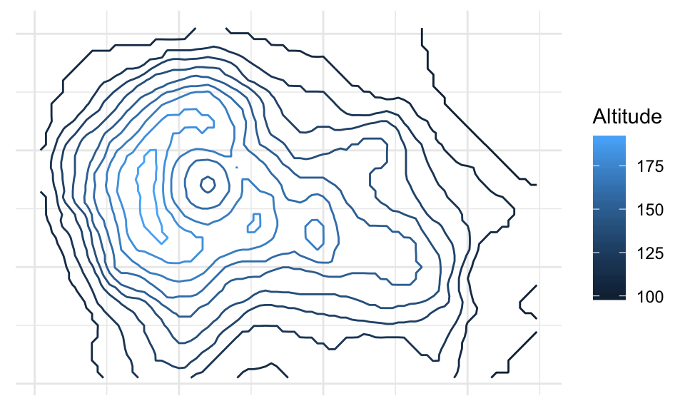

When it comes to bivariate density functions (pdf's), it's informative to plot the marginal densities on each axis. Here's an example where marginals are Gaussian, and the joint distribution is also Gaussian (we'll see what this means later today):

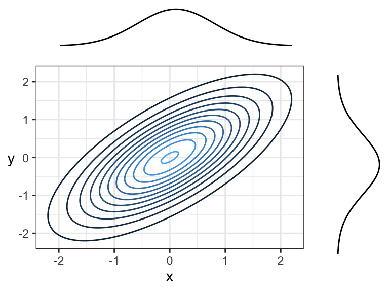

Remember, the density function tells us how "densely packed" data coming from this distribution will be. Here's the same plot, but with a sample of size 150 plotted overtop. The individual $x$ and $y$ coordinates are also plotted below their corresponding densities. Notice that points are more densely packed near the middle, where the density function is biggest.

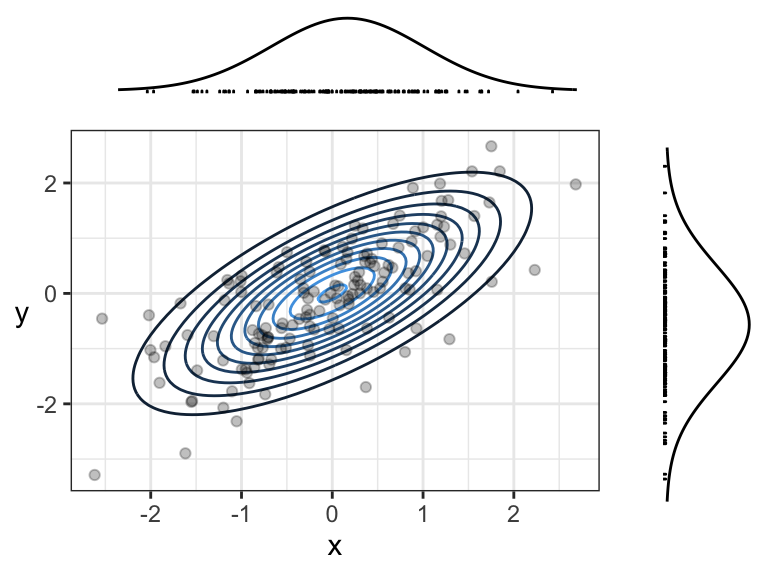

### A possible point of confusion: empirical contour plots

The contour + simulated data plot is meant to show you the relationship between the joint density function and the density of data points. In practice, we don't know the joint density function nor the marginals, so we use an empirical version instead. You'll learn about these in DSCI 531.

Here's an example of a contour plot of an empirical joint density function, and empirical marginal densities:

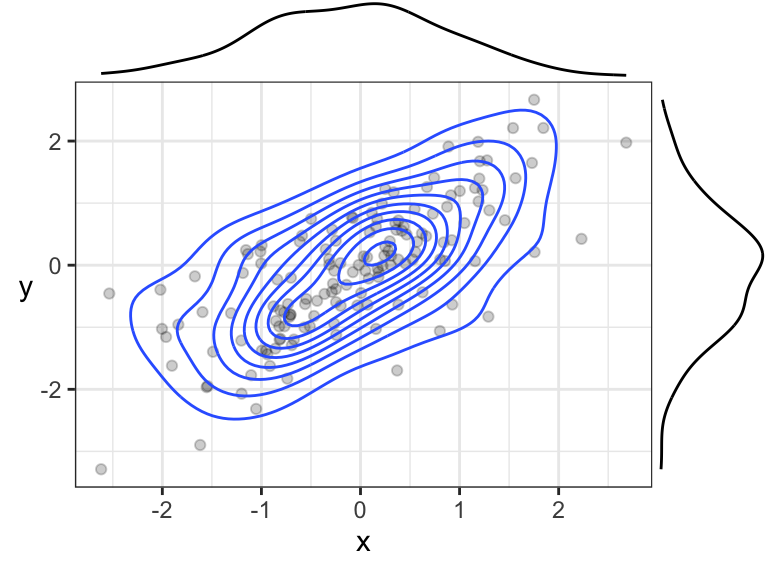

## Independence Revisited (10 min)

### Definition in the Continuous Case

Recall that independence of random variables $X$ and $Y$ means that knowledge about one variable tells us nothing about another variable. 

In the discrete case, this means that a joint probability distribution (when depicted as a table) has each row/column as a multiple of the others, because (by definition of independence)
$$P(X = x, Y = y) = P(X = x) P(Y = y).$$
In the continuous case, as usual, probabilities become densities. A definition of independence then becomes
$$f_{X,Y}(x, y) = f_Y(y) \ f_X(x).$$
This means that, when slicing the joint density at various points along the x-axis (also for the y-axis), the resulting one-dimensional function will be the same, except for some multiplication factor.

Perhaps a more intuitive definition of independence is when $f_{Y \mid X}(y \mid x) = f_Y(y)$ for all possible $x$ -- that is, knowing $X$ does not tell us anything about $Y$. The same could be said about the reverse. To see why this definition is equivalent to the above definition, consider a more general version of the above formula, which holds regardless of whether have have independence (we've seen this formula before):
$$f_{X,Y}(x, y) = f_{Y \mid X}(y \mid x) \ f_X(x).$$
Setting $f_{Y \mid X}$ equal to $f_Y$ results in the original definition above.

### Independence Visualized

In general, just by looking at a contour plot of a bivariate density, it's hard to tell whether this distribution is of two independent random variables. But, we _can_ tell by looking at "slices" of the distribution. 

Here is an example of two independent random variables, where $X \sim \text{Exp}(1)$ and $Y \sim N(0,1)$. We're going to slice the density along the dotted lines:

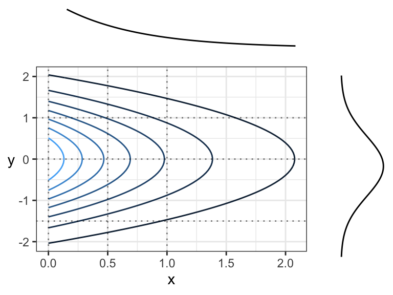

Here are the slices. In each case:

- The slice axis gets put on the x-axis, and
- The "z-axis" (the one coming "out of the page") gets put on the y-axis.

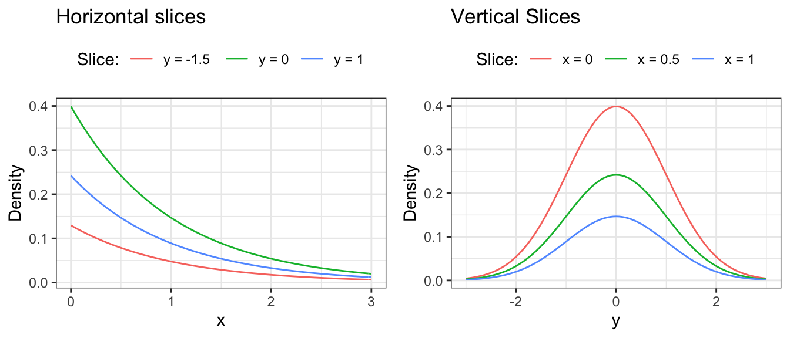

Again, looking above, it's not that each vertical (or horizontal) slice is _the same_, but they are all the same _when the slice is normalized_. In other words, every slice has the same _shape_. 

What do we get when we normalize these slices so that the curves have an area of 1 underneath? We get the conditional distributions _given the slice value_, by definition. And, these conditional distributions will be the exact same (one for each axis $X$ and $Y$), since the sliced densities only differ by a multiple anyway. What's more, this common distribution is just the marginal. Mathematically, what we're saying is 
$$f_{Y \mid X}(y \mid x) = \frac{f_{X,Y}(x,y)}{f_X(x)} = \frac{f_{X}(x) f_{Y}(y)}{f_X(x)} = f_Y(y)$$
(and the same for $X \mid Y$). Again, we're back to the definition of independence!

Here's another example of an independent joint distribution:

### Activity

The following are different scenarios of a bivariate density being sliced along different values of $X$, and plotting the resulting surface overtop of the slice. Which of the following are examples of independence between $X$ and $Y$?

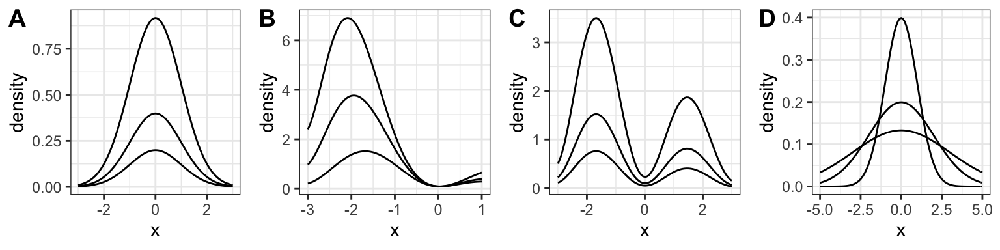

## Harvesting Dependence (20 min)

The opposite of independence is _dependence_: when knowing something about $X$ tells us something about $Y$ (or vice versa). Extracting this "signal" that $X$ contains about $Y$ is at the heart of supervised learning (regression and classification), covered in DSCI 571/561 and beyond.

Usually, we reserve the letter $X$ to be the variable that we know something about (usually an exact value), and $Y$ to be the variable that we want to learn about. These variables [go by many names](https://ubc-mds.github.io/resources_pages/terminology/#equivalence-classes) -- usually, $Y$ is called the __response variable__, and $X$ is sometimes called a __feature__, or __explanatory variable__, or __predictor__, etc.

To extract the information that $X$ holds about $Y$, we simply use the _conditional distribution of $Y$ given what we know about $X$_. This is as opposed to just using the marginal distribution of $Y$, which corresponds to the case where we don't know anything about $X$.

Sometimes it's enough to just communicate the resulting conditional distribution of $Y$, but usually we reduce this down to some of the distributional properties that we saw earlier, like mean, median, or quantiles. We communicate uncertainty also using methods we saw earlier, like prediction intervals and standard deviation. 

Let's look at an example.

### Example: River Flow

In the Rocky Mountains, snowmelt $X$ is a major driver of river flow $Y$. Suppose the joint density can be depicted as follows:

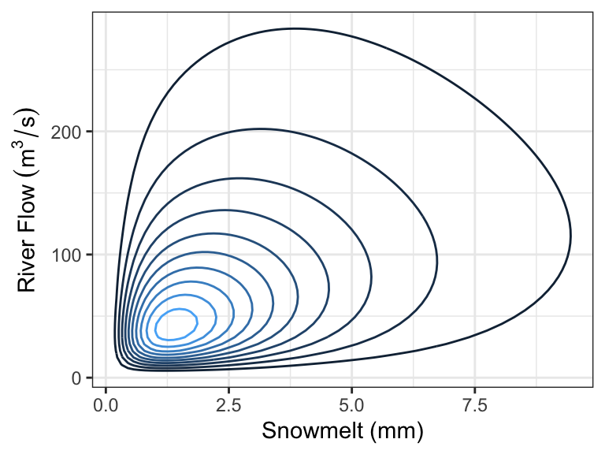

Every day, a measurement of snowmelt is obtained. To predict the river flow, usually the conditional mean of river flow given snowmelt is used as a prediction, but median is also used. Here are the two quantities as a function of snow melt:

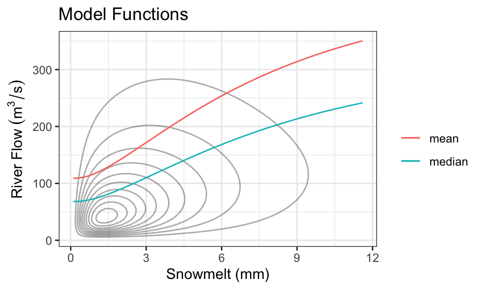

These functions are called __model functions__, and there are a ton of methods out there to help us directly estimate these model functions _without knowing the density_. This is the topic of supervised learning -- even advanced supervised learning methods like deep learning are just finding a model function like this (although, usually when there are more than one $X$ variable).

It's also quite common to produce prediction intervals. Here is an example of an 80% prediction interval, using the 0.1- and 0.9-quantiles as the lower and upper limits:

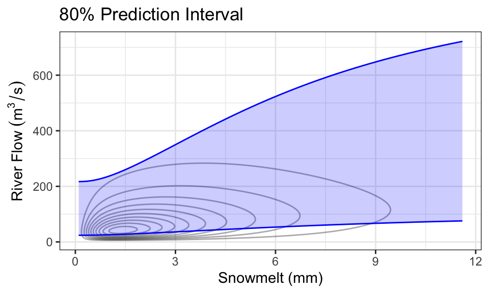

As a concrete example, consider the case where we know there's been 1mm of snowmelt. To obtain the conditional distribution of flow ($Y$) given this information, we just "slice" the joint density at $x =$ 1, and renormalize. Here is that density (which is now univariate!), compared with the marginal distribution of $Y$ (representing the case where we know nothing about snowmelt, $X$):

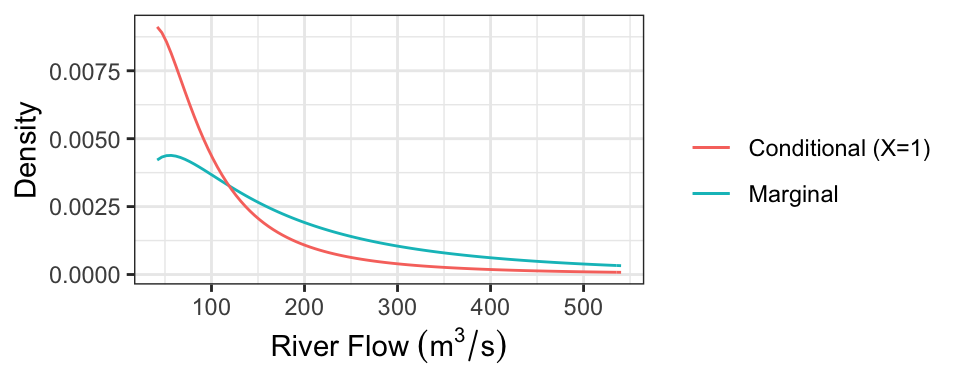

The following table presents some properties of these distributions:

Quantity   Marginal          Conditional     
---------  ----------------  ----------------
Mean       247.31            118.16          
Median     150               74.03           
80% PI     [41.64, 540.33]   [25.67, 236.33] 

Notice that we actually only need the conditional distribution of $Y$ given $X=x$ for each value of $x$ to produce these plots! In practice, we usually just specify these conditional distributions. So, having the joint density is actually "overkill".

### Direction of Dependence

Two variables can be dependent in a multitude of ways, but usually there's an overall direction of dependence:

- __Positively related__ random variables tend to increase together. That is, larger values of $X$ are associated with larger values of $Y$.
- __Negatively related__ random variables have an inverse relationship. That is, larger values of $X$ are associated with smaller values of $Y$.

We've already seen some measures of dependence in the discrete setting: covariance, correlation, and Kendall's tau. These definitions carry over. It's a little easier to visualize the definition of covariance as the signed sum of rectangular area:

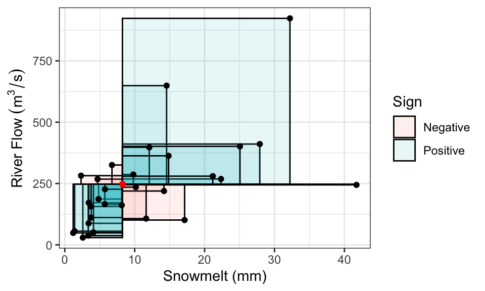

Correlation, remember, is also the signed sum of rectangles, but after converting $X$ and $Y$ to have variances of 1. 

Here are two positively correlated variables, because there is overall tendency of the contour lines to point up and to the right (or down and to the left):

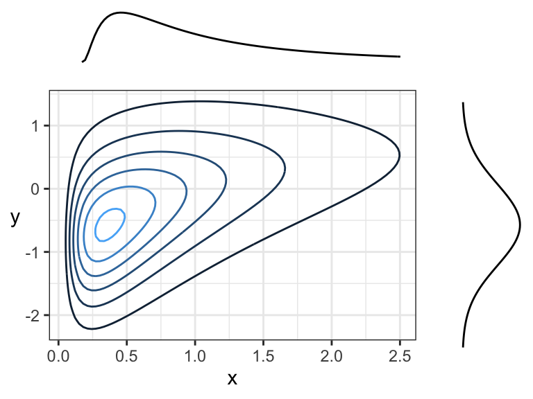

Here are two negatively correlated variables, because there is overall tendency for the contour lines to point down and to the right (or up and to the left):

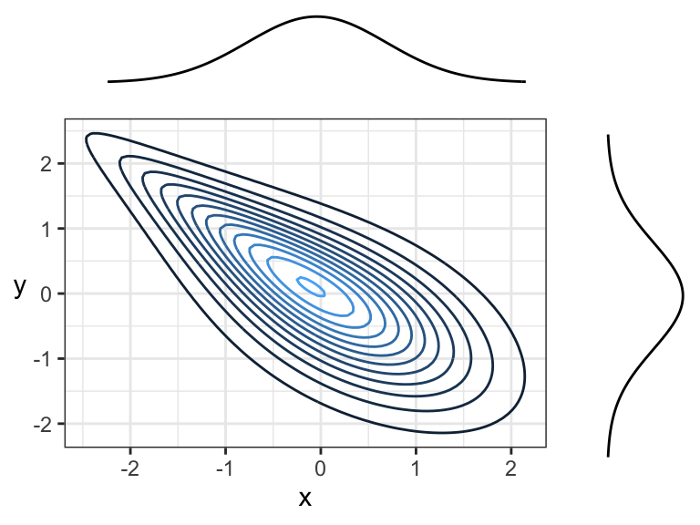

Another example of negative correlation. Although contour lines aren't pointing in any one direction, there's more density along a line that points down and to the right (or up and to the left) than there is any other direction.

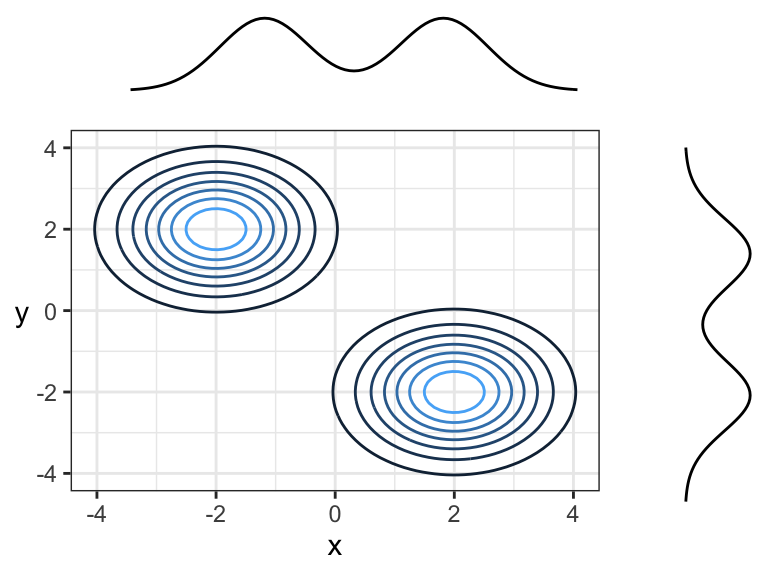

Here are two random variables that are dependent, yet have 0 correlation (both Pearson's and Kendall's) because the overall trend is flat (pointing left or right). You can think of this in terms of slicing: slicing at $x = -2$ would result in a highly peaked distribution near $y = 0$, whereas slicing at $x = 1$ would result in a distribution with a much wider spread -- these are not densities that are multiples of each other! Prediction intervals would get wider with larger $x$.

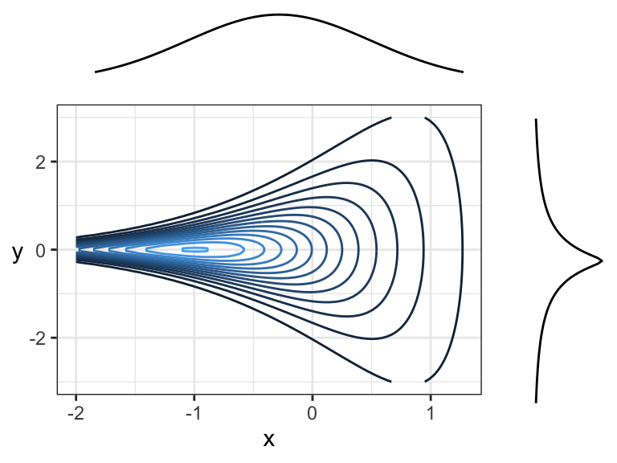

Note that the marginal distributions have _nothing to do with the dependence_ between random variables. Here are some examples of joint distributions that all have the same marginals ($N(0,1)$), but different dependence structures and strengths of dependence:

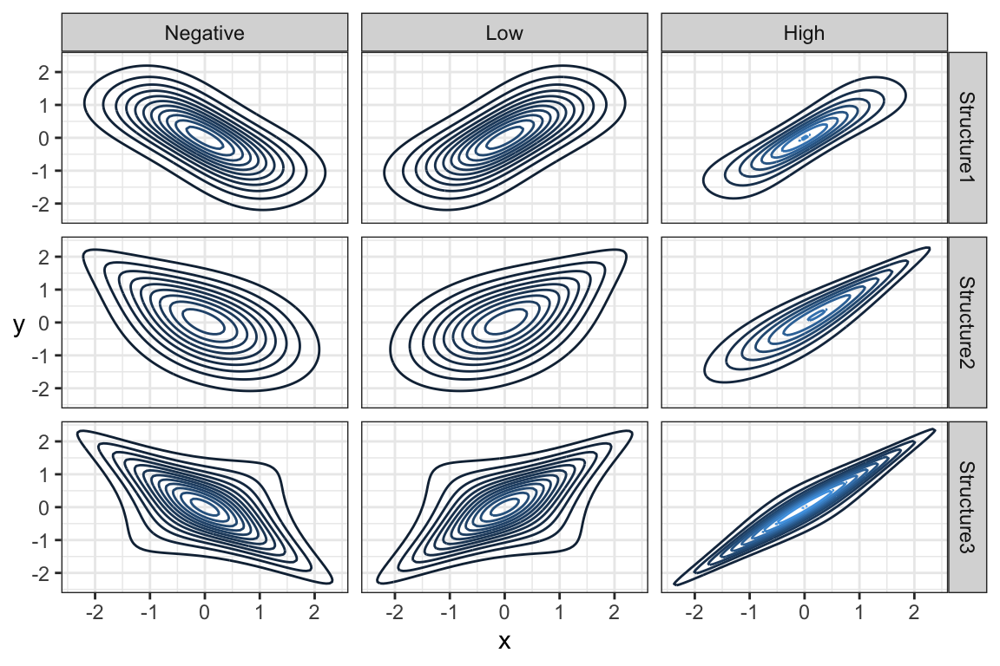

## Marginal Distributions (20 min)

In the river flow example, we used snowmelt to inform river flow by communicating the conditional distribution of river flow given snowmelt. But, this requires knowledge of snowmelt! What if one day we are missing an observation on snowmelt? Then, the best we can do is communicate the marginal distribution of river flow. But how can we get at that distribution? Usually, aside from the data, we only have information about the conditional distributions. But this is enough to calculate the marginal distribution!

### Marginal Distribution from Conditional 

We can use the law of total probability to calculate a marginal density. Recall that for discrete random variables $X$ and $Y$, we have
$$P(Y = y) = \sum_x P(X = x, Y = y) = \sum_x P(Y = y \mid X = x) P(X = x).$$
The same thing applies in the continuous case, except probabilities become densities and sums become integrals (as usual in the continuous world): for continuous $X$ and $Y$,
$$f_Y(y) = \int_x f_{X,Y}(x,y)\ \text{d}x = \int_x f_{Y\mid X}(y \mid x)\ f_X(x)\ \text{d}x.$$

Notice that this is just an average of the conditional densities! If we have the conditional densities and a sample of $X$ values $x_1, \ldots, x_n$, then using the empirical approximation of the mean, we have
$$f_Y(y) \approx \frac{1}{n} \sum_{i = 1}^n f_{Y\mid X}(y \mid x_i).$$

A similar result holds for the cdf. We have
$$F_Y(y) = \int_x F_{Y \mid X}(y \mid x)\ f_X(x) \ \text{d}x,$$
and empirically,
$$F_Y(y) \approx \frac{1}{n}\sum_{i = 1}^n F_{Y\mid X}(y \mid x_i).$$

### Marginal Mean from Conditional

Perhaps more practical is finding the marginal mean, which we can obtain using the law of total expectation (similar to the discrete case we saw in a previous lecture):
$$E(Y) = \int_x m(x) \ f_{X}(x) \ \text{d}x = E(m(X)),$$
where $m(x) = E(Y \mid X = x)$ (i.e., the model function or regression curve).

When you fit a model using supervised learning, you usually end up with an estimate of $m(x)$. From the above, we can calculate the marginal mean as the mean of $m(X)$, which we can do empirically using a sample of $X$ values $x_1, \ldots, x_n$. Using the empirical mean, we have
$$E(Y) \approx \frac{1}{n} \sum_{i=1}^n m(x_i).$$

### Marginal Quantiles from Conditional

Unfortunately, if you have the $p$-quantile of $Y$ given $X = x$, then there's no convenient way of calculating the $p$-quantile of $Y$ as an average. To obtain this marginal quantity, you would need to calculate $F_Y(y)$ (as above), and then find the value of $y$ such that $F_Y(y) = p$. 

### Activity

You've observed the following data of snowmelt and river flow:

 Snowmelt (mm)   Flow (m^3/s)
--------------  -------------
             1            140
             3            150
             3            155
             2            159
             3            170

From this, you've deciphered that the mean flow given snowmelt is
$$E(\text{Flow} \mid \text{Snowmelt} = x) = 100 + 20x.$$

You also decipher that the conditional standard deviation is constant, and is:
$$SD(\text{Flow} \mid \text{Snowmelt} = x) = 15\ m^3/s$$
It also looks like the conditional distribution of river flow given snowmelt follows a Lognormal distribution. 

Part 1: A new reading of snowmelt came in, and it's 4mm. 

1. Make a prediction of river flow.
2. What distribution describes your current understanding of what the river flow will be?

Part 2: Your snowmelt-recording device is broken, so you don't know how much snowmelt there's been.

3. Make a prediction of river flow. 
4. What distribution describes your current understanding of what the river flow will be?
5. Someone tells you that a 90% prediction interval is [70, 170]. What do we know about the median?

## Multivariate Gaussian/Normal Family (20 min)

**Moved to Lecture 8**
