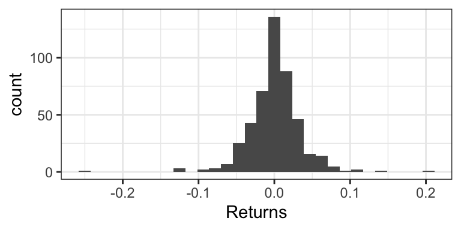
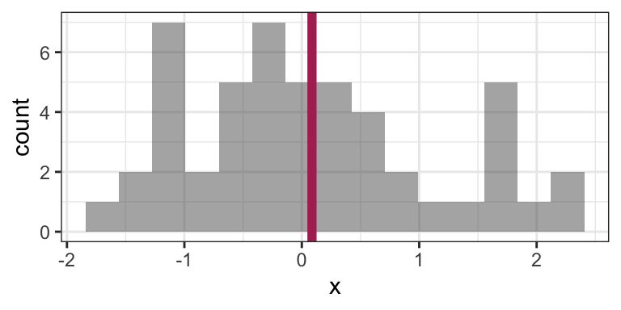
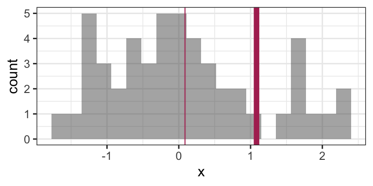
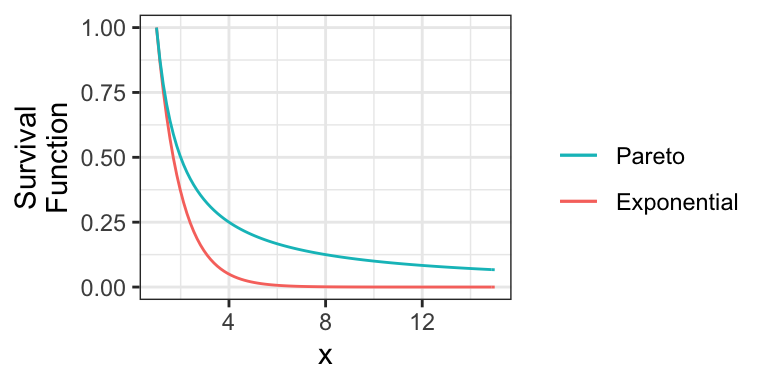
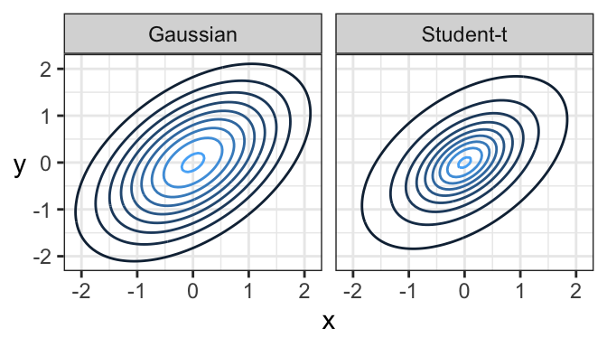
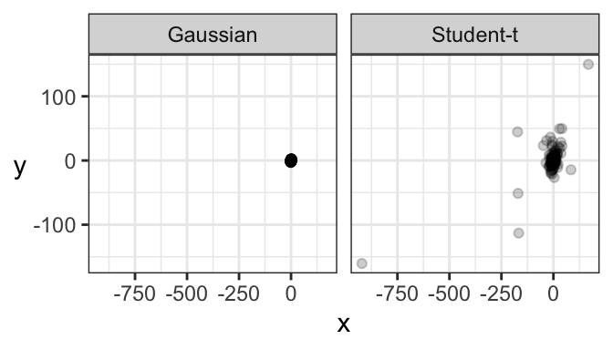

# Heavy-Tailed Distributions


Consider the weekly returns of the Singapore Straights (STI) market, depicted by the following histogram. You'll notice some extreme values that are far from the "bulk" of the data. 



Traditional practice was to view these extremes as "outliers" that are a nuisance for analysis, and therefore should be removed. But this can actually be detrimental to the analysis, because these outliers are real occurences that should be anticipated. 

Instead, __Extreme Value Analysis__ is a practice that tries to get a sense of how big and how frequently extremes will happen.

## Sensitivity of the mean to extremes

Indeed, the empirical (arithmetic) mean is sensitive to outliers: consider the sample average of 100 observations coming from a N(0,1) distribution:


```r
set.seed(6)
n <- 50
x <- rnorm(n)
mean(x)
```

```
## [1] 0.08668773
```

Here's that mean depicted on a histogram of the data:



Now consider calculating the mean by replacing the last observation with 50 (a very large number):


```r
x[n] <- 50
mean(x)
```

```
## [1] 1.082927
```

This is a big difference made by a single observation! Let's take a look at the histogram now (outlier not shown). The "old" mean is the thin vertical line:



There are [robust and/or resistant ways of estimating the mean](https://en.wikipedia.org/wiki/Robust_statistics#Estimation_of_location) that are less sensitive to the outliers. But what's more interesting when you have extreme values in your data is to get a sense of how frequently extremes will happen, and the mean won't give you that sense. 

## Heavy-tailed Distributions

Distributions known as __heavy-tailed distributions__ give rise to extreme values. These are distributions whose tail(s) decay like a power decay. The slower the decay, the heavier the tail is, and the more prone extreme values are.

For example, consider the member of the Pareto Type I family of distributions with survival function $S(x) = 1/x$ for $x \geq 1$. Here is this distribution compared to an Exponential(1) distribution (shifted to start at $x=1$):



Notice that the Exponential survival function becomes essentially zero very quickly, whereas there's still lots of probability well into the tail of the Pareto distribution.  

Also note that if a distribution's tail is "too heavy", then its mean will not exist! For example, the above Pareto distribution has no mean.

## Heavy-tailed distribution families

Here are some main families that include heavy-tailed distributions:

- Family of [Generalized Pareto distributions](https://en.wikipedia.org/wiki/Generalized_Pareto_distribution)
- Family of [Generalized Extreme Value distributions](https://en.wikipedia.org/wiki/Generalized_extreme_value_distribution)
- Family of [Student's _t_ distributions](https://en.wikipedia.org/wiki/Student%27s_t-distribution)
	- The Cauchy distribution is a special case of this.

## Extreme Value Analysis

There are two key approaches in Extreme Value Analysis:

- _Model the tail_ of a distribution using a theoretical model. That is, choose some `x` value, and model the distribution _beyond_ that point. It turns out a [Generalized Pareto distribution](https://en.wikipedia.org/wiki/Generalized_Pareto_distribution) is theoretically justified.
- The _peaks over thresholds_ method models the extreme observations occurring in a defined window of time. For example, the largest river flows each year. It turns out a [Generalized Extreme Value distribution](https://en.wikipedia.org/wiki/Generalized_extreme_value_distribution) is theoretically justified here. 

## Multivariate Student's _t_ distributions

Just like there's a multivariate Gaussian distribution, there's also a multivariate Student's _t_ distribution. And in fact, its contours are elliptical, too!

Here's a comparison of a bivariate Gaussian and a bivariate Student's _t_ distribution, both of which are elliptical. One major difference is that a sample from a bivariate Gaussian distribution tends to be tightly packed, whereas data from a bivariate Student's _t_ distribution is prone to data deviating far from the main "data cloud". 



And here are samples coming from these two distributions. Notice how tightly bundled the Gaussian distribution is compared to the _t_ distribution!


