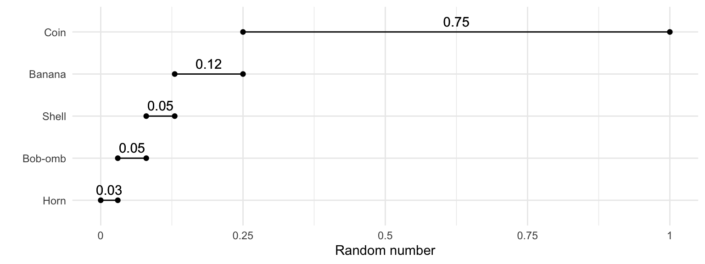
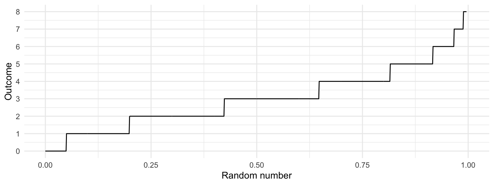

# Generating Continuous Data

Until now, we've sidestepped the actual procedure for how a random outcome is actually generated. For the discrete case, we could get by with the "drawing from a hat" analogy. But this won't get us far in the continuous case, because each outcome has 0 probability of occuring.

The idea is to convert a random number between 0 and 1 into an outcome. Going back to the discrete case, using the Mario Kart example, we can break the interval [0, 1] into sub-intervals with widths equal to their probabilities. Visually, this might look like the following:

We can make a similar plot for a Poisson(3) random variable (the y-axis is truncated because we can't plot all infinite outcomes):

Indeed, this plot is nothing other than the quantile function! This idea extends to all random variables. If we want to generate an observation of a random variable $Y$ with quantile function $Q_Y$, just follow these two steps:

1. Generate a number $U$ completely at random between 0 and 1. 
2. Calculate the observation as $Y = Q_Y(U)$.

For continuous random variables only, the opposite of this result also has important implications: if $Y$ is a continuous random variable with cdf $F_Y$, then $$F_Y(Y) \sim \text{Unif}(0,1).$$ This is important for p-values in hypothesis testing (DSCI 552+), transformations, and copulas (optional question on your lab assignment).
