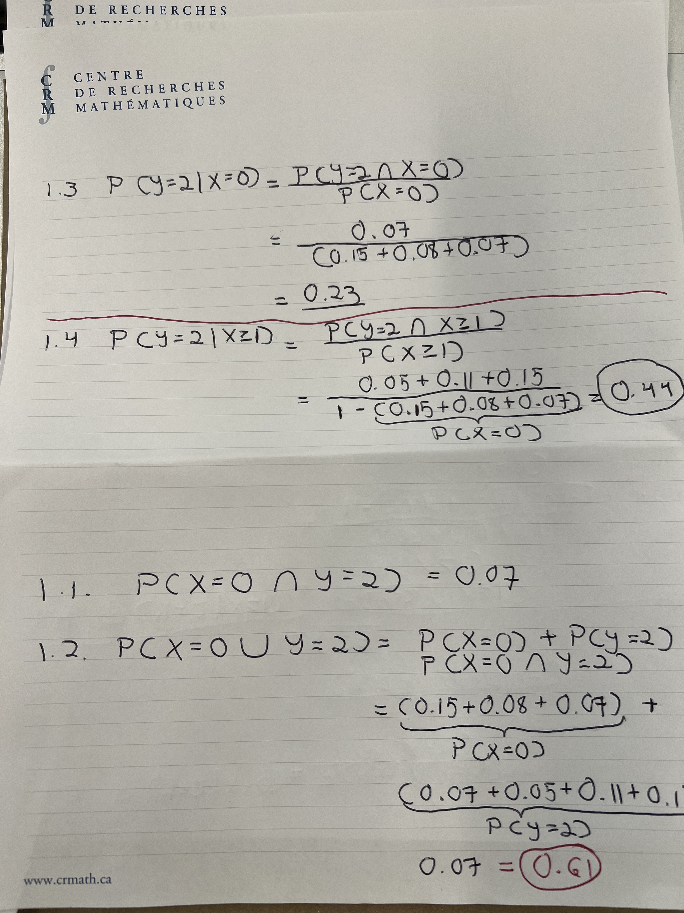

```{r setup, include=FALSE}
knitr::opts_chunk$set(echo = TRUE)
```

\newpage

# Lab Mechanics

`rubric={mechanics:5}`

Check off that you have read and followed each of these instructions:

-   [ ] All files necessary to run your work must be pushed to your `GitHub.ubc.ca` repository for this lab.
-   [ ] Paste the URL to your GitHub repo here: **INSERT YOUR GITHUB REPO URL HERE**
-   [ ] You need to have **a minimum of 3 commit messages** associated with your `GitHub.ubc.ca` repository for this lab.
-   [ ] **You must also submit `.Rmd` file and the rendered `pdf` in this lab to Gradescope.** You are responsible for ensuring all the figures, texts, and equations in the `.pdf` file are appropriately rendered.
-   [ ] To ensure you do not break the autograder remove all code for installing packages (i.e., DO NOT have `install.packages(...)` or `devtools::install_github(...)` in your homework!
-   [ ] Follow the [**MDS general lab instructions**](https://ubc-mds.github.io/resources_pages/general_lab_instructions/).

> **Important:** For the assignments, you are permitted to use LLMs only to gather information, review concepts, or brainstorm. You **must cite** these tools if you use them for the assignment. It is not permitted to write any given assignment by copying and pasting AI-generated responses.

# A Note on Challenging Questions

Each lab will have a few challenging questions. **These are usually low-risk questions and will contribute to a 5% out of the total lab grade of 100%**. The main purpose here is to challenge yourself or dig deeper in a particular area. When you start working on labs, attempt all other questions before moving to these questions. If you are running out of time, please skip these questions.

We will be more strict with the marking of these questions. If you want to get full points in these questions, your answers need to

-   be thorough, thoughtful, and well-written (if necessary),
-   provide convincing justification and appropriate evidence for the claims you make, and
-   impress the reader of your lab with your understanding of the material, your analytical and critical reasoning skills, and your ability to think on your own.

# Lab Grade Computation

Once lab grades are published on Gradescope, you will see your **raw lab mark** $m$. This **raw lab mark** $m$ is the grand total of your granted marks throughout the whole lab assignment. Now, if we add up **all the marks (non-challenging and challenging)** in the handout corresponding to all `rubric={...}`, this sum is what we call the maximum raw lab mark $m_{100}$ to get 100% as a percentage lab grade. On the other hand, if we add up **the non-challenging marks** in the handout found in `rubric={...}`, this sum is what we call the raw lab mark $m_{95}$ to get a 95% as a percentage lab grade.

By the end of the block, **once all lab marking is finished on Gradescope**, your raw lab grades will be transferred to **Canvas**. Then, in your [**Canvas gradebook**](https://canvas.ubc.ca/courses/171373/grades), you will see these raw lab grades (`raw lab1`, `raw lab2`, `raw lab3`, and `raw lab4`). Finally, for each of the four labs, you will also see your final lab grades (`lab1`, `lab1`, `lab3`, and `lab4`). Let $g$ be the final lab grade of a specific lab **as a percentage**; it will be computed as follows:

-   If $m > m_{95}$, then $g = 95 + \left( \frac{m - m_{95}}{m_{100} - m_{95}} \times 5 \right)$.
-   If $m \leq m_{95}$, then $g = \left( \frac{m}{m_{95}} \right) \times 95$.

# A Note on Warmup Exercises

Each lab session will begin with a warmup exercise, which will be indicated when introduced in the handout. We will solve this exercise altogether during the first 10 minutes of the lab session.

> **Note this warmup part will not count toward the lab grade of 100%.**

\newpage

# (Warmup) Exercise 1: Marketing

Suppose that a marketing team for a car rental company is interested in investigating the relationship between the number of billboards ($X$) they advertise on around their city and the number of hourly car rentals ($Y$). The following table describes the joint probability distribution between $X$ and $Y$.

|         | $Y = 0$ | $Y = 1$ | $Y = 2$ |
|:-------:|:-------:|:-------:|:-------:|
| $X = 0$ | $0.15$  | $0.08$  | $0.07$  |
| $X = 1$ | $0.10$  | $0.10$  | $0.05$  |
| $X = 2$ | $0.04$  | $0.10$  | $0.11$  |
| $X = 3$ | $0.02$  | $0.03$  | $0.15$  |

Answer the following questions.

**1.1.** What is the probability of having no billboards and two car rentals?

**1.2.** What is the probability of having no billboards or two car rentals?

**1.3.** If the company did not advertise on any billboards, what is the probability of having two car rentals?

**1.4.** Given that the company advertised on at least one billboard, what is the probability of renting two cars?

**ANSWER:**

*Type your answer here, replacing this text.*



\newpage

# Exercise 2: Houses and Apartments

`rubric={autograde:7,reasoning:16}`

The following table gives the joint probability distribution of the number of houses ($X$) and the number of apartments ($Y$) sold per day by a real estate firm in Vancouver.

|         | $Y = 0$ | $Y = 1$ | $Y = 2$ | $Y = 3$ | $Y = 4$ |
|:-------:|:-------:|:-------:|:-------:|:-------:|:-------:|
| $X = 0$ | $0.10$  | $0.14$  | $0.08$  | $0.06$  | $0.02$  |
| $X = 1$ | $0.12$  | $0.10$  | $0.07$  | $0.03$  | $0.03$  |
| $X = 2$ | $0.08$  | $0.09$  | $0.05$  | $0.02$  | $0.01$  |

Find the following quantities:

**2.1.** $P(X = 0)$, the marginal probability of selling no houses in a day.

**2.2.** $P(X = 0 \cap Y = 0)$, the probability of selling no houses **and** no apartments in a day.

**2.3.** $P(X = 0 \cup Y = 0)$, the probability of selling no houses **or** no apartments in a day.

**2.4.** $P(X = 0 \mid Y = 0)$, the probability of selling no houses **given** that no apartments were sold.

**2.5.** $P(X = Y)$, the probability that the number of houses sold is the same as the number of apartments sold.

**2.6.** $P(X \geq Y)$, the probability that the number of houses sold is at least the number of apartments sold.

**2.7.** $P(X + Y \geq 5)$, the probability of at least 5 total sales in a day.

To get full marks on these questions, follow these instructions:

1.  Provide all your procedure and/or reasoning (e.g., equations):
    a.  You do not need to use [**LaTex**](https://www.latex-project.org) to provide mathematical notation.
    b.  Instead, you might work on your written answer on a separate piece of paper and take a picture of it.
    c.  Then, you have to put this image in the folder `img` which is part of your lab GitHub repo.
    d.  Finally, within this `R` markdown, use the following syntax: ``, where `my_answer_2.jpg` is your image's name. The output is the following:


\newpage

2.  Assign your **numeric answers** to `answer2_1`, `answer2_2`, ..., `answer2_6`, and `answer2_7`. **Code your computations directly in each answer if necessary.** Moreover, run the test below to validate your answers.

**ANSWER:**

*Type your answer here, replacing this text.*

```{r}
answer2_1 <- NULL
answer2_2 <- NULL
answer2_3 <- NULL
answer2_4 <- NULL
answer2_5 <- NULL
answer2_6 <- NULL
answer2_7 <- NULL
```

```{r}
. = ottr::check("tests/Q2.R")
```

**2.8.** Are $X$ and $Y$ independent? Briefly explain your answer **in one or two sentences**.

**ANSWER:**

*Type your answer here, replacing this text.*

**2.9.** Find the marginal distribution of $Y$ by filling in the table below.

| $y$ | $P(Y = y)$ |
|:---:|:----------:|
|     |            |
|     |            |
|     |            |
|     |            |
|     |            |

**ANSWER:**

*Type your answer here, replacing this text.*

\newpage

# Exercise 3: Independence and Correlation

`rubric={reasoning:8}`

Saying "$X$ and $Y$ are independent" and "$X$ and $Y$ are uncorrelated" is not the same. By "uncorrelated," we mean having a linear correlation of zero or, equivalently, having zero covariance:

$$\text{Cov}(X, Y) = 0.$$

We will consider four possible scenarios of those two statements to show that they are not the same.

**3.1.** $X$ and $Y$ are independent and have zero covariance/Pearson correlation.

**3.2.** $X$ and $Y$ are independent and have nonzero covariance/Pearson correlation.

**3.3.** $X$ and $Y$ are not independent and have zero covariance/Pearson correlation.

**3.4.** $X$ and $Y$ are not independent and have nonzero covariance/Pearson correlation.

Classify each of the above scenarios as either **possible** or **impossible**. If you classify a scenario as **possible**, give an example. If you classify a scenario as **impossible**, briefly explain why not.

**ANSWER:**

*Type your answer here, replacing this text.*

\newpage

# Exercise 4: Univariate Conditioning

`rubric={autograde:6,reasoning:12}`

The S.M.D.S. Barrington is a transport ship that frequently does transport to the port of Vancouver. Let $X$ be the random variable giving the duration of its stay (in days) at the port of Vancouver. Based on your records for the Barrington, suppose $X$ is distributed according to the probability mass function (PMF):

$$P(X = i) = \frac{i}{10} \quad \text{for } \quad i = 1, 2, 3, 4;$$

where $i$ is the number of days.

To get full marks on the questions below, follow these instructions:

1.  Provide all your procedure and/or reasoning (e.g., equations):
    a.  You do not need to use [**LaTex**](https://www.latex-project.org) to provide mathematical notation.
    b.  Instead, you might work on your written answer on a separate piece of paper and take a picture of it.
    c.  Then, you have to put this image in the folder `img` which is part of your lab GitHub repo.
    d.  Finally, within this `R` markdown, use the following syntax: ``, where `my_answer_4.jpg` is your image's name. The output is the following:


2.  Assign your **numeric answer** with its respective label (e.g., `answer4_1`). **Code your computation directly.** Moreover, run the test below to validate your answers.

Find the following quantities:

**4.1.** If the captain (a very reliable human indeed) tells you they will need at least three days in port, what is the probability that the ship will be in port for exactly 3 days?

**4.2.** Based on your records, how long would you **marginally expect** the Barrington to be in port?

**4.3.** The ship is on its way, and the captain has sent you the port request. They confirm they will need at least 2 days in port. **Having said that**, what is the probability that the ship will spend at least 3 days in port?

**4.4.** The ship has arrived and **it is already been in port for 3 days**. Based on your records, what do you **expect** will be the total number of days the ship is in port?

**4.5.** Compute the variance $\text{Var}(X)$.

**4.6.** Compute the entropy $H(X)$.

Assign your **numeric answers** to `answer4_1`, `answer4_2`, ..., `answer4_5`, and `answer4_6`. **Code your computations directly in each answer if necessary.**

**ANSWER:**

*Type your answer here, replacing this text.*

```{r}
answer4_1 <- NULL
answer4_2 <- NULL
answer4_3 <- NULL
answer4_4 <- NULL
answer4_5 <- NULL
answer4_6 <- NULL
```

```{r}
. = ottr::check("tests/Q4-autograder.R")
```

\newpage

# Exercise 5: Multivariate Conditioning

## 5.1.

`rubric={autograde:5,reasoning:10}`

Let $Z = X_1 + X_2$, where $X_1$ and $X_2$ are independent and identically distributed (*iid*) random variables with the same distribution **each** as $X$ from **Exercise 4** above, namely,

$$P(X = 1) = 0.1$$ $$P(X = 2) = 0.2$$ $$P(X = 3) = 0.3$$ $$P(X = 4) = 0.4.$$

In plain words, $Z$ represents the total time in port of two ships **whose length of stay are independent**.

To get full marks on the questions below, follow these instructions:

1.  Provide all your procedure and/or reasoning (e.g., equations):
    a.  You do not need to use [**LaTex**](https://www.latex-project.org) to provide mathematical notation.
    b.  Instead, you might work on your written answer on a separate piece of paper and take a picture of it.
    c.  Then, you have to put this image in the folder `img` which is part of your lab GitHub repo.
    d.  Finally, within this `R` markdown, use the following syntax: ``, where `my_answer_5_1.jpg` is your image's name. The output is the following:


2.  Assign your **numeric answers** to `answer5_1_1`, `answer5_1_2`, `answer5_1_3`, `answer5_1_4`, and `answer5_1_5`. **Code your computations directly in each answer if necessary.** Moreover, run the test below to validate your answers.

Find the following quantities:

**5.1.1.** The expected value $\mathbb{E}(Z)$.

**5.1.2.** The variance $\text{Var}(Z)$.

**5.1.3.** $P(X_1 = 2 \mid Z \geq 6)$.

**5.1.4.** $P(X_1 = 2 \mid X_2 = 2)$.

**5.1.5.** $\text{Cov}(X_1, X_2)$.

**ANSWER:**

*Type your answer here, replacing this text.*

```{r}
answer5_1_1 <- NULL
answer5_1_2 <- NULL
answer5_1_3 <- NULL
answer5_1_4 <- NULL
answer5_1_5 <- NULL
```

```{r}
. = ottr::check("tests/Q5-1-autograder.R")
```

**(Challenging and non-autograded) 5.1.7.**

`rubric={reasoning:3}`

Compute $\text{Cov}(Z, X_1)$. **To get full marks, show all your work.**

> **Heads-up:** You do not need to use LaTeX to show your work. You can only embed pictures of your written solutions into the `.pdf` as done in previous exercises.

**ANSWER:**

*Type your answer here, replacing this text.*

## 5.2.

`rubric={reasoning:8}`

Answer the following:

**(Non-autograded) 5.2.1.** What is the conditional distribution of $Z$ given that $X_1 = 3$? I.e.,

$$P(Z = z \mid X_1 = 3).$$

**(Non-autograded) 5.2.2.** How does the entropy of $P(Z = z \mid X_1 = 3)$ compare to the entropy of $P(X_1)$? Is it larger, smaller, or the same?

**(Challenging and non-autograded) 5.2.3.**

`rubric={reasoning:4}`

What is the conditional distribution of $Z$ given that $X_1\geq 3$? In other words, find

$$P(Z = z \mid X_1 \geq 3)$$

for all possible $z$.

**To get full marks in all the three above questions**, provide all your procedure and/or reasoning (e.g., equations):

a.  You do not need to use [**LaTex**](https://www.latex-project.org) to provide mathematical notation.
b.  Instead, you might work on your written answer on a separate piece of paper and take a picture of it.
c.  Then, you have to put this image in the folder `img` which is part of your lab GitHub repo.
d.  Finally, within this `R` markdown, use the following syntax: ``, where `my_answer_5_2.jpg` is your image's name. The output is the following:


**ANSWER:**

*Type your answer here, replacing this text.*

\newpage

# (Challenging) Exercise 6: Binomial Variance

`rubric={reasoning:3}`

Show that the variance of the Binomial distribution with $n$ trials and success probability $p$ is $n p (1 - p)$, using the following steps:

1.  Rewrite the Binomial random variable $Z$ as the sum of independent, identically distributed (*iid*) Bernoulli random variables $X_i$ ($i = 1, \dots, n$).
2.  Use the fact that the variance of the sum of *iid* variables is the sum of the individual variances.
3.  Derive the variance of this sum of iid Bernoulli variables.

**To get full marks**, provide all your procedure and/or reasoning (e.g., equations):

a.  You do not need to use [**LaTex**](https://www.latex-project.org) to provide mathematical notation.
b.  Instead, you might work on your written answer on a separate piece of paper and take a picture of it.
c.  Then, you have to put this image in the folder `img` which is part of your lab GitHub repo.
d.  Finally, within this `R` markdown, use the following syntax: ``, where `my_answer_6.jpg` is your image's name. The output is the following:


**ANSWER:**

*Type your answer here, replacing this text.*
