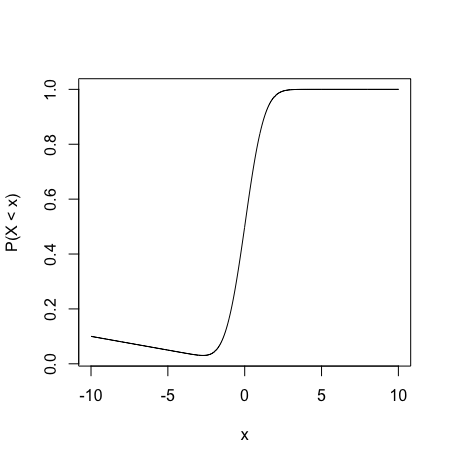
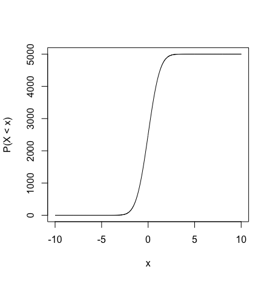
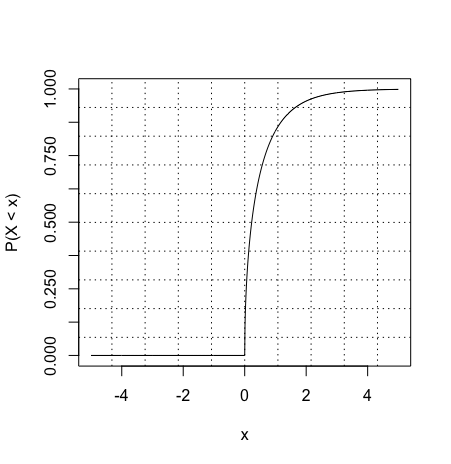

```{r setup, include=FALSE}
knitr::opts_chunk$set(echo = TRUE)
```

\newpage

# Lab Mechanics

`rubric={mechanics:5}`

Check off that you have read and followed each of these instructions:

-   [ ] All files necessary to run your work must be pushed to your `GitHub.ubc.ca` repository for this lab.
-   [ ] Paste the URL to your GitHub repo here: **INSERT YOUR GITHUB REPO URL HERE**
-   [ ] You need to have **a minimum of 3 commit messages** associated with your `GitHub.ubc.ca` repository for this lab.
-   [ ] **You must also submit `.Rmd` file and the rendered `pdf` in this lab to Gradescope.** You are responsible for ensuring all the figures, texts, and equations in the `.pdf` file are appropriately rendered.
-   [ ] To ensure you do not break the autograder remove all code for installing packages (i.e., DO NOT have `install.packages(...)` or `devtools::install_github(...)` in your homework!
-   [ ] Follow the [**MDS general lab instructions**](https://ubc-mds.github.io/resources_pages/general_lab_instructions/).

> **Important:** For the assignments, you are permitted to use LLMs only to gather information, review concepts, or brainstorm. You **must cite** these tools if you use them for the assignment. It is not permitted to write any given assignment by copying and pasting AI-generated responses.

# A Note on Challenging Questions

Each lab will have a few challenging questions. **These are usually low-risk questions and will contribute to a 5% out of the total lab grade of 100%**. The main purpose here is to challenge yourself or dig deeper in a particular area. When you start working on labs, attempt all other questions before moving to these questions. If you are running out of time, please skip these questions.

We will be more strict with the marking of these questions. If you want to get full points in these questions, your answers need to

-   be thorough, thoughtful, and well-written (if necessary),
-   provide convincing justification and appropriate evidence for the claims you make, and
-   impress the reader of your lab with your understanding of the material, your analytical and critical reasoning skills, and your ability to think on your own.

# Lab Grade Computation

Once lab grades are published on Gradescope, you will see your **raw lab mark** $m$. This **raw lab mark** $m$ is the grand total of your granted marks throughout the whole lab assignment. Now, if we add up **all the marks (non-challenging and challenging)** in the handout corresponding to all `rubric={...}`, this sum is what we call the maximum raw lab mark $m_{100}$ to get 100% as a percentage lab grade. On the other hand, if we add up **the non-challenging marks** in the handout found in `rubric={...}`, this sum is what we call the raw lab mark $m_{95}$ to get a 95% as a percentage lab grade.

By the end of the block, **once all lab marking is finished on Gradescope**, your raw lab grades will be transferred to **Canvas**. Then, in your [**Canvas gradebook**](https://canvas.ubc.ca/courses/147187/grades), you will see these raw lab grades (`raw lab1`, `raw lab2`, `raw lab3`, and `raw lab4`). Finally, for each of the four labs, you will also see your final lab grades (`lab1`, `lab1`, `lab3`, and `lab4`). Let $g$ be the final lab grade of a specific lab **as a percentage**; it will be computed as follows:

- If $m > m_{95}$, then $g = 95 + \left( \frac{m - m_{95}}{m_{100} - m_{95}} \times 5 \right)$.
- If $m \leq m_{95}$, then $g = \left( \frac{m}{m_{95}} \right) \times 95$.

# A Note on Warmup Exercises

Each lab session will begin with a warmup exercise, which will be indicated when introduced in the handout. We will solve this exercise altogether during the first 10 minutes of the lab session.

> **Note this warmup part will not count toward the lab grade of 100%.**

\newpage

# (Warmup) Exercise 1: The Coffee Shop

Consider a continuous random variable, $X$, representing the time between customers at a local coffee shop. Suppose the mean time in between customers was 2 minutes. 

**1.1.** What distribution would be appropriate to model the time between customers?

**1.2.** Using the same distribution, compute the probability of waiting at least one minute for the next customer to arrive.

**1.3** Using the same distribution, compute the probability of waiting between 1 and 3 minutes for the next customer to arrive.

**1.4** Find the $75^{\text{th}}$ percentile from this distribution in \texttt{R}.

**ANSWER:**

_Type your answer here, replacing this text._

```{r}
# YOUR CODE HERE
```

\newpage

# Exercise 2: Continuous Versus Discrete Distributions

`rubric={autograde:12, reasoning:12}`

In this exercise, we will compare discrete and continuous probability distributions using the uniform distribution as an example.

> **Heads-up:** You can find more information about the discrete case [**here**](http://www.math.wm.edu/~leemis/chart/UDR/PDFs/Discreteuniform.pdf) and the continuous case [**here**](http://www.math.wm.edu/~leemis/chart/UDR/PDFs/Uniform.pdf).

Let 

$$X \sim \text{Discrete Uniform}(0, 4),$$

and

$$Y \sim \text{Continuous Uniform(0, 4)}.$$

**Assume $X$ and $Y$ are independent.**

Find the following quantities:

**2.1.** $P(X = 1)$.

**2.2.** $P(Y = 1)$.

**2.3.** $P(0.2 \leq X \leq 0.3)$.

**2.4.** $P(0.2 \leq Y \leq 0.3)$.

**2.5.** The expected value $\mathbb{E}(X)$.

**2.6.** The expected value $\mathbb{E}(Y)$.

**(Challenging, 1 out of 12 from `autograde` and 1 out of the 12 from `reasoning`) 2.7.** $P(Y \geq X)$.

**2.8.** $P(X^2 \leq 2)$.

**2.9.** $P(Y^2 \leq 2)$.

**2.10.** The variance $\text{Var}(X)$.

**2.11.** The variance $\text{Var}(Y)$.

**2.12.** The covariance $\text{Cov}(X, Y)$.

To get full marks on these questions, follow these instructions:

1. Provide all your procedure and/or reasoning (e.g., equations):
    a. You do not need to use [**LaTex**](https://www.latex-project.org) to provide mathematical notation. 
    b. Instead, you might work on your written answer on a separate piece of paper and take a picture of it. 
    c. Then, you have to put this image in the folder `img` which is part of your lab GitHub repo.
    d. Finally, within this `R` markdown, use the following syntax: ``, where `my_answer_2.jpg` is your image's name. The output is the following: 
    


2. Assign your **numeric answers** to `answer2_1`, `answer2_2`, ..., `answer2_11`, and `answer2_12`. **Code your computations directly in each answer if necessary.** Moreover, run the test below to validate your answers.

**ANSWERS:**

_Type your answer here, replacing this text._

```{r}
answer2_1 <- NULL
answer2_2 <- NULL
answer2_3 <- NULL
answer2_4 <- NULL
answer2_5 <- NULL
answer2_6 <- NULL
answer2_7 <- NULL
answer2_8 <- NULL
answer2_9 <- NULL
answer2_10 <- NULL
answer2_11 <- NULL
answer2_12 <- NULL

# YOUR CODE HERE
```

```{r}
. = ottr::check("tests/Q2-autograder.R")
```

\newpage

# Exercise 3: Independent and Continuous Random Variables

Suppose the time it takes Kelly and Kelsey to finish a marathon is
uniformly distributed between $5$ and $5.5$ hours. Let us denote their
times as random variables $X$ and $Y$, respectively. Assume $X$ and $Y$
are independent.

To get full `reasoning` marks in the following questions, follow these instructions:

1. Provide all your procedure and/or reasoning (e.g., equations):
    a. You do not need to use [**LaTex**](https://www.latex-project.org) to provide mathematical notation. 
    b. Instead, you might work on your written answer on a separate piece of paper and take a picture of it. 
    c. Then, you have to put this image in the folder `img` which is part of your lab GitHub repo.
    d. Finally, within this `R` markdown, use the following syntax: ``, where `my_answer_3.jpg` is your image's name. The output is the following: 
    


2. Assign your **numeric answers** to `answer3_2_1` and `answer3_2_2`. **Code your computations directly in each answer if necessary.** Moreover, run the test below to validate your answers.

## 3.1.

`rubric={reasoning:3}`

What is the joint probability density function (PDF) of $X$ and $Y$? Write an equation, or fully describe it.

**ANSWER:**

_Type your answer here, replacing this text._

## 3.2.

`rubric={autograde:2,reasoning:6}`

These questions will be partially autograded. Furthermore, **you are required to explain your reasoning for the reasoning marks**.

**3.2.1.** What is the probability that both times $X$ and $Y$ are between 5 hours and 5.1 hours?

**(Challenging, 1 out of 2 from `autograde` and 3 out of the 6 from `reasoning`) 3.2.2.** What is the probability that at least one marathoner will finish in less than 5 hours and 15 minutes?

**ANSWERS:**

_Type your answer here, replacing this text._

```{r}
answer3_2_1 <- NULL
answer3_2_2 <- NULL

# YOUR CODE HERE
```

```{r}
. = ottr::check("tests/Q3-2-autograder.R")
```

\newpage

# Exercise 4: Cumulative Distribution Function

## 4.1.

`rubric={reasoning:3}`

For each of the following curves, answer whether or not the curve could be the cumulative distribution function (CDF) of some continuous random variable. If you say no, **briefly** explain your reasoning.

**4.1.1.**

{width=64%}

**4.1.2.**

{width=64%}

**4.1.3.**

{width=64%}

**ANSWERS:**

_Type your answer here, replacing this text._

## 4.2.

`rubric={reasoning:1}`

For the function in **4.1.3.**, what is the median? Give an approximate answer by eyeballing the plot.

**ANSWER:**

_Type your answer here, replacing this text._

\newpage

# Exercise 5: The UBC Professor

## 5.1.

`rubric={autograde:4,reasoning:10}`

A UBC professor always finishes their lectures within 2 minutes after the scheduled end time of the lecture. Let $X$ be the time that elapses between the scheduled time and the actual end time of the lecture in minutes, and suppose the probability density function (PDF) of $X$ is

$$
f_X(x) =
\begin{cases}
x \quad \text{for} \quad 0 < x \leq 1 \\
2 - x \quad \text{for} \quad 1 < x \leq 2.
\end{cases}
$$

Answer the following:

**5.1.1.** What is the probability that the lecture ends between 0 and 1 minutes after the scheduled time?

**5.1.2.** What is the probability that the lecture ends **exactly** 1 minute after the scheduled time?

**5.1.3.** What is the probability that the lecture ends between 60 and 90 seconds after the scheduled end time?

**5.1.4.** What is the 0.4-quantile of the distribution, i.e., $P(X \leq a) = 0.4$ where $a$ is the 0.4-quantile?

**(Challenging non-autograded, 2 out of the 10 from `reasoning`) 5.1.5.** What is the 80% prediction interval centered around $x = 1$ which is the median, i.e., $P(a \leq X \leq b) = 0.8$?

To get full marks on these questions, follow these instructions:

1. Provide all your procedure and/or reasoning (e.g., equations):
    a. You do not need to use [**LaTex**](https://www.latex-project.org) to provide mathematical notation. 
    b. Instead, you might work on your written answer on a separate piece of paper and take a picture of it. 
    c. Then, you have to put this image in the folder `img` which is part of your lab GitHub repo.
    d. Finally, within this `R` markdown, use the following syntax: ``, where `my_answer_5_1.jpg` is your image's name. The output is the following: 
    


2. Assign your **numeric answers** to `answer5_1_1`, `answer5_1_2`, `answer5_1_3`, and `answer5_1_4`. **Code your computations directly in each answer if necessary.** Moreover, run the test below to validate your answers.

**ANSWERS:**

_Type your answer here, replacing this text._

```{r}
answer5_1_1 <- NULL
answer5_1_2 <- NULL
answer5_1_3 <- NULL
answer5_1_4 <- NULL

# YOUR CODE HERE
```

```{r}
. = ottr::check("tests/Q5-1-autograder.R")
```

## 5.2.

`rubric={reasoning:8}`

**5.2.1.** Provide two reasons for why the distribution from **5.1** is **not** a realistic model of a lecture end time.

**5.2.2.** Find the conditional PDF of lecture end time, given that the lecture ends at most 1 minute after the scheduled end time; i.e.,

$$f_X(x \mid X \leq 1).$$

Provide all your procedure and/or reasoning (e.g., equations) to get full marks on these two above questions. Follow these instructions:

a. You do not need to use [**LaTex**](https://www.latex-project.org) to provide mathematical notation. 
b. Instead, you might work on your written answer on a separate piece of paper and take a picture of it. 
c. Then, you have to put this image in the folder `img` which is part of your lab GitHub repo.
d. Finally, within this `R` markdown, use the following syntax: ``, where `my_answer_5_2_1_and_5_2_2.jpg` is your image's name. The output is the following: 


**ANSWERS:**

_Type your answer here, replacing this text._

**5.2.3.** Draw (**using `R`, another tool, or a photo of a hand-drawn**) the conditional PDF that you found in the previous part, for $0 \leq x \leq 2$.


```{r}
# YOUR CODE HERE
```

## (Challenging) 5.3.

`rubric={reasoning:4}`

Let $X$ be the number of minutes the lecture runs overtime which is distributed as follows:

$$X \sim \text{Exponential}(\lambda = 1),$$ 

i.e., an exponential distribution with mean $1 / \lambda = 1$. 

This assumption indicates the lecture cannot end early since the exponential distribution is defined only for $x \geq 0$; but, this time, the lecture can be arbitrarily long, rather than our previous assumption that it could only possibly be 2 minutes overtime. 

You are sitting in class, which is already 5 minutes past the scheduled end time. Given this, how much longer do you have to wait, **in expectation**, until the class ends? Briefly comment on your result.

Provide all your procedure and/or reasoning (e.g., equations) to get full marks on this questions. Follow these instructions:

a. You do not need to use [**LaTex**](https://www.latex-project.org) to provide mathematical notation. 
b. Instead, you might work on your written answer on a separate piece of paper and take a picture of it. 
c. Then, you have to put this image in the folder `img` which is part of your lab GitHub repo.
d. Finally, within this `R` markdown, use the following syntax: ``, where `my_answer_5_3.jpg` is your image's name. The output is the following: 


**ANSWER:**

_Type your answer here, replacing this text._

\newpage

# (Challenging) Exercise 6: Transforming Continuous Variables

`rubric={reasoning:4}`

In the discrete world it is easy to go from the probability mass function (PMF) of $X$ to the PMF of $X^2$: you just keep the probabilities the same and square the outcome values. In the continuous world, it is a bit trickier. For example, consider the Exponential distribution with mean 1. The PDF is 

$$f_X(x) = \exp(-x).$$

Let 

$$Y = X^2.$$ 

What is the PDF of $Y$? Maybe we would guess the PDF of $Y$ is 

$$f_Y(y) = \exp(-y^2),$$ 

or maybe 

$$f_Y(y) = \exp(-\sqrt{y})$$ 

since $X = \sqrt{Y}$. But neither of those is correct (they are not even normalized -- see for yourself!). The problem is with the units. We have this pesky $\text{d}x$ that we never write down, and it needs to be properly translated into $\text{d}y$. While there is a way of doing this, my preferred way of dealing with these situations is through the cumulative distribution function (CDF). Because the CDF does not have units, we can cleanly transform things. 

The CDF of $X$ is 

$$P(X\leq x)=1-\exp(-x).$$ 

Since $Y = X^2$, the event $X \leq x$ must be the same as the event $X^2 \leq x^2$ (given that $X$ cannot be negative), or $Y \leq x^2$. 

Use this fact to find the CDF of $Y$ and then, from there, the PDF of $Y$.

Provide all your procedure and/or reasoning (e.g., equations) to get full marks on this exercise. Follow these instructions:

a. You do not need to use [**LaTex**](https://www.latex-project.org) to provide mathematical notation. 
b. Instead, you might work on your written answer on a separate piece of paper and take a picture of it. 
c. Then, you have to put this image in the folder `img` which is part of your lab GitHub repo.
d. Finally, within this `R` markdown, use the following syntax: ``, where `my_answer_6.jpg` is your image's name. The output is the following: 


**ANSWER:**

_Type your answer here, replacing this text._


