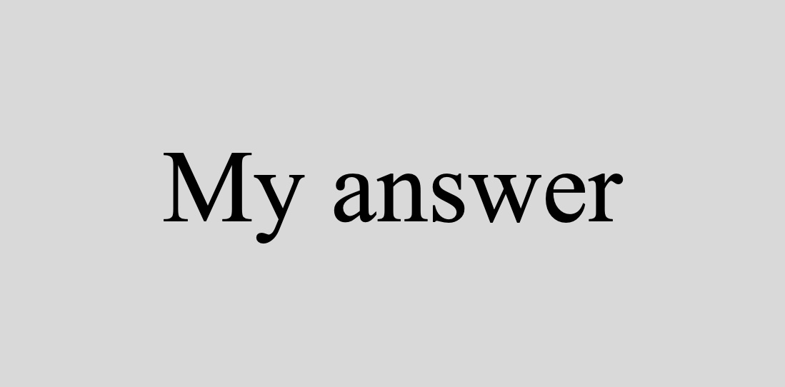

```{r setup, include=FALSE}
knitr::opts_chunk$set(echo = TRUE)
```

\newpage

# Lab Mechanics

rubric={mechanics:5}

Check off that you have read and followed each of these instructions:

- [ ] All files necessary to run your work must be pushed to your `GitHub.ubc.ca` repository for this lab.
- [ ] Paste the URL to your GitHub repo here: **INSERT YOUR GITHUB REPO URL HERE**
- [ ] You need to have **a minimum of 3 commit messages** associated with your `GitHub.ubc.ca` repository for this lab.
- [ ] **You must also submit `.Rmd` file and the rendered `.pdf` in this lab to Gradescope.** You are responsible for ensuring all the figures, texts, and equations in the `.pdf` file are appropriately rendered.
- [ ] To ensure you do not break the autograder remove all code for installing packages (i.e., DO NOT have `install.packages(...)` or `devtools::install_github(...)` in your homework!
- [ ] Follow the [**MDS general lab instructions**](https://ubc-mds.github.io/resources_pages/general_lab_instructions/).

> **Important:** For the assignments, you are permitted to use LLMs only to gather information, review concepts, or brainstorm. You **must cite** these tools if you use them for the assignment. It is not permitted to write any given assignment by copying and pasting AI-generated responses.

# One-time set-up

If you are using the `openintro` and `cowplot` packages for the first time and have never installed it before, do this:

1. Uncomment the two lines of code below by deleting the `# ` at the start of each line.
2. Run the code cell, which will perform the installation.
3. Comment the two lines of code again by adding the `# ` back to the start of each line.

```{r}
# install.packages("openintro")
# install.packages("cowplot")
```

# Every-time set-up

Every time you restart/reload this markdown, run the chunk below to load the libraries needed for this lab, as well as the test file so you can check your answers as you go!

```{r message=FALSE}
# Load necessary packages.
library(testthat)
library(tidyverse)
library(openintro)
library(cowplot)
```

# A Note on Challenging Questions

Each lab will have a few challenging questions. **These are usually low-risk questions and will contribute to a 5% out of the total lab grade of 100%**. The main purpose here is to challenge yourself or dig deeper in a particular area. When you start working on labs, attempt all other questions before moving to these questions. If you are running out of time, please skip these questions.

We will be more strict with the marking of these questions. If you want to get full points in these questions, your answers need to

- be thorough, thoughtful, and well-written (if necessary),
- provide convincing justification and appropriate evidence for the claims you make, and
- impress the reader of your lab with your understanding of the material, your analytical and critical reasoning skills, and your ability to think on your own.

# Lab Grade Computation

Once lab grades are published on Gradescope, you will see your **raw lab mark** $m$. This **raw lab mark** $m$ is the grand total of your granted marks throughout the whole lab assignment. Now, if we add up **all the marks (non-challenging and challenging)** in the handout corresponding to all `rubric={...}`, this sum is what we call the maximum raw lab mark $m_{100}$ to get 100% as a percentage lab grade. On the other hand, if we add up **the non-challenging marks** in the handout found in `rubric={...}`, this sum is what we call the raw lab mark $m_{95}$ to get a 95% as a percentage lab grade.

By the end of the block, **once all lab marking is finished on Gradescope**, your raw lab grades will be transferred to **Canvas**. Then, in your [**Canvas gradebook**](https://canvas.ubc.ca/courses/147187/grades), you will see these raw lab grades (`raw lab1`, `raw lab2`, `raw lab3`, and `raw lab4`). Finally, for each of the four labs, you will also see your final lab grades (`lab1`, `lab1`, `lab3`, and `lab4`). Let $g$ be the final lab grade of a specific lab **as a percentage**; it will be computed as follows:

- If $m > m_{95}$, then $g = 95 + \left( \frac{m - m_{95}}{m_{100} - m_{95}} \times 5 \right)$.
- If $m \leq m_{95}$, then $g = \left( \frac{m}{m_{95}} \right) \times 95$.

# A Note on Warmup Exercises

Each lab session will begin with a warmup exercise, which will be indicated when introduced in the handout. We will solve this exercise altogether during the first 10 minutes of the lab session. 

> **Note this warmup part will not count toward the lab grade of 100%.**

\newpage

# (Warmup) Exercise 1: The Hot Hand

This warmup exercise is from [\textcolor{blue}{The Hot Hand}](http://openintrostat.github.io/oilabs-tidy/03_probability/probability.html#The_Hot_Hand) lab exercise from OpenIntro Statistics.

Basketball players who make several baskets in succession are described as having a *hot hand*. This question focuses on the performance of one player: Kobe Bryant of the Los Angeles Lakers. His performance against the Orlando Magic in the 2009 NBA Finals earned him the title Most Valuable Player and many spectators commented on how he appeared to show a hot hand. The data file we will use is called `kobe_basket`. This data frame contains 133 observations and 6 variables, where every row records a shot taken by Kobe Bryant. The shot variable indicates whether the shot was a hit (H) or a miss (M).

**1.1.** The length of a shooting streak is defined here to be the number of consecutive baskets made until a miss occurs. The `calc_streak()` function, from the `openintro` package, computes a player's shooting streak. Using the `calc_streak` function, describe the distribution of Kobe's streak lengths from the 2009 NBA finals. How long was his longest streak of baskets? Make sure to include the accompanying plot in your answer.

**1.2.** Simulate 133 shots from a basketball player who has independent shots (i.e., does not have a \`\`hot hand") with a hit percentage of 45%.

**1.3.** Using `calc_streak()`, compute the streak length of this basketball player. Describe the distribution of streak lengths. How long is the player's longest streak of baskets in 133 shots? Make sure to include a plot in your answer.

**1.4.** If you were to run the simulation of the independent shooter a second time, how would you expect its streak distribution to compare to the distribution from the question above? Exactly the same? Somewhat similar? Totally different? Explain your reasoning.

**1.5.** How does Kobe Bryant's distribution of streak lengths compare to the distribution of streak lengths for the simulated shooter? Using this comparison, do you have evidence that the hot hand model fits Kobe's shooting patterns? Explain your reasoning.

**ANSWERS:**

_Type your answer here, replacing this text._

```{r}
# YOUR CODE HERE
```

```{r}
# YOUR CODE HERE
```

```{r}
# YOUR CODE HERE
```

\newpage

# Exercise 2: Gaussian Distribution

rubric={autograde:3}

> **Heads-up:** This question pertains to [**`lecture6`**](https://pages.github.ubc.ca/mds-2024-25/DSCI_551_stat-prob-dsci_students/notes/06_lecture-continuous-families.html#) from last week. We wanted to make `lab3` shorter for quiz week.

Suppose the scores on a college entrance exam, denoted as $X$, are **normally distributed** with a mean of $\mu = 550$ and a standard deviation of $\sigma = 100$.

Use `R` functions such as `pnorm()` and `qnorm()` to answer the following questions:

**2.1.** What is the probability that a student receives a score higher than $700$?

**2.2.** What is the probability that a student receives a score between $525$ and $700$?

**2.3.** UBC will only consider students for admission if their score is at the $90$th percentile (or higher) of the distribution. Hence, what is this minimum entrance score?

Assign your **numeric values (not vectors)** to `answer2_1`, `answer2_2`, and `answer2_3`. **Code your computations directly in each answer.** Moreover, run the test below to validate your answers.

**ANSWER:**

```{r}
answer2_1 <- NULL
answer2_2 <- NULL
answer2_3 <- NULL

# YOUR CODE HERE
```

```{r}
. = ottr::check("tests/Q2.R")
```

\newpage

# Exercise 3: Maximum Likelihood Estimation

Suppose we are interested in the **unknown** population mean $\lambda > 0$ related to **the number of car accidents in Calgary's downtown from 9:00 a.m. to 12:00 p.m.**

> **Important:** In the context of this problem, $\lambda$ refers to the **population mean count** of car accidents in Calgary's downtown from 9:00 a.m. to 12:00 p.m. In practice, we will never know the real and exact value of $\lambda$. Therefore, we can use statistical techniques such as maximum likelihood estimation (MLE) to obtain $\hat{\lambda}$ (i.e., an estimate of $\lambda$). This is our **main statistical inquiry** throughout this exercise.

Therefore, you draw a random sample of $n = 100$ days which contains the car accident records in Calgary's downtown from 9:00 a.m. to 12:00 p.m. These records are stored in the tibble `accident_sample`.

> **Heads-up:** You might think that those $n = 100$ days might not be entirely independent if they are close to each other. In fact, in more complex models such as the ones from DSCI 562, other approaches can be used to deal with correlated observations. But, for the time being, let us assume these $n = 100$ days are *independent and identically distributed (iid)*.

Run the below cell before proceeding:

```{r}
accident_sample <- tibble(day_observed = as.integer(c(
  6, 5, 2, 1, 5, 6, 4, 3, 4, 0, 2, 4, 5, 5, 4, 2, 4, 3, 2, 3, 4, 4,
  1, 3, 0, 2, 4, 1, 2, 1, 3, 2, 4, 4, 2, 4, 0, 2, 3, 1, 3, 5, 4, 2,
  3, 6, 4, 2, 6, 2, 3, 2, 4, 6, 3, 5, 6, 4, 6, 2, 2, 3, 0, 5, 2, 2,
  2, 1, 5, 3, 0, 4, 3, 2, 3, 2, 4, 2, 6, 6, 2, 4, 6, 4, 1, 0, 3, 7,
  1, 2, 1, 1, 3, 2, 1, 2, 7, 2, 8, 4
)))
```

Since our variable of interest is discrete, we will visualize the sample distribution of `accident_sample` using a **proper plot** (i.e., a bar chart). We ensure that our axes are human-readable. Run the below cell before proceeding:

```{r fig.width=7, fig.height=4}
sample_dist <- ggplot(accident_sample) +
  geom_bar(aes(x = as.factor(day_observed)), fill = "#F4A460", color = "darkblue") +
  theme(
    plot.title = element_text(size = 13, face = "bold"),
    axis.text = element_text(size = 11),
    axis.title = element_text(size = 12)
  ) +
  ggtitle("Bar Chart of Accident Sample (n = 100)") +
  labs(x = "Daily Observed Value", y = "Count")

sample_dist
```

## 3.1. Choosing your distribution!

rubric={reasoning:3}

Let $Y_i$ be the number of car accidents in Calgary's downtown from 9:00 a.m. to 12:00 p.m. on the $i$th day ($i = 1, \dots, n$) with an unknown population mean $\lambda$. What is the most appropriate theoretical distribution that we could assume for $Y_i$ to estimate $\lambda$ via maximum likelihood estimation (MLE)? Why are you choosing this distribution? **Answer in two or three sentences.**

**ANSWER:**

_Type your answer here, replacing this text._

## 3.2. Standalone Probability Mass Function

rubric={reasoning:2}

Based on your answer in **3.1**, what is the correct probability mass
function (PMF) for a single $Y_i$?

To get full marks on this question, follow these instructions:

a. Provide your procedure and/or reasoning (e.g., an equation). You do not need to use [**LaTeX**](https://www.latex-project.org) to provide mathematical notation. 
b. Instead, you might work on your written answer on a separate piece of paper and take a picture of it. 
c. Then, you have to put this image in the folder `img` which is part of your lab GitHub repo.
d. Finally, within this `R` markdown, use the following syntax: ``, where `my_answer_3_2.jpg` is your image's name. The output is the following:
    


**ANSWER:**

_Type your answer here, replacing this text._

## 3.3. Likelihood Function

rubric={reasoning:2}

Based on your answer in **Q3.2**, and assuming that the $n$ $Y_i$s are *iid*, what is the likelihood function of the random sample?

To get full marks on this question, follow these instructions:

a. Provide your procedure and/or reasoning (e.g., an equation). You do not need to use [**LaTeX**](https://www.latex-project.org) to provide mathematical notation. 
b. Instead, you might work on your written answer on a separate piece of paper and take a picture of it. 
c. Then, you have to put this image in the folder `img` which is part of your lab GitHub repo.
d. Finally, within this `R` markdown, use the following syntax: ``, where `my_answer_3_3.jpg` is your image's name. The output is the following:
    


**ANSWER:**

_Type your answer here, replacing this text._

## 3.4. Taking an Empirical Approach

rubric={autograde:5}

Let us try the **empirical MLE approach** by computing the likelihood and log-likelihood values on a $\lambda$ range **from `0.3` to `5` by increments of `0.1`**. Your **data frame** should have the following three columns:

- `possible_lambdas`: the $\lambda$ range.
- `likelihood`: the likelihood values associated with the $\lambda$ range (you can use a function analogous to `dexp()` as in [**`lecture7`**](https://pages.github.ubc.ca/mds-2024-25/DSCI_551_stat-prob-dsci_students/notes/07_lecture-maximum-likelihood-estimation.html#finding-the-maximum-likelihood-and-log-likelihood-using-a-range-of-beta-values), **but applicable to your answer in 3.1**).
- `log_likelihood`: the logarithmic transformation on the base $e$ of column `likelihood`.

Bind your results to the object `lambda_sequence_values`. Moreover, run the test below to validate your answer.

> **Heads-up:** Do not round any output.

```{r}
lambda_sequence_values <- NULL

# YOUR CODE HERE

head(lambda_sequence_values)
tail(lambda_sequence_values)
```

```{r}
. = ottr::check("tests/Q3.4.R")
```

Then, using our results in `lambda_sequence_values`, we can create another two proper plots for the columns `likelihood` and `log_likelihood` values, respectively, to the column `possible_lambdas`. **Uncomment and run** the below cell before proceeding:

```{r fig.width=7, fig.height=6}
# likelihood_plot <- ggplot(lambda_sequence_values, aes(
#   x = possible_lambdas,
#   y = likelihood
# )) +
#   geom_line() +
#   theme(
#     plot.title = element_text(size = 13, face = "bold"),
#     axis.text = element_text(size = 10),
#     axis.title = element_text(size = 12)
#   ) +
#   ggtitle("Likelihood Values in Lambda Sequence") +
#   labs(x = "Lambda Sequence", y = "Likelihood Value") +
#   scale_x_continuous(breaks = seq(0.2, 5, 0.4))
#
# log_likelihood_plot <- ggplot(lambda_sequence_values, aes(
#   x = possible_lambdas,
#   y = log_likelihood
# )) +
#   geom_line() +
#   theme(
#     plot.title = element_text(size = 13, face = "bold"),
#     axis.text = element_text(size = 10),
#     axis.title = element_text(size = 12)
#   ) +
#   ggtitle("Log-likelihood Values in Lambda Sequence") +
#   labs(x = "Lambda Sequence", y = "Log-likelihood Value") +
#   scale_x_continuous(breaks = seq(0.2, 5, 0.4))
#
# plot_grid(likelihood_plot, log_likelihood_plot, nrow = 2)

# YOUR CODE HERE
```

## (Optional - Not for marks) 3.5. Analytical Approach

> **Important:** Multivariate Calculus (as part of analytical MLE) is out of the scope of `quiz2`. Therefore, you will not encounter this class of questions in the quiz. 

Based on your likelihood function from **Q3.3**, derive the log-likelihood function. Furthermore, using your log-likelihood function, show that the analytical maximum likelihood estimate for $\lambda$ is the following:

$$\hat{\lambda} = \frac{\sum_{i = 1}^n y_i}{n}$$ 

**Make sure your result is a maximum.**

**ANSWER:**

_Type your answer here, replacing this text._

## Q3.6. Empirical Maximum Likelihood Estimate

rubric={autograde:3}

Using your results in `lambda_sequence_values`, identify the row in column `possible_lambdas` for which you obtain the maximum `likelihood` or `log_likelihood` (**recall the logarithm is a monotonic transformation**). Bind the name `empirical_mle` to this **single** $\lambda$ value as a **numeric vector**. Moreover, run the test below to validate your answer.

> **Heads-up:** Do not round the output.

```{r}
empirical_mle <- NULL

# YOUR CODE HERE

empirical_mle
```

```{r}
. = ottr::check("tests/Q3.6.R")
```

## Q3.7. Analytical Maximum Likelihood Estimate

rubric={autograde:1}

Obtain the analytical maximum likelihood estimate 

$$\hat{\lambda} = \frac{\sum_{i = 1}^n y_i}{n}$$

from **Q3.5** using `accident_sample`. Bind the name `analytical_mle` to this estimate as a **numeric vector**. Moreover, run the test below to validate your answer.

> **Heads-up:** Do not round the output.

```{r}
analytical_mle <- NULL

# YOUR CODE HERE

analytical_mle
```

```{r}
. = ottr::check("tests/Q3.7.R")
```

Uncomment and run the code below:

```{r fig.width=7, fig.height=6}
# likelihood_plot <- likelihood_plot +
#   geom_vline(xintercept = analytical_mle, colour = "red") +
#   geom_vline(xintercept = empirical_mle, colour = "blue")
# 
# log_likelihood_plot <- log_likelihood_plot +
#   geom_vline(xintercept = analytical_mle, colour = "red", show.legend = TRUE) +
#   geom_vline(xintercept = empirical_mle, colour = "blue", show.legend = TRUE)
#
# plot_grid(likelihood_plot, log_likelihood_plot, nrow = 2)

# YOUR CODE HERE
```

Above, we can see our maximum likelihood estimates: `analytical_mle` in red and `empirical_mle` in blue. Both of them are pretty similar. Now, it is time to remove the curtain! The `accident_sample` was actually taken from a **Poisson-distributed** population with $\lambda = 3$. Hence, your estimates (**both empirical and analytical**) should be close to the value they are aiming to estimate.

> **Coming up in DSCI 552:** A single-point estimate (such as  the MLE $\hat{\lambda}$) is not enough to communicate our findings. We also need to control and measure the uncertainty in our estimates since they are computed from a random sample. Statistically speaking, we can compute a confidence interval (CI) **to measure the uncertainty of our estimates**.

\newpage

# Exercise 4: One-step Simulation (Basketball)

rubric={accuracy:10,reasoning:3}

A basketball player makes 70% of their free throws and gets exactly two free throws per game. We can use simulation to estimate the probability of the player missing both free throws in a game as an alternative to finding this probability using exact calculations. The `R` function `run_game()` below simulates the outcome of a game. Run the chunk below.

```{r}
#' Simulate throw success.
#' 
#' Simulates the outcome of a bunch of throws in a basketball game.
#' Each throw has the same probability of success.
#' 
#' @param throws Number of throws attempted in the game.
#' @param p_success Success probability of a throw.
#' 
#' @return 
#' A tibble with columns named "throw" and "outcome", containing
#' the throw number and the corresponding outcomes.
run_game <- function(throws = 2, p_success = 0.7) {
  probs <- c(1 - p_success, p_success)
  sample(c("miss", "success"),
    size = throws,
    replace = TRUE,
    prob = probs
  ) %>%
    enframe(name = "throw", value = "outcome") %>%
    mutate(throw = str_c("Throw", throw, sep = "_"))
}

test_that("run_game output is as expected", {
  expect_true(is_tibble(run_game()))
  expect_identical(nrow(run_game(throws = 5)), 5L)
})

run_game() # Testing our function.
```

The code below simulates $n = 10$ games, with `throws = 2` each, and binds the outcomes into one tibble.

```{r}
set.seed(1) # Fix the random seed so results are reproducible.
n <- 10  # Number of simulations to run.
map(1:n, ~ run_game()) %>%
  enframe(name = "Game", value = "result") %>%
  unnest(result) %>%
  spread(
    key = "throw",
    value = "outcome"
  )
```

Now, answer the following questions, **making sure to set the seed to `551`** every time you run each simulation (so your simulations are **reproducible**).

**4.1.** What is the **theoretical** (not simulated!) probability the player misses **both** free throws in a game (**assuming the two throws are independent**)? Assign your **numeric value** to `answer4_1`. **Code your computation directly.** Moreover, run the test below to validate your answer.

```{r}
answer4_1 <- NULL

# YOUR CODE HERE

answer4_1
```

```{r}
. = ottr::check("tests/Q4-1.R")
```

**4.2.** Using `run_game()` as shown above, code $n = 30$ simulations below. Then, **based on these** $n = 30$ simulations, what is the probability the player misses **both** free throws in a game? Assign your **numeric value** to `answer4_2`.

> **Heads-up:** You might need to code the corresponding data wrangling to automatically estimate this probability based on your simulation results.

```{r}
set.seed(551) # Reproducibility!

answer4_2 <- NULL

# YOUR CODE HERE

answer4_2
```

**4.3.** Using `run_game()` as shown above, code $n = 10000$ simulations below. **Based on these** $n = 10000$ simulations, what is the probability the player misses **both** free throws in a game? Assign your **numeric value** to `answer4_3`.

> **Heads-up:** You might need to code the corresponding data wrangling to automatically estimate this probability based on your simulation results.

```{r}
set.seed(551) # Reproducibility!

answer4_3 <- NULL

# YOUR CODE HERE

answer4_3
```

**4.4.** What happens to the estimated probability as the number of simulations increases? How does this relate to the theoretical probability found in **Q4.1**? **Answer in one or two sentences.**

> **Heads-up:** You must give complete reasoning answers to **4.1** (besides the numerical answer) and **4.4** to obtain the full 3 *reasoning* points.

**REASONING ANSWERS:**

_Type your answer here, replacing this text._

\newpage

# Exercise 5: Two-step Simulation: Simulating a Birthday Party

Simulations can be extremely useful for estimating distributions. For example, imagine you plan to throw a party to celebrate being part of the MDS program. You invite 40 guests to your party, but you would like to get an idea of how many of those people will actually attend. This kind of problem is well suited to a simulation analysis! First, you can assign each person a probability that they will attend your party based on what you know about them. Then, you can run an arbitrary number of simulations to see how many people might actually attend your (simulated) party.

The code in the chunk below reads a `.csv` file and creates a tibble of data for you to use in this problem. This will be the guest list you will use to simulate different parties. **Run this code to view the data.**

```{r}
guestlist <- suppressMessages(read_csv("data/guestlist.csv")) %>%
  mutate(
    p_attend = case_when(
      attend == "Highly likely" ~ 0.9,
      attend == "Likely" ~ 0.8,
      attend == "Maybe" ~ 0.6,
      attend == "Unlikely" ~ 0.4,
      attend == "Highly unlikely" ~ 0.2
    )
  )
guestlist
```

The next code chunk below defines a function to run the simulation for one party. It outputs a list of people who end up attending the party. **Run this chunk of code before proceeding.**

```{r}
#' Simulate attendance at a party.
#' 
#' Given a guest list with attendance probabilities, simulates
#' attendance at the event.
#' 
#' @param .data Data frame of guests and their attendance probabilities.
#' @param pcol,guestcol Name of the column containing attendance probabilities 
#' and guest names, respectively. 
#' @return A vector of guests that attended the simulated party.
run_party <- function(.data, pcol = "p_attend", guestcol = "guest") {
  indiv_probs <- .data[[pcol]]
  people <- .data[[guestcol]]
  in_attendance <- map_lgl(indiv_probs, rbernoulli, n = 1)
  people[in_attendance]
}

test_that("run_party output is as expected", {
  expect_true(is_vector(run_party(guestlist)))
  expect_true(is_character(run_party(guestlist)))
  expect_lte(length(run_party(guestlist)), nrow(guestlist))
})

run_party(guestlist)
```

The next chunk of code uses the function to simulate $n = 100$ runs of a party, calculates the probability of each outcome, and plots the results. The **sample mean** is also calculated, and represented as a vertical red line. **Run this chunk of code before proceeding.**

```{r fig.width=6.5, fig.height=3}
set.seed(1) # Set the random number generator seed.
n <- 100

attendance <- map(1:n, ~ run_party(guestlist)) %>%
  map_int(length) %>%
  enframe(name = "simulation", value = "total_guests")
head(attendance, 5) # Showing our first five simulations.

attendance %>%
  ggplot(aes(total_guests, y = after_stat(prop))) +
  geom_bar() +
  geom_vline(
    xintercept = mean(attendance$total_guests),
    col = "red", linewidth = 1
  ) +
  labs(
    x = "Number of Guests in Attendance",
    y = "Simulated\nProbability"
  ) +
  theme_bw() +
  theme(text = element_text(size = 12))
```

## 5.1. Using `run_party()`

rubric={accuracy:3,reasoning:5}

**5.1.1.** Read through the `run_party()` function and describe what it is doing **in one or two sentences**.

**ANSWER:**

_Type your answer here, replacing this text._

Now, answer the following questions, **making sure to set the seed to `551`** every time you run each simulation (so your simulations are **reproducible**).

> **Heads-up:** You will need to code the corresponding data wrangling to automatically compute your answers based on your simulation results.

**5.1.2.** Simulate a single party, i.e., $n = 1$. What is the number of guests that attend when you run this simulation?

**5.1.3.** What is the average number of guests that attend when you run $n = 50$ simulations?

**5.1.4.** What is the average number of guests that attend when you run $n = 100$ simulations?

Assign your **numeric answers** to `answer5_1_2`, `answer5_1_2`, and `answer5_1_2`.

```{r}
answer5_1_2 <- NULL
answer5_1_3 <- NULL
answer5_1_4 <- NULL

# NOTE: For EACH ANSWER, please set the seed to 551 
# before running the corresponding simulation.

# YOUR CODE HERE

answer5_1_2 
answer5_1_3
answer5_1_4
```

## 5.2. The cupcakes!

rubric={reasoning:6}

> **Note:** The above 6 reasoning points are jointly allocated for Q5.2.1, Q5.2.2, and Q5.2.3.

**Now you want to know how many cupcakes you should bake for your party.** This depends on which guests will attend the party and how many cupcakes they each eat. The average number of cupcakes each guest eats at a party is contained within the `cupcakes` column of the `guestlist` tibble.

```{r}
guestlist
```

We will assume the number of cupcakes a person eats is **Poisson distributed** with its **mean parameter** equal to the value you see in the table above.

Let us use Quan as an example. Let $Q$ be a Bernoulli random variable representing whether or not Quan is attending the party, and let $C$ represent the number of cupcakes eaten by Quan.

Find the following (by either writing out the equations or fully specifying the distribution in terms of a family and its parameters):

**5.2.1.** $P(C = c \mid Q = \text{yes})$, the conditional distribution of Quan's cupcake consumption given that Quan is attending the party.

**5.2.2.** $P(C = c \mid Q = \text{no})$, the conditional distribution of Quan's cupcake consumption given that Quan is **not** attending the party.

**5.2.3.** $\mathbb{E}(C)$, the expected value of Quan's cupcake consumption without knowing whether or not he will be attending the party.

**(Challenging) 5.2.4.**

rubric={reasoning:3}

Obtain $P(C = c)$, the marginal distribution of Quan's cupcake consumption.

**(Challenging) 5.2.5.**

rubric={reasoning:3}

**Mathematically**, prove that your marginal distribution from **Q5.2.4** is a proper probability distribution (i.e., it adds up to $1$).

> **Hint:** You might need to check mathematical series expansions for **Q5.2.5**.

To get full marks on all the above questions, follow these instructions:

a. Provide your procedure and/or reasoning (e.g., an equation). You do not need to use [**LaTeX**](https://www.latex-project.org) to provide mathematical notation. 
b. Instead, you might work on your written answer on a separate piece of paper and take a picture of it. 
c. Then, you have to put this image in the folder `img` which is part of your lab GitHub repo.
d. Finally, within this `R` markdown, use the following syntax: ``, where `my_answer_5_2.jpg` is your image's name. The output is the following:
    


**ANSWERS:**

_Type your answer here, replacing this text._

## 5.3. Modifying `run_party()`!

rubric={reasoning:4}

The code in the next cell modifies the `run_party()` function to simulate the number of cupcakes needed for your party.

```{r}
#' Simulate number of cupcakes each guest eats at a party.
#' 
#' Given a guest list with attendance probabilities, and average
#' number of cupcakes each guest eats, simulates the total number of
#' cupcakes eaten.
#' 
#' @param .data Data frame of guests, their attendance probabilities, average
#' number of cupcakes they eat at a party.      
#' @param pcol,guestcol Name of the column containing attendance probabilities, 
#' guest names, average number of cupcakes eaten respectively. 
#' @return A vector of cupcakes each attending guest eats in the simulated party.
run_party_cupcakes <- function(.data, pcol = "p_attend",
                               guestcol = "guest", cakecol = "cupcakes") {
  indiv_probs <- .data[[pcol]]
  people <- .data[[guestcol]]
  in_attendance <- map_lgl(indiv_probs, rbernoulli, n = 1)
  num_cupcakes <- map(.data[[cakecol]][in_attendance], rpois, n = 1)
  unlist(num_cupcakes, use.names = FALSE)
}

run_party_cupcakes(guestlist)
```

Now we run this code for $n = 1000$ simulated parties. Then, we plot the simulation results. The **sample mean** of $41.875$ cupcakes is also calculated, and represented as a vertical red line.

```{r fig.width=6.5, fig.height=3}
set.seed(1) # Set the random number generator seed (do not change this!).
n <- 1000

attendance <- map(1:n, ~ run_party_cupcakes(guestlist)) %>%
  map_int(sum) %>%
  enframe(name = "simulation", value = "total_cupcakes")
head(attendance, 5) # Showing our first five simulated parties.

mean(attendance$total_cupcakes)

attendance %>%
  ggplot(aes(total_cupcakes)) +
  geom_bar() +
  geom_vline(
    xintercept = mean(attendance$total_cupcakes),
    col = "red", linewidth = 1
  ) +
  labs(
    x = "Number of Cupcakes to Bake for the Party",
    y = "Simulated\nProbability"
  ) +
  theme_bw() +
  theme(text = element_text(size = 12))
```

Given this sample mean of 41.875, **the estimated expected cupcake demand** is around 42 cupcakes. However, as a party host, you are no slouch! You do not want to risk running out of cupcakes! Therefore, you want to be 95% sure that you will have enough cupcakes for everyone who attends. How many cupcakes should you make? **Justify your answer. You might need to use some `R` code.**

**ANSWER:**

_Type your answer here, replacing this text._

```{r}
# YOUR CODE HERE
```

## (Challenging) 5.4. Adjusting the simulation settings

rubric={reasoning:3,accuracy:3}

You get an RSVP of "Yes" from Varada. That is great news, Varada was a "Maybe" to begin with and now she is attending after all. How does this news change the expected cupcake demand? That is, **given that Varada is attending**, what is the estimated conditional expectation of the number of cupcakes? **Justify your answer. You will need to adjust your simulation settings accordingly.**

**ANSWER:**

_Type your answer here, replacing this text._

```{r}
set.seed(551) # Set the random number generator seed (DO NOT CHANGE THIS!).
n <- 1000 # Number of simulation replicates.

# YOUR CODE HERE
```

## (Challenging) 5.5. Simulating quantiles!

rubric={reasoning:3}

How does this news change the 95% quantile of the cupcake distribution? That is, **given that Varada is attending**, how many cupcakes do you need to make to be 95% confident that you will have enough for everyone?

**ANSWER:**

_Type your answer here, replacing this text._

```{r}
set.seed(551) # Set the random number generator seed.

# YOUR CODE HERE
```


