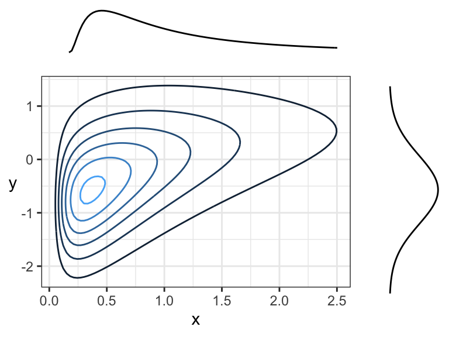
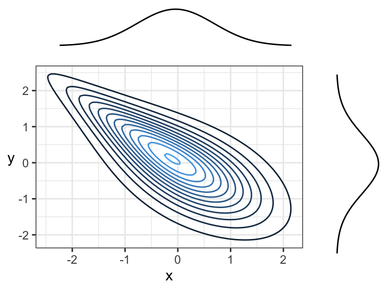
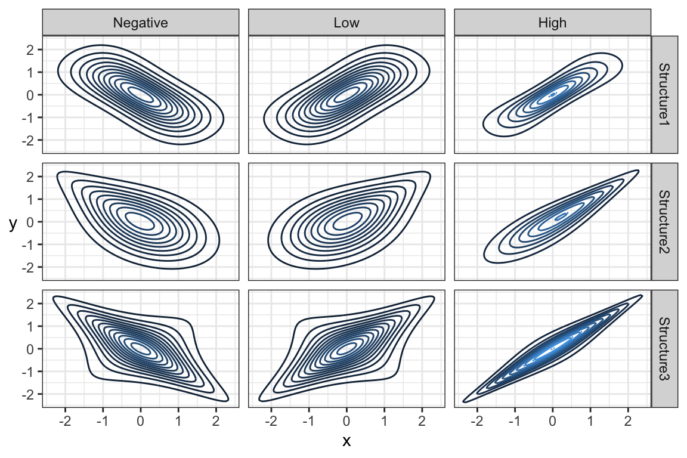

This appendix will start with some basics on plotting **multidimensional probability density functions (PDFs)**. Then, we will recheck the concepts of **independence** and **dependence** from **DSCI 551** along with its visualization. Finally, we will wrap up the appendix with the **bivariate and multivariate Normal distributions** and some exercises (with their corresponding solutions at the end of the appendix).

## Drawing Multidimensional Functions 

Drawing a $d$-dimensional PDF requires $d + 1$ dimensions, so we usually draw $1$-dimensional functions and occasionally draw $2$-dimensional functions.

A common way to draw $2$-dimensional functions (**not just PDFs!**) is to use **contour plots**. To understand countour plots, you can think of the output dimension as coming **out of the page**. Here are some examples of how to draw $2$-dimensional functions: [**in `Python`**](https://jakevdp.github.io/PythonDataScienceHandbook/04.04-density-and-contour-plots.html) and [**in `R`**](https://www.r-statistics.com/2016/07/using-2d-contour-plots-within-ggplot2-to-visualize-relationships-between-three-variables/).

As an additional example, we provide a contour plot rendering of the elevation of Auckland's Maunga Whau Volcano. [According to the dataset documentation](https://www.rdocumentation.org/packages/datasets/versions/3.6.2/topics/volcano) in @fig-maunga, the $x$-axis indicates grid lines running east to west, whereas the $y$-axis indicates grid lines running south to north. Note that this plot has a legend indicating the volcano's elevation in metres as a colour scale for the corresponding contours.

```{r}
#| echo: false 
#| message: false
#| warning: false
library(tidyverse)
source("../scripts/ggjointmarg.R")
```

```{r}
#| echo: false 
#| message: false
#| warning: false
volcano_plot <- volcano %>%
  reshape::melt() %>%
  ggplot(aes(X1, X2)) +
  geom_contour(aes(z = value, colour = after_stat(level))) +
  scale_color_continuous("Elevation (metres)") +
  theme_minimal() +
  theme(
    plot.title = element_text(size = 17, face = "bold"),
    axis.text = element_text(size = 16),
    axis.title = element_text(size = 16, face = "bold"),
    legend.title=element_text(size = 16, face = "bold"), 
    legend.text=element_text(size = 16),
    legend.key.size = unit(1, 'cm')
  ) +
  labs(
    x = "Grid Lines Running East to West",
    y = "Grid Lines Running South to North"
  )
```

```{r}
#| echo: false 
#| message: false
#| warning: false
#| label: fig-maunga
#| fig-cap: "Topographic Information on Auckland's Maunga Whau Volcano."
#| fig.height: 9
#| fig.width: 12.5
volcano_plot
```

Let us start with **theoretical contour plots in multivariate continuous distributions**. When it comes to bivariate PDFs, it is informative to plot the marginal densities on each axis. @fig-bivariate-normal-contour is an example where marginals are Normal or Gaussian, and the joint distribution is also a **bivariate Normal or Gaussian** (we will see what this means later on in this appendix!).

```{r}
#| echo: false 
#| message: false
#| warning: false
#| label: fig-bivariate-normal-contour
#| fig-cap: "Contour plot of a bivariate Normal distribution with marginals on top and right-hand side."
#| fig.height: 9
#| fig.width: 12.5
library(mvtnorm)
library(cowplot)

x <- seq(-3, 3, length.out = 100)
y <- seq(-3, 3, length.out = 100)
cov_mat <- matrix(c(1, 0.8, 0.8, 1), nrow = 2)

mult_data <- expand.grid(x = x, y = y) %>%
  mutate(z = rep(0, 10000))

mu <- c(0, 0)

for (i in 1:nrow(mult_data)) {
  mult_data$z[i] <- dmvnorm(c(mult_data$x[i], mult_data$y[i]),
    mean = mu, sigma = cov_mat
  )
}

plot_grid(
  title, ggjointmarg(mult_data, dnorm, dnorm),
  ncol = 1,
  rel_heights = c(0.1, 1)
)
```

@fig-bivariate-normal-contour shows the contours corresponding to the density of a bivariate Normal distribution (imagine the PDF is on a third $z$-axis coming out from the screen). The numeric levels as a legend corresponding to the multivariate PDF were omitted to leave room for the corresponding **marginal Normal PDFs** of random variable $X$ on top and random variable $Y$ on the right-hand side. 

In @fig-3d-bivariate-normal, we can also check the three-dimensional plot corresponding to the contour plot in @fig-bivariate-normal-contour (we include the legend corresponding to the probability density on the $z$-axis):

```{r}
#| echo: false 
#| message: false
#| warning: false
#| label: fig-3d-bivariate-normal
#| fig-cap: "3-d plot of a bivariate Normal distribution."
#| fig.height: 9
#| fig.width: 12.5
library(plotly)

z_settings <- list(
  title = "Probability <br>Density"
)

plot_ly(z = sapply(
  x <- seq(-3, 3, .1),
  function(y) (1 / (2 * pi * sqrt(1 - 0.8^2))) * 
    exp(-(y^2 / 2) - ((x - (0.8 * y))^2 / (2 * (1 - 0.8^2))))
), x = x, y = x, type = "surface") %>%
  layout(scene = list(
    zaxis = z_settings
  ))
```

Recall the PDF tells us how "*densely packed"* data coming from this distribution will be. @fig-bivariate-normal-contour-2 show the same contour plot from @fig-bivariate-normal-contour, but with a sample of size $n = 300$ data points plotted overtop. The individual $x$ and $y$ coordinates are also plotted with their corresponding densities. Notice that points are more densely packed near the middle, where the density function is biggest.

```{r}
#| echo: false 
#| message: false
#| warning: false
#| label: fig-bivariate-normal-contour-2
#| fig-cap: "Contour plot of a bivariate Normal distribution with marginals on top and right-hand side, along with n = 300 sampled data points."
#| fig.height: 9
#| fig.width: 12.5
set.seed(551)

sample_mult_norm <- rmvnorm(n = 300, mean = mu, sigma = cov_mat)
sample_mult_norm <- as.data.frame(sample_mult_norm)
names(sample_mult_norm) <- c("x", "y")

plot_grid(
  title, ggjointmarg(mult_data, dnorm, dnorm, sample_mult_norm),
  ncol = 1,
  rel_heights = c(0.1, 1)
)
```

## Independence

Let us revisit the concept of probabilistic independence but applied to multivariate continuous distributions. 

### Definition in the Continuous Case

Recall that the independence of random variables $X$ and $Y$ means that knowledge about one variable tells us nothing about the other.

::: {.callout-tip}
## Definition of independence in probability distributions between two random variables
Let $X$ and $Y$ be two **independent** random variables. Using their corresponding marginals, we can obtain their corresponding joint distributions as follows:

- **$X$ and $Y$ are discrete.** Let $P(X = x, Y = y)$ be the joint probability mass function (PMF) with $P(X = x)$ and $P(Y = y)$ as their marginals. Then, we define the joint PMF as:

$$P(X = x, Y = y) = P(X = x) \cdot P(Y = y).$$

- **$X$ and $Y$ are continuous.** Let $f_{X,Y}(x,y)$ be the joint PDF with $f_X(x)$ and $f_Y(y)$ as their marginals. Then, we define the joint PDF as:

$$f_{X,Y}(x,y) = f_X(x) \cdot f_Y(y).$$
:::


::: {.callout-important}
## Important
The term denoting a discrete joint PMF $P(X = x, Y = y)$ is **equivalent** to the intersection of events $P(X = x \cap Y = y)$.
:::

In the discrete case, this means that a joint probability distribution (when depicted as a table) has each row/column as a multiple of the others because (by definition of independence):

$$P(X = x \cap Y = y) = P(X = x) \cdot P(Y = y).$$

Or, equivalently,

$$P(Y = y \mid X = x) = \frac{P(X = x \cap Y = y)}{P(X = x)} = \frac{P(X = x) \cdot P(Y = y)}{P(X = x)} = P(Y = y).$$

In the continuous case, probabilities become densities. A definition of independence becomes

$$
f_{X,Y}(x, y) = f_X(x) \cdot f_Y(y),
$$ {#eq-independent-cont-joint}

where $f_{X,Y}(x, y)$ is the joint PDF of the continuous random variables $X$ and $Y$, $f_X(x)$ is the marginal PDF of $X$, and $f_Y(y)$ is the marginal PDF of $Y$. Or, equivalently

$$
f_{Y \mid X}(y) = \frac{f_{X,Y}(x, y)}{f_X(x)}= \frac{f_X(x) \cdot f_Y(y)}{f_X(x)} = f_Y(y).
$$ {#eq-cond-cont-joint}


::: {.callout-important}
## Important
Each of these two above definitions has an intuitive meaning. The first definition,

$$
f_{X,Y}(x, y) = f_X(x) \cdot f_Y(y)
$$

in @eq-independent-cont-joint, means that, when slicing the joint density at various points along the $x$-axis (and also for the $y$-axis), the resulting one-dimensional function will be the same, except for some multiplication factor. For example,

$$
f_{X,Y}(1, y) = f_X(1) \cdot f_Y(y)
$$

and

$$
f_{X,Y}(2, y) = f_X(2) \cdot f_Y(y).
$$

So $f_{X,Y}(1, y)$ and $f_{X,Y}(2,y)$ are actually the same function, just scaled by different factors. Note that $f_{X,Y}(1,y)$ **is NOT a proper PDF**.

The second definition,

$$
f_{Y \mid X}(y) = f_Y(y)
$$

in @eq-cond-cont-joint, is probably more intuitive. As in the discrete case, it means that knowing $X$ does not tell us anything about $Y$. The same could be said about the reverse. To see why definition in @eq-independent-cont-joint is equivalent to the definition in @eq-cond-cont-joint, consider the below formula, which holds regardless of whether we have independence:

$$
f_{X,Y}(x, y) = f_{Y \mid X}(y) \ f_X(x).
$$

Setting $f_{Y \mid X}(\cdot)$ equal to $f_Y(\cdot)$ results in the original definition from @eq-independent-cont-joint.
:::

### Independence Visualized

Let us start with **theoretical contour plots in multivariate continuous distributions**. When it comes to bivariate PDFs, it is informative to plot the marginal densities on each axis. In general, just by looking at a contour plot of a bivariate density function, it is hard to tell whether this distribution is of two independent random variables. But we **can** tell by looking at "slices" of the distribution. 

Here is an example of two **independent** random variables where 

$$X \sim \text{Exponential}(\lambda = 1),$$ 

and 

$$Y \sim \mathcal{N}\left(\mu = 0, \sigma^2 = 1\right).$$

Mathematically, their joint PDF is expressed as:

$$
\begin{align*}
f_{X,Y} \left( x, y \right) &= f_X \left( x \mid \lambda = 1 \right) \times f_Y \left( y \mid \mu = 0, \sigma^2 = 1 \right) \\
&= \left[ \lambda \exp(-\lambda x) \right] \times \left\{ \frac{1}{\sqrt{2\pi \sigma^2}} \exp \left[ -\frac{(y - \mu)^2}{2\sigma^2} \right] \right\} \\
&= \exp(-x) \times \left[ \frac{1}{\sqrt{2\pi}} \exp \left( -\frac{y^2}{2} \right) \right].
\end{align*}
$$

Their corresponding joint PDF is shown in @fig-3d-bivariate-ind-exponential-normal.

```{r}
#| echo: false 
#| message: false
#| warning: false
#| label: fig-3d-bivariate-ind-exponential-normal
#| fig-cap: "3-d plot of two jointly independent random variables: Exponential and Normal distributions."
#| fig.height: 9
#| fig.width: 12.5

# NOTE: x and y coordinates are inverted in the code with respect to the random variable setup

z_settings <- list(
  title = "Probability <br>Density"
)

x_settings <- list(
  range = c(0, 3)
)

y_settings <- list(
  range = c(-3, 3)
)

plot_ly(z = sapply(
  x <- seq(-3, 3, .1),
  function(y) dnorm(x) * dexp(y)
), x = x, y = x, type = "surface") %>%
  layout(scene = list(
    xaxis = x_settings,
    yaxis = y_settings,
    zaxis = z_settings
  ))
```

Now, the three-dimensional plot from @fig-3d-bivariate-ind-exponential-normal also has a contour version, as shown in @fig-bivariate-ind-exponential-normal-contour. We will slice this contour plot along the dashed orange lines.

```{r}
#| echo: false 
#| message: false
#| warning: false
#| label: fig-bivariate-ind-exponential-normal-contour
#| fig-cap: "Contour plot of jointly independent Exponential and Normal distributions with marginals on top and right-hand side."
#| fig.height: 9
#| fig.width: 12.5

dindexpn <- function(x, y) dexp(x) * dnorm(y)
slice_loc <- tibble(
  x = c(0, 0.5, 1),
  y = c(-1.5, 0, 1)
)
slices <- list(
  geom_vline(xintercept = slice_loc$x, linetype = "dashed", alpha = 1, colour = "darkorange", linewidth = 1),
  geom_hline(yintercept = slice_loc$y, linetype = "dashed", alpha = 1, colour = "darkorange", linewidth = 1)
)
data_indep <- crossing(
  x = seq(0, 3, length.out = 100),
  y = seq(-3, 3, length.out = 100)
) %>%
  mutate(z = dindexpn(x, y))

plot_grid(ggjointmarg(data_indep, dexp, dnorm, p21_layers = slices),
  ncol = 1,
  rel_heights = c(0.1, 1)
)
```

In @fig-slices-contour, you can find the slices in each case denoted by the previous dashed orange lines. We can see that these slices resemble the form of Exponential distributions for $x$ and Normal distributions for $y$.

```{r}
#| echo: false 
#| message: false
#| warning: false
#| label: fig-slices-contour
#| fig-cap: "Slices from contour plot."
#| fig.height: 9
#| fig.width: 12.5

exp_and_normal_marginal_plots <- cowplot::plot_grid(
  ggplot(data_indep, aes(x)) +
    map(slice_loc$y, function(y_) {
      stat_function(
        fun = function(x) dindexpn(x, y_),
        mapping = aes(colour = str_c("y = ", y_))
      )
    }) +
    theme_bw() +
    theme(legend.position = "top") +
    ylab("Density") +
    ggtitle("Horizontal Slices") +
    theme(
      plot.title = element_text(size = 20, face = "bold"),
      axis.text = element_text(size = 19),
      axis.title = element_text(size = 19, face = "bold"),
      legend.title = element_text(size = 19, face = "bold"),
      legend.text = element_text(size = 19),
      legend.key.size = unit(2, "cm"),
      legend.spacing.y = unit(0.0002, "cm")
    ) +
    labs(x = "x", y = "Joint Probability Density") +
    scale_colour_brewer(
      name = "Slice", palette = "Dark2",
      guide = guide_legend(label.position = "bottom")
    ),
  ggplot(data_indep, aes(y)) +
    map(slice_loc$x, function(x_) {
      stat_function(
        fun     = function(y) dindexpn(x_, y),
        mapping = aes(colour = str_c("x = ", x_))
      )
    }) +
    theme_bw() +
    theme(legend.position = "top") +
    ylab("Density") +
    ggtitle("Vertical Slices") +
    theme(
      plot.title = element_text(size = 20, face = "bold"),
      axis.text = element_text(size = 19),
      axis.title = element_text(size = 19, face = "bold"),
      legend.title = element_text(size = 19, face = "bold"),
      legend.text = element_text(size = 19),
      legend.key.size = unit(2, "cm"),
      legend.spacing.y = unit(0.0002, "cm")
    ) +
    labs(x = "y", y = "Joint Probability Density") +
    scale_colour_brewer(
      name = "Slice", palette = "Dark2",
      guide = guide_legend(label.position = "bottom")
    )
)

plot_grid(exp_and_normal_marginal_plots,
  ncol = 1,
  rel_heights = c(0.1, 1)
)
```

Again, in @fig-slices-contour, it is not that each vertical (or horizontal) slice is **the same**, but they are all the same **when the slice is normalized**. In other words, every slice has **the same shape**. 

What do we get when we normalize these slices so that the curves have an area of 1 underneath? By definition, we get the conditional distributions **given the slice value**. And, these conditional distributions will be the exact same (one for each axis $x$ and $y$) since the sliced densities only differ by a multiple anyway. What is more, this common distribution is just the marginal.

Mathematically, what we are saying is 

$$f_{Y \mid X}(y) = \frac{f_{X,Y}(x,y)}{f_X(x)} = \frac{f_{X}(x) \cdot f_{Y}(y)}{f_X(x)} = f_Y(y).$$

And we have the same for $X \mid Y$. Again, we are back to the definition of independence!

Now, here is an example where we have **two independent Standard Normal distributions** $X$ and $Y$ whose marginals are the following:

$$
\begin{gather*}
X \sim \mathcal{N}(\mu_X = 0, \sigma^2_X = 1) \\
Y \sim \mathcal{N}(\mu_Y = 0, \sigma^2_Y = 1).
\end{gather*}
$$

::: {.callout-important}
## Important
**In general**, not just in the case of joint distributions, we say that a Normal random variable is Standard Normal when its mean equals $0$ and its variance equals 1.
:::

Their joint PDF is:

$$
\begin{align*}
f_{X,Y} \left( x, y \right) &= f_X \left( x \mid \mu_X = 0, \sigma_X^2 = 1 \right) \times f_Y \left( y \mid \mu_Y = 0, \sigma_Y^2 = 1 \right) \\
&= \left\{ \frac{1}{\sqrt{2\pi \sigma_X^2}} \exp \left[ -\frac{(x - \mu_X)^2}{2\sigma_X^2} \right] \right\} \times \\
& \qquad \left\{ \frac{1}{\sqrt{2\pi \sigma_Y^2}} \exp \left[ -\frac{(y - \mu_Y)^2}{2\sigma_Y^2} \right] \right\} \\
&= \left[ \frac{1}{\sqrt{2\pi}} \exp \left( -\frac{x^2}{2} \right) \right] \times \left[ \frac{1}{\sqrt{2\pi}} \exp \left( -\frac{y^2}{2} \right) \right].
\end{align*}
$${#eq-bivariate-normal-pdf}

@eq-bivariate-normal-pdf is the joint PDF of a **bivariate Normal or Gaussian**.

::: {.callout-important}
## Important
@fig-contour-ind-bivariate-std-normal shows the contour plot of the bivariate Normal distribution (from @eq-bivariate-normal-pdf) composed of two independent Standard Normal distributions $X$ and $Y$. Note the contours are **perfectly centred in the middle**, which graphically implies **independence**. 

If $X$ and $Y$ were not independent, then **these contours would appear in a diagonal pattern**.
:::


```{r}
#| echo: false 
#| message: false
#| warning: false
#| label: fig-contour-ind-bivariate-std-normal
#| fig-cap: "Contour plot of an independent bivariate Standard Normal distribution with marginals."
x <- seq(-3, 3, length.out = 100)
y <- seq(-3, 3, length.out = 100)
cov_mat <- matrix(c(1, 0, 0, 1), nrow = 2)

mult_data <- expand.grid(x = x, y = y) %>%
  mutate(z = rep(0, 10000))

mu <- c(0, 0)

for (i in 1:nrow(mult_data)) {
  mult_data$z[i] <-dmvnorm(c(mult_data$x[i], mult_data$y[i]),
    mean = mu, sigma = cov_mat
  )
}

plot_grid(ggjointmarg(mult_data, dnorm, dnorm),
  ncol = 1,
  rel_heights = c(0.1, 1)
)
```

Its corresponding three-dimensional plot is shown in @fig-3d-bivariate-normal-std.

```{r}
#| echo: false 
#| message: false
#| warning: false
#| label: fig-3d-bivariate-normal-std
#| fig-cap: "3-d plot of a bivariate Standard Normal distribution."
#| fig.height: 9
#| fig.width: 12.5
z_settings <- list(
  title = "Probability <br>Density"
)

plot_ly(z = sapply(
  x <- seq(-3, 3, .1),
  function(y) (1 / (2 * pi)) * 
    exp(-(y^2 / 2) - ((x)^2 / (2 * (1))))
), x = x, y = x, type = "surface") %>%
  layout(scene = list(
    zaxis = z_settings
  ))
```

## Dependence

Two variables can be dependent in a multitude of ways, but usually, there is an overall direction of dependence:

- **Positively related** random variables tend to increase together. That is, larger values of $X$ are associated with larger values of $Y$.
- **Negatively related** random variables have an inverse relationship. That is, larger values of $X$ are associated with smaller values of $Y$.

@fig-contour-positive shows two positively correlated continuous variables, because there is an overall tendency of the contour lines to point up and to the right (or down and to the left).

::: {#fig-contour-positive}
{height="400"}

Contour plot of two positively correlated random variables.
:::

@fig-contour-negative shows two negatively correlated continuous variables, because there is an overall tendency for the contour lines to point down and to the right (or up and to the left):

::: {#fig-contour-negative}
{height="400"}

Contour plot of two negatively correlated random variables.
:::

Note that the marginal distributions have **nothing to do with the dependence** between random variables. Here are some examples of joint distributions that all have the same marginals, namely 

$$\mathcal{N}(\mu = 0, \sigma^2 = 1),$$ 

but different dependence structures and strengths of dependence. Specifically, we have

$$X \sim \mathcal{N}(\mu_x = 0, \sigma_x^2 = 1)$$

and 

$$Y \sim \mathcal{N}(\mu_y = 0, \sigma_y^2 = 1),$$ 

but $(X,Y)$ **is not** jointly Gaussian for these 9 densities (see @fig-contour-plots).

::: {#fig-contour-plots}
{height="500"}

Different contour plots of non-jointly Normal or Gaussian distributions.
:::

This echoes the idea that if you are given the marginals of 

$$X \sim \mathcal{N}(\mu_x = 0, \sigma_x^2 = 1)$$ 

and 

$$Y \sim \mathcal{N}(\mu_y = 0, \sigma_y^2 = 1),$$ 

there are (infinitely) many joint distributions that have these marginals. In short, just because you know the marginals, you cannot assume you know the joint distribution **unless the variables are independent**. Hence, when $X$ and $Y$ are independent, their joint density is given by:

$$f_{X,Y}(x, y) = f_{X}(x) \cdot f_{Y}(y).$$

## Multivariate Normal or Gaussian Family

We have already seen the Normal or Gaussian family of **univariate** distributions. There is also a **multivariate** family of Gaussian distributions. 

::: {.callout-important}
## Important
Members of this family need to have all Gaussian marginals, and their dependence has to be **Gaussian**. Gaussian dependence is obtained as a consequence of requiring that any linear combination of Gaussian random variables is also Gaussian.
:::

### Parameters in a Multivariate Normal or Gaussian Distribution

To characterize the **bivariate Gaussian family** (i.e., $d = 2$ involved random variables), we need the following parameters:

- Means for both $X$ and $Y$ denoted as $-\infty < \mu_X < \infty$ and $-\infty < \mu_Y < \infty$, respectively. 
- Variances for both $X$ and $Y$ denoted as $\sigma^2_X > 0$ and $\sigma^2_Y > 0$, respectively.
- The covariance between $X$ and $Y$, sometimes denoted $\sigma_{XY}$ or, equivalently, the Pearson correlation denoted $-1 \leq \rho_{XY} \leq 1$.

That is **five parameters** altogether; and only one of them, **Pearson correlation** or **covariance**, is needed to specify the dependence part in a **bivariate Gaussian family**. 
Now, let us define the PDF of the bivariate Gaussian or Normal Distribution in **scalar notation**(i.e., without vectors or matrices).


::: {.callout-tip}
## Definition of a bivariate Normal or Gaussian distribution
Let $X$ and $Y$ be two random variables with means $-\infty < \mu_X < \infty$ and $-\infty < \mu_Y < \infty$, variances $\sigma^2_X > 0$ and $\sigma^2_Y > 0$, a Pearson correlation  coefficient $-1 \leq \rho_{XY} \leq 1$. Then, $ X$ and $Y$ have a bivariate Normal or Gaussian distribution if the joint PDF is:

$$
\begin{align*}
f_{XY}\left(x, y \mid \mu_X, \mu_Y, \sigma^2_X, \sigma^2_Y, \rho_{XY}\right) &= \frac{1}{2 \pi \sigma_X \sigma_Y \sqrt{1 - \rho_{XY}^2}} \times \\
& \qquad \exp \Bigg\{ - \frac{1}{2 \left( 1 - \rho_{XY}^2 \right)} \Big[ \left( \frac{x - \mu_X}{\sigma_X} \right)^2 + \\
& \qquad \quad \left( \frac{y - \mu_Y}{\sigma_Y} \right)^2 - \\
& \qquad \qquad 2 \rho_{XY} \frac{\left( x - \mu_X \right) \left( y - \mu_Y \right)}{\sigma_X \sigma_Y} \Big] \Bigg\}.
\end{align*}
$$ {#eq-bivariate-normal-PDF}
:::

Using the parameters of a bivariate Gaussian distribution, we can construct two objects that are useful for computations: a **mean vector** $\boldsymbol{\mu}$ and a **covariance matrix** $\boldsymbol{\Sigma}$, where

$$
\boldsymbol{\mu}=\begin{pmatrix} \mu_X \\ \mu_Y \end{pmatrix}
$$

and

$$
\boldsymbol{\Sigma} = \begin{pmatrix} \sigma_X^2 & \sigma_{XY} \\ \sigma_{XY} & \sigma_Y^2 \end{pmatrix}.
$$ {#eq-covariance-matrix}


::: {.callout-important}
## Important
Notice that $\sigma_{XY}$ is repeated in the upper-right and lower-left corner of $\boldsymbol{\Sigma}$. We call this kind of matrix a **symmetric matrix**. It happens that symmetric matrices simplify many of the computations we will do down the road.
:::

Note that **the covariance matrix** is always defined as in in @eq-covariance-matrix. Even if we are given the correlation $\rho_{XY}$, instead of the covariance $\sigma_{XY}$, we would then need to calculate the covariance as 

$$\sigma_{XY} = \rho_{XY}  \sigma_X  \sigma_Y$$

before constructing the covariance matrix. However, there is another matrix that is sometimes useful, called the **correlation matrix** $\mathbf{P}$. Firstly, let us recall the formula of the Pearson correlation between $X$ and $Y$:

$$\rho_{XY} = \frac{\operatorname{Cov}(X, Y)}{\sqrt{\operatorname{Var}(X)\operatorname{Var}(Y)}} = \frac{\sigma_{XY}}{\sqrt{\sigma_X^2 \sigma_Y^2}}.$$

Now, what happens to the Pearson correlation of a random variable with itself (i.e., $\rho_{XX}$ and $\rho_{YY}$)? It turns out that:

$$
\begin{gather*}
\rho_{XX} = \frac{\operatorname{Cov}(X, X)}{\sqrt{\operatorname{Var}(X)\operatorname{Var}(X)}} = \frac{\text{Var}(X)}{\sqrt{\sigma^2_X \sigma^2_X}} = \frac{\sigma^2_X}{\sigma^2_X} = 1 \\
\rho_{YY} = \frac{\operatorname{Cov}(Y, Y)}{\sqrt{\operatorname{Var}(Y)\operatorname{Var}(Y)}} = \frac{\text{Var}(Y)}{\sqrt{\sigma^2_Y \sigma^2_Y}} = \frac{\sigma^2_Y}{\sigma^2_Y} = 1.
\end{gather*}
$$

Thus, **correlation matrix** $\mathbf{P}$ is defined as:

$$
\begin{align*}
\mathbf{P} &= \begin{pmatrix} \frac{\sigma^2_X}{\sigma^2_X} & \frac{\sigma_{XY}}{\sqrt{\sigma_X^2 \sigma_Y^2}} \\ \frac{\sigma_{XY}}{\sqrt{\sigma_X^2 \sigma_Y^2}} & \frac{\sigma^2_Y}{\sigma^2_Y} \end{pmatrix}  \\
&= \begin{pmatrix} \rho_{XX} & \rho_{XY} \\ \rho_{XY} & \rho_{YY} \end{pmatrix} \\
&= \begin{pmatrix} 1 & \rho_{XY} \\ \rho_{XY} & 1 \end{pmatrix}.
\end{align*}
$$

This **linear algebra** format of the parameters also makes it easier to generalize to more than two variables (i.e., $d > 2$).

In general, the **multivariate Gaussian** distribution of $d$ variables has some generic $d$-dimensional mean vector and a $d \times d$ covariance matrix, where the upper-right and lower-right triangles of the covariance matrix are the same. This means that to fully specify this $d$-dimensional distribution, we need:

- the means and variances of all $d$ random variables, and
- the covariance or correlations between each pair of random variables, i.e.,  $d \choose 2$ pairs of them.

It turns out any square matrix is a valid covariance matrix, so long as it is **symmetric** and **positive semi-definite**. This ensures that each variance is not negative and that $-1 \leq \rho_{ij} \leq 1$ (i.e., each element of the correlation matrix $\mathbf{P}$). Thus, it ensures  

$$
| \text{Cov}(X,Y) | \leq \sqrt{\text{Var}(X) \text{Var}(Y)}.
$$

Now, let us check an example with $d = 3$ whose random variables are $X$, $Y$, and $Z$. The covariance matrix is given by:

$$
\boldsymbol{\Sigma} = \begin{pmatrix} 
   \sigma_X^2  & \sigma_{XY} & \sigma_{XZ} \\ 
   \sigma_{XY} & \sigma_Y^2  & \sigma_{YZ}\\ 
   \sigma_{XZ} & \sigma_{YZ} & \sigma_Z^2 
\end{pmatrix},
$$

where the elements of the **main diagonal** correspond to the marginal variances $\sigma_X^2$, $\sigma_Y^2$, and $\sigma_Z^2$. On the other hand, the **off-diagonal** elements correspond to the covariances $\sigma_{XY}$, $\sigma_{XZ}$, and $\sigma_{YZ}$.
The correlation matrix with $d = 3$ will be:

$$
\mathbf{P} = \begin{pmatrix} 
   1 & \rho_{XY} & \rho_{XZ} \\ 
   \rho_{XY} & 1  & \rho_{YZ}\\ 
   \rho_{XZ} & \rho_{YZ} & 1 
\end{pmatrix}.
$$

Overall with $d = 3$, there are 9 parameters needed to characterize the Gaussian family: 

- 3 for the marginal means $\mu_X$, $\mu_Y$, and $\mu_Z$.
- 3 for the marginal variances $\sigma_X^2$, $\sigma_Y^2$, and $\sigma_Z^2$.
- 3 for all the possible pairwise covariances $\sigma_{XY}$, $\sigma_{XZ}$, and $\sigma_{YZ}$.


::: {.callout-important}
## Important
Note we do not include the Pearson correlations $\rho_{XY}$, $\rho_{XZ}$, and $\rho_{YZ}$ in this set of 9 parameters, **given they are already in function of the corresponding marginal variances and pairwise covariances**.
:::

### Visualizing Bivariate Normal or Gaussian Densities

The joint density of a bivariate Normal or Gaussian distribution has a characteristic **elliptical** shape. @fig-bivariate-normal-contour-plots shows some examples with $\mathcal{N}(0, 1)$ marginals for $X$ and $Y$ and different Pearson correlations indicated in the grey title bars.

```{r}
#| echo: false 
#| message: false
#| warning: false
#| label: fig-bivariate-normal-contour-plots
#| fig-cap: "Contour plots of a bivariate Normal distribution with different Pearson correlation coefficients."
#| fig.height: 5
#| fig.width: 12.5
set.seed(551)

x <- seq(-3, 3, length.out = 100)
y <- seq(-3, 3, length.out = 100)
corr <- c(-0.9, -0.5, 0, 0.5, 0.9)

mult_data_corr <- expand.grid(x = x, y = y, corr = corr) %>%
  mutate(z = rep(0, 50000))

mu <- c(0, 0)

rand_data_corr <- data.frame(corr = rep(c(-0.9, -0.5, 0, 0.5, 0.9), 500)) %>%
  mutate(random_x = rep(0, 2500),
         random_y = rep(0, 2500))

for (i in 1:nrow(mult_data_corr)) {
  mult_data_corr$z[i] <- dmvnorm(c(mult_data_corr$x[i], mult_data_corr$y[i]),
    mean = mu, sigma = matrix(c(1, mult_data_corr$corr[i], mult_data_corr$corr[i], 1), nrow = 2)
  )
}

mult_data_corr <- mult_data_corr %>%
  	mutate(mean = corr * x,
           upper = mean + sqrt(1 - corr^2)*qnorm(0.05),
           lower = mean - sqrt(1 - corr^2)*qnorm(0.05))

for (i in 1:nrow(rand_data_corr)) {
  temp <- rmvnorm(n = 1, mean = mu, sigma = matrix(c(1, rand_data_corr$corr[i], rand_data_corr$corr[i], 1), nrow = 2))
  rand_data_corr$random_x[i] <- temp[1]
  rand_data_corr$random_y[i] <- temp[2]
}

mult_data_plots <- mult_data_corr %>%
  bind_rows() %>% 
	ggplot(aes(x, y)) +
	facet_grid(cols = vars(corr), 
                    labeller = label_bquote(cols = rho[XY]==.(corr))) +
	theme_bw() +
	geom_contour(aes(z = z, colour = after_stat(level)), bins = 20) +
	scale_color_continuous(guide = "none") +
  theme(
    plot.title = element_text(size = 18, face = "bold"),
    axis.text = element_text(size = 17),
    axis.title = element_text(size = 17, face = "bold"),
    strip.text = element_text(size = 17)
  ) +
  labs(
    x = "x",
    y = "y"
  )
mult_data_plots
```

::: {.callout-important}
## Important
Note that, when $\rho_{xy} = 0$, the contours are **perfectly centred in the middle**. Hence, we might wonder what we meant by contours perfectly centred in the middle in the above bivariate Normal case composed of two **independent** Standard Normal distributions, so let us explore the five panels from @fig-bivariate-normal-contour-plots.

An essential component of a bivariate Normal distribution is the Pearson correlation coefficient, which measures linear dependency between $X$ and $Y$. For our marginal Standard Normal random variables $X$ and $Y$, let us define their Pearson correlation coefficient as $\rho_{XY}$. Overall, the five panels indicate the following:

- When $X$ and $Y$ are independent, by definition of independence, their $\rho_{XY} = 0$ (as in the above panel in the middle). Therefore, their contours are **perfectly centred in the middle**.
- On the other hand, when $X$ and $Y$ are not independent, their $\rho_{XY} \neq 0$ (as in the other four panels above). Note their contours have a diagonal pattern.
:::

Additionally, in @fig-bivariate-normal-scatterplots, you can find five samples of size $n = 500$ each of data coming from the distributions in @fig-bivariate-normal-contour-plots under different values of $\rho_{XY}$.

```{r}
#| echo: false 
#| message: false
#| warning: false
#| label: fig-bivariate-normal-scatterplots
#| fig-cap: "Scatterplots of a bivariate Normal distribution with different Pearson correlation coefficients (n = 500)."
#| fig.height: 5
#| fig.width: 12.5
mult_data_random <- rand_data_corr %>%
  bind_rows() %>% 
	ggplot(aes(random_x, random_y)) +
	facet_grid(cols = vars(corr), 
                    labeller = label_bquote(cols = rho[XY]==.(corr))) +
	theme_bw() +
	geom_point(alpha = 0.25, size = 2.5) +
  theme(
    plot.title = element_text(size = 18, face = "bold"),
    axis.text = element_text(size = 17),
    axis.title = element_text(size = 17, face = "bold"),
    strip.text = element_text(size = 17)
  ) +
  labs(
    x = "x",
    y = "y"
  )
mult_data_random
```

::: {.callout-important}
## Important
Let us discuss the case of an uncorrelated bivariate Gaussian (i.e., $\rho_{XY} = 0$). This case implies that $X$ and $Y$ are independent. But, remember **in general**, uncorrelated often does not imply independence. 
:::

::: {.callout-warning}
## Note
The above statement is proved if we work around via the PDF from @eq-bivariate-normal-PDF with $\rho_{XY} = 0$:

$$
\begin{align*}
f_{XY}\left(x, y \mid \mu_X, \mu_Y, \sigma^2_X, \sigma^2_Y, \rho_{XY} = 0 \right) &= \frac{1}{2 \pi \sigma_X \sigma_Y \sqrt{1 - \rho_{XY}^2}} \times \\
& \qquad \exp \Bigg\{  - \frac{1}{2 \left( 1 - \rho_{XY}^2 \right)} \Big[ \left( \frac{x - \mu_X}{\sigma_X} \right)^2 + \\
& \qquad \quad \left( \frac{y - \mu_Y}{\sigma_Y} \right)^2 - 2 \rho_{XY} \frac{\left( x - \mu_X \right) \left( y - \mu_Y \right)}{\sigma_X \sigma_Y} \Big] \Bigg\} \\
&= \frac{1}{2 \pi \sigma_X \sigma_Y} \times \qquad \qquad \qquad \quad \text{ we let }\rho_{XY} = 0 \\
& \qquad \quad \exp \left\{  - \frac{1}{2} \left[ \left( \frac{x - \mu_X}{\sigma_X} \right)^2 + \left( \frac{y - \mu_Y}{\sigma_Y} \right)^2 \right] \right\} \\
&= \frac{1}{\sqrt{2 \pi \sigma_X^2} \sqrt{ 2 \pi \sigma_Y^2}} \times \qquad \qquad \text{rearranging terms}\\
& \qquad \exp \left[-\frac{1}{2} \left( \frac{x - \mu_X}{\sigma_X} \right)^2 \right] \times \\
& \qquad \quad \exp \left[-\frac{1}{2} \left( \frac{y - \mu_Y}{\sigma_Y} \right)^2 \right] \\
&= \underbrace{\frac{1}{\sqrt{2 \pi \sigma_X^2}} \exp \left[-\frac{1}{2} \left( \frac{x - \mu_X}{\sigma_X} \right)^2 \right]}_{f_X(x \mid \mu_X, \sigma_X^2)} \times \\
& \qquad \underbrace{\frac{1}{\sqrt{2 \pi \sigma_Y^2}} \exp \left[-\frac{1}{2} \left( \frac{y - \mu_Y}{\sigma_Y} \right)^2 \right]}_{f_Y(y \mid \mu_Y, \sigma_Y^2)}.
\end{align*}
$$

The above last line corresponds to the mathematical definition of independence provided in @eq-independent-cont-joint. Moreover, $f_X(x \mid \mu_X, \sigma_X^2)$ and $f_Y(y \mid \mu_Y, \sigma_Y^2)$ correspond to the marginal distributions

$$X \sim \mathcal{N}(\mu_X, \sigma_X^2)$$

and 

$$Y \sim \mathcal{N}(\mu_Y, \sigma_Y^2),$$

respectively.
:::

Let us take a look at uncorrelated densities in @fig-bivariate-normal-uncorrelated, but with different variances, and means of $0$.

```{r}
#| echo: false 
#| message: false
#| warning: false
#| label: fig-bivariate-normal-uncorrelated
#| fig-cap: "Contour plots of uncorrelated bivariate Normal distributions."
#| fig.height: 7
#| fig.width: 7

varx <- c(1, 4)
vary <- c(1, 4)

grid <- crossing(
  x = seq(-6, 6, length.out = 100),
  y = seq(-6, 6, length.out = 100)
)
crossing(varx, vary) %>%
  mutate(dens = map2(
    varx, vary,
    ~ grid %>%
      mutate(z = dnorm(x, sd = sqrt(.x)) * dnorm(y, sd = sqrt(.y)))
  )) %>%
  unnest(dens) %>%
  mutate(
    varx = str_c("Var(X) = ", varx),
    vary = str_c("Var(Y) = ", vary)
  ) %>%
  ggplot(aes(x, y)) +
  facet_grid(vary ~ varx) +
  geom_contour(aes(z = z, colour = after_stat(level)), bins = 20) +
  scale_color_continuous(guide = "none") +
  theme_bw() +
  theme(
    plot.title = element_text(size = 18, face = "bold"),
    axis.text = element_text(size = 17),
    axis.title = element_text(size = 17, face = "bold"),
    strip.text = element_text(size = 17)
  ) +
  labs(
    x = "x",
    y = "y"
  )
```

**In @fig-bivariate-normal-uncorrelated, notice that elliptical contours stretched either vertically or horizontally still have no dependence!** The stretch needs to be on some diagonal for there to be dependence -- that is, pointing in some direction other than along the $x$-axis or $y$-axis. Circular contours are both independent, and each marginal has the same variance. 


### Properties {#sec-bivariate-normal-properties}

A **bivariate** Normal or Gaussian distribution has the following properties:

1. **Marginal distributions are Gaussian.** The marginal distribution of a subset of variables can be obtained by just taking the relevant subset of means, and the relevant subset of the covariance matrix.
2. **Linear combinations are Gaussian.** This is actually by definition. If $(X, Y)$ have a bivariate Gaussian or Normal distribution with marginal means $\mu_X$ and $\mu_Y$ along with marginal variances $\sigma^2_X$ and $\sigma^2_Y$ and covariance $\sigma_{XY}$; then $Z = aX + bY + c$ with constants $a, b, c$ is Gaussian. If we want to find the mean and variance of $Z$, we apply the linearity of expectations and variance rules:

$$
\begin{align*}
\mathbb{E}(Z) &= \mathbb{E}(aX + bY + c) \\
&= \mathbb{E}(aX) + \mathbb{E}(bY) + \mathbb{E}(c) \\
&= a \mathbb{E}(X) + b \mathbb{E}(Y) + c \\
&= a \mu_X + b \mu_Y + c.
\end{align*}
$$

$$
\begin{align*}
\text{Var}(Z) &= \text{Var}(aX + bY + c) \\
&= \text{Var}(aX) + \text{Var}(bY) + \text{Var}(c) + 2 \text{Cov}(aX, bY) \\
&= a^2 \text{Var}(X) + b^2 \text{Var}(Y) + 0 + 2ab \text{Cov}(X, Y) \\
&= a^2 \sigma_X^2 + b^2 \sigma_Y^2 + 2ab \sigma_{XY}.
\end{align*}
$$

::: {.callout-important}
## Important
The same rules apply with more than two Gaussian or Normal random variables. In the case of the variance, the formula will need to include all pairwise covariances.
:::

3. **Conditional distributions are Gaussian.** If $(X, Y)$ have a bivariate Normal or Gaussian distribution with marginal means $\mu_X$ and $\mu_Y$ along with marginal variances $\sigma^2_X$ and $\sigma^2_Y$ and covariance $\sigma_{XY}$; then the distribution of $Y$ given that $X = x$ is also Gaussian. Its distribution is

$$Y \mid X = x \sim \mathcal{N} \left(\mu_{_{Y \mid X = x}} = \mu_Y + \frac{\sigma_Y}{\sigma_X} \rho_{XY} (x - \mu_X), \sigma^2_{_{Y \mid X = x}} = \ (1 - \rho_{XY}^2)\sigma_Y^2 \right).$$

Here is what is going on here: 

- The conditional mean is linear in $x$ and passes through the mean $(\mu_X, \mu_Y)$, and has a steeper slope with higher correlation.
- The conditional variance is smaller than the marginal variance, and gets smaller with higher correlation.

Here are the conditional means and 90% prediction intervals for the previous plots of bivariate Gaussians with different correlations:

```{r}
#| echo: false 
#| message: false
#| warning: false
#| fig.height: 5
#| fig.width: 12.5

mult_data_plots +
	geom_contour(aes(z = z), colour = "black", alpha = 0.5) +
	geom_ribbon(aes(ymin = lower, ymax = upper), fill = "blue", alpha = 0.2) +
	geom_line(aes(y = mean), colour = "blue") +
	geom_line(aes(y = lower), colour = "blue") +
	geom_line(aes(y = upper), colour = "blue")
```


::: {.callout-warning}
## Note
If you want to check the formula for conditional distributions in the general multivariate Normal case, see [**Petersen & Pedersen’s The Matrix Cookbook**](https://www.math.uwaterloo.ca/~hwolkowi/matrixcookbook.pdf), Section 8.1.3 “*Conditional Distribution*” (it gives the conditional mean and covariance in a partitioned-matrix form).
:::

## Some Exercises

Consider the multivariate Gaussian distribution of random variables $X$, $Y$, and $Z$ with its respective **mean vector**

$$\boldsymbol{\mu} = \begin{pmatrix} \mu_X \\ \mu_Y \\ \mu_Z \end{pmatrix} = \begin{pmatrix} 0 \\ 2 \\ 3 \end{pmatrix},$$

correlation matrix

$$
\mathbf{P} = \begin{pmatrix} 
\rho_{XX}   & \rho_{XY} & \rho_{XZ} \\ 
\rho_{XY} & \rho_{YY}   & \rho_{YZ} \\ 
\rho_{XZ} & \rho_{YZ} & \rho_{ZZ} 
\end{pmatrix} = \begin{pmatrix} 
1   & 0.2 & 0.1 \\ 
0.2 & 1   & 0.2 \\ 
0.1 & 0.2 & 1 
\end{pmatrix},
$$

and **marginal variances**

$$
\begin{gather*}
\sigma_X^2 = 1 \\
\sigma_Y^2 = 1 \\
\sigma_Z^2 = 1.
\end{gather*}
$$

Now, let us proceed with some exercises.

::: {.callout-note}
## Exercise A.1
What is the distribution of $X$? Select the correct option:

**A.** $X \sim \mathcal{N}(\mu_X = 3, \sigma_X^2 = 1)$

**B.** $X \sim \mathcal{N}(\mu_X = 0, \sigma_X^2 = 1)$

**C.** $X \sim \mathcal{N}(\mu_X = 0, \sigma_X^2 = -1)$

**D.** $X \sim \mathcal{N}(\mu_X = 2, \sigma_X^2 = 1)$
:::

::: {.callout-note}
## Exercise A.2
What is the **joint distribution** of $X$ and $Z$? Select the correct option:

**A.** $X \sim \mathcal{N}(\mu_X = 1, \sigma_X^2 = 1)$ and $Z \sim \mathcal{N}(\mu_Z = 3, \sigma_Z^2 = 1)$

**B.** Bivariate Gaussian with mean vector $(\mu_X, \mu_Y)^T = (0, 2)^T$, variances $\sigma_X^2 = 1$ and $\sigma_Y^2 = 1,$ and $\rho_{XY} = 0.2$

**C.** $X \sim \mathcal{N}(\mu_X = 1, \sigma_X^2 = 1)$ and $Y \sim \mathcal{N}(\mu_Y = 2, \sigma_Y^2 = 1)$

**D.** Bivariate Gaussian with mean vector $(\mu_X, \mu_Z)^T = (0, 3)^T$, variances $\sigma_X^2 = 1$ and $\sigma_Z^2 = 1,$ and $\rho_{XZ} = 0.1$
:::

::: {.callout-note}
## Exercise A.3
What is the distribution of $Y$, given that $X = 0.5$?
:::

::: {.callout-note}
## Exercise A.4
What is the distribution of $V = Y - 3X$?
:::

::: {.callout-note}
## Exercise A.5
What is $P(Y < 3X)$?
:::

### Answers

::: {.callout-note collapse="true"}
# Solution to Exercise A.1
By property (1) from @sec-bivariate-normal-properties, it is $X \sim \mathcal{N}(\mu_X = 0, \sigma_X^2 = 1)$.
:::

::: {.callout-note collapse="true"}
# Solution to Exercise A.2
By property (1) from @sec-bivariate-normal-properties, it is bivariate Gaussian with mean vector $(\mu_X, \mu_Z)^T = (0, 3)^T$, variances $\sigma_X^2 = 1$ and $\sigma_Z^2 = 1$, and $\rho_{XZ} = 0.1$. 

We just subset the relevant variables by taking the relevant subset of means and variances, and the relevant Pearson correlation.
:::

::: {.callout-note collapse="true"}
# Solution to Exercise A.3
By property (3) from @sec-bivariate-normal-properties, it is univariate Gaussian:

$$
\begin{gather*}
Y \mid X = 0.5 \sim \mathcal{N} \left(\mu_{_{Y \mid X = 0.5}} = \mu_Y + \frac{\sigma_Y}{\sigma_X}\rho_{XY} (x - \mu_X), \sigma^2_{_{Y \mid X = 0.5}} = \ (1 - \rho_{XY}^2)\sigma_Y^2 \right) \\
Y \mid X = 0.5 \sim \mathcal{N} \left(\mu_{_{Y \mid X = 0.5}} = 2 + \frac{1}{1}(0.2) (0.5 - 0), \sigma^2_{_{Y \mid X = 0.5}} = \ (1 - 0.2^2) 1^2 \right) \\
Y \mid X = 0.5 \sim \mathcal{N} \left( \mu_{_{Y \mid X = 0.5}} = 2.1, \sigma^2_{_{Y \mid X = 0.5}}= 0.96 \right).
\end{gather*}
$$
:::

::: {.callout-note collapse="true"}
# Solution to Exercise A.4
By property (2) from @sec-bivariate-normal-properties, it is univariate Gaussian. We compute the following:

$$
\begin{align*}
\mu_V &= \mathbb{E}(V) \\
&= \mathbb{E}(Y - 3X) \\
&= \mu_Y - 3 \mu_X \\
&= 2 - 3(0) = 2
\end{align*}
$$

$$
\begin{align*}
\sigma^2_V &= \text{Var}(V) \\
&= \sigma_Y^2 + (-3)^2 \sigma_X^2 + 2(-3) \sigma_{XY} \\
&= \sigma_Y^2 + 9 \sigma_X^2 + 2(-3) \rho_{XY} \sigma_X \sigma_Y \\
&= 1 + 9(1) - 6(0.2)(1)(1) \\
&= 8.8.
\end{align*}
$$

Therefore:

$$
V \sim \mathcal{N}(\mu_V = 2, \sigma^2_V = 8.8).
$$
:::

::: {.callout-note collapse="true"}
# Solution to Exercise A.5
We can use the following:

$$
\begin{align*}
P(Y < 3X) &= P(Y - 3X < 0) \\
&= P(V < 0).
\end{align*}
$$

We already know the distribution of $V$:

$$
V \sim \mathcal{N}(\mu_V = 2, \sigma^2_V = 8.8).
$$

Thus, we use `pnorm()` as in the below code. Therefore:

$$
P(Y < 3X) = 0.25.
$$

```{r}
#| echo: true 
#| message: false
#| warning: false
round(pnorm(q = 0, mean = 2, sd = sqrt(8.8)), 2)
```
:::
