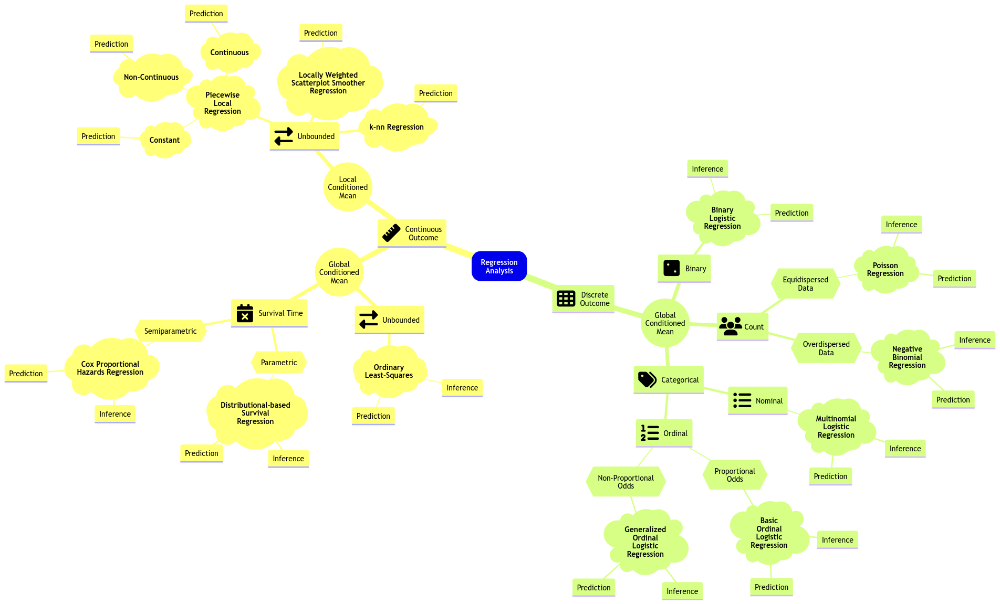



## Slides

<iframe src="../slides/Lecture6/lecture6_local_regression.html" width="100%" height="600px" style="border: none;"></iframe>

## Today's Learning Goals

By the end of this lecture, you should be able to:

- Define the concept of local regression.
- Model and perform piecewise constant, linear, and continuous linear local regressions.
- Extend the concept of $k$-NN classification to a regression framework.
- Define and apply locally weighted scatterplot smoother regression.

It is time to put aside regression techniques for the global conditioned mean and consider local alternatives suitable for predictions, as shown in @fig-reg-mindmap-6 (on the top left-hand side).

::: {#fig-reg-mindmap-6}
{.lightbox}

Expanded regression modelling mind map (**click on the image to zoom in**).
:::

## Piecewise Local Regression

Retaking our initial motivation in this course, the classical linear regression model (**Ordinary Least-squares, OLS**) is focused on the conditional mean on the regressors:

$$
\mathbb{E}(Y_i \mid X_{i,j} = x_{i,j}) = \beta_0 + \beta_1 x_{i,1} + \ldots + \beta_k x_{i,k} \; \; \; \; \text{since} \; \; \; \; \mathbb{E}(\varepsilon_i) = 0.
$$

We already stated that a model of this class, i.e. parametric, favours interpretability when we aim to make inference on the response and regressors.

Nonetheless, suppose our goal is an **accurate prediction** in many complex frameworks (e.g., non-linear). In that case, the global linearity in models such as the OLS case is not that flexible.

Therefore, we can use **local regression techniques**.

### Piecewise Constant Regression

This regression technique is based on fitting different **local OLS regressions**. The **step function** is the key concept here.

::: {.callout-important}
The idea behind the **step function** is to break the range of the regressor into intervals. In each interval, we adjust a constant. We obtain the average response in that interval.
:::

Let us take the 2-$d$ framework. For the $i$th observation in the sample, suppose we have a respose $Y_i$ subject to a regressor $X_i$.

Instead of making a **global parametric assumption**, we break the range of the regressor into $q$ **knots** $c_1, c_2, \dots, c_q$. Hence, the regressor will be sectioned in bins changing from continuous to categorical. The step functions are merely **dummy variables**.

$$
\begin{equation*}
C_0(X_i) = I(X_i < c_1) =
\begin{cases}
1 \; \; \; \; \mbox{if $X_i < c_1$},\\
0 \; \; \; \; 	\mbox{otherwise.}
\end{cases}
\end{equation*}
$$

$$
\begin{equation*}
C_1(X_i) = I(c_1 \leq X_i < c_2) =
\begin{cases}
1 \; \; \; \; \mbox{if $c_1 \leq X_i < c_2$},\\
0 \; \; \; \; 	\mbox{otherwise.}
\end{cases}
\end{equation*}
$$

$$\vdots$$

$$
\begin{equation*}
C_{q - 1}(X_i) = I(c_{q-1} \leq X_i < c_q) =
\begin{cases}
1 \; \; \; \; \mbox{if $c_{q-1} \leq X_i < c_q$},\\
0 \; \; \; \; 	\mbox{otherwise.}
\end{cases}
\end{equation*}
$$


$$
\begin{equation*}
C_q(X_i) = I(c_q \leq X_i) =
\begin{cases}
1 \; \; \; \; \mbox{if $c_q \leq X_i$},\\
0 \; \; \; \; 	\mbox{otherwise.}
\end{cases}
\end{equation*}
$$

Then, we run an OLS model based on these previous step functions and not the continuous $X_i$. The regression model becomes

$$
Y_i = \beta_0 + \beta_1 C_1(X_i) + \beta_2 C_2(X_i) + \dots + \beta_{q-1} C_{q-1}(X_i) + \beta_q C_q(X_i) + \varepsilon_i.
$${#eq-piecewise-constant}

::: {.callout-important}
The step function $C_0(X_i)$ does not appear in @eq-piecewise-constant given that $\beta_0$ can be interpreted as the response's mean when $X_i < c_1$ (i.e., the rest of the $q$ step functions are equal to zero).
:::

::: {.callout-note}
## The Cow Milk Dataset
We will use the dataset provided by [Henderson and McCulloch (1990)](https://ecommons.cornell.edu/bitstream/handle/1813/31620/BU-1049-MA.pdf;jsessionid=1E54532D482EC351824111A78C797021?sequence=1). The **whole dataset** contains the average daily milk `fat` yields from a cow in kg/day, from `week` 1 to 35. 
:::

Let us load this dataset and plot the corresponding data points.

```{webr}
#| autorun: true
#| message: false
#| warning: false
library(tidyverse)

fat_content <- read_csv("datasets/milk_fat.csv")
str(fat_content)
head(fat_content)
```

```{webr}
#| autorun: true
#| warning: false
#| fig-height: 9
#| fig-width: 12.5
plot_cow <- fat_content |> 
  ggplot(aes(week, fat)) +
  geom_point(size = 3) +
  labs(x = "Week", y = "Average Fat Yield \n (kg/day)") +
  ggtitle("Average Daily Fat Yield") +
  theme(
    plot.title = element_text(size = 24, face = "bold"),
    axis.text = element_text(size = 17),
    axis.title = element_text(size = 21))        
plot_cow
```

Now, let us fit a piecewise constant regression with $q = 4$ knots.

```{webr}
#| autorun: true
#| warning: false
# Define the number of step functions (q + 1).
breaks_q <- 5

# Create the steps for week.
fat_content <- fat_content |>
  mutate(steps = cut(fat_content$week,
    breaks = breaks_q,
    right = FALSE
  ))
# Checking levels in steps.
levels(fat_content$steps)
```

```{webr}
#| autorun: true
#| warning: false
fat_content
```

We can now fit the `model_steps` with `formula = fat ~ steps` via `lm()`. Then, we use `tidy()` and `glance()` to check the modelling output and metrics.

::: {.callout-important}
## Important
Note that `estimate` is the difference between each category with respect to the baseline `[0.966,7.8)`.
:::

```{webr}
#| autorun: true
#| warning: false
library(broom)

model_steps <- lm(fat ~ steps, data = fat_content)
tidy(model_steps) |> 
  mutate_if(is.numeric, round, 3)
```

```{webr}
#| autorun: true
#| warning: false
glance(model_steps) |> 
  mutate_if(is.numeric, round, 3)
```

Then, we create a grid to show the model's in-sample predictions and plot them accordingly.

```{webr}
#| autorun: true
#| warning: false
#| fig-height: 9
#| fig-width: 12.5
# Creating the grid for predictions.
grid <- fat_content |>
  data_grid(week = seq_range(week, 1000)) |>
  mutate(steps = cut(week, breaks_q, right = FALSE)) |>
  add_predictions(model_steps)

# Creating labels and plotting values for the knots.
labs <- levels(fat_content$steps)
steps <- tibble(
  lower = as.numeric(sub("\\[(.+),.*", "\\1", labs)),
  upper = as.numeric(sub("[^,]*,([^]]*)\\)", "\\1", labs))
)

# Plotting.
plot_cow +
  geom_line(aes(week, pred), data = grid, color = "blue") +
  geom_vline(xintercept = steps$lower[-1], linetype = "dashed")
```

Below, we show the predictions in column `grid$pred`.

```{webr}
#| autorun: true
#| warning: false
#| fig-height: 9
#| fig-width: 12.5
grid
```

::: {.callout-note}
# Exercise 23
Discuss the importance of this class of a local regression strategy of having breakpoints by regressor when having prediction inquiries. 
:::

### Non-Continuous Piecewise Linear Regression

Note in the previous plot, though, that the functions should not be constant inside an interval. Instead, **there is an approximately linear behaviour in each interval**.

> Can we capture that? Yes we can!

All we need to do, is to add **interaction terms** between the step functions $C_j(X_i)$, for $j = 1, \dots, q$, with $X_i$:

$$
\begin{align*}
Y_i &= \beta_0 + \beta_1 C_1(X_i) + \dots + \beta_q C_q(X_i) + \beta_{q + 1} X_i + \beta_{q + 2} X_i C_1(X_i) + \dots + \\
& \qquad \beta_{2q + 1} X_i C_q(X_i) + \varepsilon_i.
\end{align*}
$$

Let us see what happens in this model:

- If $X_i < c_1$, then our model is: $Y_i = \beta_0 + \beta_{q + 1}X_i$
- If $c_1 \leq X_i < c_2$, then our model is: $Y_i = \beta_0 + \beta_1 + (\beta_{q + 1} + \beta_{q + 2}) X_i$
- If $c_2 \leq X_i < c_3$, then our model is: $Y_i = \beta_0 + \beta_2 + (\beta_{q + 1} + \beta_{q + 3}) X_i$

$$\vdots$$

- If $c_{q-1} \leq X_i < c_q$, then our model is: $Y_i = \beta_0 + \beta_{q -1} + (\beta_{q + 1} + \beta_{2q}) X_i$
- If $c_q \leq X_i$, then our model is: $Y_i = \beta_0 + \beta_q + (\beta_{q + 1} + \beta_{2q + 1}) X_i$

So, **for each interval beginning $c_1$**, we have an **additional intercept** and an **additional slope**.

Now, we will check if the model fitting looks better in `fat_content`. Note that the right hand side in the `formula`, within `lm()`, is merely a model with interaction `week * steps`.

```{webr}
#| autorun: true
#| warning: false
#| fig-height: 9
#| fig-width: 12.5
# We need to add the interaction between steps and week.
model_piecewise_linear <- lm(fat ~ week * steps,
  data = fat_content
)

# Let us create our grid for predictions.
grid <- fat_content |>
  data_grid(week = seq_range(week, 1000)) |>
  mutate(steps = cut(week, breaks_q, right = FALSE)) |>
  add_predictions(model_piecewise_linear)

# Plotting.
plot_cow +
  geom_line(aes(week, pred), data = grid, color = "blue") +
  geom_vline(
    xintercept = steps$lower[-1], alpha = 1,
    linetype = "dashed"
  )
```

Let us check the model's summary.

```{webr}
#| autorun: true
#| warning: false
tidy(model_piecewise_linear) |> 
  mutate_if(is.numeric, round, 3)
```

```{webr}
#| autorun: true
#| warning: false
glance(model_piecewise_linear) |> 
  mutate_if(is.numeric, round, 3)
```

However, the local regression lines are disconnected. 

> Can we fix that?

### Continuous Piecewise Linear Regression

To fix the above matter, we can impose **restrictions** to make sure that the lines are connected to each other. Therefore, we need to introduce the concept of the hinge function.

For the $i$th observation, this model can be defined as follows:

$$Y_i = \beta_0 + \beta_1 X_i +\beta_2 (X_i - c_1)_{+} + \dots + \beta_{q+1} (X_i - c_q)_{+} + \varepsilon_i,$$

where the hinge function for the knot $c_j$ is

$$
(X_i - c_j)_{+} =
\begin{cases}
0 \; \; \; \; \mbox{if $X_i < c_j$},\\
X_i - c_j \; \; \; \;   \mbox{if $X_i \geq c_j$}.
\end{cases}
$$

We do not need to fit separate OLS linear regressions but one. In the `lm()` function, within `formula` on the right-hand side along with the standalone regressor `X`, we have to add up the following term 

`I((X - c_j)*(X >= c_j))`

**by knot `c_j`**.

We need to obtain the corresponding knots in `fat_content` ($q = 4$):

```{webr}
#| autorun: true
#| warning: false
levels(fat_content$steps)
knots <- c(7.8, 14.6, 21.4, 28.2)
```

Now, let us fit this model.

```{webr}
#| autorun: true
#| warning: false
model_piecewise_cont_linear <- lm(
  fat ~ week +
    I((week - knots[1]) * (week >= knots[1])) +
    I((week - knots[2]) * (week >= knots[2])) +
    I((week - knots[3]) * (week >= knots[3])) +
    I((week - knots[4]) * (week >= knots[4])),
  data = fat_content
)
```

Now, we will check if the model fitting looks better in `fat_content`.

```{webr}
#| autorun: true
#| warning: false
#| fig-height: 9
#| fig-width: 12.5
# Let us create our grid for predictions.
grid <- fat_content |>
  data_grid(week = seq_range(week, 1000)) |>
  mutate(steps = cut(week, breaks_q, right = FALSE)) |>
  add_predictions(model_piecewise_cont_linear)

# Plotting.
plot_cow +
  geom_line(aes(week, pred), data = grid, color = "blue") +
  geom_vline(xintercept = steps$lower[-1], alpha = 1, linetype = "dashed")
```

Let us check the model's summary.

```{webr}
#| autorun: true
#| warning: false
tidy(model_piecewise_cont_linear) |>
  mutate_if(is.numeric, round, 3)
```

```{webr}
#| autorun: true
#| warning: false
glance(model_piecewise_cont_linear) |>
  mutate_if(is.numeric, round, 3)
```

## $k$-NN Regression

::: {.callout-important}
We have been using the letter $k$ to denote the number of regressors in any general regression model. Nevertheless, this letter is reserved for groups of $k$ observations in this framework. **Therefore, we will switch to the letter $p$ to denote the number of regressors in $k$-NN regression.**
:::

The idea behind $k$-NN regression is finding the $k$ observations **in our training dataset of size $n$ (with $p$ features $x_j$ per observation)** closest to the new point we want to predict. 

Next, we calculate the average $\bar{y}^{(k)}$ of the responses of those $k$ observations. That is our new prediction.

How do we obtain those $k$ observations? **Based on the values of the respective $p$ features**, we determine which $k$ observations (out from the $n$ in the training set) have the smallest distance metric (e.g., Euclidean distance $D^{(\text{Training, New})}$) to the **features of the new point**.

$$
D^{(\text{Training, New})} = \sqrt{\sum_{j = 1}^p \Big( x_j^{\text{(Training)}} - x_j^{\text{(New)}} \Big)^2}
$$

::: {.callout-important}
## Important
We would compute $n$ distances $D^{(\text{Training, New})}$ using the same "$\text{New}$" observation. Then, there will be $k$ "$\text{Training}$" observations to be chosen out of these $n$ distances (where $n$ represents the total number of training data points).
:::

Things to keep in mind:

1. If $k = 1$, there will be **no training error**. Nevertheless, **we might (and probably will) overfit badly**. 
2. As we increase $k$, more **"smooth"** the estimated regression curve will be. At some point, **we will start underfitting**.

::: {.callout-note}
# Exercise 24
What are the consequences of overfitting a training set in further test sets?

**A.** There are no consequences at all; predictions will be highly accurate in any further test set.

**B.** The trained model will be so oversimplified that we will have a high bias in further test set predictions.

**C.** The trained model will be so overfitted that it will also explain random noise in training data. Therefore, we cannot generalize this model in further test set predictions.
:::

Now let us run the $k$-NN algorithm on the `fat_content` dataset. Feel free to experiment with the value of `k` to see how this regression approach behaves regarding in-sample predictions.

```{webr}
#| autorun: true
#| warning: false
#| fig-height: 12
#| fig-width: 12.5
# Sourcing plotting functions.
source("scripts/support_functions.R")

# Use odd numbers here so there is no missmatch on how the ties are handled.
k <- 7

# Running k-NN regression
my_knn <- knnreg(fat ~ week, data = fat_content, k = k)
grid <- fat_content |>
  data_grid(week) |>
  add_predictions(my_knn)

# Generating the plots.
p <- list()
for (i in 1:6) {
  p[[i]] <- knn_plot((i - 1) * 7 + 1, k) +
    geom_line(aes(week, pred), data = grid)
}

grid.arrange(grobs = p, ncol = 2)
```

## Locally Weighted Scatterplot Smoother (LOWESS) Regression

Suppose we want to predict the response $y$ for a given $x$. For example, we want to predict the fat content of cow milk in `week` 10. The idea of LOWESS is:

1. Find the closest points to `week` 10 (how many points is a parameter that we define).
2. From the selected points, we assign weights based on these distances. The closest the point is, the more weight it will receive (weights are determined as in Weighted Least-squares, WLS, by default in `loess()`).
3. Next, for the $i$th point in the `span`, using WLS for a **second `degree` polynomial** for instance, we minimize the sum of squared errors considering the weight $w_i$ as follows:
   
$$
\sum_i w_i \left(y_i - \beta_0-\beta_1 x_i-\beta_2 x_i^2\right)^2
$$


::: {.callout-important}
## Important
Roughly speaking, WLS is used when the error variance differs across observations. If $\mathrm{Var}(\varepsilon_i\mid x_i) = \sigma_i^2$, then (up to a constant factor) the standard choice is $w_i \propto 1/\sigma_i^2$. Using these weights can improve efficiency and helps model heteroscedasticity.
:::

::: {.callout-warning}
## Note
If you would like to see the derivations behind WLS, the following references are handy:

- NIST/SEMATECH e-Handbook: [Weighted Least Squares Regression](https://www.itl.nist.gov/div898/handbook/pmd/section1/pmd143.htm).
- NIST/SEMATECH e-Handbook: [Section 4.4.3.2](https://www.itl.nist.gov/div898/handbook/pmd/section4/pmd432.htm).
- Shalizi's (CMU) lecture notes: [Moving Beyond Conditional Expectations: Weighted Least
Squares, Heteroskedasticity, Local Polynomial Regression](https://www.stat.cmu.edu/~cshalizi/uADA/16/lectures/08.pdf) (matrix-based derivations).
:::

There are a couple of things to consider in `loess()`: 

- The parameter `span` (between `0` and `1`) defines the "*size*" of your neighbourhood. To be more exact, it specifies the proportion of points considered as neighbours of $x$. **The higher the proportion, the smoother the fitted surface will be.**
- The parameter `degree`, specifies if you are fitting a constant (`degree`= 0), a linear model (`degree` = 1), or a quadratic model (`degree` = 2). By quadratic, we mean $\beta_0+\beta_1 x_i+\beta_2 x_i^2$.

Using our training data, let us vary `degree` and `span` in the plot below.

```{webr}
#| autorun: true
#| warning: false
#| fig-height: 22
#| fig-width: 12.5
p <- list()
i <- 1
for (degree in seq(0, 2, 1)) {
  for (span in seq(0.25, 1, 0.25)) {
    model_loess <- loess(fat ~ week,
      span = span, degree = degree,
      data = fat_content
    )

    # We create our grid for predictions.
    grid <- fat_content |>
      data_grid(week = seq_range(week, 1000)) |>
      add_predictions(model_loess)

    # Plotting.
    p[[i]] <- plot_cow +
      geom_line(aes(week, pred), data = grid, color = "red") +
      theme(
        plot.title = element_text(size = 19),
        axis.text = element_text(size = 17),
        axis.title = element_text(size = 18)
      ) +
      ggtitle(paste0("degree = ", degree, "  span = ", span))

    i <- i + 1
  }
}

grid.arrange(grobs = p, ncol = 2)
```

## Wrapping Up

- Local regression is a great tool for addressing predictive inquiries.
- Nonetheless, we will lose our inferential interpretability.
- The key concept in local regression techniques is "*how local we want our model to be*."
